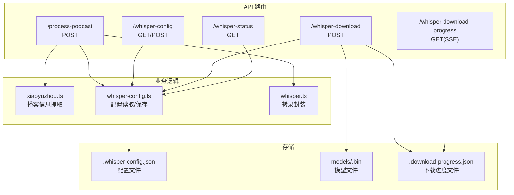
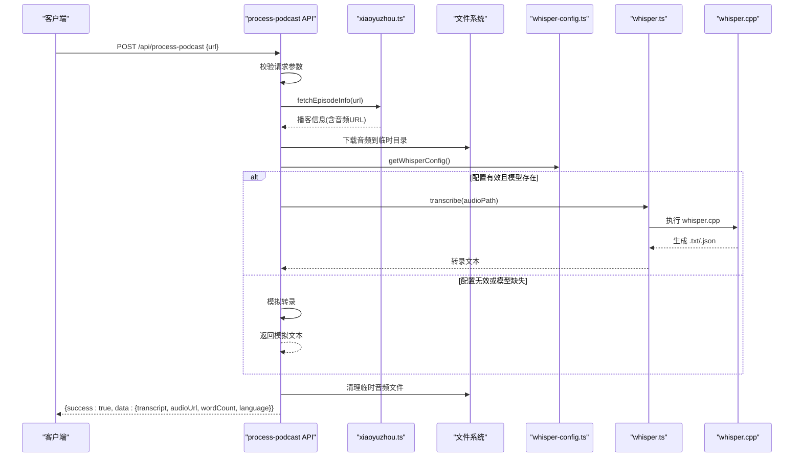
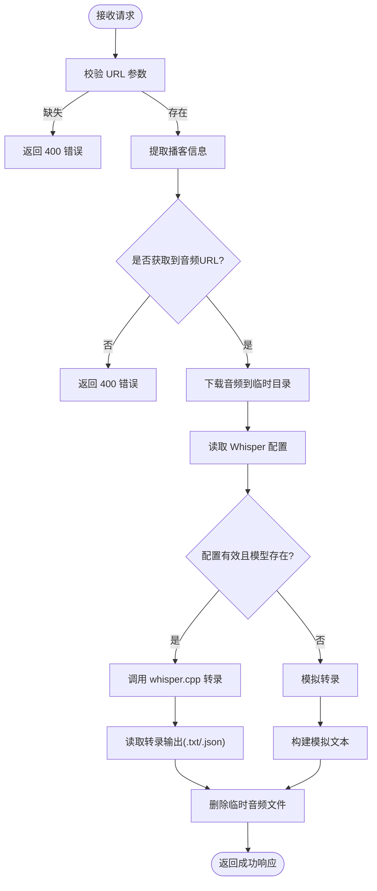
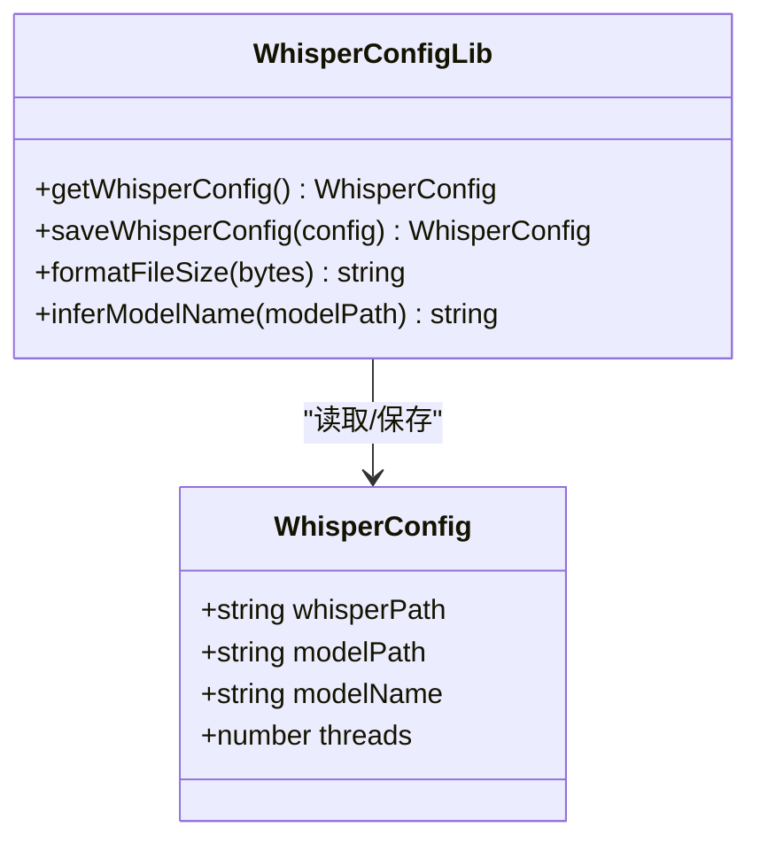
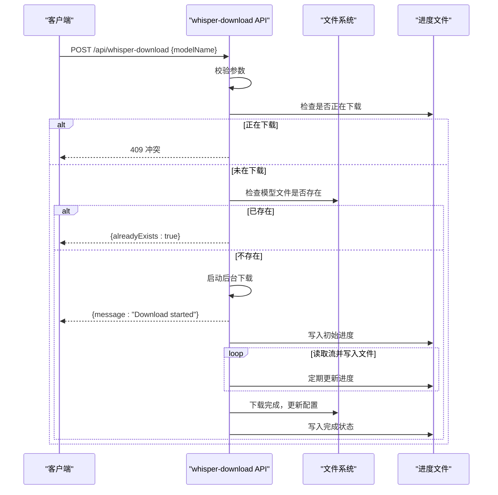
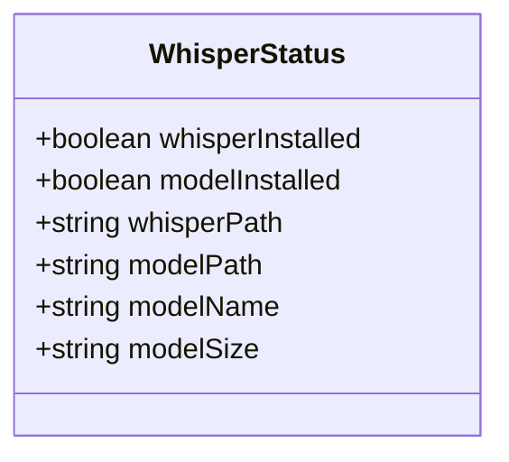
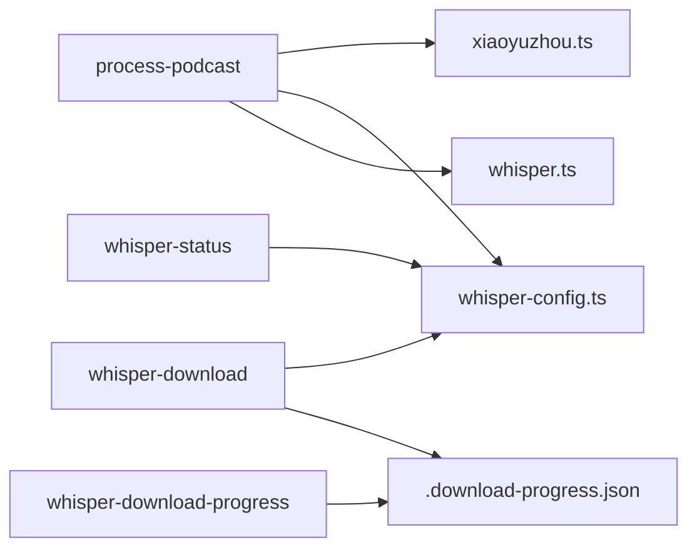

# API 接口文档

<cite>
**本文档引用的文件**
- [src/app/api/process-podcast/route.ts](file://src/app/api/process-podcast/route.ts)
- [src/app/api/whisper-config/route.ts](file://src/app/api/whisper-config/route.ts)
- [src/app/api/whisper-download/route.ts](file://src/app/api/whisper-download/route.ts)
- [src/app/api/whisper-download-progress/route.ts](file://src/app/api/whisper-download-progress/route.ts)
- [src/app/api/whisper-status/route.ts](file://src/app/api/whisper-status/route.ts)
- [src/lib/whisper-config.ts](file://src/lib/whisper-config.ts)
- [src/lib/whisper.ts](file://src/lib/whisper.ts)
- [src/lib/xiaoyuzhou.ts](file://src/lib/xiaoyuzhou.ts)
- [src/types/index.ts](file://src/types/index.ts)
- [src/components/whisper-settings.tsx](file://src/components/whisper-settings.tsx)
- [setup-whisper.sh](file://setup-whisper.sh)
- [package.json](file://package.json)
</cite>

## 目录
1. [简介](#简介)
2. [项目结构](#项目结构)
3. [核心组件](#核心组件)
4. [架构总览](#架构总览)
5. [详细组件分析](#详细组件分析)
6. [依赖关系分析](#依赖关系分析)
7. [性能考虑](#性能考虑)
8. [故障排除指南](#故障排除指南)
9. [结论](#结论)
10. [附录](#附录)

## 简介
MemoFlow 是一个基于 AI 的内容分析与创作助手，支持从多平台（如小宇宙）粘贴链接，自动提取核心观点并生成笔记/二次创作内容。本文档聚焦于 MemoFlow 的 API 层，特别是播客处理与 Whisper 配置管理相关接口，提供完整的 RESTful API 接口规范、统一响应格式、错误码定义、状态码说明以及使用示例。

## 项目结构
MemoFlow 的 API 路由位于 `src/app/api/` 目录下，按功能模块划分：
- `/process-podcast`: 播客处理与转录
- `/whisper-config`: Whisper 配置读取与更新
- `/whisper-download`: 模型下载触发
- `/whisper-download-progress`: 模型下载进度（SSE）
- `/whisper-status`: Whisper 状态查询

**图表来源**
- [src/app/api/process-podcast/route.ts:1-127](file://src/app/api/process-podcast/route.ts#L1-L127)
- [src/app/api/whisper-config/route.ts](file://src/app/api/whisper-config/route.ts)
- [src/app/api/whisper-download/route.ts:1-235](file://src/app/api/whisper-download/route.ts#L1-L235)
- [src/app/api/whisper-download-progress/route.ts:1-139](file://src/app/api/whisper-download-progress/route.ts#L1-L139)
- [src/app/api/whisper-status/route.ts:1-60](file://src/app/api/whisper-status/route.ts#L1-L60)
- [src/lib/whisper-config.ts:1-105](file://src/lib/whisper-config.ts#L1-L105)
- [src/lib/whisper.ts:1-229](file://src/lib/whisper.ts#L1-L229)
- [src/lib/xiaoyuzhou.ts:1-219](file://src/lib/xiaoyuzhou.ts#L1-L219)

**章节来源**
- [src/app/api/process-podcast/route.ts:1-127](file://src/app/api/process-podcast/route.ts#L1-L127)
- [src/app/api/whisper-config/route.ts](file://src/app/api/whisper-config/route.ts)
- [src/app/api/whisper-download/route.ts:1-235](file://src/app/api/whisper-download/route.ts#L1-L235)
- [src/app/api/whisper-download-progress/route.ts:1-139](file://src/app/api/whisper-download-progress/route.ts#L1-L139)
- [src/app/api/whisper-status/route.ts:1-60](file://src/app/api/whisper-status/route.ts#L1-L60)

## 核心组件
- 统一响应格式：所有 API 均返回统一的响应结构，包含 `success`、`data` 和 `error` 字段，便于前端统一处理。
- 数据模型：通过 TypeScript 类型定义了 `ApiResponse<T>`、`WhisperConfig`、`WhisperStatus` 等核心数据结构，确保前后端契约一致。
- 配置管理：Whisper 配置支持文件持久化与环境变量覆盖，提供灵活的部署能力。
- 下载进度：模型下载采用后台异步执行，并通过 SSE 实时推送进度，提升用户体验。

**章节来源**
- [src/types/index.ts:1-22](file://src/types/index.ts#L1-L22)
- [src/lib/whisper-config.ts:1-105](file://src/lib/whisper-config.ts#L1-L105)

## 架构总览
以下序列图展示了播客处理的完整工作流程，从链接验证到转录结果返回：

**图表来源**
- [src/app/api/process-podcast/route.ts:13-114](file://src/app/api/process-podcast/route.ts#L13-L114)
- [src/lib/xiaoyuzhou.ts:27-47](file://src/lib/xiaoyuzhou.ts#L27-L47)
- [src/lib/whisper-config.ts:54-71](file://src/lib/whisper-config.ts#L54-L71)
- [src/lib/whisper.ts:54-156](file://src/lib/whisper.ts#L54-L156)

## 详细组件分析

### 播客处理接口
- 端点：`POST /api/process-podcast`
- 请求体：
  - `url`: 播客链接（必填）
- 成功响应：
  - `success`: true
  - `data.transcript`: 转录文本
  - `data.audioUrl`: 音频原始链接
  - `data.wordCount`: 文本字数
  - `data.language`: 语言代码（固定为 zh）
- 失败响应：
  - `success`: false
  - `error`: 错误信息
- 处理流程要点：
  - 验证 URL 参数
  - 通过小宇宙工具提取音频 URL
  - 下载音频至系统临时目录
  - 读取 Whisper 配置，判断是否可用
  - 若配置有效则调用 whisper.cpp 进行转录；否则进行模拟转录
  - 清理临时文件并返回结果

**图表来源**
- [src/app/api/process-podcast/route.ts:13-114](file://src/app/api/process-podcast/route.ts#L13-L114)
- [src/lib/xiaoyuzhou.ts:27-47](file://src/lib/xiaoyuzhou.ts#L27-L47)
- [src/lib/whisper.ts:54-156](file://src/lib/whisper.ts#L54-L156)

**章节来源**
- [src/app/api/process-podcast/route.ts:13-114](file://src/app/api/process-podcast/route.ts#L13-L114)
- [src/lib/xiaoyuzhou.ts:27-47](file://src/lib/xiaoyuzhou.ts#L27-L47)

### Whisper 配置管理接口
- 端点：`GET /api/whisper-config`
  - 功能：读取当前 Whisper 配置（包含环境变量覆盖）
  - 成功响应：`{ success: true, data: WhisperConfig }`
  - 失败响应：`{ success: false, error: string }`
- 端点：`POST /api/whisper-config`
  - 请求体：`WhisperConfig`
  - 功能：保存配置到 `.whisper-config.json`（不包含环境变量），并返回合并后的配置
  - 成功响应：`{ success: true, data: WhisperConfig }`
  - 失败响应：`{ success: false, error: string }`
- 配置优先级：
  - 环境变量优先级最高（如 `WHISPER_PATH`、`WHISPER_MODEL_PATH`、`WHISPER_THREADS`）
  - 文件配置其次
  - 默认配置最低

**图表来源**
- [src/lib/whisper-config.ts:54-89](file://src/lib/whisper-config.ts#L54-L89)
- [src/types/index.ts:7-12](file://src/types/index.ts#L7-L12)

**章节来源**
- [src/app/api/whisper-config/route.ts](file://src/app/api/whisper-config/route.ts)
- [src/lib/whisper-config.ts:54-89](file://src/lib/whisper-config.ts#L54-L89)
- [src/types/index.ts:7-12](file://src/types/index.ts#L7-L12)

### 模型下载接口
- 端点：`POST /api/whisper-download`
- 请求体：
  - `modelName`: 模型名称，支持 `small`、`medium`
- 成功响应：
  - `{ success: true, message: "Download started" }`（立即返回）
  - 或 `{ success: true, message: "模型已存在", alreadyExists: true }`
- 并发控制：
  - 若同名模型正在下载，返回 409 冲突
- 后台执行：
  - 下载完成后更新配置文件中的 `modelPath` 和 `modelName`
  - 写入进度文件 `.download-progress.json`
- 进度追踪：
  - 通过 `/api/whisper-download-progress` 使用 SSE 推送下载进度

**图表来源**
- [src/app/api/whisper-download/route.ts:173-234](file://src/app/api/whisper-download/route.ts#L173-L234)
- [src/app/api/whisper-download-progress/route.ts:43-138](file://src/app/api/whisper-download-progress/route.ts#L43-L138)

**章节来源**
- [src/app/api/whisper-download/route.ts:173-234](file://src/app/api/whisper-download/route.ts#L173-L234)
- [src/app/api/whisper-download-progress/route.ts:43-138](file://src/app/api/whisper-download-progress/route.ts#L43-L138)

### 下载进度接口（SSE）
- 端点：`GET /api/whisper-download-progress`
- 协议：Server-Sent Events (SSE)
- 响应字段：
  - `status`: idle/downloading/completed/error
  - `downloaded`: 已下载字节数
  - `total`: 总字节数
  - `modelName`: 当前模型名称
  - `percent`: 百分比（自动计算）
  - `error`: 错误信息（当状态为 error 时）
- 客户端行为：
  - 初始立即推送当前状态
  - 每秒轮询进度文件并推送
  - 当状态为 completed 或 error 时延迟关闭连接

**章节来源**
- [src/app/api/whisper-download-progress/route.ts:43-138](file://src/app/api/whisper-download-progress/route.ts#L43-L138)

### Whisper 状态接口
- 端点：`GET /api/whisper-status`
- 功能：查询 whisper.cpp 安装状态、模型文件存在性、模型大小与模型名称
- 成功响应：`{ success: true, data: WhisperStatus }`
- 失败响应：`{ success: false, error: string }`

**图表来源**
- [src/types/index.ts:14-21](file://src/types/index.ts#L14-L21)

**章节来源**
- [src/app/api/whisper-status/route.ts:11-59](file://src/app/api/whisper-status/route.ts#L11-L59)
- [src/types/index.ts:14-21](file://src/types/index.ts#L14-L21)

## 依赖关系分析
- 组件耦合：
  - 播客处理 API 依赖小宇宙工具、配置管理与转录封装
  - 下载进度依赖进度文件，与下载 API 强关联
  - 状态接口依赖配置管理与文件系统
- 外部依赖：
  - 小宇宙官方 API、第三方 API、Hugging Face 镜像源
  - whisper.cpp 可执行文件与模型文件
- 潜在循环依赖：无直接循环，通过类型定义与工具函数解耦

**图表来源**
- [src/app/api/process-podcast/route.ts:1-127](file://src/app/api/process-podcast/route.ts#L1-L127)
- [src/app/api/whisper-download/route.ts:1-235](file://src/app/api/whisper-download/route.ts#L1-L235)
- [src/app/api/whisper-download-progress/route.ts:1-139](file://src/app/api/whisper-download-progress/route.ts#L1-L139)
- [src/app/api/whisper-status/route.ts:1-60](file://src/app/api/whisper-status/route.ts#L1-L60)
- [src/lib/whisper-config.ts:1-105](file://src/lib/whisper-config.ts#L1-L105)
- [src/lib/whisper.ts:1-229](file://src/lib/whisper.ts#L1-L229)
- [src/lib/xiaoyuzhou.ts:1-219](file://src/lib/xiaoyuzhou.ts#L1-L219)

**章节来源**
- [src/app/api/process-podcast/route.ts:1-127](file://src/app/api/process-podcast/route.ts#L1-L127)
- [src/app/api/whisper-download/route.ts:1-235](file://src/app/api/whisper-download/route.ts#L1-L235)
- [src/app/api/whisper-download-progress/route.ts:1-139](file://src/app/api/whisper-download-progress/route.ts#L1-L139)
- [src/app/api/whisper-status/route.ts:1-60](file://src/app/api/whisper-status/route.ts#L1-L60)
- [src/lib/whisper-config.ts:1-105](file://src/lib/whisper-config.ts#L1-L105)
- [src/lib/whisper.ts:1-229](file://src/lib/whisper.ts#L1-L229)
- [src/lib/xiaoyuzhou.ts:1-219](file://src/lib/xiaoyuzhou.ts#L1-L219)

## 性能考虑
- 模型下载：
  - 使用流式读取与定期进度更新，避免频繁磁盘写入
  - 支持并发下载控制，防止重复下载
- 转录性能：
  - 通过环境变量 `WHISPER_THREADS` 控制线程数
  - 建议设置为 CPU 核心数的一半以平衡吞吐与资源占用
- I/O 优化：
  - 临时文件清理及时，减少磁盘占用
  - SSE 进度推送间隔为 1 秒，兼顾实时性与性能

[本节为通用性能建议，无需特定文件来源]

## 故障排除指南
- 常见错误码与原因：
  - 400：缺少必要参数（如 URL）、无法获取音频 URL
  - 409：同名模型正在下载中
  - 500：服务器内部错误（网络异常、文件读写失败、转录执行失败）
- 典型问题排查：
  - whisper.cpp 未安装：检查 `WHISPER_PATH` 是否正确，参考安装脚本
  - 模型文件缺失：确认 `modelName` 与 `modelPath` 匹配，或通过下载接口重新下载
  - 下载中断：查看进度文件是否存在，清理后重新发起下载
  - 转录失败：检查 whisper.cpp 可执行权限与模型完整性

**章节来源**
- [src/app/api/process-podcast/route.ts:17-22](file://src/app/api/process-podcast/route.ts#L17-L22)
- [src/app/api/whisper-download/route.ts:186-199](file://src/app/api/whisper-download/route.ts#L186-L199)
- [src/app/api/whisper-status/route.ts:49-58](file://src/app/api/whisper-status/route.ts#L49-L58)

## 结论
MemoFlow 的 API 设计遵循 RESTful 原则，统一响应格式与清晰的错误处理提升了集成体验。播客处理流程从链接验证到转录结果返回完整闭环，Whisper 配置管理与模型下载接口提供了灵活的本地部署方案。通过 SSE 实时进度反馈与完善的错误处理，前端与第三方集成可以稳定地使用这些接口。

[本节为总结性内容，无需特定文件来源]

## 附录

### 统一响应格式规范
- 成功响应：`{ success: true, data: T }`
- 失败响应：`{ success: false, error: string }`
- 特殊情况：部分接口可能包含 `alreadyExists: boolean` 字段

**章节来源**
- [src/types/index.ts:1-5](file://src/types/index.ts#L1-L5)

### 错误码与状态码说明
- 400：请求参数无效或业务逻辑错误
- 409：资源冲突（如模型正在下载）
- 500：服务器内部错误

**章节来源**
- [src/app/api/process-podcast/route.ts:17-22](file://src/app/api/process-podcast/route.ts#L17-L22)
- [src/app/api/whisper-download/route.ts:186-199](file://src/app/api/whisper-download/route.ts#L186-L199)

### API 使用示例
- 获取播客转录：
  - POST `/api/process-podcast`
  - 请求体：`{ "url": "https://www.xiaoyuzhoufm.com/episode/<id>" }`
  - 成功响应：包含 `transcript`、`audioUrl`、`wordCount`、`language`
- 下载模型并追踪进度：
  - POST `/api/whisper-download`：`{ "modelName": "small" }`
  - GET `/api/whisper-download-progress`：SSE 流
- 查询状态：
  - GET `/api/whisper-status`：返回安装状态与模型信息

**章节来源**
- [src/components/whisper-settings.tsx:74-101](file://src/components/whisper-settings.tsx#L74-L101)
- [src/components/whisper-settings.tsx:156-187](file://src/components/whisper-settings.tsx#L156-L187)
- [src/components/whisper-settings.tsx:119-154](file://src/components/whisper-settings.tsx#L119-L154)

### 认证方法与安全考虑
- 认证：当前 API 未实现鉴权机制，建议在生产环境中增加鉴权层（如 JWT、API Key）
- 安全：限制请求体大小、对输入 URL 进行白名单校验、对临时文件与模型文件设置最小权限

[本节为通用安全建议，无需特定文件来源]

### 部署与环境变量
- 环境变量：
  - `WHISPER_PATH`: whisper.cpp 可执行文件路径
  - `WHISPER_MODEL_PATH`: 模型文件路径
  - `WHISPER_THREADS`: 转录线程数
- 安装脚本：参考 `setup-whisper.sh` 完成初始化

**章节来源**
- [src/lib/whisper-config.ts:37-46](file://src/lib/whisper-config.ts#L37-L46)
- [setup-whisper.sh:1-47](file://setup-whisper.sh#L1-L47)