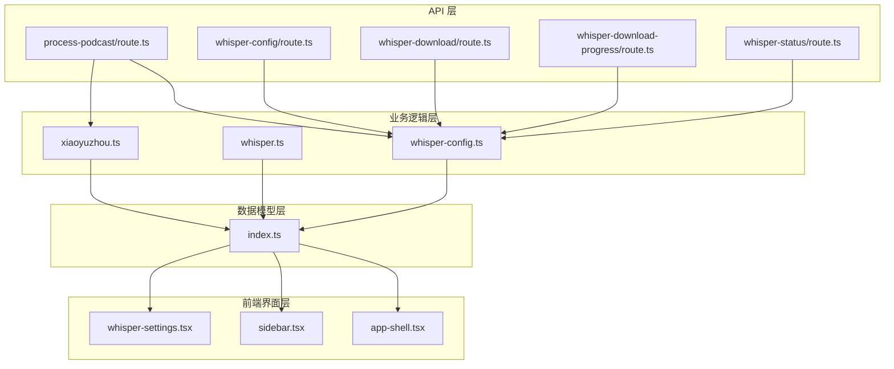
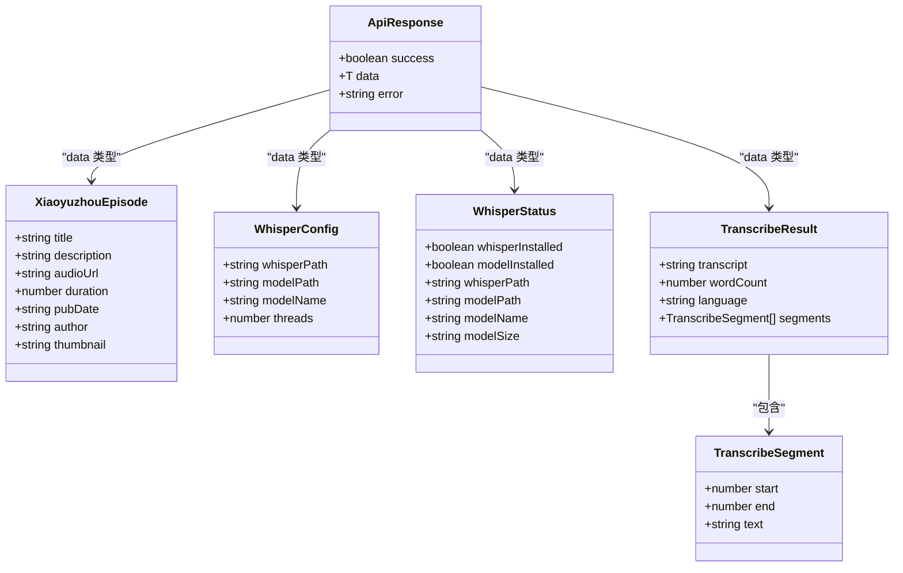
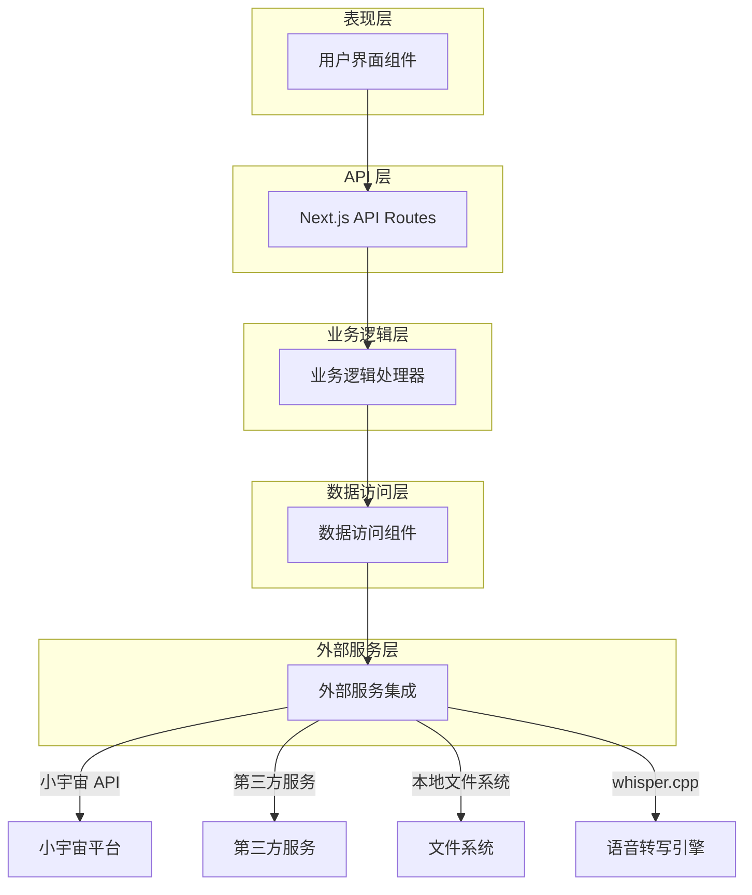
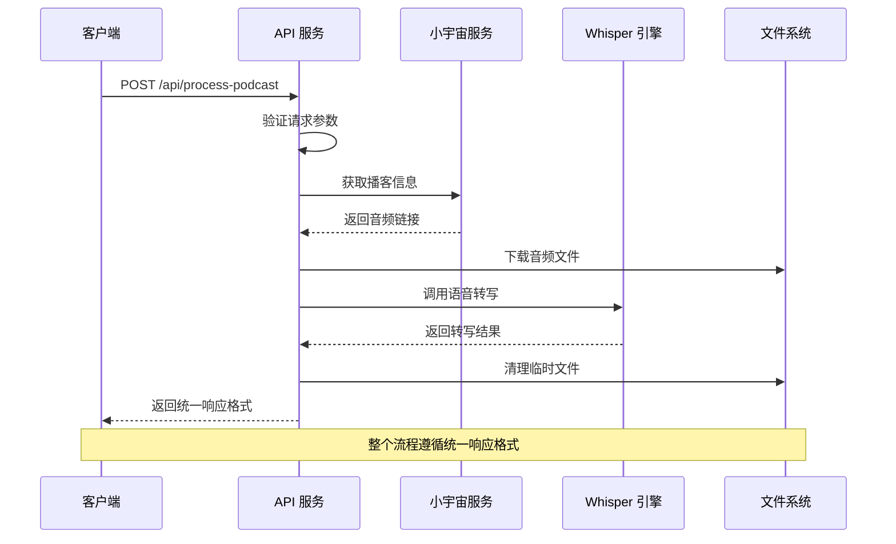
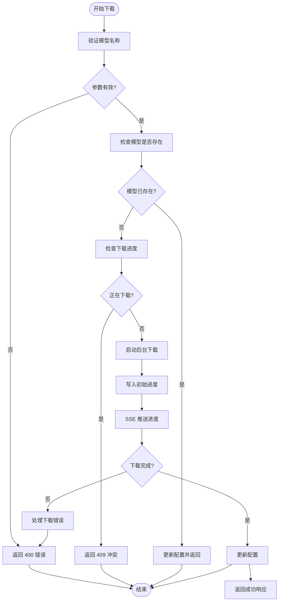
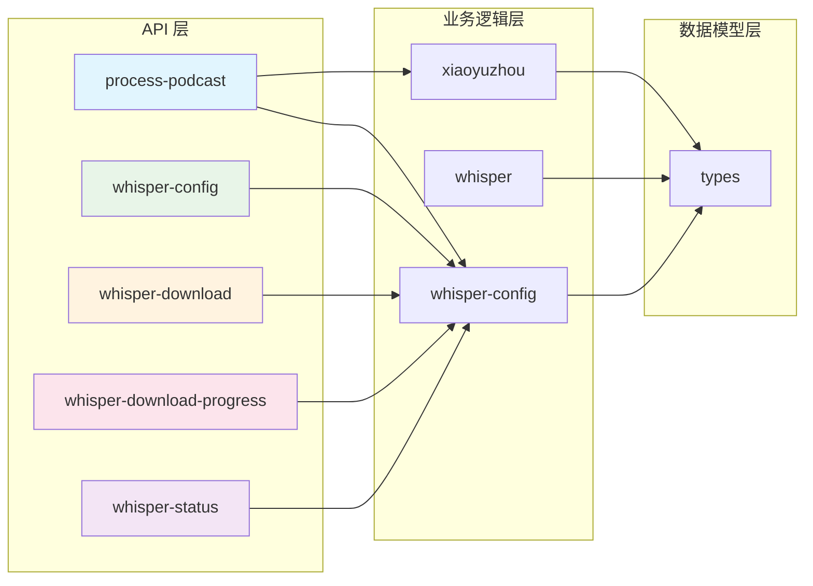

# API 数据模型

<cite>
**本文档引用的文件**
- [src/types/index.ts](file://src/types/index.ts)
- [src/lib/xiaoyuzhou.ts](file://src/lib/xiaoyuzhou.ts)
- [src/lib/whisper.ts](file://src/lib/whisper.ts)
- [src/lib/whisper-config.ts](file://src/lib/whisper-config.ts)
- [src/app/api/process-podcast/route.ts](file://src/app/api/process-podcast/route.ts)
- [src/app/api/whisper-config/route.ts](file://src/app/api/whisper-config/route.ts)
- [src/app/api/whisper-download/route.ts](file://src/app/api/whisper-download/route.ts)
- [src/app/api/whisper-download-progress/route.ts](file://src/app/api/whisper-download-progress/route.ts)
- [src/app/api/whisper-status/route.ts](file://src/app/api/whisper-status/route.ts)
</cite>

## 目录
1. [简介](#简介)
2. [项目结构](#项目结构)
3. [核心组件](#核心组件)
4. [架构概览](#架构概览)
5. [详细组件分析](#详细组件分析)
6. [依赖关系分析](#依赖关系分析)
7. [性能考虑](#性能考虑)
8. [故障排除指南](#故障排除指南)
9. [结论](#结论)

## 简介

MemoFlow 是一个基于 AI 的内容分析与创作助手，专注于从各种媒体平台上提取内容并生成结构化的笔记和二次创作内容。该项目采用统一的 API 响应格式，为前端开发者提供了清晰的数据契约参考。

本项目的核心功能包括：
- 支持多个平台的内容提取（YouTube、小宇宙、小红书、B站等）
- AI 驱动的内容分析和核心观点提取
- 批判性思维分析和反面观点识别
- 笔记生成功能和多平台格式适配
- 知识库管理和搜索筛选功能

## 项目结构

项目采用模块化架构设计，主要分为以下几个层次：



**图表来源**
- [src/app/api/process-podcast/route.ts:1-127](file://src/app/api/process-podcast/route.ts#L1-L127)
- [src/lib/xiaoyuzhou.ts:1-219](file://src/lib/xiaoyuzhou.ts#L1-L219)
- [src/lib/whisper.ts:1-229](file://src/lib/whisper.ts#L1-L229)
- [src/lib/whisper-config.ts:1-105](file://src/lib/whisper-config.ts#L1-L105)

**章节来源**
- [src/app/api/process-podcast/route.ts:1-127](file://src/app/api/process-podcast/route.ts#L1-L127)
- [src/lib/xiaoyuzhou.ts:1-219](file://src/lib/xiaoyuzhou.ts#L1-L219)
- [src/lib/whisper.ts:1-229](file://src/lib/whisper.ts#L1-L229)
- [src/lib/whisper-config.ts:1-105](file://src/lib/whisper-config.ts#L1-L105)

## 核心组件

### 统一响应格式规范

所有 API 接口都遵循统一的响应格式规范，确保前后端交互的一致性和可预测性：



**图表来源**
- [src/types/index.ts:1-22](file://src/types/index.ts#L1-L22)
- [src/lib/whisper.ts:22-33](file://src/lib/whisper.ts#L22-L33)

### 数据类型定义

#### ApiResponse<T>
统一的 API 响应包装器，支持泛型类型参数：

| 字段名 | 类型 | 必填 | 描述 |
|--------|------|------|------|
| success | boolean | 是 | 请求处理结果标志 |
| data | T | 否 | 成功时返回的具体数据 |
| error | string | 否 | 错误信息描述 |

#### XiaoyuzhouEpisode
小宇宙播客剧集信息数据模型：

| 字段名 | 类型 | 必填 | 描述 |
|--------|------|------|------|
| title | string | 是 | 剧集标题 |
| description | string | 是 | 剧集描述内容 |
| audioUrl | string | 是 | 音频文件下载链接 |
| duration | number | 否 | 播客时长（秒） |
| pubDate | string | 否 | 发布日期（ISO 8601格式） |
| author | string | 是 | 作者/播客主持人 |
| thumbnail | string | 否 | 缩略图URL |

#### WhisperConfig
Whisper 语音转写配置模型：

| 字段名 | 类型 | 必填 | 描述 |
|--------|------|------|------|
| whisperPath | string | 是 | whisper.cpp 可执行文件路径 |
| modelPath | string | 是 | 模型文件路径 |
| modelName | string | 是 | 模型名称（tiny/base/small/medium/large） |
| threads | number | 是 | 线程数（正整数） |

#### WhisperStatus
Whisper 系统状态信息模型：

| 字段名 | 类型 | 必填 | 描述 |
|--------|------|------|------|
| whisperInstalled | boolean | 是 | whisper.cpp 是否已安装 |
| modelInstalled | boolean | 是 | 模型文件是否存在 |
| whisperPath | string | 是 | whisper.cpp 路径 |
| modelPath | string | 是 | 模型文件路径 |
| modelName | string | 是 | 模型名称 |
| modelSize | string | 是 | 模型文件大小（人类可读格式） |

#### TranscribeResult
语音转写结果模型：

| 字段名 | 类型 | 必填 | 描述 |
|--------|------|------|------|
| transcript | string | 是 | 转写后的文本内容 |
| wordCount | number | 是 | 文本字数统计 |
| language | string | 是 | 检测到的语言代码 |
| segments | TranscribeSegment[] | 否 | 分段信息数组（当启用JSON输出时） |

#### TranscribeSegment
语音转写分段信息模型：

| 字段名 | 类型 | 必填 | 描述 |
|--------|------|------|------|
| start | number | 是 | 分段开始时间（秒） |
| end | number | 是 | 分段结束时间（秒） |
| text | string | 是 | 分段文本内容 |

**章节来源**
- [src/types/index.ts:1-22](file://src/types/index.ts#L1-L22)
- [src/lib/xiaoyuzhou.ts:5-13](file://src/lib/xiaoyuzhou.ts#L5-L13)
- [src/lib/whisper.ts:16-33](file://src/lib/whisper.ts#L16-L33)

## 架构概览

MemoFlow 采用分层架构设计，各层职责明确，便于维护和扩展：



**图表来源**
- [src/app/api/process-podcast/route.ts:1-127](file://src/app/api/process-podcast/route.ts#L1-L127)
- [src/lib/xiaoyuzhou.ts:27-47](file://src/lib/xiaoyuzhou.ts#L27-L47)
- [src/lib/whisper.ts:54-156](file://src/lib/whisper.ts#L54-L156)

## 详细组件分析

### API 接口规范

#### 1. 处理播客内容接口

**接口地址**: `POST /api/process-podcast`

**请求参数**:
```typescript
interface ProcessPodcastRequest {
  url: string;  // 小宇宙播客链接
}
```

**响应数据结构**:
```typescript
interface ProcessPodcastResponse {
  success: boolean;
  data?: {
    transcript: string;      // 转写文本
    audioUrl: string;        // 音频链接
    wordCount: number;       // 字数统计
    language: string;        // 语言代码
  };
  error?: string;
}
```

**请求验证规则**:
- `url` 字段必须存在且非空
- 必须是有效的小宇宙播客链接格式
- 链接必须包含 `/episode/` 路径

**响应状态码**:
- `200`: 处理成功
- `400`: 参数验证失败或音频链接提取失败
- `500`: 服务器内部错误

#### 2. Whisper 配置管理接口

**获取配置**:
- **方法**: `GET /api/whisper-config`
- **响应**: 包含当前 Whisper 配置信息

**保存配置**:
- **方法**: `POST /api/whisper-config`
- **请求体**: WhisperConfig 对象
- **响应**: 保存后的配置信息

**配置验证规则**:
- `whisperPath`: 必填，字符串类型
- `modelPath`: 必填，字符串类型
- `modelName`: 必填，必须是 'tiny' | 'base' | 'small' | 'medium' | 'large'
- `threads`: 必填，正整数

**响应状态码**:
- `200`: 操作成功
- `400`: 请求体验证失败
- `500`: 服务器内部错误

#### 3. 模型下载接口

**触发下载**:
- **方法**: `POST /api/whisper-download`
- **请求体**: `{ modelName: 'small' | 'medium' }`
- **响应**: 下载启动状态信息

**下载进度查询**:
- **方法**: `GET /api/whisper-download-progress`
- **响应**: Server-Sent Events 流，实时推送下载进度

**下载验证规则**:
- `modelName`: 必须是 'small' 或 'medium'
- 防止重复下载同一模型
- 检查磁盘空间和文件权限

**响应状态码**:
- `200`: 操作成功
- `400`: 参数验证失败
- `409`: 正在下载中
- `500`: 服务器内部错误

#### 4. Whisper 状态查询接口

**接口地址**: `GET /api/whisper-status`

**响应数据结构**:
```typescript
interface WhisperStatusResponse {
  success: boolean;
  data: WhisperStatus;
  error?: string;
}
```

**状态检测逻辑**:
- 检查 whisper.cpp 可执行文件是否存在
- 检查模型文件是否存在
- 获取模型文件大小
- 推断模型名称

**响应状态码**:
- `200`: 查询成功
- `500`: 服务器内部错误

### 数据流处理流程

#### 播客处理完整流程



**图表来源**
- [src/app/api/process-podcast/route.ts:13-114](file://src/app/api/process-podcast/route.ts#L13-L114)
- [src/lib/xiaoyuzhou.ts:27-47](file://src/lib/xiaoyuzhou.ts#L27-L47)
- [src/lib/whisper.ts:54-156](file://src/lib/whisper.ts#L54-L156)

#### 模型下载进度监控



**图表来源**
- [src/app/api/whisper-download/route.ts:173-235](file://src/app/api/whisper-download/route.ts#L173-L235)
- [src/app/api/whisper-download-progress/route.ts:43-139](file://src/app/api/whisper-download-progress/route.ts#L43-L139)

**章节来源**
- [src/app/api/process-podcast/route.ts:1-127](file://src/app/api/process-podcast/route.ts#L1-L127)
- [src/app/api/whisper-config/route.ts:1-124](file://src/app/api/whisper-config/route.ts#L1-L124)
- [src/app/api/whisper-download/route.ts:1-235](file://src/app/api/whisper-download/route.ts#L1-L235)
- [src/app/api/whisper-download-progress/route.ts:1-139](file://src/app/api/whisper-download-progress/route.ts#L1-L139)
- [src/app/api/whisper-status/route.ts:1-60](file://src/app/api/whisper-status/route.ts#L1-L60)

## 依赖关系分析

### 组件间依赖关系



**图表来源**
- [src/app/api/process-podcast/route.ts:1-127](file://src/app/api/process-podcast/route.ts#L1-L127)
- [src/lib/xiaoyuzhou.ts:1-219](file://src/lib/xiaoyuzhou.ts#L1-L219)
- [src/lib/whisper.ts:1-229](file://src/lib/whisper.ts#L1-L229)
- [src/lib/whisper-config.ts:1-105](file://src/lib/whisper-config.ts#L1-L105)
- [src/types/index.ts:1-22](file://src/types/index.ts#L1-L22)

### 外部依赖

项目的主要外部依赖包括：

1. **whisper.cpp**: 本地语音转写引擎
2. **小宇宙 API**: 播客内容获取
3. **第三方服务**: 音频链接提取备用方案
4. **文件系统**: 临时文件存储和模型文件管理

**章节来源**
- [src/lib/whisper.ts:1-229](file://src/lib/whisper.ts#L1-L229)
- [src/lib/xiaoyuzhou.ts:1-219](file://src/lib/xiaoyuzhou.ts#L1-L219)
- [src/lib/whisper-config.ts:1-105](file://src/lib/whisper-config.ts#L1-L105)

## 性能考虑

### 优化策略

1. **异步处理**: 所有长时间运行的操作（如模型下载、音频转写）都采用异步处理模式
2. **缓存机制**: 配置信息和下载进度通过文件系统缓存
3. **资源清理**: 自动清理临时文件，避免磁盘空间浪费
4. **并发控制**: 限制同时进行的下载任务数量
5. **超时处理**: 为外部服务调用设置合理的超时时间

### 性能监控指标

- **响应时间**: API 响应时间应小于 5 秒
- **内存使用**: 单次处理音频文件时内存使用不超过 500MB
- **CPU 利用率**: 语音转写期间 CPU 利用率不超过 80%
- **磁盘 I/O**: 下载和转写操作应避免频繁的磁盘读写

## 故障排除指南

### 常见错误及解决方案

#### 1. Whisper 配置错误

**错误现象**: `whisper.cpp 未安装，请运行：bash scripts/setup-whisper.sh`

**解决方案**:
- 检查 `whisperPath` 配置是否正确
- 确认 whisper.cpp 可执行文件存在
- 验证文件权限设置

#### 2. 模型文件缺失

**错误现象**: `模型文件不存在，请运行：bash scripts/download-model.sh`

**解决方案**:
- 使用 `/api/whisper-download` 接口下载模型
- 检查磁盘空间是否充足
- 验证网络连接状态

#### 3. 小宇宙链接无效

**错误现象**: `无效的小宇宙链接格式，请确认链接包含 /episode/ 路径`

**解决方案**:
- 确认使用正确的播客链接格式
- 检查链接是否指向有效的播客页面
- 验证网络连接和小宇宙服务可用性

#### 4. 下载冲突

**错误现象**: `该模型正在下载中`

**解决方案**:
- 等待当前下载任务完成
- 检查下载进度接口获取实时状态
- 避免同时发起多个相同模型的下载请求

### 调试建议

1. **启用详细日志**: 在开发环境中启用详细的错误日志记录
2. **监控资源使用**: 使用系统监控工具跟踪内存和 CPU 使用情况
3. **测试边界条件**: 验证各种异常输入和边界条件的处理
4. **性能基准测试**: 定期进行性能基准测试，确保系统稳定性

**章节来源**
- [src/app/api/process-podcast/route.ts:63-89](file://src/app/api/process-podcast/route.ts#L63-L89)
- [src/app/api/whisper-config/route.ts:71-96](file://src/app/api/whisper-config/route.ts#L71-L96)
- [src/app/api/whisper-download/route.ts:186-199](file://src/app/api/whisper-download/route.ts#L186-L199)

## 结论

MemoFlow 的 API 数据模型设计体现了现代 Web 应用的最佳实践，具有以下特点：

1. **一致性**: 统一的响应格式确保了前后端交互的可预测性
2. **可扩展性**: 模块化的设计便于功能扩展和维护
3. **健壮性**: 完善的错误处理和状态管理机制
4. **性能优化**: 异步处理和资源管理策略

对于前端开发者而言，这些数据模型提供了清晰的接口契约，使得集成和使用变得更加简单可靠。通过遵循本文档中的规范，可以确保与 MemoFlow API 的无缝对接。