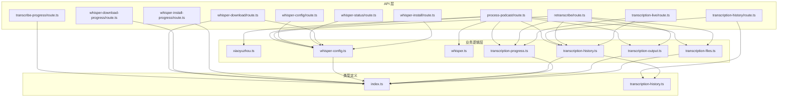
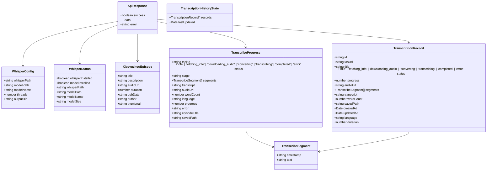
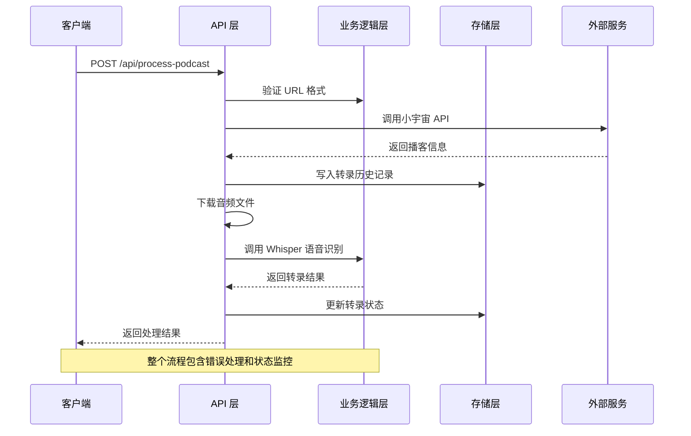
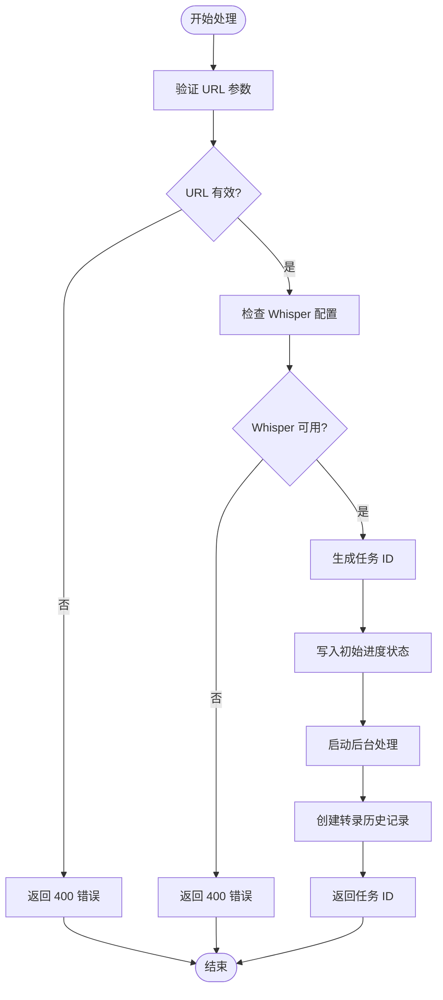
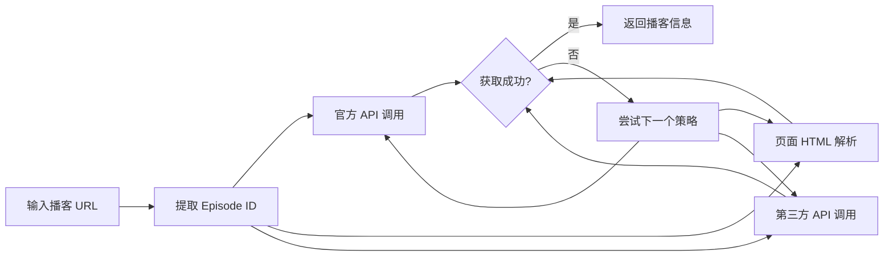

# 核心 API 接口

<cite>
**本文档引用的文件**
- [process-podcast/route.ts](file://src/app/api/process-podcast/route.ts)
- [transcribe-progress/route.ts](file://src/app/api/transcribe-progress/route.ts)
- [whisper-config/route.ts](file://src/app/api/whisper-config/route.ts)
- [whisper-status/route.ts](file://src/app/api/whisper-status/route.ts)
- [whisper-download/route.ts](file://src/app/api/whisper-download/route.ts)
- [whisper-download-progress/route.ts](file://src/app/api/whisper-download-progress/route.ts)
- [whisper-install/route.ts](file://src/app/api/whisper-install/route.ts)
- [whisper-install-progress/route.ts](file://src/app/api/whisper-install-progress/route.ts)
- [transcription-history/route.ts](file://src/app/api/transcription-history/route.ts)
- [retranscribe/route.ts](file://src/app/api/retranscribe/route.ts)
- [transcription-live/route.ts](file://src/app/api/transcription-live/route.ts)
- [transcription-history.ts](file://src/lib/transcription-history.ts)
- [transcription-progress.ts](file://src/lib/transcription-progress.ts)
- [transcription-output.ts](file://src/lib/transcription-output.ts)
- [transcription-files.ts](file://src/lib/transcription-files.ts)
- [whisper-config.ts](file://src/lib/whisper-config.ts)
- [xiaoyuzhou.ts](file://src/lib/xiaoyuzhou.ts)
- [whisper.ts](file://src/lib/whisper.ts)
- [index.ts](file://src/types/index.ts)
- [transcription-history.ts](file://src/types/transcription-history.ts)
- [package.json](file://package.json)
</cite>

## 更新摘要
**所做更改**
- 新增转录历史管理API端点（/api/transcription-history CRUD操作）
- 新增重新转录功能API端点（/api/retranscribe）
- 新增实时转录流API端点（/api/transcription-live）
- 扩展播客处理流程以支持历史记录管理
- 增强转录进度跟踪和状态监控功能
- 完善转录历史数据持久化机制
- 优化实时进度合并策略和状态同步

## 目录
1. [简介](#简介)
2. [项目结构](#项目结构)
3. [核心组件](#核心组件)
4. [架构概览](#架构概览)
5. [详细组件分析](#详细组件分析)
6. [依赖关系分析](#依赖关系分析)
7. [性能考虑](#性能考虑)
8. [故障排除指南](#故障排除指南)
9. [结论](#结论)

## 简介

MemoFlow 是一个基于 AI 的内容分析与创作助手，专注于从播客内容中提取核心观点并生成笔记。本文档详细介绍了系统的核心 API 接口，特别是播客处理接口的工作流程，以及 Whisper 语音识别配置管理的相关功能。

**更新** 新增了完整的转录历史管理、重新转录和实时监控功能，包括：
- 转录历史的完整 CRUD 操作
- 重新转录机制，支持对已有记录的重新处理
- 实时转录进度的 Server-Sent Events 流
- 增强的状态管理和数据持久化
- 优化的进度文件合并策略

## 项目结构

项目采用 Next.js 应用程序结构，核心 API 接口位于 `src/app/api/` 目录下，业务逻辑封装在 `src/lib/` 目录中，类型定义位于 `src/types/` 目录中。



**图表来源**
- [process-podcast/route.ts:1-406](file://src/app/api/process-podcast/route.ts#L1-L406)
- [transcription-history/route.ts:1-80](file://src/app/api/transcription-history/route.ts#L1-L80)
- [retranscribe/route.ts:1-364](file://src/app/api/retranscribe/route.ts#L1-L364)
- [transcription-live/route.ts:1-119](file://src/app/api/transcription-live/route.ts#L1-L119)

**章节来源**
- [process-podcast/route.ts:1-406](file://src/app/api/process-podcast/route.ts#L1-L406)
- [transcription-history/route.ts:1-80](file://src/app/api/transcription-history/route.ts#L1-L80)
- [retranscribe/route.ts:1-364](file://src/app/api/retranscribe/route.ts#L1-L364)
- [transcription-live/route.ts:1-119](file://src/app/api/transcription-live/route.ts#L1-L119)

## 核心组件

### 数据模型

系统使用统一的响应格式，所有 API 接口都遵循相同的响应结构：



**图表来源**
- [index.ts:1-43](file://src/types/index.ts#L1-L43)
- [transcription-history.ts:1-23](file://src/types/transcription-history.ts#L1-L23)

**章节来源**
- [index.ts:1-43](file://src/types/index.ts#L1-L43)
- [transcription-history.ts:1-23](file://src/types/transcription-history.ts#L1-L23)

## 架构概览

MemoFlow 的整体架构采用分层设计，API 层负责处理 HTTP 请求，业务逻辑层封装核心功能，数据层管理配置和状态。



**图表来源**
- [process-podcast/route.ts:343-396](file://src/app/api/process-podcast/route.ts#L343-L396)
- [xiaoyuzhou.ts:27-47](file://src/lib/xiaoyuzhou.ts#L27-L47)

## 详细组件分析

### 播客处理接口 (POST /api/process-podcast)

这是系统的核心功能接口，负责从播客 URL 提取音频并进行语音识别。

#### 接口规范

**请求方法**: `POST`
**请求地址**: `/api/process-podcast`
**请求头**: `Content-Type: application/json`

**请求参数**:
```json
{
  "url": "string"  // 小宇宙播客链接，必填
}
```

**响应格式**:
```json
{
  "success": true,
  "data": {
    "taskId": "string"  // 任务 ID，用于进度查询
  }
}
```

**错误码**:
- `400`: URL 缺失或格式无效
- `400`: whisper.cpp 未安装
- `400`: 模型文件不存在
- `500`: 处理播客失败

#### 完整工作流程



**图表来源**
- [process-podcast/route.ts:343-396](file://src/app/api/process-podcast/route.ts#L343-L396)

#### 转录历史管理

播客处理完成后，系统会自动创建转录历史记录：

1. **记录创建**: 使用任务 ID 作为记录 ID
2. **状态初始化**: 设置初始状态为 `fetching_info`
3. **进度跟踪**: 通过进度文件和数据库双重存储
4. **状态更新**: 实时更新转录状态和进度

#### URL 验证机制

接口实现了多层次的 URL 验证：

1. **基本参数验证**: 检查 `url` 参数是否存在
2. **格式验证**: 通过小宇宙 API 的 `fetchEpisodeInfo` 函数验证 URL 格式
3. **内容验证**: 确保能从小宇宙 API 正确提取到音频链接

#### 小宇宙 API 集成策略

系统采用多策略获取播客信息：



**图表来源**
- [xiaoyuzhou.ts:27-47](file://src/lib/xiaoyuzhou.ts#L27-L47)

#### Whisper 语音识别集成

接口支持两种运行模式：

1. **本地 Whisper 模型**: 当配置文件存在且路径有效时
2. **实时进度监控**: 通过 SSE 推送转录进度

**章节来源**
- [process-podcast/route.ts:343-396](file://src/app/api/process-podcast/route.ts#L343-L396)
- [xiaoyuzhou.ts:27-47](file://src/lib/xiaoyuzhou.ts#L27-L47)

### 转录进度查询接口 (GET /api/transcribe-progress)

**功能**: 通过 Server-Sent Events 推送转录进度状态

**请求方法**: `GET`
**请求地址**: `/api/transcribe-progress?taskId=xxx`

**查询参数**:
- `taskId` (必填): 任务 ID，必须是字母数字和下划线的组合

**响应格式**:
```json
{
  "taskId": "string",
  "status": "'idle' | 'fetching_info' | 'downloading_audio' | 'converting' | 'transcribing' | 'completed' | 'error'",
  "stage": "string",
  "segments": [
    {
      "timestamp": "string",
      "text": "string"
    }
  ],
  "progress": 0,
  "episodeTitle": "string",
  "audioUrl": "string",
  "transcript": "string",
  "wordCount": 0,
  "language": "string",
  "error": "string",
  "savedPath": "string"
}
```

**章节来源**
- [transcribe-progress/route.ts:28-121](file://src/app/api/transcribe-progress/route.ts#L28-L121)

### 转录历史管理接口

#### GET /api/transcription-history

**功能**: 获取转录历史记录，支持单条记录查询和全量查询

**请求方法**: `GET`
**请求地址**: `/api/transcription-history`

**查询参数**:
- `id` (可选): 单条记录的 ID，如果提供则返回指定记录

**响应格式**:
```json
{
  "success": true,
  "data": TranscriptionRecord | TranscriptionRecord[]
}
```

#### DELETE /api/transcription-history

**功能**: 删除指定的转录历史记录

**请求方法**: `DELETE`
**请求地址**: `/api/transcription-history?id=xxx`

**查询参数**:
- `id` (必填): 要删除的记录 ID

**响应格式**:
```json
{
  "success": true,
  "message": "转录记录已删除"
}
```

**章节来源**
- [transcription-history/route.ts:1-80](file://src/app/api/transcription-history/route.ts#L1-L80)

### 重新转录接口 (POST /api/retranscribe)

**功能**: 对已存在的转录记录进行重新转录处理

**请求方法**: `POST`
**请求地址**: `/api/retranscribe`

**请求参数**:
```json
{
  "id": "string"  // 转录记录的 ID，必填
}
```

**响应格式**:
```json
{
  "success": true,
  "data": {
    "taskId": "string"  // 重新转录的任务 ID
  }
}
```

**工作流程**:
1. **验证记录存在**: 检查指定 ID 的转录记录是否存在
2. **检查音频链接**: 确保记录包含有效的音频 URL
3. **验证 Whisper 环境**: 检查 whisper.cpp 和模型文件
4. **重置记录状态**: 将记录状态重置为初始状态
5. **初始化进度文件**: 创建进度跟踪文件
6. **后台处理**: 启动重新转录流程

**章节来源**
- [retranscribe/route.ts:286-363](file://src/app/api/retranscribe/route.ts#L286-L363)

### 实时转录流接口 (GET /api/transcription-live)

**功能**: 通过 Server-Sent Events 实时推送转录进度和状态

**请求方法**: `GET`
**请求地址**: `/api/transcription-live?id=xxx`

**查询参数**:
- `id` (必填): 转录记录的 ID

**响应格式**: 
```json
{
  "success": true,
  "data": TranscriptionRecord
}
```

**实时更新机制**:
1. **初始数据**: 立即返回当前记录的完整状态
2. **定期轮询**: 每 800ms 从数据库获取最新状态
3. **进度文件合并**: 合并进度文件中的实时数据
4. **状态优先级**: 优先使用进度文件中的最新数据
5. **自动关闭**: 当状态为 `completed` 或 `error` 时自动关闭连接

**优化的进度合并策略**:
- **数据优先级**: 进度文件中的数据优先于数据库数据
- **片段数量比较**: 优先选择片段数量较多的数据集
- **字段覆盖**: 仅在进度文件中有数据时才覆盖对应字段
- **错误处理**: 解析进度文件失败时回退到数据库数据

**章节来源**
- [transcription-live/route.ts:36-118](file://src/app/api/transcription-live/route.ts#L36-L118)

### Whisper 配置管理接口

#### GET /api/whisper-config

**功能**: 获取当前的 Whisper 配置信息

**请求方法**: `GET`
**请求地址**: `/api/whisper-config`

**响应格式**:
```json
{
  "success": true,
  "data": {
    "whisperPath": "string",    // Whisper 可执行文件路径
    "modelPath": "string",      // 模型文件路径
    "modelName": "string",      // 模型名称 (tiny/base/small/medium/large)
    "threads": 0,               // 线程数
    "outputDir": "string"       // 输出目录
  }
}
```

#### POST /api/whisper-config

**功能**: 更新 Whisper 配置信息

**请求方法**: `POST`
**请求地址**: `/api/whisper-config`

**请求参数**:
```json
{
  "whisperPath": "string",    // Whisper 可执行文件路径，必填
  "modelPath": "string",      // 模型文件路径，必填
  "modelName": "string",      // 模型名称，必填
  "threads": 0,               // 线程数，必填，必须是正整数
  "outputDir": "string"       // 输出目录，可选
}
```

**验证规则**:
- `whisperPath`: 必填，字符串类型
- `modelPath`: 必填，字符串类型
- `modelName`: 必填，必须是 `tiny`、`base`、`small`、`medium` 或 `large` 之一
- `threads`: 必填，必须是正整数
- `outputDir`: 可选，字符串类型

**响应格式**: 与 GET 请求相同

**章节来源**
- [whisper-config/route.ts:1-125](file://src/app/api/whisper-config/route.ts#L1-L125)
- [whisper-config.ts:57-92](file://src/lib/whisper-config.ts#L57-L92)

### 状态查询接口 (GET /api/whisper-status)

**功能**: 获取 Whisper 的安装状态和配置信息

**请求方法**: `GET`
**请求地址**: `/api/whisper-status`

**响应格式**:
```json
{
  "success": true,
  "data": {
    "whisperInstalled": true,    // Whisper 是否已安装
    "modelInstalled": true,      // 模型文件是否存在
    "whisperPath": "string",     // Whisper 路径
    "modelPath": "string",       // 模型路径
    "modelName": "string",       // 模型名称
    "modelSize": "string"        // 模型文件大小 (如 "462 MB")
  }
}
```

**章节来源**
- [whisper-status/route.ts:1-60](file://src/app/api/whisper-status/route.ts#L1-L60)

### 模型下载接口

#### POST /api/whisper-download

**功能**: 后台下载 Whisper 模型文件

**请求方法**: `POST`
**请求地址**: `/api/whisper-download`

**请求参数**:
```json
{
  "modelName": "string"  // 模型名称，只能是 "small" 或 "medium"
}
```

**响应格式**:
```json
{
  "success": true,
  "message": "Download started",  // 或 "模型已存在"
  "alreadyExists": true           // 当模型已存在时返回
}
```

#### GET /api/whisper-download-progress

**功能**: 通过 Server-Sent Events 推送下载进度

**请求方法**: `GET`
**请求地址**: `/api/whisper-download-progress`

**响应格式**:
```json
{
  "status": "'idle' | 'downloading' | 'completed' | 'error'",  // 状态
  "downloaded": 0,         // 已下载字节数
  "total": 0,             // 总字节数
  "modelName": "string",  // 模型名称
  "percent": 0            // 下载百分比
}
```

**章节来源**
- [whisper-download/route.ts:173-234](file://src/app/api/whisper-download/route.ts#L173-L234)
- [whisper-download-progress/route.ts:45-140](file://src/app/api/whisper-download-progress/route.ts#L45-L140)

### Whisper 安装接口

#### POST /api/whisper-install

**功能**: 后台安装 Whisper.cpp 依赖

**请求方法**: `POST`
**请求地址**: `/api/whisper-install`

**响应格式**:
```json
{
  "success": true,
  "message": "安装已启动",  // 或 "whisper.cpp 已安装"
  "alreadyInstalled": true  // 当已安装时返回
}
```

#### GET /api/whisper-install-progress

**功能**: 通过 Server-Sent Events 推送安装进度

**请求方法**: `GET`
**请求地址**: `/api/whisper-install-progress`

**响应格式**:
```json
{
  "status": "'idle' | 'cloning' | 'compiling' | 'completed' | 'error'",  // 状态
  "step": "string",  // 当前步骤描述
  "error": "string"  // 错误信息（当状态为 error 时）
}
```

**章节来源**
- [whisper-install/route.ts:102-142](file://src/app/api/whisper-install/route.ts#L102-L142)
- [whisper-install-progress/route.ts:23-100](file://src/app/api/whisper-install-progress/route.ts#L23-L100)

## 依赖关系分析

系统的关键依赖关系如下：

```mermaid
graph TB
subgraph "外部依赖"
XML2JS[xml2js] --> Xiaoyuzhou[xiaoyuzhou.ts]
FS[fs] --> WhisperConfig[whisper-config.ts]
FS --> WhisperDownload[whisper-download/route.ts]
FS --> WhisperInstall[whisper-install/route.ts]
FS --> TranscriptionHistory[transcription-history.ts]
FS --> TranscriptionProgress[transcription-progress.ts]
PATH[path] --> WhisperConfig
PATH --> WhisperDownload
PATH --> WhisperInstall
PATH --> TranscriptionHistory
PATH --> TranscriptionProgress
OS[os] --> ProcessPodcast[process-podcast/route.ts]
OS --> Retranscribe[retranscribe/route.ts]
OS --> TranscriptionLive[transcription-live/route.ts]
CHILD[child_process] --> ProcessPodcast
CHILD --> WhisperInstall
CHILD --> Retranscribe
end
subgraph "内部模块"
ProcessPodcast --> Xiaoyuzhou
ProcessPodcast --> WhisperConfig
ProcessPodcast --> Whisper
ProcessPodcast --> TranscriptionHistory
ProcessPodcast --> TranscriptionProgress
ProcessPodcast --> TranscriptionOutput
ProcessPodcast --> TranscriptionFiles
TranscribeProgress --> Types[index.ts]
Retranscribe --> TranscriptionHistory
Retranscribe --> WhisperConfig
Retranscribe --> TranscriptionProgress
Retranscribe --> TranscriptionOutput
Retranscribe --> TranscriptionFiles
TranscriptionLive --> TranscriptionHistory
TranscriptionLive --> TranscriptionProgress
WhisperConfig --> Types
WhisperDownload --> WhisperConfig
WhisperDownload --> Types
WhisperInstall --> WhisperConfig
WhisperInstall --> Types
WhisperStatus --> WhisperConfig
WhisperStatus --> Types
TranscriptionHistory --> TranscriptionHistoryState
TranscriptionHistory --> TranscriptionRecord
TranscriptionProgress --> TranscriptionProgress
TranscriptionOutput --> TranscribeSegment
TranscriptionFiles --> XiaoyuzhouEpisode
end
subgraph "配置文件"
ConfigFile[.whisper-config.json] --> WhisperConfig
ProgressFile[.download-progress.json] --> WhisperDownload
InstallProgress[.whisper-install-progress.json] --> WhisperInstall
HistoryFile[.transcription-history.json] --> TranscriptionHistory
TempDir[临时目录] --> ProcessPodcast
TempDir --> Retranscribe
TempDir --> TranscriptionLive
end
```



**图表来源**
- [process-podcast/route.ts:1-27](file://src/app/api/process-podcast/route.ts#L1-L27)
- [transcription-history.ts:1-208](file://src/lib/transcription-history.ts#L1-L208)

**章节来源**
- [process-podcast/route.ts:1-27](file://src/app/api/process-podcast/route.ts#L1-L27)
- [transcription-history.ts:1-208](file://src/lib/transcription-history.ts#L1-L208)

## 性能考虑

### 并发处理

- **音频下载**: 使用流式下载避免内存溢出
- **文件操作**: 异步文件操作减少阻塞
- **进程管理**: Whisper 调用使用子进程避免阻塞主进程
- **后台任务**: 所有长时间运行的任务都是异步执行
- **实时流**: Server-Sent Events 使用高效的流式传输

### 缓存策略

- **配置缓存**: 配置文件读取后缓存，减少磁盘访问
- **进度缓存**: 下载进度文件定期更新，避免频繁磁盘写入
- **临时文件**: 使用系统临时目录存储中间文件
- **历史记录缓存**: 内存中缓存最近的转录记录

### 数据持久化

- **历史记录存储**: 使用 JSON 文件存储转录历史
- **进度文件**: 使用独立的进度文件跟踪实时状态
- **状态同步**: 数据库和文件系统双重存储确保数据安全
- **自动清理**: 进度文件在完成后自动清理

### 错误恢复

- **降级机制**: Whisper 不可用时自动切换到模拟识别
- **超时控制**: 所有外部请求都有超时设置
- **资源清理**: 异常情况下自动清理临时文件
- **状态持久化**: 进度状态持久化到文件系统
- **重试机制**: 关键操作具备自动重试能力

### 实时监控优化

- **进度合并**: 优化的进度文件合并策略，避免数据回退
- **状态优先级**: 进度文件中的数据优先于数据库数据
- **片段数量比较**: 优先选择片段数量较多的数据集
- **自动关闭**: 完成或错误状态下自动关闭连接

## 故障排除指南

### 常见问题及解决方案

#### 1. 播客 URL 无法识别

**症状**: 返回 "无效的小宇宙链接格式" 错误

**解决方案**:
- 确认使用正确的播客链接格式：`https://www.xiaoyuzhoufm.com/episode/{episodeId}`
- 检查网络连接和小宇宙 API 可用性
- 验证 URL 中包含有效的 episode ID

#### 2. Whisper 配置错误

**症状**: 返回 "whisper.cpp 未安装" 或 "模型文件不存在" 错误

**解决方案**:
- 使用 `/api/whisper-install` 接口安装 Whisper.cpp
- 使用 `/api/whisper-download` 接口下载模型
- 使用 `/api/whisper-config` 接口配置正确的路径
- 检查文件权限和路径有效性

#### 3. 转录历史管理问题

**症状**: 无法获取或删除转录记录

**解决方案**:
- 使用 `/api/transcription-history?id=xxx` 获取特定记录
- 确认记录 ID 的正确性
- 检查历史记录文件的完整性
- 验证文件权限和磁盘空间

#### 4. 重新转录失败

**症状**: 重新转录过程中出现错误

**解决方案**:
- 检查原始记录是否包含有效的音频 URL
- 验证 Whisper 配置是否正确
- 查看重新转录的日志文件
- 确认有足够的系统资源和磁盘空间

#### 5. 实时转录流连接问题

**症状**: 实时进度推送连接意外断开

**解决方案**:
- 检查客户端网络连接
- 验证服务器端口可达性
- 查看服务器端错误日志
- 确认防火墙设置允许 SSE 连接
- 检查转录记录是否存在

#### 6. 下载进度异常

**症状**: 下载进度停滞或显示错误

**解决方案**:
- 检查网络连接稳定性
- 清理进度文件重新开始下载
- 查看服务器日志获取详细错误信息
- 验证磁盘空间充足

#### 7. 转录进度不更新

**症状**: 转录进度长时间停留在某个状态

**解决方案**:
- 检查 Whisper 配置是否正确
- 验证模型文件完整性
- 查看转录日志文件
- 确认有足够的系统资源

#### 8. SSE 连接中断

**症状**: 进度推送连接意外断开

**解决方案**:
- 检查客户端网络连接
- 验证服务器端口可达性
- 查看服务器端错误日志
- 确认防火墙设置允许 SSE 连接

#### 9. 实时进度合并问题

**症状**: 实时进度显示不准确或数据回退

**解决方案**:
- 检查进度文件是否正常更新
- 验证数据库连接状态
- 查看进度合并逻辑的实现
- 确认客户端轮询间隔设置合理

#### 10. 转录文件保存失败

**症状**: 转录完成后无法保存文件

**解决方案**:
- 检查输出目录权限
- 验证磁盘空间充足
- 查看文件名是否包含非法字符
- 确认目录创建成功

**章节来源**
- [process-podcast/route.ts:343-396](file://src/app/api/process-podcast/route.ts#L343-L396)
- [whisper-config/route.ts:40-96](file://src/app/api/whisper-config/route.ts#L40-L96)
- [transcription-history/route.ts:15-24](file://src/app/api/transcription-history/route.ts#L15-L24)
- [retranscribe/route.ts:286-363](file://src/app/api/retranscribe/route.ts#L286-L363)
- [transcription-live/route.ts:36-118](file://src/app/api/transcription-live/route.ts#L36-L118)

## 结论

MemoFlow 的核心 API 接口设计合理，实现了从播客 URL 提取到语音识别的完整流程。系统提供了完善的错误处理机制、配置管理和状态监控功能。通过模块化的架构设计，系统具有良好的可扩展性和维护性。

**更新** 新增的 API 基础设施显著增强了系统的监控和管理能力，包括：

主要优势：
- 多策略的播客信息获取机制提高了可靠性
- 支持多种 Whisper 模型和配置选项
- 完善的错误处理和降级机制
- 实时的下载进度监控
- 全面的转录进度跟踪
- 自动化的 Whisper 安装和配置管理
- 完整的转录历史管理功能
- 支持重新转录和实时监控
- 增强的数据持久化和状态同步
- 优化的实时进度合并策略

新增功能特性：
- **转录历史管理**: 完整的 CRUD 操作支持
- **重新转录**: 对已有记录的重新处理能力
- **实时监控**: 通过 SSE 实时推送转录状态
- **状态同步**: 数据库和文件系统双重存储
- **自动清理**: 进度文件的自动生命周期管理
- **智能合并**: 优化的进度数据合并策略
- **错误恢复**: 增强的错误处理和恢复机制

建议的改进方向：
- 添加更多的音频格式支持
- 增加批量处理功能
- 优化 Whisper 模型的自动选择算法
- 增强错误诊断和日志记录功能
- 添加更多配置选项和自定义功能
- 实现转录结果的导出功能
- 增加用户权限和访问控制机制
- 优化实时监控的性能和稳定性
- 增强数据备份和恢复机制