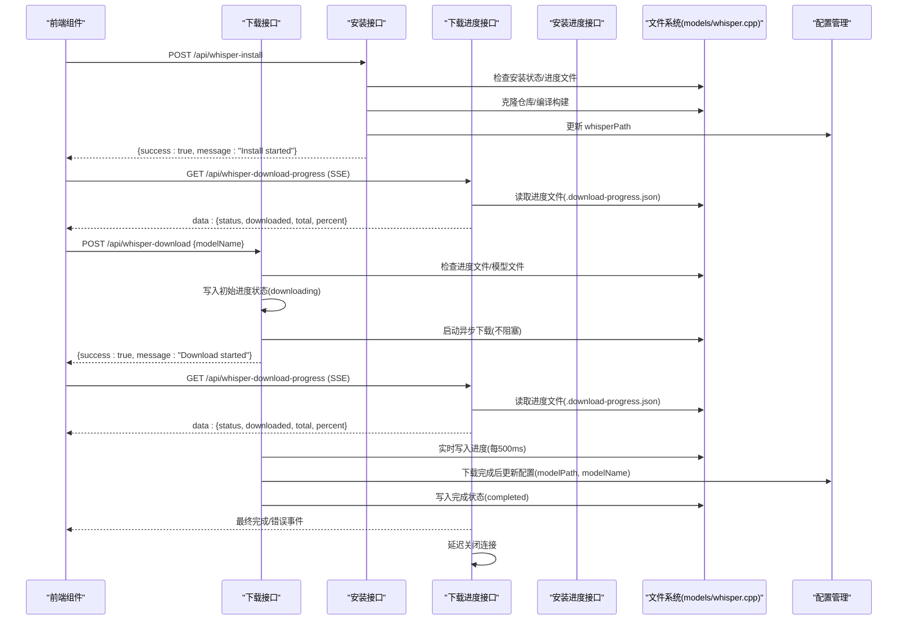
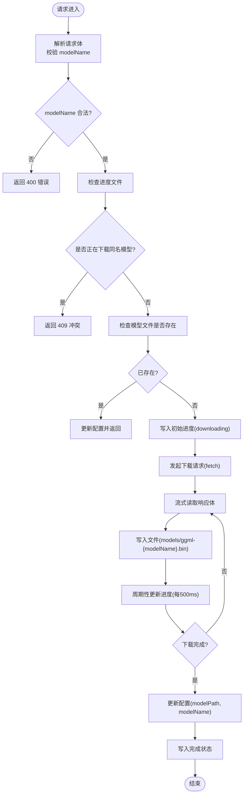
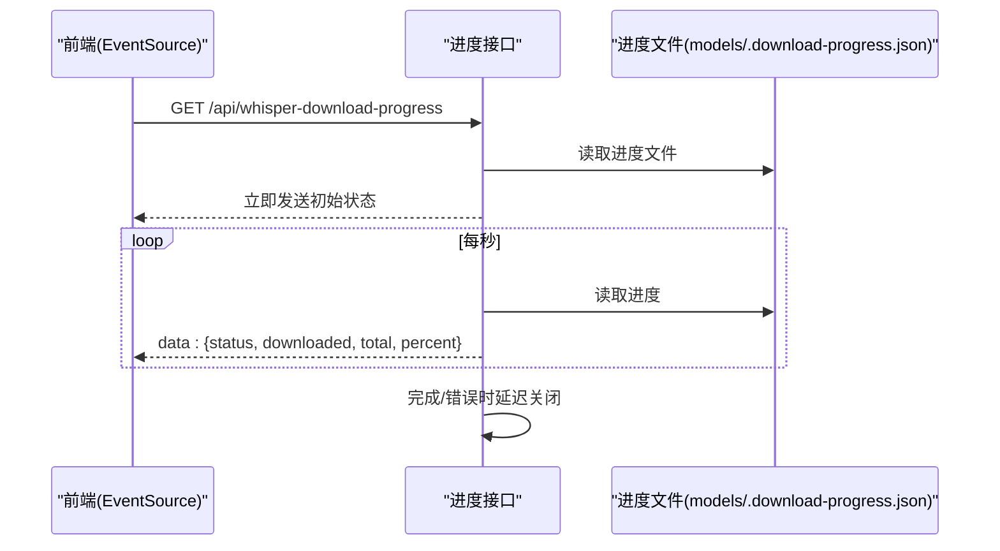
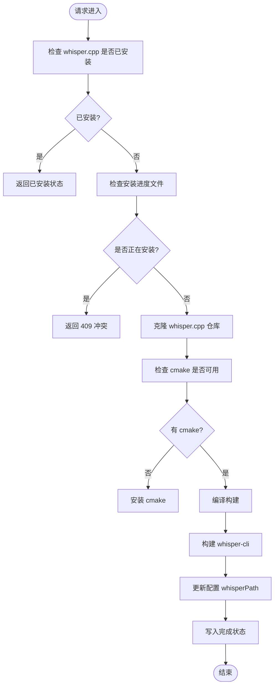
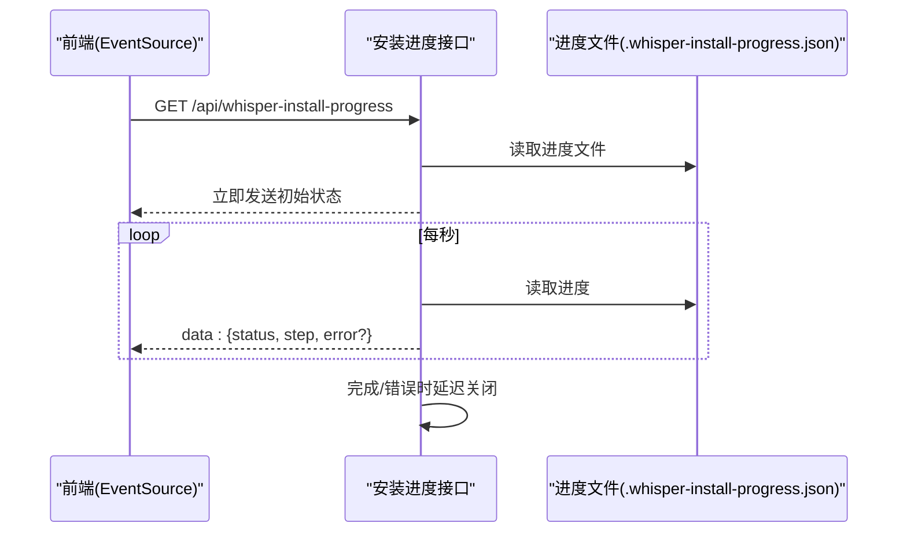
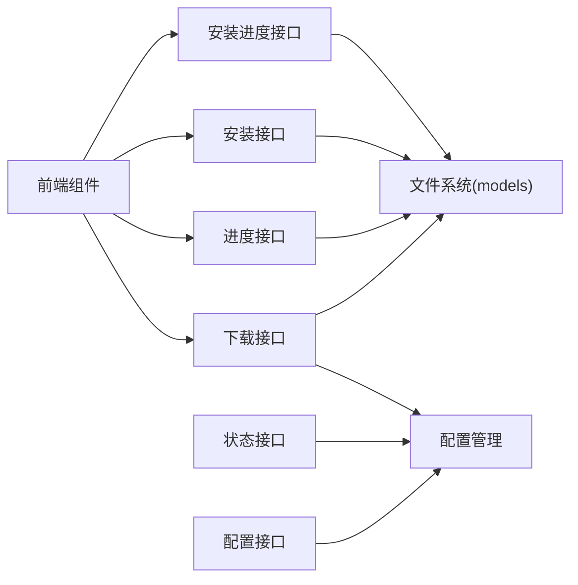

# 模型管理 API

<cite>
**本文档引用的文件**
- [src/app/api/whisper-download/route.ts](file://src/app/api/whisper-download/route.ts)
- [src/app/api/whisper-download-progress/route.ts](file://src/app/api/whisper-download-progress/route.ts)
- [src/app/api/whisper-install/route.ts](file://src/app/api/whisper-install/route.ts)
- [src/app/api/whisper-install-progress/route.ts](file://src/app/api/whisper-install-progress/route.ts)
- [src/lib/whisper.ts](file://src/lib/whisper.ts)
- [src/lib/whisper-config.ts](file://src/lib/whisper-config.ts)
- [src/components/whisper-settings.tsx](file://src/components/whisper-settings.tsx)
- [src/types/index.ts](file://src/types/index.ts)
- [src/app/api/whisper-config/route.ts](file://src/app/api/whisper-config/route.ts)
- [src/app/api/whisper-status/route.ts](file://src/app/api/whisper-status/route.ts)
- [setup-whisper.sh](file://setup-whisper.sh)
</cite>

## 更新摘要
**所做更改**
- 新增 whisper.cpp 安装 API 系统，包括自动安装和进度监控
- 扩展模型管理功能，支持智能安装自动化
- 更新前端组件以支持安装和下载的双向流程
- 增强错误处理和用户反馈机制
- 完善安装进度跟踪和状态管理

## 目录
1. [简介](#简介)
2. [项目结构](#项目结构)
3. [核心组件](#核心组件)
4. [架构总览](#架构总览)
5. [详细组件分析](#详细组件分析)
6. [依赖关系分析](#依赖关系分析)
7. [性能考虑](#性能考虑)
8. [故障排除指南](#故障排除指南)
9. [结论](#结论)
10. [附录](#附录)

## 简介
本文件为 MemoFlow 的完整模型管理 API 系统提供详细的技术文档，涵盖以下核心功能：
- 模型下载触发接口：POST /api/whisper-download
- 下载进度查询接口：GET /api/whisper-download-progress
- whisper.cpp 安装接口：POST /api/whisper-install
- 安装进度查询接口：GET /api/whisper-install-progress
- 配置管理接口：GET/POST /api/whisper-config
- 状态查询接口：GET /api/whisper-status

文档内容涵盖下载触发机制、文件路径管理、下载状态初始化、进度跟踪机制、状态更新与完成通知、模型文件存储位置与命名规则、清理策略、错误处理与重试机制、用户反馈流程，并提供完整的使用示例与故障排除指南。

## 项目结构
完整的模型管理 API 系统位于 Next.js 应用的 API 层，配合前端组件与配置管理模块共同工作。关键文件组织如下：
- API 层：负责接收请求、执行业务逻辑并返回响应
- 配置管理：负责读取与保存 Whisper 配置，合并环境变量
- 前端组件：负责展示状态、触发下载/安装、监听进度并提供用户反馈
- 类型定义：统一前后端数据结构

```mermaid
graph TB
subgraph "前端"
WS["WhisperSettings 组件<br/>触发下载/安装/监听进度"]
end
subgraph "API 层"
DLR["/api/whisper-download<br/>POST 触发下载"]
DPR["/api/whisper-download-progress<br/>GET SSE 进度"]
WIR["/api/whisper-install<br/>POST 触发安装"]
WIP["/api/whisper-install-progress<br/>GET SSE 进度"]
WCR["/api/whisper-config<br/>GET/POST 配置"]
WSR["/api/whisper-status<br/>GET 状态"]
end
subgraph "后端服务"
WC["whisper-config.ts<br/>配置读取/保存"]
WT["whisper.ts<br/>转写封装"]
FS["文件系统<br/>models 目录"]
WSH["whisper.cpp 目录"]
END
WS --> DLR
WS --> DPR
WS --> WIR
WS --> WIP
WS --> WCR
WS --> WSR
DLR --> FS
DPR --> FS
WIR --> WSH
WIP --> WSH
WSR --> WC
WCR --> WC
WT --> FS
```

**图表来源**
- [src/components/whisper-settings.tsx](file://src/components/whisper-settings.tsx)
- [src/app/api/whisper-download/route.ts](file://src/app/api/whisper-download/route.ts)
- [src/app/api/whisper-download-progress/route.ts](file://src/app/api/whisper-download-progress/route.ts)
- [src/app/api/whisper-install/route.ts](file://src/app/api/whisper-install/route.ts)
- [src/app/api/whisper-install-progress/route.ts](file://src/app/api/whisper-install-progress/route.ts)
- [src/app/api/whisper-config/route.ts](file://src/app/api/whisper-config/route.ts)
- [src/app/api/whisper-status/route.ts](file://src/app/api/whisper-status/route.ts)
- [src/lib/whisper-config.ts](file://src/lib/whisper-config.ts)
- [src/lib/whisper.ts](file://src/lib/whisper.ts)

**章节来源**
- [src/components/whisper-settings.tsx](file://src/components/whisper-settings.tsx)
- [src/app/api/whisper-download/route.ts](file://src/app/api/whisper-download/route.ts)
- [src/app/api/whisper-download-progress/route.ts](file://src/app/api/whisper-download-progress/route.ts)
- [src/app/api/whisper-install/route.ts](file://src/app/api/whisper-install/route.ts)
- [src/app/api/whisper-install-progress/route.ts](file://src/app/api/whisper-install-progress/route.ts)
- [src/app/api/whisper-config/route.ts](file://src/app/api/whisper-config/route.ts)
- [src/app/api/whisper-status/route.ts](file://src/app/api/whisper-status/route.ts)
- [src/lib/whisper-config.ts](file://src/lib/whisper-config.ts)
- [src/lib/whisper.ts](file://src/lib/whisper.ts)

## 核心组件
- **模型下载触发接口（POST /api/whisper-download）**
  - 参数校验：仅允许 small 或 medium 模型
  - 并发控制：检测进度文件，避免重复下载
  - 存在性检查：若目标模型已存在则直接更新配置并返回
  - 异步下载：启动后台下载任务，不阻塞请求
  - 进度初始化：写入初始进度状态
- **下载进度查询接口（GET /api/whisper-download-progress）**
  - SSE 流：以 Server-Sent Events 推送实时进度
  - 定时轮询：每秒读取进度文件并推送
  - 自动关闭：完成后或出错时延迟关闭连接
  - 百分比计算：基于 downloaded/total 计算进度百分比
- **whisper.cpp 安装接口（POST /api/whisper-install）**
  - 自动安装：克隆仓库、检查编译工具、编译构建
  - 智能检测：检查现有安装状态，避免重复安装
  - 并发控制：检测安装进度文件，避免重复安装
  - 状态管理：更新配置中的 whisperPath
- **安装进度查询接口（GET /api/whisper-install-progress）**
  - SSE 流：推送安装状态（cloning/compiling/completed/error）
  - 步骤跟踪：显示当前安装步骤和描述
  - 自动关闭：完成后或出错时延迟关闭连接
- **配置管理**
  - 默认配置与环境变量覆盖
  - 配置保存与读取
  - 模型文件大小格式化与模型名推断
- **前端组件**
  - EventSource 监听进度
  - 下载/安装按钮状态与进度条展示
  - 错误提示与自动刷新
  - 智能安装自动化流程

**章节来源**
- [src/app/api/whisper-download/route.ts](file://src/app/api/whisper-download/route.ts)
- [src/app/api/whisper-download-progress/route.ts](file://src/app/api/whisper-download-progress/route.ts)
- [src/app/api/whisper-install/route.ts](file://src/app/api/whisper-install/route.ts)
- [src/app/api/whisper-install-progress/route.ts](file://src/app/api/whisper-install-progress/route.ts)
- [src/lib/whisper-config.ts](file://src/lib/whisper-config.ts)
- [src/components/whisper-settings.tsx](file://src/components/whisper-settings.tsx)

## 架构总览
完整的模型管理 API 系统交互流程如下：



**图表来源**
- [src/app/api/whisper-download/route.ts](file://src/app/api/whisper-download/route.ts)
- [src/app/api/whisper-download-progress/route.ts](file://src/app/api/whisper-download-progress/route.ts)
- [src/app/api/whisper-install/route.ts](file://src/app/api/whisper-install/route.ts)
- [src/app/api/whisper-install-progress/route.ts](file://src/app/api/whisper-install-progress/route.ts)
- [src/lib/whisper-config.ts](file://src/lib/whisper-config.ts)

## 详细组件分析

### 模型下载触发接口（POST /api/whisper-download）
- **功能概述**
  - 接收请求体中的模型名称（small 或 medium），验证后启动后台下载
  - 若同名模型正在下载，返回冲突状态
  - 若模型已存在，直接更新配置并返回
  - 启动异步下载任务，不阻塞当前请求
- **关键实现点**
  - 模型映射与大小：内置模型 URL 与预设大小，用于进度计算
  - 目录与文件路径：models 目录存放模型文件，进度文件位于 models/.download-progress.json
  - 进度初始化：写入初始状态（downloading）与总大小
  - 流式下载：使用 fetch + ReadableStream Reader 逐块读取并写入文件
  - 进度更新：每 500ms 写入一次进度，避免频繁磁盘 IO
  - 完成处理：更新配置（modelPath、modelName），写入完成状态
  - 错误处理：捕获异常，清理不完整文件，写入错误状态
- **并发与幂等**
  - 通过检查进度文件中的状态与模型名，避免重复下载
  - 若模型已存在，直接返回成功并标记 alreadyExists



**图表来源**
- [src/app/api/whisper-download/route.ts](file://src/app/api/whisper-download/route.ts)

**章节来源**
- [src/app/api/whisper-download/route.ts](file://src/app/api/whisper-download/route.ts)

### 下载进度查询接口（GET /api/whisper-download-progress）
- **功能概述**
  - 通过 Server-Sent Events 推送实时进度
  - 初始立即发送当前状态；完成后或出错时延迟关闭连接
  - 每秒读取进度文件并推送，计算百分比
- **关键实现点**
  - SSE 流：ReadableStream + TextEncoder，按行发送 data: JSON
  - 客户端断开：监听 abort 信号，清理定时器并关闭连接
  - 进度文件读取：解析 .download-progress.json，计算百分比
  - 自动关闭：完成或错误后延时关闭，确保客户端收到最后一条消息



**图表来源**
- [src/app/api/whisper-download-progress/route.ts](file://src/app/api/whisper-download-progress/route.ts)

**章节来源**
- [src/app/api/whisper-download-progress/route.ts](file://src/app/api/whisper-download-progress/route.ts)

### whisper.cpp 安装接口（POST /api/whisper-install）
- **功能概述**
  - 自动安装 whisper.cpp：克隆仓库、检查编译工具、编译构建
  - 智能检测：检查现有安装状态，避免重复安装
  - 并发控制：检测安装进度文件，避免重复安装
  - 状态管理：更新配置中的 whisperPath
- **关键实现点**
  - 安装步骤：cloning → compiling → completed
  - 路径处理：确保 PATH 包含 /opt/homebrew/bin 等必要路径
  - 超时控制：设置 600 秒超时，避免长时间挂起
  - 错误处理：捕获编译错误，清理进度文件，写入错误状态
  - 配置更新：安装完成后更新 whisperPath 并保存配置
- **并发与幂等**
  - 通过检查进度文件中的状态，避免重复安装
  - 若已安装，直接返回成功并标记 alreadyInstalled



**图表来源**
- [src/app/api/whisper-install/route.ts](file://src/app/api/whisper-install/route.ts)

**章节来源**
- [src/app/api/whisper-install/route.ts](file://src/app/api/whisper-install/route.ts)

### 安装进度查询接口（GET /api/whisper-install-progress）
- **功能概述**
  - 通过 Server-Sent Events 推送安装进度
  - 显示当前安装步骤和状态（cloning/compiling/completed/error）
  - 初始立即发送当前状态；完成后或出错时延迟关闭连接
- **关键实现点**
  - SSE 流：ReadableStream + TextEncoder，按行发送 data: JSON
  - 状态跟踪：显示 cloning/compiling 等步骤描述
  - 客户端断开：监听 abort 信号，清理定时器并关闭连接
  - 自动关闭：完成或错误后延时关闭，确保客户端收到最后一条消息



**图表来源**
- [src/app/api/whisper-install-progress/route.ts](file://src/app/api/whisper-install-progress/route.ts)

**章节来源**
- [src/app/api/whisper-install-progress/route.ts](file://src/app/api/whisper-install-progress/route.ts)

### 前端组件集成（WhisperSettings）
- **功能概述**
  - 展示 whisper.cpp 与模型安装状态
  - 支持选择 small/medium 模型并触发下载
  - 支持一键安装 whisper.cpp 并自动下载模型
  - 使用 EventSource 监听进度，显示百分比与进度条
  - 下载/安装完成后自动刷新状态
- **关键实现点**
  - 事件源管理：组件卸载时关闭 EventSource
  - 智能流程：当 whisper 未安装时，先安装再下载
  - 错误处理：解析进度数据失败或连接错误时清理资源
  - 用户反馈：根据状态切换按钮与提示信息
  - 安装进度显示：在下载区域显示安装步骤

**章节来源**
- [src/components/whisper-settings.tsx](file://src/components/whisper-settings.tsx)

### 配置管理与状态查询
- **配置管理**
  - 默认配置与环境变量覆盖：WHISPER_PATH、WHISPER_MODEL_PATH、WHISPER_THREADS
  - 配置保存与读取：.whisper-config.json
  - 工具函数：文件大小格式化、模型名推断
- **状态查询**
  - 检查 whisper.cpp 与模型文件是否存在
  - 获取模型文件大小与推断模型名称

**章节来源**
- [src/lib/whisper-config.ts](file://src/lib/whisper-config.ts)
- [src/app/api/whisper-config/route.ts](file://src/app/api/whisper-config/route.ts)
- [src/app/api/whisper-status/route.ts](file://src/app/api/whisper-status/route.ts)

## 依赖关系分析
- **组件耦合**
  - 下载接口依赖配置管理与文件系统
  - 进度接口依赖进度文件与定时器
  - 安装接口依赖文件系统与子进程执行
  - 前端组件依赖所有 API 接口
- **外部依赖**
  - Hugging Face 镜像源（ggml-small.bin、ggml-medium.bin）
  - whisper.cpp 仓库（https://github.com/ggerganov/whisper.cpp.git）
  - Git 和 CMake 编译工具
  - whisper.cpp 可执行文件与模型文件
- **潜在循环依赖**
  - 当前结构清晰，无明显循环依赖



**图表来源**
- [src/app/api/whisper-download/route.ts](file://src/app/api/whisper-download/route.ts)
- [src/app/api/whisper-download-progress/route.ts](file://src/app/api/whisper-download-progress/route.ts)
- [src/app/api/whisper-install/route.ts](file://src/app/api/whisper-install/route.ts)
- [src/app/api/whisper-install-progress/route.ts](file://src/app/api/whisper-install-progress/route.ts)
- [src/lib/whisper-config.ts](file://src/lib/whisper-config.ts)
- [src/components/whisper-settings.tsx](file://src/components/whisper-settings.tsx)

**章节来源**
- [src/app/api/whisper-download/route.ts](file://src/app/api/whisper-download/route.ts)
- [src/app/api/whisper-download-progress/route.ts](file://src/app/api/whisper-download-progress/route.ts)
- [src/app/api/whisper-install/route.ts](file://src/app/api/whisper-install/route.ts)
- [src/app/api/whisper-install-progress/route.ts](file://src/app/api/whisper-install-progress/route.ts)
- [src/lib/whisper-config.ts](file://src/lib/whisper-config.ts)
- [src/components/whisper-settings.tsx](file://src/components/whisper-settings.tsx)

## 性能考虑
- **下载性能**
  - 流式读取与写入，避免一次性加载大文件至内存
  - 进度更新频率（每 500ms）平衡了实时性与磁盘 IO
- **安装性能**
  - 编译过程可能需要较长时间，提供详细的步骤反馈
  - 超时控制（600 秒）避免长时间挂起
- **SSE 推送**
  - 下载进度每秒推送一次，安装进度每秒推送一次，降低服务器压力
  - 完成/错误后延迟关闭，减少资源占用
- **文件系统**
  - 模型目录与进度文件集中管理，便于清理与维护
  - 安装进度文件与模型进度文件分离，避免冲突

## 故障排除指南
- **下载接口常见问题**
  - 400 错误：请求体不合法或 modelName 不在允许列表
  - 409 冲突：同名模型已在下载中
  - 500 错误：启动下载失败或后台任务异常
  - 解决方案：检查请求体格式、确认模型名称、查看日志
- **安装接口常见问题**
  - 400 错误：请求体格式不正确
  - 409 冲突：安装已在进行中
  - 500 错误：安装过程中出现编译错误
  - 解决方案：检查 Git 和 CMake 是否已安装、查看编译日志
- **进度接口常见问题**
  - SSE 连接中断：网络波动或浏览器限制
  - 进度文件损坏：删除对应进度文件后重新开始
  - 百分比异常：total 为 0 时无法计算百分比
  - 解决方案：前端重连 EventSource、清理进度文件、检查网络
- **模型文件问题**
  - 模型文件不存在：确认下载完成或重新下载
  - 权限不足：确保 models 目录可写
  - 解决方案：检查权限、重新下载、查看日志
- **配置问题**
  - 环境变量覆盖：WHISPER_PATH、WHISPER_MODEL_PATH、WHISPER_THREADS
  - 配置文件损坏：删除 .whisper-config.json 后重新保存
  - 解决方案：检查环境变量、重新保存配置
- **安装问题**
  - 编译失败：检查 CMake 版本和系统依赖
  - 权限问题：确保有 sudo 权限安装依赖
  - 磁盘空间不足：清理空间后重试
  - 解决方案：查看安装日志、检查系统环境

**章节来源**
- [src/app/api/whisper-download/route.ts](file://src/app/api/whisper-download/route.ts)
- [src/app/api/whisper-download-progress/route.ts](file://src/app/api/whisper-download-progress/route.ts)
- [src/app/api/whisper-install/route.ts](file://src/app/api/whisper-install/route.ts)
- [src/app/api/whisper-install-progress/route.ts](file://src/app/api/whisper-install-progress/route.ts)
- [src/lib/whisper-config.ts](file://src/lib/whisper-config.ts)

## 结论
MemoFlow 的完整模型管理 API 系统通过简洁的接口设计实现了可靠的模型下载、安装进度追踪和智能安装自动化。系统包含：
- 下载接口采用异步流式下载与定期进度写入
- 安装接口提供完整的 whisper.cpp 自动安装流程
- 前端通过 SSE 实时展示进度，配合完善的错误处理与用户反馈
- 智能安装自动化，支持先安装再下载的无缝体验

建议在生产环境中结合监控与日志，进一步提升稳定性与可观测性。

## 附录

### API 定义与使用示例

#### 模型下载相关 API
- **POST /api/whisper-download**
  - 请求体
    - modelName: "small" | "medium"
  - 成功响应
    - success: true
    - message: "Download started"
  - 冲突响应
    - success: false
    - error: "该模型正在下载中"
    - 状态码: 409
  - 已存在响应
    - success: true
    - message: "模型已存在"
    - alreadyExists: true
  - 错误响应
    - success: false
    - error: string
    - 状态码: 400 或 500

- **GET /api/whisper-download-progress**
  - 响应类型: Server-Sent Events
  - 事件数据结构
    - status: "idle" | "downloading" | "completed" | "error"
    - downloaded: number
    - total: number
    - modelName: string
    - percent?: number
    - error?: string
  - 连接行为
    - 初始立即发送当前状态
    - 每秒推送一次
    - 完成或错误后延迟关闭

#### 安装相关 API
- **POST /api/whisper-install**
  - 请求体: 无
  - 成功响应
    - success: true
    - message: "Install started"
  - 冲突响应
    - success: false
    - error: "安装正在进行中"
    - 状态码: 409
  - 已存在响应
    - success: true
    - message: "whisper.cpp 已安装"
    - alreadyInstalled: true
  - 错误响应
    - success: false
    - error: string
    - 状态码: 500

- **GET /api/whisper-install-progress**
  - 响应类型: Server-Sent Events
  - 事件数据结构
    - status: "idle" | "cloning" | "compiling" | "completed" | "error"
    - step: string
    - error?: string
  - 连接行为
    - 初始立即发送当前状态
    - 每秒推送一次
    - 完成或错误后延迟关闭

#### 配置和状态 API
- **GET /api/whisper-config**
  - 响应数据: WhisperConfig 对象（合并环境变量后的配置）

- **POST /api/whisper-config**
  - 请求体: WhisperConfig 对象
  - 响应数据: 保存后的配置（包含环境变量覆盖）

- **GET /api/whisper-status**
  - 响应数据: WhisperStatus 对象
    - whisperInstalled: boolean
    - modelInstalled: boolean
    - whisperPath: string
    - modelPath: string
    - modelName: string
    - modelSize: string

#### 前端调用示例（伪代码）
- **触发下载**
  ```javascript
  fetch("/api/whisper-download", { 
    method: "POST", 
    body: JSON.stringify({ modelName }) 
  })
  ```

- **监听下载进度**
  ```javascript
  const es = new EventSource("/api/whisper-download-progress")
  es.onmessage = (event) => { parse and update UI }
  es.onerror = () => { cleanup and retry }
  ```

- **触发安装**
  ```javascript
  fetch("/api/whisper-install", { method: "POST" })
  ```

- **监听安装进度**
  ```javascript
  const es = new EventSource("/api/whisper-install-progress")
  es.onmessage = (event) => { parse and update UI }
  es.onerror = () => { cleanup and retry }
  ```

**章节来源**
- [src/app/api/whisper-download/route.ts](file://src/app/api/whisper-download/route.ts)
- [src/app/api/whisper-download-progress/route.ts](file://src/app/api/whisper-download-progress/route.ts)
- [src/app/api/whisper-install/route.ts](file://src/app/api/whisper-install/route.ts)
- [src/app/api/whisper-install-progress/route.ts](file://src/app/api/whisper-install-progress/route.ts)
- [src/app/api/whisper-config/route.ts](file://src/app/api/whisper-config/route.ts)
- [src/app/api/whisper-status/route.ts](file://src/app/api/whisper-status/route.ts)
- [src/components/whisper-settings.tsx](file://src/components/whisper-settings.tsx)

### 模型文件存储位置与命名规则
- **存储位置**
  - models 目录位于项目根目录
  - 模型文件命名：ggml-{modelName}.bin（如 ggml-small.bin、ggml-medium.bin）
  - 下载进度文件：models/.download-progress.json
  - 安装进度文件：.whisper-install-progress.json
  - 配置文件：.whisper-config.json
- **清理策略**
  - 下载失败时尝试删除不完整文件
  - 安装失败时保留进度文件以便恢复
  - 建议定期清理过期或损坏的模型文件
- **环境变量覆盖**
  - WHISPER_PATH：指定 whisper.cpp 可执行文件路径
  - WHISPER_MODEL_PATH：指定模型文件路径
  - WHISPER_THREADS：指定转录线程数
  - OUTPUT_DIR：指定转录文件输出目录

**章节来源**
- [src/app/api/whisper-download/route.ts](file://src/app/api/whisper-download/route.ts)
- [src/app/api/whisper-install/route.ts](file://src/app/api/whisper-install/route.ts)
- [src/lib/whisper-config.ts](file://src/lib/whisper-config.ts)

### 错误处理与重试机制
- **错误处理**
  - 下载接口：捕获异常、清理不完整文件、写入错误状态
  - 安装接口：捕获编译错误、清理进度文件、写入错误状态
  - 进度接口：读取失败时返回空状态，客户端重连
  - 前端：解析失败时记录日志并关闭连接
- **重试机制**
  - 建议前端在 SSE 连接断开时自动重连
  - 下载/安装失败时可提示用户重新触发
  - 安装失败后可清理进度文件重新开始
- **并发控制**
  - 通过检查进度文件中的状态，避免重复操作
  - 安装和下载互不影响，可并行进行

**章节来源**
- [src/app/api/whisper-download/route.ts](file://src/app/api/whisper-download/route.ts)
- [src/app/api/whisper-download-progress/route.ts](file://src/app/api/whisper-download-progress/route.ts)
- [src/app/api/whisper-install/route.ts](file://src/app/api/whisper-install/route.ts)
- [src/app/api/whisper-install-progress/route.ts](file://src/app/api/whisper-install-progress/route.ts)
- [src/components/whisper-settings.tsx](file://src/components/whisper-settings.tsx)

### 安装与环境准备
- **使用脚本安装 whisper.cpp 并下载中文优化的小模型**
- **设置环境变量 WHISPER_PATH 与 WHISPER_MODEL_PATH**
- **运行开发服务器后即可使用模型管理 API**
- **智能安装自动化：先安装 whisper.cpp 再下载模型**

**章节来源**
- [setup-whisper.sh](file://setup-whisper.sh)
- [src/app/api/whisper-install/route.ts](file://src/app/api/whisper-install/route.ts)
- [src/components/whisper-settings.tsx](file://src/components/whisper-settings.tsx)