# 侧边栏增强功能文档

<cite>
**本文档引用的文件**
- [src/components/sidebar.tsx](file://src/components/sidebar.tsx)
- [src/components/app-shell.tsx](file://src/components/app-shell.tsx)
- [src/app/layout.tsx](file://src/app/layout.tsx)
- [src/components/whisper-settings.tsx](file://src/components/whisper-settings.tsx)
- [src/app/page.tsx](file://src/app/page.tsx)
- [src/app/transcriptions/page.tsx](file://src/app/transcriptions/page.tsx)
- [src/lib/transcription-history.ts](file://src/lib/transcription-history.ts)
- [src/types/index.ts](file://src/types/index.ts)
- [src/types/transcription-history.ts](file://src/types/transcription-history.ts)
- [src/lib/utils.ts](file://src/lib/utils.ts)
- [src/components/ui/badge.tsx](file://src/components/ui/badge.tsx)
- [src/components/ui/button.tsx](file://src/components/ui/button.tsx)
- [src/styles/globals.css](file://src/styles/globals.css)
- [package.json](file://package.json)
- [next.config.mjs](file://next.config.mjs)
</cite>

## 目录
1. [简介](#简介)
2. [项目结构](#项目结构)
3. [核心组件](#核心组件)
4. [架构概览](#架构概览)
5. [详细组件分析](#详细组件分析)
6. [依赖关系分析](#依赖关系分析)
7. [性能考虑](#性能考虑)
8. [故障排除指南](#故障排除指南)
9. [结论](#结论)

## 简介

MemoFlow 是一个基于 Next.js 的播客转录应用，专注于提供流畅的本地语音识别体验。该应用的核心特色是其增强的侧边栏导航系统，它不仅提供了直观的页面导航，还集成了主题切换、设置管理和实时状态反馈等功能。

本项目采用现代化的前端技术栈，包括 Next.js 14、React 18、Tailwind CSS 和 Radix UI 组件库，构建了一个响应式的单页应用程序。侧边栏作为应用的主要导航组件，经过精心设计以提供优秀的用户体验。

## 项目结构

MemoFlow 项目遵循现代 Next.js 应用的标准结构，主要分为以下几个部分：

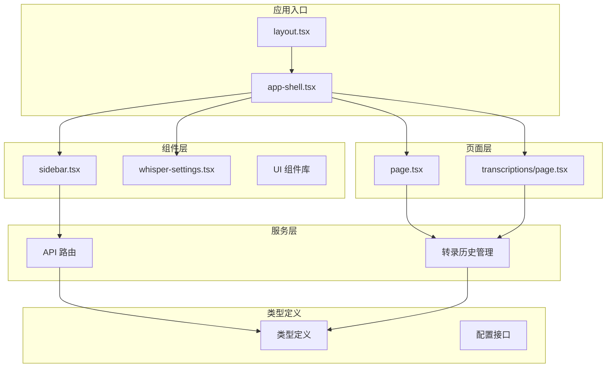

**图表来源**
- [src/app/layout.tsx:16-51](file://src/app/layout.tsx#L16-L51)
- [src/components/app-shell.tsx:12-41](file://src/components/app-shell.tsx#L12-L41)

**章节来源**
- [src/app/layout.tsx:1-52](file://src/app/layout.tsx#L1-52)
- [src/components/app-shell.tsx:1-42](file://src/components/app-shell.tsx#L1-L42)

## 核心组件

### 侧边栏组件架构

侧边栏组件是整个应用导航系统的核心，采用了模块化的设计理念：

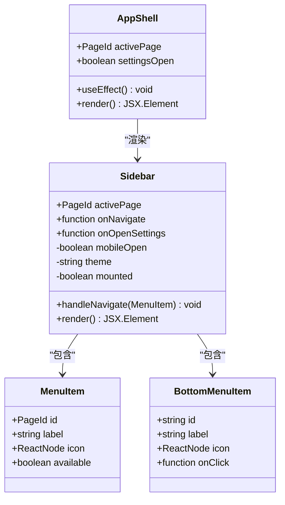

**图表来源**
- [src/components/sidebar.tsx:10-30](file://src/components/sidebar.tsx#L10-L30)
- [src/components/app-shell.tsx:8-15](file://src/components/app-shell.tsx#L8-L15)

侧边栏组件的主要特性包括：

1. **响应式设计**：支持桌面端固定侧边栏和移动端滑动菜单
2. **动态主题切换**：集成 next-themes 实现明暗主题切换
3. **状态管理**：与 AppShell 协同维护全局导航状态
4. **无障碍访问**：提供完整的键盘导航和屏幕阅读器支持

**章节来源**
- [src/components/sidebar.tsx:40-242](file://src/components/sidebar.tsx#L40-L242)
- [src/components/app-shell.tsx:12-41](file://src/components/app-shell.tsx#L12-L41)

## 架构概览

MemoFlow 采用了分层架构设计，确保了良好的可维护性和扩展性：

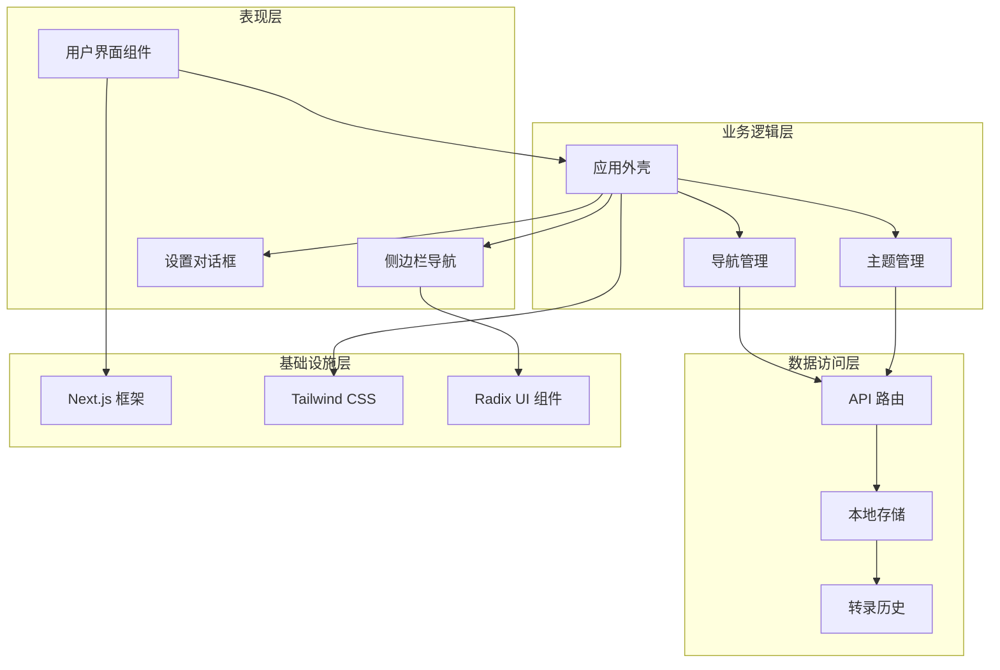

**图表来源**
- [src/app/layout.tsx:40-47](file://src/app/layout.tsx#L40-L47)
- [src/components/app-shell.tsx:27-40](file://src/components/app-shell.tsx#L27-L40)

## 详细组件分析

### 侧边栏导航系统

侧边栏导航系统是应用的核心交互组件，实现了复杂的导航逻辑和状态管理：

#### 导航菜单结构

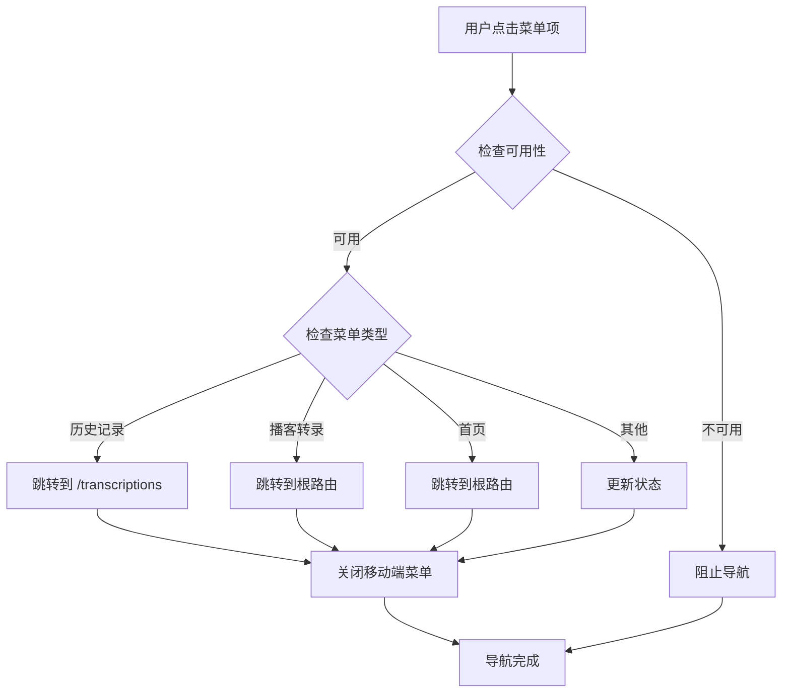

**图表来源**
- [src/components/sidebar.tsx:59-80](file://src/components/sidebar.tsx#L59-L80)

#### 主题切换机制

侧边栏集成了智能的主题切换功能，支持明暗模式的无缝切换：

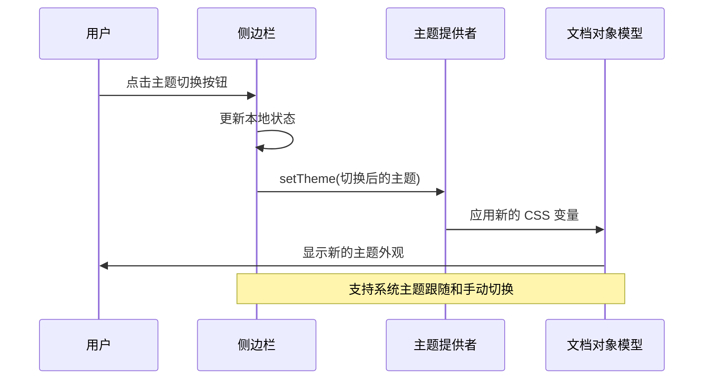

**图表来源**
- [src/components/sidebar.tsx:48-57](file://src/components/sidebar.tsx#L48-L57)

#### 移动端适配

侧边栏针对移动设备进行了专门优化，提供了沉浸式的导航体验：

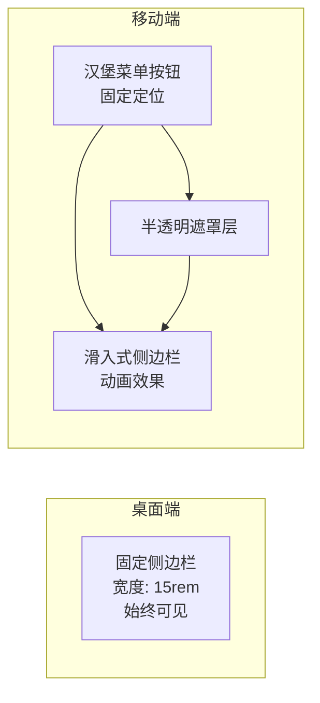

**图表来源**
- [src/components/sidebar.tsx:150-241](file://src/components/sidebar.tsx#L150-L241)

**章节来源**
- [src/components/sidebar.tsx:1-245](file://src/components/sidebar.tsx#L1-L245)

### 应用外壳组件

AppShell 作为应用的容器组件，负责协调各个子组件的协作：

#### 状态同步机制

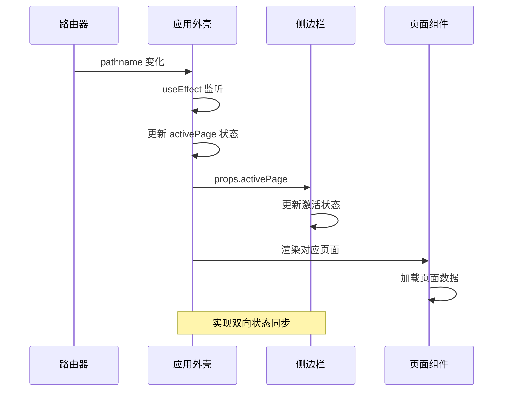

**图表来源**
- [src/components/app-shell.tsx:17-25](file://src/components/app-shell.tsx#L17-L25)

**章节来源**
- [src/components/app-shell.tsx:12-41](file://src/components/app-shell.tsx#L12-L41)

### 设置对话框集成

侧边栏与 Whisper 设置对话框的深度集成，提供了便捷的配置管理：

#### 设置流程

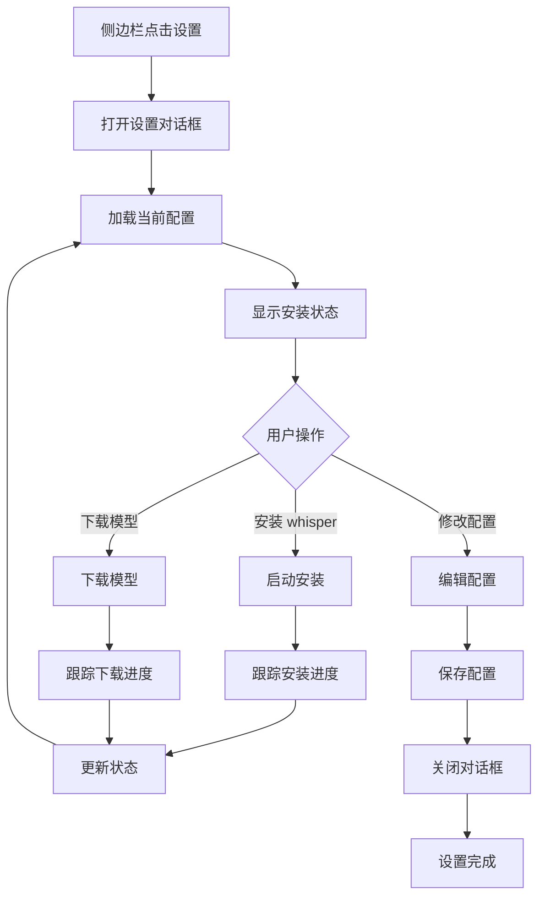

**图表来源**
- [src/components/sidebar.tsx:55-56](file://src/components/sidebar.tsx#L55-L56)
- [src/components/whisper-settings.tsx:62-129](file://src/components/whisper-settings.tsx#L62-L129)

**章节来源**
- [src/components/whisper-settings.tsx:1-664](file://src/components/whisper-settings.tsx#L1-L664)

## 依赖关系分析

### 核心依赖关系

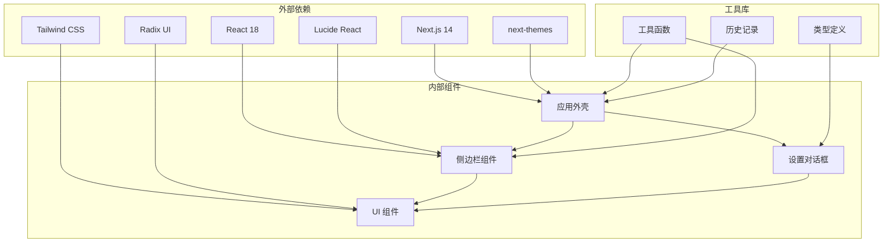

**图表来源**
- [package.json:12-26](file://package.json#L12-L26)
- [src/components/sidebar.tsx:3-8](file://src/components/sidebar.tsx#L3-L8)

### 数据流分析

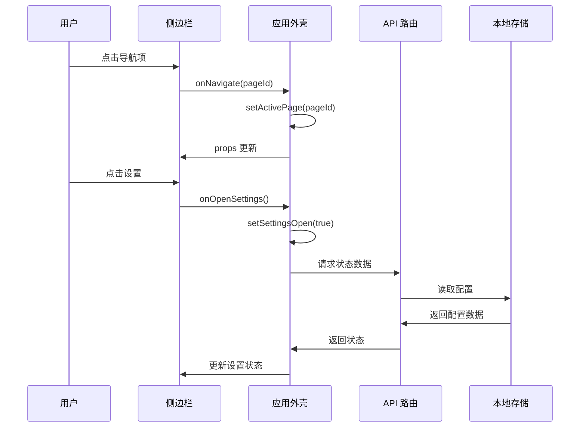

**图表来源**
- [src/components/sidebar.tsx:29-32](file://src/components/sidebar.tsx#L29-L32)
- [src/components/app-shell.tsx:14-15](file://src/components/app-shell.tsx#L14-L15)

**章节来源**
- [package.json:1-38](file://package.json#L1-L38)
- [src/lib/utils.ts:1-13](file://src/lib/utils.ts#L1-L13)

## 性能考虑

### 优化策略

MemoFlow 在侧边栏实现中采用了多项性能优化措施：

1. **懒加载组件**：使用 React.lazy 和 Suspense 实现组件按需加载
2. **状态缓存**：利用 React 的状态提升避免重复渲染
3. **事件节流**：对高频事件进行防抖处理
4. **CSS 优化**：使用 Tailwind CSS 的原子类减少样式计算

### 内存管理

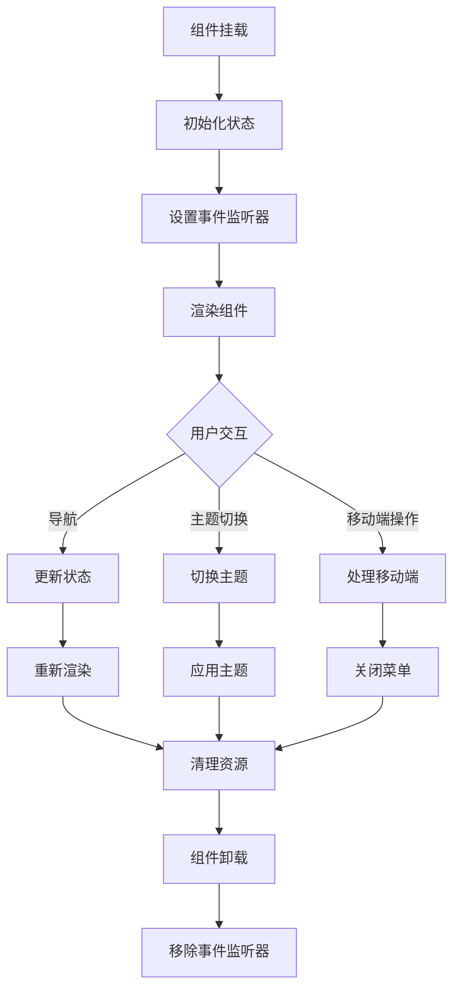

**图表来源**
- [src/components/sidebar.tsx:42-46](file://src/components/sidebar.tsx#L42-L46)

## 故障排除指南

### 常见问题及解决方案

#### 导航状态不同步

**问题描述**：侧边栏激活状态与实际页面不匹配

**解决方案**：
1. 检查 AppShell 中的路由监听逻辑
2. 确认 pathname 变更是否正确触发状态更新
3. 验证菜单项的 ID 与路由路径的映射关系

#### 主题切换失效

**问题描述**：主题切换按钮点击无效或切换后状态异常

**解决方案**：
1. 检查 next-themes 的配置是否正确
2. 验证 CSS 变量是否正确应用
3. 确认系统主题跟随设置

#### 移动端菜单无法关闭

**问题描述**：移动端侧边栏弹出后无法正常关闭

**解决方案**：
1. 检查遮罩层的点击事件绑定
2. 验证动画过渡效果的配置
3. 确认移动端断点设置

**章节来源**
- [src/components/app-shell.tsx:17-25](file://src/components/app-shell.tsx#L17-L25)
- [src/components/sidebar.tsx:165-241](file://src/components/sidebar.tsx#L165-L241)

## 结论

MemoFlow 的侧边栏增强功能展现了现代前端开发的最佳实践。通过精心设计的组件架构、完善的响应式布局和智能化的状态管理，该系统为用户提供了流畅、直观的导航体验。

主要成就包括：

1. **模块化设计**：清晰的组件职责分离，便于维护和扩展
2. **响应式优先**：从移动端到桌面端的完整适配
3. **性能优化**：合理的渲染策略和资源管理
4. **用户体验**：直观的交互设计和即时的视觉反馈

该侧边栏系统不仅满足了当前的功能需求，还为未来的功能扩展奠定了坚实的基础。通过持续的优化和改进，MemoFlow 将继续为用户提供卓越的播客转录体验。