# 转录历史系统

<cite>
**本文档引用的文件**
- [transcription-history.ts](file://src/lib/transcription-history.ts)
- [transcription-browser-cache.ts](file://src/lib/transcription-browser-cache.ts)
- [transcription-history.ts](file://src/types/transcription-history.ts)
- [route.ts](file://src/app/api/transcription-history/route.ts)
- [route.ts](file://src/app/api/transcription-live/route.ts)
- [route.ts](file://src/app/api/retranscribe/route.ts)
- [page.tsx](file://src/app/transcriptions/page.tsx)
- [page.tsx](file://src/app/transcriptions/[id]/page.tsx)
- [transcription-card.tsx](file://src/components/transcription-card.tsx)
- [transcription-detail.tsx](file://src/components/transcription-detail.tsx)
- [index.ts](file://src/types/index.ts)
- [transcription-task-manager.ts](file://src/lib/transcription-task-manager.ts)
- [transcription-progress.ts](file://src/lib/transcription-progress.ts)
- [whisper-config.ts](file://src/lib/whisper-config.ts)
- [local-helper-client.ts](file://src/lib/local-helper-client.ts)
- [README.md](file://README.md)
- [package.json](file://package.json)
</cite>

## 更新摘要
**变更内容**
- 转录页面从服务端渲染改为客户端渲染，实现客户端状态管理
- 新增浏览器本地缓存集成，提升离线可用性
- 实现实时更新的客户端事件源管理
- 增强错误处理和网络异常恢复机制
- 优化用户体验，支持断网场景下的数据展示
- 新增本机 helper 通信层，实现前后端分离架构

## 目录
1. [简介](#简介)
2. [项目结构](#项目结构)
3. [核心组件](#核心组件)
4. [架构概览](#架构概览)
5. [详细组件分析](#详细组件分析)
6. [依赖关系分析](#依赖关系分析)
7. [性能考虑](#性能考虑)
8. [故障排除指南](#故障排除指南)
9. [结论](#结论)

## 简介

Transcription History System 是 MemoFlow 应用中的一个核心模块，负责管理和存储音频转录的历史记录。该系统提供了完整的转录历史管理功能，包括记录的创建、查询、更新、删除以及实时状态跟踪。

MemoFlow 是一个 AI 驱动的内容分析与创作助手，支持多平台内容抓取和分析，而转录历史系统是其重要组成部分，用于追踪和管理用户的音频转录任务。

**更新** 转录历史系统已从传统的服务端渲染架构升级为现代化的客户端渲染架构。新的架构采用客户端状态管理、浏览器本地缓存、实时事件源更新和增强的错误处理机制，显著提升了用户体验和系统可靠性。系统现在通过本机 helper 服务实现前后端分离，提供更加稳定和高效的转录管理体验。

## 项目结构

该项目采用 Next.js 应用程序模式，主要结构如下：

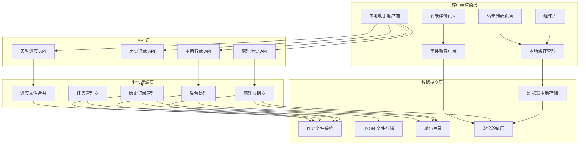

**图表来源**
- [page.tsx:1-107](file://src/app/transcriptions/page.tsx#L1-L107)
- [page.tsx:1-113](file://src/app/transcriptions/[id]/page.tsx#L1-L113)
- [transcription-browser-cache.ts:1-87](file://src/lib/transcription-browser-cache.ts#L1-L87)
- [local-helper-client.ts:1-55](file://src/lib/local-helper-client.ts#L1-L55)
- [route.ts:1-170](file://src/app/api/transcription-history/route.ts#L1-L170)
- [route.ts:1-119](file://src/app/api/transcription-live/route.ts#L1-L119)
- [transcription-task-manager.ts:1-170](file://src/lib/transcription-task-manager.ts#L1-L170)

**章节来源**
- [README.md:1-45](file://README.md#L1-L45)
- [package.json:1-41](file://package.json#L1-L41)

## 核心组件

### 数据模型

转录历史系统的核心数据结构包括以下关键接口：

```mermaid
classDiagram
class TranscriptionRecord {
+string id
+string taskId
+string title
+string status
+number progress
+string audioUrl
+TranscribeSegment[] segments
+string transcript
+number wordCount
+string savedPath
+Date createdAt
+Date updatedAt
+string language
+number duration
}
class TranscriptionHistoryState {
+TranscriptionRecord[] records
+Date lastUpdated
}
class TranscriptionBrowserCache {
+readCachedTranscriptionHistory() TranscriptionRecord[]
+writeCachedTranscriptionHistory(records) TranscriptionRecord[]
+mergeCachedTranscriptionHistory(records) TranscriptionRecord[]
+removeCachedTranscriptionRecord(id) TranscriptionRecord[]
+getCachedTranscriptionRecord(id) TranscriptionRecord | null
}
class TranscribeSegment {
+string timestamp
+string text
}
class TranscriptionTaskSnapshot {
+string taskId
+string status
+string audioPath
+string wavPath
+string srtPath
+string progressPath
+boolean cancelled
}
class CleanupResult {
+boolean stoppedTask
+boolean deletedOutputDir
+boolean skippedOutputDir
}
TranscriptionHistoryState --> TranscriptionRecord : "包含"
TranscriptionRecord --> TranscribeSegment : "包含"
TranscriptionBrowserCache --> TranscriptionRecord : "管理"
```

**图表来源**
- [transcription-history.ts:3-18](file://src/types/transcription-history.ts#L3-L18)
- [transcription-browser-cache.ts:3-87](file://src/lib/transcription-browser-cache.ts#L3-L87)
- [index.ts:27-30](file://src/types/index.ts#L27-L30)
- [transcription-task-manager.ts:23-31](file://src/lib/transcription-task-manager.ts#L23-L31)

### 客户端渲染架构

系统采用全新的客户端渲染架构，提供以下核心特性：

- **客户端状态管理**: 使用 React Hooks 管理组件状态，实现响应式更新
- **浏览器本地缓存**: 通过 localStorage 存储历史记录，支持离线访问
- **实时事件源**: 使用 EventSource 实现实时状态更新
- **错误恢复机制**: 网络异常时自动回退到本地缓存数据
- **增量更新**: 仅更新变化的数据，提升性能
- **本机 helper 通信**: 通过本地助手服务处理所有本地转录操作

**章节来源**
- [page.tsx:15-41](file://src/app/transcriptions/page.tsx#L15-L41)
- [page.tsx:20-47](file://src/app/transcriptions/[id]/page.tsx#L20-L47)
- [transcription-browser-cache.ts:33-87](file://src/lib/transcription-browser-cache.ts#L33-L87)
- [local-helper-client.ts:17-55](file://src/lib/local-helper-client.ts#L17-L55)

## 架构概览

转录历史系统采用现代化的客户端渲染架构，确保了优秀的用户体验和系统可靠性：

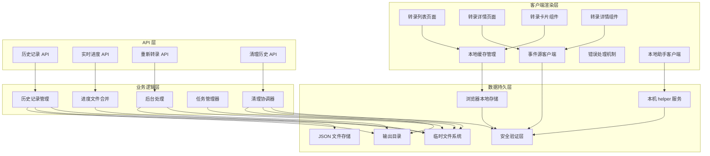

**图表来源**
- [page.tsx:1-107](file://src/app/transcriptions/page.tsx#L1-L107)
- [page.tsx:1-113](file://src/app/transcriptions/[id]/page.tsx#L1-L113)
- [transcription-browser-cache.ts:1-87](file://src/lib/transcription-browser-cache.ts#L1-L87)
- [local-helper-client.ts:1-55](file://src/lib/local-helper-client.ts#L1-L55)
- [route.ts:1-170](file://src/app/api/transcription-history/route.ts#L1-L170)
- [route.ts:1-119](file://src/app/api/transcription-live/route.ts#L1-L119)

## 详细组件分析

### 客户端渲染页面

#### 转录列表页面

采用客户端渲染，实现响应式状态管理和本地缓存：

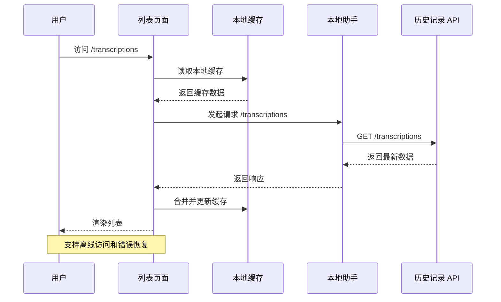

**图表来源**
- [page.tsx:19-41](file://src/app/transcriptions/page.tsx#L19-L41)

#### 转录详情页面

提供完整的客户端渲染体验，支持实时状态跟踪：

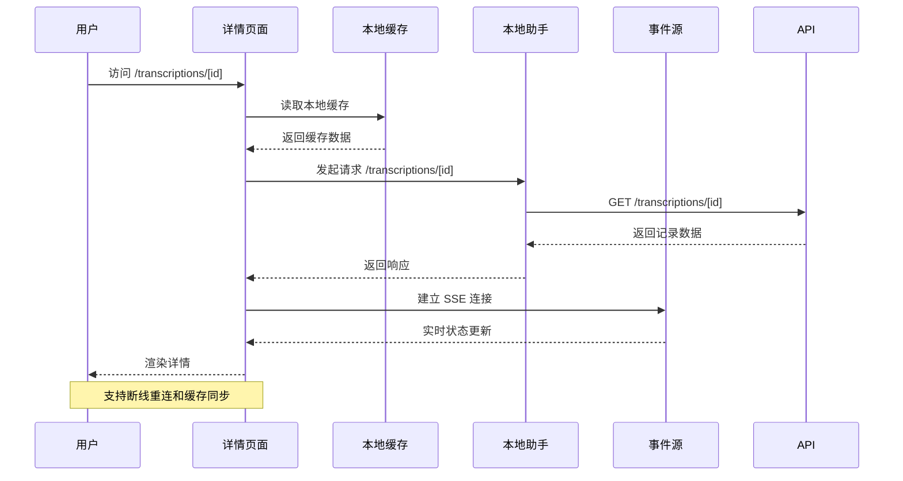

**图表来源**
- [page.tsx:24-47](file://src/app/transcriptions/[id]/page.tsx#L24-L47)

**章节来源**
- [page.tsx:1-107](file://src/app/transcriptions/page.tsx#L1-L107)
- [page.tsx:1-113](file://src/app/transcriptions/[id]/page.tsx#L1-L113)

### 浏览器本地缓存管理

#### 缓存策略

系统实现了一套完整的浏览器本地缓存机制：

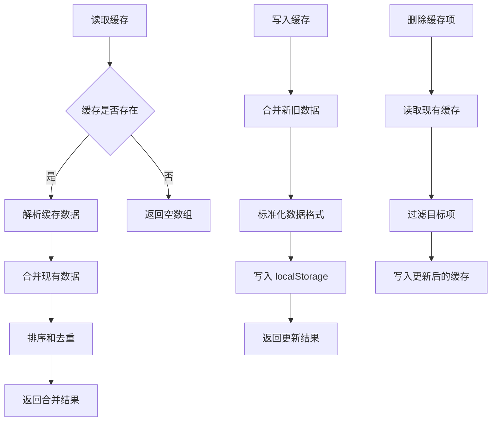

**图表来源**
- [transcription-browser-cache.ts:33-87](file://src/lib/transcription-browser-cache.ts#L33-L87)

#### 缓存数据处理

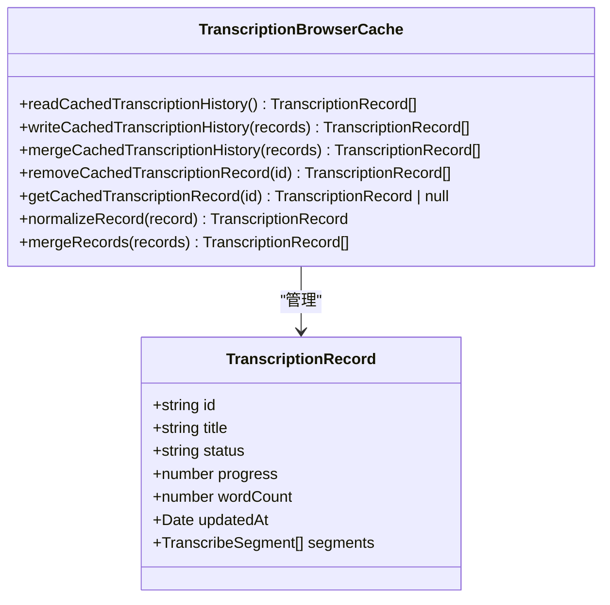

**图表来源**
- [transcription-browser-cache.ts:7-87](file://src/lib/transcription-browser-cache.ts#L7-L87)

**章节来源**
- [transcription-browser-cache.ts:1-87](file://src/lib/transcription-browser-cache.ts#L1-L87)

### 实时事件源客户端

#### 事件源管理

系统使用现代的 EventSource API 实现实时状态更新：

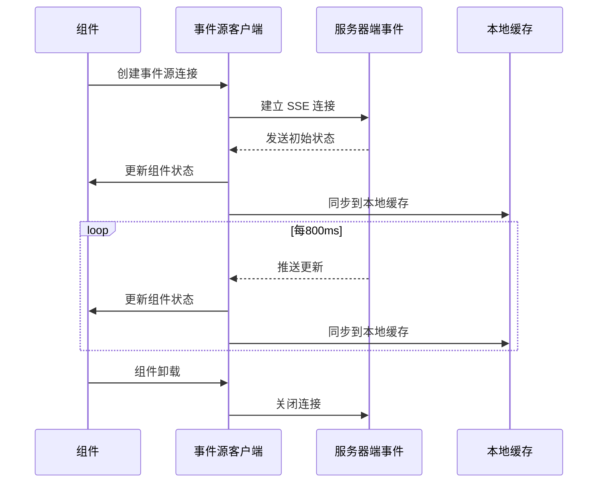

**图表来源**
- [transcription-detail.tsx:74-119](file://src/components/transcription-detail.tsx#L74-L119)

#### 自动重连机制

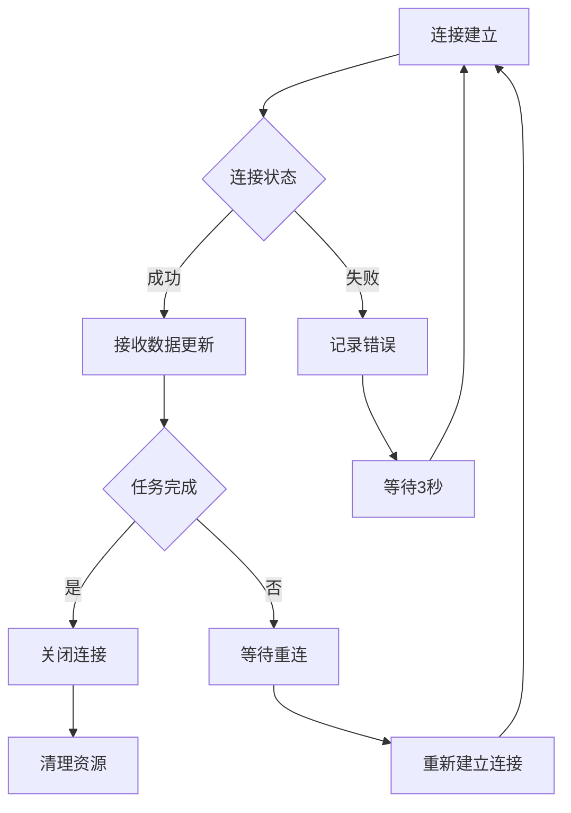

**图表来源**
- [transcription-detail.tsx:103-110](file://src/components/transcription-detail.tsx#L103-L110)

**章节来源**
- [transcription-detail.tsx:1-536](file://src/components/transcription-detail.tsx#L1-L536)

### 本地助手客户端

#### 本机通信层

系统通过本地助手服务实现前后端分离架构：

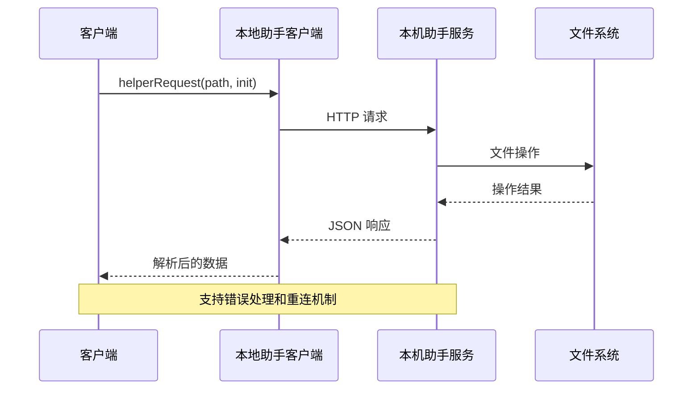

**图表来源**
- [local-helper-client.ts:17-55](file://src/lib/local-helper-client.ts#L17-L55)

#### 事件源连接

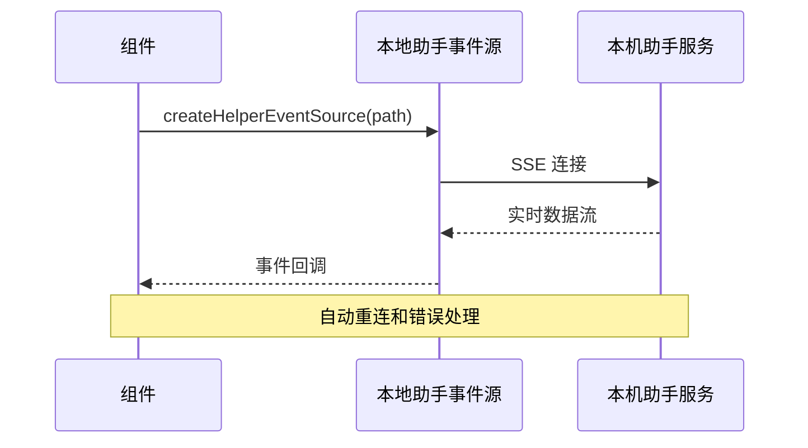

**图表来源**
- [local-helper-client.ts:44-46](file://src/lib/local-helper-client.ts#L44-L46)

**章节来源**
- [local-helper-client.ts:1-55](file://src/lib/local-helper-client.ts#L1-L55)

### 前端组件层

#### 转录卡片组件

提供交互式的转录记录管理功能：

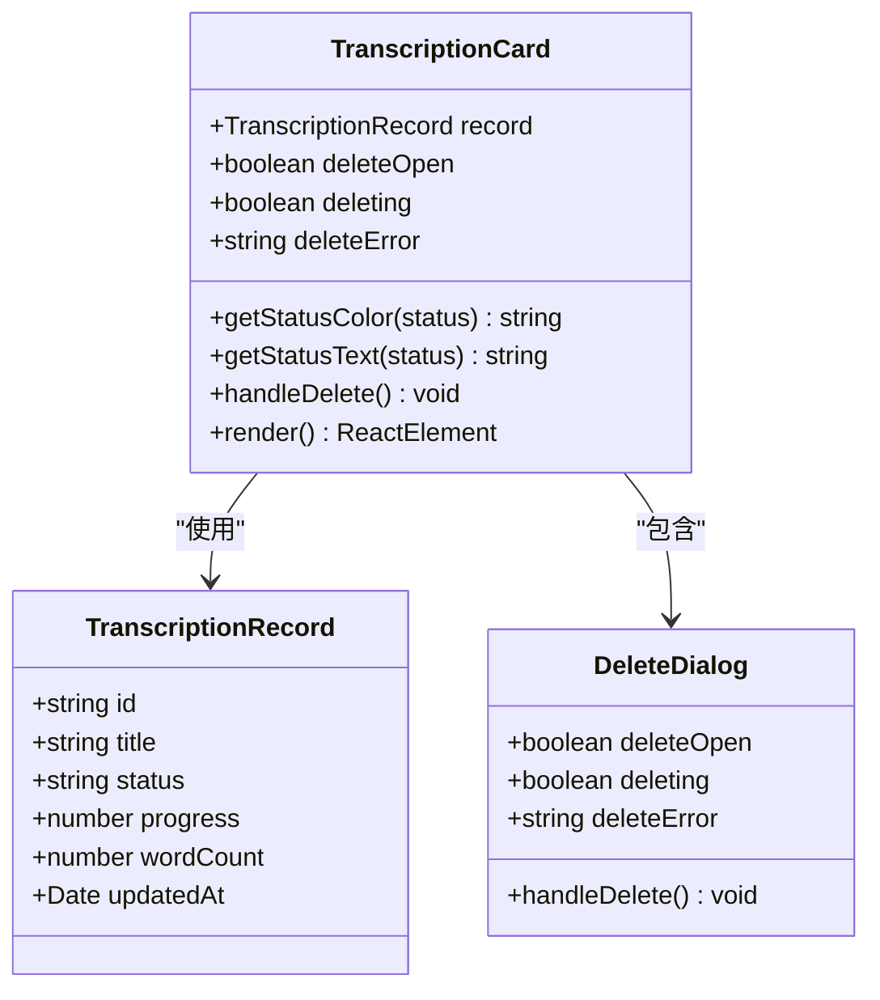

**图表来源**
- [transcription-card.tsx:28-213](file://src/components/transcription-card.tsx#L28-L213)

#### 转录详情组件

提供完整的转录任务详情和实时状态跟踪：

```mermaid
flowchart TD
A[组件挂载] --> B[建立 SSE 连接]
B --> C[接收实时更新]
C --> D[更新本地状态]
D --> E[更新缓存]
E --> F[渲染新内容]
G[用户点击重新转录] --> H[发起重新转录请求]
H --> I[重置状态]
I --> J[重新建立 SSE 连接]
K[连接断开] --> L[自动重连]
L --> M[继续接收更新]
N[网络异常] --> O[使用缓存数据]
O --> P[等待网络恢复]
P --> Q[恢复实时更新]
```

**图表来源**
- [transcription-detail.tsx:74-119](file://src/components/transcription-detail.tsx#L74-L119)

**章节来源**
- [transcription-card.tsx:1-213](file://src/components/transcription-card.tsx#L1-L213)
- [transcription-detail.tsx:1-536](file://src/components/transcription-detail.tsx#L1-L536)

### API 路由层

#### 历史记录 API

提供 RESTful 接口来访问转录历史数据：

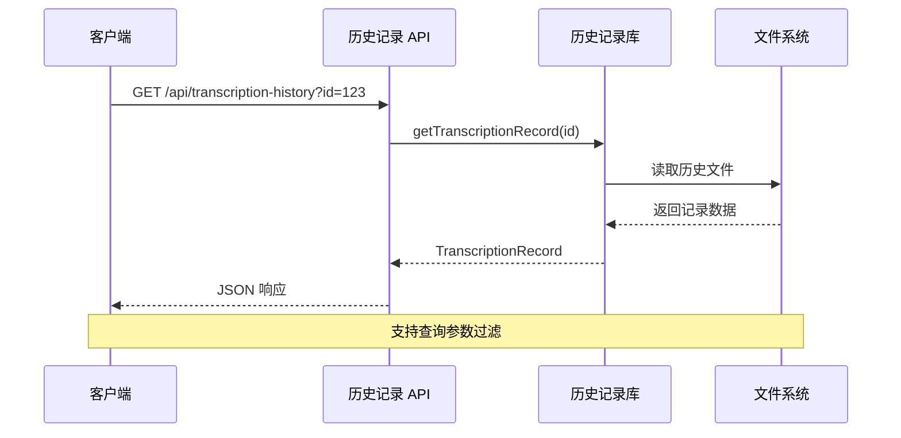

**图表来源**
- [route.ts:62-99](file://src/app/api/transcription-history/route.ts#L62-L99)

#### 实时进度 API

通过 Server-Sent Events 提供实时状态更新：

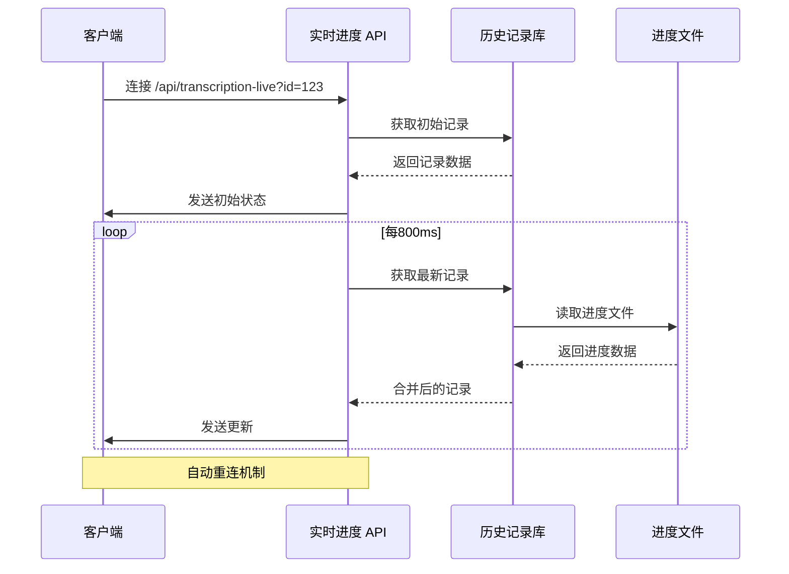

**图表来源**
- [route.ts:38-119](file://src/app/api/transcription-live/route.ts#L38-L119)

#### 转录历史清理 API

提供安全的转录历史清理功能：

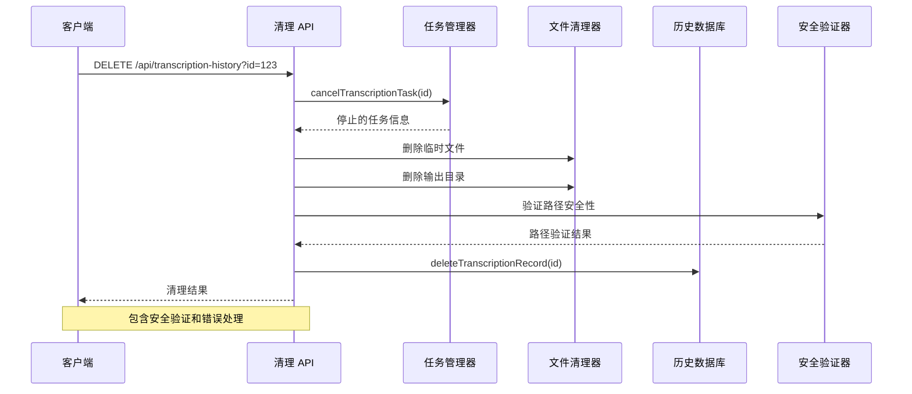

**图表来源**
- [route.ts:101-170](file://src/app/api/transcription-history/route.ts#L101-L170)

**章节来源**
- [route.ts:1-170](file://src/app/api/transcription-history/route.ts#L1-L170)
- [route.ts:1-119](file://src/app/api/transcription-live/route.ts#L1-L119)

## 依赖关系分析

### 外部依赖

项目的主要依赖包括：

```mermaid
graph LR
subgraph "运行时依赖"
A[next@^14.2.3]
B[react@^18.3.1]
C[lucide-react@^1.7.0]
D[tailwindcss@^3.4.1]
E[eventsource@^2.0.2]
F[local-storage@^2.0.0]
G[next-themes@^0.4.6]
H[clsx@^2.1.1]
I[tailwind-merge@^2.6.1]
J[tailwindcss-animate@^1.0.7]
K[xml2js@^0.6.2]
end
subgraph "开发依赖"
L[@types/node@20.19.37]
M[@types/react@18.3.28]
N[typescript@5.9.3]
O[eslint@^8.57.1]
P[autoprefixer@^10.4.17]
Q=postcss@^8.4.35]
R[tailwindcss@^3.4.1]
end
subgraph "内部模块"
S[转录历史库]
T[浏览器缓存管理]
U[UI 组件库]
V[类型定义]
W[任务管理器]
X[清理安全模块]
Y[本地助手客户端]
Z[本机 helper 服务]
end
A --> S
A --> T
B --> U
C --> U
D --> U
E --> U
F --> T
G --> U
H --> U
I --> U
J --> U
K --> U
L --> S
M --> U
N --> V
O --> S
P --> U
Q --> U
R --> U
S --> W
S --> X
T --> F
U --> F
Y --> Z
```

**图表来源**
- [package.json:13-27](file://package.json#L13-L27)

### 内部模块依赖

```mermaid
graph TD
subgraph "页面层"
A[transcriptions/page.tsx]
B[transcriptions/[id]/page.tsx]
end
subgraph "组件层"
C[transcription-card.tsx]
D[transcription-detail.tsx]
end
subgraph "缓存层"
E[transcription-browser-cache.ts]
end
subgraph "API 层"
F[transcription-history/route.ts]
G[transcription-live/route.ts]
H[retranscribe/route.ts]
end
subgraph "业务逻辑层"
I[transcription-history.ts]
J[transcription-progress.ts]
K[transcription-output.ts]
L[transcription-files.ts]
M[transcription-task-manager.ts]
N[whisper-config.ts]
O[local-helper-client.ts]
end
subgraph "类型层"
P[transcription-history.ts]
Q[index.ts]
end
A --> E
B --> E
C --> E
D --> E
E --> P
F --> I
F --> M
F --> N
G --> I
H --> I
H --> J
H --> K
H --> L
M --> N
O --> F
O --> G
O --> H
```

**图表来源**
- [page.tsx:1-107](file://src/app/transcriptions/page.tsx#L1-L107)
- [page.tsx:1-113](file://src/app/transcriptions/[id]/page.tsx#L1-L113)
- [transcription-browser-cache.ts:1-87](file://src/lib/transcription-browser-cache.ts#L1-L87)
- [route.ts:1-170](file://src/app/api/transcription-history/route.ts#L1-L170)
- [local-helper-client.ts:1-55](file://src/lib/local-helper-client.ts#L1-L55)

**章节来源**
- [package.json:1-41](file://package.json#L1-L41)

## 性能考虑

### 客户端渲染优化

1. **懒加载策略**: 页面组件按需加载，减少初始包大小
2. **状态缓存**: 使用 React Hooks 缓存组件状态，避免重复计算
3. **增量更新**: 仅更新变化的数据，减少 DOM 操作
4. **事件源复用**: 复用 EventSource 连接，减少网络开销
5. **本地缓存预加载**: 首屏渲染时优先使用本地缓存数据

### 浏览器缓存优化

1. **智能缓存**: 使用 localStorage 存储历史记录，支持离线访问
2. **缓存合并**: 合并服务器数据和本地缓存，确保数据一致性
3. **缓存失效**: 实现缓存版本控制和自动清理机制
4. **内存管理**: 控制缓存大小，避免内存泄漏

### 网络优化

1. **Server-Sent Events**: 实时更新采用 SSE，减少轮询开销
2. **增量更新**: 进度文件合并只传输变化的数据
3. **自动重连**: 断线自动重连机制确保连接稳定性
4. **错误恢复**: 网络异常时自动回退到本地缓存数据
5. **本机 helper 优化**: 本地助手服务减少网络传输延迟

### 内存管理

1. **对象克隆**: 深度克隆避免意外修改原始数据
2. **及时清理**: 进度文件在完成后延迟清理
3. **资源释放**: 及时关闭文件句柄和网络连接
4. **事件源清理**: 组件卸载时自动清理事件源连接
5. **缓存清理**: 定期清理过期的本地缓存数据

### 安全清理机制

1. **路径验证**: 使用 `isSubPath` 函数确保删除操作仅限于输出根目录内
2. **文件存在检查**: 在删除前验证文件或目录是否存在
3. **错误处理**: 对 ENOENT 错误进行特殊处理，避免异常传播
4. **任务取消**: 删除前先停止相关转录任务，确保资源释放
5. **资源回收**: 自动清理临时文件和输出目录，释放磁盘空间
6. **清理结果反馈**: 提供详细的清理结果信息，包括任务停止状态、目录删除状态等

### 本机 helper 通信优化

1. **连接池管理**: 复用 HTTP 连接，减少连接建立开销
2. **错误隔离**: 本地助手服务异常不影响主应用运行
3. **超时控制**: 设置合理的请求超时时间
4. **重试机制**: 网络异常时自动重试，提升成功率
5. **状态同步**: 本地缓存与服务器状态保持一致

**章节来源**
- [transcription-browser-cache.ts:33-87](file://src/lib/transcription-browser-cache.ts#L33-L87)
- [transcription-detail.tsx:74-119](file://src/components/transcription-detail.tsx#L74-L119)
- [local-helper-client.ts:17-55](file://src/lib/local-helper-client.ts#L17-L55)
- [route.ts:17-55](file://src/app/api/transcription-history/route.ts#L17-L55)

## 故障排除指南

### 常见问题及解决方案

#### 历史文件读取失败

**症状**: 获取转录记录时出现文件读取错误

**可能原因**:
- 文件被其他进程锁定
- JSON 格式损坏
- 权限不足

**解决方法**:
1. 检查文件权限
2. 确认没有其他进程访问文件
3. 查看最近一次有效快照
4. 清理损坏的缓存数据

#### 实时更新连接中断

**症状**: 转录详情页面无法接收实时更新

**可能原因**:
- 网络连接不稳定
- 服务器负载过高
- 客户端断开连接
- 本机助手服务异常

**解决方法**:
1. 检查网络连接
2. 查看服务器日志
3. 等待自动重连机制
4. 重启本机助手服务
5. 检查 EventSource 连接状态

#### 重新转录失败

**症状**: 点击重新转录按钮后无响应

**可能原因**:
- Whisper 环境未正确配置
- 音频文件不可访问
- 磁盘空间不足
- 本机助手服务未连接

**解决方法**:
1. 检查 Whisper 配置
2. 验证音频 URL 可访问性
3. 确保有足够的磁盘空间
4. 启动本机助手服务
5. 检查网络连接

#### 转录历史清理失败

**症状**: 删除转录记录时出现清理错误

**可能原因**:
- 输出目录超出安全范围
- 文件已被其他进程占用
- 权限不足导致删除失败
- 任务仍在运行中
- 本机助手服务异常

**解决方法**:
1. 检查输出目录是否位于配置的安全范围内
2. 确认没有其他进程正在使用相关文件
3. 验证用户对目标目录的删除权限
4. 等待相关转录任务完成后再尝试删除
5. 检查清理过程返回的具体错误信息
6. 查看清理结果中的 `skippedOutputDir` 标志，确认是否被跳过
7. 重启本机助手服务后重试

#### 客户端渲染问题

**症状**: 页面无法正常渲染或状态不同步

**可能原因**:
- 本地缓存损坏
- 事件源连接失败
- 网络请求超时
- 组件状态管理异常
- 本机助手通信异常

**解决方法**:
1. 清除浏览器缓存和本地存储
2. 检查网络连接和 API 可用性
3. 查看浏览器控制台错误信息
4. 重启应用或刷新页面
5. 检查 EventSource 连接状态
6. 重启本机助手服务
7. 检查本地助手服务日志

#### 事件源连接问题

**症状**: 实时更新无法正常工作

**可能原因**:
- 服务器端事件源配置错误
- 客户端 EventSource 不支持
- 网络代理或防火墙阻拦
- 连接超时或断开
- 本机助手服务异常

**解决方法**:
1. 检查服务器端事件源配置
2. 确认客户端浏览器支持 EventSource
3. 检查网络代理设置
4. 查看连接日志和错误信息
5. 尝试不同的网络环境
6. 重启本机助手服务
7. 检查本机助手服务状态

#### 本机助手通信问题

**症状**: 本地助手服务无法连接或响应缓慢

**可能原因**:
- 本机助手服务未启动
- 端口被占用
- 防火墙阻止连接
- 跨域问题
- 本机助手服务崩溃

**解决方法**:
1. 启动本机助手服务 (`npm run helper`)
2. 检查默认端口 `127.0.0.1:47392` 是否可用
3. 检查防火墙设置
4. 验证跨域配置
5. 查看本机助手服务日志
6. 重启本机助手服务
7. 检查系统资源使用情况

**章节来源**
- [transcription-history.ts:47-84](file://src/lib/transcription-history.ts#L47-L84)
- [transcription-browser-cache.ts:33-53](file://src/lib/transcription-browser-cache.ts#L33-L53)
- [transcription-detail.tsx:103-110](file://src/components/transcription-detail.tsx#L103-L110)
- [local-helper-client.ts:6-11](file://src/lib/local-helper-client.ts#L6-L11)
- [route.ts:92-99](file://src/app/api/transcription-live/route.ts#L92-L99)
- [route.ts:162-169](file://src/app/api/transcription-history/route.ts#L162-L169)

## 结论

Transcription History System 是一个设计精良的转录历史管理模块，经过现代化改造后具有以下特点：

### 优势

1. **现代化架构**: 采用客户端渲染，提供更好的用户体验
2. **离线可用性**: 浏览器本地缓存支持离线访问
3. **实时更新**: EventSource 实现实时状态跟踪
4. **错误恢复**: 完善的错误处理和网络异常恢复机制
5. **性能优化**: 智能缓存和增量更新机制
6. **可靠性**: 原子性写入和错误恢复机制确保数据完整性
7. **安全性**: 新增的清理功能包含多重安全验证机制
8. **前后端分离**: 通过本机助手服务实现清晰的职责分离
9. **本机能力**: 通过本地助手服务访问用户本地转录能力
10. **错误隔离**: 本地助手服务异常不影响主应用运行

### 技术亮点

1. **客户端状态管理**: 使用 React Hooks 实现响应式状态更新
2. **浏览器缓存集成**: localStorage 存储历史记录，支持离线访问
3. **事件源实时更新**: SSE 实现实时状态同步
4. **智能错误恢复**: 网络异常时自动回退到本地缓存
5. **性能优化**: 增量更新和内存缓存机制
6. **用户体验**: 自动重连和加载状态管理
7. **安全清理**: 路径验证和资源保护机制
8. **本机通信**: 本地助手服务提供稳定的本地转录能力
9. **错误隔离**: 本地助手服务异常不影响主应用
10. **资源管理**: 优化的内存和网络资源使用

### 改进建议

1. **监控告警**: 添加更完善的错误监控和告警机制
2. **缓存策略**: 考虑添加更智能的缓存策略
3. **测试覆盖**: 增加单元测试和集成测试覆盖率
4. **文档完善**: 补充更详细的 API 文档和使用示例
5. **清理审计**: 考虑添加清理操作的日志记录功能
6. **性能监控**: 添加客户端性能指标监控
7. **本机助手监控**: 添加本地助手服务健康检查
8. **缓存清理策略**: 实现智能的缓存清理和容量管理

### 架构升级总结

转录历史系统的现代化改造显著提升了系统的整体性能和用户体验：
- **客户端渲染**: 从服务端渲染改为客户端渲染，实现响应式状态管理
- **本地缓存**: 集成浏览器本地存储，支持离线访问和快速加载
- **实时更新**: 使用 EventSource 实现实时状态跟踪，提供更好的用户体验
- **错误处理**: 增强的错误处理机制，支持网络异常时的优雅降级
- **性能优化**: 智能缓存和增量更新，减少不必要的网络请求和DOM操作
- **安全性**: 保持原有的安全清理功能，确保数据安全
- **本机集成**: 通过本地助手服务实现与用户本地环境的深度集成
- **错误隔离**: 本地助手服务异常不影响主应用的稳定性

该系统为 MemoFlow 应用提供了稳定可靠的转录历史管理能力，现代化的架构设计使其能够更好地适应未来的需求变化，是整个应用的重要基础设施。新增的功能进一步提升了系统的健壮性、用户数据的安全性和整体用户体验。通过本机助手服务的集成，系统实现了前后端分离的最佳实践，既保证了用户体验，又确保了本地转录能力的安全访问。