# 转录历史系统

<cite>
**本文档引用的文件**
- [transcription-history.ts](file://src/lib/transcription-history.ts)
- [transcription-history.ts](file://src/types/transcription-history.ts)
- [route.ts](file://src/app/api/transcription-history/route.ts)
- [transcription-card.tsx](file://src/components/transcription-card.tsx)
- [transcription-detail.tsx](file://src/components/transcription-detail.tsx)
- [page.tsx](file://src/app/transcriptions/page.tsx)
- [page.tsx](file://src/app/transcriptions/[id]/page.tsx)
- [index.ts](file://src/types/index.ts)
- [route.ts](file://src/app/api/transcription-live/route.ts)
- [route.ts](file://src/app/api/retranscribe/route.ts)
- [README.md](file://README.md)
- [package.json](file://package.json)
</cite>

## 目录
1. [简介](#简介)
2. [项目结构](#项目结构)
3. [核心组件](#核心组件)
4. [架构概览](#架构概览)
5. [详细组件分析](#详细组件分析)
6. [依赖关系分析](#依赖关系分析)
7. [性能考虑](#性能考虑)
8. [故障排除指南](#故障排除指南)
9. [结论](#结论)

## 简介

Transcription History System 是 MemoFlow 应用中的一个核心模块，负责管理和存储音频转录的历史记录。该系统提供了完整的转录历史管理功能，包括记录的创建、查询、更新、删除以及实时状态跟踪。

MemoFlow 是一个 AI 驱动的内容分析与创作助手，支持多平台内容抓取和分析，而转录历史系统是其重要组成部分，用于追踪和管理用户的音频转录任务。

## 项目结构

该项目采用 Next.js 应用程序模式，主要结构如下：

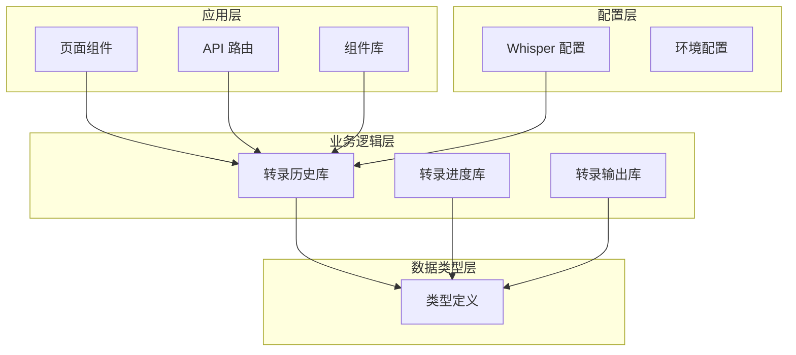

**图表来源**
- [transcription-history.ts:1-208](file://src/lib/transcription-history.ts#L1-L208)
- [route.ts:1-80](file://src/app/api/transcription-history/route.ts#L1-L80)

**章节来源**
- [README.md:1-27](file://README.md#L1-L27)
- [package.json:1-40](file://package.json#L1-L40)

## 核心组件

### 数据模型

转录历史系统的核心数据结构包括以下关键接口：

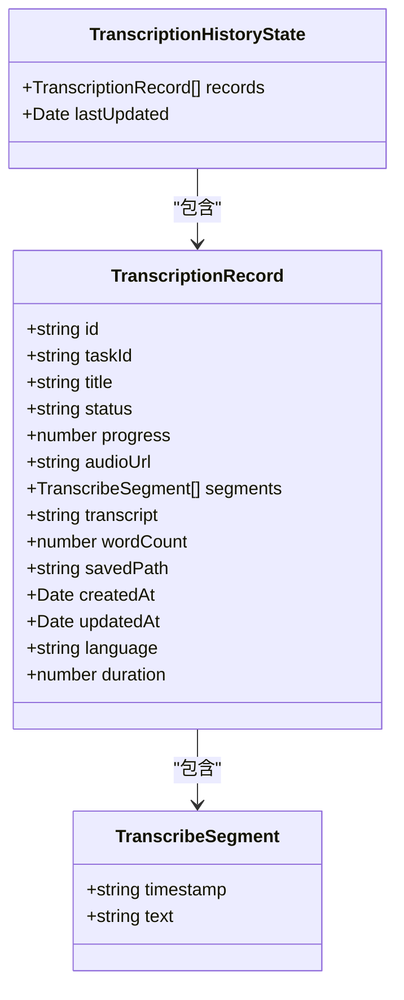

**图表来源**
- [transcription-history.ts:3-18](file://src/types/transcription-history.ts#L3-L18)
- [index.ts:27-30](file://src/types/index.ts#L27-L30)

### 历史记录管理

系统提供完整的 CRUD 操作来管理转录历史：

- **添加记录**: `addTranscriptionRecord()`
- **获取单个记录**: `getTranscriptionRecord()`
- **获取所有记录**: `getAllTranscriptionRecords()`
- **更新记录**: `updateTranscriptionRecord()`
- **删除记录**: `deleteTranscriptionRecord()`

**章节来源**
- [transcription-history.ts:139-207](file://src/lib/transcription-history.ts#L139-L207)

## 架构概览

转录历史系统采用分层架构设计，确保了良好的可维护性和扩展性：

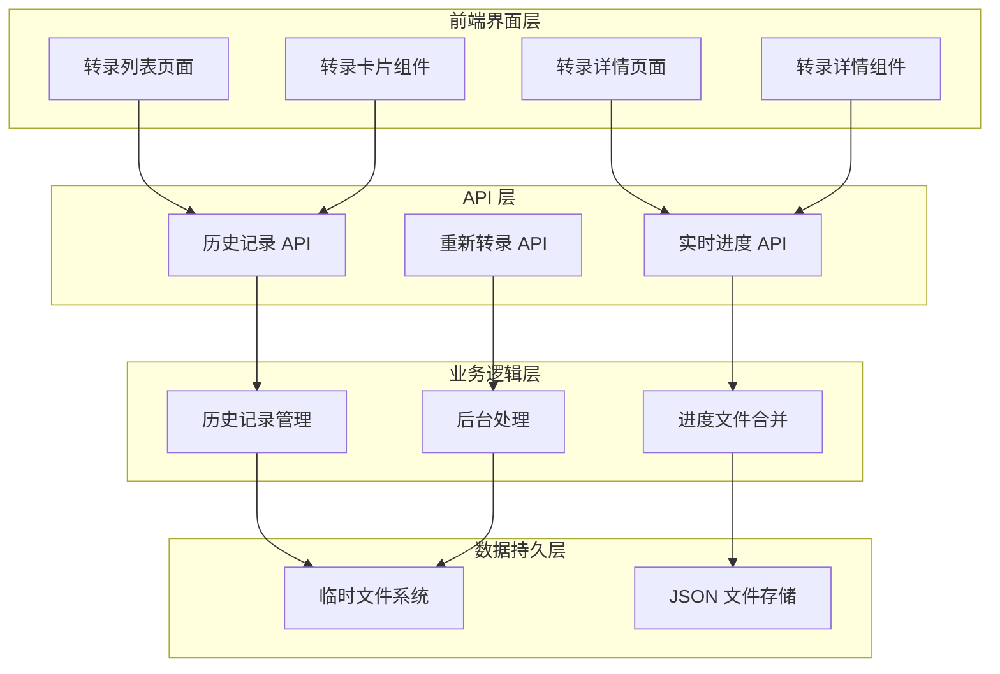

**图表来源**
- [route.ts:1-80](file://src/app/api/transcription-history/route.ts#L1-L80)
- [route.ts:1-117](file://src/app/api/transcription-live/route.ts#L1-L117)
- [route.ts:1-391](file://src/app/api/retranscribe/route.ts#L1-L391)

## 详细组件分析

### 转录历史库 (transcription-history.ts)

这是系统的核心数据管理模块，提供了完整的文件系统操作和数据持久化功能：

#### 关键特性

1. **原子性写入**: 使用临时文件和原子重命名确保数据一致性
2. **并发控制**: 通过队列机制防止并发写入冲突
3. **错误恢复**: 支持 JSON 解析错误的回退机制
4. **类型安全**: 完整的 TypeScript 类型定义

#### 数据持久化策略

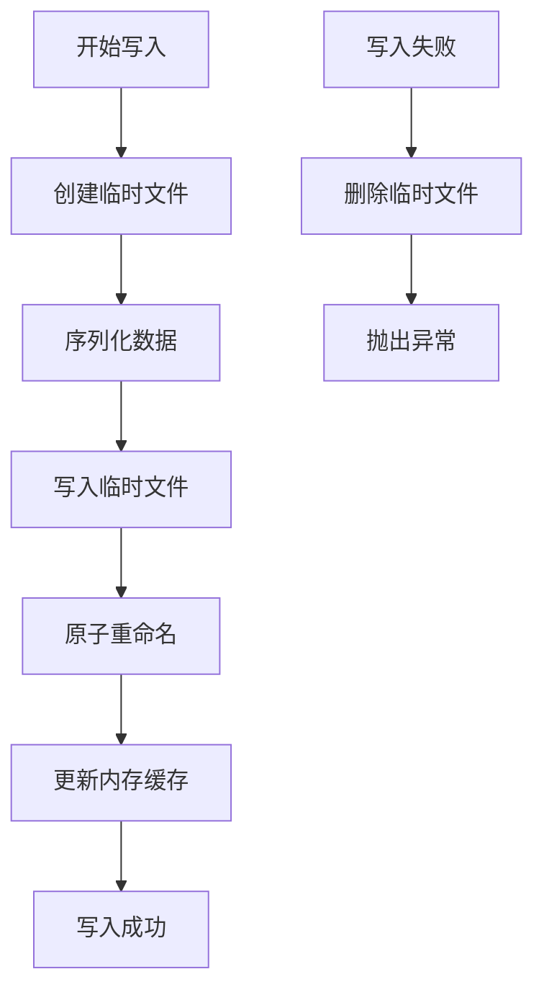

**图表来源**
- [transcription-history.ts:116-137](file://src/lib/transcription-history.ts#L116-L137)

**章节来源**
- [transcription-history.ts:1-208](file://src/lib/transcription-history.ts#L1-L208)

### API 路由层

#### 历史记录 API

提供 RESTful 接口来访问转录历史数据：

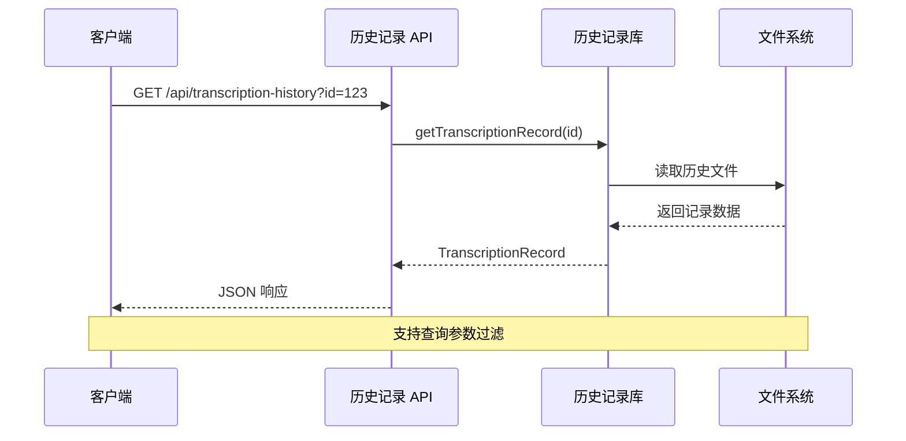

**图表来源**
- [route.ts:8-45](file://src/app/api/transcription-history/route.ts#L8-L45)

#### 实时进度 API

通过 Server-Sent Events 提供实时状态更新：

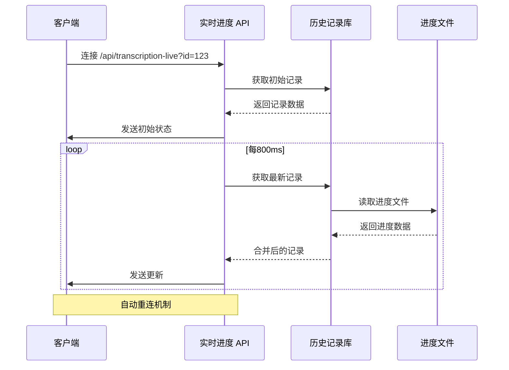

**图表来源**
- [route.ts:36-117](file://src/app/api/transcription-live/route.ts#L36-L117)

**章节来源**
- [route.ts:1-80](file://src/app/api/transcription-history/route.ts#L1-L80)
- [route.ts:1-117](file://src/app/api/transcription-live/route.ts#L1-L117)

### 前端组件层

#### 转录卡片组件

提供简洁的转录记录预览：

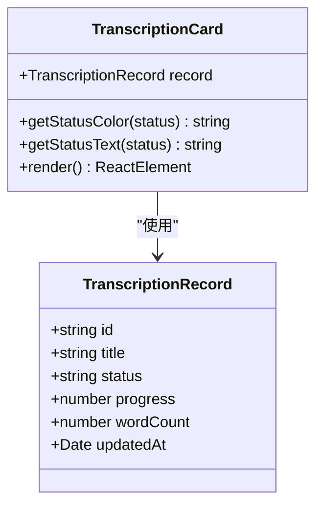

**图表来源**
- [transcription-card.tsx:10-92](file://src/components/transcription-card.tsx#L10-L92)

#### 转录详情组件

提供完整的转录任务详情和实时状态跟踪：

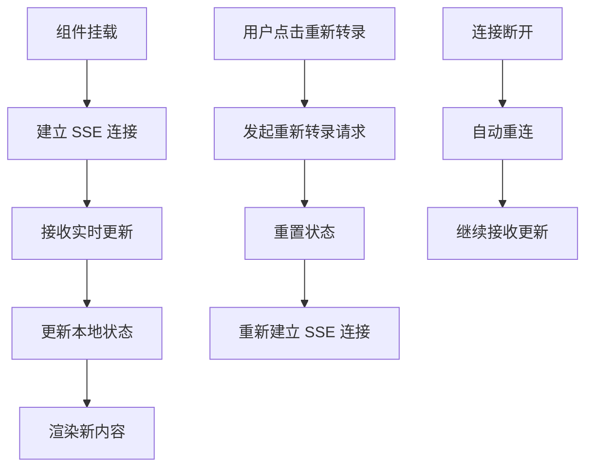

**图表来源**
- [transcription-detail.tsx:62-106](file://src/components/transcription-detail.tsx#L62-L106)

**章节来源**
- [transcription-card.tsx:1-92](file://src/components/transcription-card.tsx#L1-L92)
- [transcription-detail.tsx:1-394](file://src/components/transcription-detail.tsx#L1-L394)

### 页面路由

#### 转录列表页面

提供转录历史的网格视图：

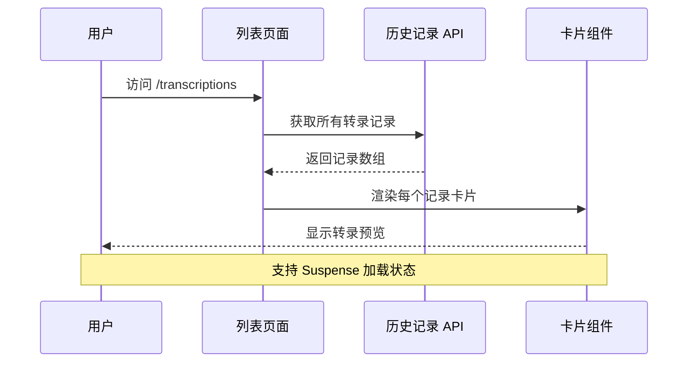

**图表来源**
- [page.tsx:7-23](file://src/app/transcriptions/page.tsx#L7-L23)

#### 转录详情页面

提供单个转录任务的详细视图：

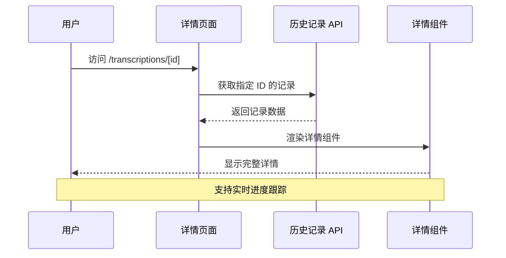

**图表来源**
- [page.tsx:13-28](file://src/app/transcriptions/[id]/page.tsx#L13-L28)

**章节来源**
- [page.tsx:1-85](file://src/app/transcriptions/page.tsx#L1-L85)
- [page.tsx:1-93](file://src/app/transcriptions/[id]/page.tsx#L1-L93)

## 依赖关系分析

### 外部依赖

项目的主要依赖包括：

```mermaid
graph LR
subgraph "运行时依赖"
A[next@^14.2.3]
B[react@^18.3.1]
C[lucide-react@^1.7.0]
D[tailwindcss@^3.4.1]
end
subgraph "开发依赖"
E[@types/node@20.19.37]
F[@types/react@18.3.28]
G[typescript@5.9.3]
H[eslint@^8.57.1]
end
subgraph "内部模块"
I[转录历史库]
J[UI 组件库]
K[类型定义]
end
A --> I
B --> J
C --> J
D --> J
E --> I
F --> J
G --> K
H --> I
```

**图表来源**
- [package.json:12-38](file://package.json#L12-L38)

### 内部模块依赖

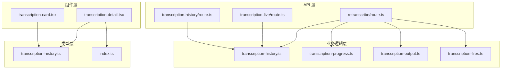

**图表来源**
- [route.ts:1-6](file://src/app/api/transcription-history/route.ts#L1-L6)
- [route.ts:1-6](file://src/app/api/transcription-live/route.ts#L1-L6)
- [route.ts:1-27](file://src/app/api/retranscribe/route.ts#L1-L27)

**章节来源**
- [package.json:1-40](file://package.json#L1-L40)

## 性能考虑

### 文件系统优化

1. **原子写入**: 使用临时文件和原子重命名避免部分写入
2. **并发控制**: 通过队列机制防止并发写入冲突
3. **内存缓存**: 维护最后已知良好历史状态用于错误恢复

### 网络优化

1. **Server-Sent Events**: 实时更新采用 SSE，减少轮询开销
2. **增量更新**: 进度文件合并只传输变化的数据
3. **自动重连**: 断线自动重连机制确保连接稳定性

### 内存管理

1. **对象克隆**: 深度克隆避免意外修改原始数据
2. **及时清理**: 进度文件在完成后延迟清理
3. **资源释放**: 及时关闭文件句柄和网络连接

## 故障排除指南

### 常见问题及解决方案

#### 历史文件读取失败

**症状**: 获取转录记录时出现文件读取错误

**可能原因**:
- 文件被其他进程锁定
- JSON 格式损坏
- 权限不足

**解决方法**:
1. 检查文件权限
2. 确认没有其他进程访问文件
3. 查看最近一次有效快照

#### 实时更新连接中断

**症状**: 转录详情页面无法接收实时更新

**可能原因**:
- 网络连接不稳定
- 服务器负载过高
- 客户端断开连接

**解决方法**:
1. 检查网络连接
2. 查看服务器日志
3. 等待自动重连机制

#### 重新转录失败

**症状**: 点击重新转录按钮后无响应

**可能原因**:
- Whisper 环境未正确配置
- 音频文件不可访问
- 磁盘空间不足

**解决方法**:
1. 检查 Whisper 配置
2. 验证音频 URL 可访问性
3. 确保有足够的磁盘空间

**章节来源**
- [transcription-history.ts:47-84](file://src/lib/transcription-history.ts#L47-L84)
- [route.ts:90-94](file://src/app/api/transcription-live/route.ts#L90-L94)
- [route.ts:340-354](file://src/app/api/retranscribe/route.ts#L340-L354)

## 结论

Transcription History System 是一个设计精良的转录历史管理模块，具有以下特点：

### 优势

1. **可靠性**: 原子性写入和错误恢复机制确保数据完整性
2. **实时性**: SSE 实现实时状态更新，用户体验优秀
3. **可扩展性**: 模块化设计便于功能扩展
4. **类型安全**: 完整的 TypeScript 类型定义

### 技术亮点

1. **并发控制**: 通过队列机制防止数据竞争
2. **错误处理**: 多层次的错误恢复策略
3. **性能优化**: 增量更新和内存缓存机制
4. **用户体验**: 自动重连和加载状态管理

### 改进建议

1. **监控告警**: 添加更完善的错误监控和告警机制
2. **缓存策略**: 考虑添加更智能的缓存策略
3. **测试覆盖**: 增加单元测试和集成测试覆盖率
4. **文档完善**: 补充更详细的 API 文档和使用示例

该系统为 MemoFlow 应用提供了稳定可靠的转录历史管理能力，是整个应用的重要基础设施。