# UI 组件系统

<cite>
**本文引用的文件**
- [src/components/ui/button.tsx](file://src/components/ui/button.tsx)
- [src/components/ui/input.tsx](file://src/components/ui/input.tsx)
- [src/components/ui/card.tsx](file://src/components/ui/card.tsx)
- [src/components/ui/dialog.tsx](file://src/components/ui/dialog.tsx)
- [src/components/ui/toast.tsx](file://src/components/ui/toast.tsx)
- [src/components/ui/badge.tsx](file://src/components/ui/badge.tsx)
- [src/components/ui/flow-loader.tsx](file://src/components/ui/flow-loader.tsx)
- [src/components/ui/progress.tsx](file://src/components/ui/progress.tsx)
- [src/components/ui/tabs.tsx](file://src/components/ui/tabs.tsx)
- [src/components/ui/separator.tsx](file://src/components/ui/separator.tsx)
- [src/components/app-shell.tsx](file://src/components/app-shell.tsx)
- [src/components/sidebar.tsx](file://src/components/sidebar.tsx)
- [src/components/whisper-settings.tsx](file://src/components/whisper-settings.tsx)
- [src/components/transcription-card.tsx](file://src/components/transcription-card.tsx)
- [src/components/transcription-detail.tsx](file://src/components/transcription-detail.tsx)
- [src/lib/utils.ts](file://src/lib/utils.ts)
- [src/lib/whisper-config.ts](file://src/lib/whisper-config.ts)
- [src/lib/transcription-history.ts](file://src/lib/transcription-history.ts)
- [src/types/index.ts](file://src/types/index.ts)
- [src/types/transcription-history.ts](file://src/types/transcription-history.ts)
- [src/app/transcriptions/page.tsx](file://src/app/transcriptions/page.tsx)
- [src/app/transcriptions/[id]/page.tsx](file://src/app/transcriptions/[id]/page.tsx)
- [src/app/api/transcription-history/route.ts](file://src/app/api/transcription-history/route.ts)
- [src/app/api/transcription-live/route.ts](file://src/app/api/transcription-live/route.ts)
- [src/app/api/retranscribe/route.ts](file://src/app/api/retranscribe/route.ts)
</cite>

## 更新摘要
**所做更改**
- 新增转录历史相关的UI组件：TranscriptionCard 和 TranscriptionDetail
- 改进导航组件以支持新的路由结构，包括转录历史页面
- 新增转录历史相关的API路由和类型定义
- 增强AppShell组件以支持动态路由状态同步
- 完善转录历史管理的完整工作流程

## 目录
1. [简介](#简介)
2. [项目结构](#项目结构)
3. [核心组件](#核心组件)
4. [架构总览](#架构总览)
5. [详细组件分析](#详细组件分析)
6. [转录历史系统](#转录历史系统)
7. [依赖关系分析](#依赖关系分析)
8. [性能考虑](#性能考虑)
9. [故障排查指南](#故障排查指南)
10. [结论](#结论)
11. [附录](#附录)

## 简介
MemoFlow UI 组件系统以简洁、可组合、可扩展为核心设计理念，采用 Tailwind CSS 与 Radix UI 原子化组件构建，提供基础 UI 组件库与业务组件，覆盖按钮、输入框、卡片、对话框、标签页、进度条、徽章、加载器、分隔符等通用控件，以及应用外壳、侧边栏、Whisper 设置面板、转录历史管理等业务组件。系统强调：
- 设计一致性：通过统一的变体与尺寸体系保证视觉一致
- 可访问性：遵循语义化与键盘导航，提供无障碍标签
- 响应式布局：移动端与桌面端差异化交互
- 状态管理：以 React Hooks 与受控/非受控模式结合
- 主题与样式：基于 Tailwind 变量与 cn 工具函数进行样式合并与覆盖
- 实时数据：支持 SSE 实时更新和转录进度跟踪

## 项目结构
UI 组件主要位于 src/components/ui 与业务组件位于 src/components；工具函数与类型定义分别位于 src/lib 与 src/types。新增的转录历史系统包括专门的页面组件和API路由。

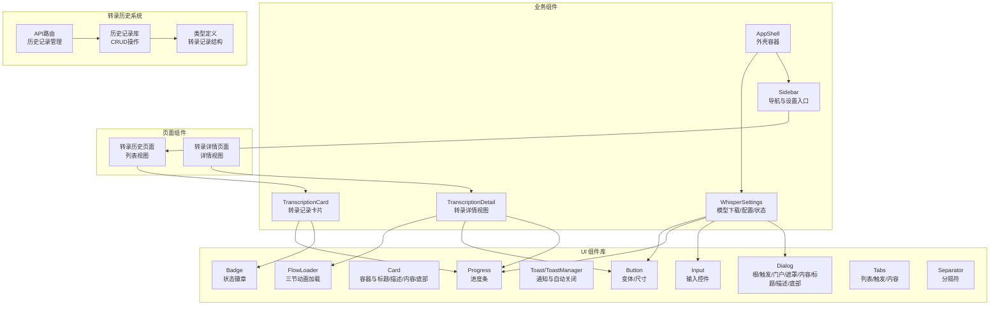

**图表来源**
- [src/components/ui/button.tsx:1-42](file://src/components/ui/button.tsx#L1-L42)
- [src/components/ui/input.tsx:1-25](file://src/components/ui/input.tsx#L1-L25)
- [src/components/ui/card.tsx:1-72](file://src/components/ui/card.tsx#L1-L72)
- [src/components/ui/dialog.tsx:1-122](file://src/components/ui/dialog.tsx#L1-L122)
- [src/components/ui/toast.tsx:1-67](file://src/components/ui/toast.tsx#L1-L67)
- [src/components/ui/badge.tsx:1-32](file://src/components/ui/badge.tsx#L1-L32)
- [src/components/ui/flow-loader.tsx:1-58](file://src/components/ui/flow-loader.tsx#L1-L58)
- [src/components/ui/progress.tsx:1-35](file://src/components/ui/progress.tsx#L1-L35)
- [src/components/ui/tabs.tsx:1-55](file://src/components/ui/tabs.tsx#L1-L55)
- [src/components/ui/separator.tsx:1-28](file://src/components/ui/separator.tsx#L1-L28)
- [src/components/app-shell.tsx:1-42](file://src/components/app-shell.tsx#L1-L42)
- [src/components/sidebar.tsx:1-242](file://src/components/sidebar.tsx#L1-L242)
- [src/components/whisper-settings.tsx:1-664](file://src/components/whisper-settings.tsx#L1-L664)
- [src/components/transcription-card.tsx:1-92](file://src/components/transcription-card.tsx#L1-L92)
- [src/components/transcription-detail.tsx:1-388](file://src/components/transcription-detail.tsx#L1-L388)
- [src/lib/utils.ts:1-13](file://src/lib/utils.ts#L1-L13)
- [src/lib/whisper-config.ts:1-108](file://src/lib/whisper-config.ts#L1-L108)
- [src/lib/transcription-history.ts:1-128](file://src/lib/transcription-history.ts#L1-L128)
- [src/types/index.ts:1-22](file://src/types/index.ts#L1-L22)
- [src/types/transcription-history.ts:1-23](file://src/types/transcription-history.ts#L1-L23)
- [src/app/transcriptions/page.tsx:1-85](file://src/app/transcriptions/page.tsx#L1-L85)
- [src/app/transcriptions/[id]/page.tsx:1-93](file://src/app/transcriptions/[id]/page.tsx#L1-L93)

**章节来源**
- [src/components/ui/button.tsx:1-42](file://src/components/ui/button.tsx#L1-L42)
- [src/components/ui/input.tsx:1-25](file://src/components/ui/input.tsx#L1-L25)
- [src/components/ui/card.tsx:1-72](file://src/components/ui/card.tsx#L1-L72)
- [src/components/ui/dialog.tsx:1-122](file://src/components/ui/dialog.tsx#L1-L122)
- [src/components/ui/toast.tsx:1-67](file://src/components/ui/toast.tsx#L1-L67)
- [src/components/ui/badge.tsx:1-32](file://src/components/ui/badge.tsx#L1-L32)
- [src/components/ui/flow-loader.tsx:1-58](file://src/components/ui/flow-loader.tsx#L1-L58)
- [src/components/ui/progress.tsx:1-35](file://src/components/ui/progress.tsx#L1-L35)
- [src/components/ui/tabs.tsx:1-55](file://src/components/ui/tabs.tsx#L1-L55)
- [src/components/ui/separator.tsx:1-28](file://src/components/ui/separator.tsx#L1-L28)
- [src/components/app-shell.tsx:1-42](file://src/components/app-shell.tsx#L1-L42)
- [src/components/sidebar.tsx:1-242](file://src/components/sidebar.tsx#L1-L242)
- [src/components/whisper-settings.tsx:1-664](file://src/components/whisper-settings.tsx#L1-L664)
- [src/components/transcription-card.tsx:1-92](file://src/components/transcription-card.tsx#L1-L92)
- [src/components/transcription-detail.tsx:1-388](file://src/components/transcription-detail.tsx#L1-L388)
- [src/lib/utils.ts:1-13](file://src/lib/utils.ts#L1-L13)
- [src/lib/whisper-config.ts:1-108](file://src/lib/whisper-config.ts#L1-L108)
- [src/lib/transcription-history.ts:1-128](file://src/lib/transcription-history.ts#L1-L128)
- [src/types/index.ts:1-22](file://src/types/index.ts#L1-L22)
- [src/types/transcription-history.ts:1-23](file://src/types/transcription-history.ts#L1-L23)
- [src/app/transcriptions/page.tsx:1-85](file://src/app/transcriptions/page.tsx#L1-L85)
- [src/app/transcriptions/[id]/page.tsx:1-93](file://src/app/transcriptions/[id]/page.tsx#L1-L93)

## 核心组件
本节对基础 UI 组件进行属性、事件与样式定制的系统性说明。所有组件均通过 cn 工具函数合并类名，确保样式可叠加与覆盖。

- Button（按钮）
  - 属性
    - variant: 变体，支持 default、destructive、outline、secondary、ghost、link
    - size: 尺寸，支持 sm、md、lg、icon
    - 其余继承自原生 button
  - 行为与样式
    - 统一的基础样式与焦点可见环
    - 不同变体与尺寸映射不同背景、边框与阴影
    - 支持禁用态与可访问性焦点环
  - 使用建议
    - 重要操作使用 default 或 destructive
    - 边框/次级操作使用 outline 或 secondary
    - 链接风格使用 link
    - 图标按钮使用 icon 尺寸

- Input（输入框）
  - 属性
    - type: 输入类型（text、password 等）
    - 其余继承自原生 input
  - 行为与样式
    - 统一圆角、边框与占位符颜色
    - 聚焦时显示带透明度的 ring
    - 禁用态不可交互且透明度降低
  - 使用建议
    - 与表单配合时提供 label
    - 数字输入使用 type="number"

- Card（卡片）
  - 子组件
    - Card、CardHeader、CardTitle、CardDescription、CardContent、CardFooter
  - 行为与样式
    - 半透明白底、模糊背景与边框
    - 标题、描述、内容、底部的排版与间距
    - 有机形状与微妙渐变装饰
  - 使用建议
    - 信息分组展示，避免过深嵌套

- Dialog（对话框）
  - 组成
    - Root、Trigger、Portal、Overlay、Content、Header、Footer、Title、Description、Close
  - 行为与样式
    - 背景遮罩与居中动画
    - 关闭按钮带 sr-only 文本提升可访问性
    - 支持移动端滑入/缩放动画
  - 使用建议
    - 内容区限制最大宽度与滚动
    - Footer 中放置确认/取消按钮

- Toast/ToastManager（通知）
  - 组件
    - Toast：固定右下角，带图标、可手动关闭
    - ToastManager：条件渲染包装器
  - 行为与样式
    - 自动定时关闭（默认 3 秒）
    - 三色类型（成功/错误/信息）对应不同边框与阴影
  - 使用建议
    - 成功/错误反馈使用 Toast
    - 批量通知使用 Manager 管理队列

- Badge（徽章）
  - 属性
    - variant: default、secondary、destructive、outline
  - 行为与样式
    - 圆形标签，支持描边与填充变体
  - 使用建议
    - 状态提示与新功能标识

- FlowLoader（流式加载器）
  - 属性
    - size: sm、md、lg
  - 行为与样式
    - 三节圆点，依次延迟动画，随 size 调整高度与宽度
  - 使用建议
    - 页面加载与异步任务指示

- Progress（进度条）
  - 属性
    - value: 当前值
    - max: 最大值，默认 100
  - 行为与样式
    - 百分比计算与平滑过渡
  - 使用建议
    - 文件上传/下载进度

- Tabs（标签页）
  - 组成
    - Root、List、Trigger、Content
  - 行为与样式
    - 激活态高亮与阴影
  - 使用建议
    - 分组内容切换

- Separator（分隔符）
  - 属性
    - orientation: 方向，horizontal 或 vertical
    - decorative: 是否为装饰性元素
  - 行为与样式
    - 支持水平和垂直方向
    - 装饰性元素不影响语义化
  - 使用建议
    - 内容分组与信息分隔

**章节来源**
- [src/components/ui/button.tsx:4-36](file://src/components/ui/button.tsx#L4-L36)
- [src/components/ui/input.tsx:4-19](file://src/components/ui/input.tsx#L4-L19)
- [src/components/ui/card.tsx:4-71](file://src/components/ui/card.tsx#L4-L71)
- [src/components/ui/dialog.tsx:8-121](file://src/components/ui/dialog.tsx#L8-L121)
- [src/components/ui/toast.tsx:6-48](file://src/components/ui/toast.tsx#L6-L48)
- [src/components/ui/badge.tsx:4-29](file://src/components/ui/badge.tsx#L4-L29)
- [src/components/ui/flow-loader.tsx:5-57](file://src/components/ui/flow-loader.tsx#L5-L57)
- [src/components/ui/progress.tsx:6-31](file://src/components/ui/progress.tsx#L6-L31)
- [src/components/ui/tabs.tsx:8-53](file://src/components/ui/tabs.tsx#L8-L53)
- [src/components/ui/separator.tsx:5-24](file://src/components/ui/separator.tsx#L5-L24)

## 架构总览
应用外壳负责组织侧边栏与主内容区，Whisper 设置面板作为业务对话框承载模型下载、配置与状态展示。新增的转录历史系统提供完整的转录记录管理功能，包括列表视图和详情视图。

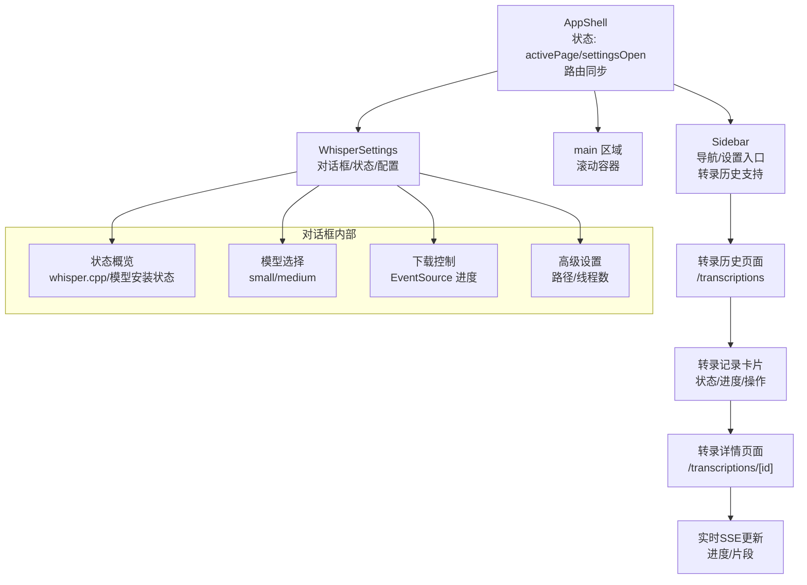

**图表来源**
- [src/components/app-shell.tsx:11-29](file://src/components/app-shell.tsx#L11-L29)
- [src/components/sidebar.tsx:37-49](file://src/components/sidebar.tsx#L37-L49)
- [src/components/whisper-settings.tsx:56-108](file://src/components/whisper-settings.tsx#L56-L108)
- [src/components/transcription-card.tsx:14-92](file://src/components/transcription-card.tsx#L14-L92)
- [src/components/transcription-detail.tsx:44-388](file://src/components/transcription-detail.tsx#L44-L388)

**章节来源**
- [src/components/app-shell.tsx:1-42](file://src/components/app-shell.tsx#L1-L42)
- [src/components/sidebar.tsx:1-242](file://src/components/sidebar.tsx#L1-L242)
- [src/components/whisper-settings.tsx:1-664](file://src/components/whisper-settings.tsx#L1-L664)
- [src/components/transcription-card.tsx:1-92](file://src/components/transcription-card.tsx#L1-L92)
- [src/components/transcription-detail.tsx:1-388](file://src/components/transcription-detail.tsx#L1-L388)

## 详细组件分析

### Button 组件分析
- 设计模式
  - 受控变体与尺寸映射，通过 cn 合并基础样式与变体/尺寸类
- 数据结构与复杂度
  - 变体/尺寸映射为 O(1) 查找
- 依赖链
  - 依赖 utils.cn
- 错误处理
  - 无运行时异常，禁用态与焦点态由基础样式保障
- 性能影响
  - 样式计算轻量，渲染成本低

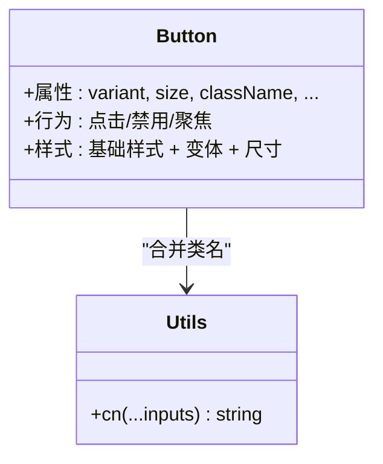

**图表来源**
- [src/components/ui/button.tsx:9-36](file://src/components/ui/button.tsx#L9-L36)
- [src/lib/utils.ts:4-6](file://src/lib/utils.ts#L4-L6)

**章节来源**
- [src/components/ui/button.tsx:1-42](file://src/components/ui/button.tsx#L1-L42)
- [src/lib/utils.ts:1-13](file://src/lib/utils.ts#L1-L13)

### Input 组件分析
- 设计模式
  - forwardRef 包装原生 input，保留所有原生能力
- 数据结构与复杂度
  - 无额外数据结构，O(1) 渲染
- 依赖链
  - 依赖 utils.cn
- 错误处理
  - 无运行时异常，禁用态与聚焦态由基础样式保障

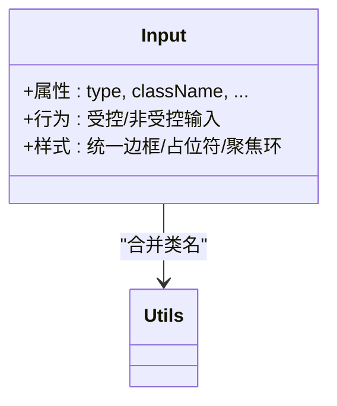

**图表来源**
- [src/components/ui/input.tsx:6-19](file://src/components/ui/input.tsx#L6-L19)
- [src/lib/utils.ts:4-6](file://src/lib/utils.ts#L4-L6)

**章节来源**
- [src/components/ui/input.tsx:1-25](file://src/components/ui/input.tsx#L1-L25)
- [src/lib/utils.ts:1-13](file://src/lib/utils.ts#L1-L13)

### Card 组件分析
- 设计模式
  - 多个子组件组合，提供语义化结构
- 数据结构与复杂度
  - 无额外数据结构，O(1) 渲染
- 依赖链
  - 依赖 utils.cn

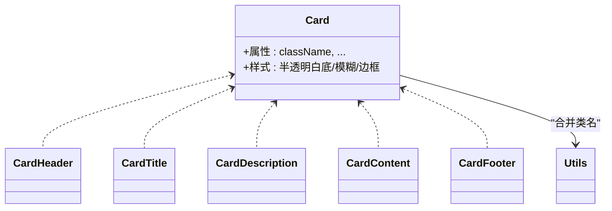

**图表来源**
- [src/components/ui/card.tsx:4-71](file://src/components/ui/card.tsx#L4-L71)
- [src/lib/utils.ts:4-6](file://src/lib/utils.ts#L4-L6)

**章节来源**
- [src/components/ui/card.tsx:1-72](file://src/components/ui/card.tsx#L1-L72)
- [src/lib/utils.ts:1-13](file://src/lib/utils.ts#L1-L13)

### Dialog 组件分析
- 设计模式
  - 基于 Radix UI，提供 Portal 与 Overlay，支持动画与可访问性
- 数据结构与复杂度
  - 无额外数据结构，O(1) 渲染
- 依赖链
  - 依赖 utils.cn 与 lucide-react X

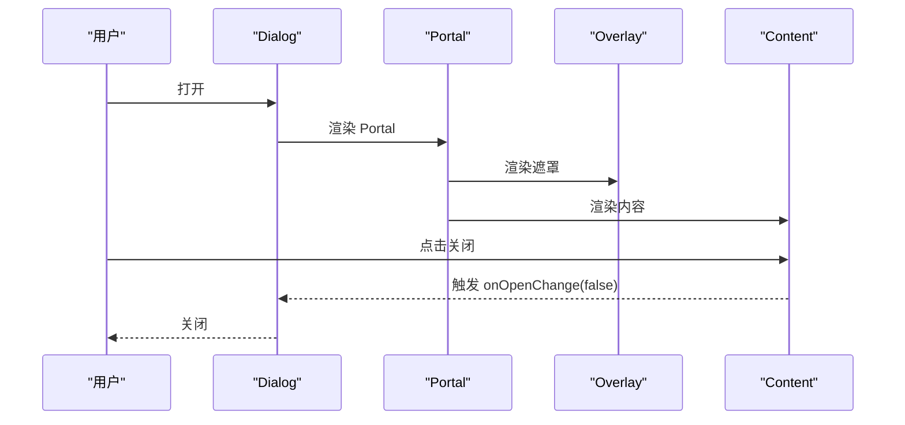

**图表来源**
- [src/components/ui/dialog.tsx:8-53](file://src/components/ui/dialog.tsx#L8-L53)

**章节来源**
- [src/components/ui/dialog.tsx:1-122](file://src/components/ui/dialog.tsx#L1-L122)

### Toast/ToastManager 组件分析
- 设计模式
  - 基于 useEffect 的定时器自动关闭，支持手动关闭
- 数据结构与复杂度
  - 无额外数据结构，O(1) 渲染
- 依赖链
  - 依赖 utils.cn

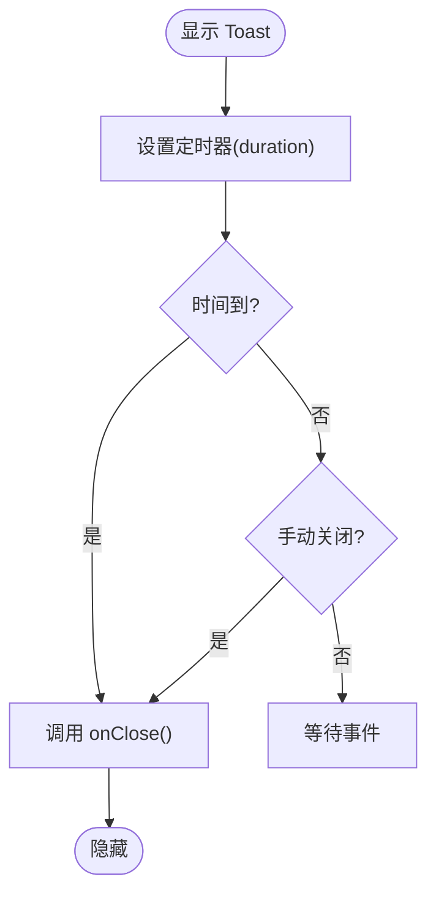

**图表来源**
- [src/components/ui/toast.tsx:13-48](file://src/components/ui/toast.tsx#L13-L48)

**章节来源**
- [src/components/ui/toast.tsx:1-67](file://src/components/ui/toast.tsx#L1-L67)

### Whisper 设置面板（WhisperSettings）
- 功能概述
  - 加载 whisper.cpp 与模型状态
  - 选择并下载模型（EventSource 实时进度）
  - 配置路径与线程数
  - 保存配置并关闭对话框
- 数据流
  - 状态：WhisperStatus、WhisperConfig
  - 事件：fetch 请求、EventSource、onOpenChange
- 错误处理
  - 网络错误、JSON 解析错误、下载失败
- 性能与可用性
  - 并发加载状态与配置
  - 下载进度实时更新
  - 高级设置折叠减少初始渲染

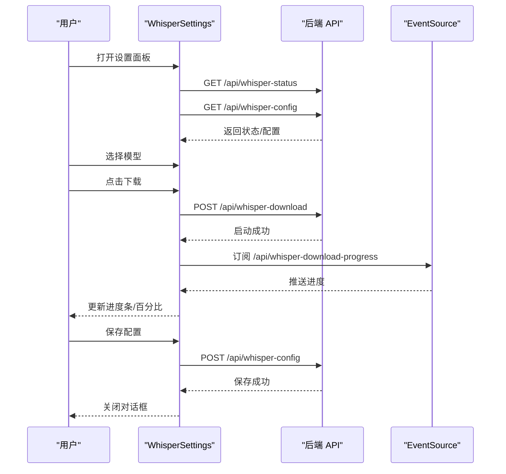

**图表来源**
- [src/components/whisper-settings.tsx:75-108](file://src/components/whisper-settings.tsx#L75-L108)
- [src/components/whisper-settings.tsx:120-154](file://src/components/whisper-settings.tsx#L120-L154)
- [src/components/whisper-settings.tsx:157-187](file://src/components/whisper-settings.tsx#L157-L187)
- [src/components/whisper-settings.tsx:190-213](file://src/components/whisper-settings.tsx#L190-L213)

**章节来源**
- [src/components/whisper-settings.tsx:1-664](file://src/components/whisper-settings.tsx#L1-L664)
- [src/types/index.ts:7-21](file://src/types/index.ts#L7-L21)
- [src/lib/whisper-config.ts:54-89](file://src/lib/whisper-config.ts#L54-L89)

### 应用外壳与侧边栏
- AppShell
  - 管理 activePage 与 settingsOpen 状态
  - 桌面端固定侧边栏，移动端通过 Sidebar 控制
  - **新增**：根据当前路由自动同步 activePage 状态，支持转录历史页面
- Sidebar
  - 主菜单与底部菜单
  - 移动端抽屉式交互，桌面端固定布局
  - 通过 Badge 标注"即将推出"的功能项
  - **新增**：支持转录历史页面导航，路由映射到 `/transcriptions`

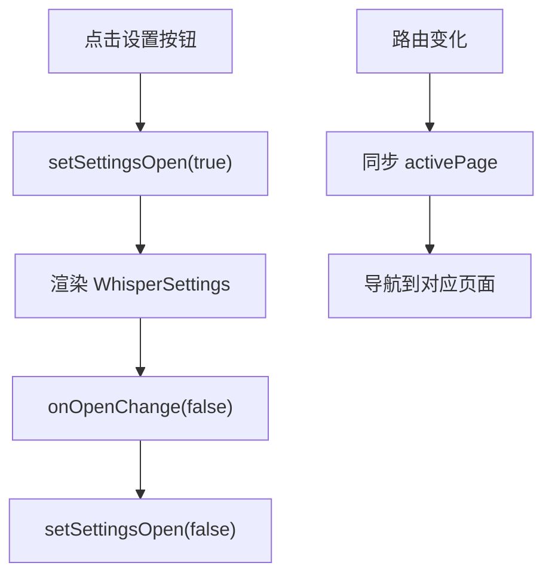

**图表来源**
- [src/components/app-shell.tsx:12-26](file://src/components/app-shell.tsx#L12-L26)
- [src/components/sidebar.tsx:40-43](file://src/components/sidebar.tsx#L40-L43)
- [src/components/sidebar.tsx:63-77](file://src/components/sidebar.tsx#L63-L77)

**章节来源**
- [src/components/app-shell.tsx:1-42](file://src/components/app-shell.tsx#L1-L42)
- [src/components/sidebar.tsx:1-242](file://src/components/sidebar.tsx#L1-L242)

### Separator 分隔符组件分析
- 设计模式
  - 基于 Radix UI Separator，支持水平和垂直方向
- 数据结构与复杂度
  - 无额外数据结构，O(1) 渲染
- 依赖链
  - 依赖 utils.cn

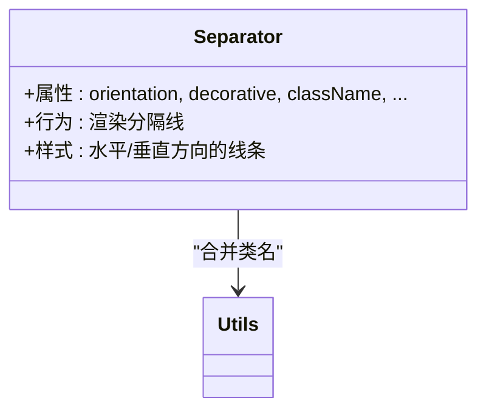

**图表来源**
- [src/components/ui/separator.tsx:5-24](file://src/components/ui/separator.tsx#L5-L24)
- [src/lib/utils.ts:4-6](file://src/lib/utils.ts#L4-L6)

**章节来源**
- [src/components/ui/separator.tsx:1-28](file://src/components/ui/separator.tsx#L1-L28)
- [src/lib/utils.ts:1-13](file://src/lib/utils.ts#L1-L13)

### TranscriptionCard 组件分析
- 设计模式
  - 基于 Next.js Link 的路由导航，状态驱动的视觉反馈
- 数据结构与复杂度
  - 状态映射为 O(1) 查找，渲染复杂度 O(n) 遍历
- 依赖链
  - 依赖 utils.cn、Progress、Badge、Card
  - 使用 TranscriptionRecord 类型定义

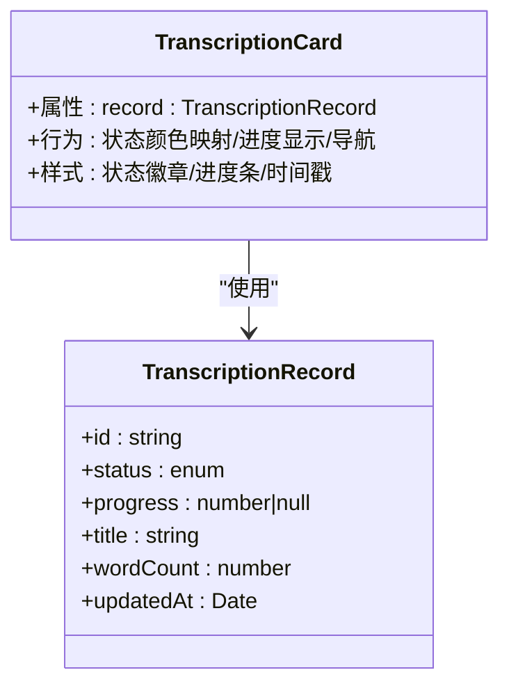

**图表来源**
- [src/components/transcription-card.tsx:14-92](file://src/components/transcription-card.tsx#L14-L92)
- [src/types/transcription-history.ts:3-18](file://src/types/transcription-history.ts#L3-L18)

**章节来源**
- [src/components/transcription-card.tsx:1-92](file://src/components/transcription-card.tsx#L1-L92)
- [src/types/transcription-history.ts:1-23](file://src/types/transcription-history.ts#L1-L23)

### TranscriptionDetail 组件分析
- 设计模式
  - 基于 EventSource 的实时数据流，状态驱动的UI更新
  - 受控组件模式，支持重新转录功能
- 数据结构与复杂度
  - 状态管理复杂度 O(1)，SSE 连接维护
- 依赖链
  - 依赖 utils.cn、Progress、Badge、Button、FlowLoader
  - 使用 TranscriptionRecord 和 TranscribeSegment 类型

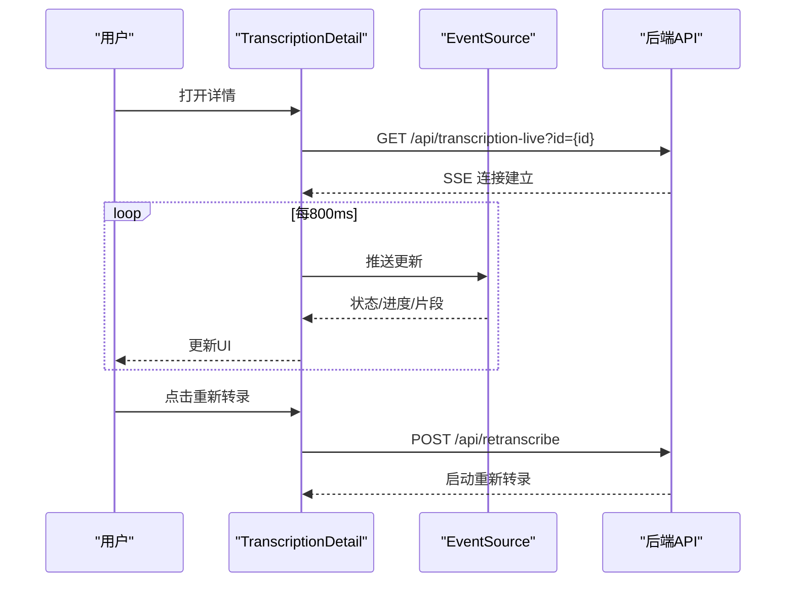

**图表来源**
- [src/components/transcription-detail.tsx:62-106](file://src/components/transcription-detail.tsx#L62-L106)
- [src/components/transcription-detail.tsx:109-172](file://src/components/transcription-detail.tsx#L109-L172)

**章节来源**
- [src/components/transcription-detail.tsx:1-388](file://src/components/transcription-detail.tsx#L1-L388)
- [src/types/transcription-history.ts:1-23](file://src/types/transcription-history.ts#L1-L23)

## 转录历史系统

### 转录历史页面（/transcriptions）
- 功能概述
  - 展示用户的转录历史记录列表
  - 支持网格布局，响应式显示
  - 异步加载历史数据，提供加载状态
- 组件结构
  - TranscriptionListContent：异步加载记录
  - TranscriptionCard：单个记录卡片
  - FlowLoader：加载指示器

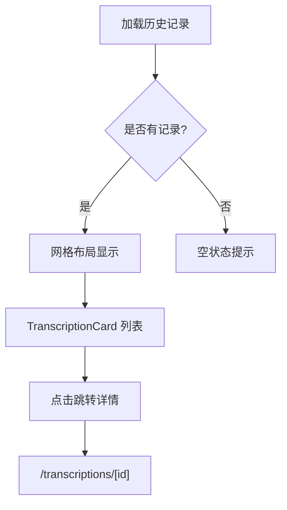

**图表来源**
- [src/app/transcriptions/page.tsx:7-22](file://src/app/transcriptions/page.tsx#L7-L22)
- [src/app/transcriptions/page.tsx:13-17](file://src/app/transcriptions/page.tsx#L13-L17)

**章节来源**
- [src/app/transcriptions/page.tsx:1-85](file://src/app/transcriptions/page.tsx#L1-L85)
- [src/components/transcription-card.tsx:1-92](file://src/components/transcription-card.tsx#L1-L92)

### 转录详情页面（/transcriptions/[id]）
- 功能概述
  - 显示单个转录任务的详细信息
  - 实时显示转录进度和片段
  - 支持重新转录功能
- 组件结构
  - TranscriptionDetailContent：异步加载记录
  - TranscriptionDetail：详情视图组件
  - FlowLoader：加载指示器

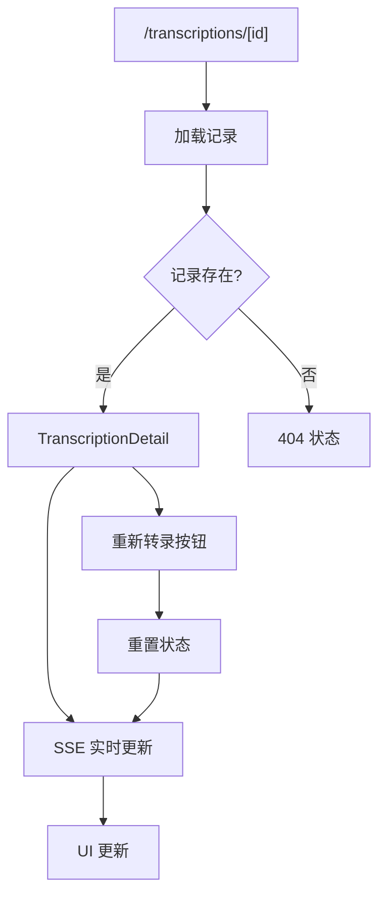

**图表来源**
- [src/app/transcriptions/[id]/page.tsx:13-27](file://src/app/transcriptions/[id]/page.tsx#L13-L27)
- [src/app/transcriptions/[id]/page.tsx:44-172](file://src/app/transcriptions/[id]/page.tsx#L44-L172)

**章节来源**
- [src/app/transcriptions/[id]/page.tsx:1-93](file://src/app/transcriptions/[id]/page.tsx#L1-L93)
- [src/components/transcription-detail.tsx:1-388](file://src/components/transcription-detail.tsx#L1-L388)

### 转录历史库（transcription-history）
- 功能概述
  - 提供转录记录的 CRUD 操作
  - 使用临时目录存储历史数据
  - 支持状态序列化和反序列化
- 数据结构
  - TranscriptionRecord：单个转录记录
  - TranscriptionHistoryState：完整历史状态
- API 方法
  - loadTranscriptionHistory：加载历史
  - saveTranscriptionHistory：保存历史
  - addTranscriptionRecord：添加记录
  - updateTranscriptionRecord：更新记录
  - getTranscriptionRecord：获取单个记录
  - getAllTranscriptionRecords：获取所有记录
  - deleteTranscriptionRecord：删除记录

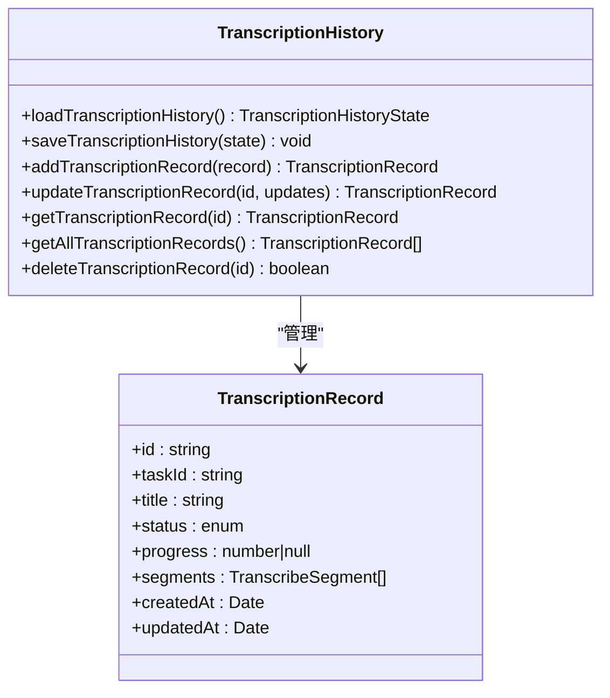

**图表来源**
- [src/lib/transcription-history.ts:23-128](file://src/lib/transcription-history.ts#L23-L128)
- [src/types/transcription-history.ts:3-23](file://src/types/transcription-history.ts#L3-L23)

**章节来源**
- [src/lib/transcription-history.ts:1-128](file://src/lib/transcription-history.ts#L1-L128)
- [src/types/transcription-history.ts:1-23](file://src/types/transcription-history.ts#L1-L23)

### 转录历史API路由
- 功能概述
  - 提供转录历史的 RESTful API
  - 支持查询单个记录和批量记录
  - 支持删除记录操作
- 路由定义
  - GET /api/transcription-history：获取历史记录
  - DELETE /api/transcription-history：删除记录
- 实时更新API
  - GET /api/transcription-live：SSE 实时更新
  - POST /api/retranscribe：重新转录

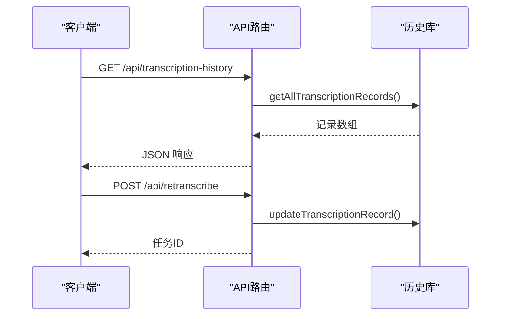

**图表来源**
- [src/app/api/transcription-history/route.ts:9-46](file://src/app/api/transcription-history/route.ts#L9-L46)
- [src/app/api/transcription-live/route.ts:43-126](file://src/app/api/transcription-live/route.ts#L43-L126)
- [src/app/api/retranscribe/route.ts:319-397](file://src/app/api/retranscribe/route.ts#L319-L397)

**章节来源**
- [src/app/api/transcription-history/route.ts:1-80](file://src/app/api/transcription-history/route.ts#L1-L80)
- [src/app/api/transcription-live/route.ts:1-127](file://src/app/api/transcription-live/route.ts#L1-L127)
- [src/app/api/retranscribe/route.ts:1-398](file://src/app/api/retranscribe/route.ts#L1-L398)

## 依赖关系分析
- 组件间耦合
  - UI 组件彼此独立，通过 utils.cn 聚合样式
  - 业务组件依赖 UI 组件与类型定义
  - **新增**：转录历史组件依赖历史库和API路由
- 外部依赖
  - Radix UI（Dialog、Tabs、Separator）、Lucide Icons（图标）、Tailwind CSS（样式）
  - **新增**：EventSource（实时更新）、Next.js 路由系统
- 潜在循环依赖
  - 未发现循环导入

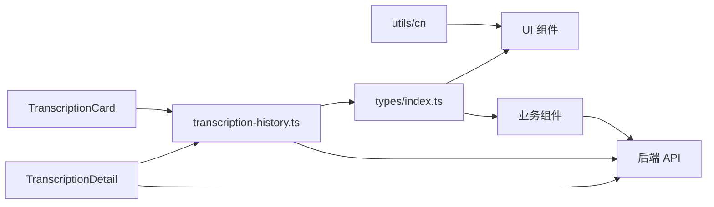

**图表来源**
- [src/lib/utils.ts:4-6](file://src/lib/utils.ts#L4-L6)
- [src/types/index.ts:1-22](file://src/types/index.ts#L1-L22)
- [src/components/whisper-settings.tsx:17-17](file://src/components/whisper-settings.tsx#L17-L17)
- [src/lib/transcription-history.ts:4-4](file://src/lib/transcription-history.ts#L4-L4)

**章节来源**
- [src/lib/utils.ts:1-13](file://src/lib/utils.ts#L1-L13)
- [src/types/index.ts:1-22](file://src/types/index.ts#L1-L22)
- [src/components/whisper-settings.tsx:1-664](file://src/components/whisper-settings.tsx#L1-L664)
- [src/lib/transcription-history.ts:1-128](file://src/lib/transcription-history.ts#L1-L128)

## 性能考虑
- 样式合并
  - 使用 utils.cn 合并类名，避免重复样式与冲突
- 动画与过渡
  - Dialog 与 FlowLoader 使用 CSS 动画，尽量避免 JS 动画
- 异步与订阅
  - WhisperSettings 使用 EventSource 实时进度，注意在组件卸载时清理
  - **新增**：TranscriptionDetail 使用 EventSource 实时更新，支持断线重连
- 渲染优化
  - 将大型内容放入可滚动容器，避免布局抖动
  - 折叠高级设置以减少初始渲染
  - **新增**：转录历史卡片使用网格布局，响应式显示
- 组件复用
  - 通过统一的变体/尺寸体系提高组件复用率
- **新增**：内存管理
  - SSE 连接在组件卸载时自动清理
  - 重新转录时重置状态并重建连接

## 故障排查指南
- 对话框无法关闭
  - 检查 onOpenChange 回调是否正确传递
  - 确认 DialogTrigger 与 DialogClose 的使用
- 下载进度不更新
  - 检查 /api/whisper-download-progress 是否正常推送
  - 确认 EventSource 在组件卸载时被关闭
- 配置保存失败
  - 检查 /api/whisper-config 的响应与错误信息
  - 确认请求体格式与字段名一致
- **新增**：转录历史加载失败
  - 检查 /api/transcription-history 的响应状态
  - 确认历史文件权限和路径
- **新增**：实时更新断开
  - 检查 /api/transcription-live 的 SSE 连接
  - 确认 EventSource 在组件卸载时被正确清理
- **新增**：重新转录失败
  - 检查 whisper.cpp 和模型文件是否存在
  - 确认音频URL可访问性和格式支持
- 样式冲突
  - 使用 utils.cn 合并类名，避免直接覆盖内部样式
- 组件渲染异常
  - 检查 cn 函数的参数传递
  - 确认 Tailwind CSS 配置正确

**章节来源**
- [src/components/ui/dialog.tsx:16-53](file://src/components/ui/dialog.tsx#L16-L53)
- [src/components/whisper-settings.tsx:110-117](file://src/components/whisper-settings.tsx#L110-L117)
- [src/components/whisper-settings.tsx:120-154](file://src/components/whisper-settings.tsx#L120-L154)
- [src/components/whisper-settings.tsx:190-213](file://src/components/whisper-settings.tsx#L190-L213)
- [src/lib/utils.ts:4-6](file://src/lib/utils.ts#L4-L6)
- [src/components/transcription-detail.tsx:62-106](file://src/components/transcription-detail.tsx#L62-L106)
- [src/app/api/retranscribe/route.ts:346-359](file://src/app/api/retranscribe/route.ts#L346-L359)

## 结论
MemoFlow UI 组件系统以简洁与可组合为核心，通过统一的变体/尺寸体系与 cn 工具函数实现一致的样式体验；业务组件围绕 Whisper 设置面板提供完整的本地模型生命周期管理。**新增的转录历史系统**进一步完善了应用的功能完整性，提供了完整的转录记录管理能力，包括列表视图、详情视图、实时更新和重新转录功能。系统具备良好的可访问性、响应式布局与状态管理策略，适合在 Next.js 生态中快速迭代与扩展。改进的导航组件支持新的路由结构，新增的 Separator 组件进一步完善了组件库的完整性，为内容分隔提供了更多选择。

## 附录

### 组件使用示例与最佳实践
- Button
  - 重要操作：使用 default 变体与 md 尺寸
  - 危险操作：使用 destructive 变体
  - 图标按钮：使用 icon 尺寸
- Input
  - 与 Form 配合时提供 label
  - 数字输入使用 type="number" 并设置 min/max
- Card
  - 使用 CardHeader/CardTitle/CardDescription/CardContent/CardFooter 组织内容
  - 利用有机形状装饰增强视觉层次
- Dialog
  - 内容区限制最大宽度与滚动
  - Footer 中放置确认/取消按钮
  - 确保关闭按钮具有可访问性文本
- Toast
  - 成功/错误反馈使用 Toast
  - 使用 ToastManager 管理多个通知
- WhisperSettings
  - 打开前先加载状态与配置
  - 下载完成后重新加载状态
  - 高级设置折叠以减少初始渲染
- **新增**：TranscriptionCard
  - 使用状态徽章显示转录状态
  - 进度条显示转录进度
  - 点击卡片导航到详情页面
- **新增**：TranscriptionDetail
  - 实时显示转录进度和片段
  - 支持重新转录功能
  - 自动滚动到底部显示最新内容
- Separator
  - 水平分隔符用于内容区块间分隔
  - 垂直分隔符用于侧边栏或列表项间分隔
  - 装饰性分隔符设置 decorative=true

### 响应式设计指南
- 移动端
  - 使用抽屉式侧边栏，顶部提供汉堡按钮
  - 对话框全屏或接近全屏
  - 按钮尺寸使用 sm 或 icon
  - **新增**：转录历史卡片使用网格布局，响应式显示
- 桌面端
  - 固定侧边栏，主内容区自适应
  - 对话框居中并限制最大宽度
  - 使用 md 尺寸的按钮和输入框
  - **新增**：详情页面使用双栏布局，左侧信息右侧内容

### 无障碍设计支持
- 提供 sr-only 文本与 aria-label
- 焦点管理与键盘导航
- 对话框关闭按钮具备可访问性文本
- 颜色对比度符合 WCAG 标准
- 屏幕阅读器友好的标签和描述
- **新增**：转录状态使用语义化徽章，屏幕阅读器可读取状态文本

### 主题定制与样式扩展
- 通过 Tailwind 变量与 cn 合并类名实现主题覆盖
- 新增组件时保持与现有变体/尺寸体系一致
- 利用渐变和阴影效果增强视觉层次
- 支持暗色模式下的样式适配
- **新增**：转录状态的颜色映射支持主题定制

### 转录历史系统最佳实践
- **数据持久化**：使用临时目录存储历史数据，确保跨会话持久化
- **实时更新**：使用 EventSource 实现实时进度更新，支持断线重连
- **状态管理**：使用受控组件模式管理转录状态，确保UI一致性
- **错误处理**：完善的错误处理机制，包括网络错误、解析错误等
- **性能优化**：SSE 连接自动清理，避免内存泄漏
- **用户体验**：提供加载状态、空状态和错误状态的友好提示