# 业务组件

<cite>
**本文引用的文件**
- [src/components/whisper-settings.tsx](file://src/components/whisper-settings.tsx)
- [src/components/app-shell.tsx](file://src/components/app-shell.tsx)
- [src/components/sidebar.tsx](file://src/components/sidebar.tsx)
- [src/components/transcription-card.tsx](file://src/components/transcription-card.tsx)
- [src/components/transcription-detail.tsx](file://src/components/transcription-detail.tsx)
- [src/components/ui/flow-loader.tsx](file://src/components/ui/flow-loader.tsx)
- [src/lib/transcription-history.ts](file://src/lib/transcription-history.ts)
- [src/lib/whisper-config.ts](file://src/lib/whisper-config.ts)
- [src/lib/whisper.ts](file://src/lib/whisper.ts)
- [src/lib/xiaoyuzhou.ts](file://src/lib/xiaoyuzhou.ts)
- [src/types/index.ts](file://src/types/index.ts)
- [src/types/transcription-history.ts](file://src/types/transcription-history.ts)
- [src/app/layout.tsx](file://src/app/layout.tsx)
- [src/app/page.tsx](file://src/app/page.tsx)
- [src/app/transcriptions/page.tsx](file://src/app/transcriptions/page.tsx)
- [src/app/transcriptions/[id]/page.tsx](file://src/app/transcriptions/[id]/page.tsx)
- [src/app/api/transcription-live/route.ts](file://src/app/api/transcription-live/route.ts)
- [src/app/api/retranscribe/route.ts](file://src/app/api/retranscribe/route.ts)
- [src/app/api/whisper-config/route.ts](file://src/app/api/whisper-config/route.ts)
- [src/app/api/whisper-status/route.ts](file://src/app/api/whisper-status/route.ts)
- [src/app/api/whisper-download/route.ts](file://src/app/api/whisper-download/route.ts)
- [src/app/api/whisper-download-progress/route.ts](file://src/app/api/whisper-download-progress/route.ts)
- [src/app/api/process-podcast/route.ts](file://src/app/api/process-podcast/route.ts)
</cite>

## 更新摘要
**所做更改**
- 新增转录历史卡片组件 TranscriptionCard 的详细文档说明
- 新增转录详情视图组件 TranscriptionDetail 的完整技术实现分析
- 更新转录历史管理系统的架构设计与数据流
- 完善实时进度跟踪与重新转录功能的技术实现
- 增强UI组件的视觉设计与用户体验优化

## 目录
1. [简介](#简介)
2. [项目结构](#项目结构)
3. [核心组件](#核心组件)
4. [架构总览](#架构总览)
5. [详细组件分析](#详细组件分析)
6. [依赖关系分析](#依赖关系分析)
7. [性能考虑](#性能考虑)
8. [故障排查指南](#故障排查指南)
9. [结论](#结论)
10. [附录](#附录)

## 简介
本文件面向 MemoFlow 的业务组件，重点围绕以下目标展开：
- Whisper 设置面板的配置功能、状态管理与用户交互逻辑
- 应用外壳组件的整体布局架构、导航结构与响应式设计
- 侧边栏组件的折叠展开机制、菜单项管理与路由集成
- 转录历史卡片与详情视图的完整业务流程与数据管理
- 实时进度跟踪、重新转录与状态同步的技术实现
- 组件间的状态管理模式、事件处理机制与数据流设计
- 组件通信方式、生命周期管理与性能优化策略
- 面向开发者的扩展指南与自定义方法

## 项目结构
MemoFlow 采用 Next.js 应用结构，业务组件集中在 src/components 与 src/app 下，配合 src/lib 提供底层能力封装与 API 路由实现。新增的转录历史管理系统包括卡片展示、详情视图、历史记录管理等功能模块。

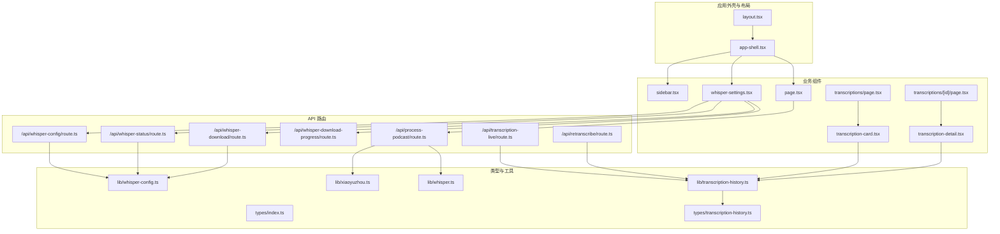

**图表来源**
- [src/app/layout.tsx:14-31](file://src/app/layout.tsx#L14-L31)
- [src/components/app-shell.tsx:11-29](file://src/components/app-shell.tsx#L11-L29)
- [src/components/sidebar.tsx:37-211](file://src/components/sidebar.tsx#L37-L211)
- [src/components/whisper-settings.tsx:56-467](file://src/components/whisper-settings.tsx#L56-L467)
- [src/components/transcription-card.tsx:1-92](file://src/components/transcription-card.tsx#L1-L92)
- [src/components/transcription-detail.tsx:1-388](file://src/components/transcription-detail.tsx#L1-L388)
- [src/app/page.tsx:13-242](file://src/app/page.tsx#L13-L242)
- [src/app/transcriptions/page.tsx:1-85](file://src/app/transcriptions/page.tsx#L1-L85)
- [src/app/transcriptions/[id]/page.tsx:1-93](file://src/app/transcriptions/[id]/page.tsx#L1-L93)
- [src/lib/transcription-history.ts:1-128](file://src/lib/transcription-history.ts#L1-L128)
- [src/lib/whisper-config.ts:54-89](file://src/lib/whisper-config.ts#L54-L89)
- [src/lib/whisper.ts:54-156](file://src/lib/whisper.ts#L54-L156)
- [src/lib/xiaoyuzhou.ts:27-47](file://src/lib/xiaoyuzhou.ts#L27-L47)
- [src/types/transcription-history.ts:1-23](file://src/types/transcription-history.ts#L1-L23)
- [src/app/api/transcription-live/route.ts:1-127](file://src/app/api/transcription-live/route.ts#L1-L127)
- [src/app/api/retranscribe/route.ts:1-398](file://src/app/api/retranscribe/route.ts#L1-L398)

**章节来源**
- [src/app/layout.tsx:14-31](file://src/app/layout.tsx#L14-L31)
- [src/components/app-shell.tsx:11-29](file://src/components/app-shell.tsx#L11-L29)
- [src/components/sidebar.tsx:37-211](file://src/components/sidebar.tsx#L37-L211)
- [src/components/whisper-settings.tsx:56-467](file://src/components/whisper-settings.tsx#L56-L467)
- [src/components/transcription-card.tsx:1-92](file://src/components/transcription-card.tsx#L1-L92)
- [src/components/transcription-detail.tsx:1-388](file://src/components/transcription-detail.tsx#L1-L388)
- [src/app/page.tsx:13-242](file://src/app/page.tsx#L13-L242)
- [src/app/transcriptions/page.tsx:1-85](file://src/app/transcriptions/page.tsx#L1-L85)
- [src/app/transcriptions/[id]/page.tsx:1-93](file://src/app/transcriptions/[id]/page.tsx#L1-L93)

## 核心组件
- 应用外壳 AppShell：统一承载侧边栏与主内容区，并协调设置面板的弹窗开关。
- 侧边栏 Sidebar：提供桌面端固定侧栏与移动端抽屉式菜单，支持导航切换与设置入口。
- Whisper 设置面板 WhisperSettings：负责加载/保存配置、监听下载进度、展示状态与高级设置。
- 转录历史卡片 TranscriptionCard：展示转录记录的概要信息，包括状态徽章、进度条、字数统计和时间戳。
- 转录详情视图 TranscriptionDetail：提供实时进度跟踪、音频播放、逐字稿展示和重新转录功能。
- 转录历史管理：基于临时文件系统的转录记录管理，支持增删改查和状态同步。
- 类型系统与工具：WhisperConfig/WhisperStatus 定义数据结构；whisper-config 提供配置持久化与环境变量覆盖；whisper 提供转写封装；xiaoyuzhou 提供播客信息提取。

**章节来源**
- [src/components/app-shell.tsx:11-29](file://src/components/app-shell.tsx#L11-L29)
- [src/components/sidebar.tsx:37-211](file://src/components/sidebar.tsx#L37-L211)
- [src/components/whisper-settings.tsx:56-467](file://src/components/whisper-settings.tsx#L56-L467)
- [src/components/transcription-card.tsx:1-92](file://src/components/transcription-card.tsx#L1-L92)
- [src/components/transcription-detail.tsx:1-388](file://src/components/transcription-detail.tsx#L1-L388)
- [src/types/index.ts:7-22](file://src/types/index.ts#L7-L22)
- [src/types/transcription-history.ts:1-23](file://src/types/transcription-history.ts#L1-L23)
- [src/lib/whisper-config.ts:54-89](file://src/lib/whisper-config.ts#L54-L89)
- [src/lib/whisper.ts:54-156](file://src/lib/whisper.ts#L54-L156)
- [src/lib/xiaoyuzhou.ts:27-47](file://src/lib/xiaoyuzhou.ts#L27-L47)
- [src/lib/transcription-history.ts:1-128](file://src/lib/transcription-history.ts#L1-L128)

## 架构总览
MemoFlow 采用"UI 组件 + 服务端 API 路由 + 本地配置/文件"的分层架构：
- UI 层：AppShell/Sidebar/WhisperSettings/TranscriptionCard/TranscriptionDetail 负责界面与交互
- 业务层：API 路由封装配置读取/保存、状态查询、模型下载与进度推送、播客处理、转录历史管理
- 数据层：本地文件系统存储配置与模型，SSE 实时推送下载进度，临时目录存储转录进度文件
- 类型层：统一的数据契约 WhisperConfig/WhisperStatus/TranscriptionRecord

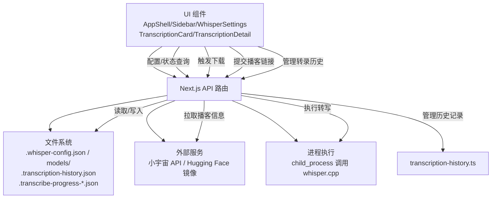

**图表来源**
- [src/components/whisper-settings.tsx:75-187](file://src/components/whisper-settings.tsx#L75-L187)
- [src/components/transcription-card.tsx:14-92](file://src/components/transcription-card.tsx#L14-L92)
- [src/components/transcription-detail.tsx:44-388](file://src/components/transcription-detail.tsx#L44-L388)
- [src/app/api/whisper-config/route.ts:10-123](file://src/app/api/whisper-config/route.ts#L10-L123)
- [src/app/api/whisper-status/route.ts:11-59](file://src/app/api/whisper-status/route.ts#L11-L59)
- [src/app/api/whisper-download/route.ts:173-234](file://src/app/api/whisper-download/route.ts#L173-L234)
- [src/app/api/whisper-download-progress/route.ts:43-138](file://src/app/api/whisper-download-progress/route.ts#L43-L138)
- [src/app/api/process-podcast/route.ts:13-114](file://src/app/api/process-podcast/route.ts#L13-L114)
- [src/app/api/transcription-live/route.ts:43-127](file://src/app/api/transcription-live/route.ts#L43-L127)
- [src/app/api/retranscribe/route.ts:319-398](file://src/app/api/retranscribe/route.ts#L319-L398)
- [src/lib/transcription-history.ts:23-128](file://src/lib/transcription-history.ts#L23-L128)
- [src/lib/whisper.ts:54-156](file://src/lib/whisper.ts#L54-L156)
- [src/lib/xiaoyuzhou.ts:27-47](file://src/lib/xiaoyuzhou.ts#L27-L47)

## 详细组件分析

### 转录历史卡片（TranscriptionCard）
- 职责边界
  - 展示单个转录记录的概要信息
  - 根据状态动态显示徽章颜色和文本
  - 显示转录进度条和字数统计
  - 提供跳转到详情页的导航功能
- 状态管理
  - 本地状态：根据 record.status 动态计算徽章颜色和文本
  - 状态映射：支持 idle、fetching_info、downloading_audio、converting、transcribing、completed、error 状态
- 用户交互
  - 点击卡片跳转到对应的转录详情页面
  - 鼠标悬停效果增强可点击性
- 数据流
  - 接收 TranscriptionRecord 作为 props
  - 通过 Link 组件实现页面导航
  - 展示静态的概要信息

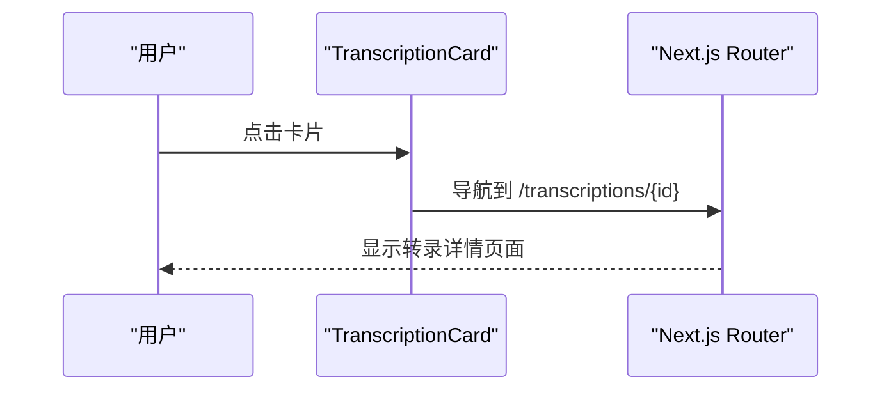

**图表来源**
- [src/components/transcription-card.tsx:54-89](file://src/components/transcription-card.tsx#L54-L89)

**章节来源**
- [src/components/transcription-card.tsx:1-92](file://src/components/transcription-card.tsx#L1-L92)

### 转录详情视图（TranscriptionDetail）
- 职责边界
  - 实时展示转录进度和状态
  - 提供音频播放功能
  - 展示逐字稿内容和元信息
  - 支持重新转录功能
  - 管理 SSE 连接和状态同步
- 状态管理
  - 本地状态：liveRecord（实时更新的记录）、connected（SSE连接状态）、retranscribing（重新转录状态）
  - 生命周期：建立SSE连接、自动滚动到底部、错误重连机制
  - 状态同步：从进度文件合并实时数据
- 用户交互
  - 点击重新转录按钮触发后台处理
  - 自动滚动到最新内容
  - 断线自动重连
- 数据流
  - 读取：GET /api/transcription-live -> SSE 实时推送
  - 写入：POST /api/retranscribe 触发重新转录
  - 进度：合并 .transcribe-progress-*.json 文件数据

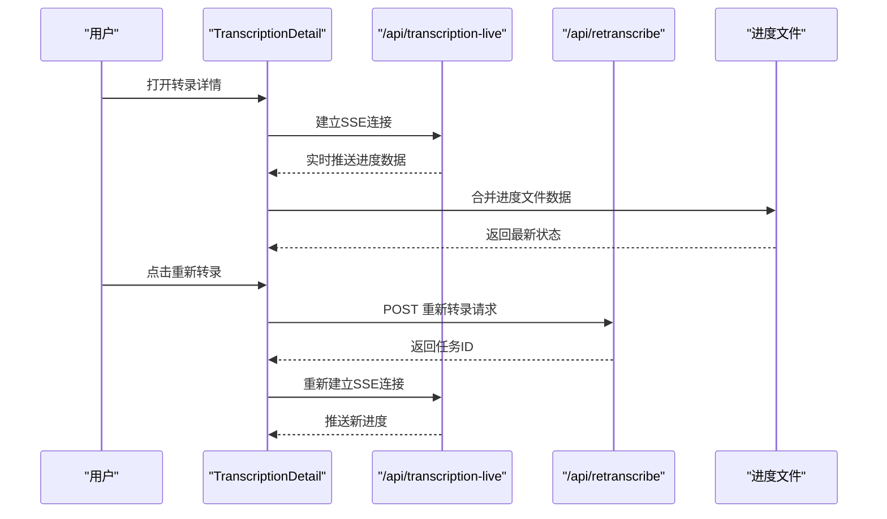

**图表来源**
- [src/components/transcription-detail.tsx:62-106](file://src/components/transcription-detail.tsx#L62-L106)
- [src/components/transcription-detail.tsx:109-172](file://src/components/transcription-detail.tsx#L109-L172)
- [src/app/api/transcription-live/route.ts:43-127](file://src/app/api/transcription-live/route.ts#L43-L127)
- [src/app/api/retranscribe/route.ts:319-398](file://src/app/api/retranscribe/route.ts#L319-L398)

**章节来源**
- [src/components/transcription-detail.tsx:1-388](file://src/components/transcription-detail.tsx#L1-L388)
- [src/app/api/transcription-live/route.ts:1-127](file://src/app/api/transcription-live/route.ts#L1-L127)
- [src/app/api/retranscribe/route.ts:1-398](file://src/app/api/retranscribe/route.ts#L1-L398)

### 转录历史管理（lib/transcription-history）
- 职责边界
  - 管理转录历史记录的持久化存储
  - 提供 CRUD 操作接口
  - 管理临时进度文件
  - 处理日期序列化和反序列化
- 存储机制
  - 历史文件：.transcription-history.json 存储在系统临时目录
  - 进度文件：.transcribe-progress-{taskId}.json 存储实时进度
  - 目录结构：os.tmpdir()/memo-flow/
- 数据操作
  - 添加记录：使用 taskId 作为 id，创建时间戳
  - 更新记录：部分更新，自动更新 updatedAt
  - 查询记录：按 id 查询或获取所有记录
  - 删除记录：从历史列表中移除

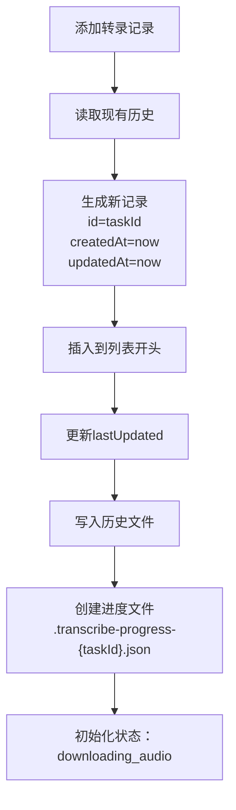

**图表来源**
- [src/lib/transcription-history.ts:71-85](file://src/lib/transcription-history.ts#L71-L85)
- [src/lib/transcription-history.ts:52-69](file://src/lib/transcription-history.ts#L52-L69)

**章节来源**
- [src/lib/transcription-history.ts:1-128](file://src/lib/transcription-history.ts#L1-L128)

### Whisper 设置面板（WhisperSettings）
- 职责边界
  - 加载/保存 Whisper 配置
  - 查询/展示 Whisper 状态（安装状态、模型状态、模型大小）
  - 触发模型下载并监听进度（SSE）
  - 提供高级设置（whisper.cpp 路径、模型路径、线程数）
- 状态管理
  - 本地状态：config、status、selectedModel、downloading、downloadProgress、saving、loading、showAdvanced、error
  - 生命周期：对话框打开时加载数据；清理 EventSource；下载完成后刷新状态
- 用户交互
  - 选择模型、点击下载、展开/收起高级设置、保存配置、取消
- 数据流
  - 读取：并发请求 /api/whisper-status 与 /api/whisper-config
  - 写入：POST /api/whisper-config
  - 下载：POST /api/whisper-download -> SSE /api/whisper-download-progress
- 错误处理
  - 网络错误、解析错误、下载失败、模型已存在等分支均有明确反馈

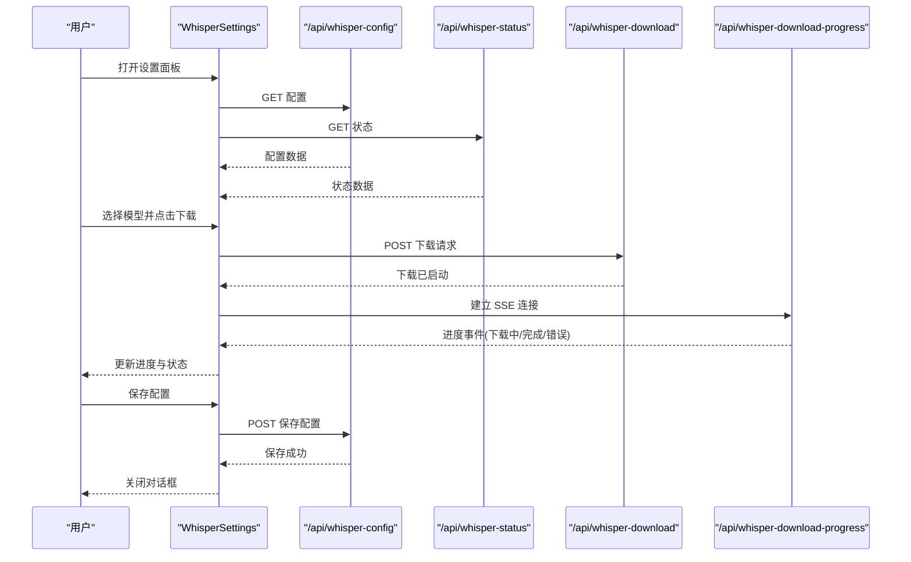

**图表来源**
- [src/components/whisper-settings.tsx:75-187](file://src/components/whisper-settings.tsx#L75-L187)
- [src/app/api/whisper-config/route.ts:10-123](file://src/app/api/whisper-config/route.ts#L10-L123)
- [src/app/api/whisper-status/route.ts:11-59](file://src/app/api/whisper-status/route.ts#L11-L59)
- [src/app/api/whisper-download/route.ts:173-234](file://src/app/api/whisper-download/route.ts#L173-L234)
- [src/app/api/whisper-download-progress/route.ts:43-138](file://src/app/api/whisper-download-progress/route.ts#L43-L138)

**章节来源**
- [src/components/whisper-settings.tsx:56-467](file://src/components/whisper-settings.tsx#L56-L467)
- [src/app/api/whisper-config/route.ts:10-123](file://src/app/api/whisper-config/route.ts#L10-L123)
- [src/app/api/whisper-status/route.ts:11-59](file://src/app/api/whisper-status/route.ts#L11-L59)
- [src/app/api/whisper-download/route.ts:173-234](file://src/app/api/whisper-download/route.ts#L173-L234)
- [src/app/api/whisper-download-progress/route.ts:43-138](file://src/app/api/whisper-download-progress/route.ts#L43-L138)

### 应用外壳（AppShell）
- 职责边界
  - 统一布局容器，左侧放置 Sidebar，右侧为主内容区，底部挂载 WhisperSettings 弹窗
  - 维护活动页与设置面板开关状态
- 响应式设计
  - 主内容区在 md 以上时左侧留出 sidebar 宽度，保证桌面端体验
- 组件通信
  - 通过 props 传递 activePage/onNavigate/onOpenSettings，实现父子通信

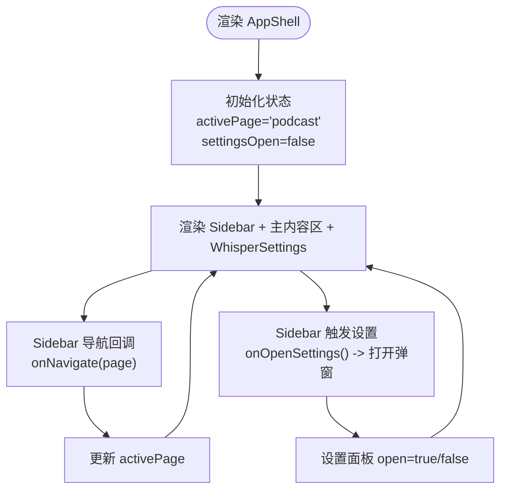

**图表来源**
- [src/components/app-shell.tsx:11-29](file://src/components/app-shell.tsx#L11-L29)
- [src/components/sidebar.tsx:37-211](file://src/components/sidebar.tsx#L37-L211)

**章节来源**
- [src/components/app-shell.tsx:11-29](file://src/components/app-shell.tsx#L11-L29)

### 侧边栏（Sidebar）
- 菜单结构
  - 主菜单：首页、播客转录、内容解析（未开放）、知识库（未开放）
  - 底部菜单：设置、关于
- 折叠展开机制
  - 桌面端固定侧栏；移动端通过汉堡按钮弹出抽屉式菜单，点击遮罩或"X"按钮关闭
- 路由集成
  - 通过 onNavigate 回调通知父组件切换活动页；设置项触发 onOpenSettings 打开配置面板
- 可用性控制
  - 未开放功能显示"即将推出"，禁用交互

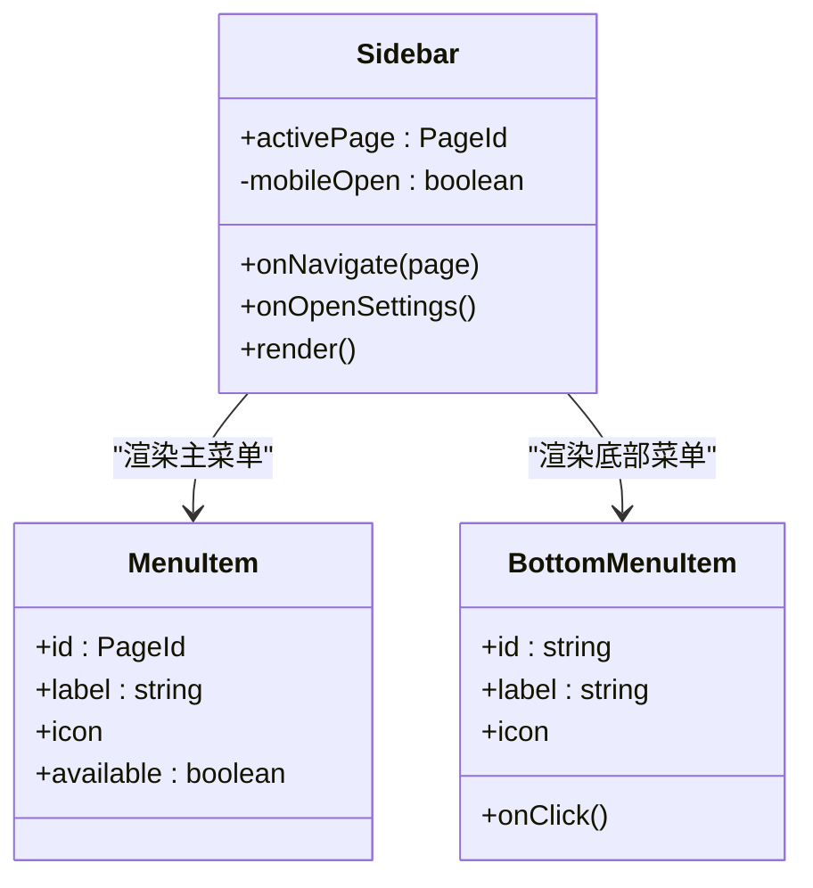

**图表来源**
- [src/components/sidebar.tsx:37-211](file://src/components/sidebar.tsx#L37-L211)
- [src/components/sidebar.tsx:30-43](file://src/components/sidebar.tsx#L30-L43)

**章节来源**
- [src/components/sidebar.tsx:37-211](file://src/components/sidebar.tsx#L37-L211)

### 配置与状态管理（lib/whisper-config 与 lib/whisper）
- 配置读取与保存
  - 默认配置位于项目根目录下的 .whisper-config.json
  - 环境变量具有最高优先级（WHISPER_PATH、WHISPER_MODEL_PATH、WHISPER_THREADS）
  - 保存时仅写入用户配置，不包含环境变量
- 状态查询
  - 通过 API 路由读取当前配置，判断 whisper.cpp 与模型文件是否存在，并统计模型大小
- 转写封装
  - 提供 transcribe/fast 等接口，封装 child_process 调用 whisper.cpp
  - 支持输出纯文本或带时间戳的 JSON，并清理临时文件

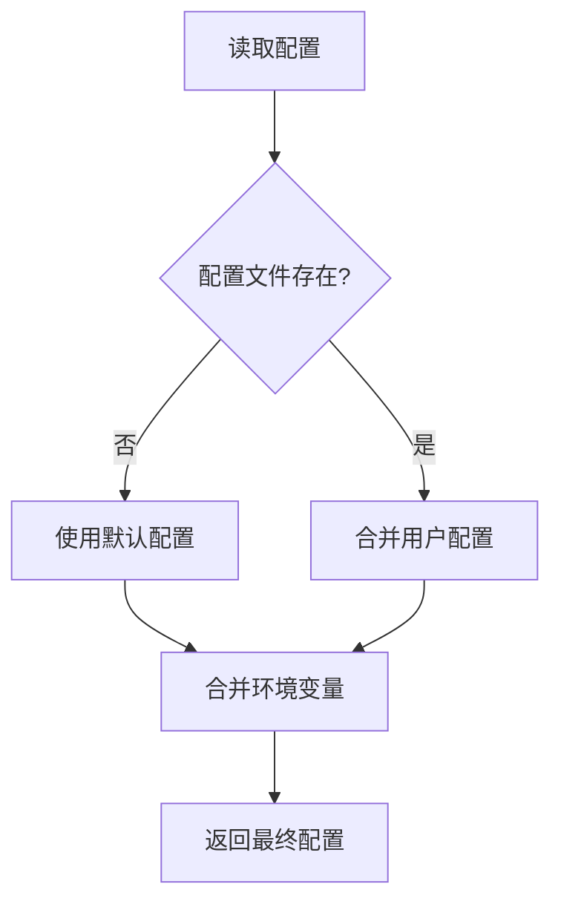

**图表来源**
- [src/lib/whisper-config.ts:54-89](file://src/lib/whisper-config.ts#L54-L89)
- [src/app/api/whisper-status/route.ts:11-59](file://src/app/api/whisper-status/route.ts#L11-L59)

**章节来源**
- [src/lib/whisper-config.ts:54-89](file://src/lib/whisper-config.ts#L54-L89)
- [src/lib/whisper.ts:54-156](file://src/lib/whisper.ts#L54-L156)
- [src/app/api/whisper-status/route.ts:11-59](file://src/app/api/whisper-status/route.ts#L11-L59)

### 播客处理流程（page.tsx 与 API）
- 用户输入小宇宙播客链接，前端校验域名与 Whisper 状态
- 调用 /api/process-podcast 获取音频并转录
- 成功后展示音频信息与转录结果，支持复制与格式化查看

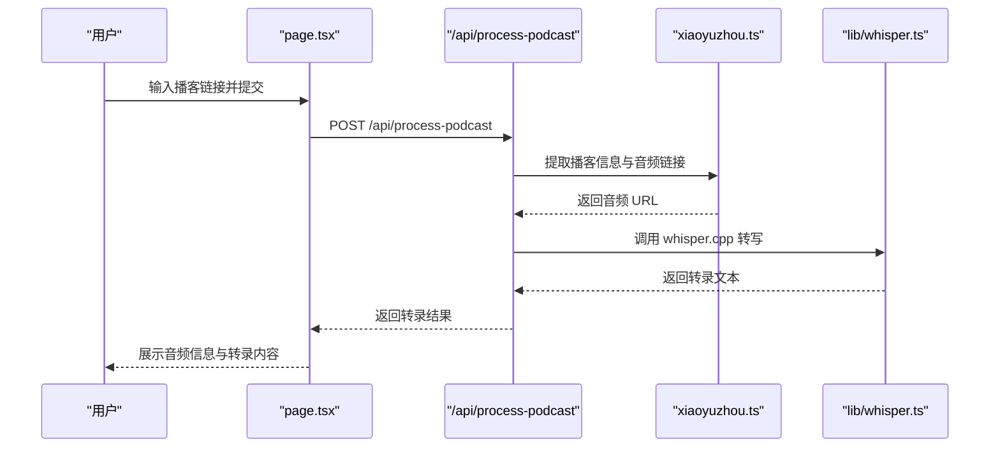

**图表来源**
- [src/app/page.tsx:23-87](file://src/app/page.tsx#L23-L87)
- [src/app/api/process-podcast/route.ts:13-114](file://src/app/api/process-podcast/route.ts#L13-L114)
- [src/lib/xiaoyuzhou.ts:27-47](file://src/lib/xiaoyuzhou.ts#L27-L47)
- [src/lib/whisper.ts:54-156](file://src/lib/whisper.ts#L54-L156)

**章节来源**
- [src/app/page.tsx:23-87](file://src/app/page.tsx#L23-L87)
- [src/app/api/process-podcast/route.ts:13-114](file://src/app/api/process-podcast/route.ts#L13-L114)
- [src/lib/xiaoyuzhou.ts:27-47](file://src/lib/xiaoyuzhou.ts#L27-L47)
- [src/lib/whisper.ts:54-156](file://src/lib/whisper.ts#L54-L156)

## 依赖关系分析
- 组件耦合
  - AppShell 与 Sidebar/WhisperSettings 为父子关系，通过 props 通信
  - WhisperSettings 与 API 路由强耦合，依赖配置、状态、下载与进度接口
  - TranscriptionCard 与 TranscriptionDetail 通过路由参数关联
  - TranscriptionDetail 与 API 路由强耦合，依赖实时进度和重新转录接口
  - page.tsx 与 API 路由、工具模块松耦合，通过类型契约交互
- 外部依赖
  - Next.js 生态（Server Actions/SSR、SSE、fetch）
  - TailwindCSS 与 Radix UI 组件库
  - xml2js 用于解析页面数据
  - ffmpeg 用于音频格式转换

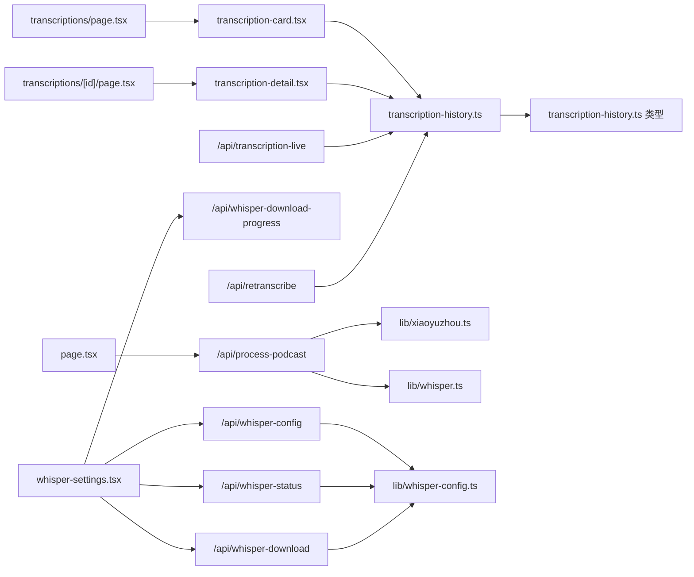

**图表来源**
- [src/components/whisper-settings.tsx:75-187](file://src/components/whisper-settings.tsx#L75-L187)
- [src/components/transcription-card.tsx:14-92](file://src/components/transcription-card.tsx#L14-L92)
- [src/components/transcription-detail.tsx:44-388](file://src/components/transcription-detail.tsx#L44-L388)
- [src/app/transcriptions/page.tsx:7-23](file://src/app/transcriptions/page.tsx#L7-L23)
- [src/app/transcriptions/[id]/page.tsx:13-28](file://src/app/transcriptions/[id]/page.tsx#L13-L28)
- [src/app/api/transcription-live/route.ts:43-127](file://src/app/api/transcription-live/route.ts#L43-L127)
- [src/app/api/retranscribe/route.ts:319-398](file://src/app/api/retranscribe/route.ts#L319-L398)
- [src/app/page.tsx:23-87](file://src/app/page.tsx#L23-L87)
- [src/app/api/whisper-config/route.ts:10-123](file://src/app/api/whisper-config/route.ts#L10-L123)
- [src/app/api/whisper-status/route.ts:11-59](file://src/app/api/whisper-status/route.ts#L11-L59)
- [src/app/api/whisper-download/route.ts:173-234](file://src/app/api/whisper-download/route.ts#L173-L234)
- [src/app/api/whisper-download-progress/route.ts:43-138](file://src/app/api/whisper-download-progress/route.ts#L43-L138)
- [src/app/api/process-podcast/route.ts:13-114](file://src/app/api/process-podcast/route.ts#L13-L114)
- [src/lib/transcription-history.ts:23-128](file://src/lib/transcription-history.ts#L23-L128)
- [src/lib/whisper-config.ts:54-89](file://src/lib/whisper-config.ts#L54-L89)
- [src/lib/whisper.ts:54-156](file://src/lib/whisper.ts#L54-L156)
- [src/lib/xiaoyuzhou.ts:27-47](file://src/lib/xiaoyuzhou.ts#L27-L47)

**章节来源**
- [package.json:12-35](file://package.json#L12-L35)

## 性能考虑
- 并发加载：Whisper 设置面板在对话框打开时并发请求状态与配置，减少等待时间
- SSE 进度：使用 Server-Sent Events 实时推送下载进度，避免轮询带来的额外开销
- 临时文件清理：转写完成后清理输出文件，避免磁盘占用累积
- 环境变量优先：通过环境变量覆盖配置，避免重复 IO 与解析
- 响应式布局：桌面端固定侧栏，移动端抽屉式菜单，降低 DOM 重排成本
- 进度文件合并：实时合并进度文件数据，避免频繁数据库读写
- 自动滚动优化：使用 requestAnimationFrame 优化滚动性能
- 错误重连机制：SSE 断线自动重连，提升用户体验

## 故障排查指南
- 配置读取失败
  - 检查 .whisper-config.json 是否存在且可读
  - 确认环境变量是否覆盖了预期路径
- 下载进度无更新
  - 确认 /api/whisper-download 是否被调用且后台任务正常
  - 检查 models/.download-progress.json 是否存在并可写
- 转写失败
  - 确认 whisper.cpp 与模型文件路径正确
  - 查看 API 日志与 child_process 执行错误
- 播客链接无效
  - 确认链接包含 /episode/ 路径
  - 检查小宇宙 API 与第三方 API 的可用性
- 转录历史异常
  - 检查 .transcription-history.json 文件格式
  - 确认临时目录权限和空间充足
  - 验证进度文件格式和内容
- 实时进度不更新
  - 检查 /api/transcription-live 接口是否正常
  - 确认 SSE 连接状态和断线重连机制
  - 验证进度文件写入权限

**章节来源**
- [src/lib/whisper-config.ts:54-89](file://src/lib/whisper-config.ts#L54-L89)
- [src/app/api/whisper-download/route.ts:173-234](file://src/app/api/whisper-download/route.ts#L173-L234)
- [src/app/api/whisper-download-progress/route.ts:43-138](file://src/app/api/whisper-download-progress/route.ts#L43-L138)
- [src/lib/whisper.ts:54-156](file://src/lib/whisper.ts#L54-L156)
- [src/lib/xiaoyuzhou.ts:27-47](file://src/lib/xiaoyuzhou.ts#L27-L47)
- [src/lib/transcription-history.ts:23-128](file://src/lib/transcription-history.ts#L23-L128)
- [src/app/api/transcription-live/route.ts:43-127](file://src/app/api/transcription-live/route.ts#L43-L127)

## 结论
MemoFlow 的业务组件以清晰的职责划分与稳定的 API 路由为核心，结合 SSE 与本地文件系统实现了可靠的配置与下载体验。新增的转录历史管理系统提供了完整的转录生命周期管理，包括历史记录展示、实时进度跟踪和重新转录功能。UI 组件通过 props 与回调实现低耦合通信，整体具备良好的可维护性与扩展性。建议后续在错误边界、国际化与测试覆盖率方面进一步完善。

## 附录
- 扩展指南
  - 新增配置项：在 WhisperConfig 中添加字段，在 API 路由中验证与保存，并在 UI 中渲染
  - 新增菜单项：在 Sidebar 的菜单数组中新增条目，绑定导航回调
  - 新增页面：在 AppShell 中增加路由映射，页面组件中复用现有 UI 组件
  - 扩展转录功能：在 retranscribe API 中添加新的处理阶段和状态
- 自定义方法
  - 通过环境变量覆盖路径与线程数，便于不同部署环境的适配
  - 使用 SSE 接口实现自定义进度面板或通知中心
  - 基于 Whisper 能力扩展更多转写选项（语言、时间戳粒度等）
  - 自定义转录历史存储：修改 transcription-history.ts 中的存储策略
  - 优化实时进度：调整 transcription-live API 的推送频率和数据合并策略