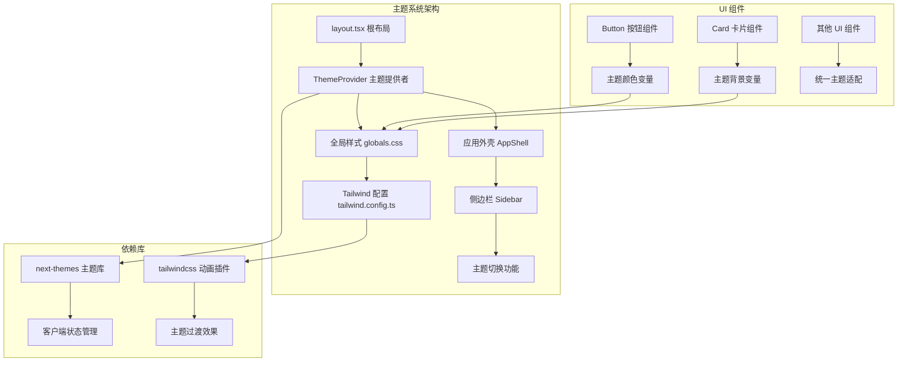
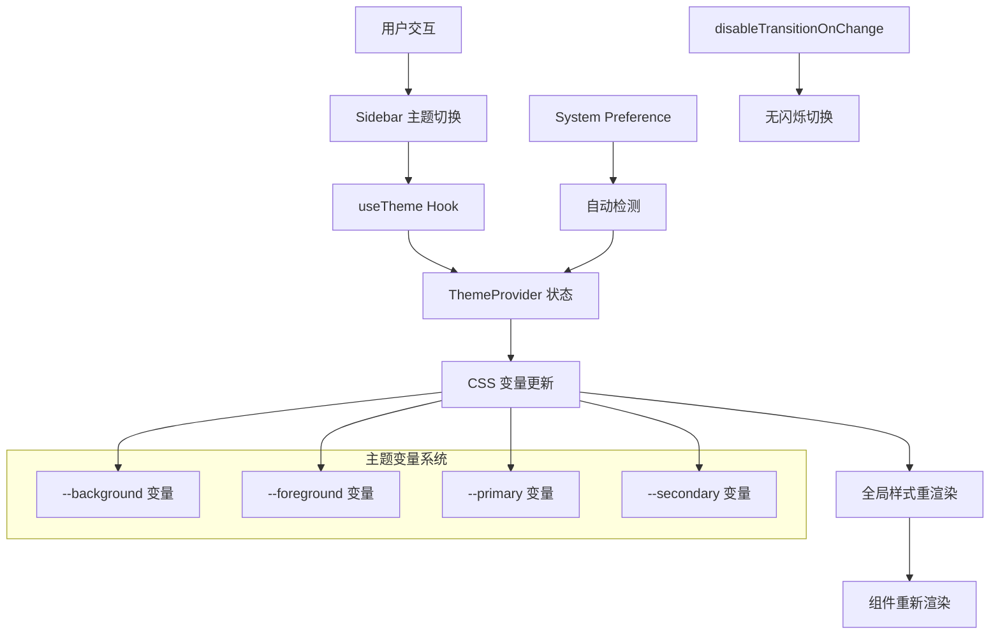
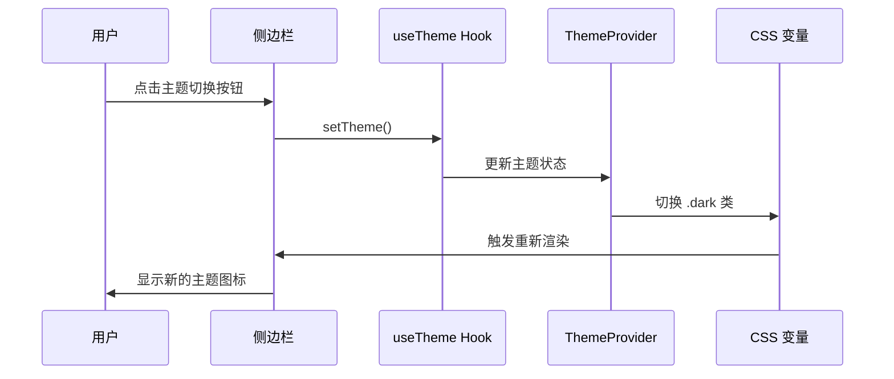
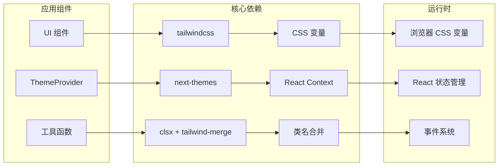

# 主题系统

<cite>
**本文档引用的文件**
- [src/components/theme-provider.tsx](file://src/components/theme-provider.tsx)
- [src/app/layout.tsx](file://src/app/layout.tsx)
- [src/styles/globals.css](file://src/styles/globals.css)
- [tailwind.config.ts](file://tailwind.config.ts)
- [package.json](file://package.json)
- [src/components/sidebar.tsx](file://src/components/sidebar.tsx)
- [src/components/ui/button.tsx](file://src/components/ui/button.tsx)
- [src/components/ui/card.tsx](file://src/components/ui/card.tsx)
- [src/lib/utils.ts](file://src/lib/utils.ts)
</cite>

## 目录
1. [简介](#简介)
2. [项目结构](#项目结构)
3. [核心组件](#核心组件)
4. [架构概览](#架构概览)
5. [详细组件分析](#详细组件分析)
6. [依赖关系分析](#依赖关系分析)
7. [性能考虑](#性能考虑)
8. [故障排除指南](#故障排除指南)
9. [结论](#结论)

## 简介

MemoFlow 的主题系统是一个基于 Next.js 和 Tailwind CSS 构建的现代化主题管理解决方案。该系统实现了完整的明暗主题切换功能，支持系统偏好检测、用户手动切换以及平滑的主题过渡效果。

系统采用 CSS 变量驱动的主题架构，通过 `next-themes` 库提供客户端主题状态管理，并结合 Tailwind CSS 的自定义配置实现丰富的视觉效果。主题系统不仅提供了基础的颜色切换功能，还集成了有机风格的设计语言，包括柔和的渐变、微妙的阴影和流畅的动画效果。

## 项目结构

主题系统在项目中的组织结构如下：

**图表来源**
- [src/app/layout.tsx:40-47](file://src/app/layout.tsx#L40-L47)
- [src/components/theme-provider.tsx:7-9](file://src/components/theme-provider.tsx#L7-L9)
- [src/styles/globals.css:5-87](file://src/styles/globals.css#L5-L87)

**章节来源**
- [src/app/layout.tsx:16-51](file://src/app/layout.tsx#L16-L51)
- [src/components/theme-provider.tsx:1-10](file://src/components/theme-provider.tsx#L1-L10)
- [src/styles/globals.css:1-107](file://src/styles/globals.css#L1-L107)

## 核心组件

### 主题提供者 (ThemeProvider)

主题提供者是整个主题系统的核心组件，负责管理应用程序的主题状态。它基于 `next-themes` 库构建，提供了以下关键功能：

- **主题状态管理**: 使用 React Context 在整个应用程序中共享主题状态
- **系统偏好检测**: 自动检测用户的系统主题偏好
- **客户端渲染**: 确保主题切换在客户端环境中工作
- **过渡效果控制**: 支持禁用主题切换时的过渡动画

### 根布局 (Root Layout)

根布局文件将主题提供者集成到应用程序的最外层，确保所有子组件都能访问主题状态。布局配置包括：

- **HTML 根元素**: 设置 `lang` 属性为 zh-CN，支持中文环境
- **字体配置**: 集成 Inter 和 Lora 字体，提供良好的排版体验
- **背景装饰**: 实现有机风格的背景元素，增强视觉层次
- **主题容器**: 将 AppShell 包装在 ThemeProvider 中

### 全局样式 (globals.css)

全局样式文件定义了完整的 CSS 变量系统，支持明暗两种主题模式：

- **明主题变量**: 使用温暖的奶油色调和深绿色前景色
- **暗主题变量**: 采用低 glare 的深色背景和高对比度文本
- **颜色扩展**: 定义了 primary、secondary、accent 等语义化颜色
- **圆角半径**: 设置了 1rem 的统一圆角半径，体现有机设计风格

**章节来源**
- [src/components/theme-provider.tsx:7-9](file://src/components/theme-provider.tsx#L7-L9)
- [src/app/layout.tsx:40-47](file://src/app/layout.tsx#L40-L47)
- [src/styles/globals.css:5-87](file://src/styles/globals.css#L5-L87)

## 架构概览

主题系统的整体架构采用分层设计，从底层的 CSS 变量到上层的 React 组件形成完整的主题管理体系：

**图表来源**
- [src/components/sidebar.tsx:42-53](file://src/components/sidebar.tsx#L42-L53)
- [src/app/layout.tsx:40-47](file://src/app/layout.tsx#L40-L47)
- [src/styles/globals.css:5-87](file://src/styles/globals.css#L5-L87)

## 详细组件分析

### 侧边栏主题切换组件

侧边栏组件实现了完整的主题切换功能，提供了直观的用户界面：

#### 主题切换逻辑

**图表来源**
- [src/components/sidebar.tsx:42-53](file://src/components/sidebar.tsx#L42-L53)

#### 主题切换特性

- **动态图标**: 根据当前主题显示太阳或月亮图标
- **即时反馈**: 切换时提供即时的视觉反馈
- **状态同步**: 确保所有组件的状态保持一致
- **移动端适配**: 在移动设备上提供优化的切换体验

**章节来源**
- [src/components/sidebar.tsx:40-78](file://src/components/sidebar.tsx#L40-L78)

### UI 组件主题适配

系统中的 UI 组件都经过精心设计以适配主题系统：

#### 按钮组件主题适配

按钮组件使用 CSS 变量实现主题适配：

- **默认状态**: 使用 primary 颜色作为背景
- **悬停效果**: 通过 `hover:bg-primary/90` 实现透明度变化
- **阴影效果**: 使用 `shadow-primary/10` 创建柔和的阴影
- **文本对比**: 确保文本与背景有足够的对比度

#### 卡片组件主题适配

卡片组件实现了复杂的主题适配机制：

- **背景透明度**: 使用 `bg-card/60` 实现半透明效果
- **边框效果**: 通过 `border-border/50` 创建微妙的边框
- **渐变装饰**: 添加有机形状的渐变装饰效果
- **模糊效果**: 使用 `backdrop-blur-sm` 增强视觉深度

**章节来源**
- [src/components/ui/button.tsx:9-37](file://src/components/ui/button.tsx#L9-L37)
- [src/components/ui/card.tsx:4-17](file://src/components/ui/card.tsx#L4-L17)

### Tailwind CSS 配置

Tailwind CSS 配置文件定义了主题系统的技术基础：

#### 颜色系统配置

- **HSL 颜色空间**: 使用 HSL 值确保颜色的一致性
- **语义化命名**: 通过 `primary`、`secondary` 等命名提供清晰的语义
- **主题变体**: 支持 `foreground`、`light` 等颜色变体
- **圆角系统**: 定义了 `lg`、`md`、`sm` 不同尺寸的圆角

#### 动画系统配置

- **淡入效果**: `fade-in` 提供平滑的出现动画
- **滑动效果**: `slide-up` 和 `slide-up-fade` 实现优雅的过渡
- **流动动画**: `flow-bg` 和 `flow-bounce` 创建有机的动态效果
- **性能优化**: 使用 `will-change: transform, opacity` 提升动画性能

**章节来源**
- [tailwind.config.ts:11-87](file://tailwind.config.ts#L11-L87)

## 依赖关系分析

主题系统的依赖关系相对简洁，主要依赖于几个核心库：

**图表来源**
- [package.json:12-26](file://package.json#L12-L26)
- [src/lib/utils.ts:1-6](file://src/lib/utils.ts#L1-L6)

### 关键依赖说明

- **next-themes**: 提供客户端主题状态管理和持久化存储
- **tailwindcss**: 实现原子化样式和 CSS 变量系统
- **clsx + tailwind-merge**: 优化类名合并和冲突解决
- **lucide-react**: 提供高质量的图标组件

**章节来源**
- [package.json:12-38](file://package.json#L12-L38)
- [src/lib/utils.ts:1-6](file://src/lib/utils.ts#L1-L6)

## 性能考虑

主题系统在设计时充分考虑了性能优化：

### 渲染性能

- **CSS 变量切换**: 通过切换 `.dark` 类实现快速的主题切换
- **避免重排**: 使用 `will-change` 属性提示浏览器优化动画
- **最小化重绘**: 通过 `transform` 和 `opacity` 属性实现硬件加速

### 内存管理

- **状态持久化**: 使用本地存储避免每次刷新重新计算主题
- **懒加载**: 仅在需要时加载额外的主题资源
- **缓存策略**: 合理利用浏览器缓存减少重复请求

### 用户体验

- **无闪烁切换**: 通过 `disableTransitionOnChange` 防止初次加载时的闪烁
- **即时反馈**: 主题切换提供即时的视觉反馈
- **系统集成**: 自动检测系统主题偏好，减少用户干预

## 故障排除指南

### 常见问题及解决方案

#### 主题切换无效

**症状**: 点击主题切换按钮后界面没有变化

**可能原因**:
- 浏览器不支持 CSS 变量
- JavaScript 执行错误
- 样式文件加载失败

**解决方案**:
1. 检查浏览器控制台是否有 JavaScript 错误
2. 确认 `next-themes` 库正确安装
3. 验证 CSS 变量是否正常加载

#### 初次加载闪烁

**症状**: 页面初次加载时出现主题闪烁

**解决方案**:
启用 `disableTransitionOnChange` 属性防止初次渲染时的过渡动画

#### 主题不持久

**症状**: 刷新页面后主题设置丢失

**解决方案**:
检查本地存储权限和 `next-themes` 的持久化配置

**章节来源**
- [src/app/layout.tsx:42-44](file://src/app/layout.tsx#L42-L44)
- [src/components/sidebar.tsx:42-53](file://src/components/sidebar.tsx#L42-L53)

## 结论

MemoFlow 的主题系统是一个设计精良、实现优雅的主题管理解决方案。它成功地将现代前端技术与优秀的用户体验设计相结合，提供了：

- **完整的主题生命周期管理**: 从初始化到持久化的全流程覆盖
- **优秀的性能表现**: 通过 CSS 变量和硬件加速实现流畅的切换体验
- **灵活的扩展能力**: 基于 CSS 变量和 Tailwind 配置的可定制性
- **良好的开发体验**: 简洁的 API 和完善的类型支持

该主题系统不仅满足了当前的功能需求，还为未来的功能扩展奠定了坚实的基础。通过合理的架构设计和性能优化，为用户提供了稳定可靠的主题切换体验。