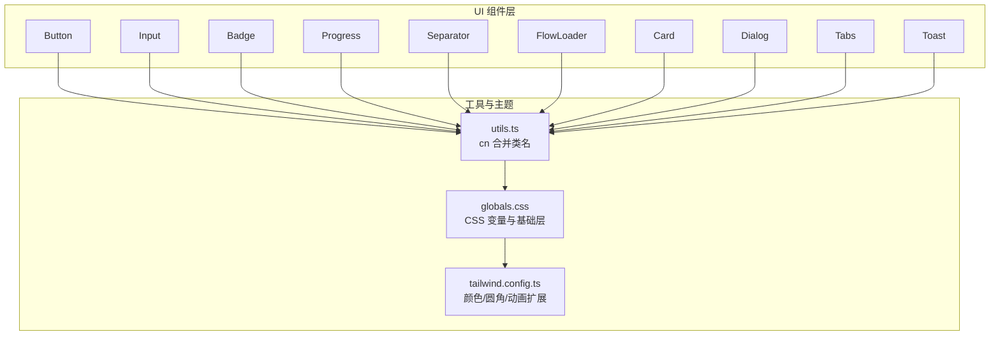
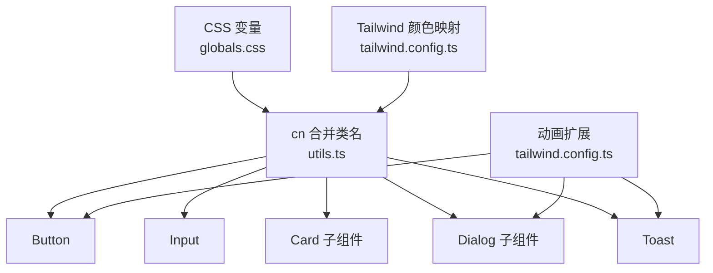
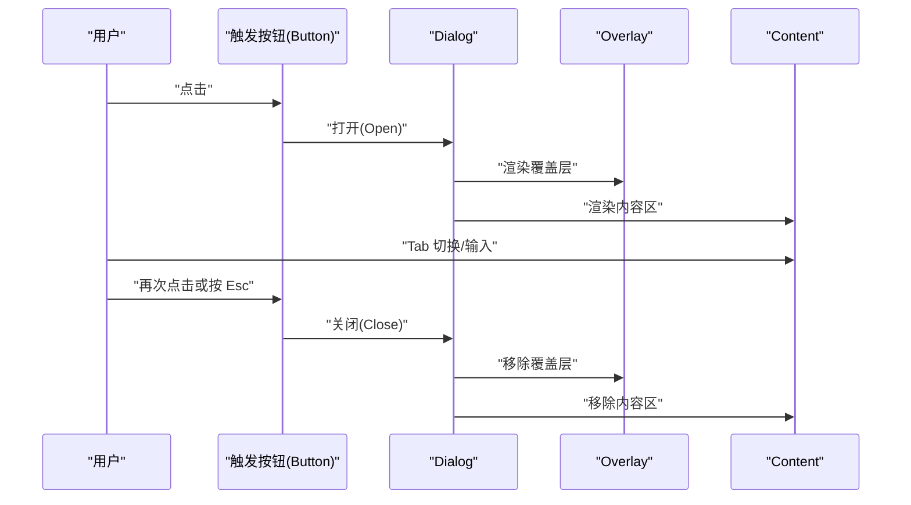
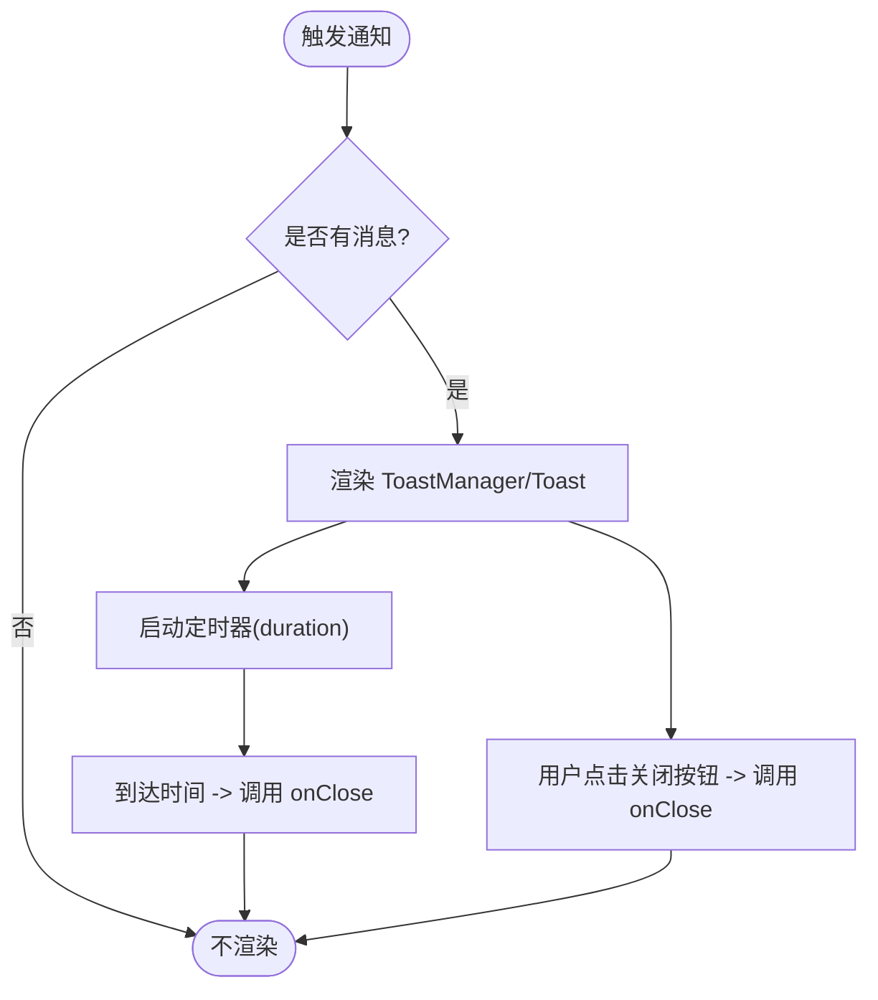
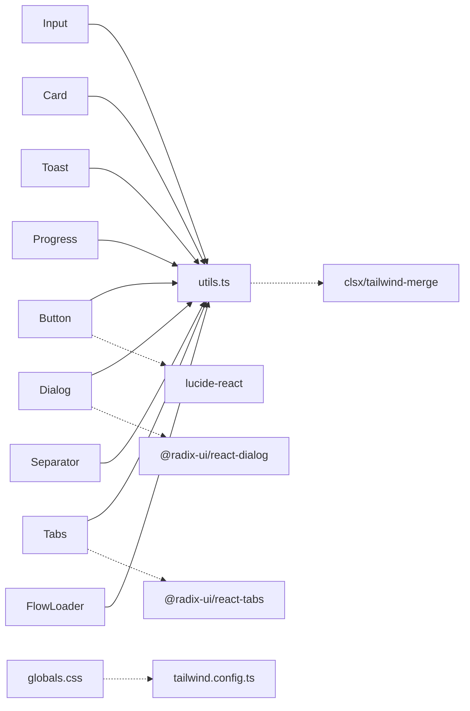

# 基础 UI 组件

<cite>
**本文引用的文件**
- [button.tsx](file://src/components/ui/button.tsx)
- [input.tsx](file://src/components/ui/input.tsx)
- [card.tsx](file://src/components/ui/card.tsx)
- [dialog.tsx](file://src/components/ui/dialog.tsx)
- [toast.tsx](file://src/components/ui/toast.tsx)
- [badge.tsx](file://src/components/ui/badge.tsx)
- [progress.tsx](file://src/components/ui/progress.tsx)
- [tabs.tsx](file://src/components/ui/tabs.tsx)
- [separator.tsx](file://src/components/ui/separator.tsx)
- [flow-loader.tsx](file://src/components/ui/flow-loader.tsx)
- [utils.ts](file://src/lib/utils.ts)
- [globals.css](file://src/styles/globals.css)
- [tailwind.config.ts](file://tailwind.config.ts)
- [package.json](file://package.json)
</cite>

## 目录
1. [简介](#简介)
2. [项目结构](#项目结构)
3. [核心组件](#核心组件)
4. [架构总览](#架构总览)
5. [详细组件分析](#详细组件分析)
6. [依赖分析](#依赖分析)
7. [性能考虑](#性能考虑)
8. [故障排查指南](#故障排查指南)
9. [结论](#结论)
10. [附录](#附录)

## 简介
本文件聚焦 MemoFlow 的基础 UI 组件，系统化梳理 Button、Input、Card、Dialog、Toast 等组件的设计理念、接口定义、属性说明、样式定制与使用方法，并补充可访问性、主题定制与响应式设计原则。同时给出组件组合模式与最佳实践，帮助开发者在保持一致视觉与交互体验的前提下高效构建界面。

## 项目结构
MemoFlow 的基础 UI 组件集中于 src/components/ui 目录，采用“原子化组件 + 组合容器”的分层组织方式：
- 原子组件：Button、Input、Badge、Progress、Separator、FlowLoader 等
- 容器组件：Card、Dialog、Tabs 等
- 工具与主题：utils.ts 提供类名合并工具；globals.css 与 tailwind.config.ts 提供主题变量与动画扩展

图表来源
- [button.tsx:1-42](file://src/components/ui/button.tsx#L1-L42)
- [input.tsx:1-25](file://src/components/ui/input.tsx#L1-L25)
- [card.tsx:1-67](file://src/components/ui/card.tsx#L1-L67)
- [dialog.tsx:1-122](file://src/components/ui/dialog.tsx#L1-L122)
- [toast.tsx:1-67](file://src/components/ui/toast.tsx#L1-L67)
- [utils.ts:1-13](file://src/lib/utils.ts#L1-L13)
- [globals.css:1-106](file://src/styles/globals.css#L1-L106)
- [tailwind.config.ts:1-90](file://tailwind.config.ts#L1-L90)

章节来源
- [button.tsx:1-42](file://src/components/ui/button.tsx#L1-L42)
- [input.tsx:1-25](file://src/components/ui/input.tsx#L1-L25)
- [card.tsx:1-67](file://src/components/ui/card.tsx#L1-L67)
- [dialog.tsx:1-122](file://src/components/ui/dialog.tsx#L1-L122)
- [toast.tsx:1-67](file://src/components/ui/toast.tsx#L1-L67)
- [utils.ts:1-13](file://src/lib/utils.ts#L1-L13)
- [globals.css:1-106](file://src/styles/globals.css#L1-L106)
- [tailwind.config.ts:1-90](file://tailwind.config.ts#L1-L90)

## 核心组件
本节概述各组件的职责与通用特性：
- Button：提供多种语义与尺寸变体，统一的禁用、焦点与过渡样式
- Input：基础输入框，强调可访问性与焦点状态
- Card：卡片容器及其标题、描述、内容、页脚子组件
- Dialog：基于 Radix UI 的模态对话框，含覆盖层、内容区、标题与描述
- Toast：通知提示，支持类型区分与自动关闭

章节来源
- [button.tsx:4-7](file://src/components/ui/button.tsx#L4-L7)
- [input.tsx:4-4](file://src/components/ui/input.tsx#L4-L4)
- [card.tsx:4-66](file://src/components/ui/card.tsx#L4-L66)
- [dialog.tsx:8-121](file://src/components/ui/dialog.tsx#L8-L121)
- [toast.tsx:6-11](file://src/components/ui/toast.tsx#L6-L11)

## 架构总览
组件间通过以下方式协作：
- 类名合并：统一使用 utils.ts 中的 cn 函数，确保 Tailwind 与自定义类名正确合并
- 主题系统：通过 CSS 变量与 Tailwind 颜色映射，实现明暗主题与品牌色系
- 动画系统：Tailwind Animate 插件与自定义 keyframes/animation，为交互提供流畅反馈
- 可访问性：Dialog 使用 Radix UI，提供键盘导航、焦点陷阱与无障碍标签

图表来源
- [utils.ts:4-6](file://src/lib/utils.ts#L4-L6)
- [globals.css:5-86](file://src/styles/globals.css#L5-L86)
- [tailwind.config.ts:11-87](file://tailwind.config.ts#L11-L87)
- [button.tsx:11-36](file://src/components/ui/button.tsx#L11-L36)
- [dialog.tsx:16-53](file://src/components/ui/dialog.tsx#L16-L53)
- [toast.tsx:13-48](file://src/components/ui/toast.tsx#L13-L48)

## 详细组件分析

### Button 组件
- 设计理念
  - 以“语义变体 + 尺寸系统”解耦视觉与行为，便于主题与品牌色统一
  - 通过统一的基类样式与过渡，保证交互一致性
- 接口与属性
  - 继承原生 button 属性，新增 variant 与 size
  - 变体：default、destructive、outline、secondary、ghost、link
  - 尺寸：sm、md、lg、icon
- 样式与主题
  - 基类包含对焦点可见性、环形光圈、禁用态与过渡的统一处理
  - 通过 Tailwind 变量映射到主题色系，支持明暗主题
- 使用示例
  - 建议在表单提交、操作按钮、危险操作与辅助动作中分别选择对应变体
  - 图标按钮使用 icon 尺寸，配合 Lucide React 图标库
- 可访问性
  - 默认保留原生 button 行为，支持键盘激活与焦点管理
- 最佳实践
  - 避免在同一页面过度使用 destructive
  - 在移动端优先使用 lg 或 icon 尺寸提升触达性

章节来源
- [button.tsx:4-7](file://src/components/ui/button.tsx#L4-L7)
- [button.tsx:9-37](file://src/components/ui/button.tsx#L9-L37)
- [button.tsx:11-36](file://src/components/ui/button.tsx#L11-L36)
- [globals.css:19-43](file://src/styles/globals.css#L19-L43)
- [tailwind.config.ts:13-48](file://tailwind.config.ts#L13-L48)

### Input 组件
- 设计理念
  - 强调可访问性与焦点状态，提供清晰的视觉反馈
  - 通过 ring-offset 与 ring 的组合，确保焦点高亮一致
- 接口与属性
  - 继承原生 input 属性，支持 type、placeholder 等
- 样式与主题
  - 统一的边框、背景、内边距与字体规范
  - 禁用态与焦点态具备明确对比度
- 使用示例
  - 与 Form/Field 组件组合时，建议在父容器中统一包裹与错误状态展示
- 可访问性
  - 保持原生语义，支持键盘导航与屏幕阅读器
- 最佳实践
  - 输入前缀/后缀图标建议使用 Button + icon 尺寸的组合

章节来源
- [input.tsx:4-4](file://src/components/ui/input.tsx#L4-L4)
- [input.tsx:6-20](file://src/components/ui/input.tsx#L6-L20)
- [input.tsx:11-17](file://src/components/ui/input.tsx#L11-L17)
- [globals.css:40-43](file://src/styles/globals.css#L40-L43)

### Card 组件
- 设计理念
  - 以容器 + 子组件的组合模式，提供标题、描述、内容与页脚的结构化布局
  - 背景模糊与半透叠层增强层级感
- 接口与属性
  - Card：根容器，支持 className 扩展
  - CardHeader/CardFooter：布局容器，控制间距与对齐
  - CardTitle/CardDescription：标题与描述文本，内置字号与字重
  - CardContent：内容区域，提供上边距与内边距
- 样式与主题
  - 通过 border、background、backdrop-blur 等实现卡片风格
- 使用示例
  - 适合用于设置面板、信息卡片、列表项容器等场景
- 可访问性
  - 建议在标题使用语义化标签（h1-h3），描述文本保持简洁
- 最佳实践
  - 避免在 Card 内放置过多层级嵌套，保持扁平化布局

章节来源
- [card.tsx:4-13](file://src/components/ui/card.tsx#L4-L13)
- [card.tsx:15-24](file://src/components/ui/card.tsx#L15-L24)
- [card.tsx:26-35](file://src/components/ui/card.tsx#L26-L35)
- [card.tsx:37-46](file://src/components/ui/card.tsx#L37-L46)
- [card.tsx:48-54](file://src/components/ui/card.tsx#L48-L54)
- [card.tsx:55-63](file://src/components/ui/card.tsx#L55-L63)
- [globals.css:12-18](file://src/styles/globals.css#L12-L18)

### Dialog 组件
- 设计理念
  - 基于 Radix UI 的可访问性与可组合性，提供覆盖层、内容区与关闭按钮
  - 内置入场/出场动画，提升过渡体验
- 接口与属性
  - Root、Portal、Overlay、Content、Title、Description、Header、Footer、Trigger、Close
  - Content 支持 className 扩展与响应式布局
- 样式与主题
  - 覆盖层支持透明度与渐隐/渐显动画
  - 内容区居中定位与阴影，支持 sm 及以上的圆角
- 使用示例
  - 与 Button 组合触发，内部放置 Card 或 Tabs 进行复杂内容编排
- 可访问性
  - 自动焦点陷阱、Esc 关闭、键盘导航与 ARIA 标签
- 最佳实践
  - 关闭按钮置于右上角，提供 sr-only 文本提升可访问性

图表来源
- [dialog.tsx:8-121](file://src/components/ui/dialog.tsx#L8-L121)
- [dialog.tsx:16-53](file://src/components/ui/dialog.tsx#L16-L53)

章节来源
- [dialog.tsx:8-121](file://src/components/ui/dialog.tsx#L8-L121)
- [globals.css:100-104](file://src/styles/globals.css#L100-L104)

### Toast 组件
- 设计理念
  - 固定在页面右下角，支持成功、错误、信息三类提示，自动定时关闭
  - 通过阴影与边框强调层级，图标与消息并存
- 接口与属性
  - Toast：接收 message、type、duration、onClose
  - ToastManager：条件渲染，无消息时不渲染
- 样式与主题
  - 基于类型应用不同边框与阴影色，使用 backdrop-blur 增强可读性
- 使用示例
  - 结合全局状态管理，在异步操作完成后显示对应类型 Toast
- 可访问性
  - 交互按钮提供 hover 状态，建议配合屏幕阅读器播报
- 最佳实践
  - 控制消息长度与持续时间，避免遮挡关键内容

图表来源
- [toast.tsx:50-67](file://src/components/ui/toast.tsx#L50-L67)
- [toast.tsx:13-48](file://src/components/ui/toast.tsx#L13-L48)

章节来源
- [toast.tsx:6-11](file://src/components/ui/toast.tsx#L6-L11)
- [toast.tsx:50-67](file://src/components/ui/toast.tsx#L50-L67)
- [toast.tsx:13-48](file://src/components/ui/toast.tsx#L13-L48)

### 其他常用组件（简要）
- Badge：徽标，支持语义变体与描边样式
- Progress：进度条，计算百分比并动态更新进度
- Tabs：选项卡，支持列表、触发器与内容区
- Separator：分隔线，支持水平/垂直方向
- FlowLoader：流式加载动画，支持尺寸与延迟

章节来源
- [badge.tsx:4-6](file://src/components/ui/badge.tsx#L4-L6)
- [progress.tsx:6-9](file://src/components/ui/progress.tsx#L6-L9)
- [tabs.tsx:8-55](file://src/components/ui/tabs.tsx#L8-L55)
- [separator.tsx:5-27](file://src/components/ui/separator.tsx#L5-L27)
- [flow-loader.tsx:5-58](file://src/components/ui/flow-loader.tsx#L5-L58)

## 依赖分析
- 组件依赖
  - Button/Input/Card/Dialog/Toast/Progress/Tabs/Separator/FlowLoader 均依赖 utils.ts 的 cn 合并函数
  - Dialog 依赖 @radix-ui/react-dialog，Tabs 依赖 @radix-ui/react-tabs
  - 动画与主题扩展依赖 tailwindcss-animate 与 Tailwind 配置
- 外部依赖
  - lucide-react 提供图标
  - clsx、tailwind-merge 用于类名合并与冲突修复

图表来源
- [button.tsx:1-2](file://src/components/ui/button.tsx#L1-L2)
- [input.tsx:1-2](file://src/components/ui/input.tsx#L1-L2)
- [card.tsx:1-2](file://src/components/ui/card.tsx#L1-L2)
- [dialog.tsx:3-6](file://src/components/ui/dialog.tsx#L3-L6)
- [toast.tsx:3-4](file://src/components/ui/toast.tsx#L3-L4)
- [progress.tsx:3-4](file://src/components/ui/progress.tsx#L3-L4)
- [tabs.tsx:3-4](file://src/components/ui/tabs.tsx#L3-L4)
- [separator.tsx:1-3](file://src/components/ui/separator.tsx#L1-L3)
- [flow-loader.tsx:3-3](file://src/components/ui/flow-loader.tsx#L3-L3)
- [utils.ts:1-2](file://src/lib/utils.ts#L1-L2)
- [globals.css:1-3](file://src/styles/globals.css#L1-L3)
- [tailwind.config.ts:1-2](file://tailwind.config.ts#L1-L2)
- [package.json:12-24](file://package.json#L12-L24)

章节来源
- [package.json:12-24](file://package.json#L12-L24)
- [utils.ts:1-6](file://src/lib/utils.ts#L1-L6)
- [globals.css:1-106](file://src/styles/globals.css#L1-L106)
- [tailwind.config.ts:1-90](file://tailwind.config.ts#L1-L90)

## 性能考虑
- 类名合并优化：使用 clsx 与 tailwind-merge 合并类名，减少冲突与冗余
- 动画性能：使用 will-change 与硬件加速的关键帧，降低重绘成本
- 模态渲染：Dialog 仅在打开时挂载 Overlay 与 Content，减少常驻 DOM
- 组件懒加载：在大型页面中，对非首屏组件采用动态导入

## 故障排查指南
- 样式未生效
  - 检查 Tailwind 配置是否包含组件目录
  - 确认 CSS 变量已正确注入到 :root 与 .dark
- 动画异常
  - 确认 tailwindcss-animate 插件已启用
  - 检查 keyframes 与 animation 名称是否匹配
- 可访问性问题
  - Dialog 是否包含标题与描述
  - 关闭按钮是否可见且可聚焦
- 交互抖动
  - 检查是否存在频繁的类名切换
  - 使用 React.memo 或稳定引用避免不必要的重渲染

章节来源
- [tailwind.config.ts:1-90](file://tailwind.config.ts#L1-L90)
- [globals.css:1-106](file://src/styles/globals.css#L1-L106)
- [dialog.tsx:83-108](file://src/components/ui/dialog.tsx#L83-L108)

## 结论
MemoFlow 的基础 UI 组件以统一的类名合并、主题变量与动画扩展为基础，结合 Radix UI 的可访问性能力，提供了高复用、易定制的组件体系。通过语义变体与尺寸系统，开发者可在保证一致性的同时灵活表达不同场景的交互意图。

## 附录

### TypeScript 接口与属性速览
- ButtonProps
  - variant: 'default' | 'destructive' | 'outline' | 'secondary' | 'ghost' | 'link'
  - size: 'sm' | 'md' | 'lg' | 'icon'
- InputProps
  - 继承原生 HTMLInputElementAttributes
- ToastProps
  - message: string
  - type: 'success' | 'error' | 'info'
  - duration: number
  - onClose: () => void
- ToastManagerProps
  - message: string | null
  - type: 'success' | 'error' | 'info'
  - onClose: () => void
- ProgressProps
  - value: number
  - max?: number
- TabsProps
  - 继承 Radix UI 对应属性
- SeparatorProps
  - orientation: 'horizontal' | 'vertical'
  - decorative: boolean
- FlowLoaderProps
  - size: 'sm' | 'md' | 'lg'

章节来源
- [button.tsx:4-7](file://src/components/ui/button.tsx#L4-L7)
- [input.tsx:4-4](file://src/components/ui/input.tsx#L4-L4)
- [toast.tsx:6-11](file://src/components/ui/toast.tsx#L6-L11)
- [toast.tsx:50-54](file://src/components/ui/toast.tsx#L50-L54)
- [progress.tsx:6-9](file://src/components/ui/progress.tsx#L6-L9)
- [tabs.tsx:10-53](file://src/components/ui/tabs.tsx#L10-L53)
- [separator.tsx:5-11](file://src/components/ui/separator.tsx#L5-L11)
- [flow-loader.tsx:5-8](file://src/components/ui/flow-loader.tsx#L5-L8)

### 主题与样式定制要点
- CSS 变量
  - :root 与 .dark 下的 background、foreground、primary、secondary、destructive、border、input、ring 等
- Tailwind 颜色映射
  - 通过 hsl(var(--*)) 将 CSS 变量映射到 Tailwind 颜色
- 圆角与动画
  - 使用变量控制 border-radius，扩展 keyframes 与 animation

章节来源
- [globals.css:5-86](file://src/styles/globals.css#L5-L86)
- [tailwind.config.ts:11-87](file://tailwind.config.ts#L11-L87)

### 组件组合模式与最佳实践
- 组合模式
  - Dialog + Card：在内容区放置卡片容器，承载复杂表单或信息面板
  - Tabs + Card：在选项卡内容区使用 Card 进行分块展示
  - Input + Button：输入框右侧放置图标按钮，形成搜索/清空入口
- 最佳实践
  - 明确语义变体与尺寸边界，避免同场景多变体混用
  - 为关键交互提供视觉与听觉反馈
  - 控制 Toast 数量与时长，避免遮挡主要内容