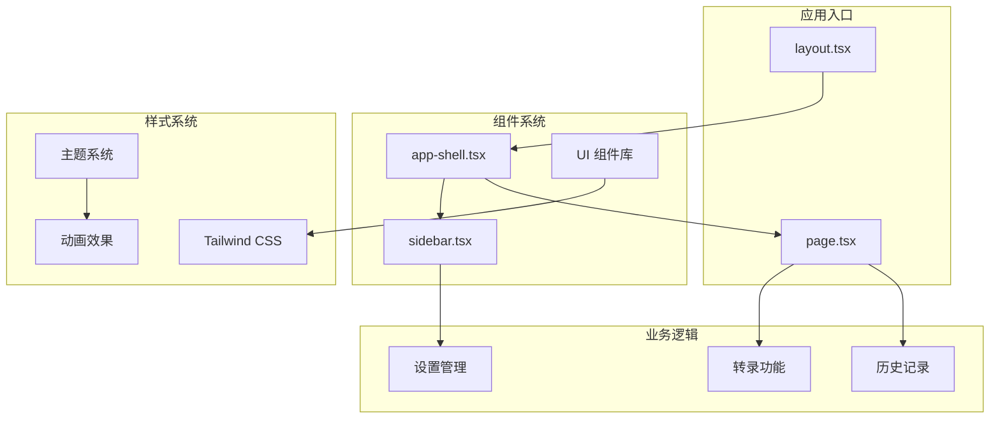
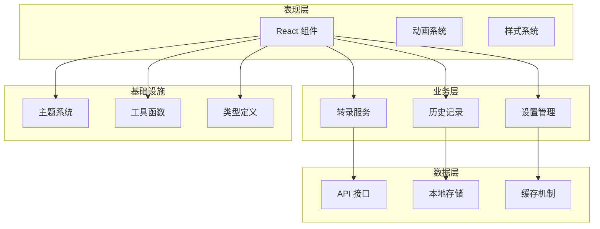
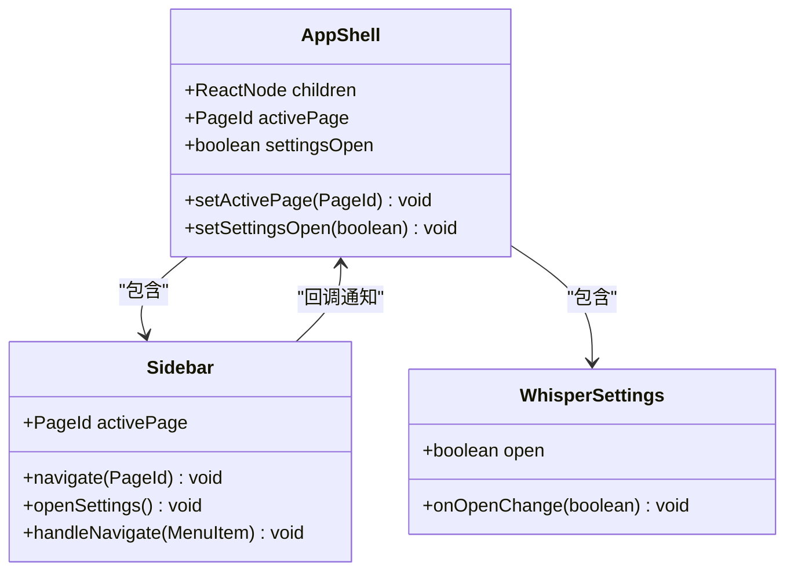
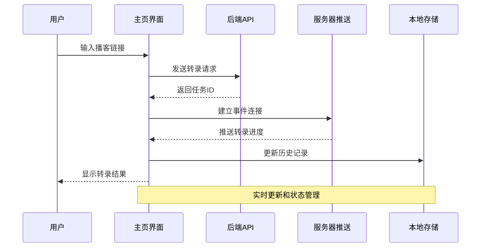
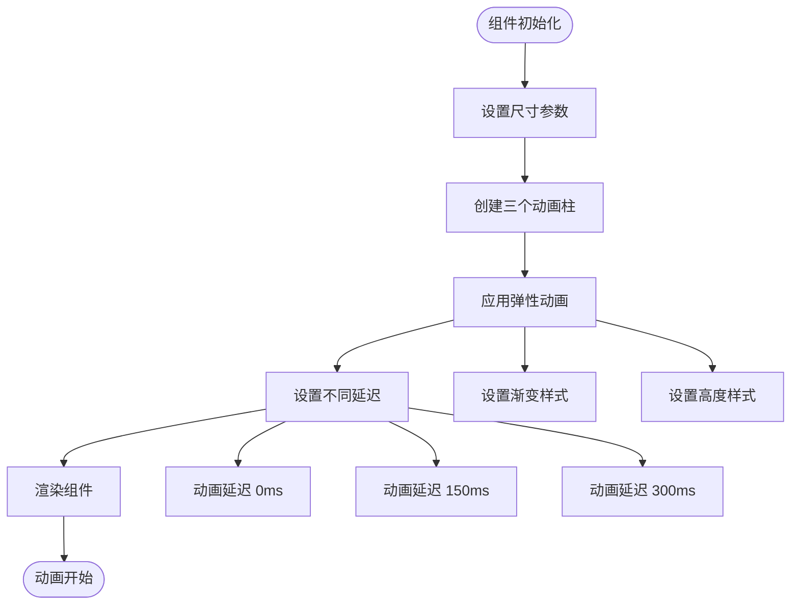
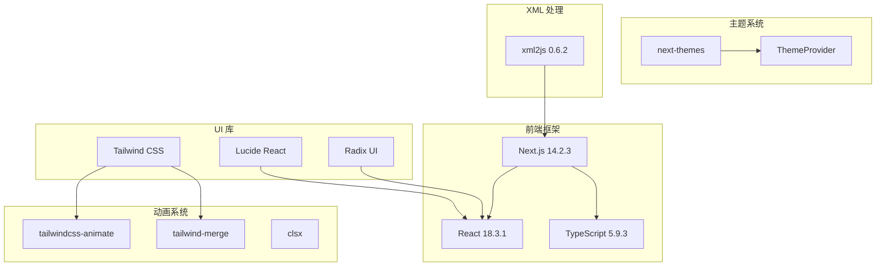

# 生物亲和性视觉设计

<cite>
**本文档引用的文件**
- [README.md](file://README.md)
- [package.json](file://package.json)
- [tailwind.config.ts](file://tailwind.config.ts)
- [src/app/layout.tsx](file://src/app/layout.tsx)
- [src/app/page.tsx](file://src/app/page.tsx)
- [src/components/app-shell.tsx](file://src/components/app-shell.tsx)
- [src/components/sidebar.tsx](file://src/components/sidebar.tsx)
- [src/components/theme-provider.tsx](file://src/components/theme-provider.tsx)
- [src/components/ui/button.tsx](file://src/components/ui/button.tsx)
- [src/components/ui/card.tsx](file://src/components/ui/card.tsx)
- [src/components/ui/flow-loader.tsx](file://src/components/ui/flow-loader.tsx)
- [src/components/ui/toast.tsx](file://src/components/ui/toast.tsx)
- [src/components/transcription-card.tsx](file://src/components/transcription-card.tsx)
- [src/lib/utils.ts](file://src/lib/utils.ts)
- [src/types/index.ts](file://src/types/index.ts)
</cite>

## 目录
1. [项目简介](#项目简介)
2. [项目结构](#项目结构)
3. [核心组件](#核心组件)
4. [架构概览](#架构概览)
5. [详细组件分析](#详细组件分析)
6. [依赖关系分析](#依赖关系分析)
7. [性能考虑](#性能考虑)
8. [故障排除指南](#故障排除指南)
9. [结论](#结论)

## 项目简介

MemoFlow 是一个基于 AI 的内容分析与创作助手，专注于播客转录和内容处理。该项目采用现代前端技术栈，结合生物亲和性的视觉设计理念，为用户提供流畅、直观的用户体验。

### 核心功能特性

- **多平台支持**：支持 YouTube、小宇宙、小红书、B站等平台
- **AI 分析**：自动提取 3-5 个核心观点
- **批判思考**：争议点识别 + 反面观点
- **笔记生成**：一键生成，多平台格式适配
- **知识库**：搜索/筛选/统计功能

## 项目结构

项目采用基于功能模块的组织方式，主要分为以下几个核心部分：

**图表来源**
- [src/app/layout.tsx:1-52](file://src/app/layout.tsx#L1-L52)
- [src/components/app-shell.tsx:1-30](file://src/components/app-shell.tsx#L1-L30)
- [tailwind.config.ts:1-90](file://tailwind.config.ts#L1-L90)

**章节来源**
- [README.md:1-27](file://README.md#L1-L27)
- [package.json:1-38](file://package.json#L1-L38)

## 核心组件

### 视觉设计系统

项目采用了独特的"生物亲和性"设计理念，通过有机形状和自然元素创造和谐的视觉体验：

#### 有机背景元素
- **软性有机形状**：使用圆形和椭圆形创造柔和的视觉效果
- **叶脉纹理**：通过旋转的方形创造叶脉般的图案
- **流动线条**：SVG 路径创建自然的波浪形装饰

#### 颜色方案
- **主色调**：渐变的绿色调，象征生命力和成长
- **辅色调**：柔和的蓝色，代表宁静和专注
- **背景色**：半透明的模糊效果，营造深度感

**章节来源**
- [src/app/layout.tsx:29-38](file://src/app/layout.tsx#L29-L38)
- [src/app/page.tsx:293-318](file://src/app/page.tsx#L293-L318)
- [tailwind.config.ts:13-48](file://tailwind.config.ts#L13-L48)

### 动画系统

项目实现了丰富的动画效果，增强用户交互体验：

#### 流动动画
- **flow-bg**：背景元素的缓慢移动和缩放
- **flow-bounce**：三色柱状动画的弹性效果
- **fade-in**：淡入效果
- **slide-up**：向上滑入动画

#### 组件动画
- **卡片渐变**：卡片边缘的渐变发光效果
- **按钮阴影**：基于颜色的阴影变化
- **状态指示器**：实时转录进度的动态显示

**章节来源**
- [tailwind.config.ts:54-83](file://tailwind.config.ts#L54-L83)
- [src/components/ui/flow-loader.tsx:10-56](file://src/components/ui/flow-loader.tsx#L10-L56)

## 架构概览

项目采用分层架构设计，清晰分离关注点：

**图表来源**
- [src/app/page.tsx:17-254](file://src/app/page.tsx#L17-L254)
- [src/components/app-shell.tsx:11-27](file://src/components/app-shell.tsx#L11-L27)

## 详细组件分析

### 应用外壳组件 (AppShell)

AppShell 作为应用的主要容器，负责协调侧边栏、主内容区域和设置对话框：

**图表来源**
- [src/components/app-shell.tsx:7-29](file://src/components/app-shell.tsx#L7-L29)
- [src/components/sidebar.tsx:26-69](file://src/components/sidebar.tsx#L26-L69)

**章节来源**
- [src/components/app-shell.tsx:1-30](file://src/components/app-shell.tsx#L1-L30)

### 侧边栏组件 (Sidebar)

侧边栏实现了响应式设计，支持桌面端和移动端的不同布局：

#### 导航菜单
- **主菜单**：首页、播客转录、转录历史、内容解析、知识库
- **底部菜单**：主题切换、设置、关于
- **状态指示**：功能可用性和即将推出状态

#### 响应式设计
- **桌面端**：固定侧边栏，宽度 60
- **移动端**：汉堡菜单，模态显示
- **主题切换**：根据当前主题显示对应图标

**章节来源**
- [src/components/sidebar.tsx:32-234](file://src/components/sidebar.tsx#L32-L234)

### 主页组件 (Home)

主页是应用的核心功能界面，实现播客转录的完整流程：

**图表来源**
- [src/app/page.tsx:120-254](file://src/app/page.tsx#L120-L254)
- [src/app/page.tsx:45-98](file://src/app/page.tsx#L45-L98)

#### 状态管理
- **转录状态**：fetching_info、downloading_audio、converting、transcribing、completed、error
- **进度跟踪**：实时百分比进度显示
- **音频信息**：自动播放控制
- **历史记录**：自动刷新机制

**章节来源**
- [src/app/page.tsx:17-98](file://src/app/page.tsx#L17-L98)

### UI 组件库

项目实现了完整的 UI 组件库，遵循统一的设计规范：

#### 按钮组件
- **变体系统**：default、destructive、outline、secondary、ghost、link
- **尺寸系统**：sm、md、lg、icon
- **动画效果**：基于颜色的悬停效果

#### 卡片组件
- **有机形状**：圆角设计配合渐变边框
- **毛玻璃效果**：背景模糊增加层次感
- **装饰元素**：伪元素创建的渐变装饰

**章节来源**
- [src/components/ui/button.tsx:9-42](file://src/components/ui/button.tsx#L9-L42)
- [src/components/ui/card.tsx:4-72](file://src/components/ui/card.tsx#L4-L72)

### 动画加载器组件

FlowLoader 实现了独特的三色柱状动画效果：

**图表来源**
- [src/components/ui/flow-loader.tsx:10-56](file://src/components/ui/flow-loader.tsx#L10-L56)

**章节来源**
- [src/components/ui/flow-loader.tsx:1-58](file://src/components/ui/flow-loader.tsx#L1-L58)

### 通知系统

Toast 组件提供了统一的通知管理机制：

#### 类型系统
- **成功通知**：绿色边框和阴影
- **错误通知**：红色边框和阴影  
- **信息通知**：蓝色边框和阴影

#### 动画效果
- **滑入动画**：从底部滑入
- **自动消失**：3秒后自动关闭
- **手动关闭**：用户可点击关闭按钮

**章节来源**
- [src/components/ui/toast.tsx:13-67](file://src/components/ui/toast.tsx#L13-L67)

### 转录历史卡片

TranscriptionCard 实现了历史记录的可视化展示：

#### 状态可视化
- **完成状态**：绿色标识
- **进行中**：蓝色标识  
- **等待中**：黄色标识
- **错误状态**：红色标识

#### 交互设计
- **进度条**：显示转录进度
- **字数统计**：显示文本长度
- **时间戳**：显示更新时间
- **链接跳转**：点击进入详情页

**章节来源**
- [src/components/transcription-card.tsx:14-92](file://src/components/transcription-card.tsx#L14-L92)

## 依赖关系分析

项目的技术栈和依赖关系如下：

**图表来源**
- [package.json:12-26](file://package.json#L12-L26)
- [package.json:27-36](file://package.json#L27-L36)

**章节来源**
- [package.json:1-38](file://package.json#L1-L38)

## 性能考虑

### 优化策略

1. **懒加载组件**：使用 React.lazy 和 Suspense 实现组件懒加载
2. **虚拟滚动**：对大量历史记录使用虚拟滚动优化
3. **事件源清理**：及时清理 SSE 连接避免内存泄漏
4. **状态优化**：使用 React.memo 和 useMemo 优化重渲染
5. **CSS 优化**：利用 Tailwind 的原子化特性减少样式体积

### 动画性能

- **GPU 加速**：使用 transform 和 opacity 属性触发硬件加速
- **动画节流**：合理设置动画帧率避免过度消耗资源
- **条件渲染**：在不需要时禁用复杂的动画效果

## 故障排除指南

### 常见问题

#### 转录功能异常
1. **检查 Whisper 状态**：确认 whisper.cpp 已正确安装
2. **验证模型下载**：确保语音识别模型已下载完成
3. **网络连接**：检查音频下载和 API 请求的网络状态

#### 动画效果问题
1. **浏览器兼容性**：确认浏览器支持 CSS 动画属性
2. **硬件加速**：检查 GPU 加速是否启用
3. **性能设置**：调整浏览器的动画偏好设置

#### 响应式布局问题
1. **断点设置**：检查 Tailwind 断点配置
2. **触摸事件**：验证移动端触摸事件处理
3. **字体加载**：确认 Google Fonts 的加载状态

**章节来源**
- [src/app/page.tsx:141-162](file://src/app/page.tsx#L141-L162)
- [src/app/page.tsx:243-248](file://src/app/page.tsx#L243-L248)

## 结论

MemoFlow 项目成功地将生物亲和性的视觉设计理念与现代前端技术相结合，创造了一个既美观又实用的内容处理工具。通过有机形状、自然色彩和流畅动画，项目为用户提供了愉悦的使用体验。

### 设计亮点

1. **生物亲和性设计**：有机形状和自然元素的巧妙运用
2. **响应式架构**：完善的移动端和桌面端适配
3. **动画系统**：丰富的交互动画提升用户体验
4. **组件化设计**：可复用的 UI 组件库
5. **性能优化**：合理的性能考虑和优化策略

### 技术优势

- **现代化技术栈**：Next.js + React + TypeScript + Tailwind CSS
- **类型安全**：完整的 TypeScript 类型定义
- **开发体验**：良好的开发工具链和构建配置
- **可扩展性**：模块化的架构便于功能扩展

该项目为内容创作者提供了一个强大而美观的工具，展示了如何将设计理念和技术实现完美融合。