# UI 组件增强

<cite>
**本文档中引用的文件**
- [src/components/ui/button.tsx](file://src/components/ui/button.tsx)
- [src/components/ui/dialog.tsx](file://src/components/ui/dialog.tsx)
- [src/components/ui/card.tsx](file://src/components/ui/card.tsx)
- [src/components/ui/input.tsx](file://src/components/ui/input.tsx)
- [src/components/ui/badge.tsx](file://src/components/ui/badge.tsx)
- [src/components/ui/tabs.tsx](file://src/components/ui/tabs.tsx)
- [src/components/ui/progress.tsx](file://src/components/ui/progress.tsx)
- [src/components/ui/separator.tsx](file://src/components/ui/separator.tsx)
- [src/components/ui/flow-loader.tsx](file://src/components/ui/flow-loader.tsx)
- [src/components/ui/toast.tsx](file://src/components/ui/toast.tsx)
- [src/lib/utils.ts](file://src/lib/utils.ts)
- [src/app/layout.tsx](file://src/app/layout.tsx)
- [src/styles/globals.css](file://src/styles/globals.css)
- [src/components/theme-provider.tsx](file://src/components/theme-provider.tsx)
- [package.json](file://package.json)
</cite>

## 目录
1. [简介](#简介)
2. [项目结构](#项目结构)
3. [核心组件](#核心组件)
4. [架构概览](#架构概览)
5. [详细组件分析](#详细组件分析)
6. [依赖关系分析](#依赖关系分析)
7. [性能考虑](#性能考虑)
8. [故障排除指南](#故障排除指南)
9. [结论](#结论)

## 简介

MemoFlow 是一个基于 Next.js 的播客转录工具，专注于提供流畅的用户体验和现代化的界面设计。该项目采用生物亲和性设计理念，通过柔和的色彩搭配、有机形状和渐变效果，营造出舒适宜人的视觉体验。

本项目的核心优势在于其精心设计的 UI 组件系统，这些组件不仅提供了丰富的功能特性，还保持了高度的一致性和可维护性。通过使用 Radix UI 原子组件、Tailwind CSS 实用类和自定义动画，项目实现了既美观又实用的用户界面。

## 项目结构

项目采用模块化的组件架构，主要分为以下几个层次：

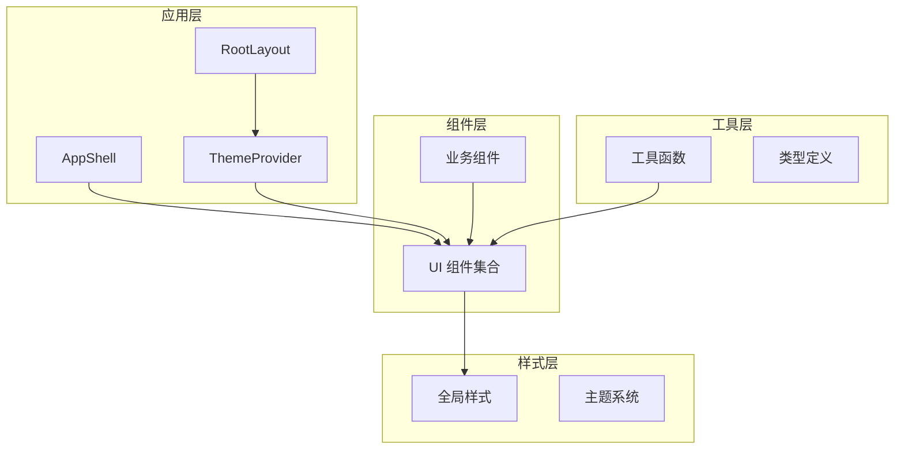

**图表来源**
- [src/app/layout.tsx:16-51](file://src/app/layout.tsx#L16-L51)
- [src/components/theme-provider.tsx:7-9](file://src/components/theme-provider.tsx#L7-L9)

**章节来源**
- [src/app/layout.tsx:1-52](file://src/app/layout.tsx#L1-L52)
- [src/styles/globals.css:1-107](file://src/styles/globals.css#L1-L107)

## 核心组件

### 生物亲和性设计系统

项目采用了独特的生物亲和性设计理念，通过以下元素创造舒适的视觉体验：

- **自然色彩方案**：以森林绿、苔藓绿和大地色为主色调
- **有机形状**：圆润的边角和柔和的曲线
- **渐变效果**：微妙的渐变增强层次感
- **背景装饰**：柔和的圆形背景元素

### 主题系统架构

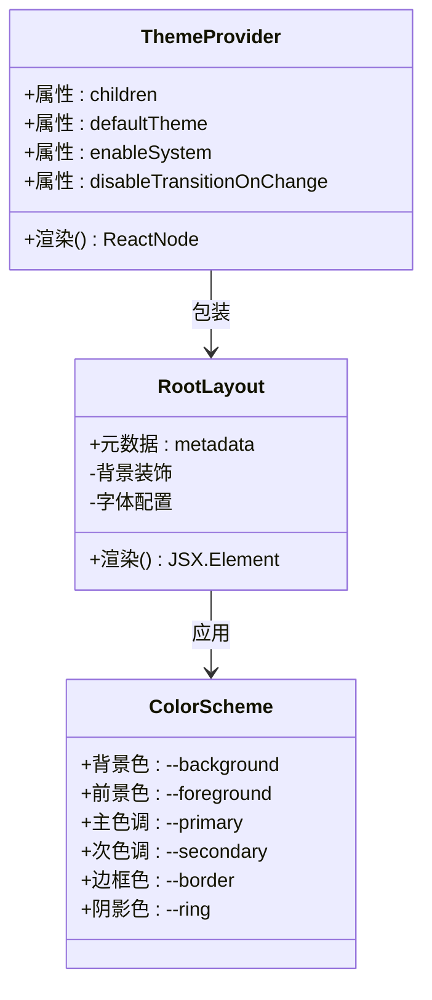

**图表来源**
- [src/components/theme-provider.tsx:7-9](file://src/components/theme-provider.tsx#L7-L9)
- [src/app/layout.tsx:16-51](file://src/app/layout.tsx#L16-L51)
- [src/styles/globals.css:5-87](file://src/styles/globals.css#L5-L87)

**章节来源**
- [src/components/theme-provider.tsx:1-10](file://src/components/theme-provider.tsx#L1-L10)
- [src/app/layout.tsx:22-49](file://src/app/layout.tsx#L22-L49)
- [src/styles/globals.css:5-87](file://src/styles/globals.css#L5-L87)

## 架构概览

### 组件层次结构

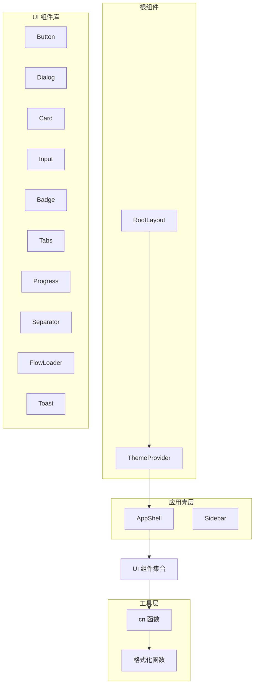

**图表来源**
- [src/app/layout.tsx:40-47](file://src/app/layout.tsx#L40-L47)
- [src/lib/utils.ts:4-12](file://src/lib/utils.ts#L4-L12)

### 样式系统架构

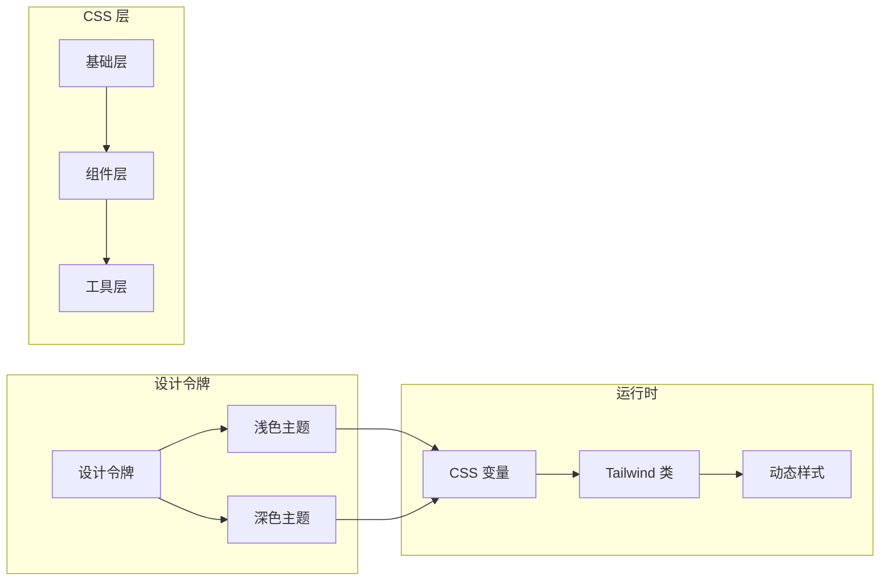

**图表来源**
- [src/styles/globals.css:5-87](file://src/styles/globals.css#L5-L87)
- [src/lib/utils.ts:4-6](file://src/lib/utils.ts#L4-L6)

**章节来源**
- [src/styles/globals.css:1-107](file://src/styles/globals.css#L1-L107)
- [src/lib/utils.ts:1-13](file://src/lib/utils.ts#L1-L13)

## 详细组件分析

### 按钮组件 (Button)

按钮组件是项目中最复杂的组件之一，提供了多种变体和尺寸选项：

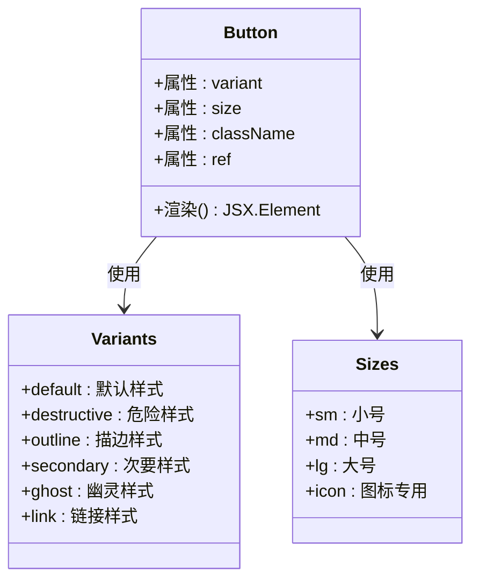

**图表来源**
- [src/components/ui/button.tsx:4-37](file://src/components/ui/button.tsx#L4-L37)

#### 样式特性

按钮组件采用了渐变阴影技术，为每个变体提供了独特的视觉反馈：

- **默认样式**：使用主色调的渐变阴影
- **危险样式**：使用破坏性颜色的阴影效果
- **描边样式**：支持透明背景和描边
- **圆角设计**：统一的圆角半径（1xl）

**章节来源**
- [src/components/ui/button.tsx:1-42](file://src/components/ui/button.tsx#L1-L42)

### 对话框组件 (Dialog)

对话框组件基于 Radix UI 构建，提供了完整的模态对话框解决方案：

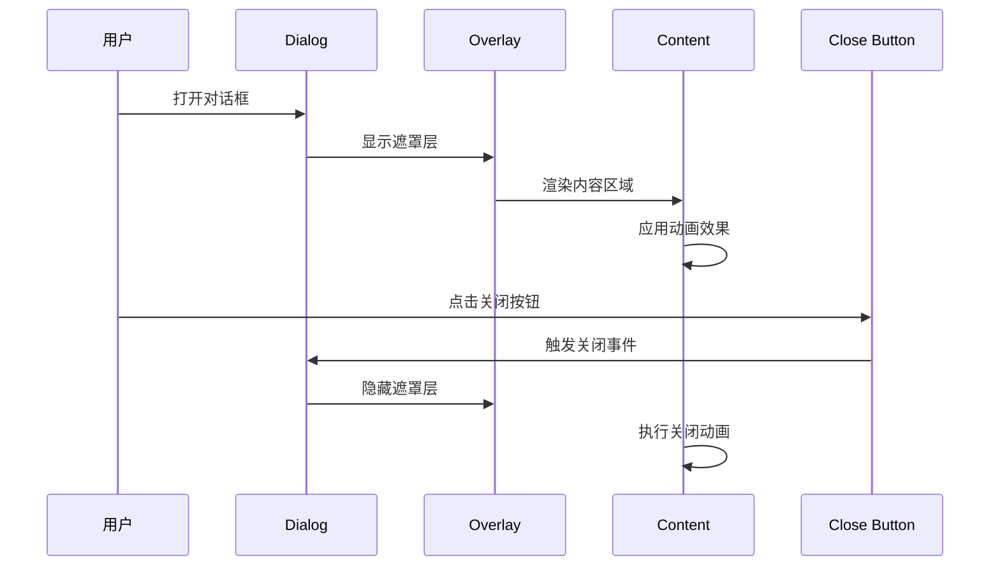

**图表来源**
- [src/components/ui/dialog.tsx:16-53](file://src/components/ui/dialog.tsx#L16-L53)

#### 动画系统

对话框实现了复杂的动画过渡系统：

- **淡入淡出**：遮罩层的透明度变化
- **缩放动画**：内容区域的缩放效果
- **滑动过渡**：从不同方向的进入和退出
- **时间控制**：精确的动画持续时间和延迟

**章节来源**
- [src/components/ui/dialog.tsx:1-122](file://src/components/ui/dialog.tsx#L1-L122)

### 卡片组件 (Card)

卡片组件是项目的基础布局组件，提供了有机形状的设计理念：

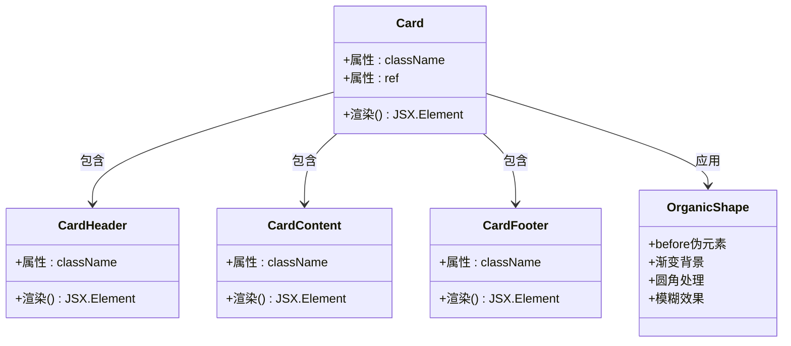

**图表来源**
- [src/components/ui/card.tsx:4-69](file://src/components/ui/card.tsx#L4-L69)

#### 有机设计元素

卡片组件的特色在于其有机形状设计：

- **渐变装饰**：使用微妙的渐变增强立体感
- **圆角优化**：统一的圆角半径设计
- **背景纹理**：半透明的背景增强层次
- **边缘处理**：精确的边框和内边距

**章节来源**
- [src/components/ui/card.tsx:1-72](file://src/components/ui/card.tsx#L1-L72)

### 输入组件 (Input)

输入组件提供了简洁而功能完整的表单控件：

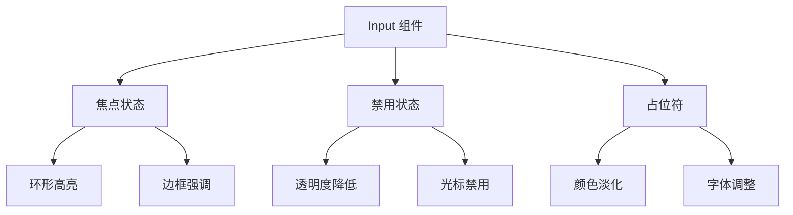

**图表来源**
- [src/components/ui/input.tsx:6-19](file://src/components/ui/input.tsx#L6-L19)

**章节来源**
- [src/components/ui/input.tsx:1-25](file://src/components/ui/input.tsx#L1-L25)

### 进度条组件 (Progress)

进度条组件采用了创新的渐变填充技术：

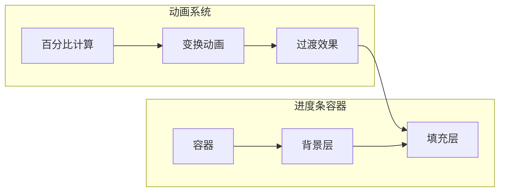

**图表来源**
- [src/components/ui/progress.tsx:11-31](file://src/components/ui/progress.tsx#L11-L31)

#### 技术实现

进度条的核心创新在于其渐变填充效果：

- **百分比计算**：精确的进度百分比计算
- **变换动画**：使用 CSS 变换来创建填充效果
- **渐变色彩**：从主色到浅色的平滑过渡
- **过渡效果**：300ms 的缓动动画

**章节来源**
- [src/components/ui/progress.tsx:1-35](file://src/components/ui/progress.tsx#L1-L35)

### 加载器组件 (FlowLoader)

FlowLoader 是项目中的特色组件，提供了流畅的动画效果：

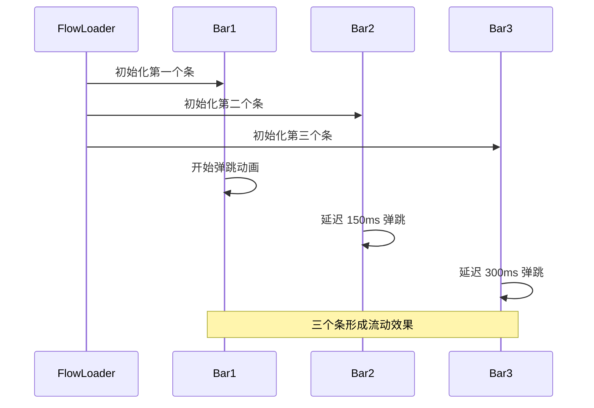

**图表来源**
- [src/components/ui/flow-loader.tsx:10-57](file://src/components/ui/flow-loader.tsx#L10-L57)

**章节来源**
- [src/components/ui/flow-loader.tsx:1-58](file://src/components/ui/flow-loader.tsx#L1-L58)

### 提示组件 (Toast)

Toast 组件提供了优雅的通知系统：

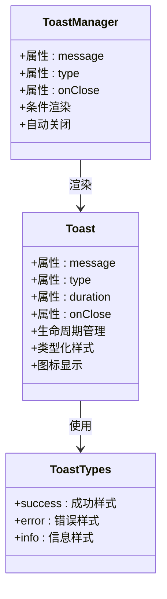

**图表来源**
- [src/components/ui/toast.tsx:13-66](file://src/components/ui/toast.tsx#L13-L66)

#### 动画和交互

Toast 组件实现了完整的动画和交互系统：

- **滑入动画**：从底部滑入的进场效果
- **自动关闭**：定时器自动清理
- **手动关闭**：用户可点击关闭按钮
- **类型化样式**：根据消息类型应用不同样式

**章节来源**
- [src/components/ui/toast.tsx:1-67](file://src/components/ui/toast.tsx#L1-L67)

## 依赖关系分析

### 外部依赖架构

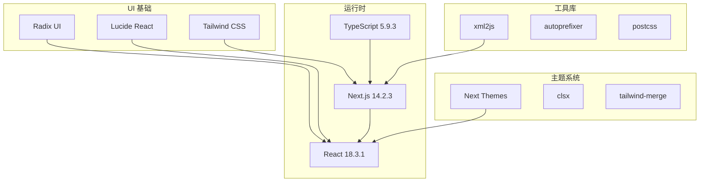

**图表来源**
- [package.json:12-26](file://package.json#L12-L26)

### 组件依赖关系

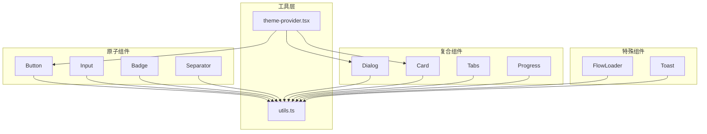

**图表来源**
- [src/lib/utils.ts:4-6](file://src/lib/utils.ts#L4-L6)
- [src/components/theme-provider.tsx:7-9](file://src/components/theme-provider.tsx#L7-L9)

**章节来源**
- [package.json:1-38](file://package.json#L1-L38)

## 性能考虑

### 样式优化策略

项目在样式系统方面采用了多项优化措施：

- **CSS 变量缓存**：利用 CSS 自定义属性减少重绘
- **渐进式加载**：背景装饰元素的延迟加载
- **动画性能**：使用 transform 和 opacity 属性优化动画
- **组件复用**：通过 cn 函数实现样式的高效合并

### 组件性能特性

- **轻量级渲染**：所有组件都使用 forwardRef 优化渲染
- **条件渲染**：Toast 组件支持空值检查避免不必要的渲染
- **动画优化**：使用 will-change 属性提升动画性能
- **内存管理**：正确清理定时器和事件监听器

## 故障排除指南

### 常见问题诊断

#### 样式不生效问题

**症状**：组件样式显示异常或主题切换无效

**排查步骤**：
1. 检查 CSS 变量是否正确加载
2. 验证 Tailwind 配置文件
3. 确认主题提供者的正确使用
4. 检查组件的 className 合并逻辑

#### 动画异常问题

**症状**：动画效果不流畅或出现闪烁

**排查步骤**：
1. 检查 will-change 属性的应用
2. 验证 CSS 动画的关键帧定义
3. 确认浏览器对硬件加速的支持
4. 检查是否有样式冲突

#### 组件交互问题

**症状**：按钮点击无响应或对话框无法关闭

**排查步骤**：
1. 检查事件处理器的绑定
2. 验证组件的 ref 使用
3. 确认状态管理逻辑
4. 检查父组件的事件传播

**章节来源**
- [src/lib/utils.ts:4-6](file://src/lib/utils.ts#L4-L6)
- [src/components/ui/toast.tsx:14-17](file://src/components/ui/toast.tsx#L14-L17)

## 结论

MemoFlow 的 UI 组件系统展现了现代前端开发的最佳实践，通过精心设计的组件架构、创新的视觉效果和完善的性能优化，为用户提供了卓越的使用体验。

### 主要成就

1. **设计理念统一**：生物亲和性设计贯穿整个组件系统
2. **组件生态完善**：从原子组件到复合组件的完整体系
3. **性能优化到位**：动画、样式和交互的全面优化
4. **可扩展性强**：模块化的架构便于功能扩展

### 技术亮点

- 创新的渐变填充技术和有机形状设计
- 完整的动画系统和交互反馈机制
- 高效的主题系统和样式管理
- 轻量级且高性能的组件实现

这个项目为现代 Web 应用的 UI 设计提供了优秀的参考范例，展示了如何在保证功能性的前提下，创造出既美观又实用的用户界面。