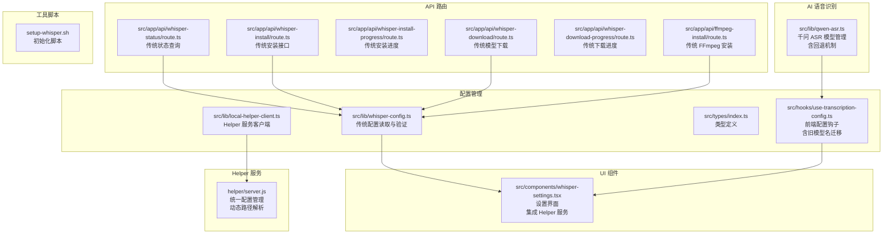
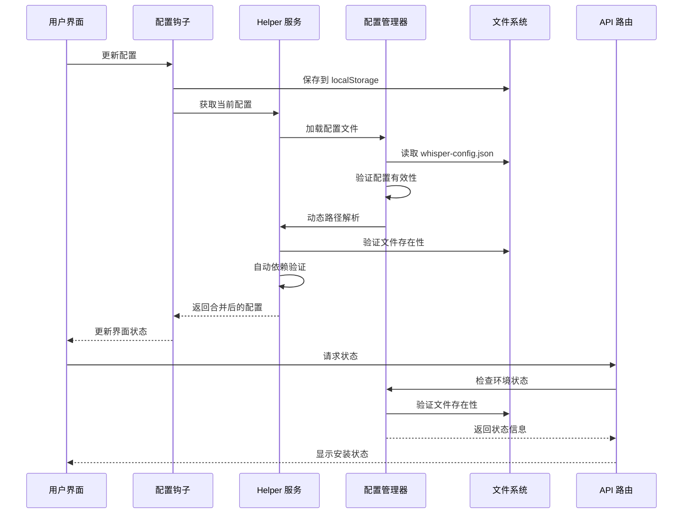
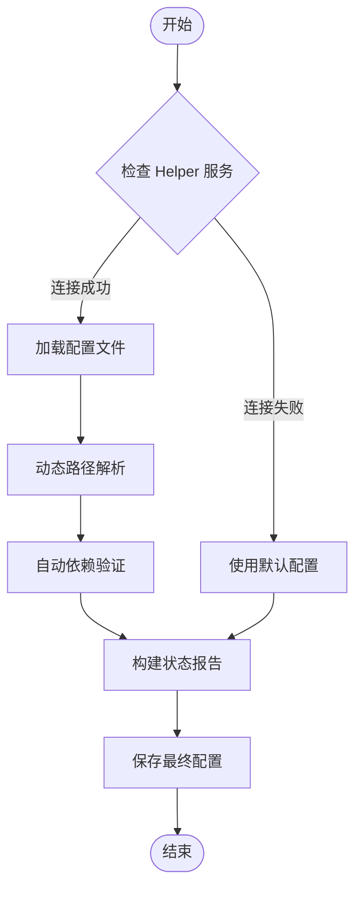
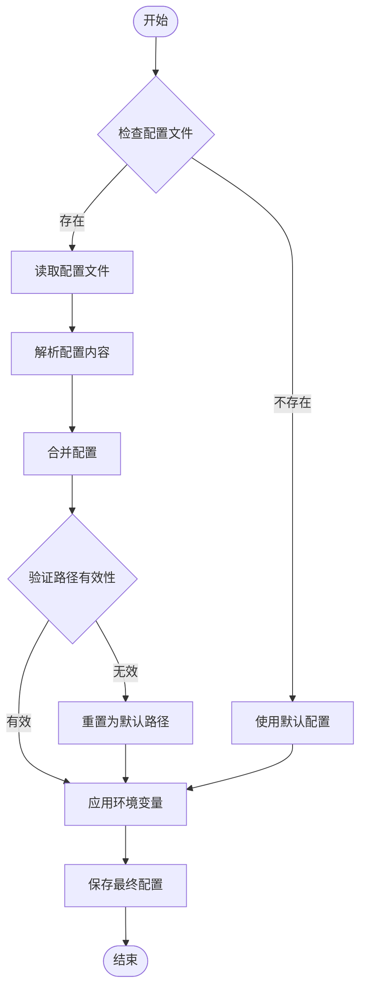
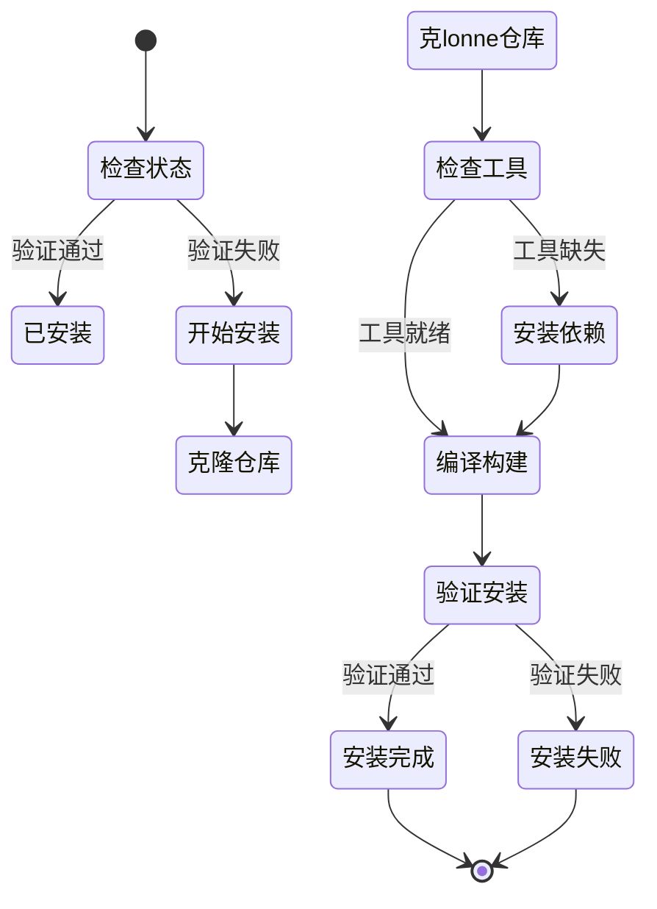
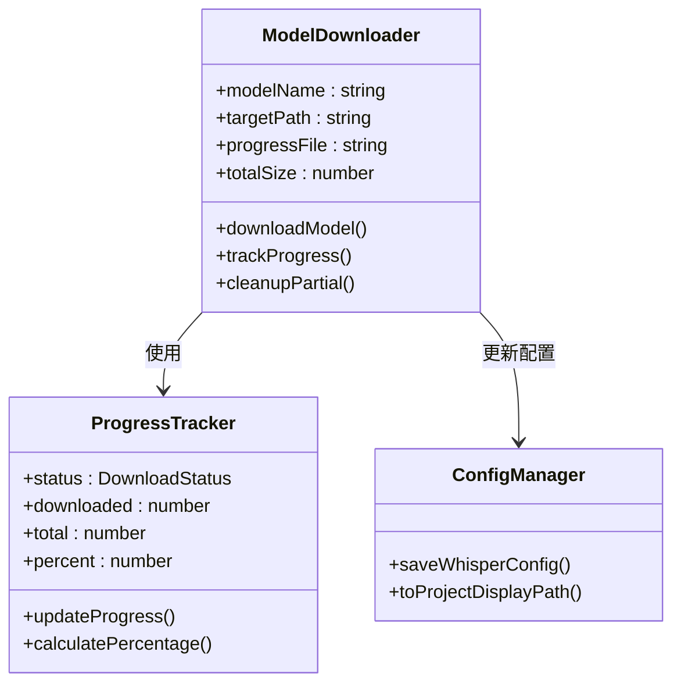
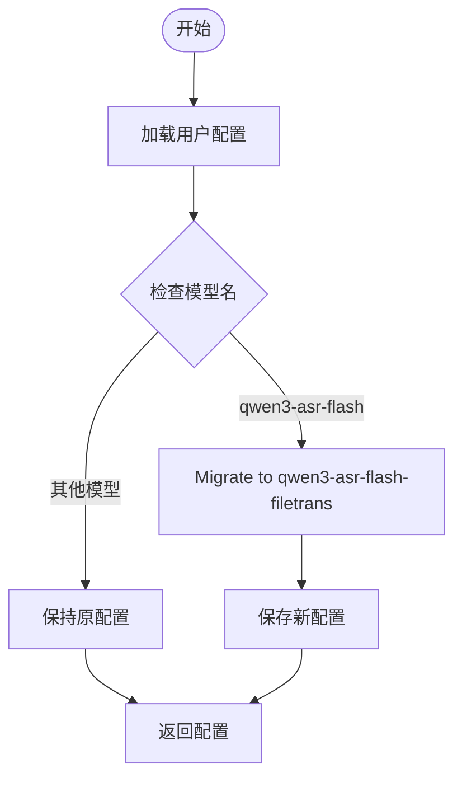
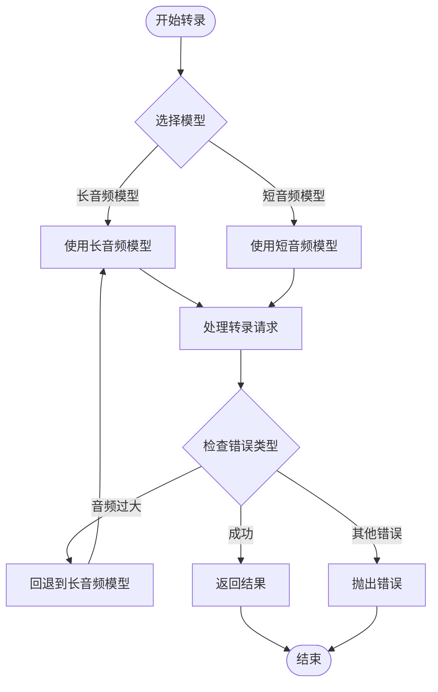
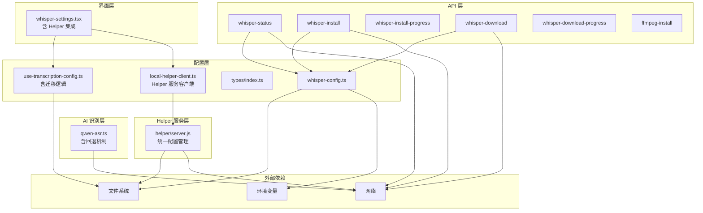

# Whisper 配置

<cite>
**本文档引用的文件**
- [whisper-config.ts](file://src/lib/whisper-config.ts)
- [whisper-settings.tsx](file://src/components/whisper-settings.tsx)
- [use-transcription-config.ts](file://src/hooks/use-transcription-config.ts)
- [whisper.ts](file://src/lib/whisper.ts)
- [setup-whisper.sh](file://setup-whisper.sh)
- [index.ts](file://src/types/index.ts)
- [route.ts](file://src/app/api/whisper-status/route.ts)
- [route.ts](file://src/app/api/whisper-install/route.ts)
- [route.ts](file://src/app/api/whisper-install-progress/route.ts)
- [route.ts](file://src/app/api/whisper-download/route.ts)
- [route.ts](file://src/app/api/whisper-download-progress/route.ts)
- [route.ts](file://src/app/api/ffmpeg-install/route.ts)
- [qwen-asr.ts](file://src/lib/qwen-asr.ts)
- [local-helper-client.ts](file://src/lib/local-helper-client.ts)
- [server.js](file://helper/server.js)
</cite>

## 更新摘要
**变更内容**
- 重构配置系统：从独立的配置文件管理迁移到集成 helper 服务的统一配置管理
- 动态可执行路径解析：支持绝对路径、相对路径和命令名的智能解析
- 自动依赖验证：集成 whisper.cpp、ffmpeg 和模型文件的自动检测与验证
- 跨平台状态报告：提供统一的平台检测和状态报告机制
- 旧模型名自动迁移：从 `qwen3-asr-flash` 到 `qwen3-asr-flash-filetrans` 的无缝迁移
- 智能回退机制：在线 ASR 服务的自动模型切换能力

## 目录
1. [简介](#简介)
2. [项目结构](#项目结构)
3. [核心组件](#核心组件)
4. [架构概览](#架构概览)
5. [详细组件分析](#详细组件分析)
6. [依赖关系分析](#依赖关系分析)
7. [性能考虑](#性能考虑)
8. [故障排除指南](#故障排除指南)
9. [结论](#结论)

## 简介

MemoFlow 是一个基于 AI 的内容分析与创作助手，支持从多个平台（YouTube、小宇宙、小红书等）抓取内容并进行智能分析。Whisper 配置模块是整个应用的核心组件之一，负责管理本地语音识别环境的配置和部署。

**重大重构** 系统现已从传统的独立配置文件管理模式迁移到集成 helper 服务的统一配置管理架构。新架构通过本机 helper 服务提供动态可执行路径解析、自动依赖验证和跨平台状态报告功能，显著提升了配置管理的智能化水平和用户体验。

该模块提供了完整的 Whisper.cpp 本地语音识别解决方案，包括可执行文件路径解析、模型文件管理、环境变量配置以及安装进度跟踪等功能。通过统一的配置管理系统，用户可以轻松地设置和管理本地转录环境。

**更新** 系统现已默认使用更适合播客场景的长音频异步模型 `qwen3-asr-flash-filetrans`，并具备自动迁移旧配置的能力。

## 项目结构

项目采用 Next.js 应用程序架构，Whisper 配置相关的文件分布如下：



**图表来源**
- [whisper-config.ts:1-398](file://src/lib/whisper-config.ts#L1-L398)
- [whisper-settings.tsx:1-1029](file://src/components/whisper-settings.tsx#L1-L1029)
- [use-transcription-config.ts:1-132](file://src/hooks/use-transcription-config.ts#L1-L132)
- [qwen-asr.ts:1-714](file://src/lib/qwen-asr.ts#L1-L714)
- [local-helper-client.ts:1-55](file://src/lib/local-helper-client.ts#L1-L55)
- [server.js:1-1908](file://helper/server.js#L1-L1908)

**章节来源**
- [whisper-config.ts:1-398](file://src/lib/whisper-config.ts#L1-L398)
- [whisper-settings.tsx:1-1029](file://src/components/whisper-settings.tsx#L1-L1029)
- [use-transcription-config.ts:1-132](file://src/hooks/use-transcription-config.ts#L1-L132)
- [qwen-asr.ts:1-714](file://src/lib/qwen-asr.ts#L1-L714)
- [local-helper-client.ts:1-55](file://src/lib/local-helper-client.ts#L1-L55)
- [server.js:1-1908](file://helper/server.js#L1-L1908)

## 核心组件

### Helper 服务配置管理器

**新增** Helper 服务是本次重构的核心组件，提供统一的配置管理、动态路径解析和状态监控功能。它支持多种配置来源，包括默认配置、文件配置和环境变量配置，并按照特定的优先级规则进行合并。

Helper 服务的关键特性：
- **动态可执行路径解析**：支持绝对路径、相对路径和命令名的智能解析
- **自动依赖验证**：集成 whisper.cpp、ffmpeg 和模型文件的自动检测与验证
- **跨平台状态报告**：提供统一的平台检测和状态报告机制
- **实时状态监控**：通过 HTTP API 提供实时的安装状态
- **智能模型迁移**：自动处理旧模型名到新模型名的迁移

### 传统配置管理器

传统配置管理器仍然保留，主要用于向后兼容和特定场景下的配置读取。它支持多种配置来源，包括默认配置、文件配置和环境变量配置，并按照特定的优先级规则进行合并。

### 前端配置钩子

前端配置钩子提供了一个 React Hook 来管理用户的本地存储配置。它支持配置的持久化存储，并提供了便捷的方法来更新不同类型的配置。

**更新** 新增旧模型名自动迁移功能，当检测到用户配置为旧的 `qwen3-asr-flash` 模型时，会自动将其迁移到新的 `qwen3-asr-flash-filetrans` 模型。

### 设置界面组件

设置界面提供了用户友好的图形化界面来管理 Whisper 配置。用户可以通过这个界面连接本机 helper 服务，读取当前电脑上的 Whisper/ffmpeg/模型配置。

**更新** 界面已更新为默认使用长音频异步模型，并明确标注该模型适合播客场景。

### AI 语音识别模块

AI 语音识别模块负责管理千问 ASR 模型的使用，包括短音频流式模型和长音频异步模型的切换。

**更新** 默认使用长音频异步模型，具备智能回退机制：当短音频模型遇到限制时自动切换到长音频模型。

**章节来源**
- [server.js:1715-1731](file://helper/server.js#L1715-L1731)
- [whisper-config.ts:324-372](file://src/lib/whisper-config.ts#L324-L372)
- [use-transcription-config.ts:84-149](file://src/hooks/use-transcription-config.ts#L84-L149)
- [whisper-settings.tsx:211-1029](file://src/components/whisper-settings.tsx#L211-L1029)
- [qwen-asr.ts:85-124](file://src/lib/qwen-asr.ts#L85-L124)

## 架构概览

Whisper 配置系统的整体架构采用了分层设计，确保了配置管理的灵活性和可靠性：



**图表来源**
- [whisper-settings.tsx:240-282](file://src/components/whisper-settings.tsx#L240-L282)
- [whisper-config.ts:324-354](file://src/lib/whisper-config.ts#L324-L354)
- [route.ts:11-65](file://src/app/api/whisper-status/route.ts#L11-L65)
- [local-helper-client.ts:17-42](file://src/lib/local-helper-client.ts#L17-L42)

系统架构的关键特点包括：

1. **多层配置优先级**：默认配置 → 文件配置 → 环境变量配置
2. **动态路径解析**：支持绝对路径、相对路径和命令名的智能解析
3. **自动依赖验证**：集成 whisper.cpp、ffmpeg 和模型文件的自动检测与验证
4. **实时状态监控**：通过 HTTP API 提供实时的安装状态
5. **异步操作支持**：安装和下载操作采用后台执行方式
6. **进度跟踪机制**：通过服务器推送事件跟踪长时间操作进度
7. **智能模型迁移**：自动处理旧模型名到新模型名的迁移
8. **跨平台状态报告**：提供统一的平台检测和状态报告机制

**章节来源**
- [whisper-config.ts:291-316](file://src/lib/whisper-config.ts#L291-L316)
- [whisper-settings.tsx:284-393](file://src/components/whisper-settings.tsx#L284-L393)
- [server.js:1715-1731](file://helper/server.js#L1715-L1731)

## 详细组件分析

### Helper 服务配置管理

**新增** Helper 服务提供了统一的配置管理解决方案，集成了动态路径解析、自动依赖验证和跨平台状态报告功能：



**图表来源**
- [server.js:1715-1731](file://helper/server.js#L1715-L1731)
- [server.js:258-284](file://helper/server.js#L258-L284)
- [server.js:652-673](file://helper/server.js#L652-L673)

Helper 服务的验证机制包括：

- **动态路径解析**：支持绝对路径、相对路径和命令名的智能解析
- **文件存在性检查**：确保可执行文件和模型文件存在
- **权限验证**：检查文件的可执行权限
- **功能测试**：通过执行 `-h` 参数验证可执行文件功能
- **跨平台状态报告**：提供统一的平台检测和状态报告机制

**章节来源**
- [server.js:523-530](file://helper/server.js#L523-L530)
- [server.js:625-631](file://helper/server.js#L625-L631)
- [server.js:652-673](file://helper/server.js#L652-L673)

### 传统配置文件管理

传统配置文件管理模块负责处理 `.whisper-config.json` 文件的读取、解析和保存。该模块实现了智能的路径解析和验证机制：



**图表来源**
- [whisper-config.ts:327-354](file://src/lib/whisper-config.ts#L327-L354)

配置文件的验证机制包括：

- **路径解析**：支持绝对路径、相对路径和命令名
- **文件存在性检查**：确保可执行文件和模型文件存在
- **权限验证**：检查文件的可执行权限
- **功能测试**：通过执行 `-h` 参数验证可执行文件功能

**章节来源**
- [whisper-config.ts:56-93](file://src/lib/whisper-config.ts#L56-L93)
- [whisper-config.ts:123-181](file://src/lib/whisper-config.ts#L123-L181)

### 安装流程管理

安装流程管理模块处理 Whisper.cpp 和 FFmpeg 的安装过程，提供了完整的安装生命周期管理：



**图表来源**
- [route.ts:61-177](file://src/app/api/whisper-install/route.ts#L61-L177)

安装流程的关键步骤包括：

1. **仓库克隆**：从 GitHub 克隆 whisper.cpp 仓库
2. **工具检查**：验证 CMake 等编译工具是否可用
3. **依赖安装**：通过 Homebrew 安装缺失的依赖
4. **编译构建**：使用 CMake 进行编译
5. **安装验证**：验证编译结果的有效性

**章节来源**
- [route.ts:61-177](file://src/app/api/whisper-install/route.ts#L61-L177)
- [route.ts:84-184](file://src/app/api/ffmpeg-install/route.ts#L84-L184)

### 模型下载管理

模型下载管理模块提供了智能的模型文件下载和管理功能：



**图表来源**
- [route.ts:52-167](file://src/app/api/whisper-download/route.ts#L52-L167)
- [route.ts:13-39](file://src/app/api/whisper-download-progress/route.ts#L13-L39)

下载管理的关键特性包括：

- **进度跟踪**：实时跟踪下载进度并通过 SSE 推送
- **断点续传**：支持部分下载文件的清理和重新开始
- **智能重试**：在网络不稳定时提供重试机制
- **大小验证**：验证下载文件的完整性

**章节来源**
- [route.ts:52-167](file://src/app/api/whisper-download/route.ts#L52-L167)
- [route.ts:45-137](file://src/app/api/whisper-download-progress/route.ts#L45-L137)

### 前端配置界面

前端配置界面提供了直观的用户交互体验，支持以下主要功能：

| 功能特性 | 描述 | 实现方式 |
|---------|------|----------|
| Helper 服务连接 | 连接本机 Helper 服务，读取配置 | HTTP API 调用 |
| 模型选择 | 支持 Small 和 Medium 模型选择 | 单选按钮组 |
| 安装控制 | 一键安装 Whisper.cpp 和 FFmpeg | 按钮触发 API 调用 |
| 进度显示 | 实时显示安装和下载进度 | SSE 事件流 |
| 状态监控 | 显示当前环境状态 | 定时轮询 API |
| 配置保存 | 保存用户配置到 Helper 服务 | HTTP PUT 请求 |
| 跨平台支持 | 支持 Windows 和 macOS 平台 | 平台检测和适配 |

**更新** 界面已更新为默认使用长音频异步模型，并明确标注该模型适合播客场景。

**章节来源**
- [whisper-settings.tsx:211-1029](file://src/components/whisper-settings.tsx#L211-L1029)
- [whisper-settings.tsx:402-520](file://src/components/whisper-settings.tsx#L402-L520)
- [local-helper-client.ts:17-42](file://src/lib/local-helper-client.ts#L17-L42)

### 旧模型名自动迁移

**新增** 系统现在支持从旧的 `qwen3-asr-flash` 模型名自动迁移到新的 `qwen3-asr-flash-filetrans` 模型名。



**图表来源**
- [use-transcription-config.ts:42-44](file://src/hooks/use-transcription-config.ts#L42-L44)

迁移逻辑的关键特性：

- **自动检测**：检查用户配置中的模型名
- **智能迁移**：将旧模型名替换为新模型名
- **向后兼容**：确保旧配置仍能正常工作
- **平滑过渡**：用户无需手动更新配置

**章节来源**
- [use-transcription-config.ts:12-18](file://src/hooks/use-transcription-config.ts#L12-L18)
- [use-transcription-config.ts:42-44](file://src/hooks/use-transcription-config.ts#L42-L44)

### 智能回退机制

**新增** AI 语音识别模块现在具备智能回退机制，能够根据错误类型自动选择合适的模型。



**图表来源**
- [qwen-asr.ts:90-124](file://src/lib/qwen-asr.ts#L90-L124)
- [qwen-asr.ts:551-569](file://src/lib/qwen-asr.ts#L551-L569)

回退机制的关键特性：

- **错误类型检测**：识别音频大小限制等特定错误
- **自动切换**：在短音频模型遇到限制时自动切换到长音频模型
- **用户透明**：回退过程对用户完全透明
- **增强稳定性**：提升整体转录成功率

**章节来源**
- [qwen-asr.ts:85-124](file://src/lib/qwen-asr.ts#L85-L124)
- [qwen-asr.ts:551-569](file://src/lib/qwen-asr.ts#L551-L569)

## 依赖关系分析

Whisper 配置系统与其他组件的依赖关系如下：



**图表来源**
- [whisper-config.ts:1-398](file://src/lib/whisper-config.ts#L1-L398)
- [whisper-settings.tsx:1-1029](file://src/components/whisper-settings.tsx#L1-L1029)
- [use-transcription-config.ts:1-132](file://src/hooks/use-transcription-config.ts#L1-L132)
- [qwen-asr.ts:1-714](file://src/lib/qwen-asr.ts#L1-L714)
- [local-helper-client.ts:1-55](file://src/lib/local-helper-client.ts#L1-L55)
- [server.js:1-1908](file://helper/server.js#L1-L1908)

系统的主要依赖包括：

- **文件系统操作**：用于配置文件读写和验证
- **环境变量**：支持通过环境变量覆盖配置
- **网络通信**：用于 Helper 服务通信和模型下载
- **进程管理**：用于执行外部可执行文件
- **AI 服务**：用于在线语音识别

**章节来源**
- [whisper-config.ts:1-12](file://src/lib/whisper-config.ts#L1-L12)
- [whisper-settings.tsx:1-35](file://src/components/whisper-settings.tsx#L1-L35)
- [local-helper-client.ts:1-55](file://src/lib/local-helper-client.ts#L1-L55)

## 性能考虑

### 配置加载优化

配置加载过程经过了多项优化以提高性能：

1. **缓存策略**：配置结果在内存中缓存，避免重复读取文件
2. **异步验证**：使用异步方式验证可执行文件，不阻塞主线程
3. **智能路径解析**：缓存解析结果，减少重复的路径查找操作
4. **最小化文件访问**：只在必要时访问文件系统
5. **Helper 服务缓存**：Helper 服务内部缓存配置结果，提升响应速度

### 安装过程优化

安装过程采用了多种技术来优化用户体验：

1. **后台执行**：安装和下载操作在后台执行，不阻塞用户界面
2. **进度反馈**：通过 SSE 实时推送进度，提供良好的用户体验
3. **错误恢复**：支持部分失败的恢复和重试机制
4. **资源管理**：合理管理内存和 CPU 资源使用

### 网络优化

网络操作方面采用了以下优化策略：

1. **流式下载**：使用流式 API 进行大文件下载，减少内存占用
2. **进度分片**：定期更新下载进度，避免频繁的 UI 更新
3. **超时控制**：设置合理的超时时间，避免长时间无响应
4. **错误处理**：提供详细的错误信息和重试机制

### 模型选择优化

**更新** 新的模型选择策略提升了系统性能：

1. **默认优化**：长音频模型更适合播客场景，减少转录失败率
2. **智能回退**：自动处理模型切换，避免用户手动干预
3. **迁移透明**：旧配置自动适配新模型，无需用户操作
4. **Helper 服务集成**：通过 Helper 服务提供统一的模型管理

## 故障排除指南

### 常见问题及解决方案

#### 1. Helper 服务连接失败

**症状**：界面提示未检测到本机 Helper 服务

**可能原因**：
- Helper 服务未启动
- 网络连接问题
- 端口被占用
- 跨域资源共享(CORS)问题

**解决步骤**：
1. 在用户电脑上启动 Helper 服务：`npm run helper`
2. 检查网络连接状态
3. 验证端口 47392 是否被占用
4. 确认浏览器允许私有网络请求
5. 查看浏览器控制台的详细错误信息

#### 2. Whisper 可执行文件验证失败

**症状**：系统提示 whisper.cpp 未正确安装或无法运行

**可能原因**：
- 可执行文件权限不足
- 缺少必要的动态库依赖
- 编译过程中出现错误
- Helper 服务路径解析失败

**解决步骤**：
1. 检查可执行文件权限：`chmod +x whisper.cpp/main`
2. 验证动态库路径：检查 `DYLD_LIBRARY_PATH` 环境变量
3. 重新编译：删除构建目录后重新执行安装
4. 检查 Helper 服务的日志输出
5. 验证路径解析是否正确

#### 3. 模型文件下载失败

**症状**：模型下载卡在某个百分比或完全失败

**可能原因**：
- 网络连接不稳定
- 磁盘空间不足
- 防火墙阻止下载
- Helper 服务存储权限问题

**解决步骤**：
1. 检查网络连接状态
2. 清理磁盘空间
3. 关闭防火墙或添加例外
4. 检查 Helper 服务的存储权限
5. 重新启动下载进程

#### 4. FFmpeg 安装失败

**症状**：FFmpeg 无法正常安装或运行

**可能原因**：
- Homebrew 未正确安装
- 系统权限不足
- 依赖库冲突
- Helper 服务环境变量问题

**解决步骤**：
1. 验证 Homebrew 安装：`brew --version`
2. 更新 Homebrew：`brew update`
3. 修复依赖：`brew doctor`
4. 检查 Helper 服务的环境变量配置
5. 手动安装 FFmpeg：`brew install ffmpeg`

#### 5. 配置文件损坏

**症状**：配置文件无法读取或解析失败

**解决步骤**：
1. 备份当前配置文件
2. 删除损坏的配置文件
3. 重启 Helper 服务让系统生成新的默认配置
4. 重新配置各项参数
5. 检查 Helper 服务的日志输出

#### 6. 模型迁移问题

**症状**：旧配置无法正常工作或出现模型名错误

**可能原因**：
- 旧模型名已被弃用
- Helper 服务迁移逻辑异常
- 浏户端缓存问题

**解决步骤**：
1. 检查浏览器控制台是否有迁移错误
2. 手动更新配置中的模型名为 `qwen3-asr-flash-filetrans`
3. 重新加载页面确认配置生效
4. 清除浏览器缓存
5. 查看 Helper 服务的迁移日志了解具体问题

### 调试工具和技巧

#### 日志分析

系统提供了详细的日志输出，可以帮助诊断问题：

1. **Helper 服务日志**：显示路径解析和验证过程
2. **安装过程日志**：记录安装步骤和错误信息
3. **网络请求日志**：显示下载进度和错误详情
4. **系统环境日志**：记录环境变量和路径信息
5. **模型迁移日志**：显示旧模型名到新模型名的转换过程
6. **跨平台状态日志**：显示平台检测和状态报告

#### 环境检查

建议定期运行以下检查命令：

```bash
# 检查 Helper 服务状态
curl http://127.0.0.1:47392/health

# 检查可执行文件权限
ls -la whisper.cpp/main

# 检查动态库依赖
otool -L whisper.cpp/main

# 检查磁盘空间
df -h

# 检查网络连接
ping github.com
```

#### 模型迁移调试

**新增** 模型迁移相关的调试方法：

1. **检查迁移日志**：查看浏览器控制台中的迁移信息
2. **验证配置更新**：确认 localStorage 中的模型名已更新
3. **测试回退机制**：验证短音频模型遇到限制时能否正确回退
4. **监控 API 调用**：观察网络面板中的模型切换请求
5. **Helper 服务日志**：查看 Helper 服务中的迁移处理日志

**章节来源**
- [route.ts:168-177](file://src/app/api/whisper-install/route.ts#L168-L177)
- [route.ts:147-167](file://src/app/api/whisper-download/route.ts#L147-L167)
- [route.ts:175-184](file://src/app/api/ffmpeg-install/route.ts#L175-L184)
- [use-transcription-config.ts:42-44](file://src/hooks/use-transcription-config.ts#L42-L44)
- [qwen-asr.ts:551-569](file://src/lib/qwen-asr.ts#L551-L569)
- [local-helper-client.ts:48-50](file://src/lib/local-helper-client.ts#L48-L50)

## 结论

Whisper 配置系统经过重大重构，从传统的独立配置文件管理模式升级为集成 Helper 服务的统一配置管理架构。新系统通过以下关键特性确保了良好的用户体验：

1. **动态可执行路径解析**：支持绝对路径、相对路径和命令名的智能解析
2. **自动依赖验证**：集成 whisper.cpp、ffmpeg 和模型文件的自动检测与验证
3. **跨平台状态报告**：提供统一的平台检测和状态报告机制
4. **多层配置管理**：支持默认配置、文件配置和环境变量配置的灵活组合
5. **完整的安装流程**：提供从安装到验证的一站式解决方案
6. **实时进度跟踪**：通过 SSE 提供流畅的用户体验
7. **强大的错误处理**：完善的错误检测和恢复机制
8. **智能模型迁移**：自动处理旧模型名到新模型名的转换
9. **增强的回退机制**：提升转录成功率和用户体验

**更新** 最新的变更显著提升了系统的稳定性和用户体验：

- **Helper 服务集成**：通过本机 Helper 服务提供统一的配置管理
- **动态路径解析**：支持多种路径格式的智能解析
- **自动依赖验证**：集成多种依赖的自动检测与验证
- **跨平台支持**：提供统一的平台检测和状态报告
- **默认模型优化**：从 `qwen3-asr-flash` 更新为更适合播客场景的 `qwen3-asr-flash-filetrans`
- **自动迁移支持**：无缝处理旧配置到新配置的转换
- **智能回退机制**：在遇到音频大小限制时自动切换到长音频模型
- **界面优化**：明确标注默认使用的长音频模型及其适用场景

该系统不仅满足了基本的配置管理需求，还通过精心设计的用户界面和后台服务，为用户提供了简单易用的本地语音识别环境搭建体验。无论是开发者还是普通用户，都可以通过这个系统快速部署和使用 Whisper.cpp 进行本地语音转录。

未来可以考虑的功能增强包括：
- 更详细的安装日志和错误报告
- 配置导入导出功能
- 多用户配置支持
- 配置模板和预设方案
- 更精细的模型选择和优化选项
- Helper 服务的集群化部署支持