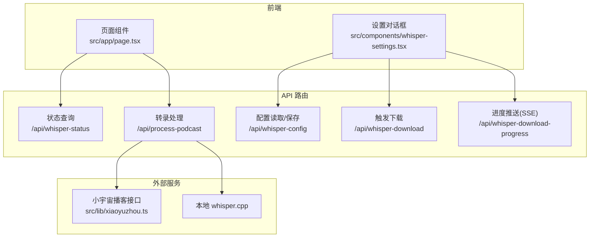
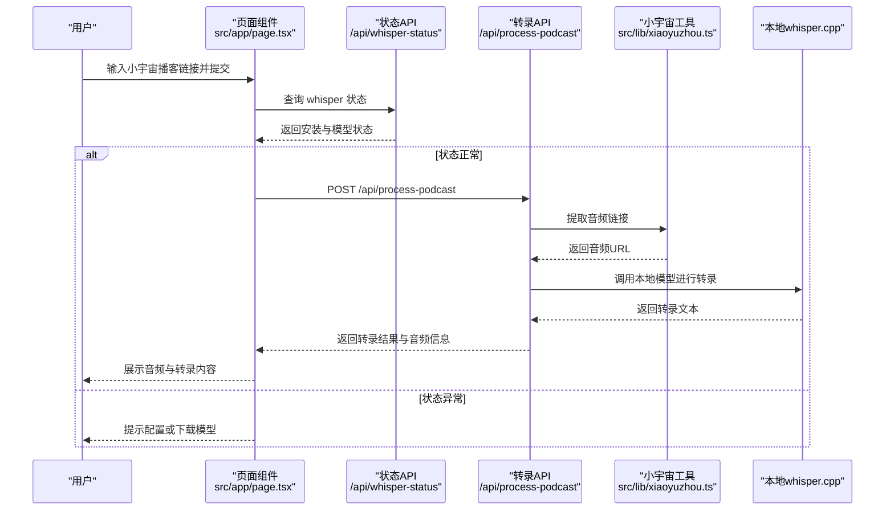
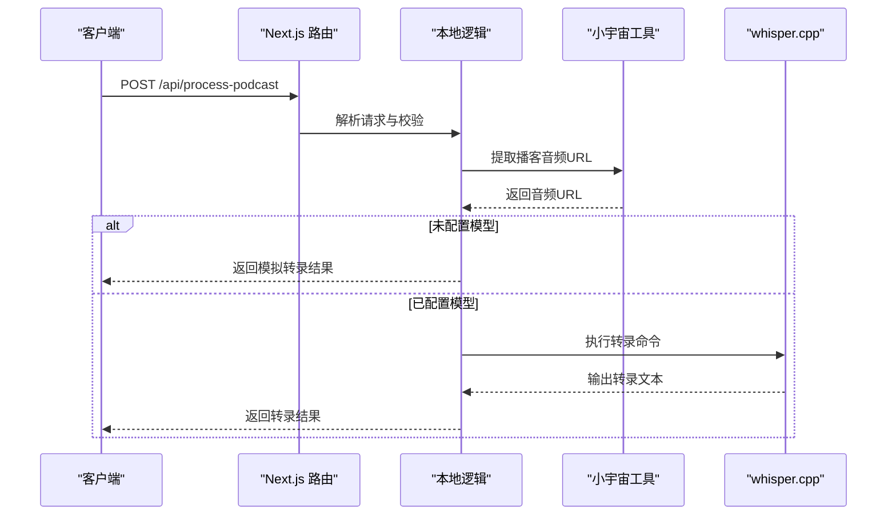

# 快速开始

<cite>
**本文引用的文件**
- [README.md](file://README.md)
- [package.json](file://package.json)
- [setup-whisper.sh](file://setup-whisper.sh)
- [next.config.mjs](file://next.config.mjs)
- [tsconfig.json](file://tsconfig.json)
- [src/app/page.tsx](file://src/app/page.tsx)
- [src/components/whisper-settings.tsx](file://src/components/whisper-settings.tsx)
- [src/lib/xiaoyuzhou.ts](file://src/lib/xiaoyuzhou.ts)
- [src/app/api/process-podcast/route.ts](file://src/app/api/process-podcast/route.ts)
- [src/app/api/whisper-config/route.ts](file://src/app/api/whisper-config/route.ts)
- [src/app/api/whisper-download/route.ts](file://src/app/api/whisper-download/route.ts)
- [src/app/api/whisper-download-progress/route.ts](file://src/app/api/whisper-download-progress/route.ts)
- [src/app/api/whisper-status/route.ts](file://src/app/api/whisper-status/route.ts)
</cite>

## 目录
1. [简介](#简介)
2. [项目结构](#项目结构)
3. [核心组件](#核心组件)
4. [架构总览](#架构总览)
5. [详细组件分析](#详细组件分析)
6. [依赖分析](#依赖分析)
7. [性能考虑](#性能考虑)
8. [故障排除指南](#故障排除指南)
9. [结论](#结论)
10. [附录](#附录)

## 简介
MemoFlow 是一个基于 AI 的内容分析与创作助手，支持从播客链接（如小宇宙）提取音频并进行本地语音识别转录，输出可用于笔记与二次创作的文字内容。本指南面向首次使用者，提供从环境准备、依赖安装、whisper.cpp 配置到成功转录第一个播客的完整 15 分钟上手流程。

## 项目结构
该项目采用 Next.js 应用结构，前端页面位于 src/app，业务逻辑通过 Next.js Server Actions 与 API 路由实现，语音识别能力通过本地 whisper.cpp 完成，UI 组件采用 Radix UI 和 TailwindCSS。

图表来源
- [src/app/page.tsx:13-87](file://src/app/page.tsx#L13-L87)
- [src/components/whisper-settings.tsx:56-108](file://src/components/whisper-settings.tsx#L56-L108)
- [src/app/api/whisper-status/route.ts:11-48](file://src/app/api/whisper-status/route.ts#L11-L48)
- [src/app/api/whisper-config/route.ts:10-27](file://src/app/api/whisper-config/route.ts#L10-L27)
- [src/app/api/whisper-download/route.ts:173-225](file://src/app/api/whisper-download/route.ts#L173-L225)
- [src/app/api/whisper-download-progress/route.ts:43-137](file://src/app/api/whisper-download-progress/route.ts#L43-L137)
- [src/app/api/process-podcast/route.ts:13-113](file://src/app/api/process-podcast/route.ts#L13-L113)
- [src/lib/xiaoyuzhou.ts:27-46](file://src/lib/xiaoyuzhou.ts#L27-L46)

章节来源
- [README.md:1-27](file://README.md#L1-L27)
- [package.json:1-37](file://package.json#L1-L37)
- [next.config.mjs:1-12](file://next.config.mjs#L1-L12)
- [tsconfig.json:1-27](file://tsconfig.json#L1-L27)

## 核心组件
- 页面入口与交互：负责接收播客链接、调用转录 API，并展示音频信息与转录结果。
- 设置对话框：管理 whisper.cpp 安装路径、模型路径、线程数等配置，支持模型下载与进度跟踪。
- 小宇宙工具：从播客页面提取音频链接与元数据，提供多策略抓取。
- API 路由：封装状态查询、配置读写、模型下载（含 SSE 进度）、转录处理等后端逻辑。

章节来源
- [src/app/page.tsx:13-87](file://src/app/page.tsx#L13-L87)
- [src/components/whisper-settings.tsx:56-108](file://src/components/whisper-settings.tsx#L56-L108)
- [src/lib/xiaoyuzhou.ts:27-46](file://src/lib/xiaoyuzhou.ts#L27-L46)
- [src/app/api/process-podcast/route.ts:13-113](file://src/app/api/process-podcast/route.ts#L13-L113)
- [src/app/api/whisper-config/route.ts:10-27](file://src/app/api/whisper-config/route.ts#L10-L27)
- [src/app/api/whisper-download/route.ts:173-225](file://src/app/api/whisper-download/route.ts#L173-L225)
- [src/app/api/whisper-download-progress/route.ts:43-137](file://src/app/api/whisper-download-progress/route.ts#L43-L137)
- [src/app/api/whisper-status/route.ts:11-48](file://src/app/api/whisper-status/route.ts#L11-L48)

## 架构总览
下图展示了从用户输入播客链接到本地转录完成的关键流程。

图表来源
- [src/app/page.tsx:23-87](file://src/app/page.tsx#L23-L87)
- [src/app/api/whisper-status/route.ts:11-48](file://src/app/api/whisper-status/route.ts#L11-L48)
- [src/app/api/process-podcast/route.ts:13-113](file://src/app/api/process-podcast/route.ts#L13-L113)
- [src/lib/xiaoyuzhou.ts:27-46](file://src/lib/xiaoyuzhou.ts#L27-L46)

## 详细组件分析

### 环境要求与系统兼容性
- Node.js 版本：根据依赖声明，项目使用 Next.js 14，建议使用 Node.js LTS（如 18 或 20），以获得最佳兼容性与性能。
- 操作系统：脚本与 API 使用了 Node.js 文件系统与子进程模块，可在 macOS、Linux 与 Windows 上运行。若在 Windows 上使用本地 whisper.cpp，需确保可执行文件可用或使用 WSL。
- 浏览器：项目为 Web 应用，使用现代浏览器即可访问。

章节来源
- [package.json:12-25](file://package.json#L12-L25)
- [next.config.mjs:1-12](file://next.config.mjs#L1-L12)

### 依赖安装与初始配置
- 安装依赖
  - 在项目根目录执行安装命令，安装前端与开发依赖。
  - 参考脚本定义：[package.json:5-11](file://package.json#L5-L11)
- 启动开发服务器
  - 使用 Next.js 开发模式启动本地服务，默认端口为 3000。
  - 参考脚本定义：[package.json](file://package.json#L6)

章节来源
- [package.json:5-11](file://package.json#L5-L11)

### whisper.cpp 安装与配置
- 方式一：使用一键脚本
  - 执行脚本会克隆 whisper.cpp 仓库、下载中文优化模型（small），并编译可执行文件。
  - 使用前请按脚本输出提示在环境变量中设置 whisper.cpp 程序路径与模型路径。
  - 参考脚本：[setup-whisper.sh:1-47](file://setup-whisper.sh#L1-L47)
- 方式二：手动安装
  - 克隆 whisper.cpp 仓库并编译。
  - 在 models 目录放置模型文件（例如 ggml-small.bin）。
  - 在应用中通过设置对话框填写 whisper.cpp 程序路径与模型路径，并保存配置。
  - 参考设置组件：[src/components/whisper-settings.tsx:56-108](file://src/components/whisper-settings.tsx#L56-L108)

章节来源
- [setup-whisper.sh:1-47](file://setup-whisper.sh#L1-L47)
- [src/components/whisper-settings.tsx:56-108](file://src/components/whisper-settings.tsx#L56-L108)

### 首次使用完整流程（15 分钟）
- 步骤 1：安装依赖并启动开发服务器
  - 安装依赖：npm install
  - 启动开发服务器：npm run dev
  - 访问 http://localhost:3000
  - 参考脚本：[package.json:5-11](file://package.json#L5-L11)
- 步骤 2：安装 whisper.cpp
  - 执行一键脚本：bash setup-whisper.sh
  - 按脚本提示设置环境变量中的路径
  - 参考脚本：[setup-whisper.sh:44-47](file://setup-whisper.sh#L44-L47)
- 步骤 3：在设置中配置 whisper.cpp
  - 打开设置对话框，填写 whisper.cpp 程序路径与模型路径，保存配置
  - 参考设置组件：[src/components/whisper-settings.tsx:190-213](file://src/components/whisper-settings.tsx#L190-L213)
- 步骤 4：下载模型（可选，如需更高准确率）
  - 在设置中选择模型并点击“下载模型”，通过 SSE 实时查看进度
  - 参考下载路由与进度路由：[src/app/api/whisper-download/route.ts:173-225](file://src/app/api/whisper-download/route.ts#L173-L225)，[src/app/api/whisper-download-progress/route.ts:43-137](file://src/app/api/whisper-download-progress/route.ts#L43-L137)
- 步骤 5：转录第一个播客
  - 在首页粘贴小宇宙播客链接，点击“开始转录”
  - 若提示需要配置或下载模型，请先完成上述步骤
  - 参考页面逻辑：[src/app/page.tsx:23-87](file://src/app/page.tsx#L23-L87)
- 步骤 6：查看结果
  - 成功后将显示音频信息与转录文本，支持复制与格式化展示
  - 参考页面渲染：[src/app/page.tsx:158-235](file://src/app/page.tsx#L158-L235)

章节来源
- [package.json:5-11](file://package.json#L5-L11)
- [setup-whisper.sh:44-47](file://setup-whisper.sh#L44-L47)
- [src/components/whisper-settings.tsx:190-213](file://src/components/whisper-settings.tsx#L190-L213)
- [src/app/api/whisper-download/route.ts:173-225](file://src/app/api/whisper-download/route.ts#L173-L225)
- [src/app/api/whisper-download-progress/route.ts:43-137](file://src/app/api/whisper-download-progress/route.ts#L43-L137)
- [src/app/page.tsx:23-87](file://src/app/page.tsx#L23-L87)
- [src/app/page.tsx:158-235](file://src/app/page.tsx#L158-L235)

### API 调用序列（转录流程）

图表来源
- [src/app/api/process-podcast/route.ts:13-113](file://src/app/api/process-podcast/route.ts#L13-L113)
- [src/lib/xiaoyuzhou.ts:27-46](file://src/lib/xiaoyuzhou.ts#L27-L46)

## 依赖分析
- 前端框架与样式
  - Next.js 14：提供服务端渲染、API 路由与开发体验
  - Radix UI：语义化基础组件库
  - TailwindCSS：原子化样式工具
- 类型与构建
  - TypeScript：类型安全与开发体验
  - PostCSS/Tailwind：CSS 处理与按需输出
- 运行时与系统集成
  - Node.js 文件系统与子进程：用于本地 whisper.cpp 调用与临时文件管理
  - xml2js：解析 XML 数据（如 RSS 源）

章节来源
- [package.json:12-35](file://package.json#L12-L35)
- [next.config.mjs:1-12](file://next.config.mjs#L1-L12)
- [tsconfig.json:1-27](file://tsconfig.json#L1-L27)

## 性能考虑
- 模型选择
  - Small 模型体积较小，适合日常使用；Medium 模型更准确但体积较大，适合专业场景
  - 参考设置组件中的模型选项：[src/components/whisper-settings.tsx:33-46](file://src/components/whisper-settings.tsx#L33-L46)
- 线程数
  - 建议设置为 CPU 核心数的一半，避免过度占用导致系统卡顿
  - 参考设置组件中的高级设置：[src/components/whisper-settings.tsx:404-441](file://src/components/whisper-settings.tsx#L404-L441)
- 临时文件管理
  - 转录完成后会删除临时音频文件，减少磁盘占用
  - 参考转录路由：[src/app/api/process-podcast/route.ts:91-96](file://src/app/api/process-podcast/route.ts#L91-L96)

## 故障排除指南
- 无法找到 whisper.cpp 或模型
  - 确认已在设置中填写正确的程序路径与模型路径，并保存配置
  - 参考配置路由与状态路由：[src/app/api/whisper-config/route.ts:36-123](file://src/app/api/whisper-config/route.ts#L36-L123)，[src/app/api/whisper-status/route.ts:11-48](file://src/app/api/whisper-status/route.ts#L11-L48)
- 模型下载失败或中断
  - 检查网络连通性与磁盘空间；可通过设置界面重新下载
  - 参考下载路由与进度路由：[src/app/api/whisper-download/route.ts:173-225](file://src/app/api/whisper-download/route.ts#L173-L225)，[src/app/api/whisper-download-progress/route.ts:43-137](file://src/app/api/whisper-download-progress/route.ts#L43-L137)
- 转录无结果或报错
  - 确认播客链接为小宇宙链接；检查 whisper.cpp 是否可执行
  - 参考页面逻辑与转录路由：[src/app/page.tsx:32-57](file://src/app/page.tsx#L32-L57)，[src/app/api/process-podcast/route.ts:63-89](file://src/app/api/process-podcast/route.ts#L63-L89)
- 小宇宙链接无效
  - 确认链接包含 /episode/ 路径；工具会尝试多种策略提取音频
  - 参考小宇宙工具：[src/lib/xiaoyuzhou.ts:27-46](file://src/lib/xiaoyuzhou.ts#L27-L46)

章节来源
- [src/app/api/whisper-config/route.ts:36-123](file://src/app/api/whisper-config/route.ts#L36-L123)
- [src/app/api/whisper-status/route.ts:11-48](file://src/app/api/whisper-status/route.ts#L11-L48)
- [src/app/api/whisper-download/route.ts:173-225](file://src/app/api/whisper-download/route.ts#L173-L225)
- [src/app/api/whisper-download-progress/route.ts:43-137](file://src/app/api/whisper-download-progress/route.ts#L43-L137)
- [src/app/page.tsx:32-57](file://src/app/page.tsx#L32-L57)
- [src/app/api/process-podcast/route.ts:63-89](file://src/app/api/process-podcast/route.ts#L63-L89)
- [src/lib/xiaoyuzhou.ts:27-46](file://src/lib/xiaoyuzhou.ts#L27-L46)

## 结论
按照本指南，您可以在 15 分钟内完成 MemoFlow 的本地环境搭建与首次转录。建议优先使用一键脚本安装 whisper.cpp，随后在设置中完善路径与模型配置，并通过 SSE 实时监控模型下载进度。遇到问题时，优先检查 whisper 状态与网络连通性，必要时参考故障排除章节。

## 附录
- 常用命令
  - 安装依赖：npm install
  - 启动开发服务器：npm run dev
  - 参考脚本：[package.json:5-11](file://package.json#L5-L11)
- 一键脚本
  - 执行 bash setup-whisper.sh 完成 whisper.cpp 安装与模型下载
  - 参考脚本：[setup-whisper.sh:1-47](file://setup-whisper.sh#L1-L47)