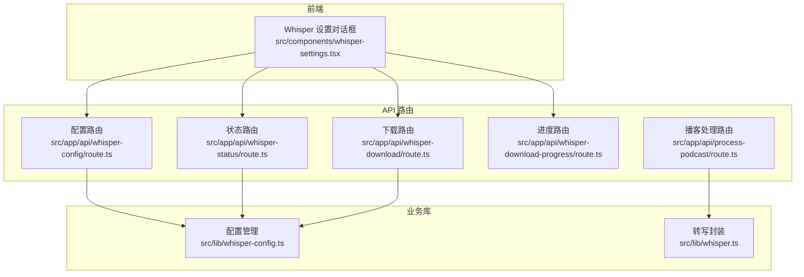
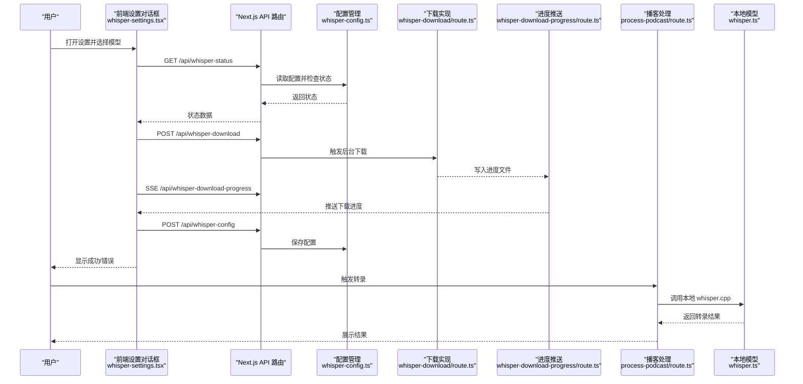
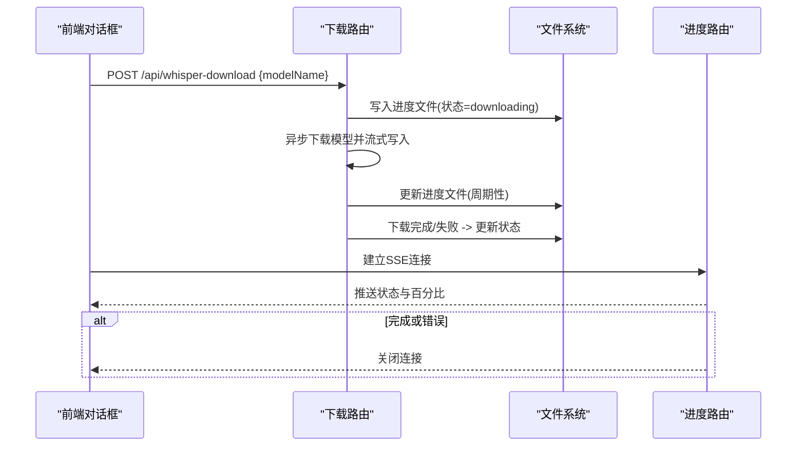
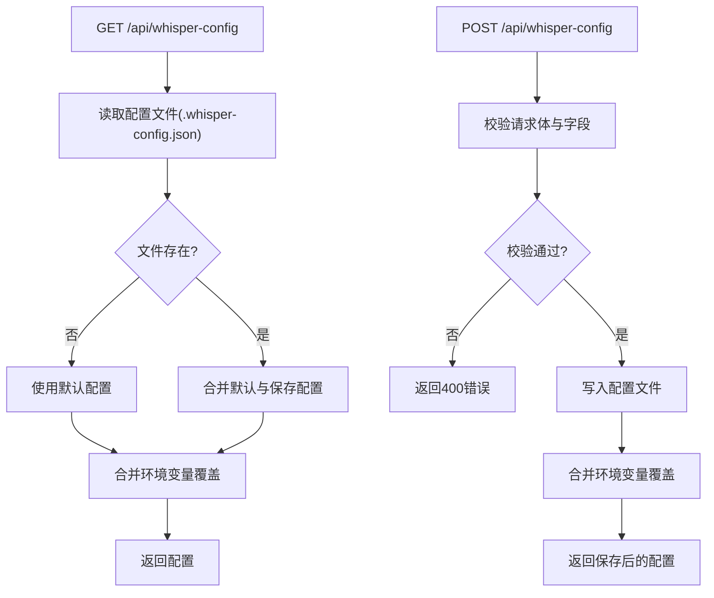
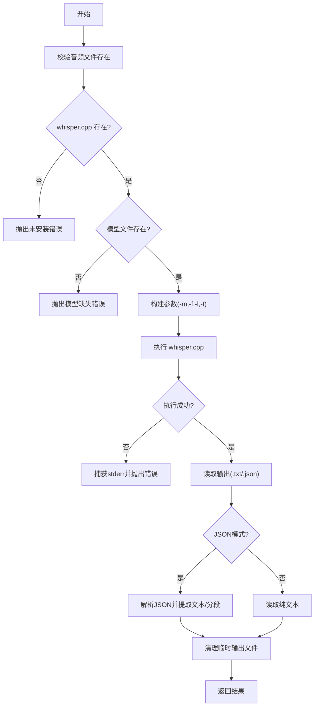
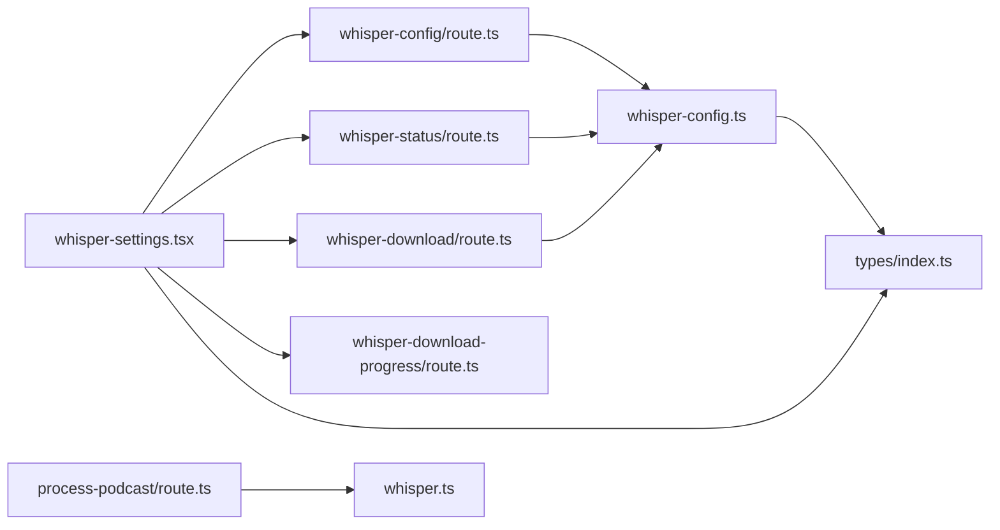

# 故障排除与常见问题

<cite>
**本文引用的文件**
- [README.md](file://README.md)
- [setup-whisper.sh](file://setup-whisper.sh)
- [src/lib/whisper.ts](file://src/lib/whisper.ts)
- [src/lib/whisper-config.ts](file://src/lib/whisper-config.ts)
- [src/app/api/whisper-config/route.ts](file://src/app/api/whisper-config/route.ts)
- [src/app/api/whisper-download/route.ts](file://src/app/api/whisper-download/route.ts)
- [src/app/api/whisper-download-progress/route.ts](file://src/app/api/whisper-download-progress/route.ts)
- [src/app/api/whisper-status/route.ts](file://src/app/api/whisper-status/route.ts)
- [src/app/api/process-podcast/route.ts](file://src/app/api/process-podcast/route.ts)
- [src/components/whisper-settings.tsx](file://src/components/whisper-settings.tsx)
- [src/types/index.ts](file://src/types/index.ts)
- [package.json](file://package.json)
</cite>

## 目录
1. [简介](#简介)
2. [项目结构](#项目结构)
3. [核心组件](#核心组件)
4. [架构总览](#架构总览)
5. [详细组件分析](#详细组件分析)
6. [依赖关系分析](#依赖关系分析)
7. [性能考虑](#性能考虑)
8. [故障排除指南](#故障排除指南)
9. [结论](#结论)
10. [附录](#附录)

## 简介
MemoFlow 是一个基于本地 Whisper 模型的语音转写与内容分析工具，支持从多平台媒体链接抓取音频并进行本地转写，再结合 AI 生成笔记与二次创作内容。本文档聚焦于用户在使用过程中可能遇到的典型问题，包括 Whisper 模型下载失败、转录结果异常、API 调用错误等，并提供系统化的诊断流程、日志分析方法、调试技巧、性能优化建议以及跨平台问题解决方案。

## 项目结构
- 应用采用 Next.js 14 App Router 架构，前端组件位于 src/components，API 路由位于 src/app/api，业务逻辑封装在 src/lib。
- Whisper 相关功能集中在本地模型管理与转写调用，前端通过对话框组件进行配置与下载进度跟踪。
- 项目根目录提供一键安装脚本，便于初始化 Whisper 环境。

图表来源
- [src/components/whisper-settings.tsx:1-468](file://src/components/whisper-settings.tsx#L1-L468)
- [src/app/api/whisper-config/route.ts:1-124](file://src/app/api/whisper-config/route.ts#L1-L124)
- [src/app/api/whisper-status/route.ts:1-60](file://src/app/api/whisper-status/route.ts#L1-L60)
- [src/app/api/whisper-download/route.ts:1-235](file://src/app/api/whisper-download/route.ts#L1-L235)
- [src/app/api/whisper-download-progress/route.ts:1-139](file://src/app/api/whisper-download-progress/route.ts#L1-L139)
- [src/app/api/process-podcast/route.ts:1-127](file://src/app/api/process-podcast/route.ts#L1-L127)
- [src/lib/whisper-config.ts:1-105](file://src/lib/whisper-config.ts#L1-L105)
- [src/lib/whisper.ts:1-229](file://src/lib/whisper.ts#L1-L229)

章节来源
- [README.md:1-27](file://README.md#L1-L27)
- [package.json:1-37](file://package.json#L1-L37)

## 核心组件
- Whisper 配置管理：负责读取/保存配置、合并环境变量、推断模型名、格式化文件大小等。
- Whisper 转写封装：封装本地 whisper.cpp 可执行文件调用，校验文件与模型存在性，构建参数，解析输出，清理临时文件。
- API 路由：提供配置读取/保存、状态查询、模型下载触发与进度推送、播客处理等接口。
- 前端设置对话框：集成状态展示、模型选择与下载、高级配置、SSE 进度监听与错误提示。

章节来源
- [src/lib/whisper-config.ts:1-105](file://src/lib/whisper-config.ts#L1-L105)
- [src/lib/whisper.ts:1-229](file://src/lib/whisper.ts#L1-L229)
- [src/app/api/whisper-config/route.ts:1-124](file://src/app/api/whisper-config/route.ts#L1-L124)
- [src/app/api/whisper-status/route.ts:1-60](file://src/app/api/whisper-status/route.ts#L1-L60)
- [src/app/api/whisper-download/route.ts:1-235](file://src/app/api/whisper-download/route.ts#L1-L235)
- [src/app/api/whisper-download-progress/route.ts:1-139](file://src/app/api/whisper-download-progress/route.ts#L1-L139)
- [src/app/api/process-podcast/route.ts:1-127](file://src/app/api/process-podcast/route.ts#L1-L127)
- [src/components/whisper-settings.tsx:1-468](file://src/components/whisper-settings.tsx#L1-L468)

## 架构总览
下图展示了从用户操作到后端处理与本地模型调用的整体流程，以及关键错误点与恢复策略。

图表来源
- [src/components/whisper-settings.tsx:74-154](file://src/components/whisper-settings.tsx#L74-L154)
- [src/app/api/whisper-status/route.ts:11-58](file://src/app/api/whisper-status/route.ts#L11-L58)
- [src/app/api/whisper-download/route.ts:173-234](file://src/app/api/whisper-download/route.ts#L173-L234)
- [src/app/api/whisper-download-progress/route.ts:43-138](file://src/app/api/whisper-download-progress/route.ts#L43-L138)
- [src/app/api/whisper-config/route.ts:36-123](file://src/app/api/whisper-config/route.ts#L36-L123)
- [src/app/api/process-podcast/route.ts:44-114](file://src/app/api/process-podcast/route.ts#L44-L114)
- [src/lib/whisper.ts:54-156](file://src/lib/whisper.ts#L54-L156)

## 详细组件分析

### 组件 A：模型下载与进度推送
- 下载路由负责参数校验、并发控制、进度文件写入、错误清理与配置更新。
- 进度路由通过 Server-Sent Events 实时推送下载状态，支持完成/错误自动关闭连接。
- 前端对话框通过 EventSource 监听进度，解析状态并更新 UI。

图表来源
- [src/app/api/whisper-download/route.ts:52-167](file://src/app/api/whisper-download/route.ts#L52-L167)
- [src/app/api/whisper-download-progress/route.ts:43-138](file://src/app/api/whisper-download-progress/route.ts#L43-L138)
- [src/components/whisper-settings.tsx:120-154](file://src/components/whisper-settings.tsx#L120-L154)

章节来源
- [src/app/api/whisper-download/route.ts:1-235](file://src/app/api/whisper-download/route.ts#L1-L235)
- [src/app/api/whisper-download-progress/route.ts:1-139](file://src/app/api/whisper-download-progress/route.ts#L1-L139)
- [src/components/whisper-settings.tsx:1-468](file://src/components/whisper-settings.tsx#L1-L468)

### 组件 B：配置读取与保存
- 配置读取：合并默认配置与持久化配置，最终受环境变量覆盖。
- 配置保存：校验必填字段与类型，写入配置文件并返回合并后的配置。
- 类型定义：统一 WhisperConfig 与 WhisperStatus 结构，便于前后端契约一致。

图表来源
- [src/app/api/whisper-config/route.ts:10-123](file://src/app/api/whisper-config/route.ts#L10-L123)
- [src/lib/whisper-config.ts:54-89](file://src/lib/whisper-config.ts#L54-L89)
- [src/types/index.ts:7-21](file://src/types/index.ts#L7-L21)

章节来源
- [src/app/api/whisper-config/route.ts:1-124](file://src/app/api/whisper-config/route.ts#L1-L124)
- [src/lib/whisper-config.ts:1-105](file://src/lib/whisper-config.ts#L1-L105)
- [src/types/index.ts:1-22](file://src/types/index.ts#L1-L22)

### 组件 C：转写流程与错误处理
- 转写封装负责：参数构建、文件与模型存在性校验、调用 whisper.cpp、解析输出、清理临时文件。
- 播客处理路由在本地模型不可用时降级为模拟转录，保证服务可用性。

图表来源
- [src/lib/whisper.ts:54-156](file://src/lib/whisper.ts#L54-L156)
- [src/app/api/process-podcast/route.ts:63-89](file://src/app/api/process-podcast/route.ts#L63-L89)

章节来源
- [src/lib/whisper.ts:1-229](file://src/lib/whisper.ts#L1-L229)
- [src/app/api/process-podcast/route.ts:1-127](file://src/app/api/process-podcast/route.ts#L1-L127)

## 依赖关系分析
- 前端设置对话框依赖 API 路由与类型定义，通过 SSE 获取下载进度。
- API 路由依赖配置管理模块与文件系统，下载路由还依赖网络请求与流式写入。
- 转写封装依赖本地可执行文件与模型文件，播客处理路由在本地模型不可用时进行降级。

图表来源
- [src/components/whisper-settings.tsx:1-468](file://src/components/whisper-settings.tsx#L1-L468)
- [src/app/api/whisper-config/route.ts:1-124](file://src/app/api/whisper-config/route.ts#L1-L124)
- [src/app/api/whisper-status/route.ts:1-60](file://src/app/api/whisper-status/route.ts#L1-L60)
- [src/app/api/whisper-download/route.ts:1-235](file://src/app/api/whisper-download/route.ts#L1-L235)
- [src/app/api/whisper-download-progress/route.ts:1-139](file://src/app/api/whisper-download-progress/route.ts#L1-L139)
- [src/app/api/process-podcast/route.ts:1-127](file://src/app/api/process-podcast/route.ts#L1-L127)
- [src/lib/whisper-config.ts:1-105](file://src/lib/whisper-config.ts#L1-L105)
- [src/lib/whisper.ts:1-229](file://src/lib/whisper.ts#L1-L229)
- [src/types/index.ts:1-22](file://src/types/index.ts#L1-L22)

## 性能考虑
- 线程数设置：通过配置项控制 whisper.cpp 的线程数，建议根据 CPU 核心数合理设置，避免过高导致上下文切换开销增大。
- 模型选择：small 模型体积小、速度较快，medium 模型质量更高但体积较大，需权衡速度与精度。
- I/O 优化：下载进度写入采用节流策略，避免频繁磁盘写入；转写完成后及时清理临时输出文件。
- 降级策略：当本地模型不可用时，播客处理路由采用模拟转录，保障基本可用性。

章节来源
- [src/components/whisper-settings.tsx:424-440](file://src/components/whisper-settings.tsx#L424-L440)
- [src/app/api/whisper-download/route.ts:98-130](file://src/app/api/whisper-download/route.ts#L98-L130)
- [src/lib/whisper.ts:195-205](file://src/lib/whisper.ts#L195-L205)
- [src/app/api/process-podcast/route.ts:63-89](file://src/app/api/process-podcast/route.ts#L63-L89)

## 故障排除指南

### 1. Whisper 模型下载失败
- 症状
  - 下载进度长时间停留在 0%，或出现错误状态。
  - 前端显示“下载失败”或错误信息。
- 可能原因
  - 网络受限或镜像源不可达。
  - 进度文件写入失败或权限不足。
  - 后台下载任务被中断或异常退出。
- 诊断步骤
  - 检查进度文件是否存在与内容：models/.download-progress.json。
  - 查看下载路由的日志输出与错误堆栈。
  - 确认目标模型文件路径是否可写。
  - 验证请求参数（modelName）是否为 small 或 medium。
- 解决方案
  - 更换网络环境或代理，重试下载。
  - 手动删除不完整模型文件后重新触发下载。
  - 检查并修复文件系统权限。
  - 如需离线环境，准备模型文件后通过配置路由手动设置路径。

章节来源
- [src/app/api/whisper-download/route.ts:173-234](file://src/app/api/whisper-download/route.ts#L173-L234)
- [src/app/api/whisper-download-progress/route.ts:11-37](file://src/app/api/whisper-download-progress/route.ts#L11-L37)
- [src/components/whisper-settings.tsx:156-187](file://src/components/whisper-settings.tsx#L156-L187)

### 2. 转录结果异常或为空
- 症状
  - 转写输出为空或仅包含少量字符。
  - 报错提示“读取转写结果失败”或“解析 JSON 结果失败”。
- 可能原因
  - 音频文件不存在或路径错误。
  - whisper.cpp 未正确安装或无执行权限。
  - 模型文件缺失或损坏。
  - 输出文件未生成或被提前清理。
- 诊断步骤
  - 确认音频文件路径存在且可读。
  - 检查 whisper.cpp 可执行文件是否存在与可执行。
  - 校验模型文件存在且大小符合预期。
  - 查看转写封装的日志输出与 stderr。
- 解决方案
  - 重新安装 Whisper 环境（参考初始化脚本）。
  - 重新下载模型并保存配置。
  - 确保输出目录可写，避免外部进程删除临时文件。

章节来源
- [src/lib/whisper.ts:64-81](file://src/lib/whisper.ts#L64-L81)
- [src/lib/whisper.ts:104-118](file://src/lib/whisper.ts#L104-L118)
- [src/lib/whisper.ts:121-139](file://src/lib/whisper.ts#L121-L139)

### 3. API 调用错误
- 症状
  - 配置保存返回 400，提示缺少字段或类型错误。
  - 状态查询或下载接口返回 500。
- 可能原因
  - 请求体格式不正确或字段缺失。
  - threads 不是正整数或 modelName 不在允许列表。
  - 文件系统读写异常导致内部错误。
- 诊断步骤
  - 校验请求体结构与字段类型。
  - 检查服务器日志中的错误堆栈。
  - 验证配置文件与进度文件的读写权限。
- 解决方案
  - 补充缺失字段并修正类型。
  - 使用允许的模型名称与合理的线程数。
  - 修复文件权限或磁盘空间问题。

章节来源
- [src/app/api/whisper-config/route.ts:36-123](file://src/app/api/whisper-config/route.ts#L36-L123)
- [src/app/api/whisper-status/route.ts:49-58](file://src/app/api/whisper-status/route.ts#L49-L58)

### 4. 播客处理失败降级
- 症状
  - 本地模型未配置时，转录结果来自模拟数据。
- 诊断步骤
  - 检查状态接口返回的模型安装状态。
  - 确认配置接口返回的模型路径是否有效。
- 解决方案
  - 完成模型下载与配置保存，移除降级条件。

章节来源
- [src/app/api/process-podcast/route.ts:63-89](file://src/app/api/process-podcast/route.ts#L63-L89)
- [src/app/api/whisper-status/route.ts:11-58](file://src/app/api/whisper-status/route.ts#L11-L58)

### 5. 跨平台与环境特定问题
- Windows
  - 症状：whisper.cpp 可执行文件无法直接运行。
  - 解决：使用 WSL 或在项目根目录提供兼容的可执行文件；或通过环境变量指定路径。
- macOS
  - 症状：编译失败或权限问题。
  - 解决：确保具备编译工具链与权限，必要时使用脚本自动编译。
- Linux
  - 症状：依赖缺失或权限不足。
  - 解决：安装所需依赖并确保 models 目录可写。
- 环境变量
  - 通过环境变量覆盖路径与线程数，优先级高于配置文件。

章节来源
- [src/lib/whisper-config.ts:37-46](file://src/lib/whisper-config.ts#L37-L46)
- [setup-whisper.sh:1-47](file://setup-whisper.sh#L1-L47)

### 6. 日志分析与调试技巧
- 定位关键日志
  - 下载路由：记录进度写入、响应体读取、错误清理。
  - 进度路由：记录 SSE 推送与连接关闭。
  - 转写封装：记录 stderr、输出文件读取与解析异常。
  - 配置路由：记录保存与读取异常。
- 调试建议
  - 使用最小化请求体复现问题。
  - 逐步验证路径与权限，先手动执行 whisper.cpp 命令确认可用性。
  - 在本地开发环境中开启更详细的日志级别。

章节来源
- [src/app/api/whisper-download/route.ts:147-166](file://src/app/api/whisper-download/route.ts#L147-L166)
- [src/app/api/whisper-download-progress/route.ts:58-72](file://src/app/api/whisper-download-progress/route.ts#L58-L72)
- [src/lib/whisper.ts:104-118](file://src/lib/whisper.ts#L104-L118)
- [src/app/api/whisper-config/route.ts:18-27](file://src/app/api/whisper-config/route.ts#L18-L27)

### 7. 性能问题识别与优化
- 识别
  - 转写耗时过长：检查线程数设置、模型大小与音频长度。
  - 下载缓慢：检查网络与镜像源可用性、磁盘写入性能。
- 优化
  - 合理设置线程数，避免过度并行。
  - 优先使用 small 模型进行快速测试，再按需升级。
  - 使用 SSD 与充足内存，减少 I/O 阻塞。

章节来源
- [src/components/whisper-settings.tsx:424-440](file://src/components/whisper-settings.tsx#L424-L440)
- [src/app/api/whisper-download/route.ts:98-130](file://src/app/api/whisper-download/route.ts#L98-L130)

### 8. 问题报告与反馈机制
- 收集信息
  - 系统版本、Node 版本、操作系统类型。
  - 重现步骤、期望结果与实际结果。
  - 相关日志片段与截图。
  - 配置文件与进度文件内容（脱敏处理）。
- 提交渠道
  - 通过项目 Issue 页面提交，附上上述信息。
- 技术支持流程
  - 初步验证：确认环境变量与路径配置。
  - 复现与日志采集：在本地复现并收集关键日志。
  - 修复与回归：提供修复方案并进行回归测试。

章节来源
- [src/app/api/whisper-config/route.ts:10-27](file://src/app/api/whisper-config/route.ts#L10-L27)
- [src/app/api/whisper-download-progress/route.ts:11-37](file://src/app/api/whisper-download-progress/route.ts#L11-L37)

## 结论
通过系统化的诊断流程、明确的错误日志分析方法与针对性的优化建议，大多数用户可以快速定位并解决 MemoFlow 使用中的常见问题。建议在生产环境中启用完善的日志记录与监控，并为不同平台提供清晰的安装与配置指引，以降低故障率并提升用户体验。

## 附录
- 初始化脚本：一键安装 Whisper.cpp 与模型，设置环境变量。
- 类型定义：统一 WhisperConfig 与 WhisperStatus，确保前后端一致性。

章节来源
- [setup-whisper.sh:1-47](file://setup-whisper.sh#L1-L47)
- [src/types/index.ts:1-22](file://src/types/index.ts#L1-L22)