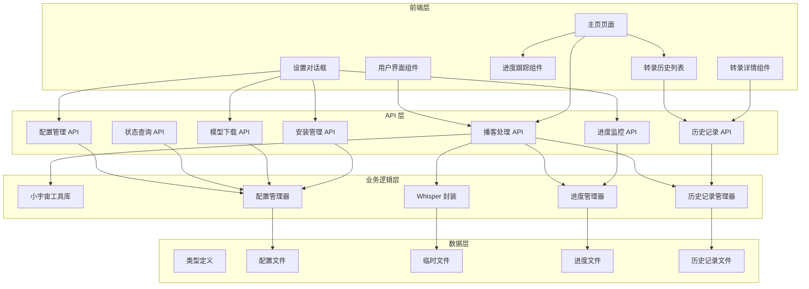
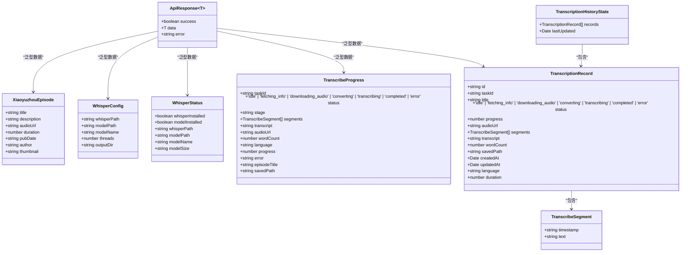
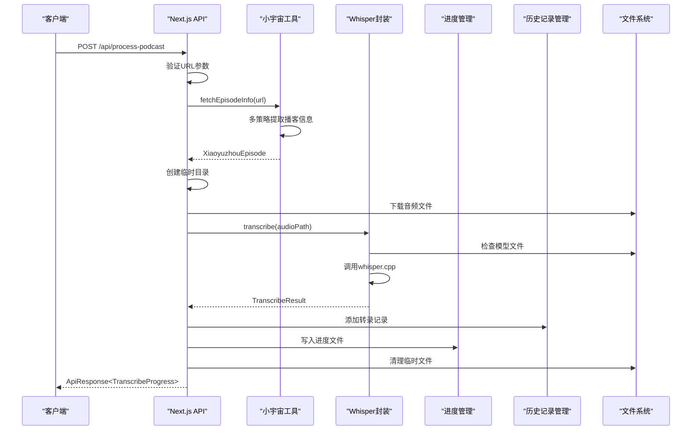
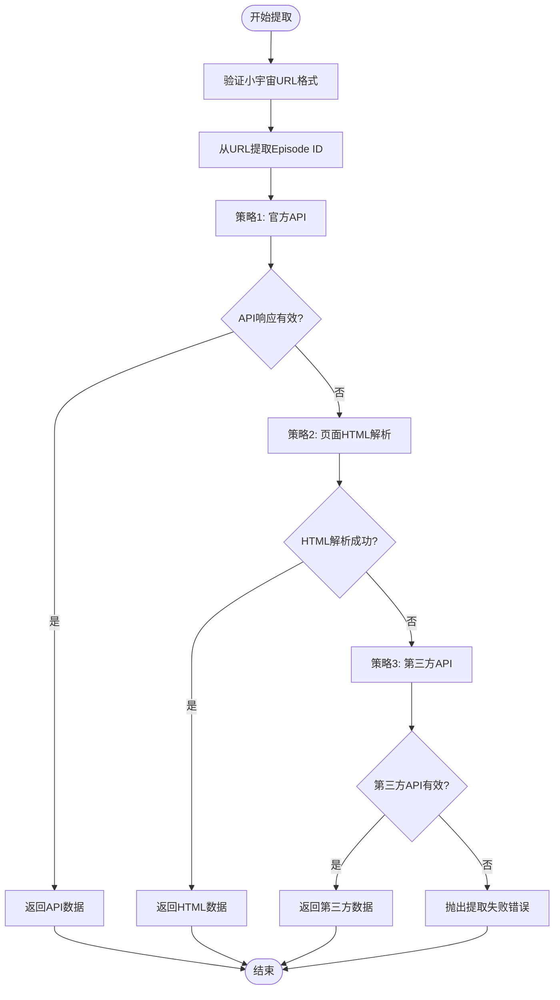
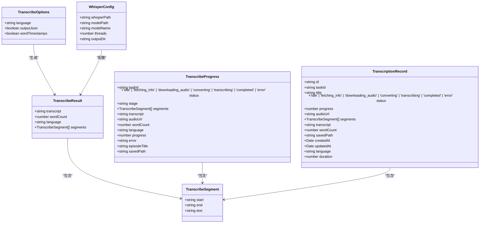
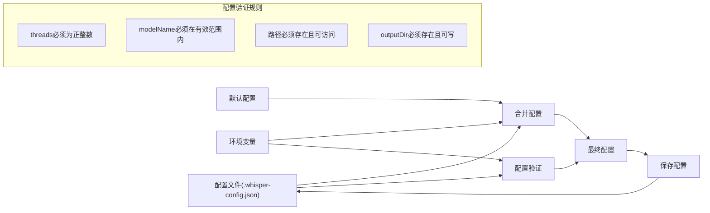
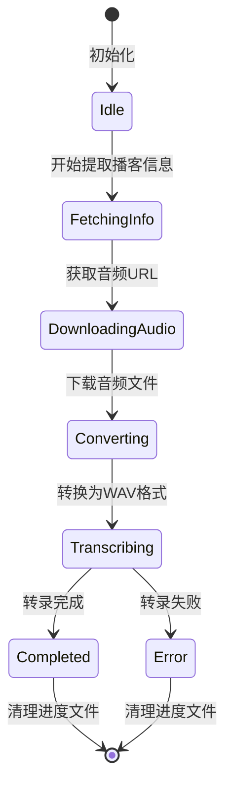
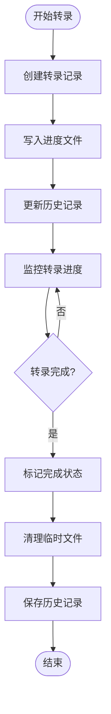
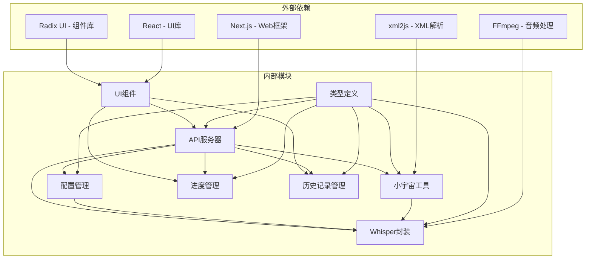

# 数据模型设计

<cite>
**本文档引用的文件**
- [src/types/index.ts](file://src/types/index.ts)
- [src/types/transcription-history.ts](file://src/types/transcription-history.ts)
- [src/lib/transcription-history.ts](file://src/lib/transcription-history.ts)
- [src/app/api/transcription-history/route.ts](file://src/app/api/transcription-history/route.ts)
- [src/components/transcription-card.tsx](file://src/components/transcription-card.tsx)
- [src/components/transcription-detail.tsx](file://src/components/transcription-detail.tsx)
- [src/app/transcriptions/page.tsx](file://src/app/transcriptions/page.tsx)
- [src/app/transcriptions/[id]/page.tsx](file://src/app/transcriptions/[id]/page.tsx)
- [src/lib/xiaoyuzhou.ts](file://src/lib/xiaoyuzhou.ts)
- [src/lib/whisper.ts](file://src/lib/whisper.ts)
- [src/lib/whisper-config.ts](file://src/lib/whisper-config.ts)
- [src/app/api/process-podcast/route.ts](file://src/app/api/process-podcast/route.ts)
- [src/app/api/transcribe-progress/route.ts](file://src/app/api/transcribe-progress/route.ts)
- [src/app/api/whisper-config/route.ts](file://src/app/api/whisper-config/route.ts)
- [src/app/api/whisper-status/route.ts](file://src/app/api/whisper-status/route.ts)
- [src/app/api/whisper-download/route.ts](file://src/app/api/whisper-download/route.ts)
- [src/app/api/whisper-download-progress/route.ts](file://src/app/api/whisper-download-progress/route.ts)
- [src/app/api/whisper-install/route.ts](file://src/app/api/whisper-install/route.ts)
- [src/app/api/whisper-install-progress/route.ts](file://src/app/api/whisper-install-progress/route.ts)
- [src/components/whisper-settings.tsx](file://src/components/whisper-settings.tsx)
- [src/app/page.tsx](file://src/app/page.tsx)
- [package.json](file://package.json)
</cite>

## 更新摘要
**变更内容**
- 新增 TranscriptionRecord 转录记录类型定义，包含完整的转录历史数据模型
- 新增 TranscriptionHistoryState 状态管理模型，支持转录历史的持久化存储
- 扩展转录数据模型，支持历史记录的创建、更新、查询和删除操作
- 完善转录历史的前端展示组件，包括列表视图和详情视图
- 增强转录进度跟踪的持久化机制，支持历史记录的长期存储

## 目录
1. [简介](#简介)
2. [项目结构](#项目结构)
3. [核心数据接口定义](#核心数据接口定义)
4. [架构概览](#架构概览)
5. [详细组件分析](#详细组件分析)
6. [依赖关系分析](#依赖关系分析)
7. [性能考虑](#性能考虑)
8. [故障排除指南](#故障排除指南)
9. [结论](#结论)

## 简介

MemoFlow 是一个基于 Next.js 的播客转录应用，集成了 Whisper 语音识别技术，能够自动从播客链接提取音频并进行语音转文字处理。本项目采用 TypeScript 进行类型安全开发，实现了完整的数据模型体系，包括播客数据模型、配置数据模型、转录结果数据模型、实时进度跟踪模型和转录历史记录模型。

**更新** 新增的 TranscriptionRecord 类型为应用提供了完整的转录历史管理能力，支持用户查看和管理之前的转录任务，增强了应用的实用性和用户体验。

## 项目结构

项目采用模块化组织结构，主要分为以下几个层次：

**图表来源**
- [src/app/page.tsx:1-441](file://src/app/page.tsx#L1-L441)
- [src/components/whisper-settings.tsx:1-664](file://src/components/whisper-settings.tsx#L1-L664)
- [src/lib/xiaoyuzhou.ts:1-219](file://src/lib/xiaoyuzhou.ts#L1-L219)
- [src/lib/transcription-history.ts:1-128](file://src/lib/transcription-history.ts#L1-L128)

**章节来源**
- [src/app/page.tsx:1-441](file://src/app/page.tsx#L1-L441)
- [src/components/whisper-settings.tsx:1-664](file://src/components/whisper-settings.tsx#L1-L664)
- [src/lib/transcription-history.ts:1-128](file://src/lib/transcription-history.ts#L1-L128)

## 核心数据接口定义

### ApiResponse<T> 通用响应模型

所有 API 响应都遵循统一的 ApiResponse 接口规范：

**图表来源**
- [src/types/index.ts:1-43](file://src/types/index.ts#L1-L43)
- [src/types/transcription-history.ts:1-23](file://src/types/transcription-history.ts#L1-L23)

### XiaoyuzhouEpisode 播客数据模型

播客数据模型定义了从小宇宙平台提取的播客信息结构：

| 字段名 | 类型 | 必填 | 描述 | 示例 |
|--------|------|------|------|------|
| title | string | 是 | 播客标题 | "人工智能与内容创作" |
| description | string | 是 | 播客描述 | "探讨AI在内容创作中的应用" |
| audioUrl | string | 是 | 音频文件URL | "https://example.com/audio.mp3" |
| duration | number | 否 | 播客时长（秒） | 1800 |
| pubDate | string | 否 | 发布日期 | "2024-01-15T10:30:00Z" |
| author | string | 是 | 作者信息 | "张三" |
| thumbnail | string | 否 | 缩略图URL | "https://example.com/thumb.jpg" |

### WhisperConfig 配置数据模型

Whisper 配置模型定义了语音识别的配置参数：

| 字段名 | 类型 | 必填 | 描述 | 默认值 |
|--------|------|------|------|--------|
| whisperPath | string | 是 | whisper.cpp 可执行文件路径 | "whisper.cpp/build/bin/whisper-cli" |
| modelPath | string | 是 | 模型文件路径 | "models/ggml-small.bin" |
| modelName | string | 是 | 模型名称 | "small" |
| threads | number | 是 | 线程数 | 4 |
| outputDir | string | 否 | 输出目录 | 用户文档目录 |

**更新** 新增 outputDir 字段，用于指定转录文件的输出目录

### WhisperStatus 状态数据模型

系统状态模型提供了 Whisper 组件的安装和配置状态：

| 字段名 | 类型 | 必填 | 描述 | 示例 |
|--------|------|------|------|------|
| whisperInstalled | boolean | 是 | whisper.cpp 是否已安装 | true |
| modelInstalled | boolean | 是 | 模型文件是否已安装 | false |
| whisperPath | string | 是 | whisper.cpp 路径 | "/usr/local/bin/whisper" |
| modelPath | string | 是 | 模型文件路径 | "/models/ggml-small.bin" |
| modelName | string | 是 | 模型名称 | "small" |
| modelSize | string | 是 | 模型文件大小 | "462 MB" |

### TranscribeSegment 转录分段模型

转录分段模型定义了单个转录片段的时间戳和文本内容：

| 字段名 | 类型 | 必填 | 描述 | 示例 |
|--------|------|------|------|------|
| timestamp | string | 是 | 时间戳范围，格式 "[HH:MM:SS.mmm --> HH:MM:SS.mmm]" | "[00:00:00.000 --> 00:00:05.000]" |
| text | string | 是 | 分段文本内容 | "这是一个转录片段" |

### TranscribeProgress 转录进度模型

转录进度模型定义了完整的转录过程状态跟踪：

| 字段名 | 类型 | 必填 | 描述 | 示例 |
|--------|------|------|------|------|
| taskId | string | 是 | 任务唯一标识符 | "1705324567_abc123" |
| status | enum | 是 | 任务状态 | "transcribing" |
| stage | string | 是 | 当前阶段描述 | "正在转录中..." |
| segments | TranscribeSegment[] | 否 | 实时分段列表 | [] |
| transcript | string | 否 | 完整转录文本 | "完整的转录内容" |
| audioUrl | string | 否 | 音频文件URL | "https://example.com/audio.mp3" |
| wordCount | number | 否 | 字数统计 | 1500 |
| language | string | 否 | 检测到的语言 | "zh" |
| progress | number | 否 | 转录进度百分比 | 75 |
| error | string | 否 | 错误信息 | "转录失败" |
| episodeTitle | string | 否 | 播客标题 | "播客节目标题" |
| savedPath | string | 否 | 保存路径 | "/path/to/saved/files" |

**更新** 新增完整的转录进度跟踪模型，支持实时状态更新和错误处理

### TranscriptionRecord 转录记录模型

转录记录模型定义了完整的转录历史数据结构，支持持久化存储：

| 字段名 | 类型 | 必填 | 描述 | 示例 |
|--------|------|------|------|------|
| id | string | 是 | 转录记录唯一ID | "task_1705324567_abc123" |
| taskId | string | 是 | 任务ID | "1705324567_abc123" |
| title | string | 是 | 播客标题 | "播客节目标题" |
| status | enum | 是 | 转录状态 | "completed" |
| progress | number \| null | 否 | 转录进度 (0-100) | 100 |
| audioUrl | string | 否 | 音频URL | "https://example.com/audio.mp3" |
| segments | TranscribeSegment[] | 否 | 已转录的片段 | [] |
| transcript | string | 否 | 完整转录文本 | "转录内容" |
| wordCount | number | 否 | 字数统计 | 1500 |
| savedPath | string | 否 | 文件保存路径 | "/path/to/saved/files" |
| createdAt | Date | 是 | 创建时间 | "2024-01-15T10:30:00Z" |
| updatedAt | Date | 是 | 最后更新时间 | "2024-01-15T11:45:00Z" |
| language | string | 否 | 检测到的语言 | "zh" |
| duration | number | 否 | 音频时长 | 1800 |

**新增** 完整的转录历史记录模型，支持状态枚举、进度跟踪、音频元数据和片段数组

### TranscriptionHistoryState 历史记录状态模型

历史记录状态模型定义了转录历史的管理结构：

| 字段名 | 类型 | 必填 | 描述 | 示例 |
|--------|------|------|------|------|
| records | TranscriptionRecord[] | 是 | 转录记录数组 | [] |
| lastUpdated | Date | 是 | 最后更新时间 | "2024-01-15T11:45:00Z" |

**新增** 历史记录状态管理模型，支持批量记录操作和时间戳管理

**章节来源**
- [src/types/index.ts:1-43](file://src/types/index.ts#L1-L43)
- [src/types/transcription-history.ts:1-23](file://src/types/transcription-history.ts#L1-L23)

## 架构概览

MemoFlow 采用分层架构设计，实现了清晰的职责分离和完整的数据流管理：

**图表来源**
- [src/app/api/process-podcast/route.ts:13-127](file://src/app/api/process-podcast/route.ts#L13-L127)
- [src/lib/xiaoyuzhou.ts:27-47](file://src/lib/xiaoyuzhou.ts#L27-L47)
- [src/lib/whisper.ts:54-156](file://src/lib/whisper.ts#L54-L156)
- [src/lib/transcription-history.ts:71-85](file://src/lib/transcription-history.ts#L71-L85)

## 详细组件分析

### 播客数据提取组件

小宇宙播客数据提取组件实现了多策略的音频链接获取机制：

**图表来源**
- [src/lib/xiaoyuzhou.ts:27-47](file://src/lib/xiaoyuzhou.ts#L27-L47)
- [src/lib/xiaoyuzhou.ts:52-89](file://src/lib/xiaoyuzhou.ts#L52-L89)
- [src/lib/xiaoyuzhou.ts:94-164](file://src/lib/xiaoyuzhou.ts#L94-L164)
- [src/lib/xiaoyuzhou.ts:169-197](file://src/lib/xiaoyuzhou.ts#L169-L197)

### Whisper 转录组件

Whisper 转录组件提供了完整的语音识别功能，支持实时进度跟踪：

**图表来源**
- [src/lib/whisper.ts:16-33](file://src/lib/whisper.ts#L16-L33)
- [src/lib/whisper.ts:22-27](file://src/lib/whisper.ts#L22-L27)
- [src/lib/whisper.ts:29-33](file://src/lib/whisper.ts#L29-L33)
- [src/types/transcription-history.ts:3-18](file://src/types/transcription-history.ts#L3-L18)

### 配置管理系统

配置管理系统实现了灵活的配置管理机制，支持环境变量覆盖：

**图表来源**
- [src/lib/whisper-config.ts:54-71](file://src/lib/whisper-config.ts#L54-L71)
- [src/app/api/whisper-config/route.ts:52-96](file://src/app/api/whisper-config/route.ts#L52-L96)

### 实时进度跟踪系统

实时进度跟踪系统提供了完整的转录过程可视化：

**图表来源**
- [src/app/api/transcribe-progress/route.ts:32-121](file://src/app/api/transcribe-progress/route.ts#L32-L121)
- [src/app/api/process-podcast/route.ts:216-382](file://src/app/api/process-podcast/route.ts#L216-L382)

### 转录历史管理系统

转录历史管理系统提供了完整的转录记录持久化和管理功能：

**图表来源**
- [src/lib/transcription-history.ts:71-85](file://src/lib/transcription-history.ts#L71-L85)
- [src/lib/transcription-history.ts:87-104](file://src/lib/transcription-history.ts#L87-L104)
- [src/lib/transcription-history.ts:106-114](file://src/lib/transcription-history.ts#L106-L114)

**章节来源**
- [src/lib/xiaoyuzhou.ts:1-219](file://src/lib/xiaoyuzhou.ts#L1-L219)
- [src/lib/whisper.ts:1-229](file://src/lib/whisper.ts#L1-L229)
- [src/lib/whisper-config.ts:1-108](file://src/lib/whisper-config.ts#L1-L108)
- [src/lib/transcription-history.ts:1-128](file://src/lib/transcription-history.ts#L1-L128)

## 依赖关系分析

项目的主要依赖关系如下：

**图表来源**
- [package.json:12-35](file://package.json#L12-L35)
- [src/lib/xiaoyuzhou.ts:3](file://src/lib/xiaoyuzhou.ts#L3)
- [src/lib/whisper.ts:4-6](file://src/lib/whisper.ts#L4-L6)
- [src/types/transcription-history.ts:1](file://src/types/transcription-history.ts#L1-L1)

**章节来源**
- [package.json:1-37](file://package.json#L1-L37)

## 性能考虑

### 数据流优化

1. **异步处理**: 所有 I/O 操作都采用异步方式，避免阻塞主线程
2. **流式下载**: 模型下载采用流式处理，支持大文件的渐进式下载
3. **缓存策略**: 配置文件采用内存缓存，减少磁盘 I/O 操作
4. **并发控制**: 支持多线程并行处理，提升转录效率
5. **进度文件管理**: 使用 JSON 文件存储转录进度，支持实时更新
6. **历史记录缓存**: 转录历史记录采用内存缓存，提升访问速度

### 内存管理

1. **临时文件清理**: 自动清理转录过程中的临时文件
2. **进度文件管理**: 使用 JSON 文件存储下载进度，避免内存泄漏
3. **流式处理**: 大文件处理采用流式方式，降低内存占用
4. **EventSource 连接管理**: 合理管理 SSE 连接，避免内存泄漏
5. **历史记录分页**: 支持历史记录的分页加载，避免大量数据一次性加载

### 网络优化

1. **超时控制**: 所有网络请求都设置了合理的超时时间
2. **重试机制**: 关键操作支持自动重试
3. **连接复用**: 复用 HTTP 连接，减少连接开销
4. **SSE 流式传输**: 使用 Server-Sent Events 实现实时进度更新
5. **历史记录增量更新**: 支持历史记录的增量更新，减少网络传输

### 存储优化

1. **历史记录文件**: 使用 JSON 文件存储转录历史，支持快速读写
2. **时间戳序列化**: 日期对象采用 ISO 字符串序列化，确保跨平台兼容
3. **文件路径管理**: 使用系统临时目录存储进度文件，避免权限问题
4. **历史记录压缩**: 支持历史记录的压缩存储，节省磁盘空间

## 故障排除指南

### 常见问题及解决方案

| 问题类型 | 症状 | 可能原因 | 解决方案 |
|----------|------|----------|----------|
| 配置错误 | 无法启动转录 | Whisper 路径或模型路径配置错误 | 检查配置文件和环境变量 |
| 网络超时 | 播客信息提取失败 | 网络连接不稳定 | 检查网络连接和代理设置 |
| 模型下载失败 | 模型文件缺失 | 下载被中断或权限不足 | 检查磁盘空间和文件权限 |
| 转录失败 | 语音识别无输出 | 系统资源不足 | 增加系统内存和CPU资源 |
| 进度跟踪失败 | 实时进度不更新 | SSE 连接断开 | 检查网络连接和防火墙设置 |
| 历史记录丢失 | 转录历史不可用 | 历史文件损坏或权限问题 | 检查文件权限和磁盘空间 |
| 历史记录加载慢 | 历史记录页面卡顿 | 历史记录过多导致性能问题 | 实现历史记录分页和懒加载 |

### 数据验证规则

1. **URL 格式验证**: 确保小宇宙链接格式正确
2. **文件存在性验证**: 检查 Whisper 可执行文件和模型文件是否存在
3. **配置参数验证**: 验证 threads 为正整数，modelName 在有效范围内
4. **磁盘空间验证**: 检查目标目录有足够的磁盘空间
5. **进度文件验证**: 确保进度文件格式正确且可读
6. **历史记录验证**: 验证转录记录的完整性，包括必需字段的存在性
7. **日期格式验证**: 确保日期字段采用正确的 ISO 格式存储

**章节来源**
- [src/app/api/whisper-config/route.ts:52-96](file://src/app/api/whisper-config/route.ts#L52-L96)
- [src/lib/whisper.ts:64-81](file://src/lib/whisper.ts#L64-L81)
- [src/lib/transcription-history.ts:23-49](file://src/lib/transcription-history.ts#L23-L49)

## 结论

MemoFlow 的数据模型设计体现了现代 Web 应用的最佳实践，具有以下特点：

1. **类型安全**: 全面使用 TypeScript，确保编译时类型检查
2. **模块化设计**: 清晰的模块边界和职责分离
3. **可扩展性**: 易于添加新的数据模型和业务逻辑
4. **健壮性**: 完善的错误处理和异常恢复机制
5. **性能优化**: 合理的异步处理和资源管理策略
6. **实时性**: 完整的进度跟踪和状态管理机制
7. **持久化**: 新增的转录历史记录模型支持长期数据存储
8. **用户体验**: 直观的进度可视化和状态反馈
9. **历史管理**: 完整的转录历史记录管理功能
10. **前后端协同**: 前端组件与后端 API 的紧密集成

**更新** 新增的 TranscriptionRecord 类型和相关的历史记录管理功能为应用提供了完整的转录历史管理能力，用户可以查看和管理之前的转录任务，增强了应用的实用性和用户体验。扩展的 WhisperConfig 和 WhisperStatus 则完善了系统的配置管理能力，支持更灵活的部署和使用场景。

该数据模型体系为后续的功能扩展和维护奠定了坚实的基础，开发者可以在此基础上轻松添加新的播客平台支持、改进转录算法、增强用户界面功能或扩展历史记录管理能力。新增的转录历史记录模型为应用的商业化和企业级应用提供了良好的基础架构支持。