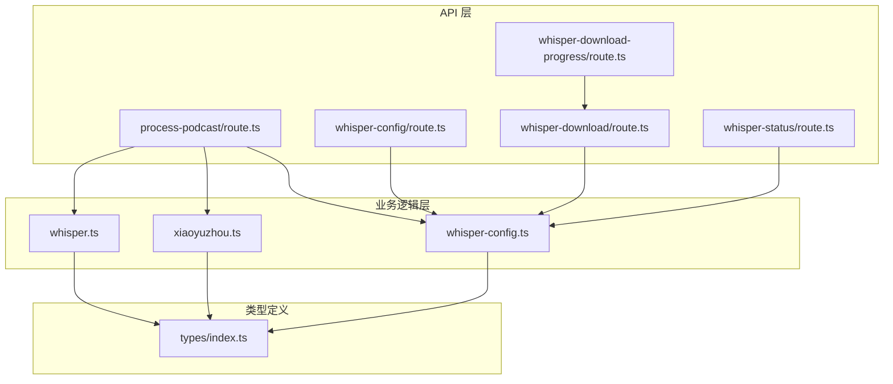
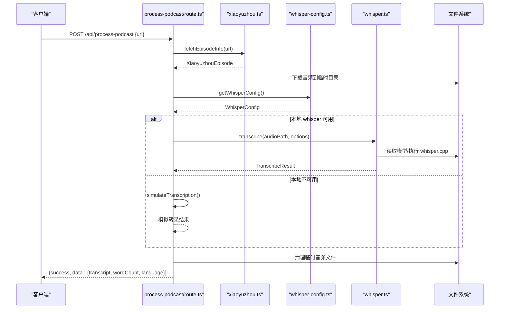
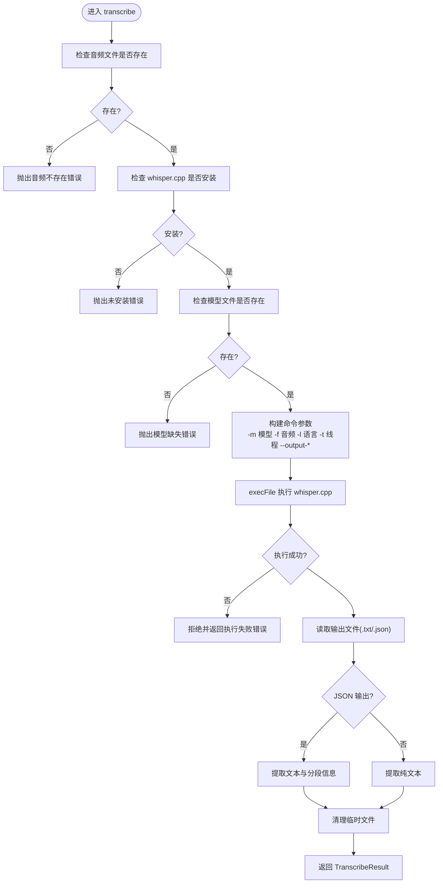
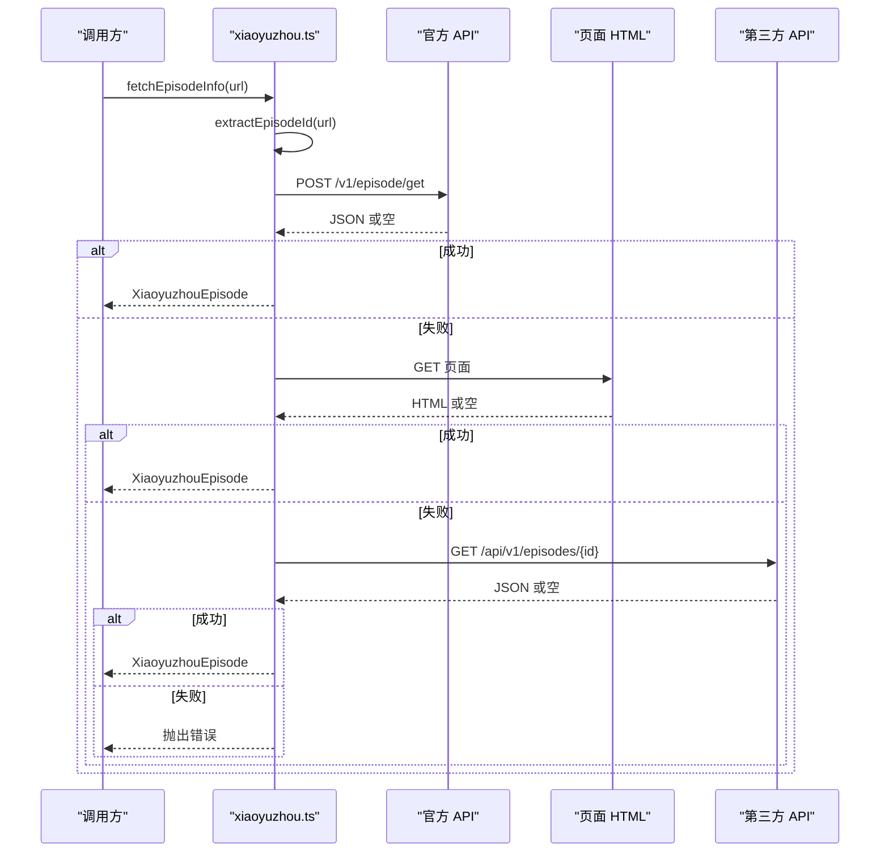
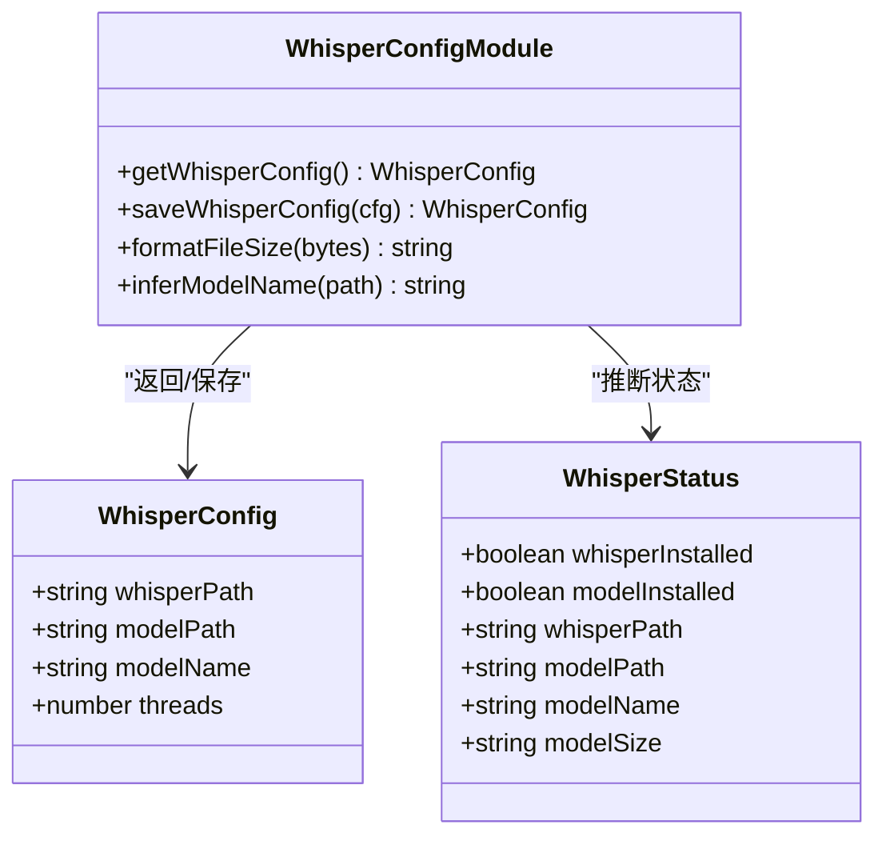
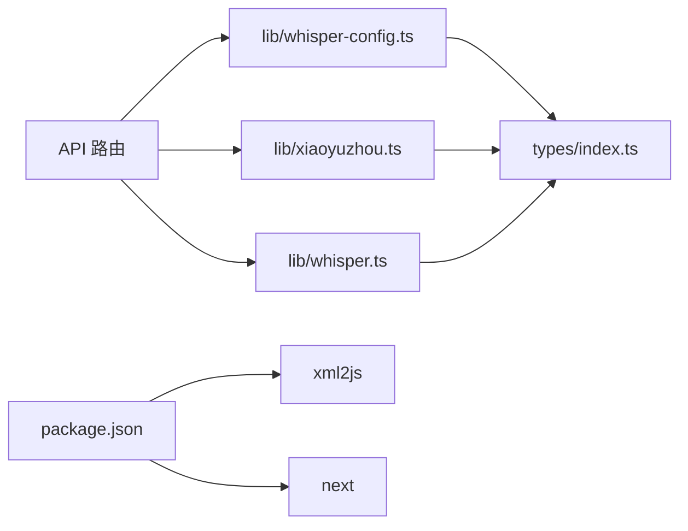

# 业务逻辑层

<cite>
**本文引用的文件列表**
- [whisper.ts](file://src/lib/whisper.ts)
- [xiaoyuzhou.ts](file://src/lib/xiaoyuzhou.ts)
- [whisper-config.ts](file://src/lib/whisper-config.ts)
- [process-podcast/route.ts](file://src/app/api/process-podcast/route.ts)
- [whisper-config/route.ts](file://src/app/api/whisper-config/route.ts)
- [whisper-download/route.ts](file://src/app/api/whisper-download/route.ts)
- [whisper-download-progress/route.ts](file://src/app/api/whisper-download-progress/route.ts)
- [whisper-status/route.ts](file://src/app/api/whisper-status/route.ts)
- [index.ts](file://src/types/index.ts)
- [package.json](file://package.json)
</cite>

## 目录
1. [简介](#简介)
2. [项目结构](#项目结构)
3. [核心组件](#核心组件)
4. [架构总览](#架构总览)
5. [详细组件分析](#详细组件分析)
6. [依赖关系分析](#依赖关系分析)
7. [性能与并发考虑](#性能与并发考虑)
8. [故障排查指南](#故障排查指南)
9. [结论](#结论)
10. [附录](#附录)

## 简介
本文件面向 MemoFlow 的业务逻辑层，系统性梳理并解释三大核心模块的设计与实现：
- Whisper 语音识别封装：负责本地 whisper.cpp 的调用、模型管理、转录结果解析与清理。
- 小宇宙 API 集成：负责从播客链接提取音频地址与元数据，提供多策略抓取能力。
- 配置管理：负责 Whisper 的路径、模型、线程数等配置的读取、保存与环境变量覆盖。

文档将从职责边界、接口设计、错误传播、数据传递机制、业务规则实现、模块交互序列图与关键算法流程等方面展开，并给出性能优化与并发处理建议。

## 项目结构
业务逻辑层主要位于 src/lib 与 src/app/api 下：
- src/lib：封装业务能力（Whisper、小宇宙、配置管理），供 API 层调用。
- src/app/api：暴露 HTTP 接口，协调外部输入与内部业务模块，组织端到端流程。
- src/types：定义统一的响应结构与业务实体类型。

图表来源
- [process-podcast/route.ts:1-127](file://src/app/api/process-podcast/route.ts#L1-L127)
- [whisper-config/route.ts:1-124](file://src/app/api/whisper-config/route.ts#L1-L124)
- [whisper-download/route.ts:1-235](file://src/app/api/whisper-download/route.ts#L1-L235)
- [whisper-download-progress/route.ts:1-139](file://src/app/api/whisper-download-progress/route.ts#L1-L139)
- [whisper-status/route.ts:1-60](file://src/app/api/whisper-status/route.ts#L1-L60)
- [whisper.ts:1-229](file://src/lib/whisper.ts#L1-L229)
- [xiaoyuzhou.ts:1-219](file://src/lib/xiaoyuzhou.ts#L1-L219)
- [whisper-config.ts:1-105](file://src/lib/whisper-config.ts#L1-L105)
- [index.ts:1-22](file://src/types/index.ts#L1-L22)

章节来源
- [process-podcast/route.ts:1-127](file://src/app/api/process-podcast/route.ts#L1-L127)
- [whisper-config/route.ts:1-124](file://src/app/api/whisper-config/route.ts#L1-L124)
- [whisper-download/route.ts:1-235](file://src/app/api/whisper-download/route.ts#L1-L235)
- [whisper-download-progress/route.ts:1-139](file://src/app/api/whisper-download-progress/route.ts#L1-L139)
- [whisper-status/route.ts:1-60](file://src/app/api/whisper-status/route.ts#L1-L60)
- [whisper.ts:1-229](file://src/lib/whisper.ts#L1-L229)
- [xiaoyuzhou.ts:1-219](file://src/lib/xiaoyuzhou.ts#L1-L219)
- [whisper-config.ts:1-105](file://src/lib/whisper-config.ts#L1-L105)
- [index.ts:1-22](file://src/types/index.ts#L1-L22)

## 核心组件
- Whisper 语音识别封装（src/lib/whisper.ts）
  - 负责：本地 whisper.cpp 可执行文件与模型文件的校验、命令构建、子进程执行、输出解析与临时文件清理。
  - 关键接口：transcribe、transcribeFast、checkWhisperInstalled、checkModelExists。
  - 数据结构：TranscribeOptions、TranscribeResult、TranscribeSegment。
- 小宇宙 API 集成（src/lib/xiaoyuzhou.ts）
  - 负责：从播客链接提取 episodeId，多策略抓取播客音频与元数据（官方 API、页面 HTML、第三方 API）。
  - 关键接口：fetchEpisodeInfo、extractEpisodeId。
  - 数据结构：XiaoyuzhouEpisode。
- 配置管理（src/lib/whisper-config.ts）
  - 负责：读取/保存 Whisper 配置，合并环境变量覆盖，格式化文件大小，推断模型名称。
  - 关键接口：getWhisperConfig、saveWhisperConfig、formatFileSize、inferModelName。
  - 数据结构：WhisperConfig、WhisperStatus。
- API 路由（src/app/api/*）
  - 负责：接收请求、参数校验、调用业务模块、组装响应、错误处理。
  - 关键路由：/api/process-podcast、/api/whisper-config、/api/whisper-download、/api/whisper-download-progress、/api/whisper-status。

章节来源
- [whisper.ts:1-229](file://src/lib/whisper.ts#L1-L229)
- [xiaoyuzhou.ts:1-219](file://src/lib/xiaoyuzhou.ts#L1-L219)
- [whisper-config.ts:1-105](file://src/lib/whisper-config.ts#L1-L105)
- [process-podcast/route.ts:1-127](file://src/app/api/process-podcast/route.ts#L1-L127)
- [whisper-config/route.ts:1-124](file://src/app/api/whisper-config/route.ts#L1-L124)
- [whisper-download/route.ts:1-235](file://src/app/api/whisper-download/route.ts#L1-L235)
- [whisper-download-progress/route.ts:1-139](file://src/app/api/whisper-download-progress/route.ts#L1-L139)
- [whisper-status/route.ts:1-60](file://src/app/api/whisper-status/route.ts#L1-L60)
- [index.ts:1-22](file://src/types/index.ts#L1-L22)

## 架构总览
业务逻辑层采用“API 路由协调 + 业务模块封装”的分层设计：
- API 层仅负责输入输出与流程编排，不直接处理复杂业务细节。
- 业务模块封装具体实现，提供稳定接口与清晰的数据契约。
- 类型定义统一了响应结构与实体字段，保证跨模块一致性。

图表来源
- [process-podcast/route.ts:13-114](file://src/app/api/process-podcast/route.ts#L13-L114)
- [xiaoyuzhou.ts:27-47](file://src/lib/xiaoyuzhou.ts#L27-L47)
- [whisper-config.ts:54-71](file://src/lib/whisper-config.ts#L54-L71)
- [whisper.ts:54-156](file://src/lib/whisper.ts#L54-L156)

## 详细组件分析

### Whisper 语音识别封装（src/lib/whisper.ts）
- 职责边界
  - 本地 whisper.cpp 的可用性检测与模型文件存在性检测。
  - 构建命令参数并异步执行 whisper.cpp，解析输出（纯文本或带时间戳 JSON），清理临时文件。
  - 提供快速转写接口，便于开发与测试。
- 接口设计
  - transcribe(audioPath, options): Promise<TranscribeResult>
    - 参数验证：音频文件存在性、whisper.cpp 安装、模型文件存在性。
    - 命令参数：模型路径、音频路径、语言、线程数、输出格式（JSON/文本）、词级时间戳。
    - 返回值：包含完整文本、字数、语言、可选分段信息。
  - transcribeFast(audioPath): Promise<TranscribeResult>
    - 使用 small 模型进行快速转写，若不存在则回退到默认模型。
  - 辅助函数：checkWhisperInstalled、checkModelExists、cleanupTempFiles、extractTextFromJson、extractSegmentsFromJson。
- 错误传播与异常处理
  - 文件不存在、whisper.cpp 未安装、模型缺失、执行失败、读取输出失败、JSON 解析失败等均抛出明确错误。
  - 调用方需捕获并返回统一的 API 响应结构。
- 性能与并发
  - 通过线程数参数控制并发度，合理设置以平衡吞吐与资源占用。
  - 输出文件清理在解析成功后进行，避免磁盘碎片与残留。

图表来源
- [whisper.ts:54-156](file://src/lib/whisper.ts#L54-L156)

章节来源
- [whisper.ts:1-229](file://src/lib/whisper.ts#L1-L229)

### 小宇宙 API 集成（src/lib/xiaoyuzhou.ts）
- 职责边界
  - 从播客链接中提取 episodeId。
  - 多策略抓取播客音频与元数据：官方 API、页面 HTML（__NEXT_DATA__、meta og:audio、页面内链接）、第三方 API。
- 接口设计
  - fetchEpisodeInfo(episodeUrl): Promise<XiaoyuzhouEpisode>
    - 输入：播客页面 URL。
    - 输出：包含标题、描述、音频 URL、时长、发布时间、作者、封面等字段的对象。
    - 失败：当所有策略均失败时抛出错误。
  - 辅助函数：extractEpisodeId、fetchFromOfficialApi、fetchFromPageHtml、fetchFromThirdPartyApi、parseDuration。
- 错误传播与异常处理
  - 各策略独立 try/catch，失败时记录日志并继续下一个策略。
  - 最终若仍无法获取音频 URL，则抛出统一错误。
- 数据契约
  - XiaoyuzhouEpisode：标准化播客元数据结构，便于上层统一消费。

图表来源
- [xiaoyuzhou.ts:27-47](file://src/lib/xiaoyuzhou.ts#L27-L47)
- [xiaoyuzhou.ts:52-89](file://src/lib/xiaoyuzhou.ts#L52-L89)
- [xiaoyuzhou.ts:94-164](file://src/lib/xiaoyuzhou.ts#L94-L164)
- [xiaoyuzhou.ts:169-197](file://src/lib/xiaoyuzhou.ts#L169-L197)

章节来源
- [xiaoyuzhou.ts:1-219](file://src/lib/xiaoyuzhou.ts#L1-L219)

### 配置管理（src/lib/whisper-config.ts）
- 职责边界
  - 读取/保存 Whisper 配置文件，合并环境变量覆盖，格式化文件大小，推断模型名称。
- 接口设计
  - getWhisperConfig(): WhisperConfig
    - 默认值：whisperPath、modelPath、modelName、threads。
    - 优先级：环境变量 > 保存的配置 > 默认值。
  - saveWhisperConfig(config): WhisperConfig
    - 保存到 .whisper-config.json（不含环境变量），返回合并后的配置。
  - 辅助函数：formatFileSize、inferModelName、mergeWithEnv。
- 错误传播与异常处理
  - 文件读取/写入异常会被捕获并记录日志，必要时抛出错误。
- 与 API 层集成
  - /api/whisper-config 路由负责参数校验与调用配置管理模块，返回统一响应结构。

图表来源
- [whisper-config.ts:12-17](file://src/lib/whisper-config.ts#L12-L17)
- [whisper-config.ts:54-89](file://src/lib/whisper-config.ts#L54-L89)
- [index.ts:7-22](file://src/types/index.ts#L7-L22)

章节来源
- [whisper-config.ts:1-105](file://src/lib/whisper-config.ts#L1-L105)
- [index.ts:1-22](file://src/types/index.ts#L1-L22)

### API 路由与业务编排
- /api/process-podcast（src/app/api/process-podcast/route.ts）
  - 输入：播客链接 URL。
  - 流程：提取播客信息 -> 下载音频到临时目录 -> 读取配置 -> 调用 Whisper 转录 -> 清理临时文件 -> 统一响应。
  - 异常：参数缺失、下载失败、执行失败、读取失败等均返回统一错误结构。
- /api/whisper-config（src/app/api/whisper-config/route.ts）
  - GET：返回合并后的配置。
  - POST：校验请求体、字段完整性、线程数与模型名合法性 -> 保存配置 -> 返回合并后的配置。
- /api/whisper-download（src/app/api/whisper-download/route.ts）
  - 触发模型下载（small/medium），后台异步下载，写入进度文件，完成后更新配置。
- /api/whisper-download-progress（src/app/api/whisper-download-progress/route.ts）
  - SSE 推送下载进度，按秒轮询读取进度文件，完成或出错后关闭连接。
- /api/whisper-status（src/app/api/whisper-status/route.ts）
  - 返回 whisper.cpp 与模型的安装状态、路径、模型大小与推断名称。

章节来源
- [process-podcast/route.ts:1-127](file://src/app/api/process-podcast/route.ts#L1-L127)
- [whisper-config/route.ts:1-124](file://src/app/api/whisper-config/route.ts#L1-L124)
- [whisper-download/route.ts:1-235](file://src/app/api/whisper-download/route.ts#L1-L235)
- [whisper-download-progress/route.ts:1-139](file://src/app/api/whisper-download-progress/route.ts#L1-L139)
- [whisper-status/route.ts:1-60](file://src/app/api/whisper-status/route.ts#L1-L60)

## 依赖关系分析
- 模块耦合与内聚
  - API 层与业务模块通过清晰的接口解耦，内聚于各自职责。
  - 业务模块之间无直接耦合，通过类型定义与统一响应结构进行间接协作。
- 外部依赖
  - xml2js：用于解析页面 HTML 中的 JSON 数据。
  - child_process：用于执行 whisper.cpp。
  - fs/fs/promises：用于文件读写、目录操作与进度文件管理。
  - Next.js API 路由：提供 HTTP 接口与响应封装。
- 潜在循环依赖
  - 当前结构无循环依赖，类型定义位于独立文件，避免相互导入问题。

图表来源
- [package.json:12-35](file://package.json#L12-L35)
- [xiaoyuzhou.ts](file://src/lib/xiaoyuzhou.ts#L3)
- [whisper.ts:4-6](file://src/lib/whisper.ts#L4-L6)
- [whisper-config.ts:4-6](file://src/lib/whisper-config.ts#L4-L6)
- [index.ts:1-22](file://src/types/index.ts#L1-L22)

章节来源
- [package.json:1-37](file://package.json#L1-L37)
- [xiaoyuzhou.ts:1-219](file://src/lib/xiaoyuzhou.ts#L1-L219)
- [whisper.ts:1-229](file://src/lib/whisper.ts#L1-L229)
- [whisper-config.ts:1-105](file://src/lib/whisper-config.ts#L1-L105)
- [index.ts:1-22](file://src/types/index.ts#L1-L22)

## 性能与并发考虑
- 并发与资源控制
  - Whisper 线程数通过环境变量或配置控制，建议根据 CPU 核心数与内存情况调整，避免过度并发导致资源争用。
  - 模型下载采用流式读取与定期进度写入，减少频繁 IO 与内存峰值。
- I/O 优化
  - 临时文件在解析成功后立即清理，避免磁盘空间浪费。
  - 下载进度文件采用 JSON 存储，读取简单高效。
- 错误恢复
  - Whisper 执行失败时降级为模拟转录，保证服务可用性。
  - 多策略抓取提升小宇宙音频提取成功率，降低单点依赖风险。
- SSE 推送
  - 下载进度通过 SSE 推送，客户端可实时感知状态变化，避免轮询带来的额外负载。

[本节为通用性能指导，无需特定文件引用]

## 故障排查指南
- Whisper 相关
  - 未安装 whisper.cpp：检查可执行文件路径与权限，确保环境变量或配置正确。
  - 模型文件缺失：触发模型下载或手动放置模型文件，确认路径与文件名。
  - 执行失败：查看 stderr 日志，确认命令参数与线程数设置。
- 小宇宙抓取
  - 链接格式错误：确认包含 /episode/ 路径且为有效 ID。
  - 网络超时/解析失败：检查网络连通性与第三方 API 可用性，查看日志中的错误信息。
- 配置管理
  - 配置文件读取失败：检查文件权限与 JSON 格式，必要时删除损坏文件。
  - 环境变量覆盖：确认环境变量命名与取值范围符合预期。
- 下载进度
  - 进度文件损坏：删除 .download-progress.json 后重新触发下载。
  - SSE 连接中断：检查客户端网络与服务器日志，确认连接未被中间件拦截。

章节来源
- [whisper.ts:64-81](file://src/lib/whisper.ts#L64-L81)
- [xiaoyuzhou.ts:30-32](file://src/lib/xiaoyuzhou.ts#L30-L32)
- [whisper-config.ts:55-70](file://src/lib/whisper-config.ts#L55-L70)
- [whisper-download/route.ts:42-47](file://src/app/api/whisper-download/route.ts#L42-L47)
- [whisper-download-progress/route.ts:18-37](file://src/app/api/whisper-download-progress/route.ts#L18-L37)

## 结论
MemoFlow 的业务逻辑层通过清晰的模块划分与稳定的接口契约，实现了从播客链接到转录结果的完整链路。Whisper 封装提供了可靠的本地转录能力与降级策略；小宇宙集成具备多策略抓取的鲁棒性；配置管理确保了部署灵活性与一致性。API 层作为编排者，将这些能力整合为统一的服务接口，便于前端与外部系统消费。

[本节为总结性内容，无需特定文件引用]

## 附录
- 统一响应结构
  - ApiResponse<T>：包含 success、data、error 字段，便于前后端一致处理。
- 关键数据模型
  - WhisperConfig：whisperPath、modelPath、modelName、threads。
  - WhisperStatus：whisperInstalled、modelInstalled、whisperPath、modelPath、modelName、modelSize。
  - XiaoyuzhouEpisode：title、description、audioUrl、duration、pubDate、author、thumbnail。
  - TranscribeResult：transcript、wordCount、language、segments（可选）。
  - TranscribeSegment：start、end、text。

章节来源
- [index.ts:1-22](file://src/types/index.ts#L1-L22)