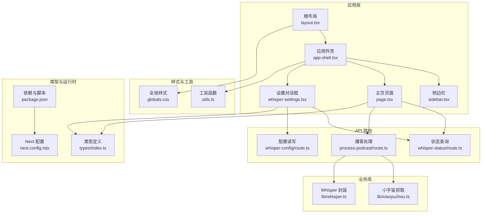
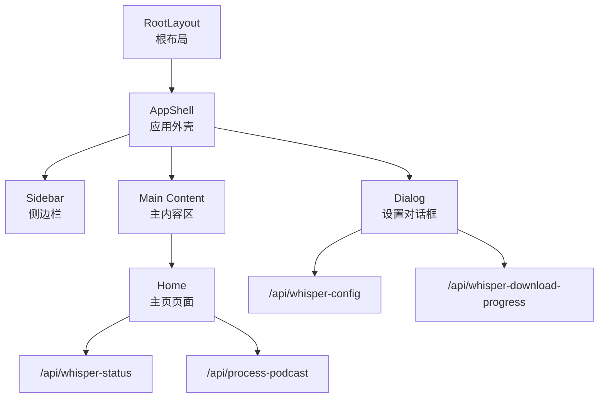
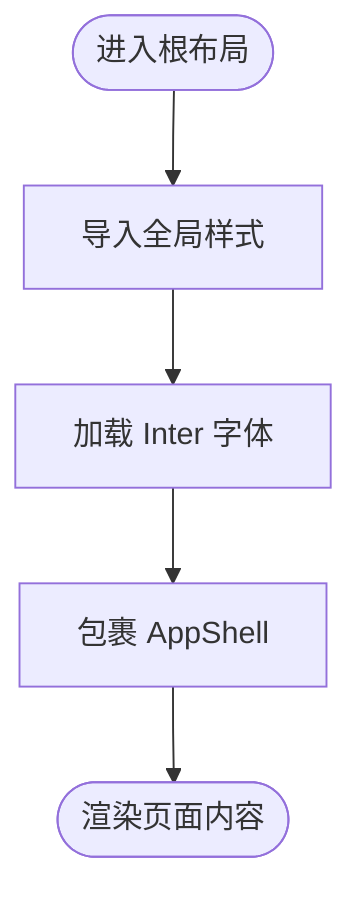
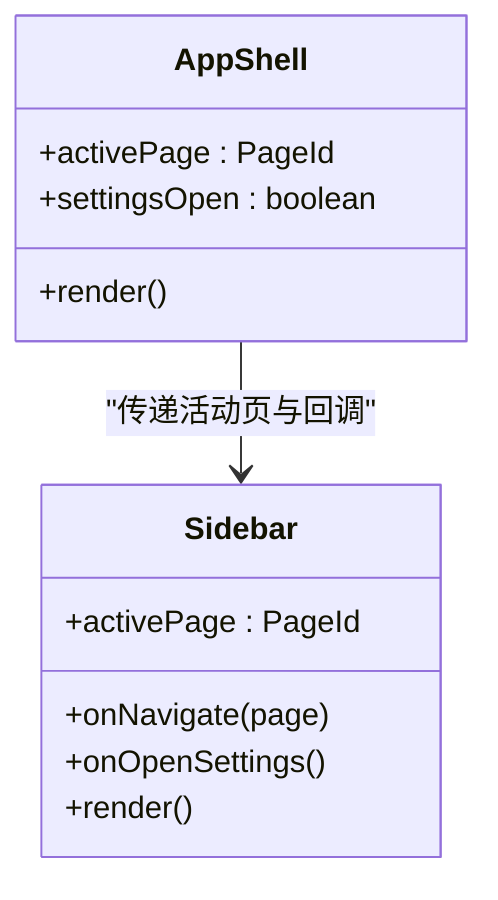
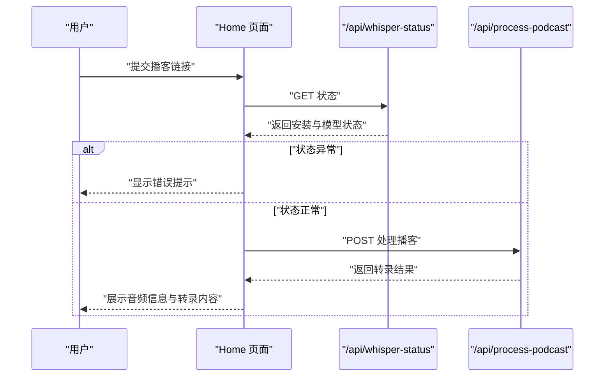
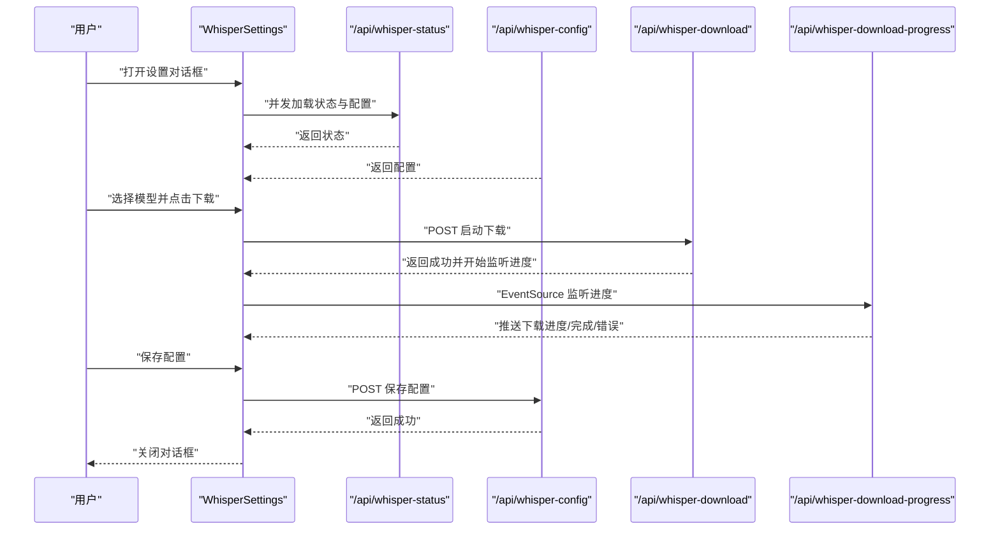
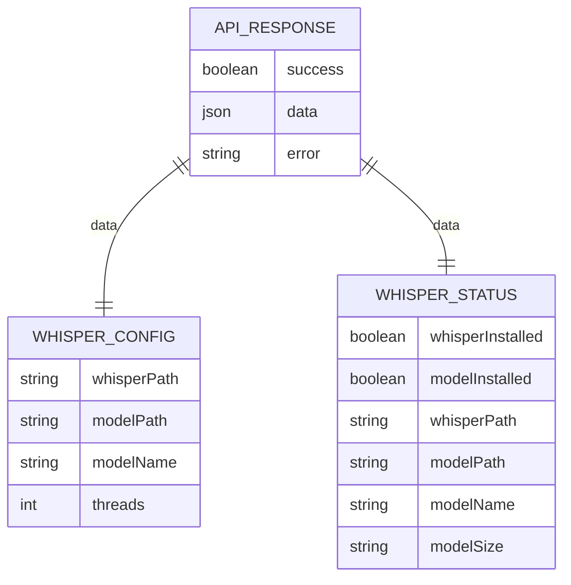
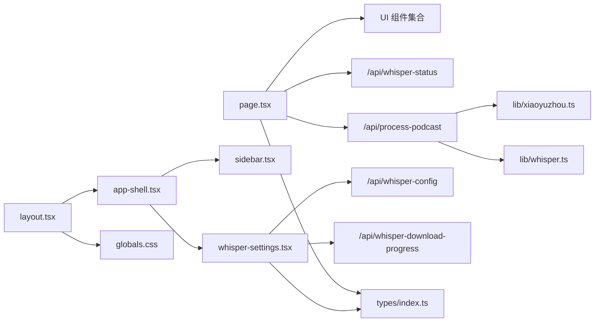

# 应用层架构

<cite>
**本文引用的文件**
- [src/app/layout.tsx](file://src/app/layout.tsx)
- [src/app/page.tsx](file://src/app/page.tsx)
- [src/components/app-shell.tsx](file://src/components/app-shell.tsx)
- [src/components/sidebar.tsx](file://src/components/sidebar.tsx)
- [src/components/whisper-settings.tsx](file://src/components/whisper-settings.tsx)
- [src/styles/globals.css](file://src/styles/globals.css)
- [src/lib/utils.ts](file://src/lib/utils.ts)
- [src/lib/whisper.ts](file://src/lib/whisper.ts)
- [src/lib/xiaoyuzhou.ts](file://src/lib/xiaoyuzhou.ts)
- [src/types/index.ts](file://src/types/index.ts)
- [src/app/api/whisper-status/route.ts](file://src/app/api/whisper-status/route.ts)
- [src/app/api/whisper-config/route.ts](file://src/app/api/whisper-config/route.ts)
- [src/app/api/process-podcast/route.ts](file://src/app/api/process-podcast/route.ts)
- [package.json](file://package.json)
- [next.config.mjs](file://next.config.mjs)
</cite>

## 目录
1. [引言](#引言)
2. [项目结构](#项目结构)
3. [核心组件](#核心组件)
4. [架构总览](#架构总览)
5. [组件详解](#组件详解)
6. [依赖关系分析](#依赖关系分析)
7. [性能与水合](#性能与水合)
8. [故障排查指南](#故障排查指南)
9. [结论](#结论)

## 引言
本文件系统性梳理 MemoFlow 的应用层架构，聚焦 Next.js 应用层设计模式，包括页面路由、布局组件与客户端组件的组织结构；阐明根布局如何协调全局样式、字体加载与应用外壳；解释页面组件的职责、状态管理与用户交互；阐述应用外壳与侧边栏导航、响应式布局及设置对话框的协作；并给出组件层次结构图、数据流向示例以及客户端水合与性能优化策略。

## 项目结构
MemoFlow 采用 Next.js App Router 的目录约定，应用层关键文件分布如下：
- 根布局与页面：src/app/layout.tsx、src/app/page.tsx
- 应用外壳与导航：src/components/app-shell.tsx、src/components/sidebar.tsx
- 设置对话框：src/components/whisper-settings.tsx
- 全局样式与工具：src/styles/globals.css、src/lib/utils.ts
- 类型定义：src/types/index.ts
- API 路由：src/app/api/...（状态查询、配置读写、播客处理）
- 运行时配置：package.json、next.config.mjs

图表来源
- [src/app/layout.tsx:1-32](file://src/app/layout.tsx#L1-L32)
- [src/app/page.tsx:1-243](file://src/app/page.tsx#L1-L243)
- [src/components/app-shell.tsx:1-30](file://src/components/app-shell.tsx#L1-L30)
- [src/components/sidebar.tsx:1-214](file://src/components/sidebar.tsx#L1-L214)
- [src/components/whisper-settings.tsx:1-468](file://src/components/whisper-settings.tsx#L1-L468)
- [src/styles/globals.css:1-106](file://src/styles/globals.css#L1-L106)
- [src/lib/utils.ts:1-13](file://src/lib/utils.ts#L1-L13)
- [src/types/index.ts:1-22](file://src/types/index.ts#L1-L22)
- [src/app/api/whisper-status/route.ts:1-60](file://src/app/api/whisper-status/route.ts#L1-L60)
- [src/app/api/whisper-config/route.ts:1-124](file://src/app/api/whisper-config/route.ts#L1-L124)
- [src/app/api/process-podcast/route.ts:1-127](file://src/app/api/process-podcast/route.ts#L1-L127)
- [src/lib/whisper.ts:1-229](file://src/lib/whisper.ts#L1-L229)
- [src/lib/xiaoyuzhou.ts:1-219](file://src/lib/xiaoyuzhou.ts#L1-L219)
- [package.json:1-37](file://package.json#L1-L37)
- [next.config.mjs:1-12](file://next.config.mjs#L1-L12)

章节来源
- [src/app/layout.tsx:1-32](file://src/app/layout.tsx#L1-L32)
- [src/app/page.tsx:1-243](file://src/app/page.tsx#L1-L243)
- [src/components/app-shell.tsx:1-30](file://src/components/app-shell.tsx#L1-L30)
- [src/components/sidebar.tsx:1-214](file://src/components/sidebar.tsx#L1-L214)
- [src/components/whisper-settings.tsx:1-468](file://src/components/whisper-settings.tsx#L1-L468)
- [src/styles/globals.css:1-106](file://src/styles/globals.css#L1-L106)
- [src/lib/utils.ts:1-13](file://src/lib/utils.ts#L1-L13)
- [src/types/index.ts:1-22](file://src/types/index.ts#L1-L22)
- [src/app/api/whisper-status/route.ts:1-60](file://src/app/api/whisper-status/route.ts#L1-L60)
- [src/app/api/whisper-config/route.ts:1-124](file://src/app/api/whisper-config/route.ts#L1-L124)
- [src/app/api/process-podcast/route.ts:1-127](file://src/app/api/process-podcast/route.ts#L1-L127)
- [src/lib/whisper.ts:1-229](file://src/lib/whisper.ts#L1-L229)
- [src/lib/xiaoyuzhou.ts:1-219](file://src/lib/xiaoyuzhou.ts#L1-L219)
- [package.json:1-37](file://package.json#L1-L37)
- [next.config.mjs:1-12](file://next.config.mjs#L1-L12)

## 核心组件
- 根布局 RootLayout：负责注入全局样式、字体、语言属性，并包裹应用外壳 AppShell，形成全局容器。
- 应用外壳 AppShell：承载侧边栏导航与主内容区，统一管理活动页与设置对话框的开关。
- 侧边栏 Sidebar：提供桌面端固定侧栏与移动端抽屉式菜单，支持导航与底部操作入口。
- 主页页面 Home：负责播客转录流程的状态管理、表单提交、结果展示与用户交互。
- 设置对话框 WhisperSettings：集中管理 Whisper.cpp 安装状态、模型下载与配置保存，支持 SSE 进度跟踪。
- 全局样式 globals.css：基于 Tailwind 层次定义明暗主题变量与基础样式，配合 cn 合并类名工具。
- 类型定义 types/index.ts：统一 API 响应结构与 Whisper 配置/状态接口。
- API 路由：提供状态查询、配置读写、播客处理等后端能力。

章节来源
- [src/app/layout.tsx:14-31](file://src/app/layout.tsx#L14-L31)
- [src/components/app-shell.tsx:11-29](file://src/components/app-shell.tsx#L11-L29)
- [src/components/sidebar.tsx:37-211](file://src/components/sidebar.tsx#L37-L211)
- [src/app/page.tsx:13-242](file://src/app/page.tsx#L13-L242)
- [src/components/whisper-settings.tsx:56-467](file://src/components/whisper-settings.tsx#L56-L467)
- [src/styles/globals.css:5-106](file://src/styles/globals.css#L5-L106)
- [src/types/index.ts:1-22](file://src/types/index.ts#L1-L22)

## 架构总览
应用层采用“根布局 + 应用外壳 + 页面”的三层结构：
- 根布局负责全局 HTML 结构、字体与样式注入，确保主题一致性与可访问性。
- 应用外壳承担导航与内容区布局，将页面内容与侧边栏、设置对话框解耦。
- 页面组件聚焦业务逻辑（播客转录），通过 API 路由与业务库完成数据获取与处理。
- 设置对话框独立于页面，通过 API 路由与 SSE 实时反馈下载进度，避免阻塞主流程。

图表来源
- [src/app/layout.tsx:14-31](file://src/app/layout.tsx#L14-L31)
- [src/components/app-shell.tsx:11-29](file://src/components/app-shell.tsx#L11-L29)
- [src/components/sidebar.tsx:37-211](file://src/components/sidebar.tsx#L37-L211)
- [src/app/page.tsx:13-242](file://src/app/page.tsx#L13-L242)
- [src/components/whisper-settings.tsx:56-467](file://src/components/whisper-settings.tsx#L56-L467)
- [src/app/api/whisper-status/route.ts:11-59](file://src/app/api/whisper-status/route.ts#L11-L59)
- [src/app/api/process-podcast/route.ts:13-127](file://src/app/api/process-podcast/route.ts#L13-L127)
- [src/app/api/whisper-config/route.ts:10-123](file://src/app/api/whisper-config/route.ts#L10-L123)

## 组件详解

### 根布局 RootLayout
- 负责注入全局样式与字体，设置语言属性与主题变量。
- 通过 AppShell 包裹子组件，形成统一的应用外壳容器。
- 使用 cn 合并类名，确保样式可组合与可维护。

图表来源
- [src/app/layout.tsx:14-31](file://src/app/layout.tsx#L14-L31)
- [src/styles/globals.css:1-106](file://src/styles/globals.css#L1-L106)
- [src/lib/utils.ts:4-6](file://src/lib/utils.ts#L4-L6)

章节来源
- [src/app/layout.tsx:14-31](file://src/app/layout.tsx#L14-L31)
- [src/styles/globals.css:5-106](file://src/styles/globals.css#L5-L106)
- [src/lib/utils.ts:4-6](file://src/lib/utils.ts#L4-L6)

### 应用外壳 AppShell 与侧边栏 Sidebar
- AppShell 统一管理活动页与设置对话框开关，主内容区在桌面端预留侧栏宽度。
- Sidebar 支持桌面端固定侧栏与移动端抽屉式菜单，提供导航项与底部操作入口。
- 侧边栏菜单项包含“首页”“播客转录”“内容解析”“知识库”，部分功能暂未开放。

图表来源
- [src/components/app-shell.tsx:11-29](file://src/components/app-shell.tsx#L11-L29)
- [src/components/sidebar.tsx:37-211](file://src/components/sidebar.tsx#L37-L211)

章节来源
- [src/components/app-shell.tsx:11-29](file://src/components/app-shell.tsx#L11-L29)
- [src/components/sidebar.tsx:37-211](file://src/components/sidebar.tsx#L37-L211)

### 主页页面 Home：播客转录流程
- 状态管理：URL 输入、加载状态、转录结果、音频信息。
- 交互流程：校验链接、检查 Whisper 状态、调用处理 API、展示结果与复制功能。
- UI 组成：卡片、输入框、按钮、标签页、分隔符、徽章与音频控件。

图表来源
- [src/app/page.tsx:23-87](file://src/app/page.tsx#L23-L87)
- [src/app/api/whisper-status/route.ts:11-59](file://src/app/api/whisper-status/route.ts#L11-L59)
- [src/app/api/process-podcast/route.ts:13-127](file://src/app/api/process-podcast/route.ts#L13-L127)

章节来源
- [src/app/page.tsx:13-242](file://src/app/page.tsx#L13-L242)
- [src/app/api/whisper-status/route.ts:11-59](file://src/app/api/whisper-status/route.ts#L11-L59)
- [src/app/api/process-podcast/route.ts:13-127](file://src/app/api/process-podcast/route.ts#L13-L127)

### 设置对话框 WhisperSettings：模型与配置
- 功能：查询 Whisper 状态、选择模型、下载模型（含 SSE 进度）、保存配置、高级设置。
- 数据流：打开对话框时并行加载状态与配置；下载时建立 SSE 连接；保存配置后关闭对话框。
- 错误处理：统一错误提示与加载状态，保证用户体验。

图表来源
- [src/components/whisper-settings.tsx:75-154](file://src/components/whisper-settings.tsx#L75-L154)
- [src/app/api/whisper-status/route.ts:11-59](file://src/app/api/whisper-status/route.ts#L11-L59)
- [src/app/api/whisper-config/route.ts:10-123](file://src/app/api/whisper-config/route.ts#L10-L123)
- [src/app/api/process-podcast/route.ts:13-127](file://src/app/api/process-podcast/route.ts#L13-L127)

章节来源
- [src/components/whisper-settings.tsx:56-467](file://src/components/whisper-settings.tsx#L56-L467)
- [src/app/api/whisper-status/route.ts:11-59](file://src/app/api/whisper-status/route.ts#L11-L59)
- [src/app/api/whisper-config/route.ts:10-123](file://src/app/api/whisper-config/route.ts#L10-L123)

### 数据模型与类型
- ApiResponse：统一的 API 响应结构，包含 success/data/error 字段。
- WhisperConfig：Whisper 配置对象，包含路径、模型名与线程数。
- WhisperStatus：Whisper 状态对象，包含安装状态、模型大小与路径等。

图表来源
- [src/types/index.ts:1-22](file://src/types/index.ts#L1-L22)

章节来源
- [src/types/index.ts:1-22](file://src/types/index.ts#L1-L22)

## 依赖关系分析
- 组件依赖：page.tsx 依赖 UI 组件与业务库；app-shell 依赖 sidebar 与 whisper-settings；layout 依赖 app-shell 与全局样式。
- API 依赖：page 与 whisper-settings 通过 fetch 调用 API 路由；API 路由依赖业务库（xiaoyuzhou、whisper）。
- 运行时依赖：Next.js、React、Tailwind CSS、lucide-react、Radix UI 等。

图表来源
- [src/app/page.tsx:1-243](file://src/app/page.tsx#L1-L243)
- [src/components/app-shell.tsx:1-30](file://src/components/app-shell.tsx#L1-L30)
- [src/components/sidebar.tsx:1-214](file://src/components/sidebar.tsx#L1-L214)
- [src/components/whisper-settings.tsx:1-468](file://src/components/whisper-settings.tsx#L1-L468)
- [src/app/layout.tsx:1-32](file://src/app/layout.tsx#L1-L32)
- [src/styles/globals.css:1-106](file://src/styles/globals.css#L1-L106)
- [src/types/index.ts:1-22](file://src/types/index.ts#L1-L22)
- [src/app/api/whisper-status/route.ts:1-60](file://src/app/api/whisper-status/route.ts#L1-L60)
- [src/app/api/whisper-config/route.ts:1-124](file://src/app/api/whisper-config/route.ts#L1-L124)
- [src/app/api/process-podcast/route.ts:1-127](file://src/app/api/process-podcast/route.ts#L1-L127)
- [src/lib/xiaoyuzhou.ts:1-219](file://src/lib/xiaoyuzhou.ts#L1-L219)
- [src/lib/whisper.ts:1-229](file://src/lib/whisper.ts#L1-L229)

章节来源
- [src/app/page.tsx:1-243](file://src/app/page.tsx#L1-L243)
- [src/components/app-shell.tsx:1-30](file://src/components/app-shell.tsx#L1-L30)
- [src/components/sidebar.tsx:1-214](file://src/components/sidebar.tsx#L1-L214)
- [src/components/whisper-settings.tsx:1-468](file://src/components/whisper-settings.tsx#L1-L468)
- [src/app/layout.tsx:1-32](file://src/app/layout.tsx#L1-L32)
- [src/styles/globals.css:1-106](file://src/styles/globals.css#L1-L106)
- [src/types/index.ts:1-22](file://src/types/index.ts#L1-L22)
- [src/app/api/whisper-status/route.ts:1-60](file://src/app/api/whisper-status/route.ts#L1-L60)
- [src/app/api/whisper-config/route.ts:1-124](file://src/app/api/whisper-config/route.ts#L1-L124)
- [src/app/api/process-podcast/route.ts:1-127](file://src/app/api/process-podcast/route.ts#L1-L127)
- [src/lib/xiaoyuzhou.ts:1-219](file://src/lib/xiaoyuzhou.ts#L1-L219)
- [src/lib/whisper.ts:1-229](file://src/lib/whisper.ts#L1-L229)

## 性能与水合
- 客户端水合：页面组件使用 'use client' 指令，确保状态与副作用在客户端生效；根布局通过 suppressHydrationWarning 控制水合警告。
- 样式与字体：全局样式与 Inter 字体在根布局注入，减少重复计算；cn 工具合并类名，避免样式冲突。
- 响应式布局：侧边栏在桌面端固定，移动端使用抽屉式菜单，降低 DOM 体积与重排成本。
- API 调用：并发加载状态与配置，避免串行等待；SSE 进度监听在设置对话框内，不影响主页渲染。
- Next 配置：启用严格模式与服务器动作体大小限制，提升稳定性与安全性。

章节来源
- [src/app/layout.tsx:20-31](file://src/app/layout.tsx#L20-L31)
- [src/app/page.tsx:1-243](file://src/app/page.tsx#L1-L243)
- [src/components/sidebar.tsx:129-211](file://src/components/sidebar.tsx#L129-L211)
- [src/components/whisper-settings.tsx:75-154](file://src/components/whisper-settings.tsx#L75-L154)
- [next.config.mjs:1-12](file://next.config.mjs#L1-L12)

## 故障排查指南
- 播客链接不支持：当链接非小宇宙播客时，页面显示错误提示并终止流程。
- Whisper 状态异常：若未安装或模型未下载，页面提示前往设置配置。
- 网络错误：API 调用失败时捕获异常并提示网络问题。
- 设置对话框错误：加载失败、下载失败或保存失败时，统一显示错误信息并保留当前状态。
- SSE 进度异常：监听器关闭与错误处理确保资源释放与状态恢复。

章节来源
- [src/app/page.tsx:33-86](file://src/app/page.tsx#L33-L86)
- [src/components/whisper-settings.tsx:150-154](file://src/components/whisper-settings.tsx#L150-L154)
- [src/app/api/whisper-status/route.ts:11-59](file://src/app/api/whisper-status/route.ts#L11-L59)
- [src/app/api/whisper-config/route.ts:36-123](file://src/app/api/whisper-config/route.ts#L36-L123)

## 结论
MemoFlow 的应用层以根布局为基座，通过应用外壳与侧边栏构建清晰的导航与内容分区；页面组件专注于播客转录业务，结合 API 路由与业务库实现完整的数据流；设置对话框独立管理 Whisper 配置与下载，保障主流程的简洁与稳定。整体架构遵循 Next.js App Router 最佳实践，具备良好的可扩展性与可维护性。