# 数据流设计

<cite>
**本文引用的文件**
- [README.md](file://README.md)
- [src/app/page.tsx](file://src/app/page.tsx)
- [src/app/api/process-podcast/route.ts](file://src/app/api/process-podcast/route.ts)
- [src/app/api/whisper-status/route.ts](file://src/app/api/whisper-status/route.ts)
- [src/app/api/whisper-config/route.ts](file://src/app/api/whisper-config/route.ts)
- [src/app/api/whisper-download/route.ts](file://src/app/api/whisper-download/route.ts)
- [src/app/api/whisper-download-progress/route.ts](file://src/app/api/whisper-download-progress/route.ts)
- [src/app/api/transcription-history/route.ts](file://src/app/api/transcription-history/route.ts)
- [src/app/api/transcription-live/route.ts](file://src/app/api/transcription-live/route.ts)
- [src/app/api/retranscribe/route.ts](file://src/app/api/retranscribe/route.ts)
- [src/lib/transcription-history.ts](file://src/lib/transcription-history.ts)
- [src/lib/transcription-progress.ts](file://src/lib/transcription-progress.ts)
- [src/lib/whisper.ts](file://src/lib/whisper.ts)
- [src/lib/xiaoyuzhou.ts](file://src/lib/xiaoyuzhou.ts)
- [src/lib/whisper-config.ts](file://src/lib/whisper-config.ts)
- [src/types/index.ts](file://src/types/index.ts)
- [src/types/transcription-history.ts](file://src/types/transcription-history.ts)
- [src/components/ui/toast.tsx](file://src/components/ui/toast.tsx)
- [src/components/ui/flow-loader.tsx](file://src/components/ui/flow-loader.tsx)
- [src/components/app-shell.tsx](file://src/components/app-shell.tsx)
- [src/components/sidebar.tsx](file://src/components/sidebar.tsx)
- [src/components/whisper-settings.tsx](file://src/components/whisper-settings.tsx)
- [src/components/transcription-detail.tsx](file://src/components/transcription-detail.tsx)
- [package.json](file://package.json)
</cite>

## 更新摘要
**变更内容**
- 新增双持久化机制：历史记录文件与进度文件的分离设计
- 新增实时进度同步：SSE 流式传输与事件源连接
- 新增重新转录功能：基于现有音频URL的后台处理流程
- 新增异步处理管道：完整的后台任务生命周期管理
- 更新数据流架构：从简单请求响应到复杂异步管道

## 目录
1. [简介](#简介)
2. [项目结构](#项目结构)
3. [核心组件](#核心组件)
4. [架构总览](#架构总览)
5. [详细组件分析](#详细组件分析)
6. [依赖关系分析](#依赖关系分析)
7. [性能考虑](#性能考虑)
8. [故障排查指南](#故障排查指南)
9. [结论](#结论)
10. [附录](#附录)

## 简介
本文件面向 MemoFlow 的"播客转录"功能，系统性梳理从用户输入播客链接到最终呈现转录结果的完整数据流与状态管理模式。重点覆盖：
- 用户输入处理与校验
- 异步任务管理（下载音频、调用本地 Whisper、回退策略）
- 实时进度同步（SSE 流式传输）
- 双持久化机制（历史记录与进度文件）
- 结果聚合与展示
- 状态管理策略（本地状态、全局状态、持久化配置）
- 错误处理与回退机制
- 缓存与性能优化建议
- 数据流图与状态转换图

## 项目结构
MemoFlow 采用 Next.js App Router 架构，前端页面位于 src/app，业务逻辑通过 API 路由实现，底层能力封装在 src/lib。UI 组件位于 src/components。

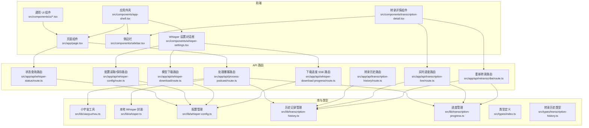

**图表来源**
- [src/app/page.tsx:1-36](file://src/app/page.tsx#L1-L36)
- [src/components/transcription-detail.tsx:1-394](file://src/components/transcription-detail.tsx#L1-L394)
- [src/app/api/process-podcast/route.ts:1-406](file://src/app/api/process-podcast/route.ts#L1-L406)
- [src/app/api/transcription-live/route.ts:1-119](file://src/app/api/transcription-live/route.ts#L1-L119)
- [src/app/api/retranscribe/route.ts:1-364](file://src/app/api/retranscribe/route.ts#L1-L364)
- [src/lib/transcription-history.ts:1-208](file://src/lib/transcription-history.ts#L1-L208)
- [src/lib/transcription-progress.ts:1-44](file://src/lib/transcription-progress.ts#L1-L44)

**章节来源**
- [README.md:1-27](file://README.md#L1-L27)
- [package.json:1-38](file://package.json#L1-L38)

## 核心组件
- 页面组件：负责用户交互、状态管理、发起 API 请求与结果渲染。
- API 路由：封装业务流程（抓取播客、下载音频、调用 Whisper、回退处理）。
- 库模块：封装小宇宙解析、本地 Whisper 调用、配置管理、历史记录与进度管理。
- UI 组件：Toast、FlowLoader、对话框、侧边栏等。

**章节来源**
- [src/app/page.tsx:13-36](file://src/app/page.tsx#L13-L36)
- [src/lib/xiaoyuzhou.ts:27-47](file://src/lib/xiaoyuzhou.ts#L27-L47)
- [src/lib/whisper.ts:54-156](file://src/lib/whisper.ts#L54-L156)
- [src/lib/whisper-config.ts:54-89](file://src/lib/whisper-config.ts#L54-L89)
- [src/components/ui/toast.tsx:13-67](file://src/components/ui/toast.tsx#L13-L67)
- [src/components/ui/flow-loader.tsx:10-58](file://src/components/ui/flow-loader.tsx#L10-L58)

## 架构总览
下图展示了从用户提交播客链接到返回转录结果的端到端数据流，以及状态在各层之间的传递。

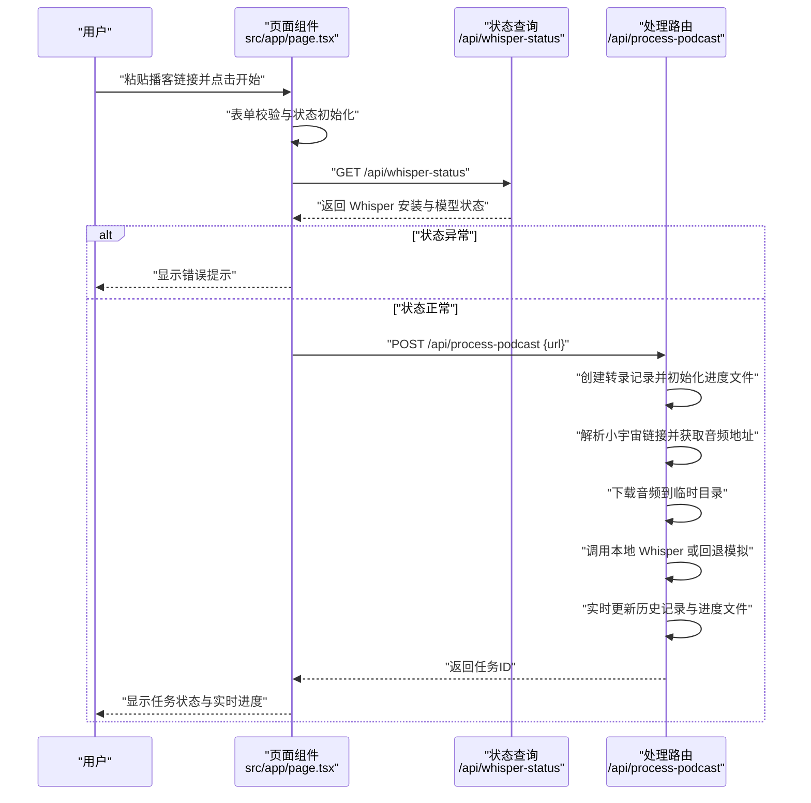

**图表来源**
- [src/app/page.tsx:23-36](file://src/app/page.tsx#L23-L36)
- [src/app/api/whisper-status/route.ts:11-59](file://src/app/api/whisper-status/route.ts#L11-L59)
- [src/app/api/process-podcast/route.ts:343-396](file://src/app/api/process-podcast/route.ts#L343-L396)
- [src/lib/xiaoyuzhou.ts:27-47](file://src/lib/xiaoyuzhou.ts#L27-L47)

## 详细组件分析

### 页面组件：播客转录工作流
- 输入处理：校验空值与平台限制（当前仅支持小宇宙链接），禁用按钮与输入框以防止重复提交。
- 状态管理：本地 useState 管理 URL、加载态、转录结果与音频信息；Toast 管理提示消息。
- 异步流程：
  - 查询 Whisper 状态，若未安装或模型缺失则中断并提示。
  - 调用 /api/process-podcast，解析小宇宙链接、下载音频、调用 Whisper 或回退模拟。
  - 成功后聚合音频 URL、字数、语言与转录文本，失败则显示错误提示。
- 展示：音频卡片（播放器、标签）、转录卡片（纯文本/格式化）与复制按钮。

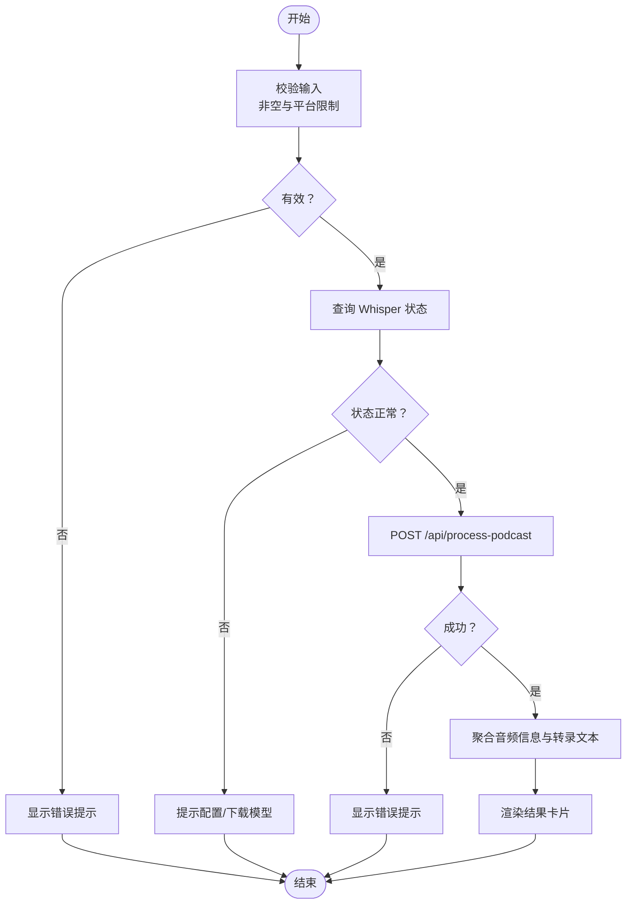

**图表来源**
- [src/app/page.tsx:23-36](file://src/app/page.tsx#L23-L36)

**章节来源**
- [src/app/page.tsx:13-36](file://src/app/page.tsx#L13-L36)
- [src/components/ui/toast.tsx:13-67](file://src/components/ui/toast.tsx#L13-L67)
- [src/components/ui/flow-loader.tsx:10-58](file://src/components/ui/flow-loader.tsx#L10-L58)

### API 路由：处理播客与转录
- 输入校验：要求 URL 存在。
- 小宇宙解析：多策略尝试（官方 API、页面 HTML、第三方 API），提取音频 URL。
- 音频下载：写入系统临时目录，删除临时文件。
- Whisper 调用：读取配置，若可执行与模型存在则调用本地 Whisper；否则回退模拟转录。
- 结果返回：包含转录文本、音频 URL、字数与语言。

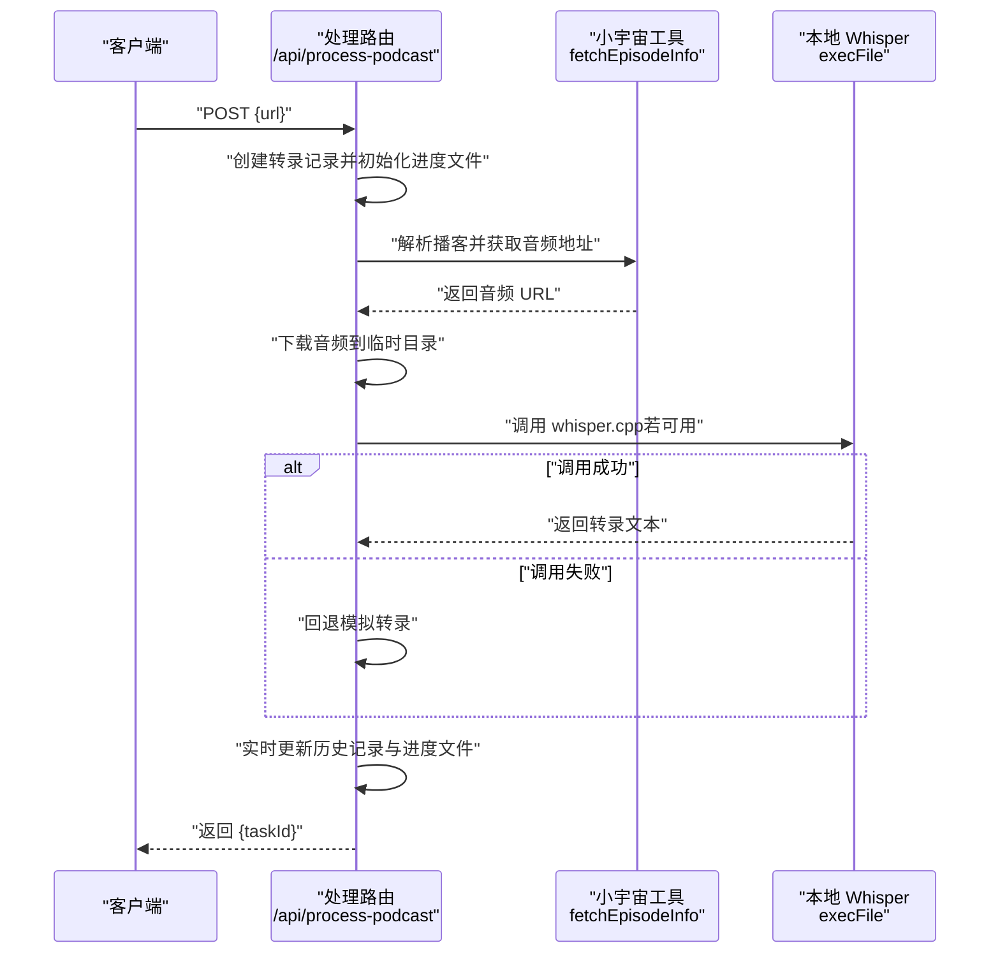

**图表来源**
- [src/app/api/process-podcast/route.ts:343-396](file://src/app/api/process-podcast/route.ts#L343-L396)
- [src/lib/xiaoyuzhou.ts:27-47](file://src/lib/xiaoyuzhou.ts#L27-L47)
- [src/lib/whisper.ts:54-156](file://src/lib/whisper.ts#L54-L156)

**章节来源**
- [src/app/api/process-podcast/route.ts:343-396](file://src/app/api/process-podcast/route.ts#L343-L396)

### 双持久化机制：历史记录与进度文件
**新增** 新架构的核心创新是分离了两种持久化机制：

#### 历史记录文件（.transcription-history.json）
- 存储完整的转录历史记录
- 支持并发写入锁机制
- 提供完整的 CRUD 操作
- 包含时间戳序列化与反序列化

#### 进度文件（.transcribe-progress-*.json）
- 存储实时转录进度
- 高频更新，每500ms写入一次
- 采用原子写入避免竞态条件
- 任务完成后延迟清理

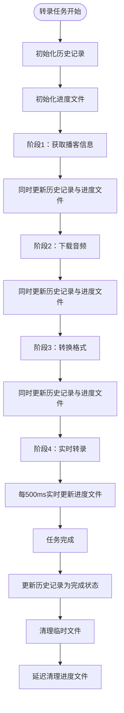

**图表来源**
- [src/lib/transcription-history.ts:106-137](file://src/lib/transcription-history.ts#L106-L137)
- [src/lib/transcription-progress.ts:13-43](file://src/lib/transcription-progress.ts#L13-L43)
- [src/app/api/process-podcast/route.ts:98-341](file://src/app/api/process-podcast/route.ts#L98-L341)

**章节来源**
- [src/lib/transcription-history.ts:1-208](file://src/lib/transcription-history.ts#L1-L208)
- [src/lib/transcription-progress.ts:1-44](file://src/lib/transcription-progress.ts#L1-L44)

### 实时进度同步：SSE 流式传输
**新增** 实时进度同步是新架构的关键特性：

#### SSE 服务器端实现
- 每800ms推送一次更新
- 合并历史记录与进度文件数据
- 自动重连机制
- 客户端断开时优雅关闭

#### 客户端 EventSource 连接
- 自动重连，3秒间隔
- 实时滚动到底部
- 状态变化时自动关闭连接

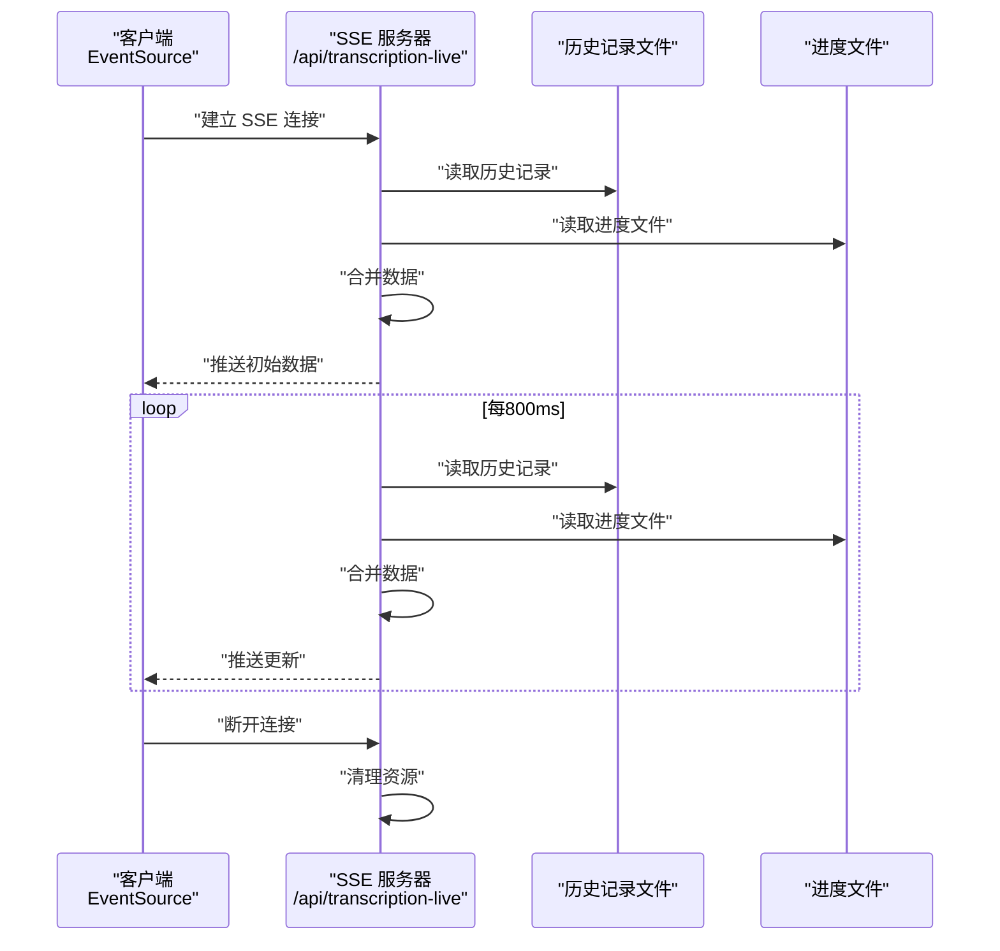

**图表来源**
- [src/app/api/transcription-live/route.ts:36-118](file://src/app/api/transcription-live/route.ts#L36-L118)
- [src/components/transcription-detail.tsx:62-106](file://src/components/transcription-detail.tsx#L62-L106)

**章节来源**
- [src/app/api/transcription-live/route.ts:1-119](file://src/app/api/transcription-live/route.ts#L1-L119)
- [src/components/transcription-detail.tsx:1-394](file://src/components/transcription-detail.tsx#L1-L394)

### 重新转录功能：基于现有音频URL的后台处理
**新增** 重新转录功能允许用户对已完成的任务重新执行转录：

#### 流程特点
- 跳过播客信息获取阶段
- 直接使用现有音频URL
- 保持原有标题和保存路径
- 实时进度同步与历史记录更新

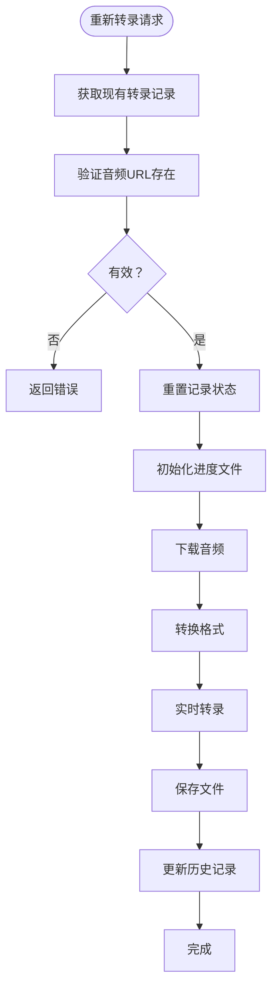

**图表来源**
- [src/app/api/retranscribe/route.ts:286-363](file://src/app/api/retranscribe/route.ts#L286-L363)
- [src/app/api/retranscribe/route.ts:99-284](file://src/app/api/retranscribe/route.ts#L99-L284)

**章节来源**
- [src/app/api/retranscribe/route.ts:1-364](file://src/app/api/retranscribe/route.ts#L1-L364)

### Whisper 配置与状态管理
- 配置来源：默认值 + 本地配置文件 + 环境变量覆盖。
- 状态查询：检测 whisper.cpp 与模型文件是否存在，返回模型大小与名称。
- 设置界面：支持选择模型、下载模型（SSE 实时进度）、保存配置、高级设置（路径、线程数）。

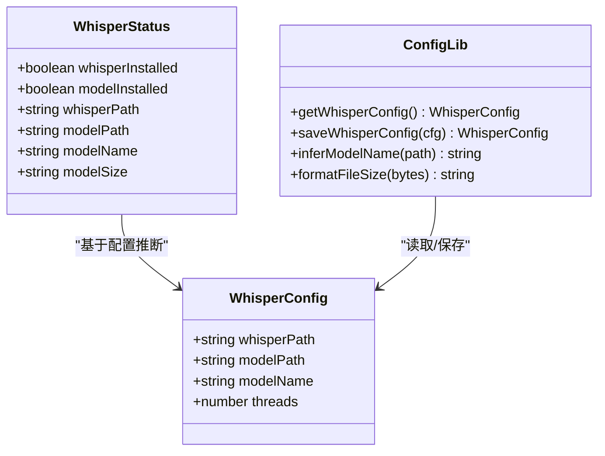

**图表来源**
- [src/types/index.ts:7-22](file://src/types/index.ts#L7-L22)
- [src/lib/whisper-config.ts:54-89](file://src/lib/whisper-config.ts#L54-L89)
- [src/app/api/whisper-status/route.ts:11-59](file://src/app/api/whisper-status/route.ts#L11-L59)

**章节来源**
- [src/lib/whisper-config.ts:54-89](file://src/lib/whisper-config.ts#L54-L89)
- [src/app/api/whisper-config/route.ts:10-123](file://src/app/api/whisper-config/route.ts#L10-L123)
- [src/app/api/whisper-status/route.ts:11-59](file://src/app/api/whisper-status/route.ts#L11-L59)

### 模型下载与进度跟踪（SSE）
- 下载触发：POST /api/whisper-download，支持 small/medium 模型。
- 后台下载：使用流式读取与写入，定期写入进度文件。
- 进度推送：/api/whisper-download-progress 以 SSE 推送下载状态，客户端 EventSource 订阅。

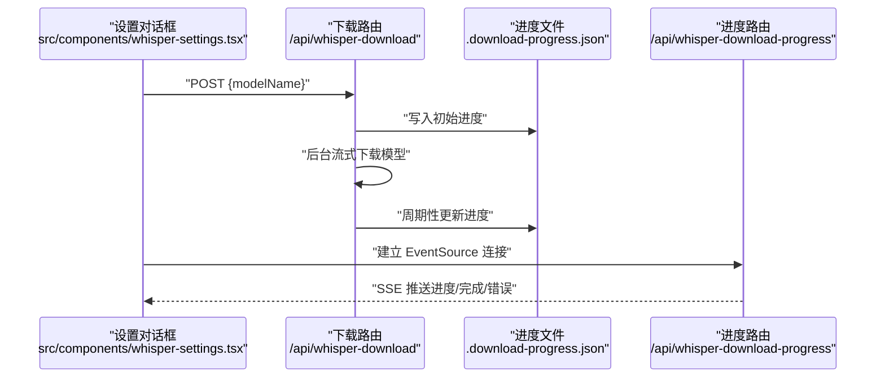

**图表来源**
- [src/components/whisper-settings.tsx:156-187](file://src/components/whisper-settings.tsx#L156-L187)
- [src/app/api/whisper-download/route.ts:173-234](file://src/app/api/whisper-download/route.ts#L173-L234)
- [src/app/api/whisper-download-progress/route.ts:43-138](file://src/app/api/whisper-download-progress/route.ts#L43-L138)

**章节来源**
- [src/app/api/whisper-download/route.ts:52-167](file://src/app/api/whisper-download/route.ts#L52-L167)
- [src/app/api/whisper-download-progress/route.ts:11-37](file://src/app/api/whisper-download-progress/route.ts#L11-L37)

### 小宇宙解析策略
- 多策略尝试：官方 API、页面 HTML（__NEXT_DATA__、meta、链接抽取）、第三方 API。
- 超时控制：不同策略设置不同超时，避免阻塞。
- 失败回退：任一策略成功即返回，否则抛出错误。

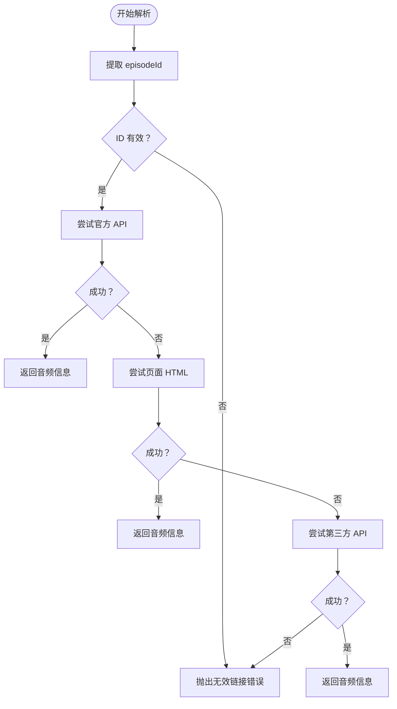

**图表来源**
- [src/lib/xiaoyuzhou.ts:27-47](file://src/lib/xiaoyuzhou.ts#L27-L47)
- [src/lib/xiaoyuzhou.ts:52-89](file://src/lib/xiaoyuzhou.ts#L52-L89)
- [src/lib/xiaoyuzhou.ts:94-164](file://src/lib/xiaoyuzhou.ts#L94-L164)
- [src/lib/xiaoyuzhou.ts:169-196](file://src/lib/xiaoyuzhou.ts#L169-L196)

**章节来源**
- [src/lib/xiaoyuzhou.ts:27-47](file://src/lib/xiaoyuzhou.ts#L27-L47)

### 本地 Whisper 调用与回退
- 参数构建：模型路径、音频路径、语言、线程数、输出格式（JSON/文本）。
- 执行与结果：捕获子进程错误，读取输出文件或标准输出；解析 JSON 或直接返回文本。
- 回退策略：当本地 Whisper 不可用或执行失败时，使用模拟转录返回近似结果。

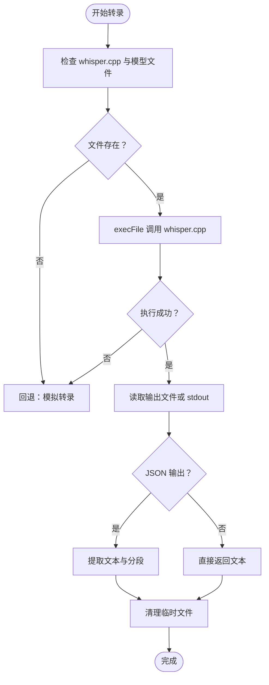

**图表来源**
- [src/lib/whisper.ts:54-156](file://src/lib/whisper.ts#L54-L156)
- [src/app/api/process-podcast/route.ts:63-89](file://src/app/api/process-podcast/route.ts#L63-L89)

**章节来源**
- [src/lib/whisper.ts:54-156](file://src/lib/whisper.ts#L54-L156)
- [src/app/api/process-podcast/route.ts:63-89](file://src/app/api/process-podcast/route.ts#L63-L89)

## 依赖关系分析
- 前端页面依赖 API 路由与 UI 组件；API 路由依赖库模块。
- 库模块之间解耦：xiaoyuzhou 与 whisper 独立，通过 API 路由组合。
- 配置管理贯穿 UI 设置与 API 路由，统一来源与覆盖规则。
- **新增** 历史记录与进度文件分离，支持高并发写入与实时更新。

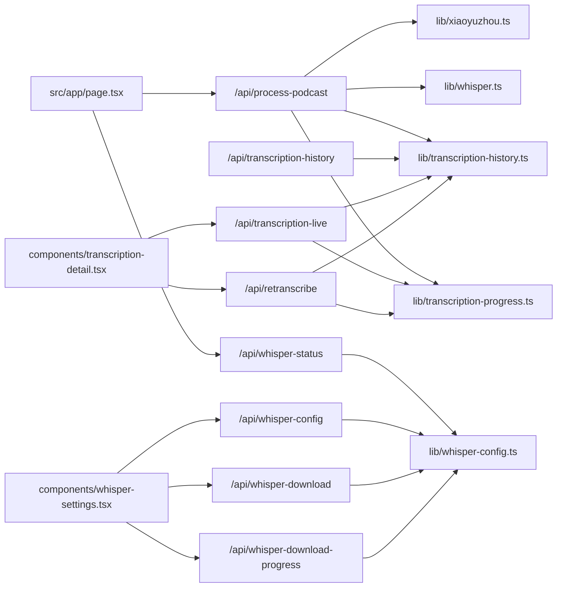

**图表来源**
- [src/app/page.tsx:13-36](file://src/app/page.tsx#L13-L36)
- [src/components/transcription-detail.tsx:1-394](file://src/components/transcription-detail.tsx#L1-L394)
- [src/app/api/process-podcast/route.ts:1-406](file://src/app/api/process-podcast/route.ts#L1-L406)
- [src/lib/transcription-history.ts:1-208](file://src/lib/transcription-history.ts#L1-L208)
- [src/lib/transcription-progress.ts:1-44](file://src/lib/transcription-progress.ts#L1-L44)

**章节来源**
- [src/app/page.tsx:13-36](file://src/app/page.tsx#L13-L36)
- [src/app/api/process-podcast/route.ts:1-406](file://src/app/api/process-podcast/route.ts#L1-L406)

## 性能考虑
- 并发与资源：Whisper 线程数建议与 CPU 核心数匹配；过高的线程数可能造成上下文切换开销。
- I/O 优化：音频下载使用流式写入，减少内存占用；临时文件及时清理。
- 回退策略：在网络异常或本地模型缺失时，模拟转录保证可用性，但质量与速度不及真实模型。
- UI 响应：加载态与禁用按钮避免重复请求；Toast 与进度条提升反馈体验。
- **新增** 双持久化机制：历史记录文件采用原子写入，避免竞态条件；进度文件高频更新但体积小。
- **新增** 实时进度同步：SSE 每800ms推送一次，客户端自动重连，提供流畅的用户体验。
- **新增** 并发控制：历史记录操作使用队列锁，确保数据一致性。
- 缓存策略：当前未见服务端/客户端缓存实现。建议：
  - 对相同播客链接的转录结果进行短期缓存（基于 URL 哈希）。
  - 对小宇宙解析结果按 episodeId 缓存，结合 ETag/Last-Modified。
  - 对 Whisper 输出文件进行缓存（需校验模型版本与参数）。

## 故障排查指南
- 网络异常
  - 小宇宙解析：不同策略均设置超时，若全部失败，检查网络与目标站点可用性。
  - 下载音频：HTTP 状态码非 2xx，检查音频 URL 有效性与 CDN 状态。
- Whisper 执行失败
  - 可执行文件或模型缺失：通过 /api/whisper-status 检查状态；通过设置界面下载模型。
  - 子进程错误：查看日志中的 stderr；确认模型大小与路径。
- **新增** 实时进度问题
  - SSE 连接断开：客户端自动重连，检查网络稳定性。
  - 进度文件读取失败：检查文件权限与磁盘空间。
  - 历史记录损坏：系统会回退到最近一次有效快照。
- **新增** 双持久化问题
  - 历史记录文件损坏：系统提供重试机制与最后已知良好状态回退。
  - 进度文件丢失：任务完成后会延迟清理，确保客户端有足够时间接收。
- 回退机制
  - 当本地 Whisper 不可用或执行失败时，路由会回退到模拟转录；可在生产环境替换为真实调用。
- UI 提示
  - 使用 Toast 显示错误/成功信息；FlowLoader 提供加载反馈。

**章节来源**
- [src/lib/xiaoyuzhou.ts:52-89](file://src/lib/xiaoyuzhou.ts#L52-L89)
- [src/app/api/process-podcast/route.ts:44-51](file://src/app/api/process-podcast/route.ts#L44-L51)
- [src/app/api/process-podcast/route.ts:85-89](file://src/app/api/process-podcast/route.ts#L85-L89)
- [src/components/ui/toast.tsx:13-67](file://src/components/ui/toast.tsx#L13-L67)

## 结论
MemoFlow 的数据流围绕"播客链接 → 音频 → 本地 Whisper 转录 → 结果聚合"的主路径展开。**新增的双持久化机制**提供了可靠的数据存储方案，**实时进度同步**增强了用户体验，**重新转录功能**提升了系统的灵活性。前端通过明确的状态管理与 UI 反馈提升用户体验，后端通过多策略解析与回退机制增强鲁棒性。配置管理与模型下载流程提供了可扩展的本地推理能力。后续可在缓存与并发控制方面进一步优化，以提升吞吐与稳定性。

## 附录
- 状态管理策略
  - 本地状态：页面组件内的 useState 管理 UI 状态与输入，职责清晰、易测试。
  - 全局状态：当前未引入集中式全局状态（如 Zustand/Redux），可通过对话框与路由参数传递配置。
  - 持久化存储：配置保存于本地文件，环境变量具有最高优先级，满足不同部署场景。
  - **新增** 历史记录持久化：完整的转录历史记录，支持并发写入与数据恢复。
  - **新增** 进度持久化：高频更新的转录进度，采用原子写入避免竞态条件。
- 错误处理与回退
  - 前端：Toast 提示、加载态控制、输入校验。
  - 后端：多策略解析、子进程错误捕获、模拟回退、统一错误响应。
  - **新增** 实时错误处理：SSE 连接断开时自动重连，提供持续的进度反馈。
- 数据流图（概念示意）

**图表来源**
- [src/app/api/process-podcast/route.ts:98-341](file://src/app/api/process-podcast/route.ts#L98-L341)
- [src/app/api/transcription-live/route.ts:36-118](file://src/app/api/transcription-live/route.ts#L36-L118)
- [src/lib/transcription-history.ts:106-137](file://src/lib/transcription-history.ts#L106-L137)
- [src/lib/transcription-progress.ts:13-43](file://src/lib/transcription-progress.ts#L13-L43)