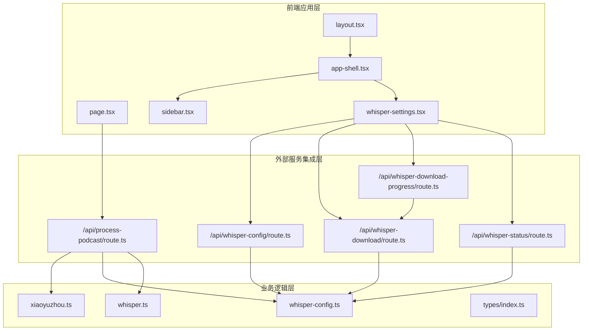
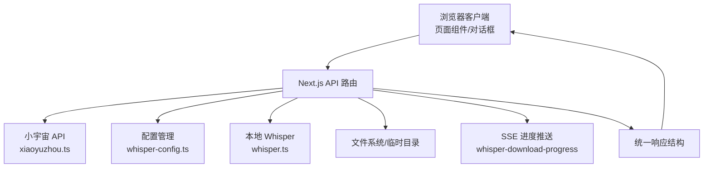
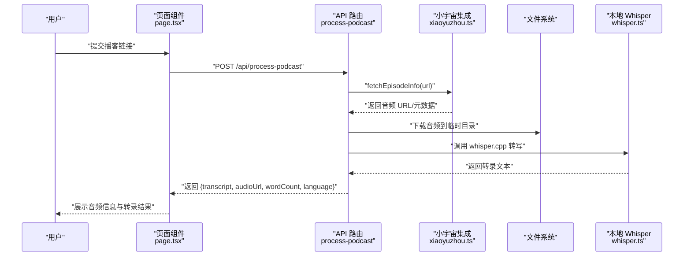
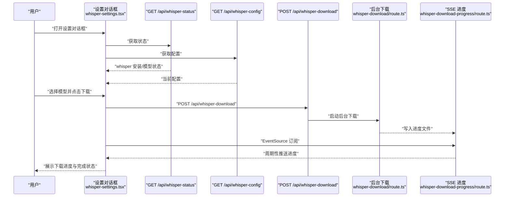
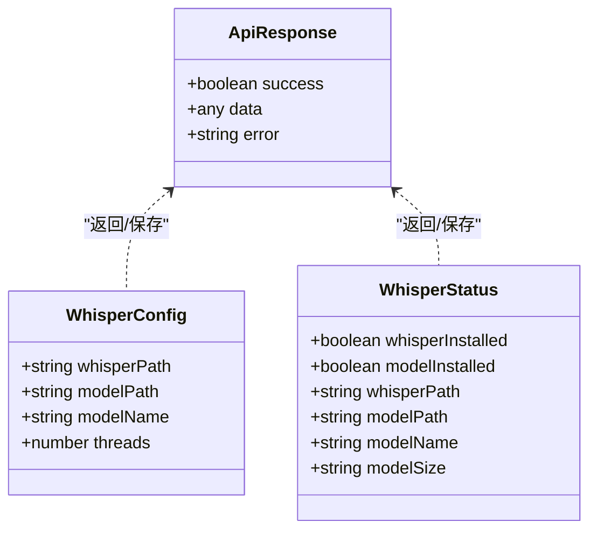
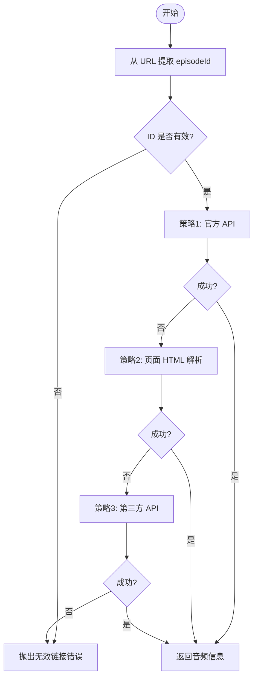
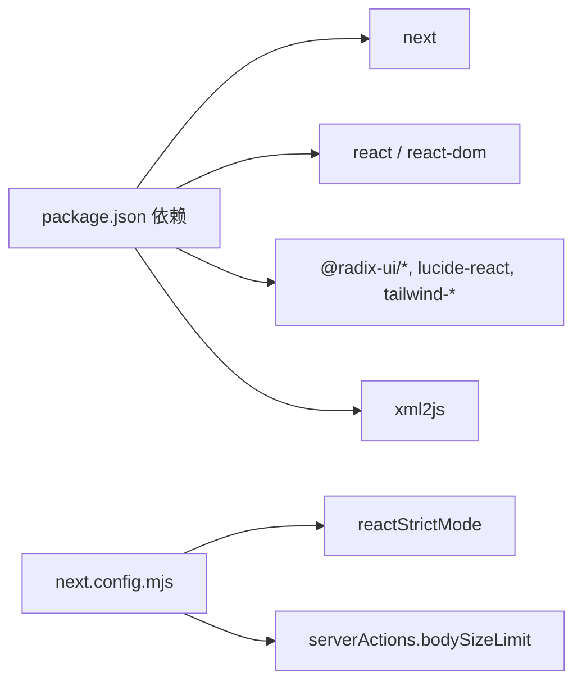

# 架构设计

<cite>
**本文引用的文件**
- [README.md](file://README.md)
- [package.json](file://package.json)
- [next.config.mjs](file://next.config.mjs)
- [src/app/layout.tsx](file://src/app/layout.tsx)
- [src/app/page.tsx](file://src/app/page.tsx)
- [src/components/app-shell.tsx](file://src/components/app-shell.tsx)
- [src/components/sidebar.tsx](file://src/components/sidebar.tsx)
- [src/components/whisper-settings.tsx](file://src/components/whisper-settings.tsx)
- [src/lib/whisper.ts](file://src/lib/whisper.ts)
- [src/lib/whisper-config.ts](file://src/lib/whisper-config.ts)
- [src/lib/xiaoyuzhou.ts](file://src/lib/xiaoyuzhou.ts)
- [src/app/api/process-podcast/route.ts](file://src/app/api/process-podcast/route.ts)
- [src/app/api/whisper-config/route.ts](file://src/app/api/whisper-config/route.ts)
- [src/app/api/whisper-download/route.ts](file://src/app/api/whisper-download/route.ts)
- [src/app/api/whisper-download-progress/route.ts](file://src/app/api/whisper-download-progress/route.ts)
- [src/app/api/whisper-status/route.ts](file://src/app/api/whisper-status/route.ts)
- [src/types/index.ts](file://src/types/index.ts)
- [setup-whisper.sh](file://setup-whisper.sh)
</cite>

## 目录
1. [引言](#引言)
2. [项目结构](#项目结构)
3. [核心组件](#核心组件)
4. [架构总览](#架构总览)
5. [详细组件分析](#详细组件分析)
6. [依赖分析](#依赖分析)
7. [性能考虑](#性能考虑)
8. [故障排查指南](#故障排查指南)
9. [结论](#结论)
10. [附录](#附录)

## 引言
MemoFlow 是一个基于 Next.js 全栈架构的播客转录工具，目标是“从内容消费者 → 内容创作者”，通过粘贴小宇宙播客链接，自动提取音频并进行本地语音识别，最终输出可编辑的转录文本。系统采用前后端分离但统一框架的组织方式：前端页面组件负责用户交互与状态管理，后端 API 路由负责业务流程编排与外部服务集成，本地语音识别引擎（whisper.cpp）作为外部服务被封装在后端执行。

## 项目结构
项目采用 Next.js App Router 的目录结构，按功能域划分：
- 前端应用层：src/app、src/components、src/styles、src/types
- 业务逻辑层：src/lib（封装 Whisper、小宇宙 API、配置管理）
- 外部服务集成层：src/app/api（Next.js API 路由）

图表来源
- [src/app/layout.tsx:14-31](file://src/app/layout.tsx#L14-L31)
- [src/app/page.tsx:13-87](file://src/app/page.tsx#L13-L87)
- [src/components/app-shell.tsx:11-29](file://src/components/app-shell.tsx#L11-L29)
- [src/components/whisper-settings.tsx:56-108](file://src/components/whisper-settings.tsx#L56-L108)
- [src/lib/xiaoyuzhou.ts:27-47](file://src/lib/xiaoyuzhou.ts#L27-L47)
- [src/lib/whisper-config.ts:54-89](file://src/lib/whisper-config.ts#L54-L89)
- [src/lib/whisper.ts:54-156](file://src/lib/whisper.ts#L54-L156)
- [src/app/api/process-podcast/route.ts:13-114](file://src/app/api/process-podcast/route.ts#L13-L114)
- [src/app/api/whisper-config/route.ts:10-28](file://src/app/api/whisper-config/route.ts#L10-L28)
- [src/app/api/whisper-download/route.ts:173-234](file://src/app/api/whisper-download/route.ts#L173-L234)
- [src/app/api/whisper-download-progress/route.ts:43-138](file://src/app/api/whisper-download-progress/route.ts#L43-L138)
- [src/app/api/whisper-status/route.ts:11-59](file://src/app/api/whisper-status/route.ts#L11-L59)

章节来源
- [src/app/layout.tsx:14-31](file://src/app/layout.tsx#L14-L31)
- [src/app/page.tsx:13-87](file://src/app/page.tsx#L13-L87)
- [src/components/app-shell.tsx:11-29](file://src/components/app-shell.tsx#L11-L29)
- [src/components/whisper-settings.tsx:56-108](file://src/components/whisper-settings.tsx#L56-L108)

## 核心组件
- 页面组件（客户端）：负责用户输入、状态管理、错误提示与结果展示。例如首页组件对播客链接进行校验、触发 API、接收并展示转录结果。
- 应用外壳与侧边栏：提供导航与全局设置入口（Whisper 设置对话框）。
- Whisper 设置对话框：集中管理 Whisper 安装状态、模型下载与配置保存，并通过 SSE 实时显示下载进度。
- 业务逻辑库：
  - 小宇宙集成：从 episode URL 提取音频链接，具备多策略降级方案。
  - Whisper 配置：读取/保存配置，合并环境变量覆盖，推断模型名与格式化文件大小。
  - Whisper 封装：封装本地 whisper.cpp 执行，提供转写结果与分段信息。
- API 路由：统一处理播客转录、配置读取/保存、模型下载与进度推送、状态查询。

章节来源
- [src/app/page.tsx:13-87](file://src/app/page.tsx#L13-L87)
- [src/components/app-shell.tsx:11-29](file://src/components/app-shell.tsx#L11-L29)
- [src/components/whisper-settings.tsx:56-108](file://src/components/whisper-settings.tsx#L56-L108)
- [src/lib/xiaoyuzhou.ts:27-47](file://src/lib/xiaoyuzhou.ts#L27-L47)
- [src/lib/whisper-config.ts:54-89](file://src/lib/whisper-config.ts#L54-L89)
- [src/lib/whisper.ts:54-156](file://src/lib/whisper.ts#L54-L156)
- [src/app/api/process-podcast/route.ts:13-114](file://src/app/api/process-podcast/route.ts#L13-L114)
- [src/app/api/whisper-config/route.ts:36-123](file://src/app/api/whisper-config/route.ts#L36-L123)
- [src/app/api/whisper-download/route.ts:173-234](file://src/app/api/whisper-download/route.ts#L173-L234)
- [src/app/api/whisper-download-progress/route.ts:43-138](file://src/app/api/whisper-download-progress/route.ts#L43-L138)
- [src/app/api/whisper-status/route.ts:11-59](file://src/app/api/whisper-status/route.ts#L11-L59)

## 架构总览
系统采用“前端页面组件 + Next.js API 路由 + 本地/外部服务”的三层架构：
- 前端应用层：使用客户端组件与受控表单，负责用户交互与 UI 展示。
- 业务逻辑层：封装第三方 API 与本地工具，提供稳定接口供路由调用。
- 外部服务集成层：Next.js API 路由作为编排中心，协调小宇宙 API、本地 Whisper、文件系统与 SSE。

图表来源
- [src/app/page.tsx:23-87](file://src/app/page.tsx#L23-L87)
- [src/components/whisper-settings.tsx:75-101](file://src/components/whisper-settings.tsx#L75-L101)
- [src/lib/xiaoyuzhou.ts:27-47](file://src/lib/xiaoyuzhou.ts#L27-L47)
- [src/lib/whisper-config.ts:54-89](file://src/lib/whisper-config.ts#L54-L89)
- [src/lib/whisper.ts:54-156](file://src/lib/whisper.ts#L54-L156)
- [src/app/api/process-podcast/route.ts:13-114](file://src/app/api/process-podcast/route.ts#L13-L114)
- [src/app/api/whisper-download-progress/route.ts:43-138](file://src/app/api/whisper-download-progress/route.ts#L43-L138)

## 详细组件分析

### 组件 A：播客转录工作流（页面组件 → API 路由 → 小宇宙 API → Whisper）
该流程展示了从用户输入到结果返回的关键步骤与错误传播机制。

图表来源
- [src/app/page.tsx:23-87](file://src/app/page.tsx#L23-L87)
- [src/app/api/process-podcast/route.ts:13-114](file://src/app/api/process-podcast/route.ts#L13-L114)
- [src/lib/xiaoyuzhou.ts:27-47](file://src/lib/xiaoyuzhou.ts#L27-L47)
- [src/lib/whisper.ts:54-156](file://src/lib/whisper.ts#L54-L156)

章节来源
- [src/app/page.tsx:23-87](file://src/app/page.tsx#L23-L87)
- [src/app/api/process-podcast/route.ts:13-114](file://src/app/api/process-podcast/route.ts#L13-L114)
- [src/lib/xiaoyuzhou.ts:27-47](file://src/lib/xiaoyuzhou.ts#L27-L47)
- [src/lib/whisper.ts:54-156](file://src/lib/whisper.ts#L54-L156)

### 组件 B：Whisper 设置与模型下载（对话框 → API 路由 → SSE）
该流程展示配置读取、模型下载与进度推送的完整链路。

图表来源
- [src/components/whisper-settings.tsx:75-101](file://src/components/whisper-settings.tsx#L75-L101)
- [src/app/api/whisper-status/route.ts:11-59](file://src/app/api/whisper-status/route.ts#L11-L59)
- [src/app/api/whisper-config/route.ts:10-28](file://src/app/api/whisper-config/route.ts#L10-L28)
- [src/app/api/whisper-download/route.ts:173-234](file://src/app/api/whisper-download/route.ts#L173-L234)
- [src/app/api/whisper-download-progress/route.ts:43-138](file://src/app/api/whisper-download-progress/route.ts#L43-L138)

章节来源
- [src/components/whisper-settings.tsx:75-101](file://src/components/whisper-settings.tsx#L75-L101)
- [src/app/api/whisper-status/route.ts:11-59](file://src/app/api/whisper-status/route.ts#L11-L59)
- [src/app/api/whisper-config/route.ts:10-28](file://src/app/api/whisper-config/route.ts#L10-L28)
- [src/app/api/whisper-download/route.ts:173-234](file://src/app/api/whisper-download/route.ts#L173-L234)
- [src/app/api/whisper-download-progress/route.ts:43-138](file://src/app/api/whisper-download-progress/route.ts#L43-L138)

### 组件 C：数据结构与状态管理
- 统一响应结构：所有 API 均返回统一的响应体，包含 success、data 或 error 字段，便于前端一致处理。
- Whisper 配置与状态：包含路径、模型名、线程数以及安装状态与文件大小等信息。
- 页面状态：播客 URL、加载状态、转录结果、音频信息与 Toast 提示。

图表来源
- [src/types/index.ts:1-22](file://src/types/index.ts#L1-L22)

章节来源
- [src/types/index.ts:1-22](file://src/types/index.ts#L1-L22)

### 组件 D：复杂逻辑流程图（小宇宙音频提取）
小宇宙音频提取采用多策略降级，提升鲁棒性。

图表来源
- [src/lib/xiaoyuzhou.ts:27-47](file://src/lib/xiaoyuzhou.ts#L27-L47)

章节来源
- [src/lib/xiaoyuzhou.ts:27-47](file://src/lib/xiaoyuzhou.ts#L27-L47)

## 依赖分析
- 前端依赖：Next.js、React、TailwindCSS 生态与 Radix UI 组件库。
- 运行时依赖：whisper.cpp（本地）、模型文件（本地）、小宇宙 API（外部）。
- Next.js 配置：启用严格模式与 server actions 的 body 限制，适配较大的转录任务负载。

图表来源
- [package.json:12-25](file://package.json#L12-L25)
- [next.config.mjs:2-8](file://next.config.mjs#L2-L8)

章节来源
- [package.json:12-25](file://package.json#L12-L25)
- [next.config.mjs:2-8](file://next.config.mjs#L2-L8)

## 性能考虑
- 本地 Whisper 执行：通过线程数配置与模型选择平衡速度与精度；建议根据 CPU 核心数调整线程数。
- 临时文件管理：下载完成后及时删除临时音频与转录输出文件，避免磁盘占用。
- 多策略小宇宙抓取：优先官方 API，失败后回退至页面解析与第三方 API，减少失败率。
- SSE 进度推送：后台下载写入进度文件，前端以固定频率轮询读取，降低前端压力。
- 体积限制：server actions 的 body 限制为 2MB，满足当前转录场景；若扩展为更大媒体，需评估存储与传输成本。

## 故障排查指南
- 无法下载音频：检查小宇宙链接有效性与网络可达性；查看 API 返回的错误信息。
- Whisper 未安装/模型缺失：通过状态 API 检查安装状态；使用设置对话框下载模型或手动配置路径。
- 转写失败：确认 whisper.cpp 可执行文件与模型文件存在；查看本地日志与模拟转写回退逻辑。
- 下载中断或重复：检查进度文件状态；同一模型不可并发下载；已存在模型会直接更新配置。
- 前端无进度：确认 EventSource 连接建立与 SSE 端点可用；检查浏览器跨域与缓存控制头。

章节来源
- [src/app/api/process-podcast/route.ts:13-114](file://src/app/api/process-podcast/route.ts#L13-L114)
- [src/app/api/whisper-status/route.ts:11-59](file://src/app/api/whisper-status/route.ts#L11-L59)
- [src/app/api/whisper-download/route.ts:173-234](file://src/app/api/whisper-download/route.ts#L173-L234)
- [src/app/api/whisper-download-progress/route.ts:43-138](file://src/app/api/whisper-download-progress/route.ts#L43-L138)
- [src/components/whisper-settings.tsx:120-154](file://src/components/whisper-settings.tsx#L120-L154)

## 结论
MemoFlow 以 Next.js 为基础，构建了清晰的三层架构：前端页面组件负责交互与状态，API 路由承担编排与集成，业务逻辑库封装第三方服务与本地工具。通过统一响应结构、多策略小宇宙抓取、本地 Whisper 执行与 SSE 进度推送，系统实现了从输入到输出的闭环体验。建议在生产环境中结合资源监控与日志聚合，持续优化模型选择与并发策略。

## 附录
- 系统边界与第三方集成模式
  - 小宇宙：官方 API → 页面 HTML → 第三方 API 的三级降级策略。
  - Whisper：本地可执行文件与模型文件，支持配置覆盖与状态查询。
  - SSE：后台写入进度文件，前端以 EventSource 订阅，实现非阻塞进度反馈。
- 安装与初始化
  - 使用脚本初始化 whisper.cpp 与模型，设置环境变量后启动开发服务。

章节来源
- [setup-whisper.sh:1-47](file://setup-whisper.sh#L1-L47)
- [README.md:1-27](file://README.md#L1-L27)