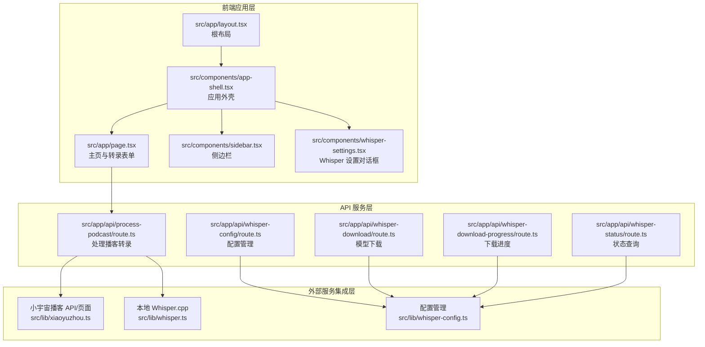
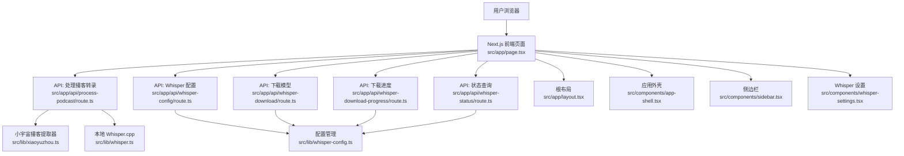
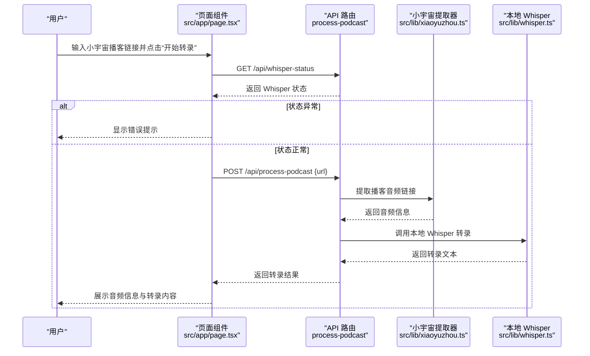
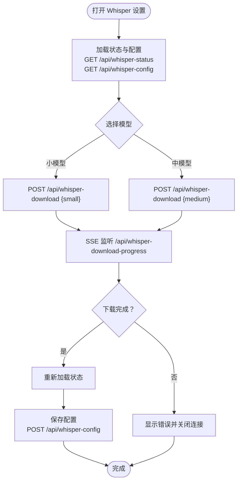
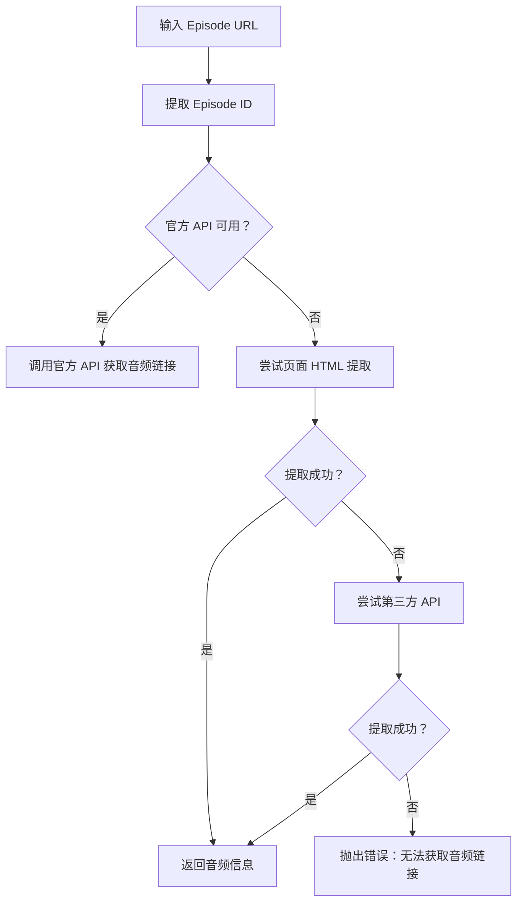
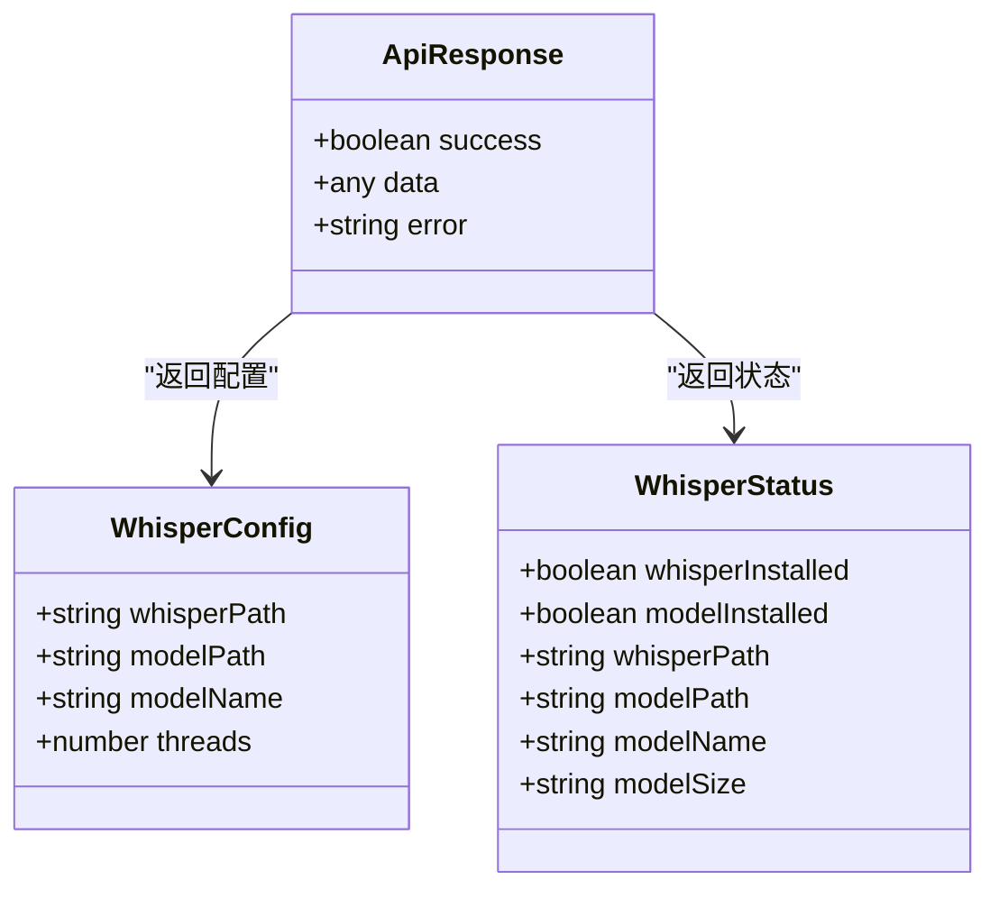
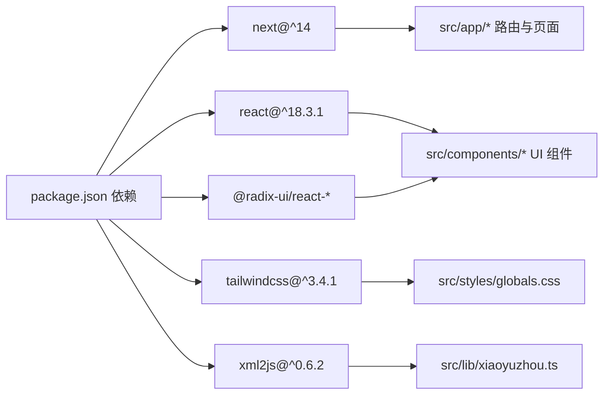

# 系统概览

<cite>
**本文引用的文件**
- [README.md](file://README.md)
- [package.json](file://package.json)
- [next.config.mjs](file://next.config.mjs)
- [src/app/layout.tsx](file://src/app/layout.tsx)
- [src/app/page.tsx](file://src/app/page.tsx)
- [src/app/api/process-podcast/route.ts](file://src/app/api/process-podcast/route.ts)
- [src/app/api/whisper-config/route.ts](file://src/app/api/whisper-config/route.ts)
- [src/app/api/whisper-download/route.ts](file://src/app/api/whisper-download/route.ts)
- [src/app/api/whisper-download-progress/route.ts](file://src/app/api/whisper-download-progress/route.ts)
- [src/app/api/whisper-status/route.ts](file://src/app/api/whisper-status/route.ts)
- [src/components/app-shell.tsx](file://src/components/app-shell.tsx)
- [src/components/sidebar.tsx](file://src/components/sidebar.tsx)
- [src/components/whisper-settings.tsx](file://src/components/whisper-settings.tsx)
- [src/lib/xiaoyuzhou.ts](file://src/lib/xiaoyuzhou.ts)
- [src/lib/whisper.ts](file://src/lib/whisper.ts)
- [src/lib/whisper-config.ts](file://src/lib/whisper-config.ts)
- [src/types/index.ts](file://src/types/index.ts)
- [setup-whisper.sh](file://setup-whisper.sh)
</cite>

## 目录
1. [简介](#简介)
2. [项目结构](#项目结构)
3. [核心组件](#核心组件)
4. [架构总览](#架构总览)
5. [详细组件分析](#详细组件分析)
6. [依赖关系分析](#依赖关系分析)
7. [性能考量](#性能考量)
8. [故障排查指南](#故障排查指南)
9. [结论](#结论)
10. [附录](#附录)

## 简介
MemoFlow 是一款基于 Next.js 全栈架构的播客转录工具，专注于将小宇宙播客链接一键转录为可编辑的文字内容，并提供音频播放、字数统计与复制导出能力。系统通过前端页面收集用户输入，调用后端 API 获取播客音频，再通过本地 Whisper.cpp 进行语音识别，最终将结果返回给用户界面。

产品定位与价值主张：
- 业务边界：面向需要快速提取播客内容为文字的工作流，服务于内容创作者、研究者与学习者。
- 核心价值：简化播客内容消费流程，提供高质量的本地语音识别能力，降低内容二次创作门槛。

## 项目结构
项目采用 Next.js App Router 的目录组织方式，按功能模块划分：
- 前端应用层：页面组件、布局与 UI 组件，负责用户交互与展示。
- API 服务层：路由处理器，封装业务逻辑与外部服务调用。
- 外部服务集成层：小宇宙播客 API、第三方接口与本地 Whisper.cpp。

图表来源
- [src/app/layout.tsx:14-31](file://src/app/layout.tsx#L14-L31)
- [src/app/page.tsx:13-87](file://src/app/page.tsx#L13-L87)
- [src/components/app-shell.tsx:11-29](file://src/components/app-shell.tsx#L11-L29)
- [src/components/sidebar.tsx:37-115](file://src/components/sidebar.tsx#L37-L115)
- [src/components/whisper-settings.tsx:56-108](file://src/components/whisper-settings.tsx#L56-L108)
- [src/app/api/process-podcast/route.ts:13-114](file://src/app/api/process-podcast/route.ts#L13-L114)
- [src/app/api/whisper-config/route.ts:10-28](file://src/app/api/whisper-config/route.ts#L10-L28)
- [src/app/api/whisper-download/route.ts](file://src/app/api/whisper-download/route.ts)
- [src/app/api/whisper-download-progress/route.ts](file://src/app/api/whisper-download-progress/route.ts)
- [src/app/api/whisper-status/route.ts](file://src/app/api/whisper-status/route.ts)
- [src/lib/xiaoyuzhou.ts:27-47](file://src/lib/xiaoyuzhou.ts#L27-L47)
- [src/lib/whisper.ts:54-156](file://src/lib/whisper.ts#L54-L156)
- [src/lib/whisper-config.ts:54-89](file://src/lib/whisper-config.ts#L54-L89)

章节来源
- [package.json:1-37](file://package.json#L1-L37)
- [next.config.mjs:1-12](file://next.config.mjs#L1-L12)

## 核心组件
- 根布局与外壳：定义全局样式、字体与应用外壳容器，承载侧边栏与主内容区。
- 主页与表单：提供播客链接输入、状态管理、结果展示与复制导出。
- 侧边栏：导航与设置入口，控制移动端/桌面端显示。
- Whisper 设置：模型选择、下载与配置保存，支持进度跟踪与高级设置。
- API 路由：处理播客转录、配置管理、模型下载与状态查询。
- 业务库：小宇宙播客信息提取与 Whisper 配置/转录封装。

章节来源
- [src/app/layout.tsx:14-31](file://src/app/layout.tsx#L14-L31)
- [src/app/page.tsx:13-87](file://src/app/page.tsx#L13-L87)
- [src/components/sidebar.tsx:37-115](file://src/components/sidebar.tsx#L37-L115)
- [src/components/whisper-settings.tsx:56-108](file://src/components/whisper-settings.tsx#L56-L108)
- [src/app/api/process-podcast/route.ts:13-114](file://src/app/api/process-podcast/route.ts#L13-L114)
- [src/lib/xiaoyuzhou.ts:27-47](file://src/lib/xiaoyuzhou.ts#L27-L47)
- [src/lib/whisper-config.ts:54-89](file://src/lib/whisper-config.ts#L54-L89)

## 架构总览
系统采用前后端分离但同构的 Next.js 设计：
- 前端：页面组件负责用户交互与状态管理，通过 fetch 调用后端 API。
- 后端：API 路由集中处理业务逻辑，调用外部服务与本地工具。
- 外部服务：小宇宙播客 API/页面与第三方接口用于提取音频链接；本地 Whisper.cpp 用于语音识别。
- 配置与状态：通过配置文件与环境变量管理 Whisper.cpp 路径、模型路径与线程数；状态查询接口供前端感知安装与模型可用性。

图表来源
- [src/app/page.tsx:23-87](file://src/app/page.tsx#L23-L87)
- [src/app/api/process-podcast/route.ts:24-114](file://src/app/api/process-podcast/route.ts#L24-L114)
- [src/app/api/whisper-config/route.ts:10-123](file://src/app/api/whisper-config/route.ts#L10-L123)
- [src/app/api/whisper-download/route.ts](file://src/app/api/whisper-download/route.ts)
- [src/app/api/whisper-download-progress/route.ts](file://src/app/api/whisper-download-progress/route.ts)
- [src/app/api/whisper-status/route.ts](file://src/app/api/whisper-status/route.ts)
- [src/lib/xiaoyuzhou.ts:27-47](file://src/lib/xiaoyuzhou.ts#L27-L47)
- [src/lib/whisper.ts:54-156](file://src/lib/whisper.ts#L54-L156)
- [src/lib/whisper-config.ts:54-89](file://src/lib/whisper-config.ts#L54-L89)
- [src/app/layout.tsx:14-31](file://src/app/layout.tsx#L14-L31)
- [src/components/app-shell.tsx:11-29](file://src/components/app-shell.tsx#L11-L29)
- [src/components/sidebar.tsx:37-115](file://src/components/sidebar.tsx#L37-L115)
- [src/components/whisper-settings.tsx:56-108](file://src/components/whisper-settings.tsx#L56-L108)

## 详细组件分析

### 前端页面与交互流程
- 表单提交：校验输入、检查 Whisper 状态、调用转录 API 并处理响应。
- 结果展示：音频信息卡片与转录内容卡片，支持纯文本与格式化两种视图，提供复制功能。
- 状态管理：加载态、错误提示与成功提示，统一通过 Toast 管理。

图表来源
- [src/app/page.tsx:23-87](file://src/app/page.tsx#L23-L87)
- [src/app/api/process-podcast/route.ts:24-114](file://src/app/api/process-podcast/route.ts#L24-L114)
- [src/lib/xiaoyuzhou.ts:27-47](file://src/lib/xiaoyuzhou.ts#L27-L47)
- [src/lib/whisper.ts:54-156](file://src/lib/whisper.ts#L54-L156)

章节来源
- [src/app/page.tsx:13-87](file://src/app/page.tsx#L13-L87)

### Whisper 配置与模型下载
- 配置管理：读取/保存 Whisper.cpp 路径、模型路径与线程数，支持环境变量覆盖。
- 模型下载：提供小模型与中模型选择，支持 SSE 进度跟踪与重复下载处理。
- 状态查询：返回 Whisper.cpp 安装状态、模型安装状态与模型大小。

图表来源
- [src/components/whisper-settings.tsx:75-154](file://src/components/whisper-settings.tsx#L75-L154)
- [src/app/api/whisper-config/route.ts:36-123](file://src/app/api/whisper-config/route.ts#L36-L123)
- [src/app/api/whisper-download/route.ts](file://src/app/api/whisper-download/route.ts)
- [src/app/api/whisper-download-progress/route.ts](file://src/app/api/whisper-download-progress/route.ts)
- [src/lib/whisper-config.ts:54-89](file://src/lib/whisper-config.ts#L54-L89)

章节来源
- [src/components/whisper-settings.tsx:56-108](file://src/components/whisper-settings.tsx#L56-L108)
- [src/app/api/whisper-config/route.ts:10-123](file://src/app/api/whisper-config/route.ts#L10-L123)
- [src/lib/whisper-config.ts:54-89](file://src/lib/whisper-config.ts#L54-L89)

### 小宇宙播客信息提取
- 多策略提取：优先官方 API，其次页面 HTML，最后第三方接口，失败则抛出错误。
- 数据结构：统一返回标题、描述、音频 URL、时长、发布时间、作者与封面等字段。

图表来源
- [src/lib/xiaoyuzhou.ts:27-47](file://src/lib/xiaoyuzhou.ts#L27-L47)
- [src/lib/xiaoyuzhou.ts:52-89](file://src/lib/xiaoyuzhou.ts#L52-L89)
- [src/lib/xiaoyuzhou.ts:94-164](file://src/lib/xiaoyuzhou.ts#L94-L164)
- [src/lib/xiaoyuzhou.ts:169-197](file://src/lib/xiaoyuzhou.ts#L169-L197)

章节来源
- [src/lib/xiaoyuzhou.ts:27-47](file://src/lib/xiaoyuzhou.ts#L27-L47)

### 类型与配置模型
- 响应与配置类型：统一的响应结构、Whisper 配置与状态模型，便于前后端契约一致。
- 环境变量覆盖：配置读取时合并环境变量，确保部署灵活性。

图表来源
- [src/types/index.ts:1-22](file://src/types/index.ts#L1-L22)
- [src/lib/whisper-config.ts:54-89](file://src/lib/whisper-config.ts#L54-L89)

章节来源
- [src/types/index.ts:1-22](file://src/types/index.ts#L1-L22)
- [src/lib/whisper-config.ts:54-89](file://src/lib/whisper-config.ts#L54-L89)

## 依赖关系分析
- 前端依赖 Next.js 14、React 18、TailwindCSS 与 Radix UI 组件库，保证现代化开发体验与可访问性。
- 后端依赖 Node 子进程调用本地 Whisper.cpp，结合临时文件与线程配置提升转录效率。
- 外部依赖：小宇宙官方 API、第三方接口与 Hugging Face 模型资源。

图表来源
- [package.json:12-35](file://package.json#L12-L35)

章节来源
- [package.json:12-35](file://package.json#L12-L35)

## 性能考量
- 服务器组件渲染与客户端水合：根布局与页面组件采用服务器渲染，减少首屏传输体积；关键交互组件启用客户端水合，提升交互性能。
- 混合渲染策略：静态内容与动态交互分离，避免不必要的客户端包体积。
- 本地 Whisper.cpp：通过线程数与模型选择平衡速度与精度；SSE 进度反馈优化用户体验。
- 临时文件管理：下载与转录过程中的临时文件及时清理，避免磁盘占用。

## 故障排查指南
- 无法下载音频：检查小宇宙链接格式与网络连通性；查看 API 返回的错误信息。
- Whisper 未安装或模型缺失：通过设置面板检查状态，确认路径与线程数配置；使用脚本初始化环境。
- 转录失败：查看本地 Whisper.cpp 执行日志与模型文件完整性；必要时切换更小模型以验证环境。
- 配置保存失败：确认请求体字段完整且符合约束；检查配置文件写入权限。

章节来源
- [src/app/api/process-podcast/route.ts:107-114](file://src/app/api/process-podcast/route.ts#L107-L114)
- [src/components/whisper-settings.tsx:190-213](file://src/components/whisper-settings.tsx#L190-L213)
- [src/lib/whisper-config.ts:78-89](file://src/lib/whisper-config.ts#L78-L89)

## 结论
MemoFlow 以 Next.js 全栈架构为基础，结合本地 Whisper.cpp 实现高质量的播客转录能力。通过清晰的前端页面、完善的 API 路由与外部服务集成，系统在易用性与可维护性之间取得良好平衡。建议在生产环境中进一步完善错误监控、缓存策略与模型更新机制，持续优化用户体验。

## 附录
- 技术选型权衡
  - 性能：本地 Whisper.cpp 减少云端依赖，提升隐私与可控性；模型选择与线程数可调。
  - 可维护性：Next.js App Router 与类型系统提升开发效率；配置文件与环境变量解耦部署差异。
  - 用户体验：SSE 进度反馈、Toast 提示与多视图展示增强交互友好度。
- 运行时与部署要求
  - Node.js 与 Next.js 运行时；本地 Whisper.cpp 编译产物与模型文件；必要的网络访问权限（小宇宙 API、Hugging Face）。
  - 初始化脚本可用于一键安装 Whisper.cpp 与下载模型，便于本地开发与部署。

章节来源
- [setup-whisper.sh:1-47](file://setup-whisper.sh#L1-L47)
- [next.config.mjs:1-12](file://next.config.mjs#L1-L12)
- [README.md:1-27](file://README.md#L1-L27)