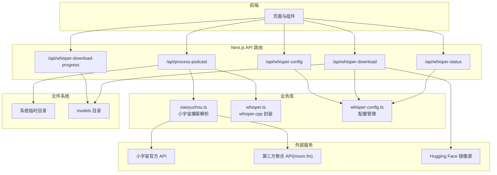
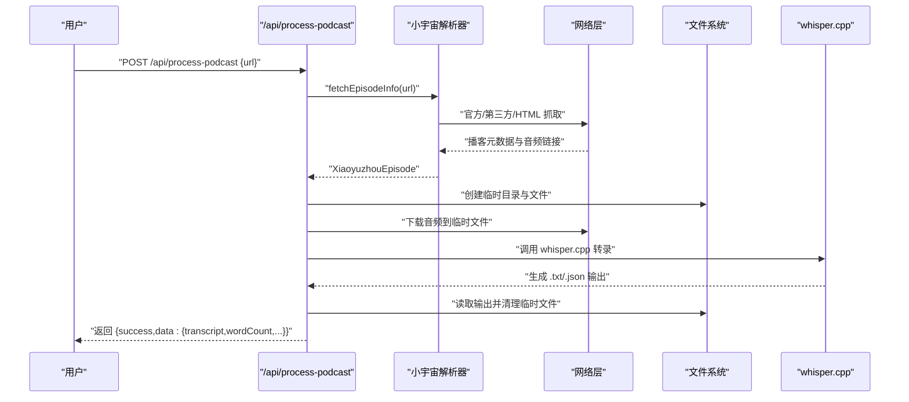
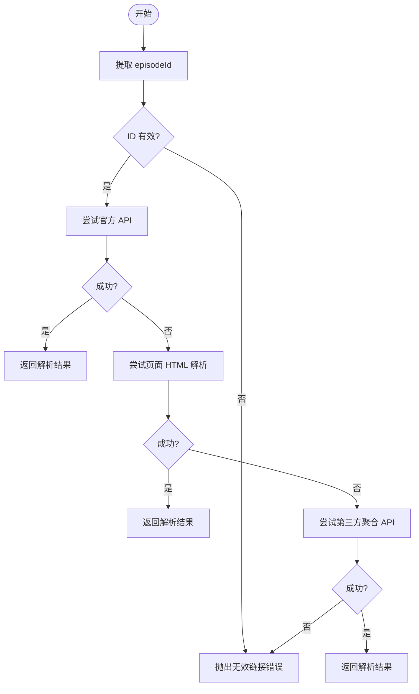
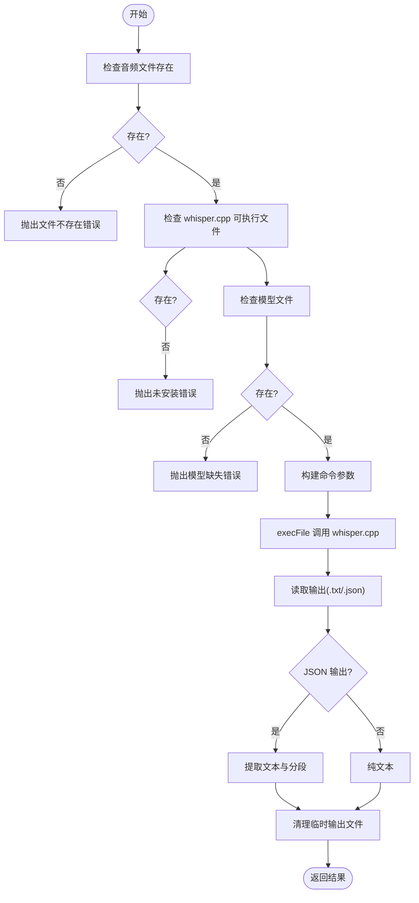
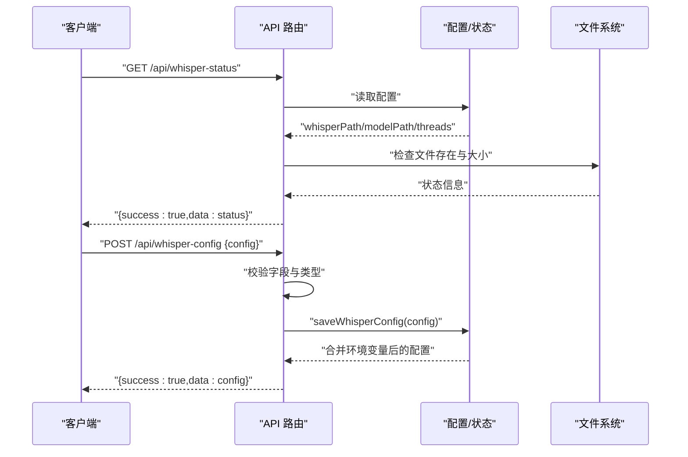
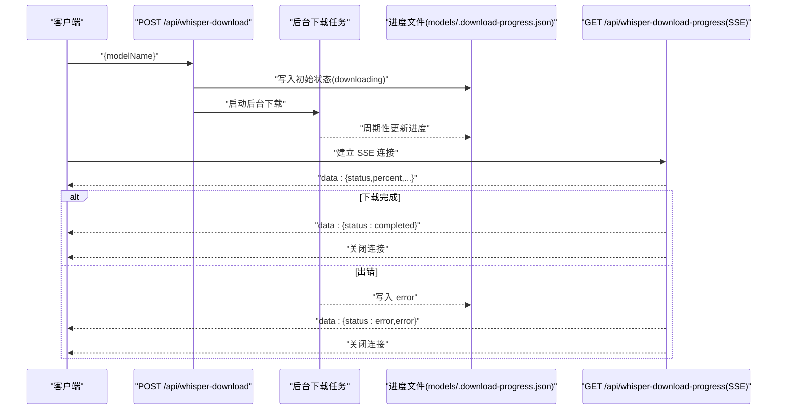
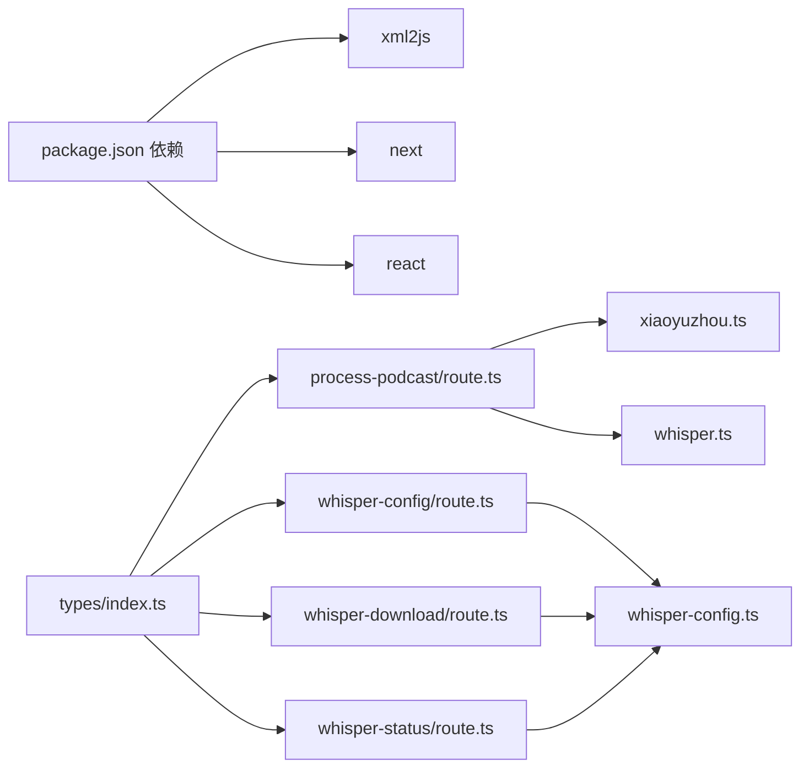

# 集成模式

<cite>
**本文引用的文件**
- [README.md](file://README.md)
- [package.json](file://package.json)
- [next.config.mjs](file://next.config.mjs)
- [src/lib/xiaoyuzhou.ts](file://src/lib/xiaoyuzhou.ts)
- [src/lib/whisper.ts](file://src/lib/whisper.ts)
- [src/lib/whisper-config.ts](file://src/lib/whisper-config.ts)
- [src/types/index.ts](file://src/types/index.ts)
- [src/app/api/process-podcast/route.ts](file://src/app/api/process-podcast/route.ts)
- [src/app/api/whisper-config/route.ts](file://src/app/api/whisper-config/route.ts)
- [src/app/api/whisper-download/route.ts](file://src/app/api/whisper-download/route.ts)
- [src/app/api/whisper-download-progress/route.ts](file://src/app/api/whisper-download-progress/route.ts)
- [src/app/api/whisper-status/route.ts](file://src/app/api/whisper-status/route.ts)
- [setup-whisper.sh](file://setup-whisper.sh)
</cite>

## 目录
1. [简介](#简介)
2. [项目结构](#项目结构)
3. [核心组件](#核心组件)
4. [架构总览](#架构总览)
5. [详细组件分析](#详细组件分析)
6. [依赖关系分析](#依赖关系分析)
7. [性能考量](#性能考量)
8. [故障排查指南](#故障排查指南)
9. [结论](#结论)
10. [附录](#附录)

## 简介
本文件面向 MemoFlow 的系统集成模式，聚焦于与外部服务的对接策略与内部异步任务编排，具体包括：
- 小宇宙播客 API 的多策略集成模式
- whisper.cpp 本地服务的集成方式与状态管理
- API 路由设计的统一请求处理、响应格式与错误处理规范
- 异步任务（模型下载、音频处理、转录）的状态管理与通信协议
- 文件系统集成（音频文件存储、临时文件管理与清理）
- 安全与性能监控策略

## 项目结构
MemoFlow 采用 Next.js App Router 的 API 路由组织方式，核心集成逻辑集中在以下模块：
- 外部服务集成：小宇宙播客解析与抓取
- 本地推理集成：whisper.cpp 的封装与配置管理
- API 路由：统一的请求/响应与错误处理
- 异步任务：模型下载的后台执行与进度推送
- 文件系统：临时文件与模型文件的管理

图表来源
- [src/app/api/process-podcast/route.ts:1-127](file://src/app/api/process-podcast/route.ts#L1-L127)
- [src/app/api/whisper-config/route.ts:1-124](file://src/app/api/whisper-config/route.ts#L1-L124)
- [src/app/api/whisper-download/route.ts:1-235](file://src/app/api/whisper-download/route.ts#L1-L235)
- [src/app/api/whisper-download-progress/route.ts:1-139](file://src/app/api/whisper-download-progress/route.ts#L1-L139)
- [src/app/api/whisper-status/route.ts:1-60](file://src/app/api/whisper-status/route.ts#L1-L60)
- [src/lib/xiaoyuzhou.ts:1-219](file://src/lib/xiaoyuzhou.ts#L1-L219)
- [src/lib/whisper.ts:1-229](file://src/lib/whisper.ts#L1-L229)
- [src/lib/whisper-config.ts:1-105](file://src/lib/whisper-config.ts#L1-L105)

章节来源
- [README.md:1-27](file://README.md#L1-L27)
- [package.json:1-37](file://package.json#L1-L37)
- [next.config.mjs:1-12](file://next.config.mjs#L1-L12)

## 核心组件
- 小宇宙播客解析器：提供多策略抓取（官方 API、页面 HTML、第三方聚合），统一输出播客元数据与音频链接。
- whisper.cpp 封装：提供本地转录能力，支持模型选择、线程数、输出格式控制，并负责临时文件清理。
- 配置管理：集中管理 whisper.cpp 可执行文件路径、模型路径、模型名与线程数，支持文件持久化与环境变量覆盖。
- API 路由：统一的请求体校验、成功/失败响应结构与状态码约定；提供 SSE 下载进度推送。
- 异步任务：模型下载后台执行，配合进度文件与 SSE 推送，实现无阻塞的用户体验。

章节来源
- [src/lib/xiaoyuzhou.ts:27-47](file://src/lib/xiaoyuzhou.ts#L27-L47)
- [src/lib/whisper.ts:54-156](file://src/lib/whisper.ts#L54-L156)
- [src/lib/whisper-config.ts:54-89](file://src/lib/whisper-config.ts#L54-L89)
- [src/app/api/process-podcast/route.ts:13-114](file://src/app/api/process-podcast/route.ts#L13-L114)
- [src/app/api/whisper-download/route.ts:52-167](file://src/app/api/whisper-download/route.ts#L52-L167)

## 架构总览
下图展示从用户触发到最终返回转录结果的端到端流程，以及与外部服务的交互点。

图表来源
- [src/app/api/process-podcast/route.ts:13-114](file://src/app/api/process-podcast/route.ts#L13-L114)
- [src/lib/xiaoyuzhou.ts:27-47](file://src/lib/xiaoyuzhou.ts#L27-L47)
- [src/lib/whisper.ts:54-156](file://src/lib/whisper.ts#L54-L156)

## 详细组件分析

### 小宇宙播客集成模式
- 多策略抓取：优先官方 API，其次页面 HTML（解析 __NEXT_DATA__ 与 og:audio），最后第三方聚合接口，提升可用性与鲁棒性。
- 输入校验：从 URL 提取 episodeId 并校验格式，失败则直接返回错误。
- 输出标准化：统一返回标题、描述、音频 URL、时长、发布时间、作者、封面等字段。

图表来源
- [src/lib/xiaoyuzhou.ts:27-47](file://src/lib/xiaoyuzhou.ts#L27-L47)
- [src/lib/xiaoyuzhou.ts:52-89](file://src/lib/xiaoyuzhou.ts#L52-L89)
- [src/lib/xiaoyuzhou.ts:94-164](file://src/lib/xiaoyuzhou.ts#L94-L164)
- [src/lib/xiaoyuzhou.ts:169-196](file://src/lib/xiaoyuzhou.ts#L169-L196)

章节来源
- [src/lib/xiaoyuzhou.ts:19-22](file://src/lib/xiaoyuzhou.ts#L19-L22)
- [src/lib/xiaoyuzhou.ts:27-47](file://src/lib/xiaoyuzhou.ts#L27-L47)

### whisper.cpp 本地集成与转录流程
- 可执行文件与模型路径：支持环境变量覆盖，便于容器/云部署定制。
- 转录参数：语言、线程数、输出格式（纯文本或带时间戳 JSON）、词级时间戳。
- 临时文件管理：根据输入音频扩展名生成对应输出文件，读取后自动清理。
- 回退机制：当本地环境不可用时，使用模拟转录保证功能可用。

图表来源
- [src/lib/whisper.ts:54-156](file://src/lib/whisper.ts#L54-L156)
- [src/lib/whisper.ts:195-205](file://src/lib/whisper.ts#L195-L205)

章节来源
- [src/lib/whisper.ts:8-15](file://src/lib/whisper.ts#L8-L15)
- [src/lib/whisper.ts:54-156](file://src/lib/whisper.ts#L54-L156)

### API 路由设计与标准化
- 统一响应结构：所有路由返回包含 success、data、error 的结构，便于前端一致处理。
- 错误处理：对必填字段校验、类型校验、HTTP 状态码映射（400/409/500）。
- 请求体限制：Next.js 实验性配置限制了 server actions 的请求体大小，避免过大负载。
- SSE 进度推送：模型下载进度通过 Server-Sent Events 实时推送，客户端可订阅。

图表来源
- [src/app/api/whisper-status/route.ts:11-59](file://src/app/api/whisper-status/route.ts#L11-L59)
- [src/app/api/whisper-config/route.ts:10-28](file://src/app/api/whisper-config/route.ts#L10-L28)
- [src/app/api/whisper-config/route.ts:36-123](file://src/app/api/whisper-config/route.ts#L36-L123)
- [src/lib/whisper-config.ts:54-89](file://src/lib/whisper-config.ts#L54-L89)

章节来源
- [src/app/api/whisper-status/route.ts:11-59](file://src/app/api/whisper-status/route.ts#L11-L59)
- [src/app/api/whisper-config/route.ts:10-28](file://src/app/api/whisper-config/route.ts#L10-L28)
- [src/app/api/whisper-config/route.ts:36-123](file://src/app/api/whisper-config/route.ts#L36-L123)
- [next.config.mjs:4-8](file://next.config.mjs#L4-L8)

### 异步任务集成：模型下载与进度推送
- 后台下载：POST /api/whisper-download 触发后台下载，避免阻塞请求线程。
- 进度文件：使用 models/.download-progress.json 记录状态、已下载字节、总大小、错误信息。
- SSE 推送：GET /api/whisper-download-progress 以 SSE 持续推送进度，完成后自动关闭连接。
- 并发控制：若同模型正在下载，拒绝重复请求（409）。
- 清理策略：下载失败时删除不完整文件，防止磁盘污染。

图表来源
- [src/app/api/whisper-download/route.ts:52-167](file://src/app/api/whisper-download/route.ts#L52-L167)
- [src/app/api/whisper-download-progress/route.ts:43-138](file://src/app/api/whisper-download-progress/route.ts#L43-L138)

章节来源
- [src/app/api/whisper-download/route.ts:173-234](file://src/app/api/whisper-download/route.ts#L173-L234)
- [src/app/api/whisper-download-progress/route.ts:43-138](file://src/app/api/whisper-download-progress/route.ts#L43-L138)

### 文件系统集成：音频与模型存储
- 音频文件：临时目录位于系统临时区，命名包含时间戳与随机串，下载完成后删除。
- 模型文件：默认存放于项目根目录 models/，支持通过配置文件与环境变量覆盖。
- 进度文件：与模型目录同级，记录下载进度与状态。
- 清理策略：转录后清理输出文件；下载失败清理不完整文件；临时音频文件在转录后删除。

章节来源
- [src/app/api/process-podcast/route.ts:36-96](file://src/app/api/process-podcast/route.ts#L36-L96)
- [src/lib/whisper.ts:195-205](file://src/lib/whisper.ts#L195-L205)
- [src/app/api/whisper-download/route.ts:19-47](file://src/app/api/whisper-download/route.ts#L19-L47)

## 依赖关系分析
- 外部依赖：xml2js 用于解析页面中的结构化数据；Next.js 14 与 App Router；Node.js fs、child_process、os 等内置模块。
- 内部依赖：API 路由依赖业务库；业务库之间低耦合，通过清晰的接口与类型定义解耦。
- 配置优先级：环境变量 > 配置文件 > 默认值，确保部署灵活性。

图表来源
- [package.json:12-25](file://package.json#L12-L25)
- [src/app/api/process-podcast/route.ts:1-11](file://src/app/api/process-podcast/route.ts#L1-L11)
- [src/app/api/whisper-config/route.ts:1-4](file://src/app/api/whisper-config/route.ts#L1-L4)
- [src/app/api/whisper-download/route.ts:1-5](file://src/app/api/whisper-download/route.ts#L1-L5)
- [src/app/api/whisper-status/route.ts:1-5](file://src/app/api/whisper-status/route.ts#L1-L5)
- [src/types/index.ts:1-22](file://src/types/index.ts#L1-L22)

章节来源
- [package.json:12-25](file://package.json#L12-L25)
- [src/types/index.ts:1-22](file://src/types/index.ts#L1-L22)

## 性能考量
- I/O 优化：音频下载采用流式写入与定期进度更新，降低内存占用；转录输出按需读取并及时清理。
- 并发与资源：线程数可通过配置调整；建议在容器环境中根据 CPU 核心数合理设置线程数。
- 缓存与复用：模型文件复用，避免重复下载；配置文件缓存于进程内，减少磁盘访问。
- 网络超时：对外部抓取设置合理超时，避免长时间阻塞；失败时快速回退到备用策略。
- SSE 频率：进度推送间隔为 1 秒，兼顾实时性与服务器压力。

## 故障排查指南
- 小宇宙链接无效：检查 URL 是否包含正确的 episode 路径片段。
- 无法获取音频链接：确认官方 API、第三方聚合与页面解析任一策略可用；查看日志中的错误信息。
- whisper.cpp 未安装：检查可执行文件路径与权限；参考初始化脚本与环境变量设置。
- 模型缺失：确认模型文件存在且路径正确；通过状态接口检查模型大小与名称推断。
- 下载冲突：若提示“正在下载中”，等待当前任务完成或清理进度文件后重试。
- SSE 连接异常：检查浏览器网络面板与服务端日志，确认进度文件可读且状态合法。

章节来源
- [src/lib/xiaoyuzhou.ts:30-32](file://src/lib/xiaoyuzhou.ts#L30-L32)
- [src/lib/whisper.ts:65-81](file://src/lib/whisper.ts#L65-L81)
- [src/app/api/whisper-download/route.ts:186-199](file://src/app/api/whisper-download/route.ts#L186-L199)
- [src/app/api/whisper-download-progress/route.ts:75-87](file://src/app/api/whisper-download-progress/route.ts#L75-L87)

## 结论
MemoFlow 的集成模式以“多策略抓取 + 本地推理 + 异步任务 + 统一 API”为核心，既保证了对外部服务的兼容性与鲁棒性，又通过本地化推理与完善的文件管理策略提升了性能与可控性。通过标准化的响应结构、错误处理与 SSE 进度推送，系统在易用性与可观测性上实现了良好平衡。

## 附录
- 初始化脚本：提供 whisper.cpp 克隆、编译与模型下载的自动化流程，便于本地开发环境快速就绪。
- 配置文件：.whisper-config.json 支持持久化配置，结合环境变量实现灵活部署。

章节来源
- [setup-whisper.sh:1-47](file://setup-whisper.sh#L1-L47)
- [src/lib/whisper-config.ts:8-17](file://src/lib/whisper-config.ts#L8-L17)