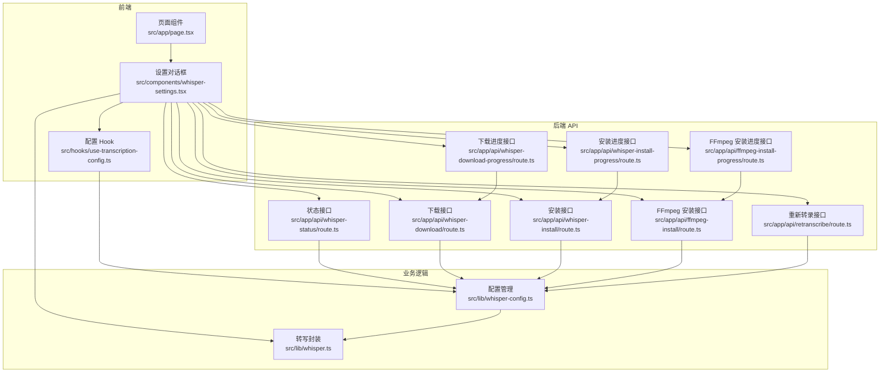
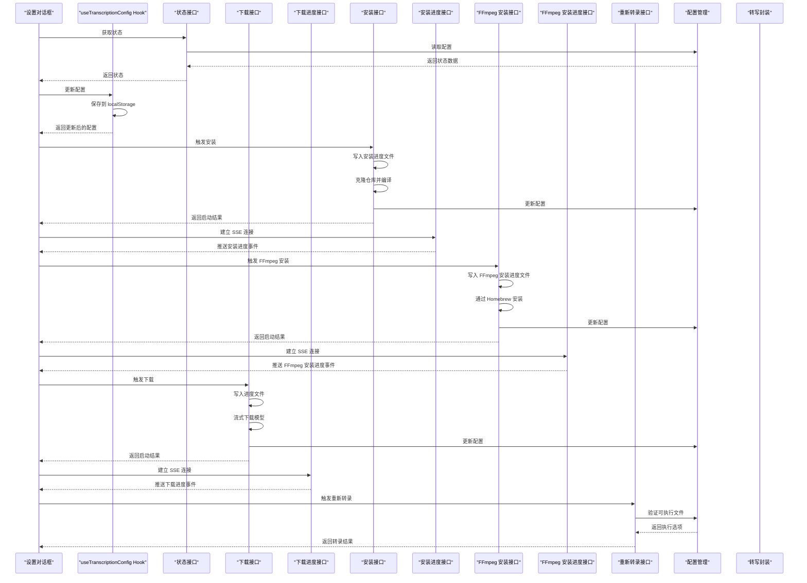
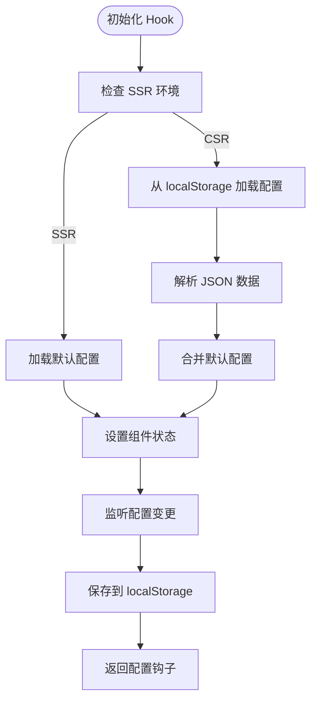
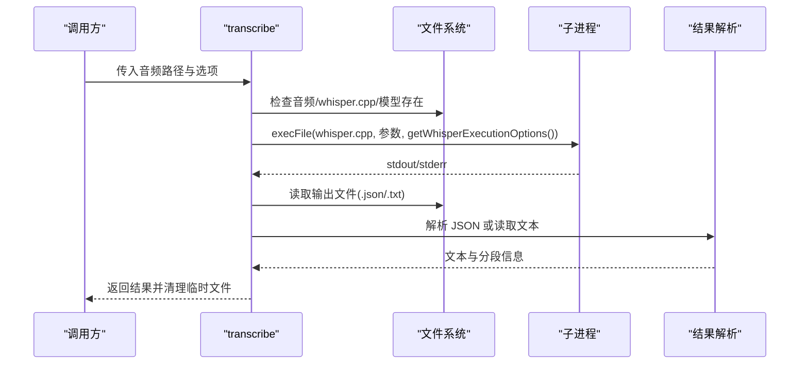
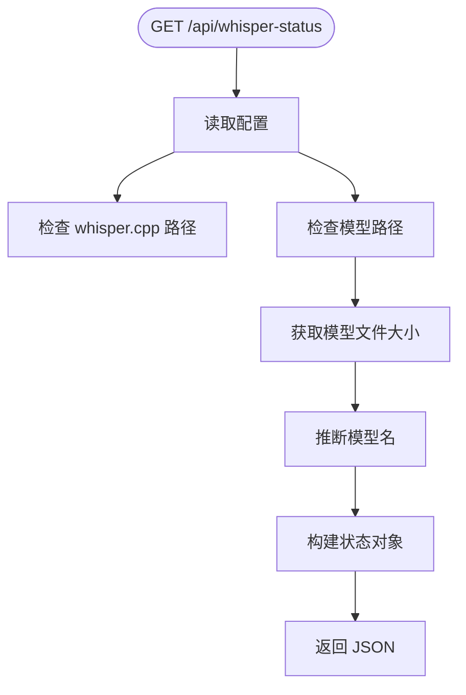
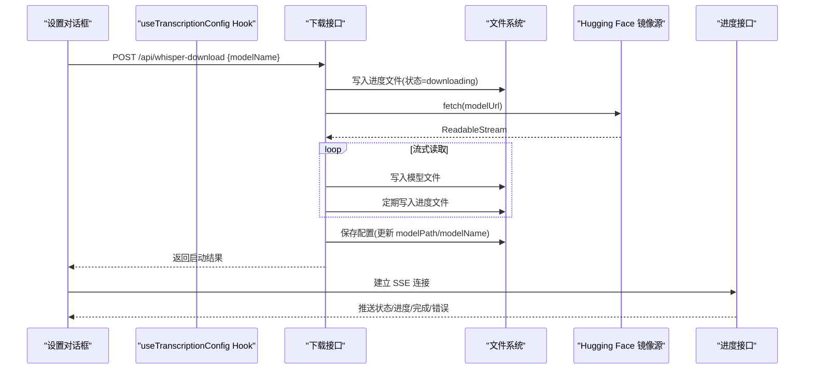
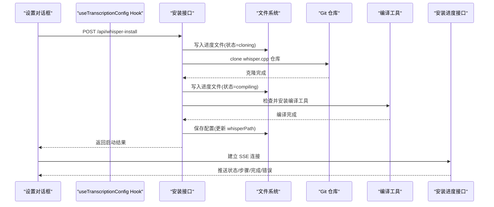
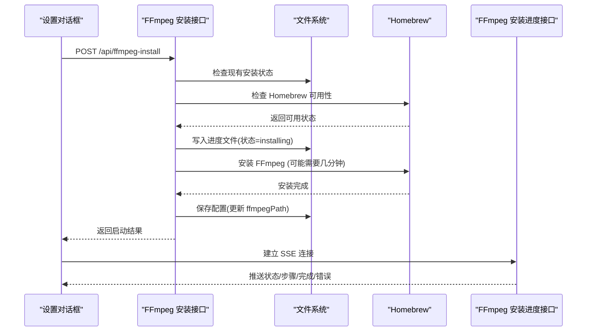
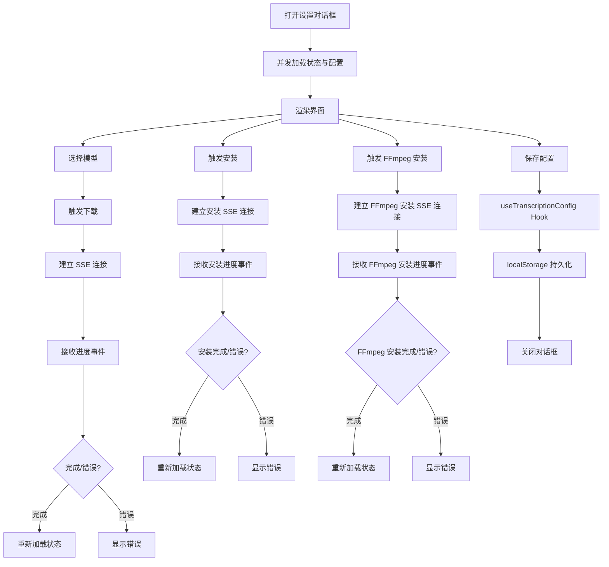
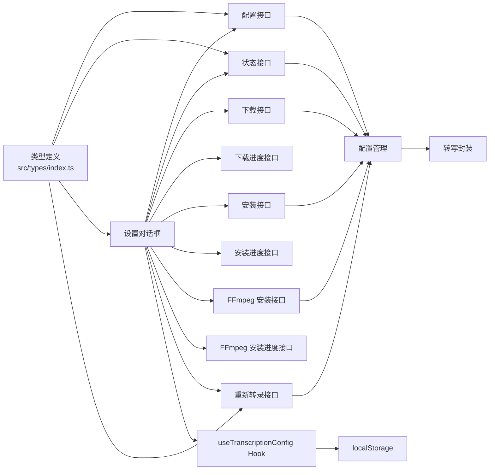

# Whisper 配置管理

<cite>
**本文档引用的文件**
- [src/hooks/use-transcription-config.ts](file://src/hooks/use-transcription-config.ts)
- [src/lib/whisper-config.ts](file://src/lib/whisper-config.ts)
- [src/lib/whisper.ts](file://src/lib/whisper.ts)
- [src/app/api/whisper-status/route.ts](file://src/app/api/whisper-status/route.ts)
- [src/app/api/whisper-download/route.ts](file://src/app/api/whisper-download/route.ts)
- [src/app/api/whisper-download-progress/route.ts](file://src/app/api/whisper-download-progress/route.ts)
- [src/app/api/whisper-status/route.ts](file://src/app/api/whisper-status/route.ts)
- [src/app/api/whisper-install/route.ts](file://src/app/api/whisper-install/route.ts)
- [src/app/api/whisper-install-progress/route.ts](file://src/app/api/whisper-install-progress/route.ts)
- [src/app/api/ffmpeg-install/route.ts](file://src/app/api/ffmpeg-install/route.ts)
- [src/app/api/ffmpeg-install-progress/route.ts](file://src/app/api/ffmpeg-install-progress/route.ts)
- [src/app/api/retranscribe/route.ts](file://src/app/api/retranscribe/route.ts)
- [src/components/whisper-settings.tsx](file://src/components/whisper-settings.tsx)
- [src/types/index.ts](file://src/types/index.ts)
- [setup-whisper.sh](file://setup-whisper.sh)
- [package.json](file://package.json)
- [README.md](file://README.md)
- [src/app/page.tsx](file://src/app/page.tsx)
</cite>

## 更新摘要
**所做更改**
- 完全迁移至客户端 localStorage 配置管理，移除服务器端配置 API
- 新增 useTranscriptionConfig hook 提供统一的多引擎配置结构
- 保留服务器端状态检查 API 以支持环境验证
- 更新配置同步机制，实现前端与后端的协同工作
- 新增在线 ASR 引擎配置支持

## 目录
1. [简介](#简介)
2. [项目结构](#项目结构)
3. [核心组件](#核心组件)
4. [架构总览](#架构总览)
5. [详细组件分析](#详细组件分析)
6. [依赖关系分析](#依赖关系分析)
7. [性能考虑](#性能考虑)
8. [故障排除指南](#故障排除指南)
9. [结论](#结论)

## 简介
本文件为 Whisper 配置管理系统的综合技术文档，围绕本地语音识别模型的配置、下载与状态管理展开，涵盖以下主题：
- **全新**：客户端 localStorage 配置管理，完全替代服务器端配置 API
- **新增**：useTranscriptionConfig hook 提供统一的多引擎配置结构
- Whisper 模型配置项：模型路径、线程数、输出目录等
- 性能参数调优：线程数与模型大小的关系
- 模型下载流程：进度跟踪、完整性校验与错误恢复
- 配置状态检查与验证：安装状态监控与兼容性检测
- **新增**：在线 ASR 引擎配置支持（千问 ASR）
- 配置文件管理最佳实践：路径规范、权限与版本控制
- 故障排除与常见问题解决

## 项目结构
该项目采用 Next.js 应用结构，前端组件与后端 API 路由分离，核心逻辑集中在 lib 层与 API 路由层，UI 通过对话框组件提供交互。**重大变更**：配置管理完全迁移到客户端，服务器端仅提供状态检查和下载服务。

**图表来源**
- [src/app/page.tsx:1-243](file://src/app/page.tsx#L1-L243)
- [src/components/whisper-settings.tsx:1-1251](file://src/components/whisper-settings.tsx#L1-L1251)
- [src/hooks/use-transcription-config.ts:1-148](file://src/hooks/use-transcription-config.ts#L1-L148)
- [src/app/api/whisper-status/route.ts:1-66](file://src/app/api/whisper-status/route.ts#L1-L66)
- [src/app/api/whisper-download/route.ts:1-235](file://src/app/api/whisper-download/route.ts#L1-L235)
- [src/app/api/whisper-download-progress/route.ts:1-141](file://src/app/api/whisper-download-progress/route.ts#L1-L141)
- [src/app/api/whisper-install/route.ts:1-220](file://src/app/api/whisper-install/route.ts#L1-L220)
- [src/app/api/whisper-install-progress/route.ts:1-101](file://src/app/api/whisper-install-progress/route.ts#L1-L101)
- [src/app/api/ffmpeg-install/route.ts:1-229](file://src/app/api/ffmpeg-install/route.ts#L1-L229)
- [src/app/api/ffmpeg-install-progress/route.ts:1-101](file://src/app/api/ffmpeg-install-progress/route.ts#L1-L101)
- [src/app/api/retranscribe/route.ts:1-200](file://src/app/api/retranscribe/route.ts#L1-L200)
- [src/lib/whisper-config.ts:1-398](file://src/lib/whisper-config.ts#L1-L398)
- [src/lib/whisper.ts:1-261](file://src/lib/whisper.ts#L1-L261)

**章节来源**
- [src/app/page.tsx:1-243](file://src/app/page.tsx#L1-L243)
- [src/components/whisper-settings.tsx:1-1251](file://src/components/whisper-settings.tsx#L1-L1251)
- [src/hooks/use-transcription-config.ts:1-148](file://src/hooks/use-transcription-config.ts#L1-L148)
- [src/app/api/whisper-status/route.ts:1-66](file://src/app/api/whisper-status/route.ts#L1-L66)
- [src/app/api/whisper-download/route.ts:1-235](file://src/app/api/whisper-download/route.ts#L1-L235)
- [src/app/api/whisper-download-progress/route.ts:1-141](file://src/app/api/whisper-download-progress/route.ts#L1-L141)
- [src/app/api/whisper-install/route.ts:1-220](file://src/app/api/whisper-install/route.ts#L1-L220)
- [src/app/api/whisper-install-progress/route.ts:1-101](file://src/app/api/whisper-install-progress/route.ts#L1-L101)
- [src/app/api/ffmpeg-install/route.ts:1-229](file://src/app/api/ffmpeg-install/route.ts#L1-L229)
- [src/app/api/ffmpeg-install-progress/route.ts:1-101](file://src/app/api/ffmpeg-install-progress/route.ts#L1-L101)
- [src/app/api/retranscribe/route.ts:1-200](file://src/app/api/retranscribe/route.ts#L1-L200)
- [src/lib/whisper-config.ts:1-398](file://src/lib/whisper-config.ts#L1-L398)
- [src/lib/whisper.ts:1-261](file://src/lib/whisper.ts#L1-L261)

## 核心组件
- **新增**：useTranscriptionConfig hook：提供客户端配置管理，自动同步 localStorage 与组件状态
- 配置管理模块：负责读取/保存配置、环境变量覆盖、模型名推断与文件大小格式化
- 转写封装模块：封装 whisper.cpp 的调用，提供转写能力与结果解析
- API 路由：提供状态查询、模型下载与进度推送（配置管理仍由前端处理）
- **新增**：多引擎配置结构：支持本地 Whisper 和在线 ASR 引擎的统一管理

**章节来源**
- [src/hooks/use-transcription-config.ts:1-148](file://src/hooks/use-transcription-config.ts#L1-L148)
- [src/lib/whisper-config.ts:1-398](file://src/lib/whisper-config.ts#L1-L398)
- [src/lib/whisper.ts:1-261](file://src/lib/whisper.ts#L1-L261)
- [src/app/api/whisper-status/route.ts:1-66](file://src/app/api/whisper-status/route.ts#L1-L66)
- [src/app/api/whisper-download/route.ts:1-235](file://src/app/api/whisper-download/route.ts#L1-L235)
- [src/app/api/whisper-download-progress/route.ts:1-141](file://src/app/api/whisper-download-progress/route.ts#L1-L141)
- [src/components/whisper-settings.tsx:1-1251](file://src/components/whisper-settings.tsx#L1-L1251)

## 架构总览
系统采用混合架构：前端通过 useTranscriptionConfig hook 管理配置（localStorage），后端 API 路由处理业务逻辑并将结果以 JSON/SSE 形式返回；底层通过子进程调用 whisper.cpp 可执行文件完成转写。**重大变更**：配置管理完全迁移到客户端，服务器端仅提供必要的状态检查和下载服务。

**图表来源**
- [src/components/whisper-settings.tsx:240-268](file://src/components/whisper-settings.tsx#L240-L268)
- [src/hooks/use-transcription-config.ts:84-148](file://src/hooks/use-transcription-config.ts#L84-L148)
- [src/app/api/whisper-status/route.ts:11-59](file://src/app/api/whisper-status/route.ts#L11-L59)
- [src/app/api/whisper-install/route.ts:179-219](file://src/app/api/whisper-install/route.ts#L179-L219)
- [src/app/api/whisper-install-progress/route.ts:23-100](file://src/app/api/whisper-install-progress/route.ts#L23-L100)
- [src/app/api/ffmpeg-install/route.ts:186-228](file://src/app/api/ffmpeg-install/route.ts#L186-L228)
- [src/app/api/ffmpeg-install-progress/route.ts:23-100](file://src/app/api/ffmpeg-install-progress/route.ts#L23-L100)
- [src/app/api/whisper-download/route.ts:173-234](file://src/app/api/whisper-download/route.ts#L173-L234)
- [src/app/api/whisper-download-progress/route.ts:45-140](file://src/app/api/whisper-download-progress/route.ts#L45-L140)
- [src/app/api/retranscribe/route.ts:56-57](file://src/app/api/retranscribe/route.ts#L56-L57)
- [src/lib/whisper-config.ts:57-92](file://src/lib/whisper-config.ts#L57-L92)
- [src/lib/whisper.ts:54-156](file://src/lib/whisper.ts#L54-L156)

## 详细组件分析

### useTranscriptionConfig Hook（新增）

**重大架构变更**：
- **完全客户端配置管理**：使用 localStorage 替代服务器端配置 API
- **统一多引擎配置结构**：支持本地 Whisper 和在线 ASR 引擎的统一管理
- **自动同步机制**：配置变更时自动持久化到 localStorage
- **SSR 兼容性**：在服务器端渲染环境下返回默认配置

**核心功能**：
- 配置存储：使用 localStorage 键 "linksy-transcription-config"
- 默认配置：包含 activeEngine、whisper 和 onlineASR 三个部分
- 配置更新：提供 updateConfig、setActiveEngine、updateWhisperConfig、updateOnlineASRConfig 方法
- 自动持久化：配置变更时自动保存到 localStorage

**图表来源**
- [src/hooks/use-transcription-config.ts:84-148](file://src/hooks/use-transcription-config.ts#L84-L148)
- [src/hooks/use-transcription-config.ts:40-71](file://src/hooks/use-transcription-config.ts#L40-L71)

**章节来源**
- [src/hooks/use-transcription-config.ts:1-148](file://src/hooks/use-transcription-config.ts#L1-L148)

### 配置管理模块（src/lib/whisper-config.ts）

**保持不变的核心功能**：
- 配置文件路径：位于项目根目录的 .whisper-config.json
- 默认配置：包含 whisperPath、modelPath、modelName、threads、outputDir、ffmpegPath
- 环境变量覆盖：WHISPER_PATH、WHISPER_MODEL_PATH、WHISPER_THREADS、OUTPUT_DIR、FFMPEG_PATH
- 路径解析策略：
  - 绝对路径：直接使用
  - 相对路径：相对于项目根目录解析
  - 命令路径：通过 command -v 查找可执行文件
  - 项目名前缀：向后兼容旧版路径格式

**新增**：isValidFfmpegExecutable 函数，专门用于 FFmpeg 可执行文件验证

**图表来源**
- [src/lib/whisper-config.ts:57-74](file://src/lib/whisper-config.ts#L57-L74)
- [src/lib/whisper-config.ts:324-354](file://src/lib/whisper-config.ts#L324-L354)
- [src/lib/whisper-config.ts:361-372](file://src/lib/whisper-config.ts#L361-L372)

**章节来源**
- [src/lib/whisper-config.ts:1-398](file://src/lib/whisper-config.ts#L1-L398)

### 转写封装模块（src/lib/whisper.ts）
- 负责调用 whisper.cpp 可执行文件进行转写
- 关键能力：
  - 安装与模型存在性检查
  - 构造命令参数（模型路径、输入音频、语言、线程数、输出格式）
  - 解析 JSON/文本输出，提取转写文本与分段信息
  - 清理临时输出文件
  - 快速转写：优先使用 small 模型

**图表来源**
- [src/lib/whisper.ts:54-156](file://src/lib/whisper.ts#L54-L156)

**章节来源**
- [src/lib/whisper.ts:1-261](file://src/lib/whisper.ts#L1-L261)

### 状态 API（src/app/api/whisper-status/route.ts）
- GET /api/whisper-status：返回 whisper.cpp 与模型的安装状态、模型大小与模型名推断
- **保持不变**：服务器端状态检查，支持前端配置同步

**图表来源**
- [src/app/api/whisper-status/route.ts:11-59](file://src/app/api/whisper-status/route.ts#L11-L59)
- [src/lib/whisper-config.ts:99-107](file://src/lib/whisper-config.ts#L99-L107)

**章节来源**
- [src/app/api/whisper-status/route.ts:1-66](file://src/app/api/whisper-status/route.ts#L1-L66)
- [src/lib/whisper-config.ts:1-398](file://src/lib/whisper-config.ts#L1-L398)

### 模型下载与进度（src/app/api/whisper-download/route.ts、src/app/api/whisper-download-progress/route.ts）
- 下载接口：
  - 支持 small/medium 模型，使用 Hugging Face 镜像源
  - 后台异步下载，写入进度文件（models/.download-progress.json）
  - 流式读取响应体，定期更新进度，完成后更新配置
  - 异常时清理不完整文件并记录错误
- 进度接口：
  - SSE 推送下载进度，包含状态、已下载、总大小、百分比与错误信息
  - 客户端断开连接时正确清理资源

**图表来源**
- [src/app/api/whisper-download/route.ts:52-167](file://src/app/api/whisper-download/route.ts#L52-L167)
- [src/app/api/whisper-download-progress/route.ts:45-140](file://src/app/api/whisper-download-progress/route.ts#L45-L140)

**章节来源**
- [src/app/api/whisper-download/route.ts:1-235](file://src/app/api/whisper-download/route.ts#L1-L235)
- [src/app/api/whisper-download-progress/route.ts:1-137](file://src/app/api/whisper-download-progress/route.ts#L1-L137)

### whisper.cpp 安装与进度（src/app/api/whisper-install/route.ts、src/app/api/whisper-install-progress/route.ts）
- 安装接口：
  - 自动克隆 whisper.cpp 仓库，检查并安装编译工具
  - 后台异步编译，写入安装进度文件（.whisper-install-progress.json）
  - 编译完成后更新配置并返回成功状态
- 进度接口：
  - SSE 推送安装进度，包含状态、步骤说明与错误信息
  - 支持克隆阶段和编译阶段的状态跟踪

**图表来源**
- [src/app/api/whisper-install/route.ts:61-177](file://src/app/api/whisper-install/route.ts#L61-L177)
- [src/app/api/whisper-install-progress/route.ts:23-100](file://src/app/api/whisper-install-progress/route.ts#L23-L100)

**章节来源**
- [src/app/api/whisper-install/route.ts:1-220](file://src/app/api/whisper-install/route.ts#L1-L220)
- [src/app/api/whisper-install-progress/route.ts:1-101](file://src/app/api/whisper-install-progress/route.ts#L1-L101)

### FFmpeg 安装与进度（src/app/api/ffmpeg-install/route.ts、src/app/api/ffmpeg-install-progress/route.ts）
**新增功能**：
- 安装接口：
  - 通过 Homebrew 自动安装 FFmpeg，支持 macOS 系统
  - 检测并修复依赖库链接问题，提高安装成功率
  - 后台异步安装，写入进度文件（.ffmpeg-install-progress.json）
  - 安装完成后自动更新配置并返回成功状态
- 进度接口：
  - SSE 推送安装进度，包含状态、步骤说明与错误信息
  - 支持检查 Homebrew 锁文件，避免并发安装冲突
  - 提供详细的错误诊断和解决方案

**图表来源**
- [src/app/api/ffmpeg-install/route.ts:186-228](file://src/app/api/ffmpeg-install/route.ts#L186-L228)
- [src/app/api/ffmpeg-install-progress/route.ts:23-100](file://src/app/api/ffmpeg-install-progress/route.ts#L23-L100)

**章节来源**
- [src/app/api/ffmpeg-install/route.ts:1-229](file://src/app/api/ffmpeg-install/route.ts#L1-L229)
- [src/app/api/ffmpeg-install-progress/route.ts:1-101](file://src/app/api/ffmpeg-install-progress/route.ts#L1-L101)

### 重新转录功能（src/app/api/retranscribe/route.ts）
- 支持流式转录，实时解析输出并提供进度反馈
- 使用 getWhisperExecutionOptions 优化执行环境
- 集成进度监控和超时处理机制

**章节来源**
- [src/app/api/retranscribe/route.ts:1-200](file://src/app/api/retranscribe/route.ts#L1-L200)
- [src/lib/whisper-config.ts:183-216](file://src/lib/whisper-config.ts#L183-L216)

### 设置对话框（src/components/whisper-settings.tsx）
- 功能：
  - 加载状态与配置：并发请求状态与配置接口
  - 模型选择：small/medium，动态更新 modelPath
  - 下载流程：触发下载并建立 SSE 连接跟踪进度
  - 安装流程：触发安装并建立 SSE 连接跟踪进度
  - **新增**：FFmpeg 安装流程：触发 FFmpeg 安装并建立 SSE 连接跟踪进度
  - 配置保存：通过 useTranscriptionConfig hook 更新配置
  - 错误处理：统一错误提示与资源清理

**图表来源**
- [src/components/whisper-settings.tsx:240-268](file://src/components/whisper-settings.tsx#L240-L268)
- [src/components/whisper-settings.tsx:505-519](file://src/components/whisper-settings.tsx#L505-L519)
- [src/hooks/use-transcription-config.ts:84-148](file://src/hooks/use-transcription-config.ts#L84-L148)

**章节来源**
- [src/components/whisper-settings.tsx:1-1251](file://src/components/whisper-settings.tsx#L1-L1251)

## 依赖关系分析
- 类型定义：WhisperConfig、WhisperStatus、ApiResponse、TranscriptionConfig
- 运行时依赖：Node.js fs/path/child_process，Next.js API 路由
- 第三方依赖：React、Radix UI 组件库、Tailwind CSS

**图表来源**
- [src/types/index.ts:1-67](file://src/types/index.ts#L1-L67)
- [src/app/api/whisper-status/route.ts:1-66](file://src/app/api/whisper-status/route.ts#L1-L66)
- [src/components/whisper-settings.tsx:1-1251](file://src/components/whisper-settings.tsx#L1-L1251)
- [src/hooks/use-transcription-config.ts:1-148](file://src/hooks/use-transcription-config.ts#L1-L148)
- [src/lib/whisper-config.ts:1-398](file://src/lib/whisper-config.ts#L1-L398)
- [src/lib/whisper.ts:1-261](file://src/lib/whisper.ts#L1-L261)

**章节来源**
- [src/types/index.ts:1-67](file://src/types/index.ts#L1-L67)
- [package.json:1-37](file://package.json#L1-L37)

## 性能考虑
- 线程数配置：通过 WHISPER_THREADS 或配置中的 threads 控制，建议设置为 CPU 核心数的一半以平衡吞吐与资源占用
- 模型选择：small 模型体积小、速度更快，medium 模型质量更高但体积更大，需根据场景权衡
- 下载性能：使用流式读取与定期进度更新，避免频繁磁盘写入；完成后一次性更新配置
- 转写性能：合理设置线程数与模型大小，避免过度占用系统资源
- 安装性能：编译过程可能耗时较长，建议在空闲时段进行
- **新增**：localStorage 配置缓存：useTranscriptionConfig hook 自动缓存配置到内存，减少重复读取
- **新增**：SSR 兼容性：在服务器端渲染环境下返回默认配置，避免客户端特定 API 访问
- **新增**：配置同步延迟：useTranscriptionConfig hook 在配置变更时有轻微延迟，避免频繁 localStorage 写入

## 故障排除指南
- 无法找到 whisper.cpp：
  - 现象：状态显示未安装，转写时报错
  - 处理：运行安装脚本初始化环境，确认可执行文件路径
  - 参考：[setup-whisper.sh:1-47](file://setup-whisper.sh#L1-L47)
- 模型文件缺失：
  - 现象：状态显示模型未安装
  - 处理：通过设置对话框下载模型，或手动放置模型文件
  - 参考：[src/app/api/whisper-download/route.ts:201-214](file://src/app/api/whisper-download/route.ts#L201-L214)
- 下载中断或失败：
  - 现象：进度停留在 downloading，最终 error
  - 处理：检查网络与存储空间，清理不完整文件后重试
  - 参考：[src/app/api/whisper-download/route.ts:147-166](file://src/app/api/whisper-download/route.ts#L147-L166)
- 安装中断或失败：
  - 现象：进度停留在 cloning 或 compiling，最终 error
  - 处理：检查网络连接和编译工具，清理进度文件后重试
  - 参考：[src/app/api/whisper-install/route.ts:91-99](file://src/app/api/whisper-install/route.ts#L91-L99)
- **新增**：localStorage 配置丢失：
  - 现象：刷新页面后配置消失
  - 处理：检查浏览器隐私设置，确认允许使用 localStorage；查看浏览器开发者工具的 Application 面板
  - 参考：[src/hooks/use-transcription-config.ts:63-71](file://src/hooks/use-transcription-config.ts#L63-L71)
- **新增**：配置同步失败：
  - 现象：前端显示的配置与实际不一致
  - 处理：检查 useTranscriptionConfig hook 的初始化，确认组件正确挂载；查看浏览器控制台错误
  - 参考：[src/hooks/use-transcription-config.ts:89-92](file://src/hooks/use-transcription-config.ts#L89-L92)
- **新增**：SSR 环境下配置异常：
  - 现象：服务器端渲染时配置行为异常
  - 处理：useTranscriptionConfig hook 会在 SSR 环境下返回默认配置，这是预期行为
  - 参考：[src/hooks/use-transcription-config.ts:41-43](file://src/hooks/use-transcription-config.ts#L41-L43)
- **新增**：FFmpeg 安装失败：
  - 现象：FFmpeg 安装进度停留在 installing，最终 error
  - 处理：检查 Homebrew 可用性，清理锁文件后重试；参考错误信息中的具体解决方案
  - 参考：[src/app/api/ffmpeg-install/route.ts:147-154](file://src/app/api/ffmpeg-install/route.ts#L147-L154)
- **新增**：SSE 连接异常：
  - 现象：进度事件丢失或连接中断
  - 处理：检查网络连接，确认服务器端口可达；前端会自动清理和重连
  - 参考：[src/app/api/whisper-install-progress/route.ts:83-90](file://src/app/api/whisper-install-progress/route.ts#L83-L90)
- 配置保存失败：
  - 现象：POST /api/whisper-config 返回错误
  - 处理：检查请求体格式与字段类型，确保 threads 为正整数
  - 参考：[src/app/api/whisper-config/route.ts:59-96](file://src/app/api/whisper-config/route.ts#L59-L96)
- 转写执行失败：
  - 现象：execFile 报错或读取输出失败
  - 处理：确认 whisper.cpp 与模型路径正确，查看 stderr 详情
  - 参考：[src/lib/whisper.ts:103-108](file://src/lib/whisper.ts#L103-L108)
- **新增**：可执行文件验证失败：
  - 现象：isValidWhisperExecutable 返回 false
  - 处理：检查文件权限，确认可执行文件完整，查看详细错误日志
  - 参考：[src/lib/whisper-config.ts:123-181](file://src/lib/whisper-config.ts#L123-L181)
- **新增**：动态库路径问题：
  - 现象：运行时缺少动态库
  - 处理：确认 getWhisperExecutionOptions 正确配置 DYLD_LIBRARY_PATH/LD_LIBRARY_PATH
  - 参考：[src/lib/whisper-config.ts:183-216](file://src/lib/whisper-config.ts#L183-L216)

**章节来源**
- [setup-whisper.sh:1-47](file://setup-whisper.sh#L1-L47)
- [src/app/api/whisper-download/route.ts:147-166](file://src/app/api/whisper-download/route.ts#L147-L166)
- [src/app/api/whisper-install/route.ts:91-99](file://src/app/api/whisper-install/route.ts#L91-L99)
- [src/hooks/use-transcription-config.ts:63-71](file://src/hooks/use-transcription-config.ts#L63-L71)
- [src/hooks/use-transcription-config.ts:41-43](file://src/hooks/use-transcription-config.ts#L41-L43)
- [src/app/api/ffmpeg-install/route.ts:147-154](file://src/app/api/ffmpeg-install/route.ts#L147-L154)
- [src/app/api/whisper-config/route.ts:59-96](file://src/app/api/whisper-config/route.ts#L59-L96)
- [src/lib/whisper.ts:103-108](file://src/lib/whisper.ts#L103-L108)
- [src/lib/whisper-config.ts:123-181](file://src/lib/whisper-config.ts#L123-L181)
- [src/lib/whisper-config.ts:183-216](file://src/lib/whisper-config.ts#L183-L216)

## 结论
本 Whisper 配置管理系统经过重大架构升级，完全迁移到客户端 localStorage 配置管理模式。通过 useTranscriptionConfig hook 提供了统一的多引擎配置结构，支持本地 Whisper 和在线 ASR 引擎的无缝切换。服务器端 API 专注于提供必要的状态检查和下载服务，实现了前后端职责的清晰分离。

**重大架构变更**：
- **完全客户端配置管理**：useTranscriptionConfig hook 替代服务器端配置 API，使用 localStorage 实现配置持久化
- **统一多引擎配置结构**：支持本地 Whisper 和在线 ASR 引擎的统一管理，提供更好的用户体验
- **SSR 兼容性**：在服务器端渲染环境下自动降级为默认配置，确保应用的稳定性
- **配置同步机制**：前端与后端的协同工作，前端负责配置管理，后端负责状态检查和下载服务
- **增强的错误处理**：localStorage 配置丢失、SSR 环境下的配置异常等场景的优雅处理

建议在生产环境中结合实际硬件条件调整线程数与模型大小，并完善日志与监控以便快速定位问题。新的配置管理系统显著提升了在不同环境中的可靠性，为用户提供了更加稳定和易用的体验。localStorage 配置管理方案不仅简化了部署复杂度，还提高了应用的响应速度和用户体验。