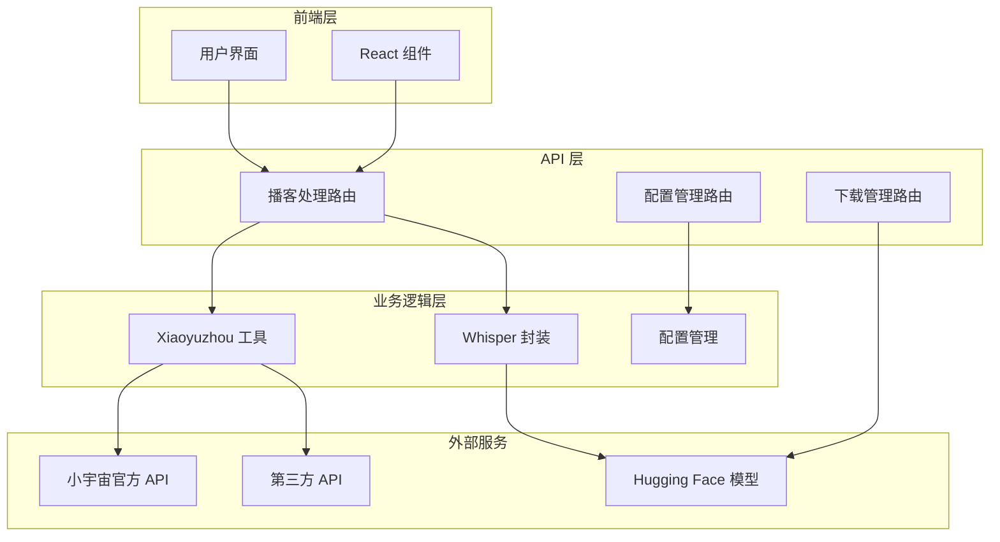
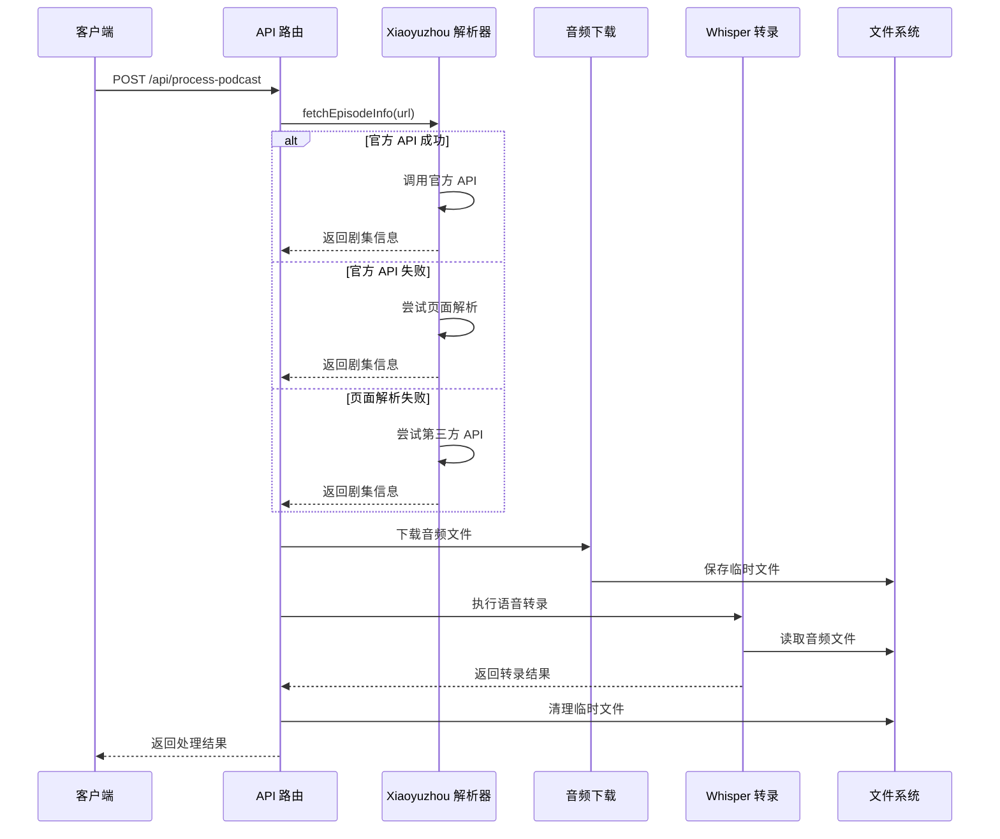
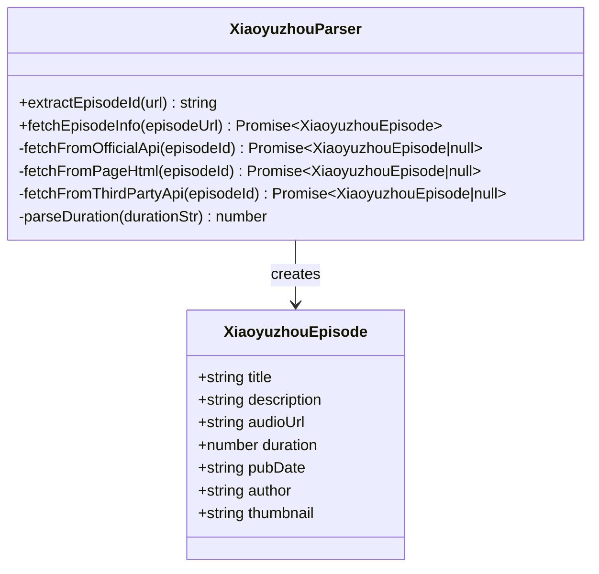
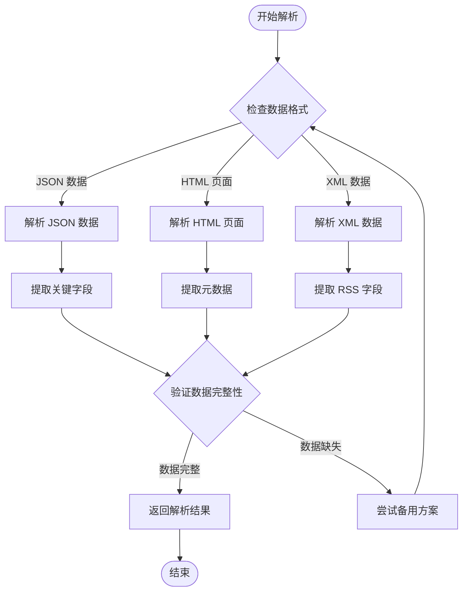
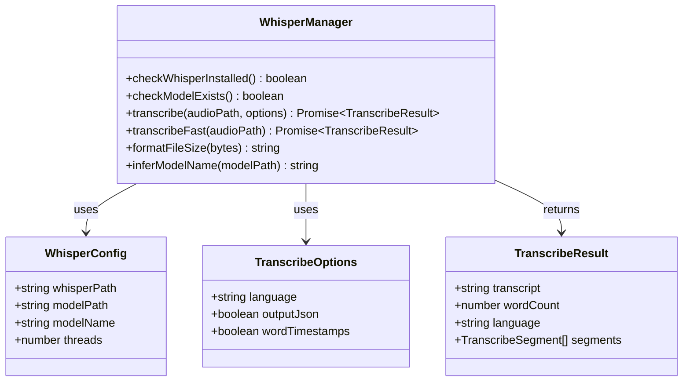
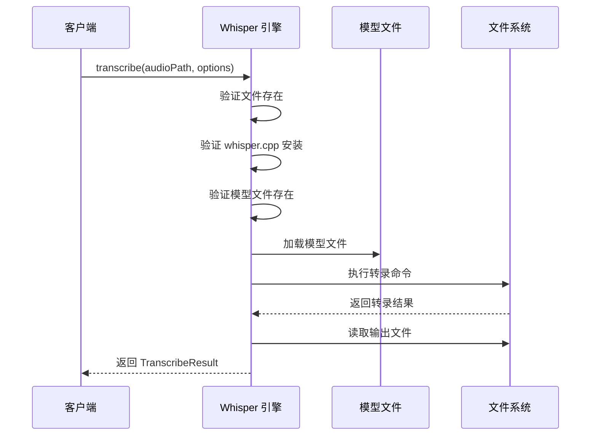
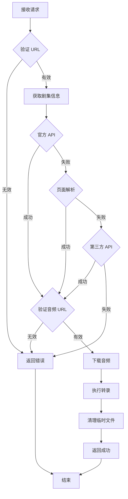
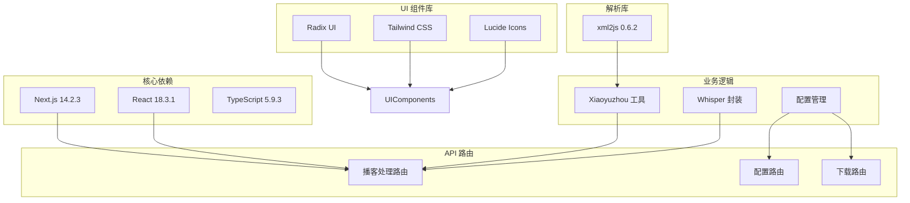

# 小宇宙平台集成

<cite>
**本文档引用的文件**
- [xiaoyuzhou.ts](file://src/lib/xiaoyuzhou.ts)
- [route.ts](file://src/app/api/process-podcast/route.ts)
- [whisper.ts](file://src/lib/whisper.ts)
- [whisper-config.ts](file://src/lib/whisper-config.ts)
- [index.ts](file://src/types/index.ts)
- [README.md](file://README.md)
- [package.json](file://package.json)
- [setup-whisper.sh](file://setup-whisper.sh)
- [whisper-config/route.ts](file://src/app/api/whisper-config/route.ts)
- [whisper-download/route.ts](file://src/app/api/whisper-download/route.ts)
- [whisper-download-progress/route.ts](file://src/app/api/whisper-download-progress/route.ts)
- [whisper-status/route.ts](file://src/app/api/whisper-status/route.ts)
</cite>

## 目录
1. [简介](#简介)
2. [项目结构](#项目结构)
3. [核心组件](#核心组件)
4. [架构概览](#架构概览)
5. [详细组件分析](#详细组件分析)
6. [依赖关系分析](#依赖关系分析)
7. [性能考虑](#性能考虑)
8. [故障排除指南](#故障排除指南)
9. [结论](#结论)
10. [附录](#附录)

## 简介

MemoFlow 是一个基于 AI 的内容分析与创作助手，专门针对小宇宙平台的播客内容进行深度集成。该项目实现了从播客链接解析、剧集信息提取到音频文件获取的完整技术流程，为用户提供智能化的内容分析和笔记生成功能。

小宇宙平台集成的核心目标是：
- **链接解析**：从用户提供的小宇宙播客链接中提取剧集信息
- **剧集信息提取**：获取音频文件、标题、描述、作者、封面等元数据
- **音频文件获取**：下载高质量音频文件供后续转录处理
- **多策略提取机制**：提供备用方案和容错处理，确保高成功率
- **AI 转录集成**：与 whisper.cpp 深度集成，提供中文语音转写能力

## 项目结构

项目采用 Next.js 应用架构，主要分为以下几个层次：



**图表来源**
- [route.ts:1-127](file://src/app/api/process-podcast/route.ts#L1-L127)
- [xiaoyuzhou.ts:1-219](file://src/lib/xiaoyuzhou.ts#L1-L219)

**章节来源**
- [README.md:1-27](file://README.md#L1-L27)
- [package.json:1-37](file://package.json#L1-L37)

## 核心组件

### Xiaoyuzhou 播客工具

Xiaoyuzhou 工具是整个系统的核心组件，负责与小宇宙平台进行交互。它提供了三种不同的数据获取策略：

1. **官方 API 策略**：直接调用小宇宙官方 API 获取最准确的数据
2. **页面解析策略**：从网页 HTML 中提取数据，作为备用方案
3. **第三方 API 策略**：使用第三方服务获取替代数据源

### Whisper 集成模块

Whisper 集成模块提供了完整的语音转录功能，包括：
- 模型文件管理
- 转录参数配置
- 进度监控
- 错误处理

### 配置管理系统

配置管理系统负责管理 Whisper.cpp 的各种配置参数，包括：
- 可执行文件路径
- 模型文件路径
- 线程数设置
- 环境变量覆盖

**章节来源**
- [xiaoyuzhou.ts:1-219](file://src/lib/xiaoyuzhou.ts#L1-L219)
- [whisper.ts:1-229](file://src/lib/whisper.ts#L1-L229)
- [whisper-config.ts:1-105](file://src/lib/whisper-config.ts#L1-L105)

## 架构概览

系统采用分层架构设计，确保各组件之间的松耦合和高内聚：



**图表来源**
- [route.ts:13-114](file://src/app/api/process-podcast/route.ts#L13-L114)
- [xiaoyuzhou.ts:27-47](file://src/lib/xiaoyuzhou.ts#L27-L47)

## 详细组件分析

### Xiaoyuzhou Episode 解析器

Xiaoyuzhou 解析器实现了复杂的多策略数据获取机制：

#### 核心接口定义



**图表来源**
- [xiaoyuzhou.ts:5-13](file://src/lib/xiaoyuzhou.ts#L5-L13)
- [xiaoyuzhou.ts:19-47](file://src/lib/xiaoyuzhou.ts#L19-L47)

#### 多策略提取机制

系统实现了三层数据获取策略，确保高成功率：

1. **官方 API 策略**（优先级最高）
   - 调用小宇宙官方 API：`https://api.xiaoyuzhoufm.com/v1/episode/get`
   - 使用特定的请求头和认证信息
   - 支持 10 秒超时控制

2. **页面解析策略**（备用方案）
   - 抓取小宇宙页面：`https://www.xiaoyuzhoufm.com/episode/{episodeId}`
   - 从 `__NEXT_DATA__` 中提取结构化数据
   - 支持从 og:audio meta 标签提取音频链接
   - 回退到页面中的任意音频链接

3. **第三方 API 策略**（最终备用）
   - 调用第三方服务：`https://music.moon.fm/api/v1/episodes/{episodeId}`
   - 提供替代的数据源
   - 支持 10 秒超时控制

#### 数据解析逻辑

系统支持多种数据格式的解析：



**图表来源**
- [xiaoyuzhou.ts:52-89](file://src/lib/xiaoyuzhou.ts#L52-L89)
- [xiaoyuzhou.ts:94-164](file://src/lib/xiaoyuzhou.ts#L94-L164)

**章节来源**
- [xiaoyuzhou.ts:1-219](file://src/lib/xiaoyuzhou.ts#L1-L219)

### Whisper 转录引擎

Whisper 转录引擎提供了完整的语音转录功能，支持多种输出格式：

#### 转录配置管理



**图表来源**
- [whisper.ts:16-33](file://src/lib/whisper.ts#L16-L33)
- [whisper-config.ts:7-12](file://src/lib/whisper-config.ts#L7-L12)

#### 转录流程控制



**图表来源**
- [whisper.ts:54-156](file://src/lib/whisper.ts#L54-L156)

**章节来源**
- [whisper.ts:1-229](file://src/lib/whisper.ts#L1-L229)
- [whisper-config.ts:1-105](file://src/lib/whisper-config.ts#L1-L105)

### API 路由系统

API 路由系统提供了完整的 RESTful 接口，支持播客处理和配置管理：

#### 主要 API 端点

| 端点 | 方法 | 功能 | 请求体 | 响应 |
|------|------|------|--------|------|
| `/api/process-podcast` | POST | 处理播客链接 | `{ url: string }` | `{ success: boolean, data: ProcessResult }` |
| `/api/whisper-config` | GET | 获取配置 | 无 | `{ success: boolean, data: WhisperConfig }` |
| `/api/whisper-config` | POST | 保存配置 | WhisperConfig | `{ success: boolean, data: WhisperConfig }` |
| `/api/whisper-download` | POST | 下载模型 | `{ modelName: string }` | `{ success: boolean, message: string }` |
| `/api/whisper-download-progress` | GET | SSE 进度流 | 无 | SSE 流 |
| `/api/whisper-status` | GET | 获取状态 | 无 | `{ success: boolean, data: WhisperStatus }` |

#### 播客处理流程



**图表来源**
- [route.ts:13-114](file://src/app/api/process-podcast/route.ts#L13-L114)

**章节来源**
- [route.ts:1-127](file://src/app/api/process-podcast/route.ts#L1-L127)
- [whisper-config/route.ts:1-124](file://src/app/api/whisper-config/route.ts#L1-L124)

## 依赖关系分析

项目的主要依赖关系如下：



**图表来源**
- [package.json:12-35](file://package.json#L12-L35)
- [xiaoyuzhou.ts](file://src/lib/xiaoyuzhou.ts#L3)
- [whisper.ts:4-6](file://src/lib/whisper.ts#L4-L6)

**章节来源**
- [package.json:1-37](file://package.json#L1-L37)

## 性能考虑

### 超时控制

系统在各个网络请求中都设置了合理的超时控制：

- **官方 API 超时**：10 秒
- **页面解析超时**：15 秒  
- **第三方 API 超时**：10 秒
- **音频下载超时**：无显式超时（根据网络情况）

### 缓存策略

系统采用了多层次的缓存策略：

1. **临时文件缓存**：音频文件下载后存储在系统临时目录
2. **配置缓存**：Whisper 配置存储在本地文件中
3. **进度缓存**：模型下载进度存储在进度文件中

### 并发处理

系统支持并发处理多个播客请求，但需要注意：

- Whisper 转录操作是 CPU 密集型，建议合理设置线程数
- 模型文件访问需要互斥保护
- 磁盘空间管理需要监控

## 故障排除指南

### 常见问题及解决方案

#### 1. 小宇宙链接解析失败

**症状**：提示"无效的小宇宙链接格式"

**原因**：
- 链接格式不正确
- 网络连接问题
- 小宇宙平台结构调整

**解决方案**：
- 确认链接格式为 `https://www.xiaoyuzhoufm.com/episode/{episodeId}`
- 检查网络连接稳定性
- 查看是否有新的平台结构变化

#### 2. 音频文件下载失败

**症状**：提示"无法下载音频文件"

**原因**：
- 音频链接失效
- 网络超时
- 权限问题

**解决方案**：
- 检查音频链接的有效性
- 增加超时时间
- 检查防火墙设置

#### 3. Whisper 转录失败

**症状**：提示 whisper.cpp 未安装或模型文件不存在

**原因**：
- Whisper.cpp 未正确安装
- 模型文件路径配置错误
- 权限不足

**解决方案**：
- 运行 `bash setup-whisper.sh` 安装环境
- 检查 `.env` 文件中的路径配置
- 确保有足够的磁盘空间

#### 4. 模型下载中断

**症状**：模型下载进度异常或中断

**原因**：
- 网络连接不稳定
- 存储空间不足
- 进度文件损坏

**解决方案**：
- 检查网络连接稳定性
- 清理磁盘空间
- 删除损坏的进度文件

**章节来源**
- [xiaoyuzhou.ts:30-46](file://src/lib/xiaoyuzhou.ts#L30-L46)
- [route.ts:44-51](file://src/app/api/process-podcast/route.ts#L44-L51)
- [whisper.ts:69-81](file://src/lib/whisper.ts#L69-L81)

## 结论

小宇宙平台集成为 MemoFlow 项目提供了完整的播客内容处理能力。通过多策略提取机制、完善的错误处理和灵活的配置管理，系统能够在各种环境下稳定运行。

### 主要优势

1. **高可靠性**：多策略提取机制确保数据获取的成功率
2. **易扩展性**：模块化设计便于添加新的平台支持
3. **用户友好**：提供清晰的错误信息和进度反馈
4. **性能优化**：合理的超时控制和资源管理

### 未来改进方向

1. **增强缓存机制**：实现更智能的缓存策略
2. **监控告警**：添加系统健康监控和告警机制
3. **国际化支持**：扩展对其他语言的支持
4. **批量处理**：支持批量播客处理功能

## 附录

### API 调用示例

#### 处理播客链接

```bash
curl -X POST http://localhost:3000/api/process-podcast \
  -H "Content-Type: application/json" \
  -d '{"url": "https://www.xiaoyuzhoufm.com/episode/abc123def456"}'
```

#### 获取 Whisper 配置

```bash
curl http://localhost:3000/api/whisper-config
```

#### 保存 Whisper 配置

```bash
curl -X POST http://localhost:3000/api/whisper-config \
  -H "Content-Type: application/json" \
  -d '{
    "whisperPath": "/usr/local/bin/whisper.cpp/main",
    "modelPath": "/usr/local/models/ggml-small.bin",
    "modelName": "small",
    "threads": 4
  }'
```

### 响应处理模式

#### 成功响应格式

```json
{
  "success": true,
  "data": {
    "transcript": "转录结果文本",
    "audioUrl": "音频文件 URL",
    "wordCount": 1234,
    "language": "zh"
  }
}
```

#### 错误响应格式

```json
{
  "success": false,
  "error": "错误描述信息"
}
```

### 平台变更适配指南

当小宇宙平台发生结构变化时，需要重点关注以下方面：

1. **API 端点变更**：检查官方 API 的 URL 和参数格式
2. **页面结构变化**：更新 HTML 解析逻辑和选择器
3. **数据格式调整**：修改字段映射和解析逻辑
4. **认证机制更新**：调整请求头和认证方式

### 兼容性维护建议

1. **版本控制**：为每个平台版本建立独立的解析器
2. **向后兼容**：保持对旧版本数据格式的支持
3. **渐进式迁移**：逐步迁移到新版本而不影响现有功能
4. **监控告警**：建立平台变更的自动检测机制