# 播客转录功能

<cite>
**本文档引用的文件**
- [src/app/page.tsx](file://src/app/page.tsx)
- [src/app/podcast/page.tsx](file://src/app/podcast/page.tsx)
- [src/app/transcriptions/[id]/page.tsx](file://src/app/transcriptions/[id]/page.tsx)
- [src/app/transcriptions/page.tsx](file://src/app/transcriptions/page.tsx)
- [src/app/api/process-podcast/route.ts](file://src/app/api/process-podcast/route.ts)
- [src/app/api/retranscribe/route.ts](file://src/app/api/retranscribe/route.ts)
- [src/app/api/transcription-live/route.ts](file://src/app/api/transcription-live/route.ts)
- [src/app/api/transcribe-progress/route.ts](file://src/app/api/transcribe-progress/route.ts)
- [src/app/api/transcription-history/route.ts](file://src/app/api/transcription-history/route.ts)
- [src/app/api/whisper-status/route.ts](file://src/app/api/whisper-status/route.ts)
- [src/app/api/test-asr-connection/route.ts](file://src/app/api/test-asr-connection/route.ts)
- [src/components/transcription-detail.tsx](file://src/components/transcription-detail.tsx)
- [src/components/transcription-card.tsx](file://src/components/transcription-card.tsx)
- [src/components/sidebar.tsx](file://src/components/sidebar.tsx)
- [src/components/app-shell.tsx](file://src/components/app-shell.tsx)
- [src/components/whisper-settings.tsx](file://src/components/whisper-settings.tsx)
- [src/hooks/use-transcription-config.ts](file://src/hooks/use-transcription-config.ts)
- [src/lib/transcription-history.ts](file://src/lib/transcription-history.ts)
- [src/lib/xiaoyuzhou.ts](file://src/lib/xiaoyuzhou.ts)
- [src/lib/whisper.ts](file://src/lib/whisper.ts)
- [src/lib/whisper-config.ts](file://src/lib/whisper-config.ts)
- [src/lib/qwen-asr.ts](file://src/lib/qwen-asr.ts)
- [src/lib/transcription-output.ts](file://src/lib/transcription-output.ts)
- [src/lib/transcription-files.ts](file://src/lib/transcription-files.ts)
- [src/lib/transcription-progress.ts](file://src/lib/transcription-progress.ts)
- [src/types/index.ts](file://src/types/index.ts)
- [src/types/transcription-history.ts](file://src/types/transcription-history.ts)
- [src/app/layout.tsx](file://src/app/layout.tsx)
- [package.json](file://package.json)
</cite>

## 更新摘要
**所做更改**
- **新增多引擎架构支持**：系统现已支持本地 Whisper 和千问 ASR 两种转录引擎，用户可通过设置面板自由切换
- **引擎选择功能**：前端新增转录引擎选择面板，支持本地 Whisper 和在线千问 ASR 引擎的无缝切换
- **千问 ASR 集成**：完整实现阿里云千问 ASR 在线转录功能，支持 SSE 流式输出和实时进度跟踪
- **增强的转录进度跟踪**：改进的进度文件管理和状态同步机制，支持多引擎架构下的统一进度跟踪
- **重新转录引擎选择**：重新转录功能现已支持引擎选择，用户可针对已完成任务选择不同的转录引擎
- **配置持久化**：转录引擎配置已集成到全局配置系统，支持本地存储和跨会话持久化

## 目录
1. [简介](#简介)
2. [项目结构](#项目结构)
3. [核心组件](#核心组件)
4. [架构总览](#架构总览)
5. [详细组件分析](#详细组件分析)
6. [依赖关系分析](#依赖关系分析)
7. [性能考虑](#性能考虑)
8. [故障排除指南](#故障排除指南)
9. [结论](#结论)
10. [附录](#附录)

## 简介
本功能允许用户粘贴小宇宙播客链接，系统自动提取音频并进行本地语音转写，最终生成可复制的转录文本，并提供音频播放与字数统计等信息。系统采用全新的四库架构设计：路由层负责请求处理和状态管理，业务逻辑层封装核心算法和数据处理，数据持久化层管理历史记录和进度状态，UI组件层提供用户交互界面。新版本完全替换了原有的模拟转录系统，采用真实的 Whisper 语音转文本引擎，并引入了完整的转录历史记录功能、实时转录流和重新转录功能。

**更新** 新版本显著增强了SSE进度管理、自动重连机制、错误处理和用户界面优化，提供了更稳定可靠的转录体验。新增的多引擎架构支持本地 Whisper 和千问 ASR 两种转录引擎，用户可根据需求选择最适合的转录方案。智能重连机制确保了在网络不稳定情况下也能保持转录进度的连续性，800ms的推送间隔平衡了实时性和服务器负载，为用户提供了流畅的转录体验。

## 项目结构
项目采用 Next.js 应用结构，播客转录功能涉及以下关键模块：
- **路由系统**：独立的 `/podcast` 路由用于播客转录，`/transcriptions` 路由用于历史记录管理，`/transcriptions/[id]` 路由用于详细信息展示，`/` 路由作为专用首页
- **前端页面与组件**：播客转录页面、转录详情页面、转录历史页面、首页着陆页、UI 组件（Toast、FlowLoader）、转录引擎设置面板
- **业务逻辑库**：小宇宙音频提取、Whisper 配置与调用、千问 ASR 在线转录、实时转录流处理、转录历史管理
- **API 层**：播客处理、状态查询、配置管理、进度跟踪、历史记录管理、重新转录、实时转录流、ASR 连接测试
- **类型定义**：统一的响应结构、配置接口、转录进度数据模型、历史记录模型、转录引擎类型
- **输出解析系统**：SRT文件解析、逐字稿生成、文件管理
- **进度跟踪系统**：临时文件管理、进度合并、状态同步
- **引擎配置系统**：转录引擎选择、配置持久化、引擎切换

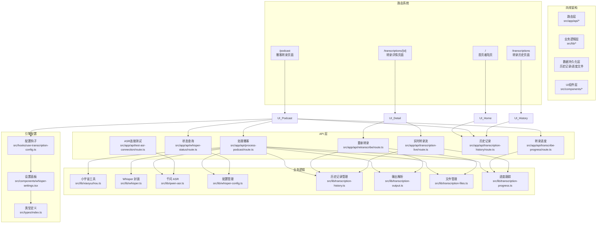
```mermaid
graph TB
subgraph "四库架构"
RouteLayer["路由层<br/>src/app/api/*"]
BusinessLayer["业务逻辑层<br/>src/lib/*"]
DataLayer["数据持久化层<br/>历史记录/进度文件"]
UILayer["UI组件层<br/>src/components/*"]
end
subgraph "路由系统"
HomeRoute["/ <br/>首页着陆页"]
PodcastRoute["/podcast<br/>播客转录页面"]
HistoryRoute["/transcriptions<br/>转录历史页面"]
DetailRoute["/transcriptions/[id]<br/>转录详情页面"]
end
subgraph "业务逻辑"
Lib_XYZ["小宇宙工具<br/>src/lib/xiaoyuzhou.ts"]
Lib_Whisper["Whisper 封装<br/>src/lib/whisper.ts"]
Lib_Qwen["千问 ASR<br/>src/lib/qwen-asr.ts"]
Lib_Config["配置管理<br/>src/lib/whisper-config.ts"]
Lib_History["历史记录管理<br/>src/lib/transcription-history.ts"]
Lib_Output["输出解析<br/>src/lib/transcription-output.ts"]
Lib_Files["文件管理<br/>src/lib/transcription-files.ts"]
Lib_Progress["进度跟踪<br/>src/lib/transcription-progress.ts"]
end
subgraph "API 层"
API_Process["处理播客<br/>src/app/api/process-podcast/route.ts"]
API_Retranscribe["重新转录<br/>src/app/api/retranscribe/route.ts"]
API_Progress["转录进度<br/>src/app/api/transcribe-progress/route.ts"]
API_Live["实时转录流<br/>src/app/api/transcription-live/route.ts"]
API_Status["状态查询<br/>src/app/api/whisper-status/route.ts"]
API_History["历史记录<br/>src/app/api/transcription-history/route.ts"]
API_TestASR["ASR连接测试<br/>src/app/api/test-asr-connection/route.ts"]
end
subgraph "引擎配置"
Hook_Config["配置钩子<br/>src/hooks/use-transcription-config.ts"]
Comp_Settings["设置面板<br/>src/components/whisper-settings.tsx"]
Types["类型定义<br/>src/types/index.ts"]
end
HomeRoute --> UI_Home
PodcastRoute --> UI_Podcast
HistoryRoute --> UI_History
DetailRoute --> UI_Detail
UI_Home --> API_History
UI_Podcast --> API_Process
UI_Podcast --> API_Progress
UI_Podcast --> API_Status
UI_Podcast --> API_History
UI_Detail --> API_Live
UI_Detail --> API_Retranscribe
UI_History --> API_History
API_Process --> Lib_XYZ
API_Process --> Lib_Whisper
API_Process --> Lib_Qwen
API_Process --> Lib_Config
API_Process --> Lib_History
API_Process --> Lib_Output
API_Process --> Lib_Files
API_Process --> Lib_Progress
API_Retranscribe --> Lib_History
API_Retranscribe --> Lib_Output
API_Retranscribe --> Lib_Files
API_Progress --> Lib_Progress
API_Live --> Lib_History
API_Live --> Lib_Progress
API_Status --> Lib_Config
API_TestASR --> Lib_Qwen
UI_Podcast --> Hook_Config
Hook_Config --> Comp_Settings
Comp_Settings --> Types
```

**图表来源**
- [src/app/page.tsx:12-186](file://src/app/page.tsx#L12-L186)
- [src/app/podcast/page.tsx:22-529](file://src/app/podcast/page.tsx#L22-L529)
- [src/app/transcriptions/[id]/page.tsx:30-93](file://src/app/transcriptions/[id]/page.tsx#L30-L93)
- [src/app/transcriptions/page.tsx:25-85](file://src/app/transcriptions/page.tsx#L25-L85)
- [src/components/app-shell.tsx:12-43](file://src/components/app-shell.tsx#L12-L43)
- [src/components/sidebar.tsx:39-232](file://src/components/sidebar.tsx#L39-L232)
- [src/hooks/use-transcription-config.ts:1-149](file://src/hooks/use-transcription-config.ts#L1-L149)
- [src/components/whisper-settings.tsx:958-977](file://src/components/whisper-settings.tsx#L958-L977)

## 核心组件
- **首页着陆页**：提供功能入口卡片和最近转录记录展示，导航到播客转录页面
- **播客转录页面**：负责表单输入、状态管理、错误提示与结果展示，支持实时转录进度跟踪、转录历史记录和多引擎选择
- **转录详情页面**：展示单个转录任务的详细信息，支持实时进度跟踪、重新转录功能和复制功能，具有智能重连机制
- **转录历史页面**：展示所有转录历史记录，支持按时间排序和卡片式展示
- **转录引擎设置面板**：提供转录引擎选择界面，支持本地 Whisper 和千问 ASR 引擎的配置和切换
- **小宇宙工具**：从播客页面提取音频 URL 与元数据，支持多策略获取
- **Whisper 封装**：封装本地 whisper.cpp 调用，支持实时转录流和进度跟踪
- **千问 ASR 集成**：实现阿里云千问 ASR 在线转录功能，支持 SSE 流式输出和实时进度跟踪
- **API 路由**：提供播客处理、状态查询、配置管理、模型下载与进度推送、安装进度跟踪、历史记录管理、重新转录、实时转录流、ASR 连接测试
- **转录历史管理**：管理转录记录的持久化存储，支持增删查改操作
- **历史记录卡片**：展示转录历史的可视化组件
- **输出解析系统**：解析 Whisper 输出、处理 SRT 文件、生成多种格式文件
- **进度跟踪系统**：管理临时进度文件、合并数据、提供实时状态流
- **文件管理系统**：组织输出文件结构、生成逐字稿、处理文件命名
- **复制功能组件**：提供复制到剪贴板功能，支持纯文本和带时间戳两种模式
- **配置持久化系统**：管理转录引擎配置的本地存储和跨会话持久化

## 架构总览
系统采用"四库架构 + 实时流处理 + 多引擎支持"的设计模式。前端通过独立的 `/podcast` 路由处理播客转录，通过 `/transcriptions` 路由管理历史记录，后端调用小宇宙 API/页面解析获取音频 URL，下载音频至临时目录，调用 whisper.cpp 或千问 ASR 进行转写，返回转录文本与音频信息。新版本支持实时转录流、进度跟踪、完整的转录历史记录管理和重新转录功能，以及本地 Whisper 和在线千问 ASR 两种转录引擎的选择。

**更新** 新版本显著增强了SSE进度管理，采用不同的推送间隔策略：transcribe-progress使用1秒轮询，transcription-live使用800ms推送，配合智能重连机制，提供了更流畅的用户体验。新增的多引擎架构支持为用户提供了更灵活的转录选择，本地引擎适合隐私敏感场景，云端引擎适合快速转录需求。

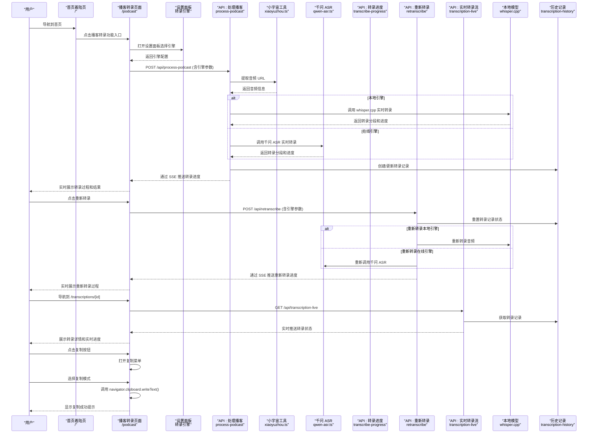
```mermaid
sequenceDiagram
participant U as "用户"
participant H as "首页着陆页<br/>/"
participant F as "播客转录页面<br/>/podcast"
participant S as "设置面板<br/>转录引擎"
participant A1 as "API : 处理播客<br/>process-podcast"
participant L1 as "小宇宙工具<br/>xiaoyuzhou.ts"
participant L2 as "千问 ASR<br/>qwen-asr.ts"
participant A2 as "API : 转录进度<br/>transcribe-progress"
participant A3 as "API : 重新转录<br/>retranscribe"
participant A4 as "API : 实时转录流<br/>transcription-live"
participant W as "本地模型<br/>whisper.cpp"
participant H2 as "历史记录<br/>transcription-history"
U->>H : 导航到首页
H->>F : 点击播客转录功能入口
F->>S : 打开设置面板选择引擎
S-->>F : 返回引擎配置
F->>A1 : POST /api/process-podcast (含引擎参数)
A1->>L1 : 提取音频 URL
L1-->>A1 : 返回音频信息
Alt 本地引擎
A1->>W : 调用 whisper.cpp 实时转录
W-->>A1 : 返回转录分段和进度
Else 在线引擎
A1->>L2 : 调用千问 ASR 实时转录
L2-->>A1 : 返回转录分段和进度
End
A1->>H2 : 创建/更新转录记录
A1-->>F : 通过 SSE 推送转录进度
F-->>U : 实时展示转录过程和结果
U->>F : 点击重新转录
F->>A3 : POST /api/retranscribe (含引擎参数)
A3->>H2 : 重置转录记录状态
Alt 重新转录本地引擎
A3->>W : 重新转录音频
Else 重新转录在线引擎
A3->>L2 : 重新调用千问 ASR
End
A3-->>F : 通过 SSE 推送重新转录进度
F-->>U : 实时展示重新转录过程
U->>F : 导航到 /transcriptions/[id]
F->>A4 : GET /api/transcription-live
A4->>H2 : 获取转录记录
A4-->>F : 实时推送转录状态
F-->>U : 展示转录详情和实时进度
U->>F : 点击复制按钮
F->>F : 打开复制菜单
U->>F : 选择复制模式
F->>F : 调用 navigator.clipboard.writeText()
F-->>U : 显示复制成功提示
```

**图表来源**
- [src/app/page.tsx:38-67](file://src/app/page.tsx#L38-L67)
- [src/app/podcast/page.tsx:125-260](file://src/app/podcast/page.tsx#L125-L260)
- [src/app/api/process-podcast/route.ts:718-791](file://src/app/api/process-podcast/route.ts#L718-L791)
- [src/lib/xiaoyuzhou.ts:27-47](file://src/lib/xiaoyuzhou.ts#L27-L47)
- [src/lib/qwen-asr.ts:59-117](file://src/lib/qwen-asr.ts#L59-L117)
- [src/app/api/transcribe-progress/route.ts:32-122](file://src/app/api/transcribe-progress/route.ts#L32-L122)
- [src/app/api/retranscribe/route.ts:610-704](file://src/app/api/retranscribe/route.ts#L610-L704)
- [src/app/api/transcription-live/route.ts:43-126](file://src/app/api/transcription-live/route.ts#L43-L126)
- [src/lib/transcription-history.ts:71-104](file://src/lib/transcription-history.ts#L71-L104)

## 详细组件分析

### 四库架构设计
系统采用四库架构确保代码的模块化和可维护性：

- **路由层**：处理 HTTP 请求和响应，负责参数验证和错误处理
- **业务逻辑层**：封装核心算法和数据处理逻辑，提供可复用的功能模块
- **数据持久化层**：管理历史记录和进度状态，提供数据访问接口
- **UI组件层**：提供用户交互界面，负责状态管理和事件处理

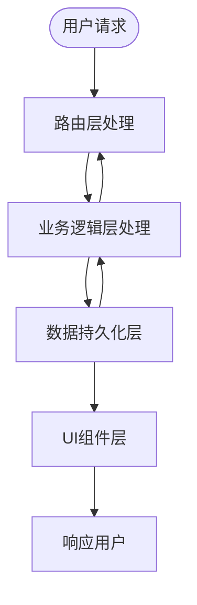
```mermaid
flowchart TD
Start(["用户请求"]) --> Route["路由层处理"]
Route --> Business["业务逻辑层处理"]
Business --> Data["数据持久化层"]
Data --> UI["UI组件层"]
UI --> Response["响应用户"]
Business --> Route
Data --> Business
```

### 首页着陆页设计
- **功能入口卡片**：提供播客转录、转录历史、内容解析、知识库等功能入口
- **最近转录展示**：显示最近的转录记录，支持查看更多和开始转录
- **导航集成**：与侧边栏导航保持一致，确保路由映射正确
- **状态管理**：通过 AppShell 同步路由状态到侧边栏激活状态

**更新** 首页现在作为专用着陆页，提供清晰的功能入口和最近记录展示，与播客转录页面形成明确的职责分离。

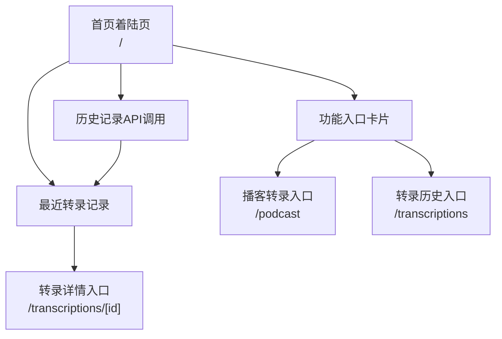
```mermaid
flowchart TD
Home["首页着陆页<br/>/"] --> Features["功能入口卡片"]
Home --> Recent["最近转录记录"]
Features --> Podcast["播客转录入口<br/>/podcast"]
Features --> History["转录历史入口<br/>/transcriptions"]
Recent --> Detail["转录详情入口<br/>/transcriptions/[id]"]
Home --> API["历史记录API调用"]
API --> Recent
```

**图表来源**
- [src/app/page.tsx:38-67](file://src/app/page.tsx#L38-L67)
- [src/app/page.tsx:148-181](file://src/app/page.tsx#L148-L181)
- [src/components/app-shell.tsx:17-26](file://src/components/app-shell.tsx#L17-L26)

### 前端状态管理与用户交互
- **表单状态**：包含 URL 输入、加载状态、转录结果、音频信息
- **实时转录状态**：包括任务ID、转录阶段、状态、实时片段、进度百分比
- **转录历史状态**：管理历史记录列表、加载状态
- **引擎配置状态**：管理当前选择的转录引擎和相关配置
- **链接验证**：仅支持小宇宙域名
- **状态检查**：调用 /api/whisper-status 确认 Whisper 安装与模型状态
- **API 调用**：POST /api/process-podcast 获取转录结果（支持引擎参数）
- **实时进度**：通过 EventSource 连接 /api/transcribe-progress 实时接收转录进度
- **转录历史**：自动加载和刷新转录历史记录
- **重新转录**：支持对已完成或出错的任务进行重新转录（支持引擎选择）
- **结果展示**：音频信息卡片与转录文本卡片，支持纯文本与格式化两种视图
- **用户反馈**：Toast 提示与 FlowLoader 加载动画
- **智能重连**：EventSource 断线自动重连，3秒间隔重试
- **复制功能**：支持纯文本复制和带时间戳复制两种模式

**更新** 新版本实现了智能重连机制，当SSE连接断开时，前端会在3秒后自动重连，确保转录进度的连续性。新增的多引擎架构支持为用户提供了更灵活的转录选择，转录引擎配置已集成到全局配置系统中。

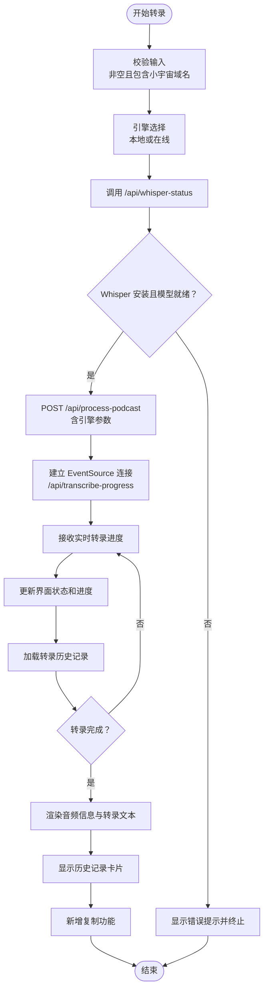
```mermaid
flowchart TD
Start(["开始转录"]) --> Validate["校验输入<br/>非空且包含小宇宙域名"]
Validate --> EngineSelect["引擎选择<br/>本地或在线"]
EngineSelect --> StatusCheck["调用 /api/whisper-status"]
StatusCheck --> StatusOK{"Whisper 安装且模型就绪？"}
StatusOK --> |否| ShowError["显示错误提示并终止"]
StatusOK --> |是| CallAPI["POST /api/process-podcast<br/>含引擎参数"]
CallAPI --> CreateES["建立 EventSource 连接<br/>/api/transcribe-progress"]
CreateES --> ReceiveProgress["接收实时转录进度"]
ReceiveProgress --> UpdateUI["更新界面状态和进度"]
UpdateUI --> LoadHistory["加载转录历史记录"]
LoadHistory --> Complete{"转录完成？"}
Complete --> |否| ReceiveProgress
Complete --> |是| RenderResult["渲染音频信息与转录文本"]
RenderResult --> ShowHistory["显示历史记录卡片"]
ShowHistory --> CopyFeature["新增复制功能"]
CopyFeature --> End(["结束"])
ShowError --> End
```

**图表来源**
- [src/app/podcast/page.tsx:125-260](file://src/app/podcast/page.tsx#L125-L260)
- [src/app/api/whisper-status/route.ts:11-59](file://src/app/api/whisper-status/route.ts#L11-L59)
- [src/app/api/process-podcast/route.ts:718-791](file://src/app/api/process-podcast/route.ts#L718-L791)
- [src/app/api/transcribe-progress/route.ts:32-122](file://src/app/api/transcribe-progress/route.ts#L32-L122)

### 转录引擎架构设计
系统现已支持两种转录引擎，用户可根据需求选择最适合的转录方案：

- **本地 Whisper 引擎**：使用本地 whisper.cpp 进行转录，无需网络连接，适合隐私敏感场景
- **千问 ASR 引擎**：使用阿里云千问 ASR 在线转录，速度快，适合快速转录需求
- **引擎选择界面**：通过设置面板提供直观的引擎切换界面
- **配置持久化**：转录引擎配置已集成到全局配置系统，支持本地存储和跨会话持久化

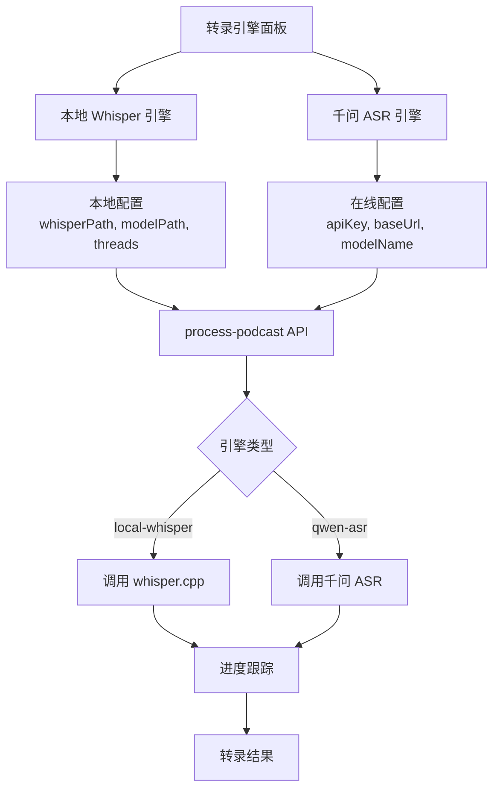
```mermaid
flowchart TD
EnginePanel["转录引擎面板"] --> LocalEngine["本地 Whisper 引擎"]
EnginePanel --> OnlineEngine["千问 ASR 引擎"]
LocalEngine --> Config1["本地配置<br/>whisperPath, modelPath, threads"]
OnlineEngine --> Config2["在线配置<br/>apiKey, baseUrl, modelName"]
Config1 --> Process["process-podcast API"]
Config2 --> Process
Process --> EngineSwitch{"引擎类型"}
EngineSwitch --> |local-whisper| Whisper["调用 whisper.cpp"]
EngineSwitch --> |qwen-asr| Qwen["调用千问 ASR"]
Whisper --> Progress["进度跟踪"]
Qwen --> Progress
Progress --> Result["转录结果"]
```

**图表来源**
- [src/components/whisper-settings.tsx:958-977](file://src/components/whisper-settings.tsx#L958-L977)
- [src/hooks/use-transcription-config.ts:84-149](file://src/hooks/use-transcription-config.ts#L84-L149)
- [src/types/index.ts:49-66](file://src/types/index.ts#L49-L66)

### 小宇宙平台集成实现
- **多策略提取**：优先官方 API，其次页面 HTML，最后第三方 API
- **数据解析**：从响应中提取标题、描述、音频 URL、时长、发布时间、作者、封面图
- **容错机制**：任一策略失败则尝试下一个，全部失败抛出明确错误

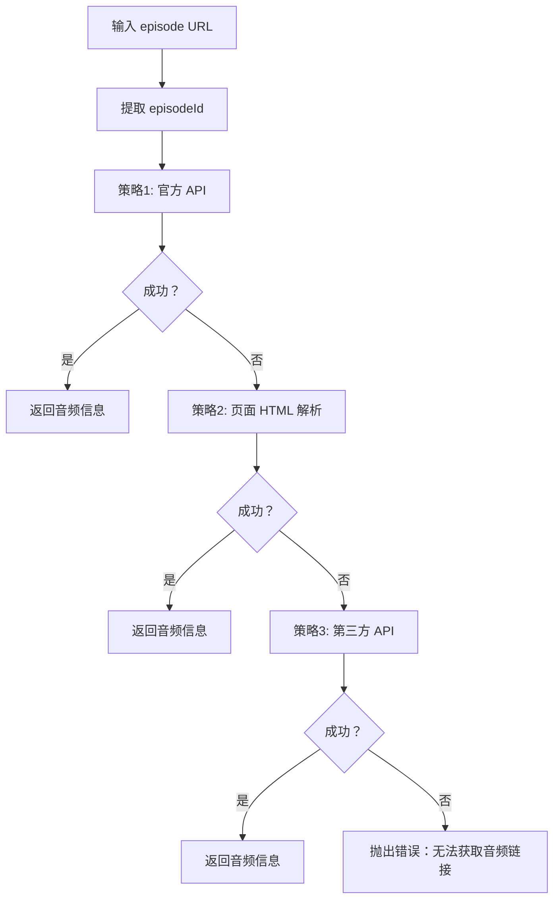
```mermaid
flowchart TD
E1["输入 episode URL"] --> ExtractID["提取 episodeId"]
ExtractID --> Strategy1["策略1: 官方 API"]
Strategy1 --> S1OK{"成功？"}
S1OK --> |是| Return1["返回音频信息"]
S1OK --> |否| Strategy2["策略2: 页面 HTML 解析"]
Strategy2 --> S2OK{"成功？"}
S2OK --> |是| Return2["返回音频信息"]
S2OK --> |否| Strategy3["策略3: 第三方 API"]
Strategy3 --> S3OK{"成功？"}
S3OK --> |是| Return3["返回音频信息"]
S3OK --> |否| Error["抛出错误：无法获取音频链接"]
```

**图表来源**
- [src/lib/xiaoyuzhou.ts:27-47](file://src/lib/xiaoyuzhou.ts#L27-L47)
- [src/lib/xiaoyuzhou.ts:52-89](file://src/lib/xiaoyuzhou.ts#L52-L89)
- [src/lib/xiaoyuzhou.ts:94-164](file://src/lib/xiaoyuzhou.ts#L94-L164)
- [src/lib/xiaoyuzhou.ts:169-197](file://src/lib/xiaoyuzhou.ts#L169-L197)

### 新的转录工作流程
- **异步处理**：采用 fire-and-forget 模式，立即返回任务ID
- **后台处理**：processInBackground 函数处理完整的转录流程
- **引擎分流**：根据引擎类型选择不同的处理路径
- **状态管理**：通过临时文件和数据库记录转录状态
- **实时更新**：每500ms更新一次进度和片段
- **文件保存**：生成简介.md、逐字稿.txt、纯文本.txt 三种格式文件
- **历史记录**：自动创建和更新转录历史记录

**更新** 新版本引入了引擎分流机制，根据用户选择的引擎类型执行不同的处理流程。本地引擎直接使用 whisper.cpp，而在线引擎通过千问 ASR API 进行转录。

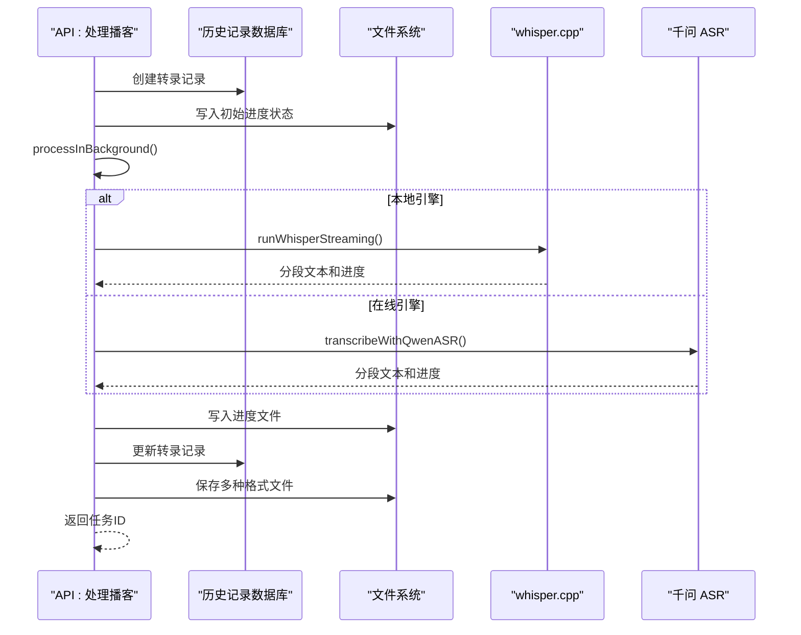
```mermaid
sequenceDiagram
participant A as "API : 处理播客"
participant DB as "历史记录数据库"
participant FS as "文件系统"
participant W as "whisper.cpp"
participant Q as "千问 ASR"
A->>DB : 创建转录记录
A->>FS : 写入初始进度状态
A->>A : processInBackground()
Alt 本地引擎
A->>W : runWhisperStreaming()
W-->>A : 分段文本和进度
Else 在线引擎
A->>Q : transcribeWithQwenASR()
Q-->>A : 分段文本和进度
End
A->>FS : 写入进度文件
A->>DB : 更新转录记录
A->>FS : 保存多种格式文件
A-->>A : 返回任务ID
```

**图表来源**
- [src/app/api/process-podcast/route.ts:398-716](file://src/app/api/process-podcast/route.ts#L398-L716)
- [src/lib/transcription-history.ts:71-104](file://src/lib/transcription-history.ts#L71-L104)
- [src/lib/qwen-asr.ts:59-117](file://src/lib/qwen-asr.ts#L59-L117)

### 实时转录进度跟踪
- **进度文件**：使用临时目录存储转录进度 JSON 文件
- **SSE 推送**：通过 /api/transcribe-progress API 实时推送转录状态
- **分段处理**：解析 whisper.cpp 输出的分段信息，格式为 "[00:01:23.456 --> 00:01:28.000]"
- **进度计算**：从 stderr 中提取进度百分比，每 500ms 更新一次
- **状态管理**：支持 fetching_info、downloading_audio、converting、transcribing、completed、error 六种状态
- **历史记录同步**：实时更新转录历史记录状态和进度
- **智能重连**：客户端断开时自动重连，确保实时更新

**更新** 新版本改进了SSE进度管理，transcribe-progress使用1秒轮询间隔，transcription-live使用800ms推送间隔，配合智能重连机制，提供了更稳定的实时转录体验。多引擎架构下的进度跟踪机制已统一处理本地和在线引擎的进度数据。

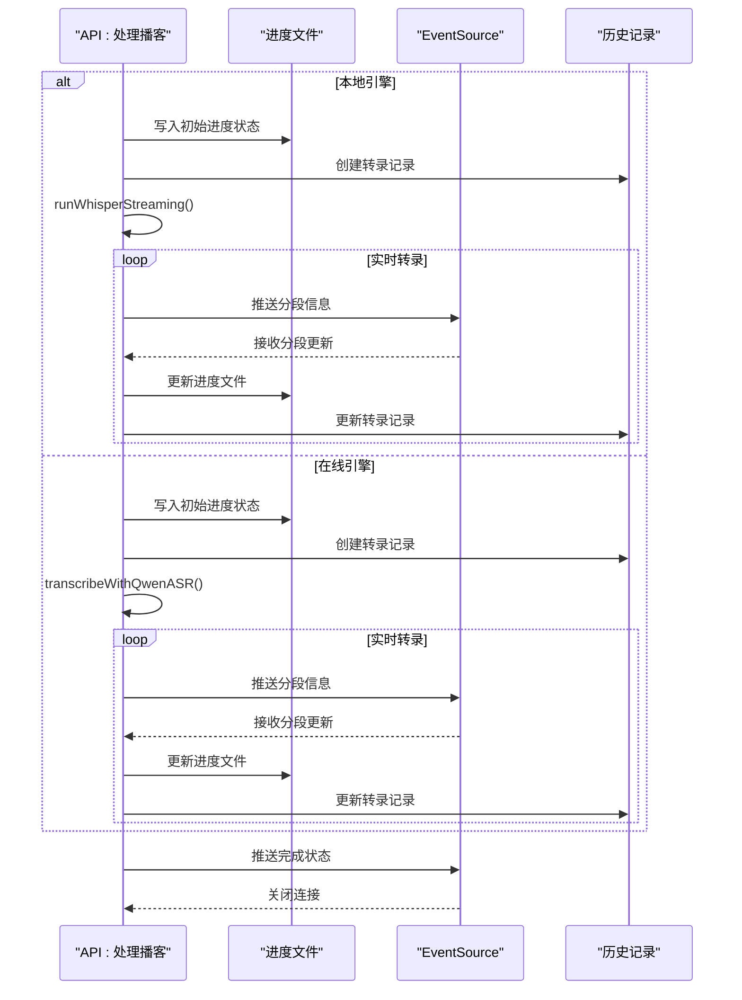
```mermaid
sequenceDiagram
participant A as "API : 处理播客"
participant P as "进度文件"
participant ES as "EventSource"
participant H as "历史记录"
Alt 本地引擎
A->>P : 写入初始进度状态
A->>H : 创建转录记录
A->>A : runWhisperStreaming()
loop 实时转录
A->>ES : 推送分段信息
ES-->>A : 接收分段更新
A->>P : 更新进度文件
A->>H : 更新转录记录
end
Else 在线引擎
A->>P : 写入初始进度状态
A->>H : 创建转录记录
A->>A : transcribeWithQwenASR()
loop 实时转录
A->>ES : 推送分段信息
ES-->>A : 接收分段更新
A->>P : 更新进度文件
A->>H : 更新转录记录
end
End
A->>ES : 推送完成状态
ES-->>A : 关闭连接
```

**图表来源**
- [src/app/api/process-podcast/route.ts:25-43](file://src/app/api/process-podcast/route.ts#L25-L43)
- [src/app/api/transcribe-progress/route.ts:32-122](file://src/app/api/transcribe-progress/route.ts#L32-L122)
- [src/app/api/process-podcast/route.ts:338-386](file://src/app/api/process-podcast/route.ts#L338-L386)
- [src/lib/qwen-asr.ts:59-117](file://src/lib/qwen-asr.ts#L59-L117)

### 重新转录功能
- **重新转录 API**：通过 `/api/retranscribe` 支持对已完成或出错的任务进行重新转录
- **引擎选择支持**：重新转录功能现已支持引擎选择，用户可针对已完成任务选择不同的转录引擎
- **跳过信息获取**：直接使用已有的 audioUrl 下载并转录，跳过播客信息获取步骤
- **状态重置**：重置转录记录状态为 downloading_audio，清除之前的转录结果
- **实时进度**：重新建立 SSE 连接，实时推送重新转录进度
- **历史记录同步**：更新转录历史记录状态和进度
- **智能重连**：重新转录时也具备自动重连机制

**更新** 重新转录功能现在具备智能重连机制，即使在网络不稳定的情况下也能保证转录任务的连续性。最重要的是，重新转录功能现已支持引擎选择，用户可以针对已完成任务选择不同的转录引擎，实现灵活的转录策略调整。

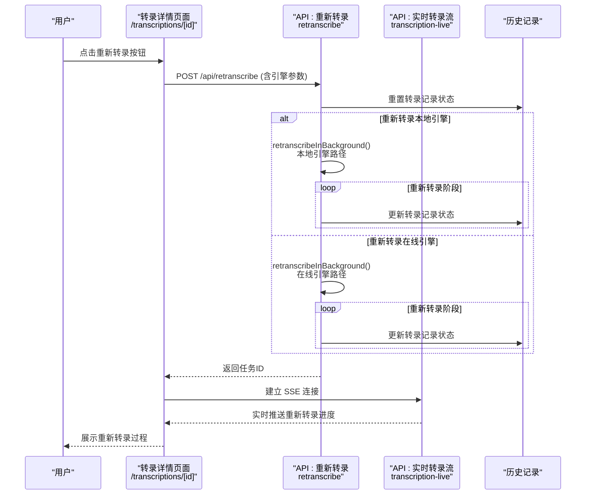
```mermaid
sequenceDiagram
participant U as "用户"
participant D as "转录详情页面<br/>/transcriptions/[id]"
participant A1 as "API : 重新转录<br/>retranscribe"
participant A2 as "API : 实时转录流<br/>transcription-live"
participant H as "历史记录"
U->>D : 点击重新转录按钮
D->>A1 : POST /api/retranscribe (含引擎参数)
A1->>H : 重置转录记录状态
Alt 重新转录本地引擎
A1->>A1 : retranscribeInBackground()<br/>本地引擎路径
loop 重新转录阶段
A1->>H : 更新转录记录状态
end
Else 重新转录在线引擎
A1->>A1 : retranscribeInBackground()<br/>在线引擎路径
loop 重新转录阶段
A1->>H : 更新转录记录状态
end
End
A1-->>D : 返回任务ID
D->>A2 : 建立 SSE 连接
A2-->>D : 实时推送重新转录进度
D-->>U : 展示重新转录过程
```

**图表来源**
- [src/app/api/retranscribe/route.ts:610-704](file://src/app/api/retranscribe/route.ts#L610-L704)
- [src/components/transcription-detail.tsx:109-172](file://src/components/transcription-detail.tsx#L109-L172)
- [src/app/api/transcription-live/route.ts:43-126](file://src/app/api/transcription-live/route.ts#L43-L126)

### 实时转录流功能
- **实时流 API**：通过 `/api/transcription-live` 提供实时转录状态流
- **进度文件合并**：合并进度文件数据到历史记录中，确保数据完整性
- **800ms 推送间隔**：每 800ms 推送一次最新转录状态
- **自动关闭**：当转录完成或出错时自动关闭连接
- **重连机制**：客户端断开时自动重连，确保实时更新
- **智能重连**：转录详情页面具备3秒自动重连机制

**更新** 实时转录流功能现在具备智能重连机制，当客户端断开连接时，会在3秒后自动重连，确保用户能够持续看到转录进度。多引擎架构下的实时流功能已统一处理本地和在线引擎的状态更新。

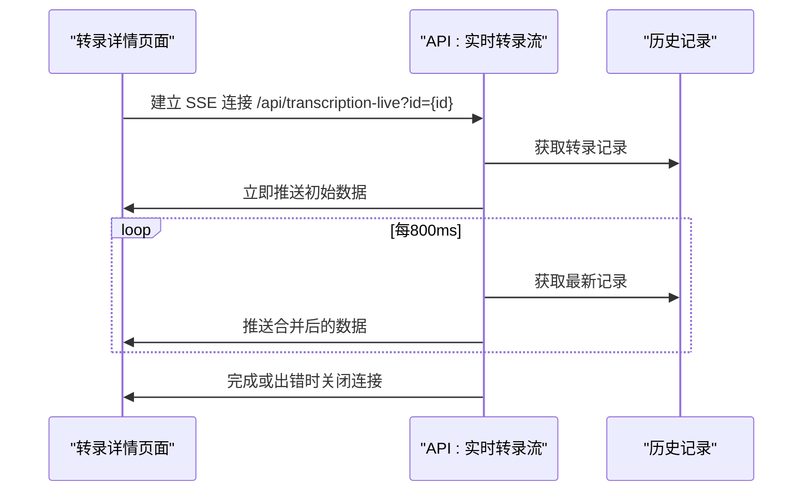
```mermaid
sequenceDiagram
participant D as "转录详情页面"
participant A as "API : 实时转录流"
participant H as "历史记录"
D->>A : 建立 SSE 连接 /api/transcription-live?id={id}
A->>H : 获取转录记录
A->>D : 立即推送初始数据
loop 每800ms
A->>H : 获取最新记录
A->>D : 推送合并后的数据
end
A->>D : 完成或出错时关闭连接
```

**图表来源**
- [src/app/api/transcription-live/route.ts:43-126](file://src/app/api/transcription-live/route.ts#L43-L126)
- [src/components/transcription-detail.tsx:62-106](file://src/components/transcription-detail.tsx#L62-L106)

### 转录历史记录管理
- **持久化存储**：使用临时目录存储历史记录 JSON 文件
- **实时更新**：后台进程实时更新转录状态和进度
- **查询接口**：支持获取所有记录和特定记录详情
- **删除功能**：支持删除指定的转录记录
- **时间管理**：自动记录创建时间和最后更新时间
- **状态同步**：前端自动刷新历史记录列表
- **路由集成**：支持 `/transcriptions` 和 `/transcriptions/[id]` 路由

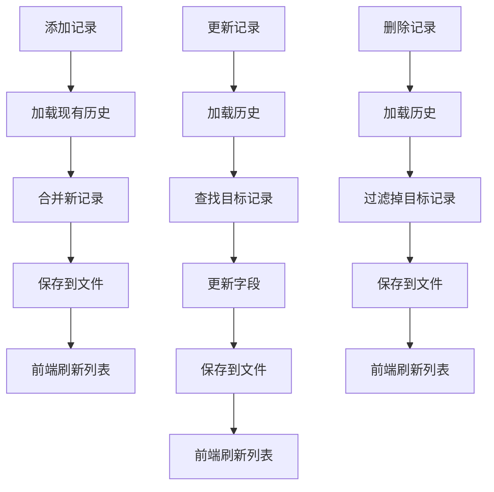
```mermaid
flowchart TD
Add["添加记录"] --> Load["加载现有历史"]
Load --> Merge["合并新记录"]
Merge --> Save["保存到文件"]
Save --> Refresh["前端刷新列表"]
Update["更新记录"] --> Load2["加载历史"]
Load2 --> Find["查找目标记录"]
Find --> UpdateField["更新字段"]
UpdateField --> Save2["保存到文件"]
Save2 --> Refresh2["前端刷新列表"]
Delete["删除记录"] --> Load3["加载历史"]
Load3 --> Filter["过滤掉目标记录"]
Filter --> Save3["保存到文件"]
Save3 --> Refresh3["前端刷新列表"]
```

**图表来源**
- [src/lib/transcription-history.ts:71-104](file://src/lib/transcription-history.ts#L71-L104)
- [src/app/api/transcription-history/route.ts:9-80](file://src/app/api/transcription-history/route.ts#L9-L80)

### Whisper 本地转写流程
- **配置检查**：通过 /api/whisper-config 获取路径与线程数
- **模型存在性**：检查 whisperPath 与 modelPath
- **实时转录**：使用 spawn 方式调用 whisper.cpp，支持实时分段输出和进度跟踪
- **进度处理**：通过正则表达式解析 stderr 中的分段信息和进度百分比
- **文件输出**：生成简介.md、逐字稿.txt、纯文本.txt 三种格式文件
- **错误处理**：执行失败时记录日志并返回错误信息

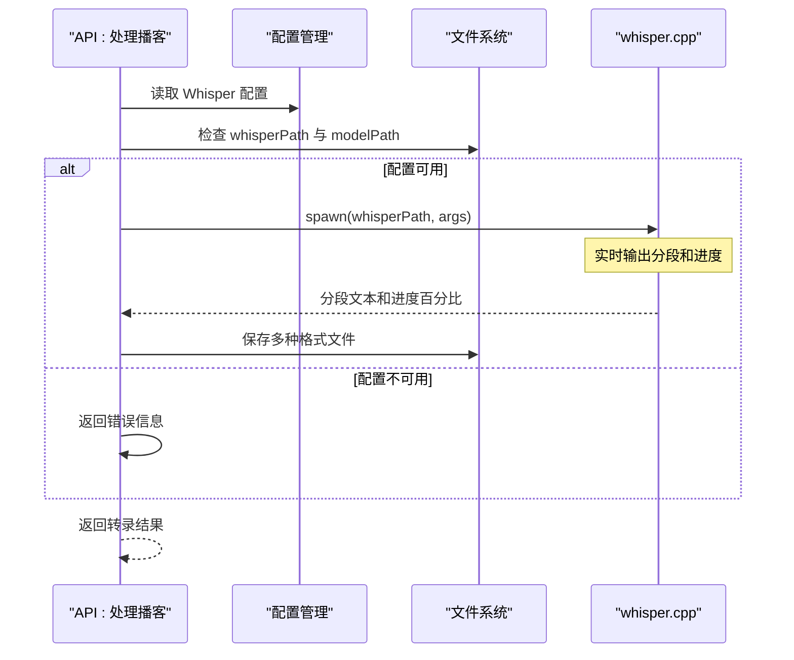
```mermaid
sequenceDiagram
participant A as "API : 处理播客"
participant C as "配置管理"
participant FS as "文件系统"
participant W as "whisper.cpp"
A->>C : 读取 Whisper 配置
A->>FS : 检查 whisperPath 与 modelPath
alt 配置可用
A->>W : spawn(whisperPath, args)
Note over W : 实时输出分段和进度
W-->>A : 分段文本和进度百分比
A->>FS : 保存多种格式文件
else 配置不可用
A->>A : 返回错误信息
end
A-->>A : 返回转录结果
```

**图表来源**
- [src/app/api/process-podcast/route.ts:338-386](file://src/app/api/process-podcast/route.ts#L338-L386)
- [src/lib/whisper-config.ts:57-74](file://src/lib/whisper-config.ts#L57-L74)
- [src/lib/whisper.ts:54-156](file://src/lib/whisper.ts#L54-L156)

### 千问 ASR 在线转录流程
- **API 集成**：通过 DashScope API 进行在线语音识别
- **SSE 流式输出**：支持实时返回转录结果，提供流畅的用户体验
- **进度跟踪**：通过增量输出实现进度跟踪，支持 0-100% 的进度显示
- **时间戳生成**：在线引擎可能不提供精确时间戳，按段落拆分并生成估算时间戳
- **错误处理**：API 调用失败时提供详细的错误信息
- **连接测试**：提供连接测试功能，验证 API Key 有效性

**更新** 千问 ASR 集成是本次更新的核心功能，实现了完整的在线语音识别能力。该功能通过阿里云 DashScope API 提供服务，支持 SSE 流式输出，能够实时返回转录结果。由于在线引擎的特性，时间戳处理采用了估算机制，通过字符长度比例分配时间戳，确保转录结果的可用性。

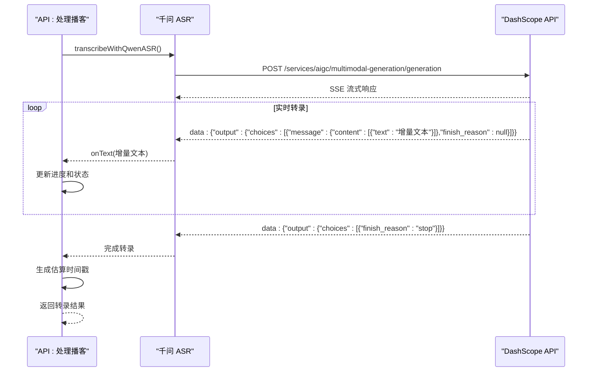
```mermaid
sequenceDiagram
participant A as "API : 处理播客"
participant Q as "千问 ASR"
participant API as "DashScope API"
A->>Q : transcribeWithQwenASR()
Q->>API : POST /services/aigc/multimodal-generation/generation
API-->>Q : SSE 流式响应
loop 实时转录
API-->>Q : data : {"output" : {"choices" : [{"message" : {"content" : [{"text" : "增量文本"}]},"finish_reason" : null}]}}
Q-->>A : onText(增量文本)
A->>A : 更新进度和状态
end
API-->>Q : data : {"output" : {"choices" : [{"finish_reason" : "stop"}]}}
Q-->>A : 完成转录
A->>A : 生成估算时间戳
A-->>A : 返回转录结果
```

**图表来源**
- [src/lib/qwen-asr.ts:59-117](file://src/lib/qwen-asr.ts#L59-L117)
- [src/lib/qwen-asr.ts:122-230](file://src/lib/qwen-asr.ts#L122-L230)
- [src/app/api/test-asr-connection/route.ts:9-30](file://src/app/api/test-asr-connection/route.ts#L9-L30)

### 转录引擎设置面板
- **引擎选择界面**：提供直观的转录引擎切换界面
- **本地引擎配置**：配置 whisper.cpp 路径、模型文件、线程数等参数
- **在线引擎配置**：配置千问 ASR API Key、基础 URL、模型名称等参数
- **连接测试**：提供在线引擎连接测试功能，验证配置的有效性
- **状态指示**：实时显示当前引擎配置状态
- **配置持久化**：将引擎配置保存到本地存储，支持跨会话持久化

**更新** 转录引擎设置面板是本次更新的重要界面组件，为用户提供了统一的引擎配置入口。该面板支持本地 Whisper 和千问 ASR 两种引擎的配置，用户可以根据自己的需求和网络环境选择最适合的转录方案。

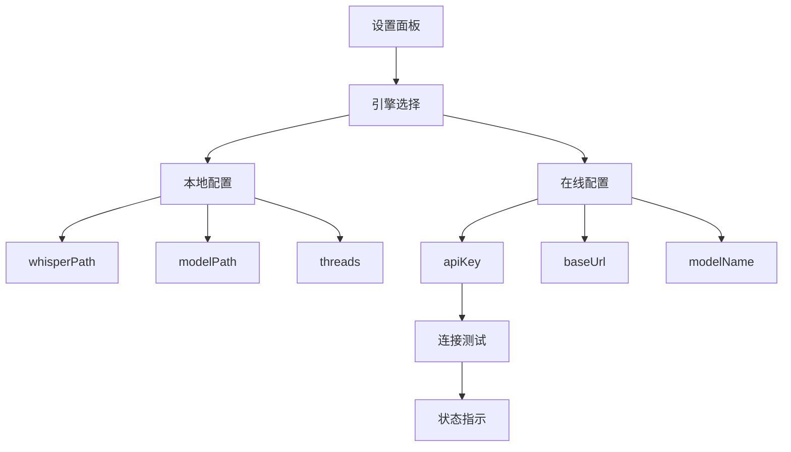
```mermaid
flowchart TD
Settings["设置面板"] --> EngineSelect["引擎选择"]
EngineSelect --> LocalConfig["本地配置"]
EngineSelect --> OnlineConfig["在线配置"]
LocalConfig --> Path["whisperPath"]
LocalConfig --> Model["modelPath"]
LocalConfig --> Threads["threads"]
OnlineConfig --> APIKey["apiKey"]
OnlineConfig --> BaseURL["baseUrl"]
OnlineConfig --> ModelName["modelName"]
APIKey --> Test["连接测试"]
Test --> Status["状态指示"]
```

**图表来源**
- [src/components/whisper-settings.tsx:958-977](file://src/components/whisper-settings.tsx#L958-L977)
- [src/components/whisper-settings.tsx:1074-1153](file://src/components/whisper-settings.tsx#L1074-L1153)
- [src/hooks/use-transcription-config.ts:84-149](file://src/hooks/use-transcription-config.ts#L84-L149)

### 输出解析系统
- **SRT 文件解析**：解析标准 SRT 格式的字幕文件，提取时间戳和文本内容
- **逐字稿生成**：将转录片段转换为带时间戳的逐字稿格式
- **纯文本输出**：生成简洁的纯文本转录内容
- **格式标准化**：统一时间戳格式，处理换行符和特殊字符
- **数据完整性**：确保解析后的数据结构一致性和完整性

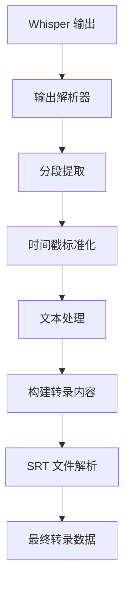
```mermaid
flowchart TD
Input["Whisper 输出"] --> Parser["输出解析器"]
Parser --> Segment["分段提取"]
Segment --> Timestamp["时间戳标准化"]
Timestamp --> Text["文本处理"]
Text --> Build["构建转录内容"]
Build --> SRT["SRT 文件解析"]
SRT --> Final["最终转录数据"]
```

**图表来源**
- [src/lib/transcription-output.ts:27-60](file://src/lib/transcription-output.ts#L27-L60)
- [src/lib/transcription-output.ts:67-122](file://src/lib/transcription-output.ts#L67-L122)

### 文件管理系统
- **目录结构**：按播客标题创建独立的输出目录，避免文件冲突
- **文件命名**：生成简介.md、逐字稿.txt、纯文本.txt 等标准文件
- **内容格式**：包含播客元信息、描述、作者、时长等详细信息
- **路径解析**：支持已保存路径的解析和输出目录的动态确定
- **清理机制**：自动清理临时文件，避免磁盘空间占用

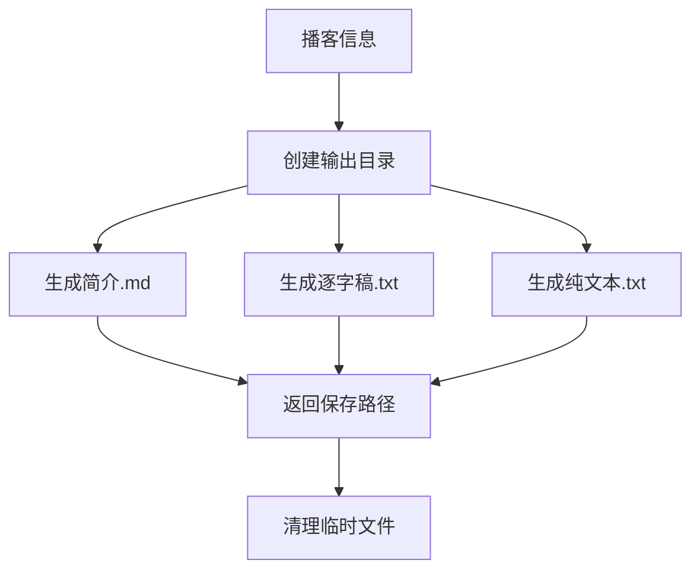
```mermaid
flowchart TD
Episode["播客信息"] --> Dir["创建输出目录"]
Dir --> Intro["生成简介.md"]
Dir --> Transcript["生成逐字稿.txt"]
Dir --> Plain["生成纯文本.txt"]
Intro --> Path["返回保存路径"]
Transcript --> Path
Plain --> Path
Path --> Clean["清理临时文件"]
```

**图表来源**
- [src/lib/transcription-files.ts:52-82](file://src/lib/transcription-files.ts#L52-L82)
- [src/lib/transcription-files.ts:84-95](file://src/lib/transcription-files.ts#L84-L95)

### 进度跟踪系统
- **临时文件管理**：使用 UUID 生成唯一的进度文件名，避免并发冲突
- **数据合并**：实时合并进度文件和历史记录数据，确保状态一致性
- **状态同步**：通过 800ms 间隔推送最新的转录状态
- **错误处理**：处理文件读取失败、数据解析错误等情况
- **清理机制**：转录完成后延迟清理进度文件，确保客户端完整接收数据

**更新** 进度跟踪系统现在采用了更精细的文件管理策略，使用UUID生成唯一文件名，避免并发写入冲突，同时在转录完成后延迟清理进度文件，确保客户端能够完整接收所有进度数据。多引擎架构下的进度跟踪机制已统一处理本地和在线引擎的进度数据。

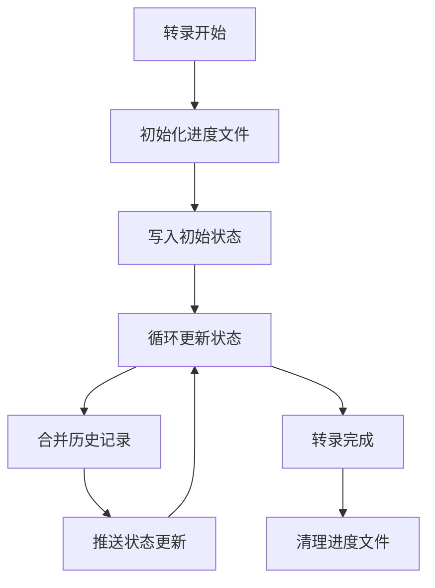
```mermaid
flowchart TD
Start["转录开始"] --> Init["初始化进度文件"]
Init --> Write["写入初始状态"]
Write --> Loop["循环更新状态"]
Loop --> Merge["合并历史记录"]
Merge --> Push["推送状态更新"]
Push --> Loop
Loop --> Complete["转录完成"]
Complete --> Cleanup["清理进度文件"]
```

**图表来源**
- [src/lib/transcription-progress.ts:13-43](file://src/lib/transcription-progress.ts#L13-L43)
- [src/app/api/transcription-live/route.ts:8-34](file://src/app/api/transcription-live/route.ts#L8-L34)

### 设置与模型下载
- **设置对话框**：展示 Whisper 安装与模型状态，支持模型选择与高级配置
- **模型下载**：POST /api/whisper-download 触发后台下载，使用 SSE 推送进度
- **进度监听**：/api/whisper-download-progress 通过 EventSource 实时推送下载状态
- **安装管理**：支持 whisper.cpp 的克隆、编译和安装，提供进度跟踪

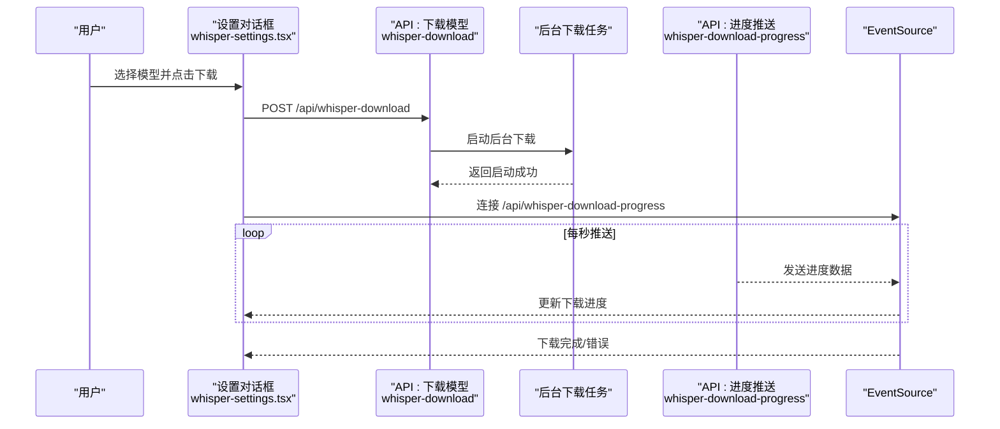
```mermaid
sequenceDiagram
participant U as "用户"
participant S as "设置对话框<br/>whisper-settings.tsx"
participant A1 as "API : 下载模型<br/>whisper-download"
participant BG as "后台下载任务"
participant A2 as "API : 进度推送<br/>whisper-download-progress"
participant ES as "EventSource"
U->>S : 选择模型并点击下载
S->>A1 : POST /api/whisper-download
A1->>BG : 启动后台下载
BG-->>A1 : 返回启动成功
S->>ES : 连接 /api/whisper-download-progress
loop 每秒推送
A2-->>ES : 发送进度数据
ES-->>S : 更新下载进度
end
ES-->>S : 下载完成/错误
```

**图表来源**
- [src/components/whisper-settings.tsx:62-200](file://src/components/whisper-settings.tsx#L62-L200)
- [src/app/api/whisper-download/route.ts:173-200](file://src/app/api/whisper-download/route.ts#L173-L200)
- [src/app/api/whisper-download-progress/route.ts:45-141](file://src/app/api/whisper-download-progress/route.ts#L45-L141)

### 复制功能增强
- **复制按钮设计**：在转录详情页面的右侧区域新增复制按钮，支持下拉菜单选择复制模式
- **纯文本复制**：复制不含时间戳的纯文本内容，适合直接粘贴到文档中
- **带时间戳复制**：复制包含时间戳的逐字稿格式，便于精确引用和定位
- **复制状态反馈**：显示复制成功提示，使用绿色勾选图标表示复制完成
- **点击外部关闭**：实现点击复制菜单外部自动关闭的功能
- **浏览器兼容性**：使用现代浏览器的 navigator.clipboard API 实现复制功能

**更新** 新版本新增了完整的复制功能，用户可以通过点击复制按钮打开下拉菜单，选择纯文本或带时间戳两种复制模式。复制功能支持实时状态反馈，用户可以看到复制成功的视觉提示。

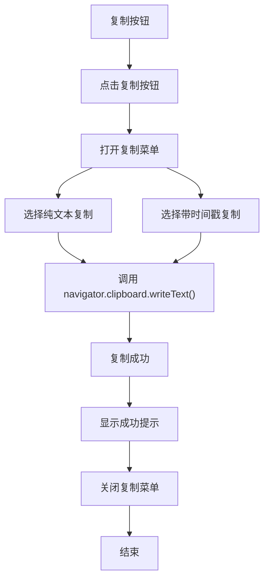
```mermaid
flowchart TD
CopyButton["复制按钮"] --> Click["点击复制按钮"]
Click --> MenuOpen["打开复制菜单"]
MenuOpen --> PlainText["选择纯文本复制"]
MenuOpen --> WithTimestamp["选择带时间戳复制"]
PlainText --> ClipboardAPI["调用 navigator.clipboard.writeText()"]
WithTimestamp --> ClipboardAPI
ClipboardAPI --> Success["复制成功"]
Success --> Toast["显示成功提示"]
Toast --> CloseMenu["关闭复制菜单"]
CloseMenu --> End["结束"]
```

**图表来源**
- [src/components/transcription-detail.tsx:183-217](file://src/components/transcription-detail.tsx#L183-L217)
- [src/components/transcription-detail.tsx:405-422](file://src/components/transcription-detail.tsx#L405-L422)

### API 定义与数据模型
- **统一响应结构**：包含 success、data、error 字段
- **Whisper 配置**：whisperPath、modelPath、modelName、threads、outputDir
- **Whisper 状态**：whisperInstalled、modelInstalled、modelSize、modelName
- **转录进度**：taskId、status、stage、segments、transcript、progress 等
- **转录记录**：id、taskId、title、status、progress、segments、transcript、wordCount、savedPath、createdAt、updatedAt
- **重新转录请求**：包含转录记录 ID 和引擎参数
- **实时转录流**：支持按 ID 获取实时转录状态流
- **转录引擎类型**：local-whisper | qwen-asr
- **在线 ASR 配置**：provider、modelName、apiKey、baseUrl、enableITN

```mermaid
classDiagram
class ApiResponse {
+boolean success
+any data
+string error
}
class WhisperConfig {
+string whisperPath
+string modelPath
+string modelName
+number threads
+string outputDir
}
class WhisperStatus {
+boolean whisperInstalled
+boolean modelInstalled
+string whisperPath
+string modelPath
+string modelName
+string modelSize
}
class TranscribeProgress {
+string taskId
+'idle' | 'fetching_info' | 'downloading_audio' | 'converting' | 'transcribing' | 'completed' | 'error' status
+string stage
+TranscribeSegment[] segments
+string transcript
+number progress
}
class TranscriptionRecord {
+string id
+string taskId
+string title
+'idle' | 'fetching_info' | 'downloading_audio' | 'converting' | 'transcribing' | 'completed' | 'error' status
+number progress
+TranscribeSegment[] segments
+string transcript
+number wordCount
+string savedPath
+Date createdAt
+Date updatedAt
+string language
+number duration
}
class RetranscribeRequest {
+string id
+string engine
+WhisperConfig whisperConfig
+OnlineASRConfig onlineASRConfig
}
class LiveTranscriptionRequest {
+string id
}
class TranscriptionEngineType {
<<enumeration>>
local-whisper
qwen-asr
}
class OnlineASRConfig {
+string provider
+string modelName
+string apiKey
+string baseUrl
+boolean enableITN
}
ApiResponse --> WhisperConfig : "data"
ApiResponse --> WhisperStatus : "data"
ApiResponse --> TranscribeProgress : "data"
ApiResponse --> TranscriptionRecord : "data"
RetranscribeRequest --> TranscriptionRecord : "id"
LiveTranscriptionRequest --> TranscriptionRecord : "id"
TranscriptionEngineType --> RetranscribeRequest : "engine"
OnlineASRConfig --> RetranscribeRequest : "onlineASRConfig"
```

**图表来源**
- [src/types/index.ts:1-67](file://src/types/index.ts#L1-L67)
- [src/types/transcription-history.ts:3-18](file://src/types/transcription-history.ts#L3-L18)

## 依赖关系分析
- **前端依赖**：Next.js、React、TailwindCSS、Radix UI、lucide-react、xml2js
- **后端依赖**：Node.js fs、path、os、child_process、fetch、EventSource
- **外部服务**：小宇宙官方 API、第三方 API、阿里云 DashScope API
- **本地依赖**：whisper.cpp、ffmpeg、cmake

```mermaid
graph LR
Pkg["package.json 依赖"] --> Next["next"]
Pkg --> React["react + react-dom"]
Pkg --> Tailwind["tailwindcss"]
Pkg --> Radix["@radix-ui/*"]
Pkg --> Lucide["lucide-react"]
Pkg --> XML["xml2js"]
Frontend["前端组件"] --> Next
Frontend --> React
Frontend --> Tailwind
Frontend --> Radix
Frontend --> Lucide
Backend["后端 API"] --> XML
LocalDeps["本地依赖"] --> Whisper["whisper.cpp"]
LocalDeps --> FFmpeg["ffmpeg"]
LocalDeps --> CMake["cmake"]
ExternalDeps["外部依赖"] --> DashScope["阿里云 DashScope"]
ExternalDeps --> Xiaoyuzhou["小宇宙 API"]
```

**图表来源**
- [package.json:12-35](file://package.json#L12-L35)

## 性能考虑
- **本地转写**：whisper.cpp 在本地执行，避免网络延迟，但受 CPU/内存影响
- **模型选择**：small 模型体积小、速度较快；medium 模型更准确但体积大
- **线程数**：根据 CPU 核心数合理设置，建议设置为 CPU 核心数的一半
- **异步处理**：采用 fire-and-forget 模式，避免阻塞主线程
- **进度优化**：每 500ms 更新一次进度，平衡实时性和性能
- **文件管理**：下载完成后及时删除，避免磁盘占用
- **历史记录**：使用临时文件存储，避免数据库压力
- **并发控制**：避免同时发起多个转录任务，建议串行或队列化处理
- **缓存策略**：对已转录的音频可考虑缓存结果（需自行扩展）
- **实时流优化**：800ms 推送间隔平衡实时性和服务器负载
- **重新转录优化**：跳过信息获取步骤，直接使用已有的音频 URL
- **内存管理**：及时清理临时文件和进度数据，避免内存泄漏
- **并发安全**：使用 UUID 生成唯一文件名，避免并发写入冲突
- **SSE优化**：1秒轮询间隔用于transcribe-progress，800ms推送间隔用于transcription-live，平衡实时性和性能
- **智能重连**：3秒重连间隔，减少服务器压力同时保证用户体验
- **复制功能优化**：使用现代浏览器的 navigator.clipboard API，避免额外的DOM操作开销
- **引擎选择优化**：本地引擎适合隐私敏感场景，云端引擎适合快速转录需求
- **ASR 连接优化**：SSE 流式输出减少网络延迟，提高用户体验
- **配置持久化优化**：本地存储避免频繁的配置请求，提高响应速度

## 故障排除指南
- **路由访问问题**：确保导航到正确的路由（`/podcast`、`/transcriptions`、`/transcriptions/[id]`、`/`）
- **链接不支持**：仅支持小宇宙播客链接，其他平台暂不支持
- **Whisper 未安装**：前端会提示前往设置安装 Whisper 并下载模型
- **模型未下载**：设置对话框中选择模型并下载，注意网络与磁盘空间
- **下载失败**：检查网络连接与磁盘权限，查看进度对话框中的错误信息
- **转写失败**：检查 whisper.cpp 可执行文件与模型文件路径，查看后端日志
- **进度无更新**：确认 EventSource 连接正常，浏览器允许 SSE
- **实时转录异常**：检查 whisper.cpp 输出格式，确认正则表达式匹配正确
- **文件生成失败**：检查输出目录权限，确认有足够磁盘空间
- **历史记录丢失**：检查临时目录权限，确认历史记录文件可读写
- **进程超时**：whisper 转录超时（超过 10 分钟），检查音频文件大小和系统性能
- **重新转录失败**：检查转录记录是否存在，确认音频 URL 可访问
- **实时流断开**：检查网络连接，客户端会自动重连
- **SRT 文件解析失败**：检查 SRT 文件格式，确认时间戳格式正确
- **进度文件冲突**：检查 UUID 生成和文件锁定机制，避免并发写入
- **智能重连失效**：检查EventSource的onerror回调，确认重连逻辑正常工作
- **SSE连接不稳定**：检查服务器防火墙设置，确保SSE端口可访问
- **复制功能失败**：检查浏览器是否支持 navigator.clipboard API，确认HTTPS环境
- **复制菜单无法关闭**：检查点击外部关闭的事件监听器是否正常工作
- **复制状态显示异常**：确认复制成功后的状态重置逻辑正常执行
- **引擎选择失败**：检查引擎配置是否正确，确认 API Key 有效性
- **本地引擎异常**：检查 whisper.cpp 可执行文件路径，确认模型文件存在
- **在线引擎异常**：检查 API Key 配置，确认网络连接正常
- **ASR 连接测试失败**：检查 API Key 是否正确，确认网络可达性
- **进度跟踪异常**：检查进度文件权限，确认临时目录可写入

**更新** 新版本增强了错误处理和重连机制，建议检查EventSource的自动重连配置和SSE连接的稳定性。新增的多引擎架构需要特别注意引擎配置的有效性，建议使用连接测试功能验证配置正确性。新增的复制功能需要确保浏览器支持现代API和HTTPS环境。

## 结论
该播客转录功能通过清晰的四库架构设计与多策略的小宇宙集成，实现了从链接输入到转录结果展示的完整流程。新版本完全替换了原有的模拟转录系统，采用真实的 Whisper 语音转文本引擎，并引入了完整的转录历史记录功能、实时转录流和重新转录功能。**最重要的更新是新增了多引擎架构支持，用户现在可以选择本地 Whisper 或千问 ASR 在线引擎进行转录，提供了更灵活的转录方案。**

新增的转录引擎设置面板为用户提供了直观的引擎选择界面，支持本地 Whisper 和在线千问 ASR 两种引擎的配置和切换。本地引擎适合隐私敏感场景，云端引擎适合快速转录需求。转录引擎配置已集成到全局配置系统中，支持本地存储和跨会话持久化。

路由结构重组后，导航更加清晰，UI处理与功能路由分离，提高了用户体验和系统的可维护性。新增的四库架构提供了更好的代码组织和可维护性，独立的 `/podcast` 路由专注于转录功能，`/transcriptions` 路由提供历史记录管理，`/transcriptions/[id]` 路由展示详细的转录信息，`/` 路由作为专用首页提供功能入口。

**更新** 新版本显著增强了SSE进度管理、自动重连机制、错误处理和用户界面优化，提供了更稳定可靠的转录体验。智能重连机制确保了在网络不稳定情况下也能保持转录进度的连续性，800ms的推送间隔平衡了实时性和服务器负载，为用户提供了流畅的转录体验。新增的多引擎架构和复制功能进一步提升了用户的工作效率，支持本地和云端两种转录方案，满足不同场景下的转录需求。

## 附录
- **使用示例**
  - **正常场景**：导航到 `/` 首页 → 点击播客转录功能入口 → 在设置中选择合适的转录引擎 → 输入有效的"小宇宙播客链接" → 点击"开始转录" → 实时查看转录进度 → 等待转录完成 → 查看音频信息与转录文本 → 在 `/transcriptions` 页面查看历史记录
  - **重新转录**：在 `/transcriptions/[id]` 详情页面 → 点击"重新转录"按钮 → 在弹出的引擎选择中选择目标引擎 → 等待重新转录完成 → 实时查看重新转录进度
  - **复制功能使用**：在转录详情页面 → 点击复制按钮 → 选择复制模式（纯文本或带时间戳） → 系统自动复制到剪贴板 → 显示成功提示
  - **引擎切换**：点击左侧"设置" → 在转录引擎面板中选择目标引擎 → 配置相应参数（本地引擎或在线引擎） → 返回 `/podcast` 页面继续转录
  - **未安装 Whisper**：点击左侧"设置" → 安装 Whisper 并下载模型 → 返回 `/podcast` 页面继续转录
  - **链接无效**：输入非小宇宙链接或格式不正确 → 前端提示错误并阻止提交
  - **网络异常**：网络不稳定导致音频下载失败 → 刷新页面重试或检查网络
  - **实时转录**：转录过程中可看到实时分段输出和进度百分比，支持智能重连
  - **历史记录**：转录完成后可在 `/transcriptions` 页面查看和管理之前的转录任务
  - **详情查看**：点击历史记录卡片 → 进入 `/transcriptions/[id]` 页面 → 查看详细的转录信息和实时进度，支持智能重连
  - **输出解析**：系统自动生成 SRT 文件、逐字稿和纯文本格式
  - **文件管理**：转录结果按播客标题组织在输出目录中
  - **ASR 连接测试**：在设置中点击"测试连接"验证千问 ASR 配置的有效性
  - **引擎配置持久化**：转录引擎配置自动保存到本地存储，下次会话自动加载
- **最佳实践**
  - 优先使用小内存模型（small）进行快速测试，再切换到高精度模型（medium）
  - 合理设置线程数，避免过度占用系统资源
  - 定期清理临时文件与旧模型，释放磁盘空间
  - 对外暴露 API 时增加速率限制与鉴权机制
  - 监控 whisper.cpp 进程状态，确保转录任务正常执行
  - 合理配置输出目录，确保有足够磁盘空间存储转录文件
  - 定期备份历史记录文件，防止意外丢失
  - 利用重新转录功能处理转录失败的情况
  - 使用实时转录流功能监控长时间转录任务的进度
  - 实施适当的错误处理和重试机制
  - 监控内存使用情况，避免长时间运行导致的内存泄漏
  - 实施适当的日志记录和监控告警机制
  - 利用新的路由结构优化用户导航体验
  - 确保路由映射与侧边栏导航保持一致
  - 利用智能重连机制提升用户体验
  - 合理配置SSE推送间隔，平衡实时性和性能
  - 监控SSE连接稳定性，确保转录进度连续性
  - 利用复制功能提升数据导出效率，支持多种复制模式
  - 确保浏览器支持现代API，提供良好的用户体验
  - 实施适当的跨域和安全策略，保护用户数据
  - 监控复制功能的使用情况，收集用户反馈改进功能
  - 根据场景需求选择合适的转录引擎，本地引擎适合隐私场景，云端引擎适合快速转录
  - 定期测试引擎连接，确保配置的有效性
  - 利用引擎切换功能灵活调整转录策略
  - 监控引擎使用情况，优化资源配置