# 播客转录功能

<cite>
**本文档引用的文件**
- [src/app/podcast/page.tsx](file://src/app/podcast/page.tsx)
- [src/app/transcriptions/[id]/page.tsx](file://src/app/transcriptions/[id]/page.tsx)
- [src/app/transcriptions/page.tsx](file://src/app/transcriptions/page.tsx)
- [src/app/api/retranscribe/route.ts](file://src/app/api/retranscribe/route.ts)
- [src/app/api/transcription-live/route.ts](file://src/app/api/transcription-live/route.ts)
- [src/components/transcription-detail.tsx](file://src/components/transcription-detail.tsx)
- [src/lib/transcription-history.ts](file://src/lib/transcription-history.ts)
- [src/app/api/transcription-history/route.ts](file://src/app/api/transcription-history/route.ts)
- [src/components/sidebar.tsx](file://src/components/sidebar.tsx)
- [src/components/app-shell.tsx](file://src/components/app-shell.tsx)
- [src/app/layout.tsx](file://src/app/layout.tsx)
- [src/lib/xiaoyuzhou.ts](file://src/lib/xiaoyuzhou.ts)
- [src/lib/whisper.ts](file://src/lib/whisper.ts)
- [src/lib/whisper-config.ts](file://src/lib/whisper-config.ts)
- [src/app/api/process-podcast/route.ts](file://src/app/api/process-podcast/route.ts)
- [src/app/api/transcribe-progress/route.ts](file://src/app/api/transcribe-progress/route.ts)
- [src/app/api/whisper-status/route.ts](file://src/app/api/whisper-status/route.ts)
- [src/components/transcription-card.tsx](file://src/components/transcription-card.tsx)
- [src/types/index.ts](file://src/types/index.ts)
- [src/types/transcription-history.ts](file://src/types/transcription-history.ts)
- [src/lib/transcription-output.ts](file://src/lib/transcription-output.ts)
- [src/lib/transcription-files.ts](file://src/lib/transcription-files.ts)
- [src/lib/transcription-progress.ts](file://src/lib/transcription-progress.ts)
- [package.json](file://package.json)
</cite>

## 更新摘要
**所做更改**
- 新增了完整的播客转录系统，包括实时进度跟踪、历史管理、输出解析和文件管理功能
- 新增了四库架构：路由层、业务逻辑层、数据持久化层、UI组件层
- 新增了增强的API接口：转录进度跟踪、实时转录流、重新转录、历史记录管理
- 新增了完整的输出解析系统：SRT文件解析、逐字稿生成、文件管理
- 新增了实时转录流功能，支持800ms间隔的数据推送
- 新增了重新转录功能，支持跳过信息获取步骤的优化流程

## 目录
1. [简介](#简介)
2. [项目结构](#项目结构)
3. [核心组件](#核心组件)
4. [架构总览](#架构总览)
5. [详细组件分析](#详细组件分析)
6. [依赖关系分析](#依赖关系分析)
7. [性能考虑](#性能考虑)
8. [故障排除指南](#故障排除指南)
9. [结论](#结论)
10. [附录](#附录)

## 简介
本功能允许用户粘贴小宇宙播客链接，系统自动提取音频并进行本地语音转写，最终生成可复制的转录文本，并提供音频播放与字数统计等信息。系统采用全新的四库架构设计：路由层负责请求处理和状态管理，业务逻辑层封装核心算法和数据处理，数据持久化层管理历史记录和进度状态，UI组件层提供用户交互界面。新版本完全替换了原有的模拟转录系统，采用真实的 Whisper 语音转文本引擎，并引入了完整的转录历史记录功能、实时转录流和重新转录功能。

## 项目结构
项目采用 Next.js 应用结构，播客转录功能涉及以下关键模块：
- **路由系统**：独立的 `/podcast` 路由用于播客转录，`/transcriptions` 路由用于历史记录管理
- **前端页面与组件**：播客转录页面、转录详情页面、转录历史页面、UI 组件（Toast、FlowLoader）
- **业务逻辑库**：小宇宙音频提取、Whisper 配置与调用、实时转录流处理、转录历史管理
- **API 层**：播客处理、状态查询、配置管理、进度跟踪、历史记录管理、重新转录、实时转录流
- **类型定义**：统一的响应结构、配置接口、转录进度数据模型、历史记录模型
- **输出解析系统**：SRT文件解析、逐字稿生成、文件管理
- **进度跟踪系统**：临时文件管理、进度合并、状态同步

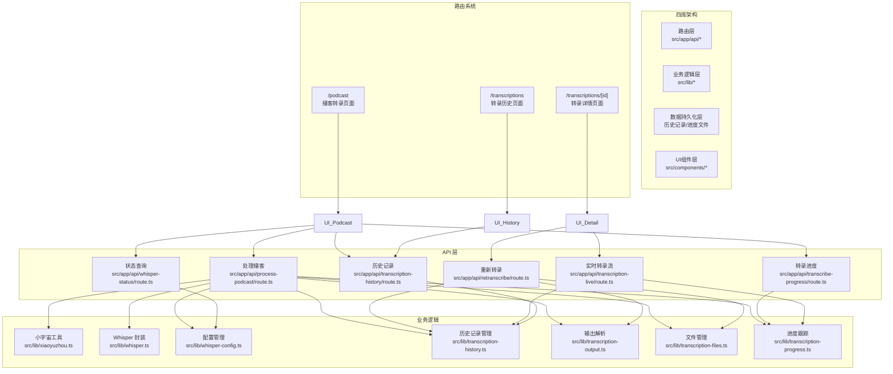

**图表来源**
- [src/app/podcast/page.tsx:1-522](file://src/app/podcast/page.tsx#L1-L522)
- [src/app/transcriptions/[id]/page.tsx:1-93](file://src/app/transcriptions/[id]/page.tsx#L1-L93)
- [src/app/transcriptions/page.tsx:1-85](file://src/app/transcriptions/page.tsx#L1-L85)
- [src/app/api/retranscribe/route.ts:1-364](file://src/app/api/retranscribe/route.ts#L1-L364)
- [src/app/api/transcription-live/route.ts:1-119](file://src/app/api/transcription-live/route.ts#L1-L119)
- [src/components/transcription-detail.tsx:1-394](file://src/components/transcription-detail.tsx#L1-L394)
- [src/lib/transcription-history.ts:1-128](file://src/lib/transcription-history.ts#L1-L128)
- [src/lib/transcription-output.ts:1-123](file://src/lib/transcription-output.ts#L1-L123)
- [src/lib/transcription-files.ts:1-95](file://src/lib/transcription-files.ts#L1-L95)
- [src/lib/transcription-progress.ts:1-44](file://src/lib/transcription-progress.ts#L1-L44)

**章节来源**
- [src/app/podcast/page.tsx:1-522](file://src/app/podcast/page.tsx#L1-L522)
- [src/app/transcriptions/[id]/page.tsx:1-93](file://src/app/transcriptions/[id]/page.tsx#L1-L93)
- [src/app/transcriptions/page.tsx:1-85](file://src/app/transcriptions/page.tsx#L1-L85)
- [src/app/api/retranscribe/route.ts:1-364](file://src/app/api/retranscribe/route.ts#L1-L364)
- [src/app/api/transcription-live/route.ts:1-119](file://src/app/api/transcription-live/route.ts#L1-L119)
- [src/components/transcription-detail.tsx:1-394](file://src/components/transcription-detail.tsx#L1-L394)
- [src/lib/transcription-history.ts:1-128](file://src/lib/transcription-history.ts#L1-L128)
- [src/lib/transcription-output.ts:1-123](file://src/lib/transcription-output.ts#L1-L123)
- [src/lib/transcription-files.ts:1-95](file://src/lib/transcription-files.ts#L1-L95)
- [src/lib/transcription-progress.ts:1-44](file://src/lib/transcription-progress.ts#L1-L44)

## 核心组件
- **播客转录页面**：负责表单输入、状态管理、错误提示与结果展示，支持实时转录进度跟踪和转录历史记录
- **转录详情页面**：展示单个转录任务的详细信息，支持实时进度跟踪和重新转录功能
- **转录历史页面**：展示所有转录历史记录，支持按时间排序和卡片式展示
- **小宇宙工具**：从播客页面提取音频 URL 与元数据，支持多策略获取
- **Whisper 封装**：封装本地 whisper.cpp 调用，支持实时转录流和进度跟踪
- **API 路由**：提供播客处理、状态查询、配置管理、模型下载与进度推送、安装进度跟踪、历史记录管理、重新转录、实时转录流
- **转录历史管理**：管理转录记录的持久化存储，支持增删查改操作
- **历史记录卡片**：展示转录历史的可视化组件
- **输出解析系统**：解析 Whisper 输出、处理 SRT 文件、生成多种格式文件
- **进度跟踪系统**：管理临时进度文件、合并数据、提供实时状态流
- **文件管理系统**：组织输出文件结构、生成逐字稿、处理文件命名

**章节来源**
- [src/app/podcast/page.tsx:16-522](file://src/app/podcast/page.tsx#L16-L522)
- [src/app/transcriptions/[id]/page.tsx:13-93](file://src/app/transcriptions/[id]/page.tsx#L13-L93)
- [src/app/transcriptions/page.tsx:7-85](file://src/app/transcriptions/page.tsx#L7-L85)
- [src/lib/xiaoyuzhou.ts:27-47](file://src/lib/xiaoyuzhou.ts#L27-L47)
- [src/lib/whisper.ts:54-156](file://src/lib/whisper.ts#L54-L156)
- [src/components/transcription-card.tsx:14-92](file://src/components/transcription-card.tsx#L14-L92)
- [src/lib/transcription-output.ts:20-123](file://src/lib/transcription-output.ts#L20-L123)
- [src/lib/transcription-files.ts:33-95](file://src/lib/transcription-files.ts#L33-L95)
- [src/lib/transcription-progress.ts:9-44](file://src/lib/transcription-progress.ts#L9-L44)

## 架构总览
系统采用"四库架构 + 实时流处理"的设计模式。前端通过独立的 `/podcast` 路由处理播客转录，通过 `/transcriptions` 路由管理历史记录，后端调用小宇宙 API/页面解析获取音频 URL，下载音频至临时目录，调用 whisper.cpp 进行转写，返回转录文本与音频信息。新版本支持实时转录流、进度跟踪、完整的转录历史记录管理和重新转录功能。四库架构确保了代码的模块化和可维护性。

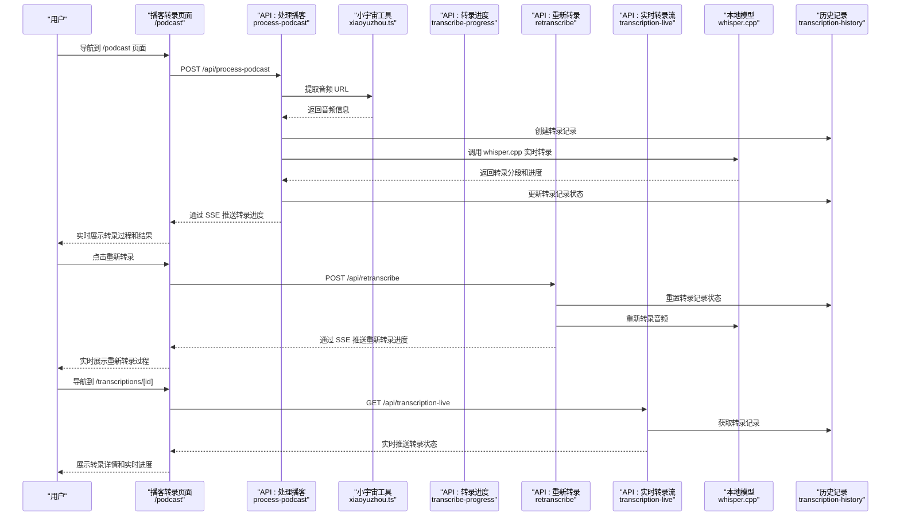

**图表来源**
- [src/app/podcast/page.tsx:119-253](file://src/app/podcast/page.tsx#L119-L253)
- [src/app/api/process-podcast/route.ts:459-512](file://src/app/api/process-podcast/route.ts#L459-L512)
- [src/lib/xiaoyuzhou.ts:27-47](file://src/lib/xiaoyuzhou.ts#L27-L47)
- [src/app/api/transcribe-progress/route.ts:32-122](file://src/app/api/transcribe-progress/route.ts#L32-L122)
- [src/app/api/retranscribe/route.ts:319-397](file://src/app/api/retranscribe/route.ts#L319-L397)
- [src/app/api/transcription-live/route.ts:43-126](file://src/app/api/transcription-live/route.ts#L43-L126)
- [src/lib/transcription-history.ts:71-104](file://src/lib/transcription-history.ts#L71-L104)

## 详细组件分析

### 四库架构设计
系统采用四库架构确保代码的模块化和可维护性：

- **路由层**：处理 HTTP 请求和响应，负责参数验证和错误处理
- **业务逻辑层**：封装核心算法和数据处理逻辑，提供可复用的功能模块
- **数据持久化层**：管理历史记录和进度状态，提供数据访问接口
- **UI组件层**：提供用户交互界面，负责状态管理和事件处理

**章节来源**
- [src/app/api/process-podcast/route.ts:343-396](file://src/app/api/process-podcast/route.ts#L343-L396)
- [src/lib/transcription-history.ts:71-104](file://src/lib/transcription-history.ts#L71-L104)
- [src/lib/transcription-progress.ts:13-43](file://src/lib/transcription-progress.ts#L13-L43)

### 前端状态管理与用户交互
- **表单状态**：包含 URL 输入、加载状态、转录结果、音频信息
- **实时转录状态**：包括任务ID、转录阶段、状态、实时片段、进度百分比
- **转录历史状态**：管理历史记录列表、加载状态
- **链接验证**：仅支持小宇宙域名
- **状态检查**：调用 /api/whisper-status 确认 Whisper 安装与模型状态
- **API 调用**：POST /api/process-podcast 获取转录结果
- **实时进度**：通过 EventSource 连接 /api/transcribe-progress 实时接收转录进度
- **转录历史**：自动加载和刷新转录历史记录
- **重新转录**：支持对已完成或出错的任务进行重新转录
- **结果展示**：音频信息卡片与转录文本卡片，支持纯文本与格式化两种视图
- **用户反馈**：Toast 提示与 FlowLoader 加载动画

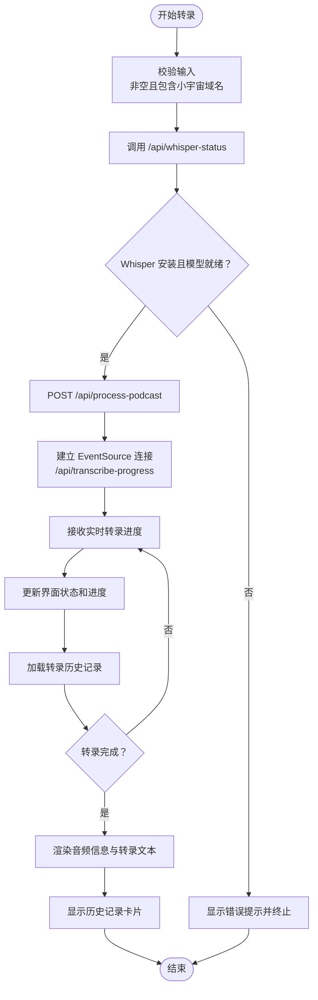

**图表来源**
- [src/app/podcast/page.tsx:119-253](file://src/app/podcast/page.tsx#L119-L253)
- [src/app/api/whisper-status/route.ts:11-59](file://src/app/api/whisper-status/route.ts#L11-L59)
- [src/app/api/process-podcast/route.ts:459-512](file://src/app/api/process-podcast/route.ts#L459-L512)
- [src/app/api/transcribe-progress/route.ts:32-122](file://src/app/api/transcribe-progress/route.ts#L32-L122)

**章节来源**
- [src/app/podcast/page.tsx:16-522](file://src/app/podcast/page.tsx#L16-L522)
- [src/components/ui/toast.tsx:13-67](file://src/components/ui/toast.tsx#L13-L67)
- [src/components/ui/flow-loader.tsx:10-58](file://src/components/ui/flow-loader.tsx#L10-L58)

### 小宇宙平台集成实现
- **多策略提取**：优先官方 API，其次页面 HTML，最后第三方 API
- **数据解析**：从响应中提取标题、描述、音频 URL、时长、发布时间、作者、封面图
- **容错机制**：任一策略失败则尝试下一个，全部失败抛出明确错误

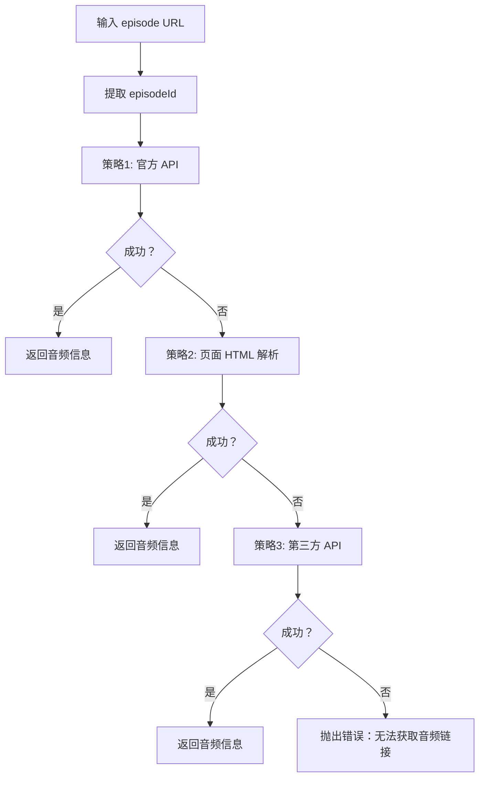

**图表来源**
- [src/lib/xiaoyuzhou.ts:27-47](file://src/lib/xiaoyuzhou.ts#L27-L47)
- [src/lib/xiaoyuzhou.ts:52-89](file://src/lib/xiaoyuzhou.ts#L52-L89)
- [src/lib/xiaoyuzhou.ts:94-164](file://src/lib/xiaoyuzhou.ts#L94-L164)
- [src/lib/xiaoyuzhou.ts:169-197](file://src/lib/xiaoyuzhou.ts#L169-L197)

**章节来源**
- [src/lib/xiaoyuzhou.ts:19-47](file://src/lib/xiaoyuzhou.ts#L19-L47)
- [src/lib/xiaoyuzhou.ts:52-197](file://src/lib/xiaoyuzhou.ts#L52-L197)

### 新的转录工作流程
- **异步处理**：采用 fire-and-forget 模式，立即返回任务ID
- **后台处理**：processInBackground 函数处理完整的转录流程
- **状态管理**：通过临时文件和数据库记录转录状态
- **实时更新**：每500ms更新一次进度和片段
- **文件保存**：生成简介.md、逐字稿.txt、纯文本.txt 三种格式文件
- **历史记录**：自动创建和更新转录历史记录

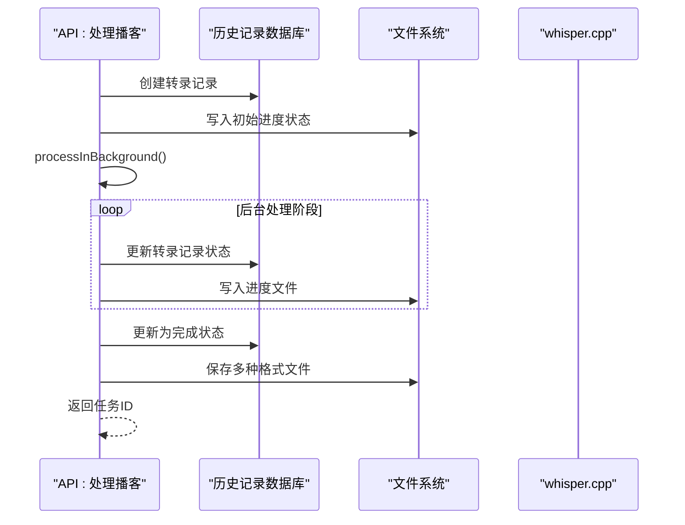

**图表来源**
- [src/app/api/process-podcast/route.ts:221-457](file://src/app/api/process-podcast/route.ts#L221-L457)
- [src/lib/transcription-history.ts:71-104](file://src/lib/transcription-history.ts#L71-L104)

**章节来源**
- [src/app/api/process-podcast/route.ts:221-457](file://src/app/api/process-podcast/route.ts#L221-L457)
- [src/lib/transcription-history.ts:71-104](file://src/lib/transcription-history.ts#L71-L104)

### 实时转录进度跟踪
- **进度文件**：使用临时目录存储转录进度 JSON 文件
- **SSE 推送**：通过 /api/transcribe-progress API 实时推送转录状态
- **分段处理**：解析 whisper.cpp 输出的分段信息，格式为 "[00:01:23.456 --> 00:01:28.000]"
- **进度计算**：从 stderr 中提取进度百分比，每 500ms 更新一次
- **状态管理**：支持 fetching_info、downloading_audio、converting、transcribing、completed、error 六种状态
- **历史记录同步**：实时更新转录历史记录的状态和进度

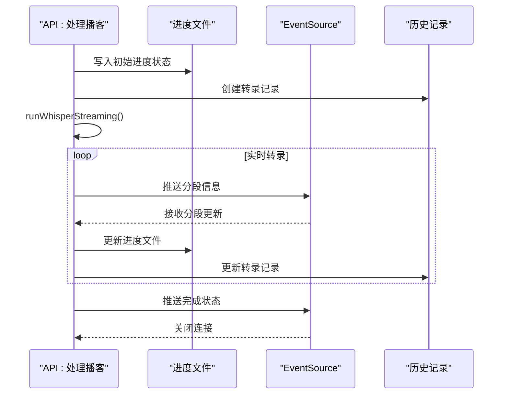

**图表来源**
- [src/app/api/process-podcast/route.ts:25-43](file://src/app/api/process-podcast/route.ts#L25-L43)
- [src/app/api/transcribe-progress/route.ts:32-122](file://src/app/api/transcribe-progress/route.ts#L32-L122)
- [src/app/api/process-podcast/route.ts:338-386](file://src/app/api/process-podcast/route.ts#L338-L386)

**章节来源**
- [src/app/api/process-podcast/route.ts:25-43](file://src/app/api/process-podcast/route.ts#L25-L43)
- [src/app/api/transcribe-progress/route.ts:32-122](file://src/app/api/transcribe-progress/route.ts#L32-L122)

### 重新转录功能
- **重新转录 API**：通过 `/api/retranscribe` 支持对已完成或出错的任务进行重新转录
- **跳过信息获取**：直接使用已有的 audioUrl 下载并转录，跳过播客信息获取步骤
- **状态重置**：重置转录记录状态为 downloading_audio，清除之前的转录结果
- **实时进度**：重新建立 SSE 连接，实时推送重新转录进度
- **历史记录同步**：更新转录历史记录的状态和进度

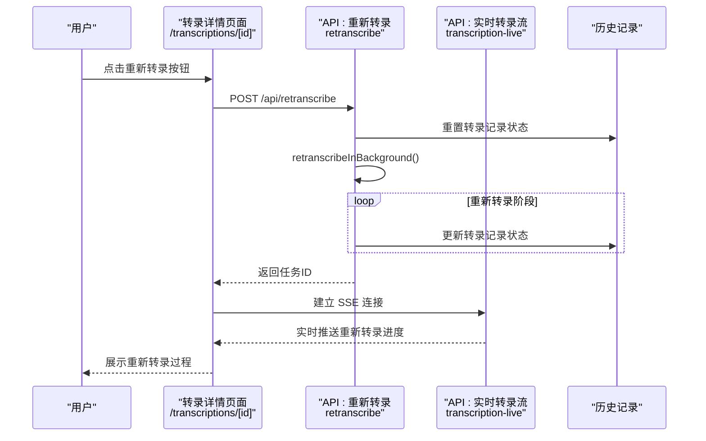

**图表来源**
- [src/app/api/retranscribe/route.ts:319-397](file://src/app/api/retranscribe/route.ts#L319-L397)
- [src/components/transcription-detail.tsx:109-172](file://src/components/transcription-detail.tsx#L109-L172)
- [src/app/api/transcription-live/route.ts:43-126](file://src/app/api/transcription-live/route.ts#L43-L126)

**章节来源**
- [src/app/api/retranscribe/route.ts:158-317](file://src/app/api/retranscribe/route.ts#L158-L317)
- [src/components/transcription-detail.tsx:109-172](file://src/components/transcription-detail.tsx#L109-L172)

### 实时转录流功能
- **实时流 API**：通过 `/api/transcription-live` 提供实时转录状态流
- **进度文件合并**：合并进度文件数据到历史记录中，确保数据完整性
- **800ms 推送间隔**：每 800ms 推送一次最新转录状态
- **自动关闭**：当转录完成或出错时自动关闭连接
- **重连机制**：客户端断开时自动重连，确保实时更新

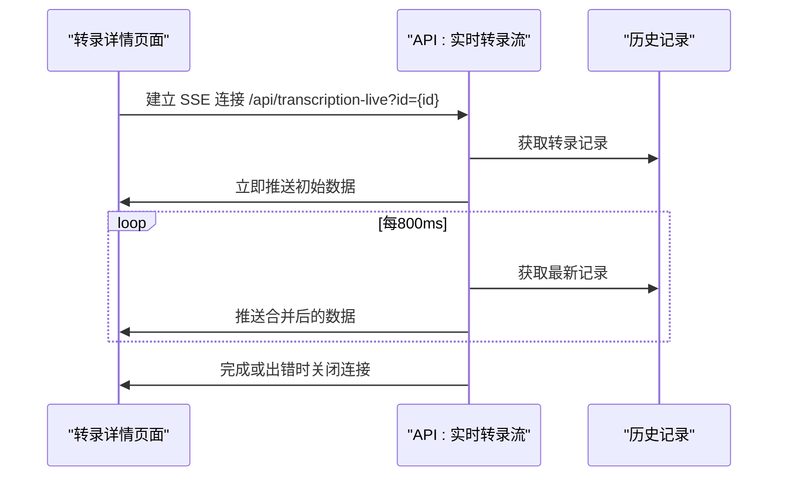

**图表来源**
- [src/app/api/transcription-live/route.ts:43-126](file://src/app/api/transcription-live/route.ts#L43-L126)
- [src/components/transcription-detail.tsx:62-106](file://src/components/transcription-detail.tsx#L62-L106)

**章节来源**
- [src/app/api/transcription-live/route.ts:15-41](file://src/app/api/transcription-live/route.ts#L15-L41)
- [src/components/transcription-detail.tsx:62-106](file://src/components/transcription-detail.tsx#L62-L106)

### 转录历史记录管理
- **持久化存储**：使用临时目录存储历史记录 JSON 文件
- **实时更新**：后台进程实时更新转录状态和进度
- **查询接口**：支持获取所有记录和特定记录详情
- **删除功能**：支持删除指定的转录记录
- **时间管理**：自动记录创建时间和最后更新时间
- **状态同步**：前端自动刷新历史记录列表
- **路由集成**：支持 `/transcriptions` 和 `/transcriptions/[id]` 路由

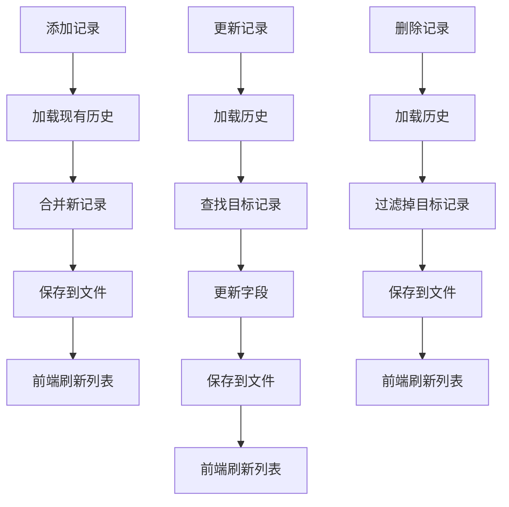

**图表来源**
- [src/lib/transcription-history.ts:71-104](file://src/lib/transcription-history.ts#L71-L104)
- [src/app/api/transcription-history/route.ts:9-80](file://src/app/api/transcription-history/route.ts#L9-L80)

**章节来源**
- [src/lib/transcription-history.ts:1-128](file://src/lib/transcription-history.ts#L1-L128)
- [src/app/api/transcription-history/route.ts:1-80](file://src/app/api/transcription-history/route.ts#L1-L80)

### Whisper 本地转写流程
- **配置检查**：通过 /api/whisper-config 获取路径与线程数
- **模型存在性**：检查 whisperPath 与 modelPath
- **实时转录**：使用 spawn 方式调用 whisper.cpp，支持实时分段输出和进度跟踪
- **进度处理**：通过正则表达式解析 stderr 中的分段信息和进度百分比
- **文件输出**：生成简介.md、逐字稿.txt、纯文本.txt 三种格式文件
- **错误处理**：执行失败时记录日志并返回错误信息

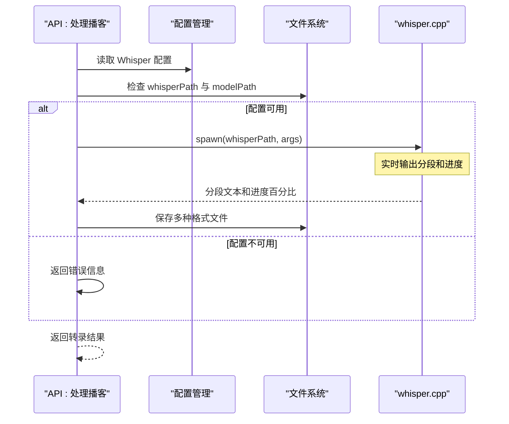

**图表来源**
- [src/app/api/process-podcast/route.ts:338-386](file://src/app/api/process-podcast/route.ts#L338-L386)
- [src/lib/whisper-config.ts:57-74](file://src/lib/whisper-config.ts#L57-L74)
- [src/lib/whisper.ts:54-156](file://src/lib/whisper.ts#L54-L156)

**章节来源**
- [src/app/api/process-podcast/route.ts:320-386](file://src/app/api/process-podcast/route.ts#L320-L386)
- [src/lib/whisper.ts:38-81](file://src/lib/whisper.ts#L38-L81)
- [src/lib/whisper.ts:103-156](file://src/lib/whisper.ts#L103-L156)

### 输出解析系统
- **SRT 文件解析**：解析标准 SRT 格式的字幕文件，提取时间戳和文本内容
- **逐字稿生成**：将转录片段转换为带时间戳的逐字稿格式
- **纯文本输出**：生成简洁的纯文本转录内容
- **格式标准化**：统一时间戳格式，处理换行符和特殊字符
- **数据完整性**：确保解析后的数据结构一致性和完整性

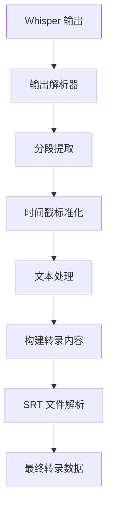

**图表来源**
- [src/lib/transcription-output.ts:27-60](file://src/lib/transcription-output.ts#L27-L60)
- [src/lib/transcription-output.ts:67-122](file://src/lib/transcription-output.ts#L67-L122)

**章节来源**
- [src/lib/transcription-output.ts:20-123](file://src/lib/transcription-output.ts#L20-L123)

### 文件管理系统
- **目录结构**：按播客标题创建独立的输出目录，避免文件冲突
- **文件命名**：生成简介.md、逐字稿.txt、纯文本.txt 等标准文件
- **内容格式**：包含播客元信息、描述、作者、时长等详细信息
- **路径解析**：支持已保存路径的解析和输出目录的动态确定
- **清理机制**：自动清理临时文件，避免磁盘空间占用

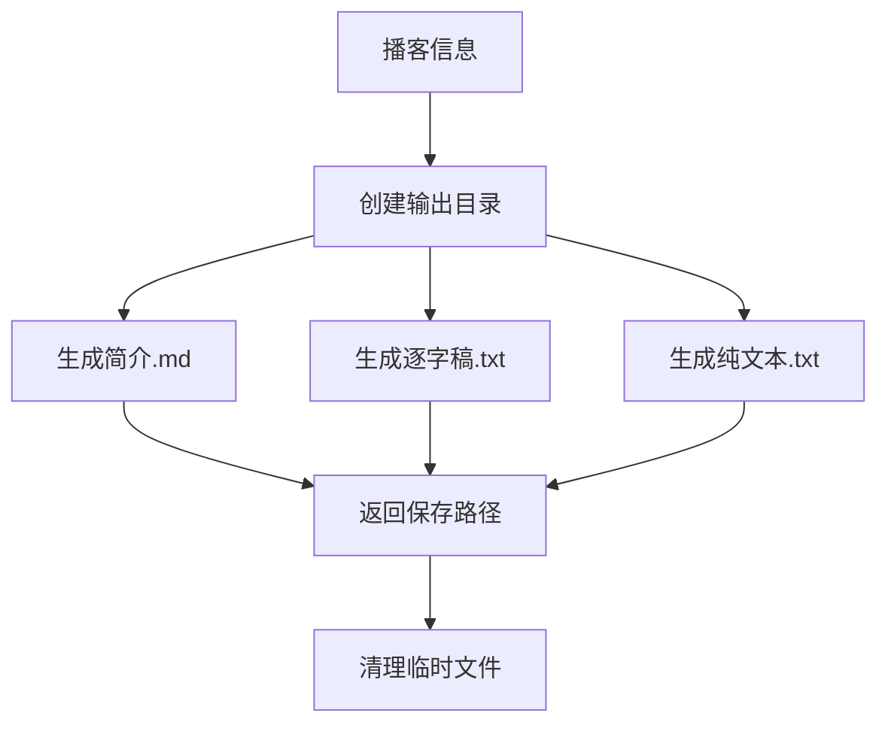

**图表来源**
- [src/lib/transcription-files.ts:52-82](file://src/lib/transcription-files.ts#L52-L82)
- [src/lib/transcription-files.ts:84-95](file://src/lib/transcription-files.ts#L84-L95)

**章节来源**
- [src/lib/transcription-files.ts:33-95](file://src/lib/transcription-files.ts#L33-L95)

### 进度跟踪系统
- **临时文件管理**：使用 UUID 生成唯一的进度文件名，避免并发冲突
- **数据合并**：实时合并进度文件和历史记录数据，确保状态一致性
- **状态同步**：通过 800ms 间隔推送最新的转录状态
- **错误处理**：处理文件读取失败、数据解析错误等情况
- **清理机制**：转录完成后延迟清理进度文件，确保客户端完整接收数据

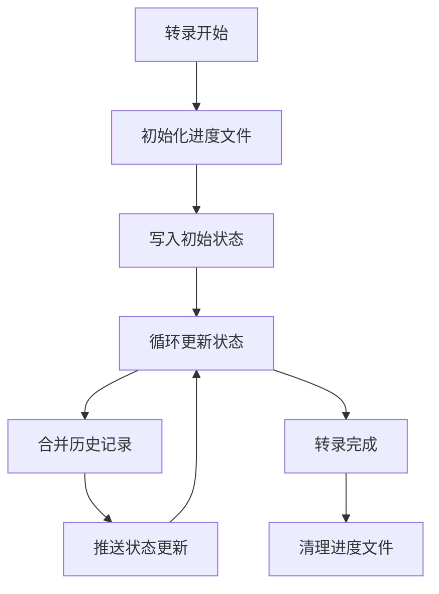

**图表来源**
- [src/lib/transcription-progress.ts:13-43](file://src/lib/transcription-progress.ts#L13-L43)
- [src/app/api/transcription-live/route.ts:8-34](file://src/app/api/transcription-live/route.ts#L8-L34)

**章节来源**
- [src/lib/transcription-progress.ts:9-44](file://src/lib/transcription-progress.ts#L9-L44)
- [src/app/api/transcription-live/route.ts:1-119](file://src/app/api/transcription-live/route.ts#L1-L119)

### 设置与模型下载
- **设置对话框**：展示 Whisper 安装与模型状态，支持模型选择与高级配置
- **模型下载**：POST /api/whisper-download 触发后台下载，使用 SSE 推送进度
- **进度监听**：/api/whisper-download-progress 通过 EventSource 实时推送下载状态
- **安装管理**：支持 whisper.cpp 的克隆、编译和安装，提供进度跟踪

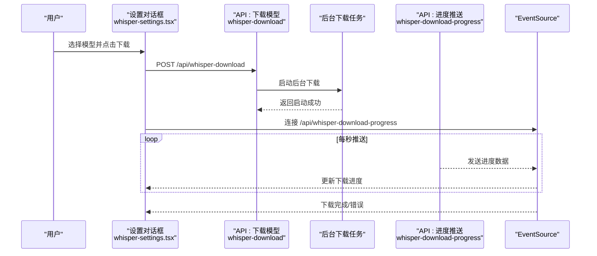

**图表来源**
- [src/components/whisper-settings.tsx:62-200](file://src/components/whisper-settings.tsx#L62-L200)
- [src/app/api/whisper-download/route.ts:173-200](file://src/app/api/whisper-download/route.ts#L173-L200)
- [src/app/api/whisper-download-progress/route.ts:45-141](file://src/app/api/whisper-download-progress/route.ts#L45-L141)

**章节来源**
- [src/components/whisper-settings.tsx:62-200](file://src/components/whisper-settings.tsx#L62-L200)
- [src/app/api/whisper-download/route.ts:52-167](file://src/app/api/whisper-download/route.ts#L52-L167)
- [src/app/api/whisper-download-progress/route.ts:45-141](file://src/app/api/whisper-download-progress/route.ts#L45-L141)

### API 定义与数据模型
- **统一响应结构**：包含 success、data、error 字段
- **Whisper 配置**：whisperPath、modelPath、modelName、threads、outputDir
- **Whisper 状态**：whisperInstalled、modelInstalled、modelSize、modelName
- **转录进度**：taskId、status、stage、segments、transcript、progress 等
- **转录记录**：id、taskId、title、status、progress、segments、transcript、wordCount、savedPath、createdAt、updatedAt
- **重新转录请求**：包含转录记录 ID
- **实时转录流**：支持按 ID 获取实时转录状态流

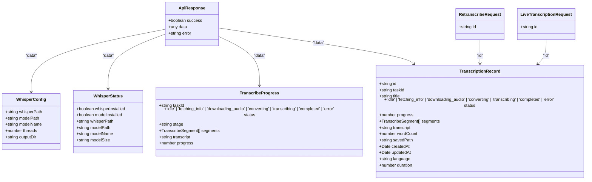

**图表来源**
- [src/types/index.ts:1-43](file://src/types/index.ts#L1-L43)
- [src/types/transcription-history.ts:3-18](file://src/types/transcription-history.ts#L3-L18)

**章节来源**
- [src/types/index.ts:1-43](file://src/types/index.ts#L1-L43)
- [src/types/transcription-history.ts:1-23](file://src/types/transcription-history.ts#L1-L23)

## 依赖关系分析
- **前端依赖**：Next.js、React、TailwindCSS、Radix UI、lucide-react、xml2js
- **后端依赖**：Node.js fs、path、os、child_process、fetch、EventSource
- **外部服务**：小宇宙官方 API、第三方 API、Hugging Face 镜像源
- **本地依赖**：whisper.cpp、ffmpeg、cmake

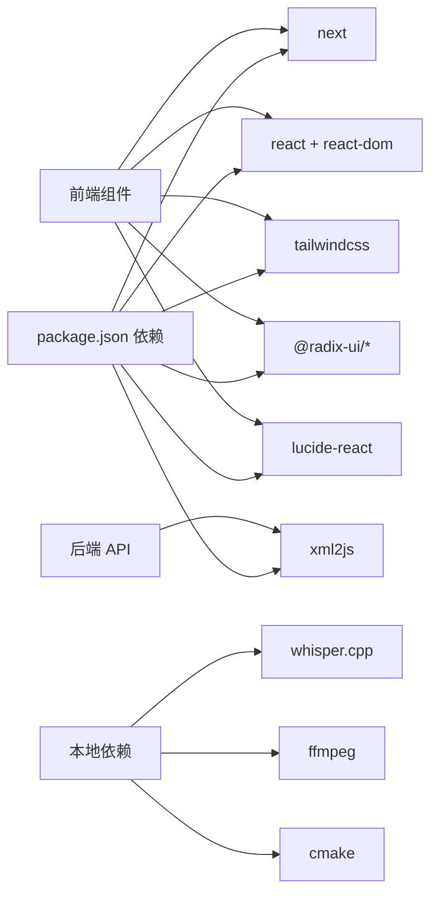

**图表来源**
- [package.json:12-35](file://package.json#L12-L35)

**章节来源**
- [package.json:12-35](file://package.json#L12-L35)

## 性能考虑
- **本地转写**：whisper.cpp 在本地执行，避免网络延迟，但受 CPU/内存影响
- **模型选择**：small 模型体积小、速度较快；medium 模型更准确但体积大
- **线程数**：根据 CPU 核心数合理设置，建议设置为 CPU 核心数的一半
- **异步处理**：采用 fire-and-forget 模式，避免阻塞主线程
- **进度优化**：每 500ms 更新一次进度，平衡实时性和性能
- **文件管理**：下载完成后及时删除，避免磁盘占用
- **历史记录**：使用临时文件存储，避免数据库压力
- **并发控制**：避免同时发起多个转录任务，建议串行或队列化处理
- **缓存策略**：对已转录的音频可考虑缓存结果（需自行扩展）
- **实时流优化**：800ms 推送间隔平衡实时性和服务器负载
- **重新转录优化**：跳过信息获取步骤，直接使用已有的音频 URL
- **内存管理**：及时清理临时文件和进度数据，避免内存泄漏
- **并发安全**：使用 UUID 生成唯一文件名，避免并发写入冲突

## 故障排除指南
- **路由访问问题**：确保导航到正确的路由（`/podcast`、`/transcriptions`、`/transcriptions/[id]`）
- **链接不支持**：仅支持小宇宙播客链接，其他平台暂不支持
- **Whisper 未安装**：前端会提示前往设置安装 Whisper 并下载模型
- **模型未下载**：设置对话框中选择模型并下载，注意网络与磁盘空间
- **下载失败**：检查网络连接与磁盘权限，查看进度对话框中的错误信息
- **转写失败**：检查 whisper.cpp 可执行文件与模型文件路径，查看后端日志
- **进度无更新**：确认 EventSource 连接正常，浏览器允许 SSE
- **实时转录异常**：检查 whisper.cpp 输出格式，确认正则表达式匹配正确
- **文件生成失败**：检查输出目录权限，确认有足够磁盘空间
- **历史记录丢失**：检查临时目录权限，确认历史记录文件可读写
- **进程超时**：whisper 转录超时（超过 10 分钟），检查音频文件大小和系统性能
- **重新转录失败**：检查转录记录是否存在，确认音频 URL 可访问
- **实时流断开**：检查网络连接，客户端会自动重连
- **SRT 文件解析失败**：检查 SRT 文件格式，确认时间戳格式正确
- **进度文件冲突**：检查 UUID 生成和文件锁定机制，避免并发写入

**章节来源**
- [src/app/podcast/page.tsx:135-161](file://src/app/podcast/page.tsx#L135-L161)
- [src/app/api/process-podcast/route.ts:150-168](file://src/app/api/process-podcast/route.ts#L150-L168)
- [src/lib/transcription-history.ts:23-50](file://src/lib/transcription-history.ts#L23-L50)

## 结论
该播客转录功能通过清晰的四库架构设计与多策略的小宇宙集成，实现了从链接输入到转录结果展示的完整流程。新版本完全替换了原有的模拟转录系统，采用真实的 Whisper 语音转文本引擎，支持实时转录流、进度跟踪、完整的转录历史记录管理和重新转录功能。新增的四库架构提供了更好的代码组织和可维护性，独立的 `/podcast` 路由专注于转录功能，`/transcriptions` 路由提供历史记录管理，`/transcriptions/[id]` 路由展示详细的转录信息。前端提供良好的用户体验，后端保证了稳定性与可扩展性。建议在生产环境中进一步完善并发控制、错误恢复与监控告警机制。

## 附录
- **使用示例**
  - **正常场景**：导航到 `/podcast` 页面 → 输入有效的"小宇宙播客链接" → 点击"开始转录" → 实时查看转录进度 → 等待转录完成 → 查看音频信息与转录文本 → 在 `/transcriptions` 页面查看历史记录
  - **重新转录**：在 `/transcriptions/[id]` 详情页面 → 点击"重新转录"按钮 → 等待重新转录完成 → 实时查看重新转录进度
  - **未安装 Whisper**：点击左侧"设置" → 安装 Whisper 并下载模型 → 返回 `/podcast` 页面继续转录
  - **链接无效**：输入非小宇宙链接或格式不正确 → 前端提示错误并阻止提交
  - **网络异常**：网络不稳定导致音频下载失败 → 刷新页面重试或检查网络
  - **实时转录**：转录过程中可看到实时分段输出和进度百分比
  - **历史记录**：转录完成后可在 `/transcriptions` 页面查看和管理之前的转录任务
  - **详情查看**：点击历史记录卡片 → 进入 `/transcriptions/[id]` 页面 → 查看详细的转录信息和实时进度
  - **输出解析**：系统自动生成 SRT 文件、逐字稿和纯文本格式
  - **文件管理**：转录结果按播客标题组织在输出目录中
- **最佳实践**
  - 优先使用小内存模型（small）进行快速测试，再切换到高精度模型（medium）
  - 合理设置线程数，避免过度占用系统资源
  - 定期清理临时文件与旧模型，释放磁盘空间
  - 对外暴露 API 时增加速率限制与鉴权机制
  - 监控 whisper.cpp 进程状态，确保转录任务正常执行
  - 合理配置输出目录，确保有足够磁盘空间存储转录文件
  - 定期备份历史记录文件，防止意外丢失
  - 利用重新转录功能处理转录失败的情况
  - 使用实时转录流功能监控长时间转录任务的进度
  - 实施适当的错误处理和重试机制
  - 监控内存使用情况，避免长时间运行导致的内存泄漏
  - 实施适当的日志记录和监控告警机制