# 本地助手服务

<cite>
**本文档引用的文件**
- [helper/server.js](file://helper/server.js)
- [package.json](file://package.json)
- [src/lib/local-helper-client.ts](file://src/lib/local-helper-client.ts)
- [src/app/api/whisper-status/route.ts](file://src/app/api/whisper-status/route.ts)
- [src/app/api/whisper-install/route.ts](file://src/app/api/whisper-install/route.ts)
- [src/lib/whisper-config.ts](file://src/lib/whisper-config.ts)
- [src/lib/transcription-task-manager.ts](file://src/lib/transcription-task-manager.ts)
- [src/app/api/transcription-live/route.ts](file://src/app/api/transcription-live/route.ts)
- [src/app/api/transcription-history/route.ts](file://src/app/api/transcription-history/route.ts)
- [src/types/index.ts](file://src/types/index.ts)
- [src/lib/transcription-history.ts](file://src/lib/transcription-history.ts)
- [src/lib/transcription-progress.ts](file://src/lib/transcription-progress.ts)
- [src/app/api/process-podcast/route.ts](file://src/app/api/process-podcast/route.ts)
- [src/components/transcription-card.tsx](file://src/components/transcription-card.tsx)
- [src/app/page.tsx](file://src/app/page.tsx)
</cite>

## 目录
1. [简介](#简介)
2. [项目结构](#项目结构)
3. [核心组件](#核心组件)
4. [架构概览](#架构概览)
5. [详细组件分析](#详细组件分析)
6. [依赖关系分析](#依赖关系分析)
7. [性能考虑](#性能考虑)
8. [故障排除指南](#故障排除指南)
9. [结论](#结论)

## 简介

本地助手服务是一个基于 Node.js 的桌面应用程序，专门为 MemoFlow 项目提供本地音频转录功能。该服务支持多种转录引擎，包括本地 Whisper.cpp 和在线千问 ASR，能够自动处理播客内容的下载、转换和转录过程。

该项目采用前后端分离架构，前端使用 Next.js 构建用户界面，后端通过本地助手服务提供强大的音频处理能力。服务支持实时转录进度监控、历史记录管理和文件输出生成功能。

## 项目结构

项目采用模块化的组织方式，主要分为以下几个部分：

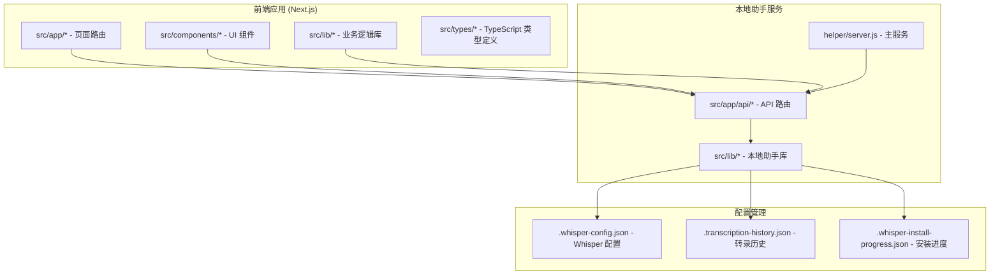

**图表来源**
- [package.json:1-41](file://package.json#L1-L41)
- [helper/server.js:1-800](file://helper/server.js#L1-L800)

**章节来源**
- [package.json:1-41](file://package.json#L1-L41)
- [helper/server.js:1-800](file://helper/server.js#L1-L800)

## 核心组件

### 本地助手服务核心功能

本地助手服务提供了完整的音频转录解决方案，主要包括以下核心功能：

1. **配置管理**: 自动检测和配置 Whisper.cpp、FFmpeg 等外部依赖
2. **转录引擎**: 支持本地 Whisper.cpp 和在线千问 ASR 两种转录模式
3. **实时监控**: 通过 Server-Sent Events 提供转录进度实时更新
4. **文件管理**: 自动创建和管理转录输出文件
5. **任务控制**: 支持任务取消、暂停和恢复功能

### 关键配置参数

服务使用环境变量进行灵活配置：

| 环境变量 | 默认值 | 描述 |
|---------|--------|------|
| MEMOFLOW_HELPER_HOST | 127.0.0.1 | 服务监听地址 |
| MEMOFLOW_HELPER_PORT | 47392 | 服务端口号 |
| MEMOFLOW_HELPER_DATA_DIR | 平台特定 | 应用数据目录 |
| WHISPER_PATH | whisper-cli | Whisper 可执行文件路径 |
| WHISPER_MODEL_PATH | models/ggml-small.bin | 模型文件路径 |
| OUTPUT_DIR | transcripts | 输出目录 |

**章节来源**
- [helper/server.js:9-56](file://helper/server.js#L9-L56)
- [helper/server.js:247-256](file://helper/server.js#L247-L256)

## 架构概览

本地助手服务采用分层架构设计，实现了清晰的关注点分离：

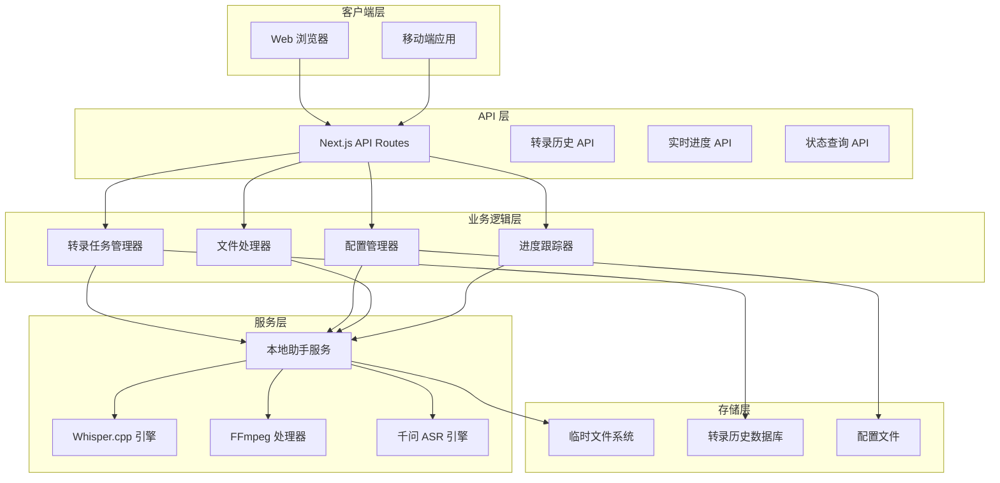

**图表来源**
- [src/app/api/process-podcast/route.ts:1-799](file://src/app/api/process-podcast/route.ts#L1-L799)
- [src/lib/transcription-task-manager.ts:1-170](file://src/lib/transcription-task-manager.ts#L1-L170)

## 详细组件分析

### 本地助手服务主进程

本地助手服务的核心是 helper/server.js 文件，它提供了完整的音频转录服务：

#### 服务初始化流程

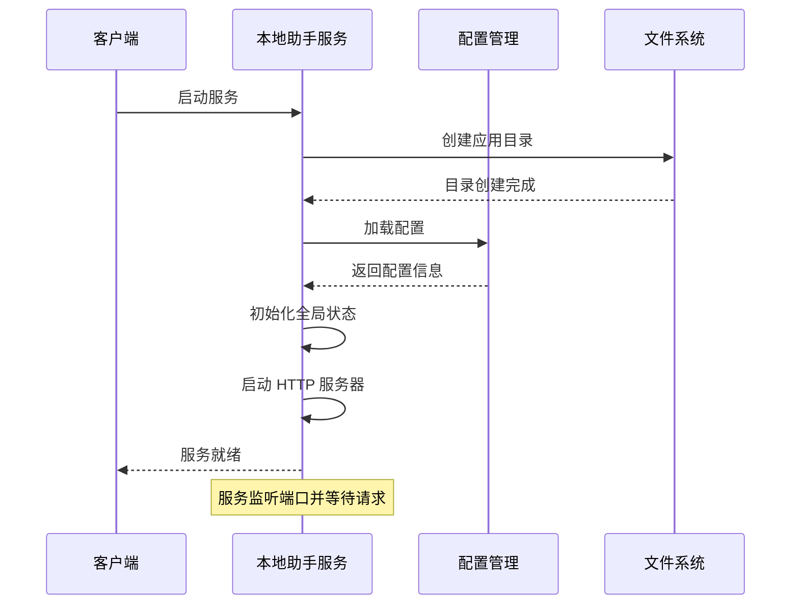

**图表来源**
- [helper/server.js:119-123](file://helper/server.js#L119-L123)
- [helper/server.js:258-284](file://helper/server.js#L258-L284)

#### 转录任务处理流程

服务支持两种主要的转录模式：

1. **本地 Whisper.cpp 转录**
2. **在线千问 ASR 转录**

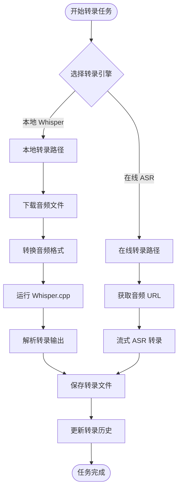

**图表来源**
- [src/app/api/process-podcast/route.ts:400-724](file://src/app/api/process-podcast/route.ts#L400-L724)
- [src/lib/transcription-task-manager.ts:55-74](file://src/lib/transcription-task-manager.ts#L55-L74)

**章节来源**
- [helper/server.js:173-202](file://helper/server.js#L173-L202)
- [src/app/api/process-podcast/route.ts:1-799](file://src/app/api/process-podcast/route.ts#L1-L799)

### 配置管理系统

配置管理系统负责管理 Whisper.cpp 和相关工具的配置：

#### 配置加载流程

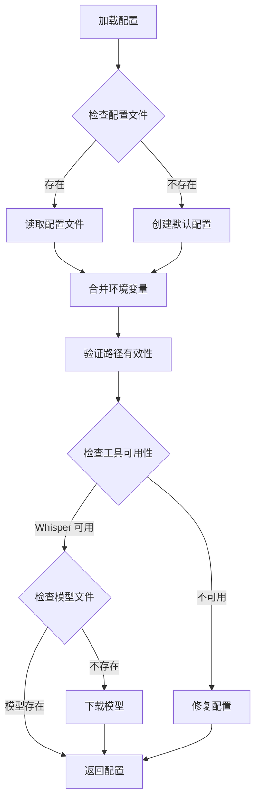

**图表来源**
- [src/lib/whisper-config.ts:324-354](file://src/lib/whisper-config.ts#L324-L354)
- [src/lib/whisper-config.ts:95-181](file://src/lib/whisper-config.ts#L95-L181)

#### 路径解析机制

配置系统支持多种路径解析方式：

| 路径类型 | 解析规则 | 示例 |
|---------|---------|------|
| 绝对路径 | 直接使用 | `/usr/local/bin/whisper-cli` |
| 相对路径 | 相对于项目根目录 | `./whisper.cpp/build/bin/whisper-cli` |
| 命令路径 | 通过 `which/command -v` 查找 | `whisper-cli` |
| 项目前缀 | 以项目名开头的相对路径 | `MemoFlow/whisper.cpp/build/bin/whisper-cli` |

**章节来源**
- [src/lib/whisper-config.ts:56-73](file://src/lib/whisper-config.ts#L56-L73)
- [src/lib/whisper-config.ts:28-48](file://src/lib/whisper-config.ts#L28-L48)

### 实时进度监控系统

服务通过 Server-Sent Events 提供实时进度更新：

#### 进度监控架构

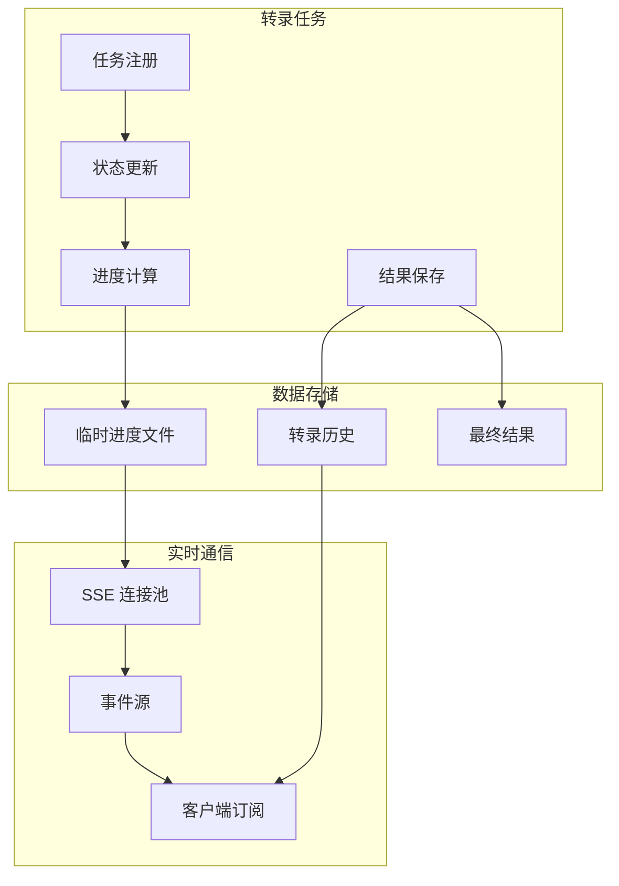

**图表来源**
- [src/lib/transcription-progress.ts:9-44](file://src/lib/transcription-progress.ts#L9-L44)
- [src/app/api/transcription-live/route.ts:54-108](file://src/app/api/transcription-live/route.ts#L54-L108)

#### 进度计算算法

服务使用多种方法计算转录进度：

1. **基于 Whisper 进度百分比**: 直接使用 Whisper 输出的进度信息
2. **基于时间估算**: 根据音频时长估算完成比例
3. **基于片段数量**: 根据已处理的音频片段数量计算进度

**章节来源**
- [helper/server.js:333-360](file://helper/server.js#L333-L360)
- [src/lib/transcription-progress.ts:13-44](file://src/lib/transcription-progress.ts#L13-L44)

### 文件处理系统

服务提供了完整的文件处理能力，包括音频转换、转录文件生成和历史记录管理：

#### 文件处理流程

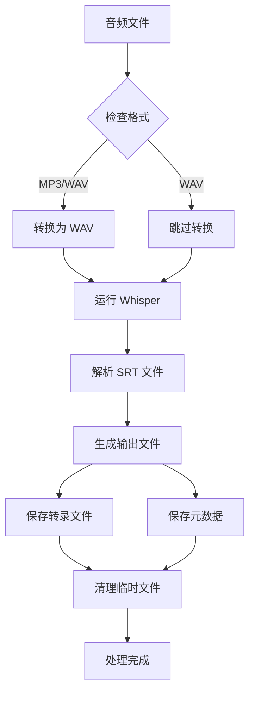

**图表来源**
- [src/app/api/process-podcast/route.ts:75-145](file://src/app/api/process-podcast/route.ts#L75-L145)
- [helper/server.js:463-490](file://helper/server.js#L463-L490)

**章节来源**
- [src/app/api/process-podcast/route.ts:649-664](file://src/app/api/process-podcast/route.ts#L649-L664)
- [helper/server.js:463-490](file://helper/server.js#L463-L490)

## 依赖关系分析

### 核心依赖关系图

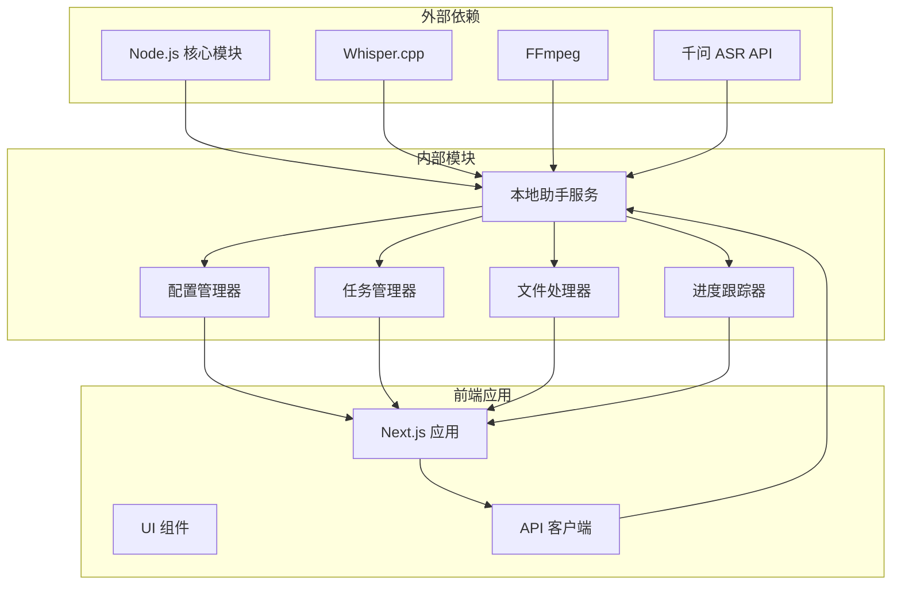

**图表来源**
- [package.json:13-27](file://package.json#L13-L27)
- [helper/server.js:1-8](file://helper/server.js#L1-L8)

### 模块间交互

服务采用松耦合的设计，通过明确的接口进行通信：

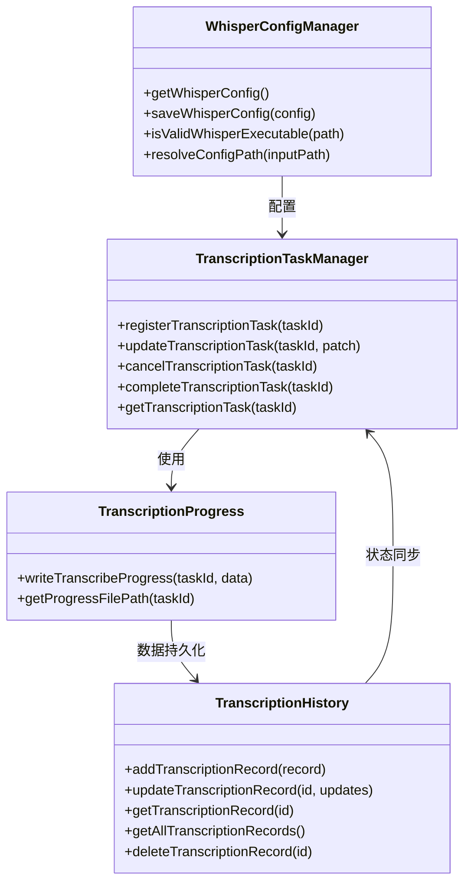

**图表来源**
- [src/lib/transcription-task-manager.ts:1-170](file://src/lib/transcription-task-manager.ts#L1-L170)
- [src/lib/whisper-config.ts:324-354](file://src/lib/whisper-config.ts#L324-L354)
- [src/lib/transcription-history.ts:139-208](file://src/lib/transcription-history.ts#L139-L208)
- [src/lib/transcription-progress.ts:9-44](file://src/lib/transcription-progress.ts#L9-L44)

**章节来源**
- [src/lib/transcription-task-manager.ts:1-170](file://src/lib/transcription-task-manager.ts#L1-L170)
- [src/lib/transcription-history.ts:1-208](file://src/lib/transcription-history.ts#L1-L208)

## 性能考虑

### 内存管理

服务采用了高效的内存管理策略：

1. **渐进式进度更新**: 使用定时器定期更新进度，避免频繁的 DOM 操作
2. **任务队列管理**: 通过 Promise 链确保任务按顺序执行
3. **资源清理**: 自动清理临时文件和进程句柄

### 并发控制

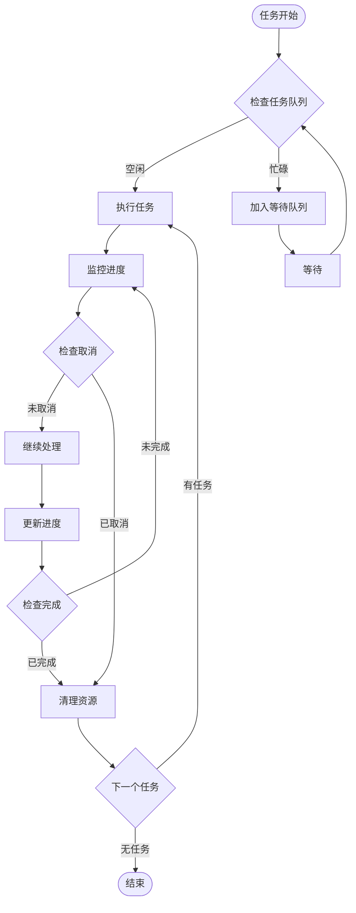

**图表来源**
- [src/lib/transcription-task-manager.ts:42-53](file://src/lib/transcription-task-manager.ts#L42-L53)
- [src/lib/transcription-progress.ts:13-44](file://src/lib/transcription-progress.ts#L13-L44)

### 性能优化建议

1. **批量更新**: 减少频繁的进度更新频率
2. **缓存策略**: 缓存常用的配置和状态信息
3. **异步处理**: 所有耗时操作都使用异步方式处理
4. **资源复用**: 复用进程和连接，避免重复创建

## 故障排除指南

### 常见问题及解决方案

#### Whisper.cpp 安装问题

**问题**: Whisper.cpp 无法正常工作
**诊断步骤**:
1. 检查 Whisper 可执行文件是否存在
2. 验证文件权限是否正确
3. 确认依赖库是否正确加载

**解决方案**:
1. 重新安装 Whisper.cpp
2. 设置正确的执行权限
3. 检查 DYLD_LIBRARY_PATH 环境变量

#### FFmpeg 转换失败

**问题**: 音频转换过程中出现错误
**可能原因**:
1. FFmpeg 路径配置错误
2. 输入音频格式不受支持
3. 磁盘空间不足

**解决方法**:
1. 验证 FFmpeg 路径配置
2. 检查输入文件格式
3. 清理磁盘空间

#### 网络连接问题

**问题**: 无法连接到本地助手服务
**排查方法**:
1. 检查服务是否正在运行
2. 验证端口配置
3. 检查防火墙设置

**解决方案**:
1. 重启本地助手服务
2. 修改端口配置
3. 临时关闭防火墙测试

**章节来源**
- [helper/server.js:625-631](file://helper/server.js#L625-L631)
- [src/lib/whisper-config.ts:99-121](file://src/lib/whisper-config.ts#L99-L121)

### 错误处理机制

服务实现了完善的错误处理机制：

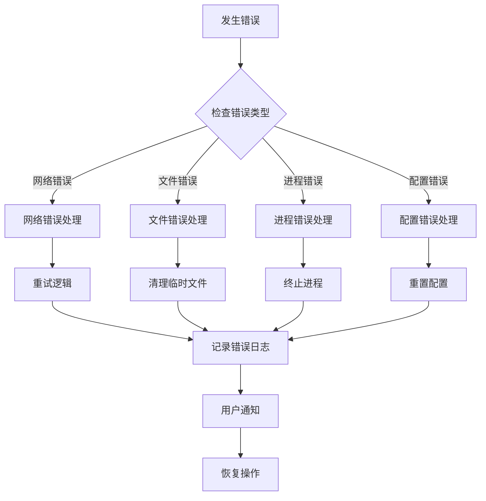

**图表来源**
- [src/app/api/process-podcast/route.ts:690-707](file://src/app/api/process-podcast/route.ts#L690-L707)
- [src/lib/transcription-task-manager.ts:143-159](file://src/lib/transcription-task-manager.ts#L143-L159)

## 结论

本地助手服务是一个功能完整、架构清晰的音频转录解决方案。它成功地将复杂的音频处理任务封装成易于使用的 API 接口，为用户提供了一流的本地转录体验。

### 主要优势

1. **多引擎支持**: 同时支持本地 Whisper.cpp 和在线千问 ASR
2. **实时监控**: 通过 SSE 提供实时进度反馈
3. **健壮性**: 完善的错误处理和恢复机制
4. **可扩展性**: 模块化设计便于功能扩展
5. **易用性**: 简洁的 API 接口和配置管理

### 技术亮点

- 采用 Server-Sent Events 实现实时通信
- 实现了智能的任务取消和资源清理机制
- 提供了灵活的配置管理方案
- 支持多种音频格式和转录模式

### 发展方向

未来可以考虑的功能增强：
1. 添加更多转录引擎支持
2. 实现分布式处理能力
3. 增强云端同步功能
4. 优化性能和资源使用效率