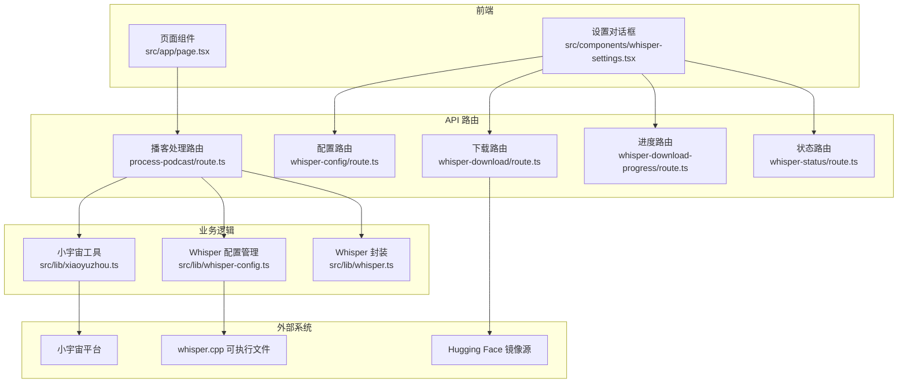
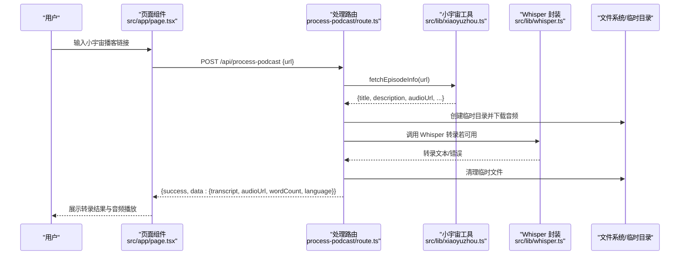
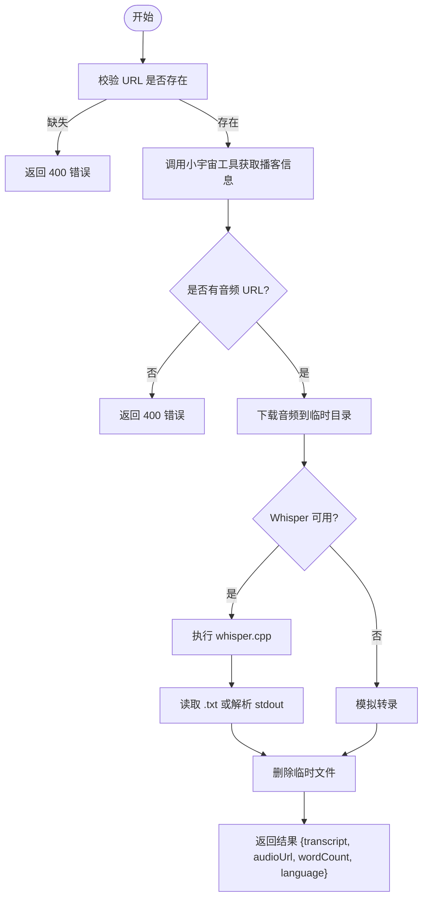
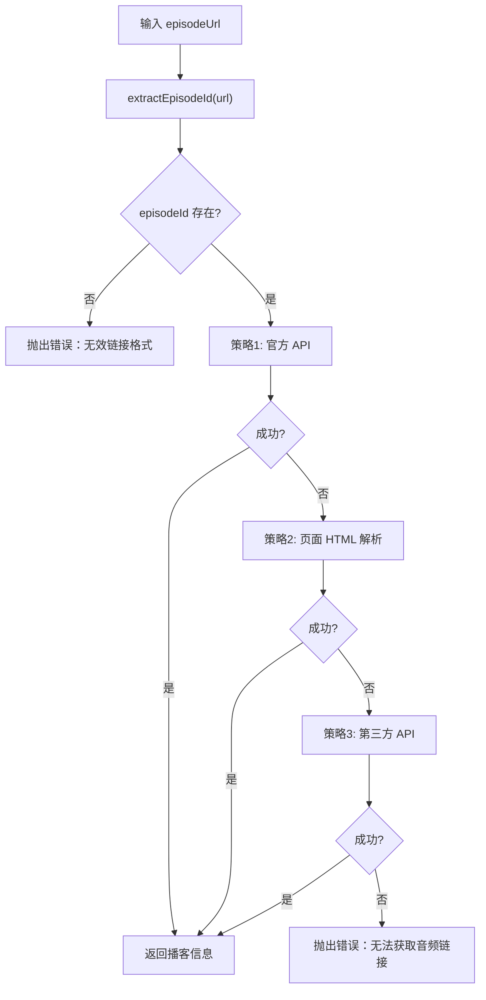
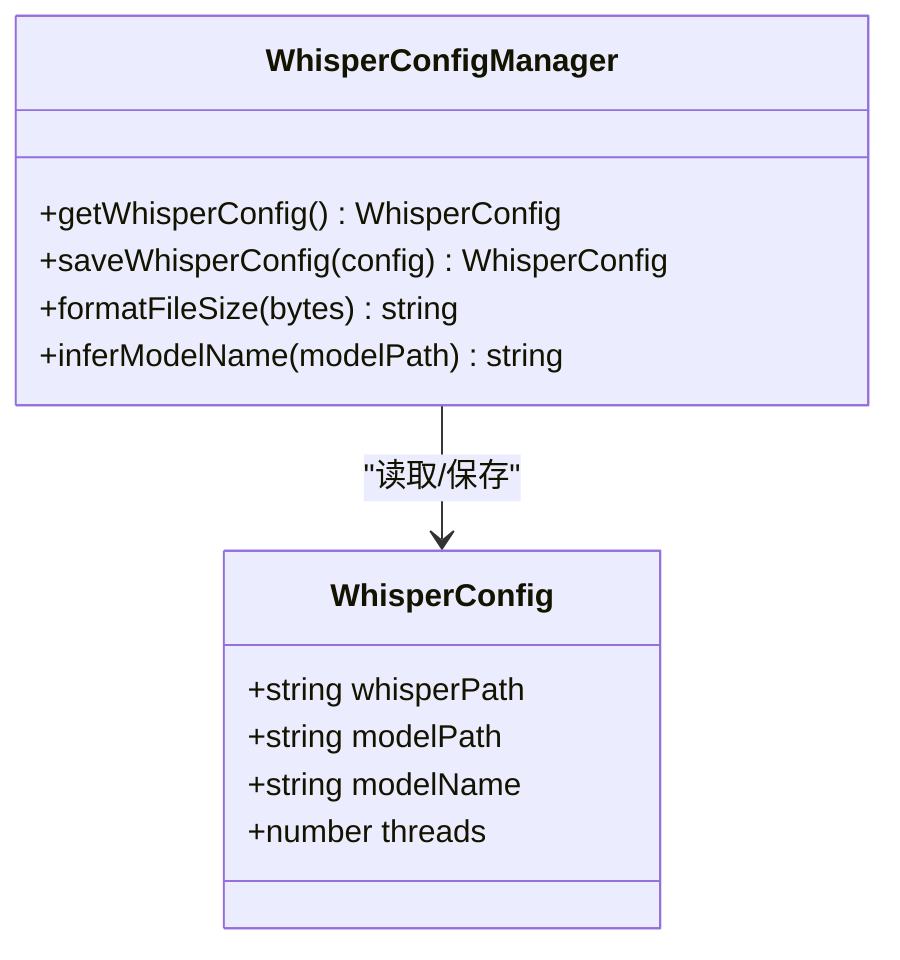
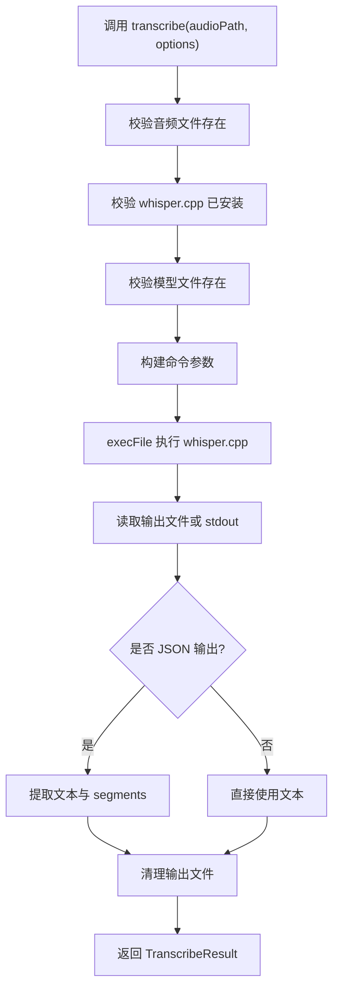
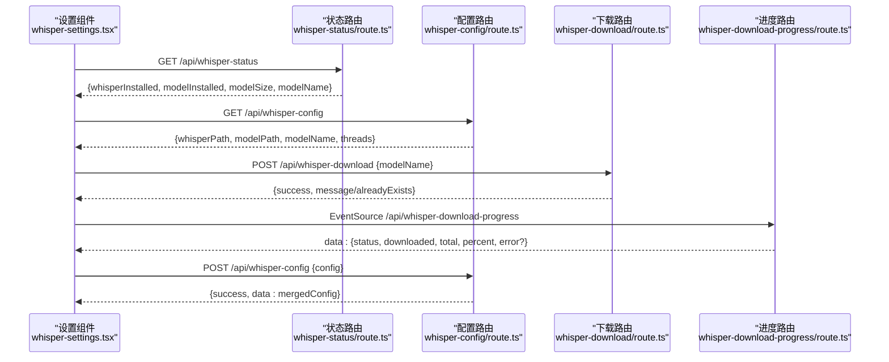
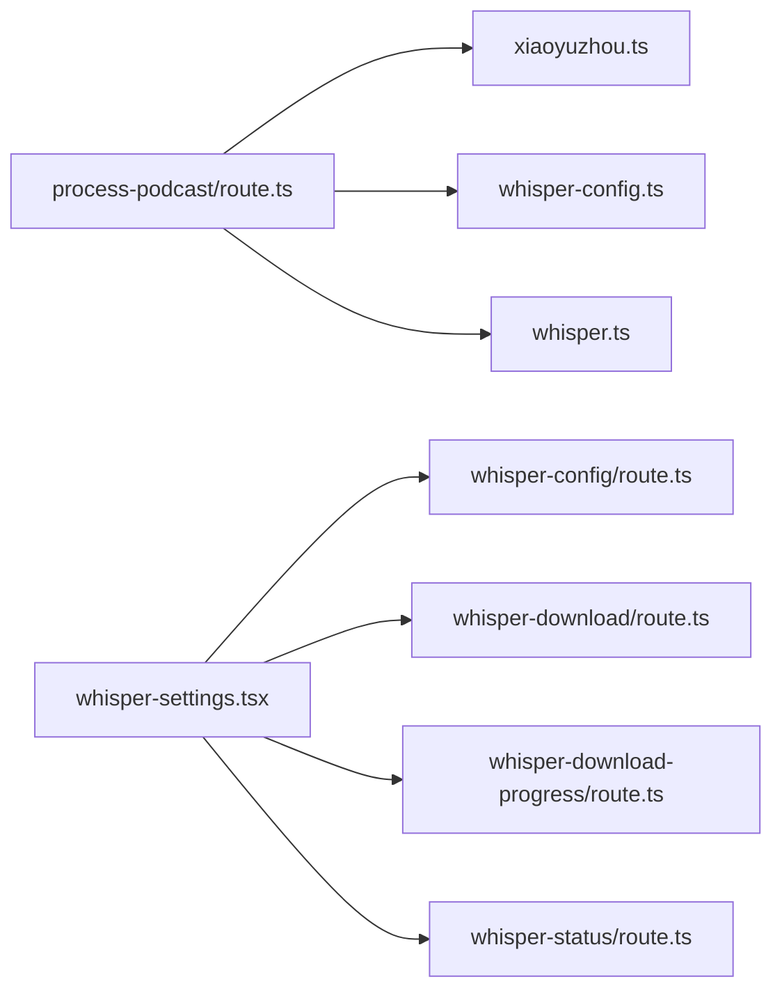

# 核心功能模块

<cite>
**本文引用的文件**
- [README.md](file://README.md)
- [package.json](file://package.json)
- [setup-whisper.sh](file://setup-whisper.sh)
- [src/app/page.tsx](file://src/app/page.tsx)
- [src/app/api/process-podcast/route.ts](file://src/app/api/process-podcast/route.ts)
- [src/lib/xiaoyuzhou.ts](file://src/lib/xiaoyuzhou.ts)
- [src/lib/whisper.ts](file://src/lib/whisper.ts)
- [src/lib/whisper-config.ts](file://src/lib/whisper-config.ts)
- [src/components/whisper-settings.tsx](file://src/components/whisper-settings.tsx)
- [src/app/api/whisper-config/route.ts](file://src/app/api/whisper-config/route.ts)
- [src/app/api/whisper-download/route.ts](file://src/app/api/whisper-download/route.ts)
- [src/app/api/whisper-download-progress/route.ts](file://src/app/api/whisper-download-progress/route.ts)
- [src/app/api/whisper-status/route.ts](file://src/app/api/whisper-status/route.ts)
- [src/types/index.ts](file://src/types/index.ts)
</cite>

## 目录
1. [简介](#简介)
2. [项目结构](#项目结构)
3. [核心组件](#核心组件)
4. [架构总览](#架构总览)
5. [详细组件分析](#详细组件分析)
6. [依赖关系分析](#依赖关系分析)
7. [性能考虑](#性能考虑)
8. [故障排除指南](#故障排除指南)
9. [结论](#结论)
10. [附录](#附录)

## 简介
MemoFlow 是一个基于 AI 的内容分析与创作助手，核心能力包括：从播客链接（当前支持小宇宙）自动提取音频并进行语音转录，随后提供核心观点提取、批判性思考与笔记生成等后续创作能力。本文档聚焦于播客转录功能的完整实现流程，以及 Whisper 配置管理系统的设计与实现，并阐述小宇宙平台集成的技术细节与错误处理机制。同时提供使用示例、配置选项与最佳实践，帮助开发者扩展与定制功能。

## 项目结构
项目采用 Next.js 应用结构，前端页面与 API 路由分离，核心逻辑分布在 lib 层与 components 层：
- 前端页面与交互：src/app/page.tsx
- API 路由：src/app/api/*
- 业务逻辑封装：src/lib/*
- 配置界面组件：src/components/whisper-settings.tsx
- 类型定义：src/types/index.ts
- 依赖与构建：package.json
- 环境初始化脚本：setup-whisper.sh

图表来源
- [src/app/page.tsx:13-243](file://src/app/page.tsx#L13-L243)
- [src/app/api/process-podcast/route.ts:13-127](file://src/app/api/process-podcast/route.ts#L13-L127)
- [src/lib/xiaoyuzhou.ts:27-47](file://src/lib/xiaoyuzhou.ts#L27-L47)
- [src/lib/whisper-config.ts:54-71](file://src/lib/whisper-config.ts#L54-L71)
- [src/lib/whisper.ts:54-156](file://src/lib/whisper.ts#L54-L156)
- [src/app/api/whisper-config/route.ts:10-28](file://src/app/api/whisper-config/route.ts#L10-L28)
- [src/app/api/whisper-download/route.ts:52-167](file://src/app/api/whisper-download/route.ts#L52-L167)
- [src/app/api/whisper-download-progress/route.ts:43-138](file://src/app/api/whisper-download-progress/route.ts#L43-L138)
- [src/app/api/whisper-status/route.ts:11-59](file://src/app/api/whisper-status/route.ts#L11-L59)

章节来源
- [README.md:1-27](file://README.md#L1-L27)
- [package.json:1-37](file://package.json#L1-L37)

## 核心组件
- 播客转录流程控制器：负责接收 URL、校验、调用小宇宙接口、下载音频、调用 Whisper 转录、清理临时文件并返回结果。
- 小宇宙平台集成：提供多策略抓取播客信息（官方 API、页面 HTML、第三方 API），统一输出标准结构。
- Whisper 配置管理系统：读取/保存配置、环境变量覆盖、模型大小格式化、模型名推断。
- Whisper 调用封装：封装 whisper.cpp 可执行文件调用，支持 JSON/文本输出、词级时间戳、清理临时文件。
- 设置界面组件：提供模型下载、配置保存、状态展示与进度监听，支持 SSE 实时进度。
- API 路由层：提供配置查询/保存、模型下载触发、下载进度推送、状态查询等接口。

章节来源
- [src/app/api/process-podcast/route.ts:13-127](file://src/app/api/process-podcast/route.ts#L13-L127)
- [src/lib/xiaoyuzhou.ts:27-47](file://src/lib/xiaoyuzhou.ts#L27-L47)
- [src/lib/whisper-config.ts:54-71](file://src/lib/whisper-config.ts#L54-L71)
- [src/lib/whisper.ts:54-156](file://src/lib/whisper.ts#L54-L156)
- [src/components/whisper-settings.tsx:56-468](file://src/components/whisper-settings.tsx#L56-L468)

## 架构总览
播客转录的整体流程如下：
1. 用户在页面输入小宇宙播客链接。
2. 前端调用 /api/process-podcast，传入 URL。
3. 后端路由解析 URL，提取 episodeId，调用小宇宙工具获取音频链接。
4. 下载音频到临时目录，调用 Whisper 进行转录。
5. 返回转录结果（文本、字数、语言、音频 URL）给前端展示。

图表来源
- [src/app/page.tsx:23-87](file://src/app/page.tsx#L23-L87)
- [src/app/api/process-podcast/route.ts:13-127](file://src/app/api/process-podcast/route.ts#L13-L127)
- [src/lib/xiaoyuzhou.ts:27-47](file://src/lib/xiaoyuzhou.ts#L27-L47)
- [src/lib/whisper.ts:54-156](file://src/lib/whisper.ts#L54-L156)

## 详细组件分析

### 组件一：播客转录流程控制器
职责与流程要点：
- 输入校验：要求提供 URL，否则返回 400。
- 小宇宙集成：调用 fetchEpisodeInfo，按策略顺序尝试官方 API、页面 HTML、第三方 API，最终返回包含音频 URL 的结构。
- 音频下载：创建临时目录，下载音频到磁盘。
- Whisper 调用：优先使用本地 whisper.cpp；若不可用则模拟转录；异常时回退模拟。
- 结果返回：包含转录文本、音频 URL、字数统计、语言标识；清理临时文件。

图表来源
- [src/app/api/process-podcast/route.ts:13-127](file://src/app/api/process-podcast/route.ts#L13-L127)

章节来源
- [src/app/api/process-podcast/route.ts:13-127](file://src/app/api/process-podcast/route.ts#L13-L127)

### 组件二：小宇宙平台集成
技术实现要点：
- URL 解析：从链接中提取 episodeId。
- 多策略抓取：
  - 官方 API：POST 请求，超时控制，字段兼容不同响应结构。
  - 页面 HTML：解析 __NEXT_DATA__，或从 og:audio meta 标签提取音频 URL，或匹配页面中的 m4a/mp3 链接。
  - 第三方 API：moon.fm，兼容多种字段命名。
- 错误处理：各策略失败时记录日志并继续尝试下一个策略；全部失败抛出明确错误。

图表来源
- [src/lib/xiaoyuzhou.ts:27-47](file://src/lib/xiaoyuzhou.ts#L27-L47)
- [src/lib/xiaoyuzhou.ts:52-89](file://src/lib/xiaoyuzhou.ts#L52-L89)
- [src/lib/xiaoyuzhou.ts:94-164](file://src/lib/xiaoyuzhou.ts#L94-L164)
- [src/lib/xiaoyuzhou.ts:169-197](file://src/lib/xiaoyuzhou.ts#L169-L197)

章节来源
- [src/lib/xiaoyuzhou.ts:27-47](file://src/lib/xiaoyuzhou.ts#L27-L47)
- [src/lib/xiaoyuzhou.ts:52-89](file://src/lib/xiaoyuzhou.ts#L52-L89)
- [src/lib/xiaoyuzhou.ts:94-164](file://src/lib/xiaoyuzhou.ts#L94-L164)
- [src/lib/xiaoyuzhou.ts:169-197](file://src/lib/xiaoyuzhou.ts#L169-L197)

### 组件三：Whisper 配置管理系统
架构设计要点：
- 配置来源优先级：环境变量 > 本地配置文件 > 默认值。
- 配置项：whisperPath、modelPath、modelName、threads。
- 辅助函数：格式化文件大小、从模型路径推断模型名。
- 读取：getWhisperConfig，合并环境变量覆盖。
- 保存：saveWhisperConfig，写入配置文件并返回合并后的配置。

图表来源
- [src/lib/whisper-config.ts:54-71](file://src/lib/whisper-config.ts#L54-L71)
- [src/lib/whisper-config.ts:78-89](file://src/lib/whisper-config.ts#L78-L89)
- [src/types/index.ts:7-12](file://src/types/index.ts#L7-L12)

章节来源
- [src/lib/whisper-config.ts:54-71](file://src/lib/whisper-config.ts#L54-L71)
- [src/lib/whisper-config.ts:78-89](file://src/lib/whisper-config.ts#L78-L89)
- [src/types/index.ts:7-12](file://src/types/index.ts#L7-L12)

### 组件四：Whisper 调用封装
功能与特性：
- 参数构建：模型路径、音频路径、语言、线程数、输出格式（JSON/文本）、词级时间戳。
- 文件存在性校验：音频文件、whisper.cpp、模型文件。
- 执行与结果解析：child_process 执行 whisper.cpp，读取输出文件或 stdout，解析 JSON（含 segments）。
- 清理：根据输出格式删除生成的 .txt/.json 文件。
- 快速转写：提供使用 small 模型的快速路径。

图表来源
- [src/lib/whisper.ts:54-156](file://src/lib/whisper.ts#L54-L156)
- [src/lib/whisper.ts:161-190](file://src/lib/whisper.ts#L161-L190)
- [src/lib/whisper.ts:195-205](file://src/lib/whisper.ts#L195-L205)

章节来源
- [src/lib/whisper.ts:54-156](file://src/lib/whisper.ts#L54-L156)
- [src/lib/whisper.ts:161-190](file://src/lib/whisper.ts#L161-L190)
- [src/lib/whisper.ts:195-205](file://src/lib/whisper.ts#L195-L205)

### 组件五：设置界面与模型下载
功能与交互：
- 状态查询：GET /api/whisper-status，返回 whisper.cpp 与模型安装状态、路径、模型大小与名称。
- 配置读取/保存：GET/POST /api/whisper-config，校验 threads 与 modelName，保存至配置文件并返回合并后的配置。
- 模型下载：POST /api/whisper-download，触发后台下载（Hugging Face 镜像源），写入进度文件。
- 进度推送：GET /api/whisper-download-progress，SSE 推送下载进度，支持完成/错误状态自动关闭连接。
- 前端联动：WhisperSettings 组件通过 fetch 与 EventSource 实时更新 UI。

图表来源
- [src/components/whisper-settings.tsx:75-101](file://src/components/whisper-settings.tsx#L75-L101)
- [src/components/whisper-settings.tsx:120-154](file://src/components/whisper-settings.tsx#L120-L154)
- [src/components/whisper-settings.tsx:157-187](file://src/components/whisper-settings.tsx#L157-L187)
- [src/components/whisper-settings.tsx:190-213](file://src/components/whisper-settings.tsx#L190-L213)
- [src/app/api/whisper-status/route.ts:11-59](file://src/app/api/whisper-status/route.ts#L11-L59)
- [src/app/api/whisper-config/route.ts:10-28](file://src/app/api/whisper-config/route.ts#L10-L28)
- [src/app/api/whisper-config/route.ts:36-123](file://src/app/api/whisper-config/route.ts#L36-L123)
- [src/app/api/whisper-download/route.ts:173-234](file://src/app/api/whisper-download/route.ts#L173-L234)
- [src/app/api/whisper-download-progress/route.ts:43-138](file://src/app/api/whisper-download-progress/route.ts#L43-L138)

章节来源
- [src/components/whisper-settings.tsx:56-468](file://src/components/whisper-settings.tsx#L56-L468)
- [src/app/api/whisper-status/route.ts:11-59](file://src/app/api/whisper-status/route.ts#L11-L59)
- [src/app/api/whisper-config/route.ts:10-28](file://src/app/api/whisper-config/route.ts#L10-L28)
- [src/app/api/whisper-config/route.ts:36-123](file://src/app/api/whisper-config/route.ts#L36-L123)
- [src/app/api/whisper-download/route.ts:173-234](file://src/app/api/whisper-download/route.ts#L173-L234)
- [src/app/api/whisper-download-progress/route.ts:43-138](file://src/app/api/whisper-download-progress/route.ts#L43-L138)

## 依赖关系分析
- 组件耦合与内聚：
  - 播客处理路由与小宇宙工具高度内聚，共同完成“链接解析 + 数据获取”。
  - Whisper 配置管理与 Whisper 封装解耦，前者负责配置读写，后者负责执行与解析。
  - 设置组件与 API 路由通过 REST/SSE 协作，形成松耦合的前端-后端交互。
- 外部依赖：
  - 小宇宙平台：官方 API、页面 HTML、第三方 API。
  - Hugging Face 镜像源：模型下载。
  - whisper.cpp 可执行文件：本地语音转录。
- 潜在循环依赖：未发现循环依赖，模块边界清晰。

图表来源
- [src/app/api/process-podcast/route.ts:13-127](file://src/app/api/process-podcast/route.ts#L13-L127)
- [src/lib/xiaoyuzhou.ts:27-47](file://src/lib/xiaoyuzhou.ts#L27-L47)
- [src/lib/whisper-config.ts:54-71](file://src/lib/whisper-config.ts#L54-L71)
- [src/lib/whisper.ts:54-156](file://src/lib/whisper.ts#L54-L156)
- [src/components/whisper-settings.tsx:75-101](file://src/components/whisper-settings.tsx#L75-L101)
- [src/app/api/whisper-config/route.ts:10-28](file://src/app/api/whisper-config/route.ts#L10-L28)
- [src/app/api/whisper-download/route.ts:173-234](file://src/app/api/whisper-download/route.ts#L173-L234)
- [src/app/api/whisper-download-progress/route.ts:43-138](file://src/app/api/whisper-download-progress/route.ts#L43-L138)
- [src/app/api/whisper-status/route.ts:11-59](file://src/app/api/whisper-status/route.ts#L11-L59)

章节来源
- [src/app/api/process-podcast/route.ts:13-127](file://src/app/api/process-podcast/route.ts#L13-L127)
- [src/lib/xiaoyuzhou.ts:27-47](file://src/lib/xiaoyuzhou.ts#L27-L47)
- [src/lib/whisper-config.ts:54-71](file://src/lib/whisper-config.ts#L54-L71)
- [src/lib/whisper.ts:54-156](file://src/lib/whisper.ts#L54-L156)
- [src/components/whisper-settings.tsx:75-101](file://src/components/whisper-settings.tsx#L75-L101)
- [src/app/api/whisper-config/route.ts:10-28](file://src/app/api/whisper-config/route.ts#L10-L28)
- [src/app/api/whisper-download/route.ts:173-234](file://src/app/api/whisper-download/route.ts#L173-L234)
- [src/app/api/whisper-download-progress/route.ts:43-138](file://src/app/api/whisper-download-progress/route.ts#L43-L138)
- [src/app/api/whisper-status/route.ts:11-59](file://src/app/api/whisper-status/route.ts#L11-L59)

## 性能考虑
- I/O 与并发：
  - 小宇宙抓取策略采用超时控制，避免阻塞；建议在生产环境增加重试与降级策略。
  - 模型下载采用流式读取与定期写入进度文件，减少内存占用。
- 计算与资源：
  - Whisper 线程数可通过配置调整，建议与 CPU 核心数匹配；在云环境中根据实例规格动态设置。
  - 本地 Whisper 调用使用子进程，注意进程池与并发限制，避免过多并发导致资源争用。
- 存储与缓存：
  - 临时文件在完成后清理，避免磁盘空间浪费；建议在容器环境下挂载临时卷。
  - 模型文件较大，建议使用 SSD 或高速存储，提升下载与加载速度。
- 网络与镜像：
  - 模型下载使用 Hugging Face 镜像源，建议在网络条件不佳时提供断点续传或本地缓存策略。

## 故障排除指南
- URL 校验失败：
  - 现象：返回 400，提示 URL 缺失。
  - 处理：确认前端传入的 URL 不为空。
- 小宇宙链接格式错误：
  - 现象：抛出“无效的小宇宙链接格式，请确认链接包含 /episode/ 路径”。
  - 处理：确保链接包含正确的 episode 路径。
- 无法获取音频链接：
  - 现象：各抓取策略均失败，抛出“无法获取播客音频链接，请检查链接是否正确或稍后重试”。
  - 处理：检查链接有效性、网络连通性、第三方 API 可用性。
- 音频下载失败：
  - 现象：HTTP 非 OK。
  - 处理：检查音频 URL 可访问性与网络代理设置。
- Whisper 未安装或模型缺失：
  - 现象：模拟转录被触发或报错。
  - 处理：通过设置界面下载模型或手动配置路径；确保 whisper.cpp 可执行文件存在。
- 下载进度异常：
  - 现象：SSE 连接中断或进度文件损坏。
  - 处理：检查 models 目录权限、磁盘空间、网络稳定性；必要时重启下载任务。
- 配置保存失败：
  - 现象：保存配置时报错。
  - 处理：检查配置字段合法性（threads 为正整数，modelName 为允许值），确保目标路径可写。

章节来源
- [src/app/api/process-podcast/route.ts:17-32](file://src/app/api/process-podcast/route.ts#L17-L32)
- [src/lib/xiaoyuzhou.ts:30-32](file://src/lib/xiaoyuzhou.ts#L30-L32)
- [src/lib/xiaoyuzhou.ts:46](file://src/lib/xiaoyuzhou.ts#L46)
- [src/app/api/process-podcast/route.ts:46-51](file://src/app/api/process-podcast/route.ts#L46-L51)
- [src/app/api/whisper-config/route.ts:41-96](file://src/app/api/whisper-config/route.ts#L41-L96)
- [src/app/api/whisper-download/route.ts:179-184](file://src/app/api/whisper-download/route.ts#L179-L184)
- [src/app/api/whisper-download-progress/route.ts:116-127](file://src/app/api/whisper-download-progress/route.ts#L116-L127)

## 结论
MemoFlow 的播客转录功能通过清晰的模块划分与稳健的错误处理实现了从链接输入到结果展示的完整闭环。Whisper 配置管理系统提供了灵活的本地部署方案，结合多策略的小宇宙集成，满足了中文播客场景下的高可用需求。建议在生产环境中进一步完善重试与降级策略、优化并发与资源调度，并提供更丰富的配置与监控能力。

## 附录

### 使用示例与最佳实践
- 基本使用：
  - 在首页输入小宇宙播客链接，点击“开始转录”，等待结果返回并展示音频与转录文本。
- 配置最佳实践：
  - 使用设置界面下载模型，选择适合场景的模型（small/medium），合理设置线程数。
  - 通过环境变量覆盖路径与线程数，便于在不同环境间迁移。
- 扩展与自定义：
  - 新增平台支持：在小宇宙工具中添加新的抓取策略，遵循现有接口返回结构。
  - 自定义 Whisper 参数：在 Whisper 封装中扩展参数，或通过配置路由新增字段。
  - 增强错误处理：在各路由中增加更细粒度的错误码与日志记录，便于问题定位。

章节来源
- [src/app/page.tsx:23-87](file://src/app/page.tsx#L23-L87)
- [src/components/whisper-settings.tsx:190-213](file://src/components/whisper-settings.tsx#L190-L213)
- [src/lib/whisper-config.ts:37-46](file://src/lib/whisper-config.ts#L37-L46)

### 环境初始化与脚本
- 初始化脚本：setup-whisper.sh 会克隆 whisper.cpp 仓库、创建 models 目录、下载中文优化的 small 模型并编译 main 程序，最后提示如何设置环境变量。
- 依赖说明：项目使用 Next.js、React、TailwindCSS 与 xml2js 等依赖，确保 Node.js 版本与包管理器版本兼容。

章节来源
- [setup-whisper.sh:1-47](file://setup-whisper.sh#L1-L47)
- [package.json:12-36](file://package.json#L12-L36)