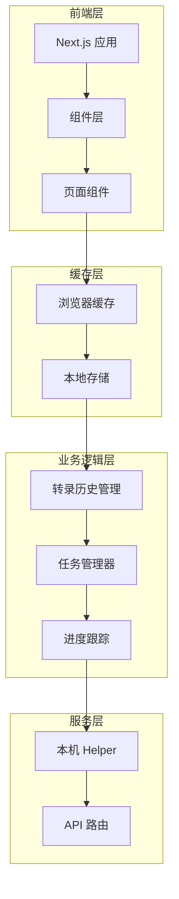
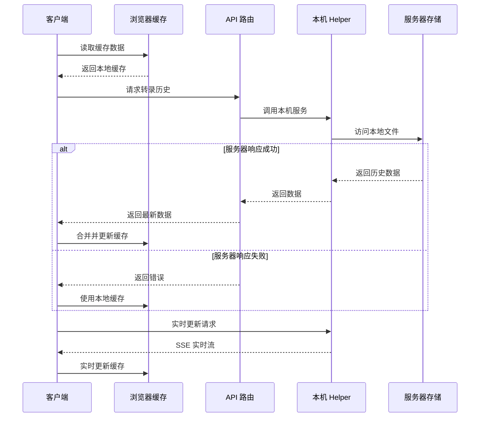
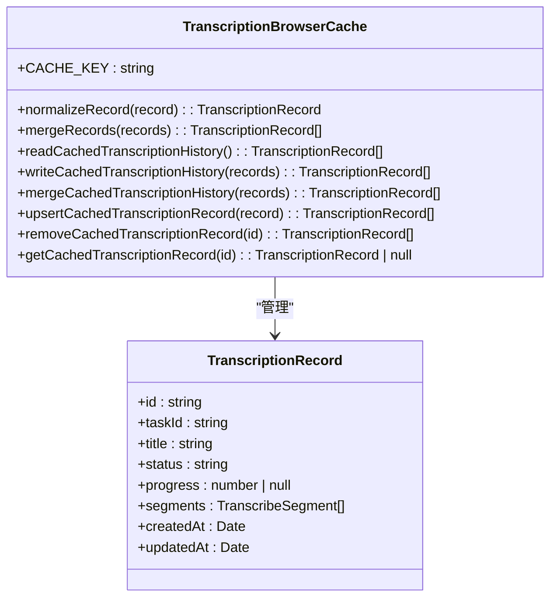
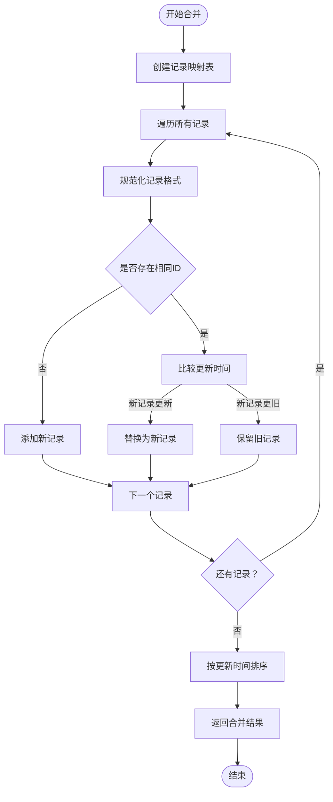
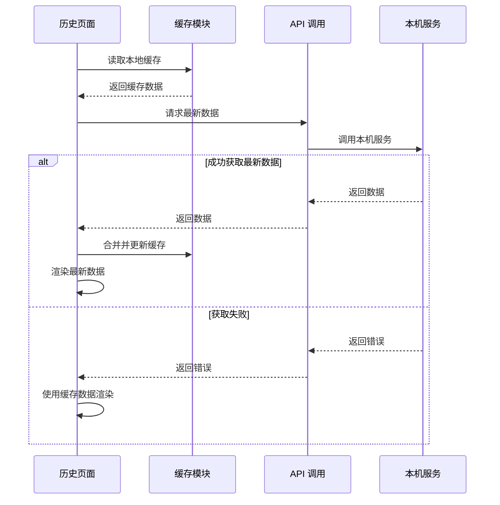
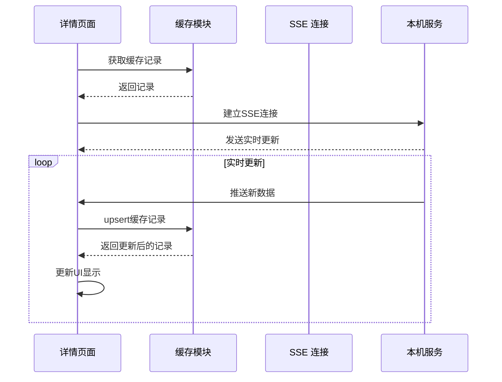
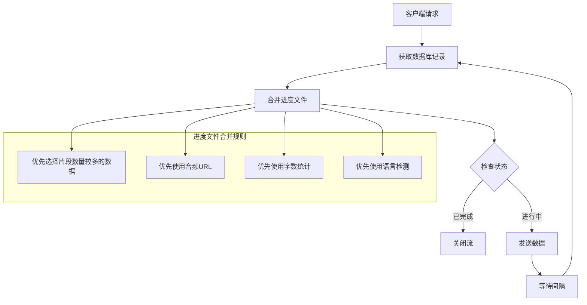
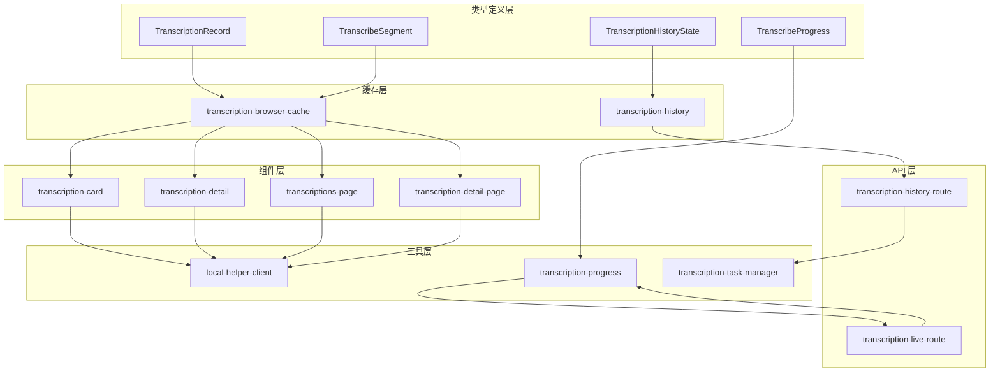

# 浏览器缓存系统

<cite>
**本文档引用的文件**
- [src/lib/transcription-browser-cache.ts](file://src/lib/transcription-browser-cache.ts)
- [src/lib/transcription-history.ts](file://src/lib/transcription-history.ts)
- [src/lib/transcription-task-manager.ts](file://src/lib/transcription-task-manager.ts)
- [src/lib/transcription-progress.ts](file://src/lib/transcription-progress.ts)
- [src/lib/local-helper-client.ts](file://src/lib/local-helper-client.ts)
- [src/types/transcription-history.ts](file://src/types/transcription-history.ts)
- [src/types/index.ts](file://src/types/index.ts)
- [src/components/transcription-card.tsx](file://src/components/transcription-card.tsx)
- [src/components/transcription-detail.tsx](file://src/components/transcription-detail.tsx)
- [src/app/transcriptions/page.tsx](file://src/app/transcriptions/page.tsx)
- [src/app/transcriptions/[id]/page.tsx](file://src/app/transcriptions/[id]/page.tsx)
- [src/app/api/transcription-history/route.ts](file://src/app/api/transcription-history/route.ts)
- [src/app/api/transcription-live/route.ts](file://src/app/api/transcription-live/route.ts)
- [README.md](file://README.md)
</cite>

## 目录
1. [简介](#简介)
2. [项目结构](#项目结构)
3. [核心组件](#核心组件)
4. [架构概览](#架构概览)
5. [详细组件分析](#详细组件分析)
6. [依赖关系分析](#依赖关系分析)
7. [性能考虑](#性能考虑)
8. [故障排除指南](#故障排除指南)
9. [结论](#结论)

## 简介

MemoFlow 是一个基于 AI 的内容分析与创作助手，该项目实现了完整的浏览器缓存系统，用于存储和管理转录历史记录。该系统通过 localStorage 提供客户端数据持久化，结合服务器端的本机 helper 服务，实现了高效的数据同步和缓存机制。

浏览器缓存系统的核心目标是在网络连接不稳定或服务器不可用时，确保用户能够访问之前的转录历史数据，同时提供实时更新功能以保持数据的时效性。

## 项目结构

项目采用模块化的架构设计，主要包含以下核心模块：

**图表来源**
- [src/lib/transcription-browser-cache.ts:1-87](file://src/lib/transcription-browser-cache.ts#L1-L87)
- [src/lib/transcription-history.ts:1-208](file://src/lib/transcription-history.ts#L1-L208)
- [src/lib/transcription-task-manager.ts:1-170](file://src/lib/transcription-task-manager.ts#L1-L170)

**章节来源**
- [src/lib/transcription-browser-cache.ts:1-87](file://src/lib/transcription-browser-cache.ts#L1-L87)
- [src/lib/transcription-history.ts:1-208](file://src/lib/transcription-history.ts#L1-L208)
- [README.md:1-45](file://README.md#L1-L45)

## 核心组件

### 浏览器缓存模块

浏览器缓存系统是整个应用的核心组件，负责在客户端存储转录历史数据。该模块提供了完整的 CRUD 操作和数据合并功能。

**主要功能特性：**
- 数据持久化：使用 localStorage 存储转录历史记录
- 数据合并：智能合并重复记录，基于更新时间排序
- 类型安全：完整的 TypeScript 类型定义和验证
- 错误处理：优雅处理缓存读取和写入异常

### 转录历史管理

转录历史管理模块负责服务器端的数据持久化，使用临时目录存储 JSON 格式的转录记录文件。

**关键特性：**
- 文件系统持久化：使用操作系统临时目录存储数据
- 并发控制：通过队列机制防止文件竞态条件
- 数据恢复：支持 JSON 解析错误时的回退机制
- 原子操作：使用临时文件和原子重命名确保数据完整性

### 任务管理系统

任务管理系统跟踪转录任务的状态和资源使用情况，包括进程管理和控制器管理。

**管理范围：**
- 进程生命周期管理
- 任务状态跟踪
- 资源清理和释放
- 取消和中断处理

**章节来源**
- [src/lib/transcription-browser-cache.ts:33-87](file://src/lib/transcription-browser-cache.ts#L33-L87)
- [src/lib/transcription-history.ts:106-208](file://src/lib/transcription-history.ts#L106-L208)
- [src/lib/transcription-task-manager.ts:55-170](file://src/lib/transcription-task-manager.ts#L55-L170)

## 架构概览

浏览器缓存系统采用分层架构设计，实现了客户端缓存与服务器端数据的协同工作：

**图表来源**
- [src/app/transcriptions/page.tsx:19-41](file://src/app/transcriptions/page.tsx#L19-L41)
- [src/components/transcription-detail.tsx:74-119](file://src/components/transcription-detail.tsx#L74-L119)
- [src/lib/local-helper-client.ts:17-46](file://src/lib/local-helper-client.ts#L17-L46)

## 详细组件分析

### 浏览器缓存核心实现

浏览器缓存系统的核心实现位于 `transcription-browser-cache.ts` 文件中，提供了完整的缓存管理功能：

**图表来源**
- [src/lib/transcription-browser-cache.ts:5-87](file://src/lib/transcription-browser-cache.ts#L5-L87)
- [src/types/transcription-history.ts:3-19](file://src/types/transcription-history.ts#L3-L19)

#### 数据合并算法

缓存系统实现了智能的数据合并算法，确保数据的一致性和完整性：

**图表来源**
- [src/lib/transcription-browser-cache.ts:16-31](file://src/lib/transcription-browser-cache.ts#L16-L31)

### 页面组件集成

浏览器缓存系统在各个页面组件中得到了广泛应用：

#### 转录历史页面

转录历史页面实现了缓存优先的加载策略：

**图表来源**
- [src/app/transcriptions/page.tsx:19-41](file://src/app/transcriptions/page.tsx#L19-L41)

#### 转录详情页面

转录详情页面实现了实时缓存更新机制：

**图表来源**
- [src/components/transcription-detail.tsx:74-119](file://src/components/transcription-detail.tsx#L74-L119)

**章节来源**
- [src/app/transcriptions/page.tsx:1-107](file://src/app/transcriptions/page.tsx#L1-L107)
- [src/app/transcriptions/[id]/page.tsx](file://src/app/transcriptions/[id]/page.tsx#L1-L113)
- [src/components/transcription-card.tsx:72-107](file://src/components/transcription-card.tsx#L72-L107)
- [src/components/transcription-detail.tsx:52-119](file://src/components/transcription-detail.tsx#L52-L119)

### API 路由集成

服务器端 API 路由与浏览器缓存系统紧密集成：

#### 实时进度 API

实时进度 API 结合了服务器数据和缓存数据的优势：

**图表来源**
- [src/app/api/transcription-live/route.ts:10-36](file://src/app/api/transcription-live/route.ts#L10-L36)

**章节来源**
- [src/app/api/transcription-history/route.ts:62-99](file://src/app/api/transcription-history/route.ts#L62-L99)
- [src/app/api/transcription-live/route.ts:38-119](file://src/app/api/transcription-live/route.ts#L38-L119)

## 依赖关系分析

浏览器缓存系统涉及多个层次的依赖关系：

**图表来源**
- [src/types/transcription-history.ts:1-25](file://src/types/transcription-history.ts#L1-L25)
- [src/types/index.ts:30-48](file://src/types/index.ts#L30-L48)

**章节来源**
- [src/lib/transcription-browser-cache.ts:1-87](file://src/lib/transcription-browser-cache.ts#L1-L87)
- [src/lib/transcription-history.ts:1-208](file://src/lib/transcription-history.ts#L1-L208)
- [src/lib/local-helper-client.ts:1-55](file://src/lib/local-helper-client.ts#L1-L55)

## 性能考虑

浏览器缓存系统在设计时充分考虑了性能优化：

### 缓存策略优化

1. **懒加载机制**：页面首次加载时优先使用本地缓存，后台异步获取最新数据
2. **增量更新**：只更新发生变化的数据，减少不必要的重渲染
3. **内存管理**：定期清理过期数据，避免内存泄漏
4. **并发控制**：使用队列机制防止重复请求和数据竞争

### 数据压缩和序列化

1. **JSON 序列化**：使用高效的 JSON 序列化机制
2. **数据去重**：智能合并重复记录，减少存储空间
3. **时间戳优化**：使用时间戳进行快速排序和过滤

### 网络优化

1. **SSE 实时更新**：使用 Server-Sent Events 实现实时数据推送
2. **错误重试**：实现智能的错误重试机制
3. **连接池管理**：合理管理网络连接，避免资源浪费

## 故障排除指南

### 常见问题及解决方案

#### 缓存数据损坏

**问题描述**：浏览器缓存中的 JSON 数据损坏导致应用异常

**解决方案**：
1. 检查 localStorage 中的数据格式
2. 实现数据验证和回退机制
3. 提供手动清除缓存的功能

#### 数据不同步

**问题描述**：浏览器缓存与服务器数据不一致

**解决方案**：
1. 实现数据版本控制机制
2. 添加冲突解决策略
3. 提供强制刷新功能

#### 性能问题

**问题描述**：大量数据导致页面加载缓慢

**解决方案**：
1. 实现分页加载机制
2. 优化数据索引和查询
3. 添加数据清理和压缩功能

**章节来源**
- [src/lib/transcription-browser-cache.ts:50-53](file://src/lib/transcription-browser-cache.ts#L50-L53)
- [src/lib/transcription-history.ts:74-84](file://src/lib/transcription-history.ts#L74-L84)

## 结论

浏览器缓存系统为 MemoFlow 项目提供了强大的数据持久化和实时更新能力。通过精心设计的架构和优化的实现策略，该系统能够在保证数据一致性的同时，提供流畅的用户体验。

### 主要优势

1. **可靠性**：即使在网络连接不稳定的情况下，用户仍能访问历史数据
2. **实时性**：通过 SSE 技术实现实时数据更新
3. **性能**：智能的缓存策略和数据合并算法确保系统高效运行
4. **可维护性**：清晰的模块化设计便于后续维护和扩展

### 未来改进方向

1. **缓存容量管理**：实现智能的缓存清理和容量控制
2. **数据同步增强**：提供更强大的离线数据同步能力
3. **性能监控**：添加详细的性能指标和监控功能
4. **安全性增强**：实现数据加密和访问控制机制

该浏览器缓存系统为现代 Web 应用提供了一个优秀的参考实现，展示了如何在复杂的前端应用中有效地管理客户端数据存储。