# 语音识别引擎

<cite>
**本文引用的文件**
- [README.md](file://README.md)
- [package.json](file://package.json)
- [setup-whisper.sh](file://setup-whisper.sh)
- [src/lib/whisper.ts](file://src/lib/whisper.ts)
- [src/lib/whisper-config.ts](file://src/lib/whisper-config.ts)
- [src/lib/qwen-asr.ts](file://src/lib/qwen-asr.ts)
- [src/lib/xiaoyuzhou.ts](file://src/lib/xiaoyuzhou.ts)
- [src/lib/transcription-task-manager.ts](file://src/lib/transcription-task-manager.ts)
- [src/lib/transcription-progress.ts](file://src/lib/transcription-progress.ts)
- [src/lib/transcription-output.ts](file://src/lib/transcription-output.ts)
- [src/lib/transcription-history.ts](file://src/lib/transcription-history.ts)
- [src/types/index.ts](file://src/types/index.ts)
- [src/types/transcription-history.ts](file://src/types/transcription-history.ts)
- [src/components/whisper-settings.tsx](file://src/components/whisper-settings.tsx)
- [src/hooks/use-transcription-config.ts](file://src/hooks/use-transcription-config.ts)
- [src/app/api/whisper-config/route.ts](file://src/app/api/whisper-config/route.ts)
- [src/app/api/whisper-download/route.ts](file://src/app/api/whisper-download/route.ts)
- [src/app/api/whisper-download-progress/route.ts](file://src/app/api/whisper-download-progress/route.ts)
- [src/app/api/whisper-status/route.ts](file://src/app/api/whisper-status/route.ts)
- [src/app/api/process-podcast/route.ts](file://src/app/api/process-podcast/route.ts)
- [src/app/api/retranscribe/route.ts](file://src/app/api/retranscribe/route.ts)
- [src/app/api/test-asr-connection/route.ts](file://src/app/api/test-asr-connection/route.ts)
- [src/app/api/transcription-live/route.ts](file://src/app/api/transcription-live/route.ts)
</cite>

## 更新摘要
**变更内容**
- 新增异步任务管理系统，支持任务注册、取消和资源清理
- 扩展 Qwen ASR 集成，从136行扩展到714行，新增模型切换、超时管理、错误恢复机制
- 新增实时转录进度流式推送功能
- 增强重转录引擎，支持异步任务处理和进度同步
- 完善 SSE 流式处理和进度文件管理

## 目录
1. [简介](#简介)
2. [项目结构](#项目结构)
3. [核心组件](#核心组件)
4. [架构总览](#架构总览)
5. [详细组件分析](#详细组件分析)
6. [依赖关系分析](#依赖关系分析)
7. [性能考虑](#性能考虑)
8. [故障排查指南](#故障排查指南)
9. [结论](#结论)
10. [附录](#附录)

## 简介
本项目是一个基于 whisper.cpp 的本地语音识别引擎，现已扩展支持在线 Qwen ASR 引擎。系统提供从播客音频抓取、本地转写到结果后处理的完整链路，支持两种转录引擎：本地 Whisper 和在线 Qwen ASR。Whisper 引擎无需网络但需要安装环境，Qwen ASR 引擎只需 API Key 即可实现快速在线转录。系统采用 Next.js 服务端渲染与 API 路由，结合前端对话框组件，实现"模型下载—配置管理—转写执行—结果展示"的闭环。

**更新** 新增异步任务管理系统和实时进度推送功能，显著提升了转录任务的可靠性和用户体验。

## 项目结构
项目采用前后端分离的 API 路由与组件架构，新增了引擎选择机制和任务管理系统：
- 前端：Next.js 页面与组件，负责用户交互与状态展示（如模型下载进度、配置面板、引擎选择）
- 后端：Next.js API 路由，负责配置读取/保存、模型下载与进度推送、转写执行、引擎分流
- 库模块：封装 whisper.cpp 调用、Qwen ASR 在线转录、配置管理、播客数据抓取、任务管理
- 引擎管理：统一的转录引擎选择与配置管理
- 任务系统：异步任务注册、取消、资源管理和进度跟踪

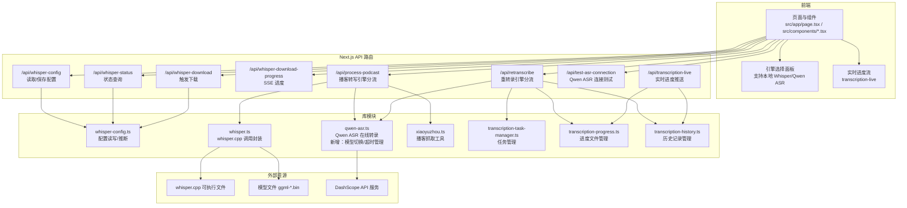

**图表来源**
- [src/components/whisper-settings.tsx:979-1184](file://src/components/whisper-settings.tsx#L979-L1184)
- [src/app/api/process-podcast/route.ts:454-466](file://src/app/api/process-podcast/route.ts#L454-L466)
- [src/app/api/retranscribe/route.ts:278-371](file://src/app/api/retranscribe/route.ts#L278-L371)
- [src/app/api/test-asr-connection/route.ts:1-30](file://src/app/api/test-asr-connection/route.ts#L1-L30)
- [src/app/api/transcription-live/route.ts:1-119](file://src/app/api/transcription-live/route.ts#L1-L119)

**章节来源**
- [README.md:1-27](file://README.md#L1-L27)
- [package.json:1-37](file://package.json#L1-L37)

## 核心组件
- whisper.cpp 封装：负责构建参数、调用可执行文件、解析输出、清理临时文件
- Qwen ASR 在线转录：通过 DashScope API 进行在线语音识别，支持 SSE 流式输出、模型切换、异步任务处理
- 配置管理：读取/保存配置，合并环境变量，推断模型名与大小，支持引擎选择
- 播客抓取：从多个来源提取播客音频链接
- 引擎分流：根据用户选择的引擎类型进行不同的处理流程
- 任务管理系统：异步任务注册、取消、资源清理和状态跟踪
- 实时进度推送：通过 Server-Sent Events 推送转录进度和状态
- API 路由：提供配置、状态、下载、进度、转写、连接测试接口
- 前端设置面板：可视化配置、模型下载与进度展示、引擎选择与连接测试

**更新** 新增任务管理系统和实时进度推送功能，显著增强了系统的异步处理能力和用户体验。

**章节来源**
- [src/lib/whisper.ts:1-229](file://src/lib/whisper.ts#L1-L229)
- [src/lib/whisper-config.ts:1-105](file://src/lib/whisper-config.ts#L1-L105)
- [src/lib/qwen-asr.ts:1-714](file://src/lib/qwen-asr.ts#L1-L714)
- [src/lib/xiaoyuzhou.ts:1-219](file://src/lib/xiaoyuzhou.ts#L1-L219)
- [src/lib/transcription-task-manager.ts:1-170](file://src/lib/transcription-task-manager.ts#L1-L170)
- [src/lib/transcription-progress.ts:1-44](file://src/lib/transcription-progress.ts#L1-L44)
- [src/lib/transcription-output.ts:1-123](file://src/lib/transcription-output.ts#L1-L123)
- [src/lib/transcription-history.ts:1-208](file://src/lib/transcription-history.ts#L1-L208)
- [src/app/api/whisper-config/route.ts:1-124](file://src/app/api/whisper-config/route.ts#L1-L124)
- [src/app/api/whisper-download/route.ts:1-235](file://src/app/api/whisper-download/route.ts#L1-L235)
- [src/app/api/whisper-download-progress/route.ts:1-139](file://src/app/api/whisper-download-progress/route.ts#L1-L139)
- [src/app/api/whisper-status/route.ts:1-60](file://src/app/api/whisper-status/route.ts#L1-L60)
- [src/app/api/process-podcast/route.ts:1-127](file://src/app/api/process-podcast/route.ts#L1-L127)
- [src/app/api/retranscribe/route.ts:1-713](file://src/app/api/retranscribe/route.ts#L1-L713)
- [src/app/api/test-asr-connection/route.ts:1-30](file://src/app/api/test-asr-connection/route.ts#L1-L30)
- [src/app/api/transcription-live/route.ts:1-119](file://src/app/api/transcription-live/route.ts#L1-L119)
- [src/components/whisper-settings.tsx:1-1251](file://src/components/whisper-settings.tsx#L1-L1251)

## 架构总览
系统整体流程分为三段：配置与准备、音频处理、转写与结果。前端通过 API 路由与不同的转录引擎交互，转写结果以文本或 JSON 形式返回。新增的引擎分流机制根据用户选择决定使用本地 Whisper 还是在线 Qwen ASR。新增的任务管理系统支持异步转录任务的注册、取消和资源管理。

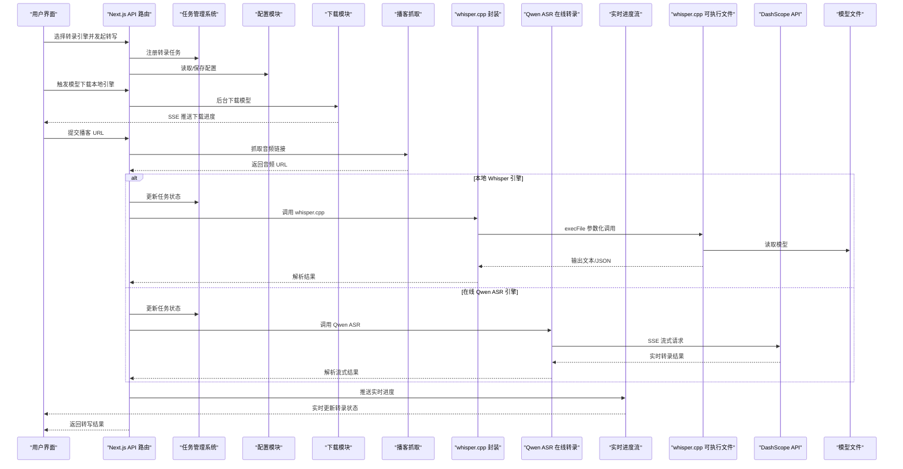

**图表来源**
- [src/components/whisper-settings.tsx:1024-1072](file://src/components/whisper-settings.tsx#L1024-L1072)
- [src/app/api/process-podcast/route.ts:454-466](file://src/app/api/process-podcast/route.ts#L454-L466)
- [src/lib/whisper.ts:54-156](file://src/lib/whisper.ts#L54-L156)
- [src/lib/qwen-asr.ts:59-117](file://src/lib/qwen-asr.ts#L59-L117)
- [src/app/api/transcription-live/route.ts:38-119](file://src/app/api/transcription-live/route.ts#L38-L119)

## 详细组件分析

### 异步任务管理系统
- 任务注册：为每个转录任务创建唯一的任务ID，管理任务状态和资源
- 资源管理：跟踪和管理子进程、控制器和临时文件的生命周期
- 任务取消：支持优雅的任务取消，清理所有相关资源
- 状态同步：通过进度文件和历史记录保持任务状态的一致性

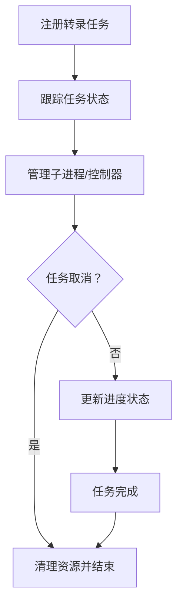

**图表来源**
- [src/lib/transcription-task-manager.ts:55-170](file://src/lib/transcription-task-manager.ts#L55-L170)

**章节来源**
- [src/lib/transcription-task-manager.ts:1-170](file://src/lib/transcription-task-manager.ts#L1-L170)

### Qwen ASR 在线转录引擎（增强版）
- 模型切换：支持 `qwen3-asr-flash` 和 `qwen3-asr-flash-filetrans` 模型自动切换
- 异步任务处理：长音频使用异步任务轮询，短音频使用 SSE 流式处理
- 超时管理：长音频任务超时时间为20分钟，支持超时检测和错误处理
- 错误恢复：智能错误检测和自动降级机制
- 进度追踪：详细的进度报告和状态更新

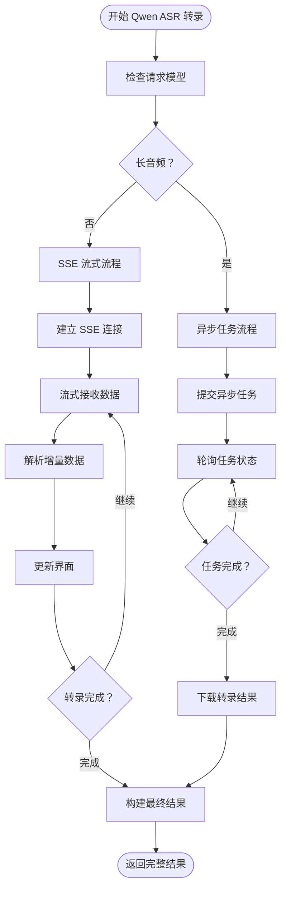

**图表来源**
- [src/lib/qwen-asr.ts:90-124](file://src/lib/qwen-asr.ts#L90-L124)
- [src/lib/qwen-asr.ts:173-292](file://src/lib/qwen-asr.ts#L173-L292)
- [src/lib/qwen-asr.ts:294-403](file://src/lib/qwen-asr.ts#L294-L403)

**章节来源**
- [src/lib/qwen-asr.ts:1-714](file://src/lib/qwen-asr.ts#L1-L714)

### 实时进度推送系统
- SSE 流式推送：通过 Server-Sent Events 实时推送转录进度
- 进度文件合并：将实时进度文件与历史记录合并，避免数据丢失
- 自动重试：客户端断开后自动重试连接
- 状态同步：确保前端界面与后端状态保持一致

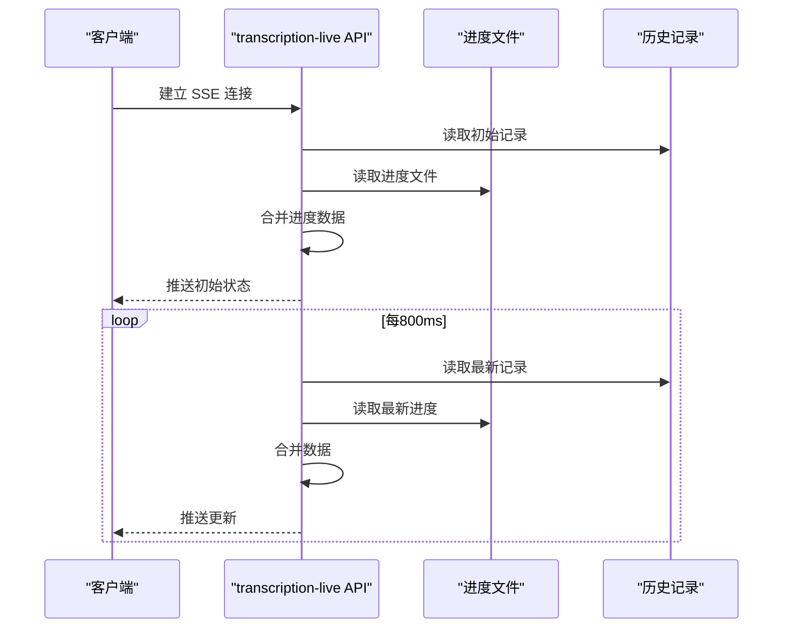

**图表来源**
- [src/app/api/transcription-live/route.ts:38-119](file://src/app/api/transcription-live/route.ts#L38-L119)
- [src/lib/transcription-progress.ts:13-43](file://src/lib/transcription-progress.ts#L13-L43)

**章节来源**
- [src/app/api/transcription-live/route.ts:1-119](file://src/app/api/transcription-live/route.ts#L1-L119)
- [src/lib/transcription-progress.ts:1-44](file://src/lib/transcription-progress.ts#L1-L44)

### 引擎选择机制与配置管理
- 引擎类型：支持 'local-whisper' 和 'qwen-asr' 两种引擎类型
- 配置存储：使用 localStorage 存储全局转录配置，包括活动引擎、Whisper 配置和在线 ASR 配置
- 引擎切换：前端提供可视化的引擎选择面板，支持实时切换
- 默认配置：本地引擎使用 whisper.cpp，Qwen 引擎使用 DashScope API
- 连接测试：提供 API Key 连接测试功能，验证 Qwen ASR 服务可用性

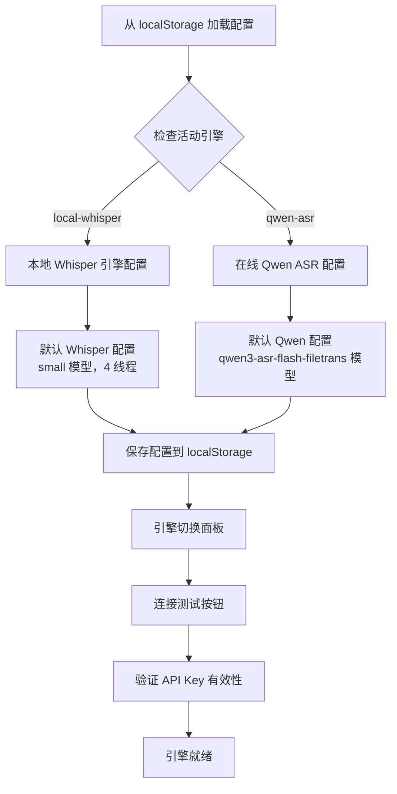

**图表来源**
- [src/hooks/use-transcription-config.ts:84-149](file://src/hooks/use-transcription-config.ts#L84-L149)
- [src/components/whisper-settings.tsx:979-1184](file://src/components/whisper-settings.tsx#L979-L1184)
- [src/lib/qwen-asr.ts:295-365](file://src/lib/qwen-asr.ts#L295-L365)

**章节来源**
- [src/types/index.ts:49-66](file://src/types/index.ts#L49-L66)
- [src/hooks/use-transcription-config.ts:1-132](file://src/hooks/use-transcription-config.ts#L1-L132)
- [src/components/whisper-settings.tsx:979-1184](file://src/components/whisper-settings.tsx#L979-L1184)

### 引擎分流与任务处理（增强版）
- 任务路由：根据引擎类型将转录任务路由到相应的处理函数
- 本地引擎：完整的音频下载、转换、转录流程
- 在线引擎：直接使用音频 URL，无需本地处理，支持异步任务管理
- 进度同步：两种引擎都支持实时进度更新和状态同步
- 资源管理：正确的资源清理和错误处理，支持任务取消

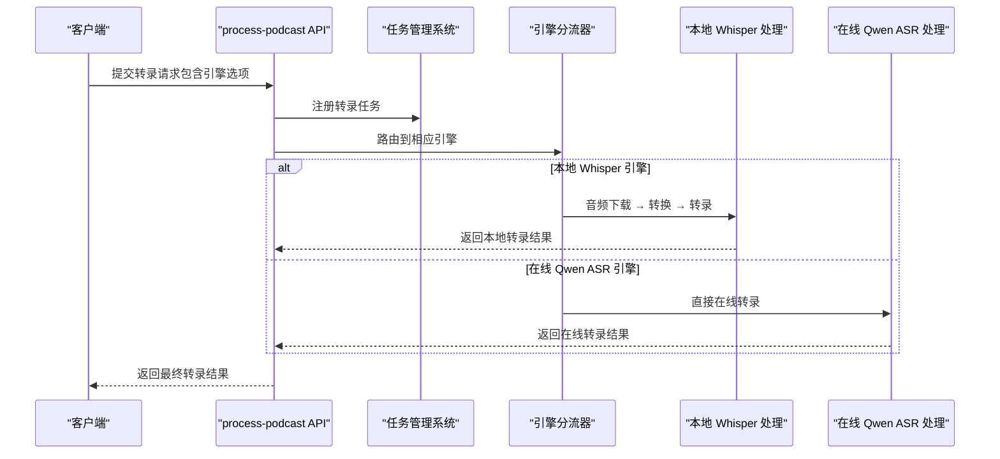

**图表来源**
- [src/app/api/process-podcast/route.ts:454-466](file://src/app/api/process-podcast/route.ts#L454-L466)
- [src/app/api/retranscribe/route.ts:278-371](file://src/app/api/retranscribe/route.ts#L278-L371)

**章节来源**
- [src/app/api/process-podcast/route.ts:259-388](file://src/app/api/process-podcast/route.ts#L259-L388)
- [src/app/api/retranscribe/route.ts:264-371](file://src/app/api/retranscribe/route.ts#L264-L371)

### whisper.cpp 封装与进程管理
- 进程调用：通过子进程方式执行 whisper.cpp，传入模型路径、音频路径、语言、线程数、输出格式等参数
- 输出解析：根据是否启用 JSON 输出，解析纯文本或结构化 JSON，提取片段与字数统计
- 临时文件清理：转写完成后删除生成的 .txt/.json 输出文件，避免磁盘占用
- 错误处理：对文件不存在、可执行文件缺失、模型缺失、子进程执行失败等情况进行统一抛错

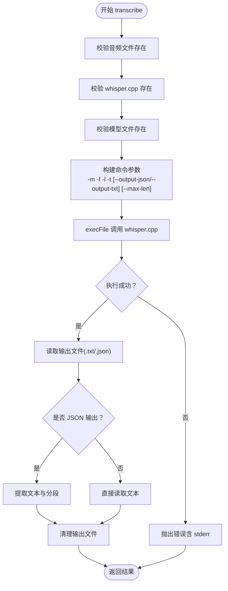

**图表来源**
- [src/lib/whisper.ts:54-156](file://src/lib/whisper.ts#L54-L156)

**章节来源**
- [src/lib/whisper.ts:1-229](file://src/lib/whisper.ts#L1-L229)

### 配置管理与环境变量覆盖
- 默认配置：包含 whisper.cpp 路径、模型路径、模型名、线程数
- 读取逻辑：优先读取配置文件，再合并环境变量（WHISPER_PATH、WHISPER_MODEL_PATH、WHISPER_THREADS）
- 保存逻辑：写入配置文件，返回合并后的配置
- 模型名推断：从模型路径推断 small/medium/large/base/tiny 等

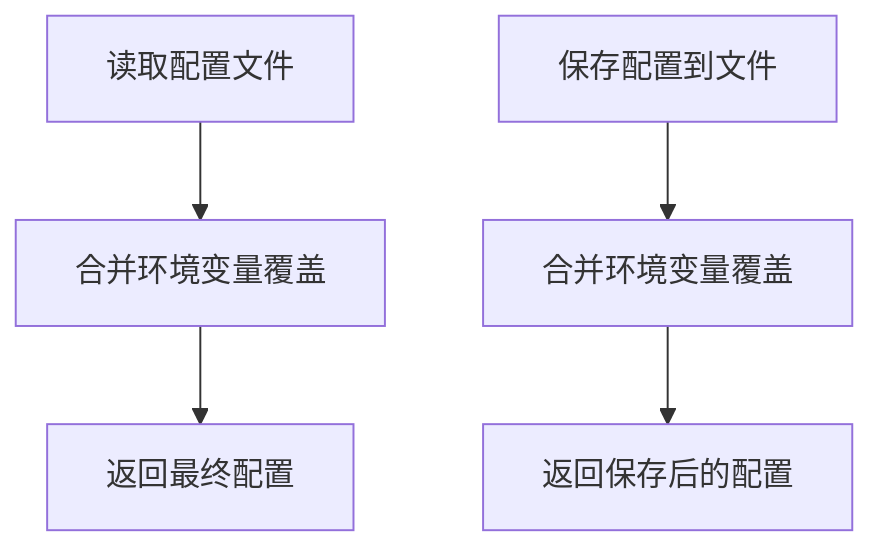

**图表来源**
- [src/lib/whisper-config.ts:54-89](file://src/lib/whisper-config.ts#L54-L89)

**章节来源**
- [src/lib/whisper-config.ts:1-105](file://src/lib/whisper-config.ts#L1-L105)
- [src/types/index.ts:7-21](file://src/types/index.ts#L7-L21)

### 模型下载与进度推送（SSE）
- 触发下载：POST /api/whisper-download，支持 small/medium 模型
- 后台下载：使用流式读取与写入，定期写入进度文件
- 进度推送：GET /api/whisper-download-progress 通过 Server-Sent Events 推送下载进度
- 并发保护：同一模型正在下载时拒绝重复请求
- 成功后更新配置：自动更新模型路径与模型名

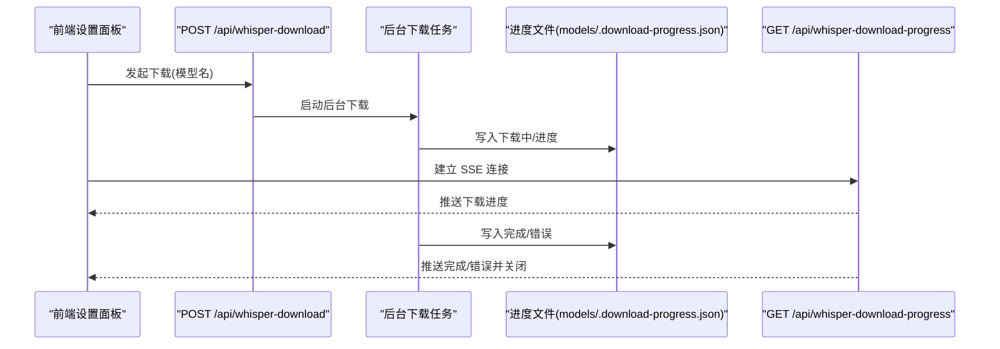

**图表来源**
- [src/app/api/whisper-download/route.ts:173-234](file://src/app/api/whisper-download/route.ts#L173-L234)
- [src/app/api/whisper-download-progress/route.ts:43-138](file://src/app/api/whisper-download-progress/route.ts#L43-L138)
- [src/components/whisper-settings.tsx:120-154](file://src/components/whisper-settings.tsx#L120-L154)

**章节来源**
- [src/app/api/whisper-download/route.ts:1-235](file://src/app/api/whisper-download/route.ts#L1-L235)
- [src/app/api/whisper-download-progress/route.ts:1-139](file://src/app/api/whisper-download-progress/route.ts#L1-L139)
- [src/components/whisper-settings.tsx:156-187](file://src/components/whisper-settings.tsx#L156-L187)

### 播客转写流程（含降级）
- 输入：播客 URL
- 数据抓取：多策略从官方 API、页面 HTML、第三方 API 提取音频链接
- 引擎分流：根据配置选择本地 Whisper 或在线 Qwen ASR
- 本地转写：若配置齐全则调用 whisper.cpp；否则降级为模拟转录
- 在线转写：直接调用 Qwen ASR API，支持实时流式输出
- 临时文件管理：下载音频至系统临时目录，转写后删除
- 结果返回：转写文本、字数、语言等

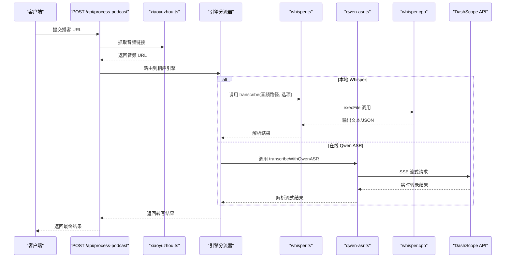

**图表来源**
- [src/app/api/process-podcast/route.ts:13-114](file://src/app/api/process-podcast/route.ts#L13-L114)
- [src/lib/xiaoyuzhou.ts:27-47](file://src/lib/xiaoyuzhou.ts#L27-L47)
- [src/lib/whisper.ts:54-156](file://src/lib/whisper.ts#L54-L156)
- [src/lib/qwen-asr.ts:59-117](file://src/lib/qwen-asr.ts#L59-L117)

**章节来源**
- [src/app/api/process-podcast/route.ts:1-127](file://src/app/api/process-podcast/route.ts#L1-L127)
- [src/lib/xiaoyuzhou.ts:1-219](file://src/lib/xiaoyuzhou.ts#L1-L219)

### 前端设置面板与交互
- 状态展示：显示 whisper.cpp 与模型安装状态、模型大小、引擎状态
- 引擎选择：支持本地 Whisper 和在线 Qwen ASR 引擎切换
- Qwen ASR 配置：API Key 输入、模型选择、连接测试
- 下载控制：触发下载、监听 SSE 进度、错误提示
- 配置保存：高级设置（路径、线程数）提交后保存并返回合并配置
- 加载与清理：对话框打开时并发加载状态与配置，关闭时清理 SSE 连接

**章节来源**
- [src/components/whisper-settings.tsx:1-1251](file://src/components/whisper-settings.tsx#L1-L1251)

## 依赖关系分析
- 组件耦合
  - whisper.ts 依赖 fs/execFile/path，与 whisper-config.ts 解耦
  - qwen-asr.ts 依赖 fetch API 和 SSE 流处理，新增任务管理依赖
  - process-podcast/route.ts 依赖 xiaoyuzhou.ts、whisper.ts 和 qwen-asr.ts
  - retranscribe/route.ts 依赖 qwen-asr.ts、transcription-task-manager.ts、transcription-progress.ts、transcription-history.ts
  - transcription-live/route.ts 依赖 transcription-progress.ts、transcription-history.ts
  - API 路由依赖库模块与文件系统
- 外部依赖
  - whisper.cpp 可执行文件与模型文件
  - DashScope API 服务
  - Next.js 14 与 React 生态
  - xml2js 用于解析 XML 页面数据

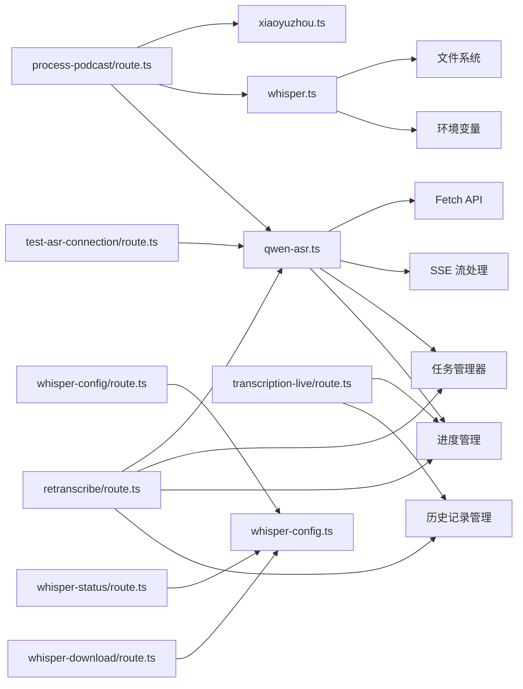

**图表来源**
- [src/lib/whisper.ts:1-229](file://src/lib/whisper.ts#L1-L229)
- [src/lib/whisper-config.ts:1-105](file://src/lib/whisper-config.ts#L1-L105)
- [src/lib/qwen-asr.ts:1-714](file://src/lib/qwen-asr.ts#L1-L714)
- [src/app/api/process-podcast/route.ts:1-127](file://src/app/api/process-podcast/route.ts#L1-L127)
- [src/lib/xiaoyuzhou.ts:1-219](file://src/lib/xiaoyuzhou.ts#L1-L219)
- [src/app/api/whisper-config/route.ts:1-124](file://src/app/api/whisper-config/route.ts#L1-L124)
- [src/app/api/whisper-status/route.ts:1-60](file://src/app/api/whisper-status/route.ts#L1-L60)
- [src/app/api/whisper-download/route.ts:1-235](file://src/app/api/whisper-download/route.ts#L1-L235)
- [src/app/api/retranscribe/route.ts:1-713](file://src/app/api/retranscribe/route.ts#L1-L713)
- [src/app/api/test-asr-connection/route.ts:1-30](file://src/app/api/test-asr-connection/route.ts#L1-L30)
- [src/app/api/transcription-live/route.ts:1-119](file://src/app/api/transcription-live/route.ts#L1-L119)

**章节来源**
- [package.json:12-35](file://package.json#L12-L35)

## 性能考虑
- 线程配置
  - 通过配置项 threads 控制 whisper.cpp 的推理线程数，建议与 CPU 核心数匹配或为其一半
  - 环境变量 WHISPER_THREADS 可覆盖默认值
- 模型选择
  - small 模型体积小、速度较快，适合日常使用；medium 模型更准确但体积更大
  - inferModelName 可从模型路径推断模型类型
  - Qwen ASR 支持两种模型：flash（短音频）和 filetrans（长音频）
- 引擎选择
  - 本地 Whisper：适合离线使用，需要安装环境和模型，准确率高
  - 在线 Qwen ASR：适合快速在线转录，无需本地环境，实时性强
- I/O 与缓存
  - 下载采用流式写入，减少内存峰值
  - 转写输出文件在解析后立即清理，避免磁盘累积
  - SSE 流式处理减少延迟，提供实时反馈
  - 进度文件采用原子写入，避免竞态条件
- 超时与降级
  - 播客抓取设置超时，失败时降级为模拟转录，保证可用性
  - Qwen ASR 支持取消操作，避免长时间等待
  - 长音频任务超时时间为20分钟，防止资源泄露
- 并发与资源
  - SSE 每秒轮询读取进度文件，避免高频写入
  - 进度文件仅在下载期间存在，完成后自动清理
  - 引擎分流避免不必要的本地处理
  - 任务管理系统确保资源正确清理

**章节来源**
- [src/lib/whisper-config.ts:37-46](file://src/lib/whisper-config.ts#L37-L46)
- [src/lib/whisper.ts:84-101](file://src/lib/whisper.ts#L84-L101)
- [src/app/api/whisper-download/route.ts:98-131](file://src/app/api/whisper-download/route.ts#L98-L131)
- [src/app/api/process-podcast/route.ts:68-89](file://src/app/api/process-podcast/route.ts#L68-L89)
- [src/lib/qwen-asr.ts:122-230](file://src/lib/qwen-asr.ts#L122-L230)
- [src/lib/transcription-task-manager.ts:42-53](file://src/lib/transcription-task-manager.ts#L42-L53)

## 故障排查指南
- 模型加载失败
  - 现象：转写时报错提示模型不存在或路径错误
  - 处理：通过设置面板下载模型，或手动设置模型路径；确认模型文件存在且可读
- whisper.cpp 未安装
  - 现象：转写时报错提示未找到可执行文件
  - 处理：运行安装脚本初始化 whisper.cpp，并在配置中设置可执行文件路径
- Qwen ASR 连接失败
  - 现象：在线转录时报错提示 API Key 无效或连接超时
  - 处理：使用连接测试功能验证 API Key；检查网络连接；确认 DashScope 服务可用性
- 内存不足
  - 现象：转写过程中出现 OOM 或性能骤降
  - 处理：降低线程数（threads），切换到较小模型（small），或在系统层面增加可用内存
- 计算超时
  - 现象：转写耗时过长或无响应
  - 处理：缩短音频长度、提升线程数、更换更快的硬件；必要时启用降级逻辑
- 下载中断或失败
  - 现象：SSE 进度显示 error，或下载完成后模型不可用
  - 处理：检查网络与存储权限，删除残留文件后重新下载；查看进度文件中的错误信息
- 权限与路径问题
  - 现象：无法读取/写入模型或临时文件
  - 处理：确保运行用户对 models 目录与临时目录有读写权限
- 引擎选择问题
  - 现象：引擎切换后配置未生效
  - 处理：检查 localStorage 中的配置存储；确认引擎配置正确；重新加载页面
- 任务管理问题
  - 现象：转录任务无法取消或资源未清理
  - 处理：检查任务状态，使用任务管理 API 清理资源；确认所有相关进程已终止
- 实时进度问题
  - 现象：SSE 连接断开或进度不更新
  - 处理：检查网络连接，重新建立 SSE 连接；确认进度文件存在且可读

**章节来源**
- [src/lib/whisper.ts:64-81](file://src/lib/whisper.ts#L64-L81)
- [src/app/api/whisper-download/route.ts:147-166](file://src/app/api/whisper-download/route.ts#L147-L166)
- [src/app/api/whisper-download-progress/route.ts:11-37](file://src/app/api/whisper-download-progress/route.ts#L11-L37)
- [src/lib/qwen-asr.ts:295-365](file://src/lib/qwen-asr.ts#L295-L365)
- [src/lib/transcription-task-manager.ts:143-159](file://src/lib/transcription-task-manager.ts#L143-L159)

## 结论
本项目通过清晰的模块划分与 API 路由设计，实现了从播客抓取到本地转写的完整链路。新增的 Qwen ASR 在线转录引擎扩展了系统的功能边界，支持实时流式转录和快速在线识别。通过统一的引擎选择机制和配置管理，用户可以根据需求灵活选择最适合的转录方案。whisper.cpp 的集成采用子进程调用与参数化控制，配合配置管理与模型下载能力，满足不同场景下的性能与准确性需求。

**更新** 新增的异步任务管理系统和实时进度推送功能显著提升了系统的可靠性和用户体验。Qwen ASR 集成从简单的136行代码扩展到714行，新增了模型切换、异步任务处理、超时管理、改进的错误恢复和SSE流式处理等功能，使系统能够更好地处理各种转录场景和用户需求。

## 附录
- 安装与初始化
  - 运行安装脚本以克隆并编译 whisper.cpp，下载中文优化的小模型
  - 在环境变量中设置可执行文件与模型路径，或通过配置面板保存
  - 对于 Qwen ASR 引擎，需要在阿里云百炼控制台获取 API Key
- 常用参数说明
  - 线程数：控制推理并行度，影响吞吐与资源占用
  - 输出格式：JSON 支持词级时间戳，文本格式更简洁
  - 语言：指定识别语言，有助于提升准确性
  - 引擎选择：本地 Whisper 适合离线使用，Qwen ASR 适合在线快速转录
  - 模型选择：Qwen ASR 支持 flash（短音频，<5分钟）和 filetrans（长音频）模型
- 引擎对比
  - 本地 Whisper：准确率高，需要本地环境和模型，适合离线使用
  - 在线 Qwen ASR：部署简单，实时性强，适合快速在线转录，需要网络连接
  - 模型特性：flash 模型适合短音频流式处理，filetrans 模型适合长音频异步处理

**章节来源**
- [setup-whisper.sh:1-47](file://setup-whisper.sh#L1-L47)
- [src/lib/whisper.ts:16-20](file://src/lib/whisper.ts#L16-L20)
- [src/lib/whisper-config.ts:37-46](file://src/lib/whisper-config.ts#L37-L46)
- [src/lib/qwen-asr.ts:29-28](file://src/lib/qwen-asr.ts#L29-L28)
- [src/lib/qwen-asr.ts:85-88](file://src/lib/qwen-asr.ts#L85-L88)