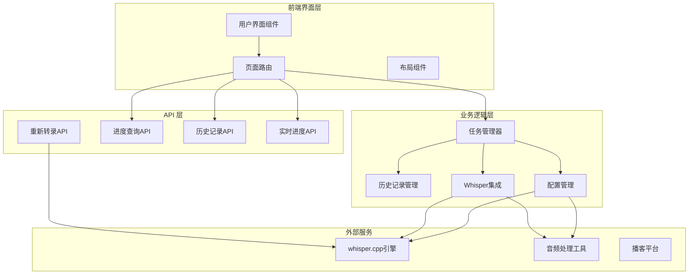
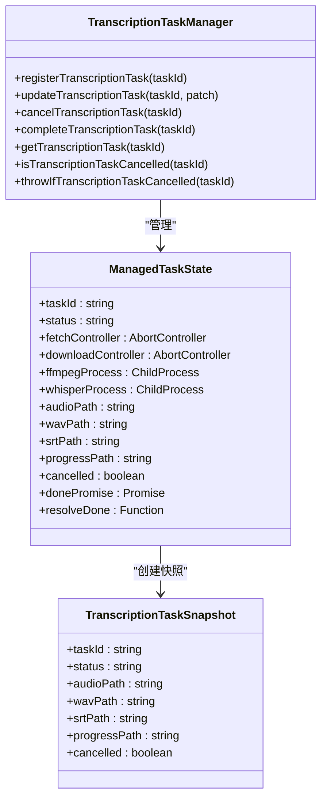
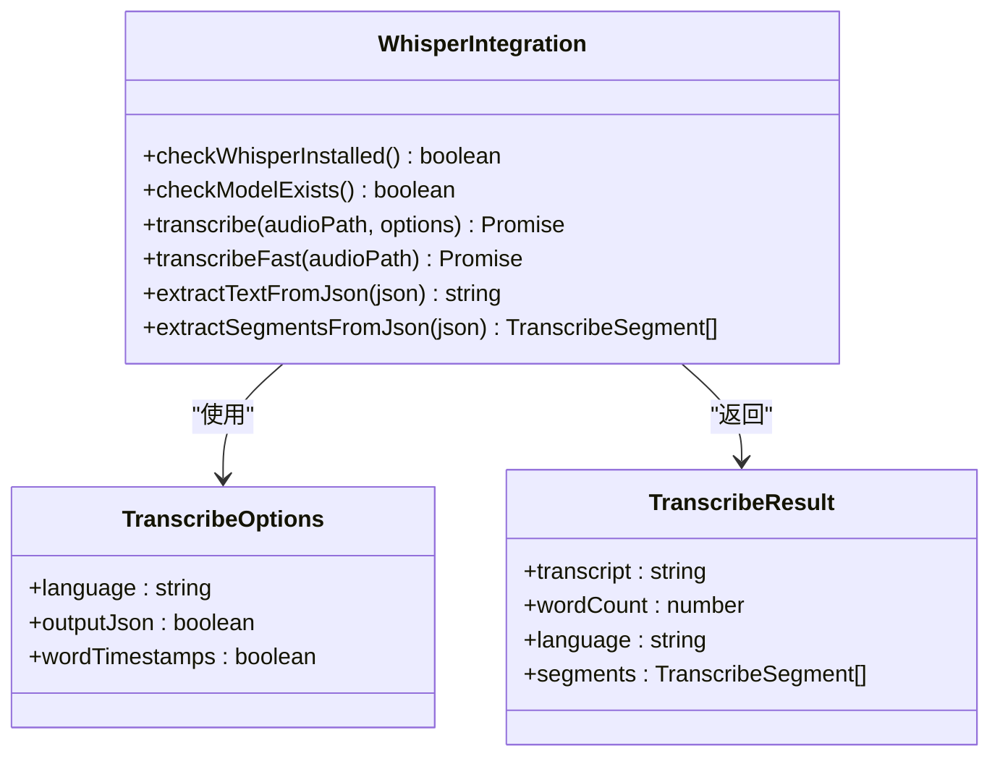
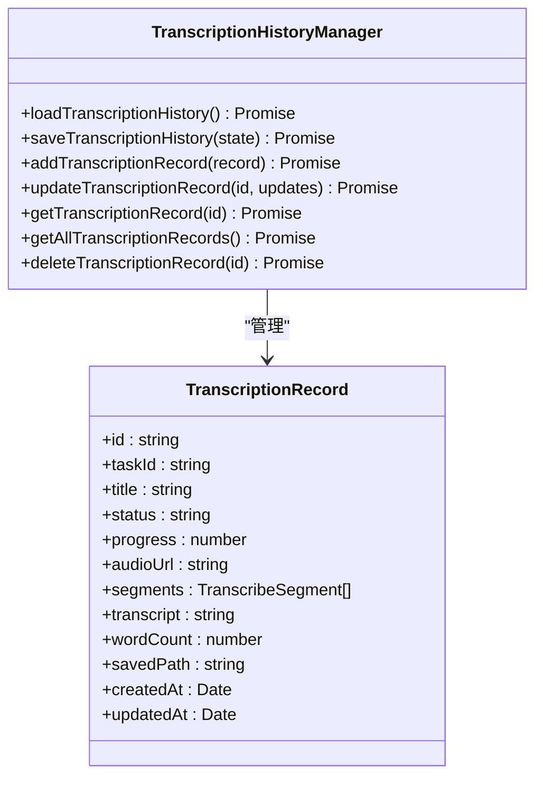
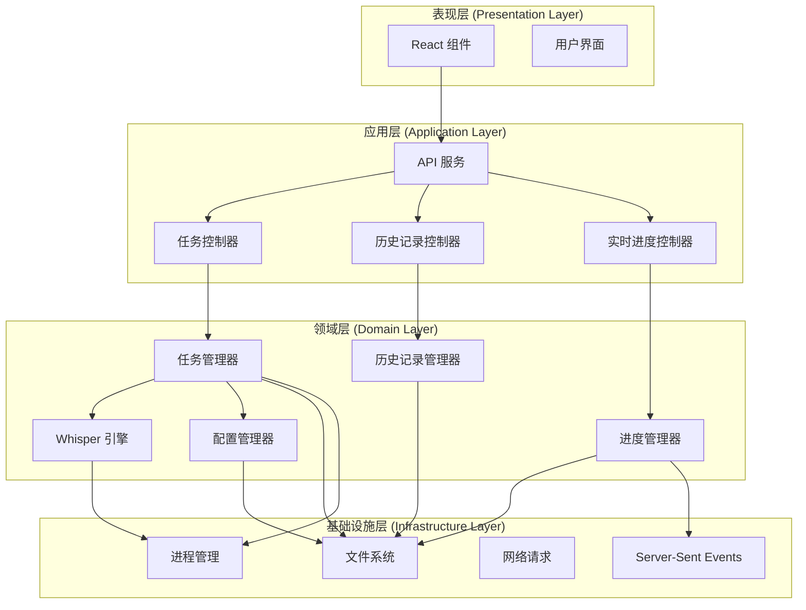
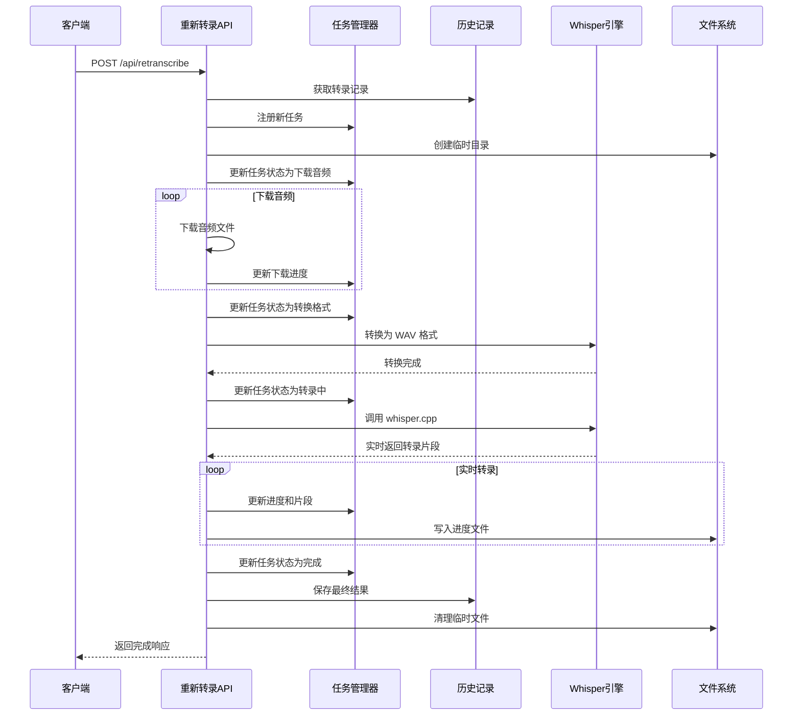
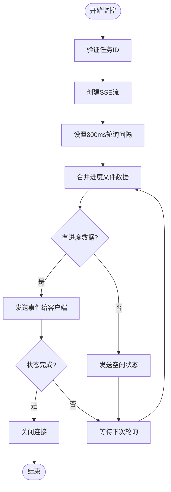
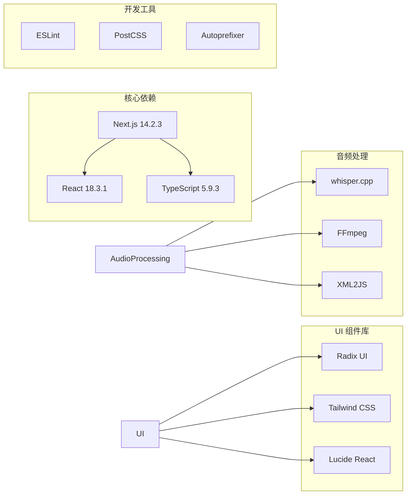

# 转录任务管理系统

<cite>
**本文档引用的文件**
- [README.md](file://README.md)
- [package.json](file://package.json)
- [src/lib/transcription-task-manager.ts](file://src/lib/transcription-task-manager.ts)
- [src/lib/transcription-history.ts](file://src/lib/transcription-history.ts)
- [src/lib/whisper.ts](file://src/lib/whisper.ts)
- [src/lib/whisper-config.ts](file://src/lib/whisper-config.ts)
- [src/lib/transcription-progress.ts](file://src/lib/transcription-progress.ts)
- [src/app/api/transcription-history/route.ts](file://src/app/api/transcription-history/route.ts)
- [src/app/api/transcribe-progress/route.ts](file://src/app/api/transcribe-progress/route.ts)
- [src/app/api/retranscribe/route.ts](file://src/app/api/retranscribe/route.ts)
- [src/app/api/transcription-live/route.ts](file://src/app/api/transcription-live/route.ts)
- [src/types/transcription-history.ts](file://src/types/transcription-history.ts)
- [src/types/index.ts](file://src/types/index.ts)
- [src/components/transcription-detail.tsx](file://src/components/transcription-detail.tsx)
- [src/app/transcriptions/page.tsx](file://src/app/transcriptions/page.tsx)
- [setup-whisper.sh](file://setup-whisper.sh)
</cite>

## 更新摘要
**变更内容**
- 增强了 SSE 连接管理，改进实时转录进度更新的可靠性和自动重连机制
- 新增了 transcription-live API，提供更稳定的实时转录进度监控
- 改进了客户端 EventSource 的自动重连逻辑和连接状态管理
- 优化了进度合并机制，避免数据回退问题

## 目录
1. [简介](#简介)
2. [项目结构](#项目结构)
3. [核心组件](#核心组件)
4. [架构概览](#架构概览)
5. [详细组件分析](#详细组件分析)
6. [依赖关系分析](#依赖关系分析)
7. [性能考虑](#性能考虑)
8. [故障排除指南](#故障排除指南)
9. [结论](#结论)

## 简介

转录任务管理系统是一个基于 Next.js 构建的 AI 驱动内容分析与创作助手。该系统专注于从各种媒体平台上抓取内容，使用 whisper.cpp 进行语音转录，并提供完整的转录任务生命周期管理。

系统的主要功能包括：
- 多平台内容抓取（YouTube、小宇宙、小红书、B站等）
- AI 核心观点提取
- 批判性思维分析
- 笔记生成功能
- 知识库管理与搜索

## 项目结构

该项目采用模块化的 Next.js 应用架构，主要分为以下几个核心部分：



**图表来源**
- [src/lib/transcription-task-manager.ts:1-170](file://src/lib/transcription-task-manager.ts#L1-L170)
- [src/lib/whisper.ts:1-261](file://src/lib/whisper.ts#L1-L261)
- [src/app/api/retranscribe/route.ts:1-577](file://src/app/api/retranscribe/route.ts#L1-L577)

**章节来源**
- [package.json:1-40](file://package.json#L1-L40)
- [README.md:1-27](file://README.md#L1-L27)

## 核心组件

### 任务管理系统

任务管理系统是整个转录流程的核心，负责协调各个组件之间的交互。它提供了完整的任务生命周期管理，包括任务注册、状态跟踪、资源清理等功能。



**图表来源**
- [src/lib/transcription-task-manager.ts:7-31](file://src/lib/transcription-task-manager.ts#L7-L31)

### Whisper 集成模块

Whisper 集成模块封装了 whisper.cpp 引擎的调用，提供了音频转录的核心功能。它支持多种输出格式，包括纯文本和带时间戳的 JSON 格式。



**图表来源**
- [src/lib/whisper.ts:17-34](file://src/lib/whisper.ts#L17-L34)

### 历史记录管理

历史记录管理模块负责持久化存储转录任务的状态和结果，确保用户可以随时访问之前的转录记录。



**图表来源**
- [src/lib/transcription-history.ts:3-17](file://src/lib/transcription-history.ts#L3-L17)
- [src/types/transcription-history.ts:3-18](file://src/types/transcription-history.ts#L3-L18)

**章节来源**
- [src/lib/transcription-task-manager.ts:1-170](file://src/lib/transcription-task-manager.ts#L1-L170)
- [src/lib/whisper.ts:1-261](file://src/lib/whisper.ts#L1-L261)
- [src/lib/transcription-history.ts:1-208](file://src/lib/transcription-history.ts#L1-L208)

## 架构概览

系统采用分层架构设计，各层之间职责明确，耦合度低，便于维护和扩展。



**图表来源**
- [src/app/api/retranscribe/route.ts:1-50](file://src/app/api/retranscribe/route.ts#L1-L50)
- [src/lib/transcription-task-manager.ts:55-74](file://src/lib/transcription-task-manager.ts#L55-L74)

## 详细组件分析

### 重新转录 API 流程

重新转录功能是系统的核心业务流程，涉及多个步骤和组件的协作。



**图表来源**
- [src/app/api/retranscribe/route.ts:257-502](file://src/app/api/retranscribe/route.ts#L257-L502)
- [src/lib/transcription-task-manager.ts:55-74](file://src/lib/transcription-task-manager.ts#L55-L74)

### 实时进度监控机制

系统实现了基于 Server-Sent Events (SSE) 的实时进度监控，为用户提供流畅的用户体验。新增的 transcription-live API 提供了更可靠的实时更新机制。



**图表来源**
- [src/app/api/transcription-live/route.ts:74-116](file://src/app/api/transcription-live/route.ts#L74-L116)

### 增强的自动重连机制

客户端实现了智能的自动重连机制，确保在网络不稳定的情况下也能保持连接的可靠性。

```mermaid
stateDiagram-v2
[*] --> Connecting : 初始连接
Connecting --> Connected : 连接成功
Connecting --> Reconnecting : 连接失败
Reconnecting --> Connected : 重连成功
Reconnecting --> Reconnecting : 重连失败
Connected --> Processing : 接收数据
Processing --> Connected : 继续连接
Processing --> Reconnecting : 连接断开
Connected --> Completed : 任务完成
Completed --> [*] : 清理资源
note right of Reconnecting
3秒延迟重连
仅在未完成时重连
doneRef.current 控制重连状态
</note>
```

**图表来源**
- [src/components/transcription-detail.tsx:69-110](file://src/components/transcription-detail.tsx#L69-L110)

### 任务取消机制

系统提供了完善的任务取消机制，确保用户可以随时中断正在进行的转录任务。

```mermaid
stateDiagram-v2
[*] --> Idle : 任务注册
Idle --> Downloading : 开始下载
Downloading --> Converting : 下载完成
Converting --> Transcribing : 转换完成
Transcribing --> Completed : 转录完成
Transcribing --> Cancelled : 用户取消
Cancelled --> CleaningUp : 清理资源
CleaningUp --> [*] : 资源清理完成
note right of Transcribing
SIGTERM 优雅终止
5秒后 SIGKILL
</note>
```

**图表来源**
- [src/lib/transcription-task-manager.ts:143-159](file://src/lib/transcription-task-manager.ts#L143-L159)

**章节来源**
- [src/app/api/retranscribe/route.ts:1-577](file://src/app/api/retranscribe/route.ts#L1-L577)
- [src/app/api/transcribe-progress/route.ts:1-139](file://src/app/api/transcribe-progress/route.ts#L1-L139)
- [src/app/api/transcription-live/route.ts:1-117](file://src/app/api/transcription-live/route.ts#L1-L117)
- [src/lib/transcription-task-manager.ts:1-170](file://src/lib/transcription-task-manager.ts#L1-L170)
- [src/components/transcription-detail.tsx:1-488](file://src/components/transcription-detail.tsx#L1-L488)

## 依赖关系分析

系统依赖关系清晰，主要依赖包括：



**图表来源**
- [package.json:12-38](file://package.json#L12-L38)

**章节来源**
- [package.json:1-40](file://package.json#L1-L40)

## 性能考虑

### 并发控制

系统采用了多种并发控制策略来优化性能：

1. **任务队列管理**：使用 Map 数据结构存储任务状态，避免内存泄漏
2. **异步操作**：所有文件操作和网络请求都采用异步模式
3. **资源清理**：及时清理临时文件和进程句柄

### 缓存策略

- **进度文件缓存**：使用临时目录存储进度文件，支持快速读取
- **配置缓存**：缓存最近的有效历史记录，处理文件损坏时的回退机制
- **进程复用**：避免重复创建相同的子进程

### 错误处理

系统实现了多层次的错误处理机制：

1. **任务级错误处理**：每个任务都有独立的错误处理逻辑
2. **文件级错误处理**：文件操作失败时提供详细的错误信息
3. **网络级错误处理**：网络请求失败时自动重试

### SSE 连接优化

**更新** 增强了 SSE 连接管理，改进实时转录进度更新的可靠性和自动重连机制：

1. **智能重连策略**：客户端实现 3 秒延迟重连，避免频繁重试
2. **连接状态管理**：使用 `doneRef.current` 控制重连状态，防止重复连接
3. **进度数据合并**：服务端合并进度文件和历史记录数据，避免数据回退
4. **优雅关闭机制**：确保连接断开时正确清理资源

**章节来源**
- [src/components/transcription-detail.tsx:69-110](file://src/components/transcription-detail.tsx#L69-L110)
- [src/app/api/transcription-live/route.ts:74-116](file://src/app/api/transcription-live/route.ts#L74-L116)

## 故障排除指南

### 常见问题及解决方案

#### Whisper 配置问题

**问题**：whisper.cpp 未正确安装
**解决方案**：
1. 检查配置文件路径是否正确
2. 验证可执行文件权限
3. 使用环境变量覆盖配置

#### 音频转录失败

**问题**：转录过程中出现超时
**解决方案**：
1. 增加超时时间限制
2. 检查系统资源使用情况
3. 优化模型选择

#### 进度同步问题

**问题**：客户端无法获取实时进度
**解决方案**：
1. 检查 SSE 连接状态
2. 验证进度文件权限
3. 确认临时目录可用空间
4. **新增** 检查 transcription-live API 是否正常工作

#### SSE 连接不稳定

**问题**：SSE 连接频繁断开
**解决方案**：
1. 检查网络连接稳定性
2. 验证服务器端 SSE 配置
3. 确认客户端重连逻辑正常
4. **新增** 检查 800ms 轮询间隔是否合适

**章节来源**
- [src/lib/whisper-config.ts:123-181](file://src/lib/whisper-config.ts#L123-L181)
- [src/app/api/transcribe-progress/route.ts:46-82](file://src/app/api/transcribe-progress/route.ts#L46-L82)
- [src/app/api/transcription-live/route.ts:74-116](file://src/app/api/transcription-live/route.ts#L74-L116)

## 结论

转录任务管理系统是一个功能完整、架构清晰的音频转录解决方案。系统的主要优势包括：

1. **模块化设计**：各组件职责明确，易于维护和扩展
2. **实时反馈**：基于 SSE 的进度监控提供良好的用户体验
3. **错误处理**：完善的错误处理和恢复机制
4. **性能优化**：合理的并发控制和资源管理策略
5. **连接可靠性**：增强的 SSE 连接管理和自动重连机制

**更新** 系统在实时转录进度更新方面进行了重要改进，通过新增的 transcription-live API 和增强的客户端重连机制，显著提升了用户体验的稳定性和可靠性。新的架构确保了即使在网络不稳定的情况下，用户也能获得流畅的转录进度体验。

该系统为内容创作者提供了强大的工具，能够高效地处理各种媒体平台的内容转录需求。通过持续的优化和功能扩展，系统有望成为内容分析和创作领域的优秀工具。