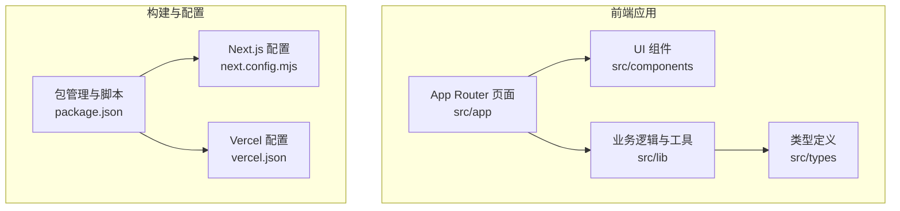
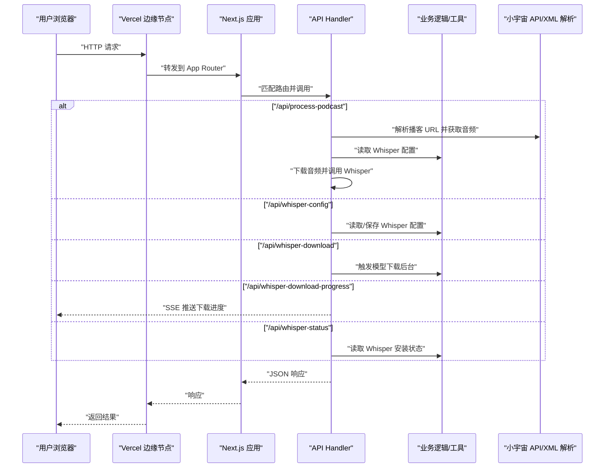
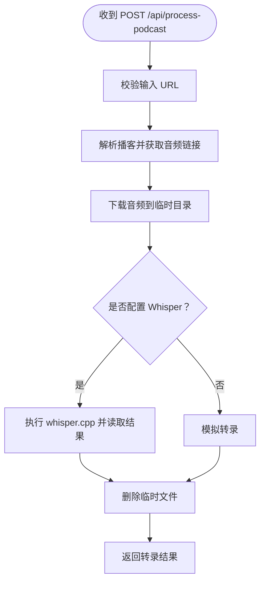
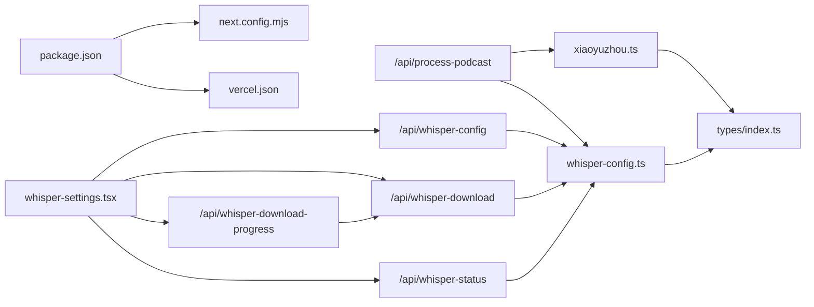

# 云端部署

<cite>
**本文引用的文件**
- [vercel.json](file://vercel.json)
- [package.json](file://package.json)
- [next.config.mjs](file://next.config.mjs)
- [README.md](file://README.md)
- [src/lib/whisper-config.ts](file://src/lib/whisper-config.ts)
- [src/lib/xiaoyuzhou.ts](file://src/lib/xiaoyuzhou.ts)
- [src/types/index.ts](file://src/types/index.ts)
- [src/app/api/process-podcast/route.ts](file://src/app/api/process-podcast/route.ts)
- [src/app/api/whisper-config/route.ts](file://src/app/api/whisper-config/route.ts)
- [src/app/api/whisper-download/route.ts](file://src/app/api/whisper-download/route.ts)
- [src/app/api/whisper-download-progress/route.ts](file://src/app/api/whisper-download-progress/route.ts)
- [src/app/api/whisper-status/route.ts](file://src/app/api/whisper-status/route.ts)
- [src/components/whisper-settings.tsx](file://src/components/whisper-settings.tsx)
</cite>

## 目录
1. [简介](#简介)
2. [项目结构](#项目结构)
3. [核心组件](#核心组件)
4. [架构总览](#架构总览)
5. [详细组件分析](#详细组件分析)
6. [依赖关系分析](#依赖关系分析)
7. [性能考虑](#性能考虑)
8. [故障排查指南](#故障排查指南)
9. [结论](#结论)
10. [附录](#附录)

## 简介
本文件面向 MemoFlow 的云端部署，聚焦于 Vercel 平台的部署流程与配置要点，包括项目连接、环境变量配置、域名绑定、vercel.json 参数说明、Next.js 应用云端优化策略（如 ISR、CDN 与缓存）、环境变量安全策略、部署后验证与性能测试方法，以及多环境（开发/测试/生产）管理策略。文档严格基于仓库现有代码与配置文件进行分析与总结，避免臆测。

## 项目结构
MemoFlow 是一个基于 Next.js 的应用，采用 App Router 结构，包含：
- 应用入口与页面：src/app
- 组件库：src/components
- 工具与业务逻辑：src/lib
- 类型定义：src/types
- 构建与运行脚本：package.json
- Next.js 配置：next.config.mjs
- Vercel 配置：vercel.json
- README 与部署按钮：README.md

图表来源
- [package.json:1-37](file://package.json#L1-L37)
- [next.config.mjs:1-12](file://next.config.mjs#L1-L12)
- [vercel.json:1-10](file://vercel.json#L1-L10)

章节来源
- [package.json:1-37](file://package.json#L1-L37)
- [next.config.mjs:1-12](file://next.config.mjs#L1-L12)
- [vercel.json:1-10](file://vercel.json#L1-L10)

## 核心组件
- API 路由：负责播客处理、Whisper 配置与下载、状态查询等。
- 业务工具：Whisper 配置管理、小宇宙播客解析。
- 类型系统：统一的响应与配置接口。
- 组件：Whisper 设置对话框，提供模型下载与配置界面。

章节来源
- [src/app/api/process-podcast/route.ts:1-127](file://src/app/api/process-podcast/route.ts#L1-L127)
- [src/app/api/whisper-config/route.ts:1-123](file://src/app/api/whisper-config/route.ts#L1-L123)
- [src/app/api/whisper-download/route.ts:1-235](file://src/app/api/whisper-download/route.ts#L1-L235)
- [src/app/api/whisper-download-progress/route.ts:63-105](file://src/app/api/whisper-download-progress/route.ts#L63-L105)
- [src/app/api/whisper-status/route.ts:1-59](file://src/app/api/whisper-status/route.ts#L1-L59)
- [src/lib/whisper-config.ts:1-105](file://src/lib/whisper-config.ts#L1-L105)
- [src/lib/xiaoyuzhou.ts:1-219](file://src/lib/xiaoyuzhou.ts#L1-L219)
- [src/types/index.ts:1-22](file://src/types/index.ts#L1-L22)
- [src/components/whisper-settings.tsx:1-468](file://src/components/whisper-settings.tsx#L1-L468)

## 架构总览
下图展示 Vercel 上 MemoFlow 的请求处理链路：客户端请求到达 Vercel 边缘网络，Next.js 应用根据路由分发至对应 API Handler，Handler 调用业务逻辑与外部服务，最终返回响应。

图表来源
- [src/app/api/process-podcast/route.ts:1-127](file://src/app/api/process-podcast/route.ts#L1-L127)
- [src/app/api/whisper-config/route.ts:1-123](file://src/app/api/whisper-config/route.ts#L1-L123)
- [src/app/api/whisper-download/route.ts:1-235](file://src/app/api/whisper-download/route.ts#L1-L235)
- [src/app/api/whisper-download-progress/route.ts:63-105](file://src/app/api/whisper-download-progress/route.ts#L63-L105)
- [src/app/api/whisper-status/route.ts:1-59](file://src/app/api/whisper-status/route.ts#L1-L59)
- [src/lib/xiaoyuzhou.ts:1-219](file://src/lib/xiaoyuzhou.ts#L1-L219)
- [src/lib/whisper-config.ts:1-105](file://src/lib/whisper-config.ts#L1-L105)

## 详细组件分析

### Vercel 部署配置（vercel.json）
- 框架设置：明确使用 Next.js 框架，便于 Vercel 自动识别与优化。
- 构建命令：使用 npm run build，与 package.json 中的 scripts 对齐。
- 输出目录：指定为 .next，符合 Next.js 构建产物目录。
- 安装命令与开发命令：分别指向 npm install 与 npm run dev，确保本地与 CI/CD 环境一致。
- 地区选择：regions 指定 hnd1（大阪），影响冷启动与就近访问体验。

章节来源
- [vercel.json:1-10](file://vercel.json#L1-L10)
- [package.json:5-11](file://package.json#L5-L11)

### Next.js 配置（next.config.mjs）
- React 严格模式：提升开发期代码质量与早期问题暴露。
- 实验性配置：启用 serverActions，并设置请求体大小限制，满足 API 处理需求。

章节来源
- [next.config.mjs:1-12](file://next.config.mjs#L1-L12)

### API 路由与业务逻辑

#### 处理播客请求（/api/process-podcast）
- 输入校验：要求传入 URL。
- 数据获取：调用小宇宙工具解析播客信息，提取音频链接。
- 音频处理：下载音频到临时目录，调用 Whisper 进行转录；若未配置 Whisper，则回退为模拟转录。
- 输出：返回转录文本、音频地址、字数统计与语言标识。

图表来源
- [src/app/api/process-podcast/route.ts:13-114](file://src/app/api/process-podcast/route.ts#L13-L114)
- [src/lib/xiaoyuzhou.ts:27-47](file://src/lib/xiaoyuzhou.ts#L27-L47)

章节来源
- [src/app/api/process-podcast/route.ts:1-127](file://src/app/api/process-podcast/route.ts#L1-L127)
- [src/lib/xiaoyuzhou.ts:1-219](file://src/lib/xiaoyuzhou.ts#L1-L219)

#### Whisper 配置管理（/api/whisper-config）
- GET：返回合并了环境变量覆盖的当前配置。
- POST：接收配置对象，进行字段校验与类型验证，保存到本地配置文件，并返回合并后的配置。

章节来源
- [src/app/api/whisper-config/route.ts:1-123](file://src/app/api/whisper-config/route.ts#L1-L123)
- [src/lib/whisper-config.ts:54-89](file://src/lib/whisper-config.ts#L54-L89)
- [src/types/index.ts:7-12](file://src/types/index.ts#L7-L12)

#### Whisper 模型下载（/api/whisper-download）
- 触发下载：校验模型名（small/medium），检查是否已有同名模型或正在下载中。
- 后台下载：使用流式读取与进度文件记录，完成后更新配置。
- 进度推送：通过 SSE 推送下载进度，供前端实时显示。

章节来源
- [src/app/api/whisper-download/route.ts:1-235](file://src/app/api/whisper-download/route.ts#L1-L235)
- [src/app/api/whisper-download-progress/route.ts:63-105](file://src/app/api/whisper-download-progress/route.ts#L63-L105)

#### Whisper 状态查询（/api/whisper-status）
- 返回 whisper.cpp 与模型文件的安装状态、路径、模型名与模型大小。

章节来源
- [src/app/api/whisper-status/route.ts:1-59](file://src/app/api/whisper-status/route.ts#L1-L59)
- [src/lib/whisper-config.ts:1-105](file://src/lib/whisper-config.ts#L1-L105)
- [src/types/index.ts:14-21](file://src/types/index.ts#L14-L21)

#### 小宇宙播客解析（src/lib/xiaoyuzhou.ts）
- 多策略解析：官方 API、页面 HTML、第三方 API，增强鲁棒性。
- 超时控制：对各外部请求设置超时，避免阻塞。
- 兼容性：支持多种音频格式与元数据字段。

章节来源
- [src/lib/xiaoyuzhou.ts:1-219](file://src/lib/xiaoyuzhou.ts#L1-L219)

#### Whisper 配置管理（src/lib/whisper-config.ts）
- 默认配置：包含 whisper.cpp 路径、模型路径、模型名与线程数。
- 环境变量覆盖：优先级高于本地配置文件。
- 工具函数：格式化文件大小、推断模型名。

章节来源
- [src/lib/whisper-config.ts:1-105](file://src/lib/whisper-config.ts#L1-L105)
- [src/types/index.ts:7-21](file://src/types/index.ts#L7-L21)

#### 组件：Whisper 设置（src/components/whisper-settings.tsx）
- 功能：展示状态、选择模型、下载模型、保存配置、监听下载进度。
- 交互：使用 EventSource 订阅 /api/whisper-download-progress，实时反馈进度。

章节来源
- [src/components/whisper-settings.tsx:1-468](file://src/components/whisper-settings.tsx#L1-L468)

## 依赖关系分析
- API 路由依赖业务工具与类型定义。
- 业务工具依赖外部服务（小宇宙 API/XML 解析）。
- 组件依赖 API 路由与类型定义。
- 构建与部署依赖 package.json、next.config.mjs、vercel.json。

图表来源
- [package.json:1-37](file://package.json#L1-L37)
- [next.config.mjs:1-12](file://next.config.mjs#L1-L12)
- [vercel.json:1-10](file://vercel.json#L1-L10)
- [src/app/api/process-podcast/route.ts:1-127](file://src/app/api/process-podcast/route.ts#L1-L127)
- [src/app/api/whisper-config/route.ts:1-123](file://src/app/api/whisper-config/route.ts#L1-L123)
- [src/app/api/whisper-download/route.ts:1-235](file://src/app/api/whisper-download/route.ts#L1-L235)
- [src/app/api/whisper-download-progress/route.ts:63-105](file://src/app/api/whisper-download-progress/route.ts#L63-L105)
- [src/app/api/whisper-status/route.ts:1-59](file://src/app/api/whisper-status/route.ts#L1-L59)
- [src/lib/whisper-config.ts:1-105](file://src/lib/whisper-config.ts#L1-L105)
- [src/lib/xiaoyuzhou.ts:1-219](file://src/lib/xiaoyuzhou.ts#L1-L219)
- [src/types/index.ts:1-22](file://src/types/index.ts#L1-L22)
- [src/components/whisper-settings.tsx:1-468](file://src/components/whisper-settings.tsx#L1-L468)

## 性能考虑
- CDN 与边缘：Vercel 作为边缘网络，天然具备全球分发与缓存能力，建议结合 Next.js 缓存策略与静态资源优化。
- 构建与运行：使用 npm scripts 与 Next.js 默认优化，减少不必要的打包体积。
- API 响应：对长耗时操作（如音频下载与 Whisper 转录）采用异步与 SSE 推送，改善用户体验。
- 缓存策略：对于静态页面与公开资源，建议利用 Vercel 的缓存头与 CDN 缓存；对动态 API，合理设置缓存控制与条件请求。
- ISR（增量静态再生）：当前仓库未见 ISR 使用示例。若需引入，可在页面导出 revalidate 字段，并配合边缘缓存与预渲染策略，降低冷启动与热缓存压力。

章节来源
- [vercel.json:1-10](file://vercel.json#L1-L10)
- [next.config.mjs:1-12](file://next.config.mjs#L1-L12)
- [src/app/api/process-podcast/route.ts:1-127](file://src/app/api/process-podcast/route.ts#L1-L127)
- [src/app/api/whisper-download-progress/route.ts:63-105](file://src/app/api/whisper-download-progress/route.ts#L63-L105)

## 故障排查指南
- 播客处理失败
  - 检查播客链接是否有效，确认小宇宙 API 可达性与超时设置。
  - 查看 API 返回的错误信息，定位具体环节（解析、下载、转录）。
- Whisper 未配置
  - 通过 /api/whisper-status 检查安装状态；若未安装，先下载模型并通过 /api/whisper-config 保存路径与线程数。
- 下载进度异常
  - 确认 SSE 连接是否建立成功；检查 /api/whisper-download-progress 的事件推送与前端 EventSource 处理。
- 环境变量覆盖
  - 确认环境变量优先级高于本地配置文件；在 Vercel 控制台中设置环境变量并验证生效。

章节来源
- [src/app/api/process-podcast/route.ts:1-127](file://src/app/api/process-podcast/route.ts#L1-L127)
- [src/app/api/whisper-status/route.ts:1-59](file://src/app/api/whisper-status/route.ts#L1-L59)
- [src/app/api/whisper-config/route.ts:1-123](file://src/app/api/whisper-config/route.ts#L1-L123)
- [src/app/api/whisper-download-progress/route.ts:63-105](file://src/app/api/whisper-download-progress/route.ts#L63-L105)
- [src/lib/whisper-config.ts:37-46](file://src/lib/whisper-config.ts#L37-L46)

## 结论
本部署文档基于仓库现有配置与代码，梳理了 MemoFlow 在 Vercel 上的部署要点与优化方向。通过明确的 vercel.json 参数、Next.js 配置与 API 路由设计，结合 SSE 与边缘缓存，可实现稳定高效的云端交付。后续可按需引入 ISR 与更细粒度的缓存策略，进一步提升性能与可维护性。

## 附录

### Vercel 部署流程（项目连接/环境变量/域名）
- 项目连接
  - 在 Vercel 控制台新建项目，选择仓库并关联分支。
  - 确认框架为 Next.js，构建与输出目录与 vercel.json 一致。
- 环境变量
  - 在 Vercel 控制台的“Settings”->“Environment Variables”中添加环境变量，例如 WHISPER_PATH、WHISPER_MODEL_PATH、WHISPER_THREADS 等，以覆盖本地配置。
  - 注意：仓库中未直接使用环境变量的 API，但 Whisper 配置模块支持环境变量覆盖，建议在 Vercel 中设置以满足不同环境差异。
- 域名绑定
  - 在“Domains”中添加自定义域名，Vercel 会自动配置 DNS 与 SSL。
  - 若使用子路径部署，可在“Project Settings”中调整根路径与重写规则。

章节来源
- [vercel.json:1-10](file://vercel.json#L1-L10)
- [src/lib/whisper-config.ts:37-46](file://src/lib/whisper-config.ts#L37-L46)

### vercel.json 参数说明
- $schema：指向 Vercel OpenAPI 规范，确保配置合法性。
- framework：nextjs，启用 Next.js 特有优化。
- installCommand：npm install，安装依赖。
- buildCommand：npm run build，构建应用。
- devCommand：npm run dev，本地开发。
- outputDirectory：.next，Next.js 构建产物目录。
- regions：hnd1，指定部署区域（影响冷启动与就近访问）。

章节来源
- [vercel.json:1-10](file://vercel.json#L1-L10)

### 环境变量安全策略
- 敏感信息：仓库未包含 API 密钥或敏感配置；若未来接入外部服务，建议仅在 Vercel 控制台设置密钥，不在代码中硬编码。
- 环境隔离：通过 Vercel 的环境变量分层（Production/Preview/Development），实现多环境隔离与最小权限原则。
- 最小暴露：仅暴露必要变量，定期轮换密钥并审计访问日志。

章节来源
- [src/lib/whisper-config.ts:37-46](file://src/lib/whisper-config.ts#L37-L46)

### 部署后验证与性能测试
- 功能验证
  - 访问首页，点击“设置”，检查 Whisper 状态与模型下载。
  - 通过 /api/whisper-config 与 /api/whisper-status 验证配置与状态。
  - 使用 /api/process-podcast 传入有效播客链接，观察转录结果。
- 性能测试
  - 利用 Vercel 的“Edge Functions”与“Serverless”指标查看冷启动与吞吐。
  - 使用浏览器开发者工具 Network 面板观察 API 响应时间与缓存命中情况。
  - 对长耗时操作（下载/转录）使用 SSE 监控，评估用户体验。

章节来源
- [src/components/whisper-settings.tsx:1-468](file://src/components/whisper-settings.tsx#L1-L468)
- [src/app/api/process-podcast/route.ts:1-127](file://src/app/api/process-podcast/route.ts#L1-L127)
- [src/app/api/whisper-config/route.ts:1-123](file://src/app/api/whisper-config/route.ts#L1-L123)
- [src/app/api/whisper-status/route.ts:1-59](file://src/app/api/whisper-status/route.ts#L1-L59)

### 多环境部署策略
- 开发环境（Preview）
  - 通过 Vercel 的 Pull Request 预览功能，自动为 PR 创建独立预览环境，便于联调与回归。
- 测试环境（Preview）
  - 使用独立的环境变量与数据库连接，隔离测试流量与真实数据。
- 生产环境（Production）
  - 固定域名与 SSL，开启健康检查与监控告警；对关键 API 设置速率限制与超时保护。
- 变更管理
  - 通过 Git 分支策略与 Vercel 的“Project Settings”中的“Build & Output Settings”控制不同分支的构建行为。

章节来源
- [vercel.json:1-10](file://vercel.json#L1-L10)
- [README.md](file://README.md#L7)