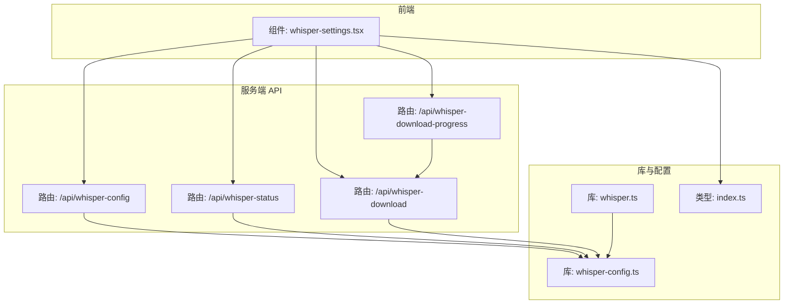
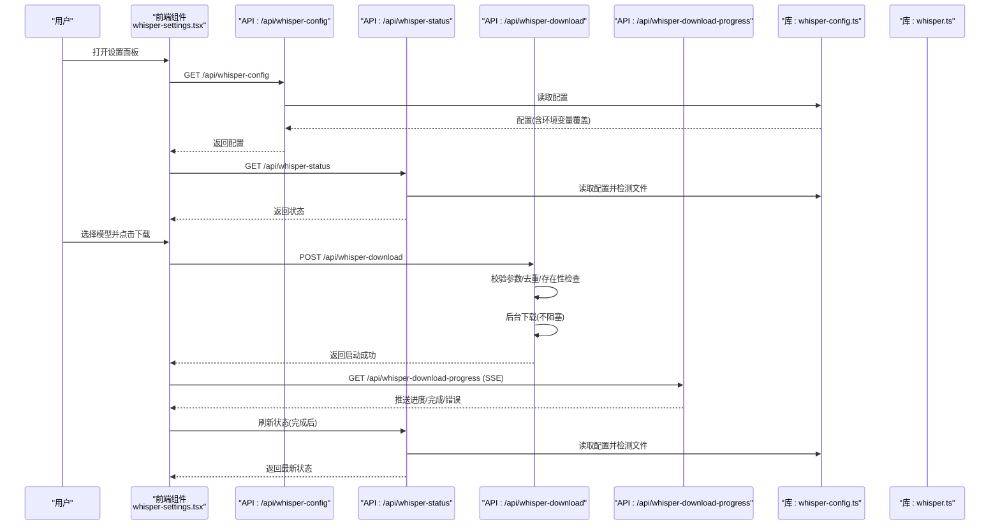
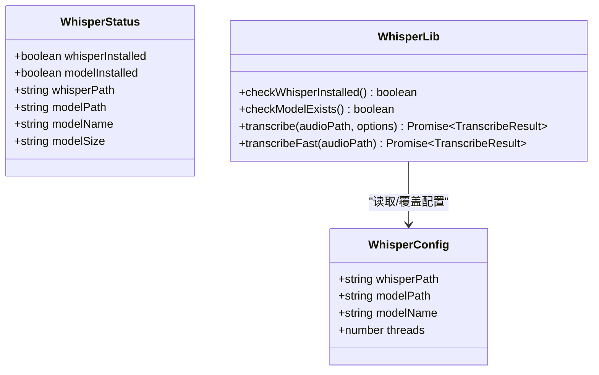
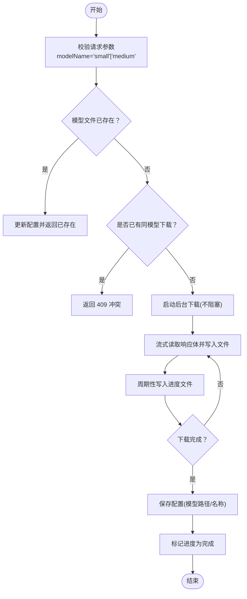
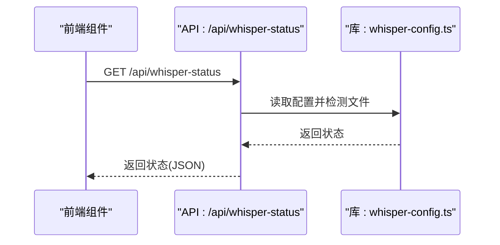
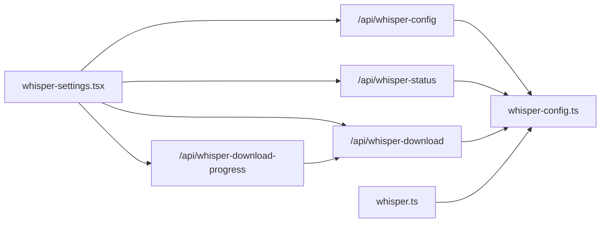
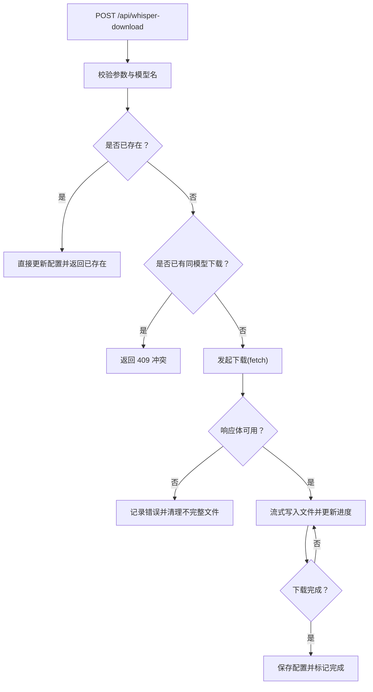
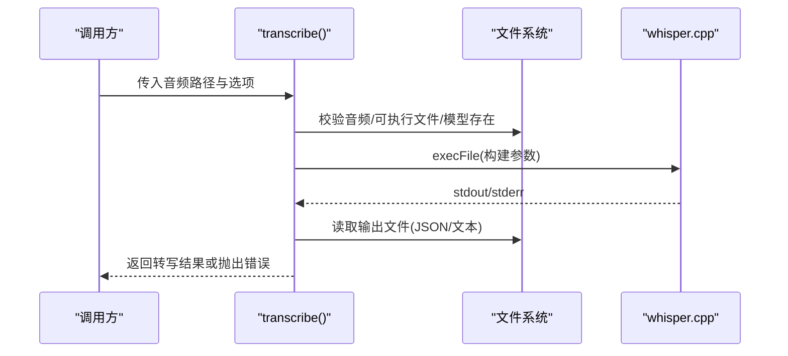

# 故障排除

<cite>
**本文引用的文件**   
- [README.md](file://README.md)
- [package.json](file://package.json)
- [setup-whisper.sh](file://setup-whisper.sh)
- [src/lib/whisper.ts](file://src/lib/whisper.ts)
- [src/lib/whisper-config.ts](file://src/lib/whisper-config.ts)
- [src/lib/xiaoyuzhou.ts](file://src/lib/xiaoyuzhou.ts)
- [src/app/api/whisper-download/route.ts](file://src/app/api/whisper-download/route.ts)
- [src/app/api/whisper-download-progress/route.ts](file://src/app/api/whisper-download-progress/route.ts)
- [src/app/api/whisper-status/route.ts](file://src/app/api/whisper-status/route.ts)
- [src/app/api/whisper-config/route.ts](file://src/app/api/whisper-config/route.ts)
- [src/components/whisper-settings.tsx](file://src/components/whisper-settings.tsx)
- [src/types/index.ts](file://src/types/index.ts)
- [err.logs](file://err.logs)
</cite>

## 目录
1. [简介](#简介)
2. [项目结构](#项目结构)
3. [核心组件](#核心组件)
4. [架构总览](#架构总览)
5. [详细组件分析](#详细组件分析)
6. [依赖关系分析](#依赖关系分析)
7. [性能考虑](#性能考虑)
8. [故障排除指南](#故障排除指南)
9. [结论](#结论)
10. [附录](#附录)

## 简介
本指南面向 MemoFlow 的技术支持与运维人员，聚焦于 Whisper 语音转写子系统的故障排查与优化。内容涵盖：Whisper 模型下载失败、音频转录错误、API 调用异常的系统化诊断流程；错误日志分析方法与关键信息提取技巧；性能问题的诊断工具与优化建议；以及紧急情况下的快速恢复与回滚策略。文档同时提供标准化的问题处理流程与知识库要点，帮助一线团队高效定位与解决问题。

## 项目结构
MemoFlow 采用 Next.js 应用结构，前端组件与服务端 API 路由清晰分离。Whisper 子系统由配置管理、模型下载与进度跟踪、状态查询、转写封装等模块组成，并通过前端设置面板进行可视化操作。

图表来源
- [src/components/whisper-settings.tsx:74-101](file://src/components/whisper-settings.tsx#L74-L101)
- [src/app/api/whisper-config/route.ts:10-28](file://src/app/api/whisper-config/route.ts#L10-L28)
- [src/app/api/whisper-status/route.ts:11-18](file://src/app/api/whisper-status/route.ts#L11-L18)
- [src/app/api/whisper-download/route.ts:173-179](file://src/app/api/whisper-download/route.ts#L173-L179)
- [src/app/api/whisper-download-progress/route.ts:43-47](file://src/app/api/whisper-download-progress/route.ts#L43-L47)
- [src/lib/whisper-config.ts:54-71](file://src/lib/whisper-config.ts#L54-L71)
- [src/lib/whisper.ts:9-14](file://src/lib/whisper.ts#L9-L14)
- [src/types/index.ts:7-21](file://src/types/index.ts#L7-L21)

章节来源
- [README.md:1-27](file://README.md#L1-L27)
- [package.json:1-37](file://package.json#L1-L37)

## 核心组件
- 配置管理：负责读取/保存 Whisper 配置，支持默认值与环境变量覆盖，提供模型名推断与文件大小格式化能力。
- 模型下载与进度：提供模型下载触发、后台下载、进度文件写入与 SSE 推送。
- 状态查询：返回 whisper.cpp 安装状态、模型存在性、模型大小与模型名。
- 转写封装：封装 whisper.cpp 可执行文件调用，校验文件与依赖，构建参数，解析输出并清理临时文件。
- 前端设置面板：统一展示状态、触发下载、监听进度、保存配置。

章节来源
- [src/lib/whisper-config.ts:54-105](file://src/lib/whisper-config.ts#L54-L105)
- [src/app/api/whisper-download/route.ts:52-167](file://src/app/api/whisper-download/route.ts#L52-L167)
- [src/app/api/whisper-download-progress/route.ts:11-37](file://src/app/api/whisper-download-progress/route.ts#L11-L37)
- [src/app/api/whisper-status/route.ts:11-59](file://src/app/api/whisper-status/route.ts#L11-L59)
- [src/lib/whisper.ts:54-156](file://src/lib/whisper.ts#L54-L156)
- [src/components/whisper-settings.tsx:56-101](file://src/components/whisper-settings.tsx#L56-L101)

## 架构总览
下图展示了从用户操作到服务端处理与外部资源交互的关键路径，以及错误传播与恢复点。

图表来源
- [src/components/whisper-settings.tsx:74-101](file://src/components/whisper-settings.tsx#L74-L101)
- [src/app/api/whisper-config/route.ts:10-28](file://src/app/api/whisper-config/route.ts#L10-L28)
- [src/app/api/whisper-status/route.ts:11-18](file://src/app/api/whisper-status/route.ts#L11-L18)
- [src/app/api/whisper-download/route.ts:173-179](file://src/app/api/whisper-download/route.ts#L173-L179)
- [src/app/api/whisper-download-progress/route.ts:43-47](file://src/app/api/whisper-download-progress/route.ts#L43-L47)
- [src/lib/whisper-config.ts:54-71](file://src/lib/whisper-config.ts#L54-L71)

## 详细组件分析

### 组件一：配置管理与转写封装
- 配置读取与保存：支持默认值、文件持久化与环境变量覆盖；提供模型名推断与文件大小格式化。
- 转写封装：校验 whisper.cpp 可执行文件与模型文件存在性；构建参数（语言、线程、输出格式）；解析 JSON/文本输出；清理临时文件；错误统一包装。

图表来源
- [src/lib/whisper-config.ts:54-105](file://src/lib/whisper-config.ts#L54-L105)
- [src/lib/whisper.ts:38-156](file://src/lib/whisper.ts#L38-L156)
- [src/types/index.ts:7-21](file://src/types/index.ts#L7-L21)

章节来源
- [src/lib/whisper-config.ts:54-105](file://src/lib/whisper-config.ts#L54-L105)
- [src/lib/whisper.ts:38-156](file://src/lib/whisper.ts#L38-L156)
- [src/types/index.ts:7-21](file://src/types/index.ts#L7-L21)

### 组件二：模型下载与进度跟踪
- 下载触发：校验模型名、避免重复下载、检查模型是否已存在；若不存在则后台下载。
- 后台下载：使用流式读取与写入，定期更新进度文件；下载完成后更新配置并标记完成。
- 进度推送：SSE 每秒推送一次进度；完成或错误时延迟关闭连接。

图表来源
- [src/app/api/whisper-download/route.ts:173-235](file://src/app/api/whisper-download/route.ts#L173-L235)
- [src/app/api/whisper-download-progress/route.ts:43-138](file://src/app/api/whisper-download-progress/route.ts#L43-L138)

章节来源
- [src/app/api/whisper-download/route.ts:52-167](file://src/app/api/whisper-download/route.ts#L52-L167)
- [src/app/api/whisper-download-progress/route.ts:11-37](file://src/app/api/whisper-download-progress/route.ts#L11-L37)

### 组件三：状态查询与前端集成
- 状态查询：读取配置，检测 whisper.cpp 与模型文件存在性，计算模型大小，推断模型名。
- 前端集成：设置面板加载状态与配置，触发下载并监听进度，完成后刷新状态。

图表来源
- [src/app/api/whisper-status/route.ts:11-59](file://src/app/api/whisper-status/route.ts#L11-L59)
- [src/lib/whisper-config.ts:54-71](file://src/lib/whisper-config.ts#L54-L71)

章节来源
- [src/app/api/whisper-status/route.ts:11-59](file://src/app/api/whisper-status/route.ts#L11-L59)
- [src/components/whisper-settings.tsx:74-101](file://src/components/whisper-settings.tsx#L74-L101)

## 依赖关系分析
- 组件耦合：前端设置面板依赖多个 API；API 路由依赖配置库；转写库依赖配置库与系统可执行文件。
- 外部依赖：Whisper.cpp 可执行文件与模型文件；Hugging Face 镜像源；Next.js 服务器端渲染与 API 路由。
- 潜在风险：模型下载受网络与磁盘空间影响；SSE 连接需处理客户端断开；转写过程对 I/O 与 CPU 资源敏感。

图表来源
- [src/components/whisper-settings.tsx:74-101](file://src/components/whisper-settings.tsx#L74-L101)
- [src/app/api/whisper-config/route.ts:10-28](file://src/app/api/whisper-config/route.ts#L10-L28)
- [src/app/api/whisper-status/route.ts:11-18](file://src/app/api/whisper-status/route.ts#L11-L18)
- [src/app/api/whisper-download/route.ts:173-179](file://src/app/api/whisper-download/route.ts#L173-L179)
- [src/app/api/whisper-download-progress/route.ts:43-47](file://src/app/api/whisper-download-progress/route.ts#L43-L47)
- [src/lib/whisper-config.ts:54-71](file://src/lib/whisper-config.ts#L54-L71)
- [src/lib/whisper.ts:9-14](file://src/lib/whisper.ts#L9-L14)

章节来源
- [src/components/whisper-settings.tsx:74-101](file://src/components/whisper-settings.tsx#L74-L101)
- [src/app/api/whisper-config/route.ts:10-28](file://src/app/api/whisper-config/route.ts#L10-L28)
- [src/app/api/whisper-status/route.ts:11-18](file://src/app/api/whisper-status/route.ts#L11-L18)
- [src/app/api/whisper-download/route.ts:173-179](file://src/app/api/whisper-download/route.ts#L173-L179)
- [src/app/api/whisper-download-progress/route.ts:43-47](file://src/app/api/whisper-download-progress/route.ts#L43-L47)
- [src/lib/whisper-config.ts:54-71](file://src/lib/whisper-config.ts#L54-L71)
- [src/lib/whisper.ts:9-14](file://src/lib/whisper.ts#L9-L14)

## 性能考虑
- 线程数配置：转写线程数直接影响 CPU 利用率与吞吐量，建议根据 CPU 核心数合理设置。
- 模型选择：small 模型体积小、速度较快；medium 模型体积大、质量更高。根据场景权衡。
- I/O 与缓存：模型下载采用流式写入，减少内存占用；转写输出文件自动清理，避免磁盘堆积。
- SSE 推送频率：进度推送间隔为 1 秒，兼顾实时性与服务器负载。

章节来源
- [src/lib/whisper-config.ts:37-46](file://src/lib/whisper-config.ts#L37-L46)
- [src/lib/whisper.ts:83-101](file://src/lib/whisper.ts#L83-L101)
- [src/app/api/whisper-download-progress/route.ts:89-113](file://src/app/api/whisper-download-progress/route.ts#L89-L113)

## 故障排除指南

### 一、Whisper 模型下载失败
常见症状
- 前端显示“下载失败”或进度长时间停滞。
- 后端日志出现网络错误、响应体为空、进度文件写入失败。

排查步骤
1. 环境检查
   - 确认模型目录存在且具备写权限。
   - 检查网络连通性与镜像源可用性。
2. 参数与状态
   - 校验请求体中的模型名是否为 small 或 medium。
   - 若已有同模型下载，避免重复触发。
3. 进度与清理
   - 查看进度文件是否存在与内容是否更新。
   - 下载失败时检查是否残留不完整文件并清理。
4. 日志分析
   - 关注下载过程中抛出的异常与错误消息。
   - 记录 HTTP 状态码与响应头长度。

图表来源
- [src/app/api/whisper-download/route.ts:173-235](file://src/app/api/whisper-download/route.ts#L173-L235)
- [src/app/api/whisper-download-progress/route.ts:11-37](file://src/app/api/whisper-download-progress/route.ts#L11-L37)

章节来源
- [src/app/api/whisper-download/route.ts:173-235](file://src/app/api/whisper-download/route.ts#L173-L235)
- [src/app/api/whisper-download-progress/route.ts:11-37](file://src/app/api/whisper-download-progress/route.ts#L11-L37)

### 二、音频转录错误
常见症状
- 转写接口报错，提示 whisper.cpp 未安装、模型不存在或执行失败。
- 输出文件读取失败或 JSON 解析异常。

排查步骤
1. 依赖检查
   - 确认 whisper.cpp 可执行文件存在。
   - 确认模型文件存在且路径正确。
2. 参数校验
   - 校验语言、线程数、输出格式等参数。
3. 输出解析
   - 检查输出文件扩展名与内容格式。
   - 解析 JSON 时捕获异常并记录错误。
4. 临时文件清理
   - 确保转写后临时文件被清理，避免后续干扰。

图表来源
- [src/lib/whisper.ts:54-156](file://src/lib/whisper.ts#L54-L156)

章节来源
- [src/lib/whisper.ts:54-156](file://src/lib/whisper.ts#L54-L156)

### 三、API 调用异常
常见症状
- 配置/状态/下载接口返回 4xx/5xx。
- SSE 连接中断或无数据推送。

排查步骤
1. 请求体验证
   - 确认配置接口请求体为有效 JSON 对象，包含必填字段。
   - 校验 threads 为正整数，modelName 为允许值集合之一。
2. 状态与配置
   - 使用状态接口检查 whisper.cpp 与模型文件存在性。
   - 通过配置接口读取合并后的配置（含环境变量覆盖）。
3. SSE 连接
   - 检查 SSE 响应头与连接生命周期。
   - 处理客户端断开与服务端清理逻辑。

章节来源
- [src/app/api/whisper-config/route.ts:36-123](file://src/app/api/whisper-config/route.ts#L36-L123)
- [src/app/api/whisper-status/route.ts:11-59](file://src/app/api/whisper-status/route.ts#L11-L59)
- [src/app/api/whisper-download-progress/route.ts:43-138](file://src/app/api/whisper-download-progress/route.ts#L43-L138)

### 四、错误日志分析与关键信息提取
- 构建日志示例：关注构建机器配置、分支/提交信息、依赖安装耗时与安全告警。
- 服务端日志：定位错误发生的具体文件与行号，提取错误消息与堆栈片段。
- 关键信息提取清单
  - 时间戳与错误类型
  - 请求路径与状态码
  - 参数与环境变量
  - 文件路径与磁盘空间
  - 网络错误与超时

章节来源
- [err.logs:1-18](file://err.logs#L1-L18)

### 五、性能问题诊断与优化
- CPU 与 I/O 压力
  - 降低转录线程数或切换更小模型以缓解压力。
  - 监控磁盘写入速率与模型文件大小变化。
- 网络与并发
  - 控制并发下载数量，避免带宽争用。
  - 优化镜像源与代理配置。
- 前端体验
  - 合理设置 SSE 推送间隔，避免频繁更新。
  - 对下载失败进行重试与用户提示。

章节来源
- [src/lib/whisper-config.ts:37-46](file://src/lib/whisper-config.ts#L37-L46)
- [src/app/api/whisper-download-progress/route.ts:89-113](file://src/app/api/whisper-download-progress/route.ts#L89-L113)

### 六、紧急恢复与回滚策略
- 快速恢复
  - 重启服务端进程，清理临时文件与进度文件。
  - 重新触发模型下载，确认网络与存储正常。
- 回滚策略
  - 固定模型版本与配置文件，回退到上一个稳定构建。
  - 临时禁用高负载功能（如大模型转写），切换至小模型。
- 备份与恢复
  - 定期备份 .whisper-config.json 与模型文件。
  - 使用脚本自动化安装与配置，减少人工干预。

章节来源
- [setup-whisper.sh:1-47](file://setup-whisper.sh#L1-L47)
- [src/lib/whisper-config.ts:78-89](file://src/lib/whisper-config.ts#L78-L89)

### 七、标准化问题处理流程与知识库
- 流程模板
  - 现场确认 -> 环境检查 -> 参数核对 -> 日志采集 -> 复现与隔离 -> 修复与验证 -> 回归测试 -> 文档更新
- 知识库要点
  - 常见错误码与含义
  - 配置项与默认值对照表
  - 模型文件命名规范与大小
  - SSE 连接与断开处理
  - 转写参数与性能关系

章节来源
- [src/app/api/whisper-config/route.ts:36-123](file://src/app/api/whisper-config/route.ts#L36-L123)
- [src/lib/whisper-config.ts:54-105](file://src/lib/whisper-config.ts#L54-L105)
- [src/app/api/whisper-download-progress/route.ts:43-138](file://src/app/api/whisper-download-progress/route.ts#L43-L138)

## 结论
本指南提供了从环境检查到组件调试的完整故障排除路径，结合日志分析与性能优化建议，能够帮助团队快速定位并解决 Whisper 子系统中的常见问题。建议在生产环境中持续监控关键指标，完善自动化测试与回滚机制，确保系统稳定性与可维护性。

## 附录
- 相关文件与职责
  - setup-whisper.sh：初始化 whisper.cpp 与模型环境
  - whisper.ts：封装 whisper.cpp 调用
  - whisper-config.ts：配置读取/保存与环境变量覆盖
  - API 路由：配置、状态、下载、进度
  - 前端组件：设置面板与进度监听

章节来源
- [setup-whisper.sh:1-47](file://setup-whisper.sh#L1-L47)
- [src/lib/whisper.ts:1-229](file://src/lib/whisper.ts#L1-L229)
- [src/lib/whisper-config.ts:1-105](file://src/lib/whisper-config.ts#L1-L105)
- [src/app/api/whisper-config/route.ts:1-124](file://src/app/api/whisper-config/route.ts#L1-L124)
- [src/app/api/whisper-status/route.ts:1-60](file://src/app/api/whisper-status/route.ts#L1-L60)
- [src/app/api/whisper-download/route.ts:1-235](file://src/app/api/whisper-download/route.ts#L1-L235)
- [src/app/api/whisper-download-progress/route.ts:1-139](file://src/app/api/whisper-download-progress/route.ts#L1-L139)
- [src/components/whisper-settings.tsx:1-468](file://src/components/whisper-settings.tsx#L1-L468)
- [src/types/index.ts:1-22](file://src/types/index.ts#L1-L22)