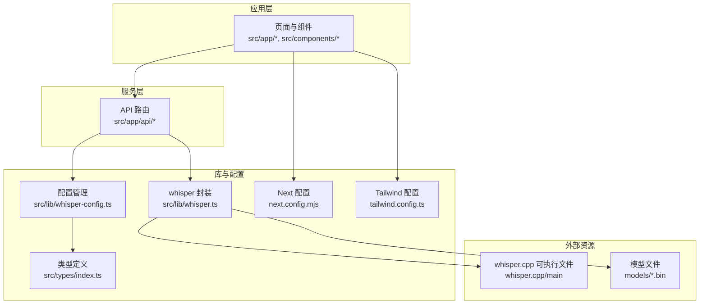
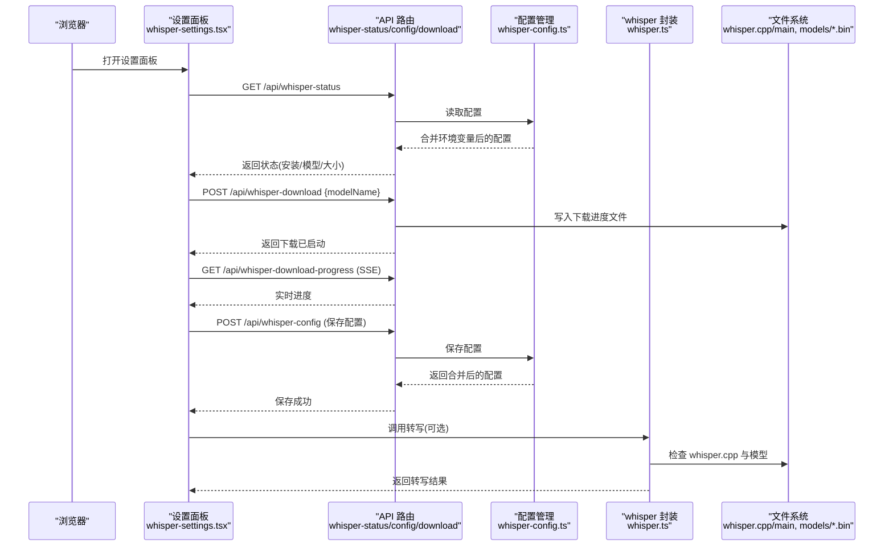
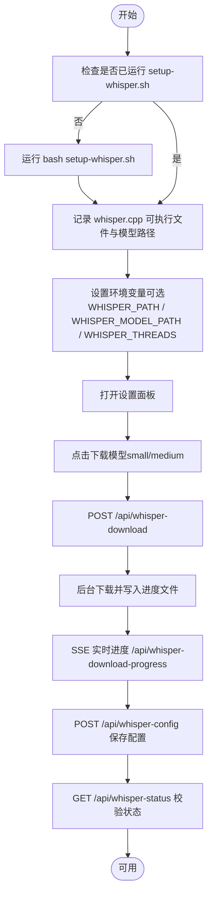
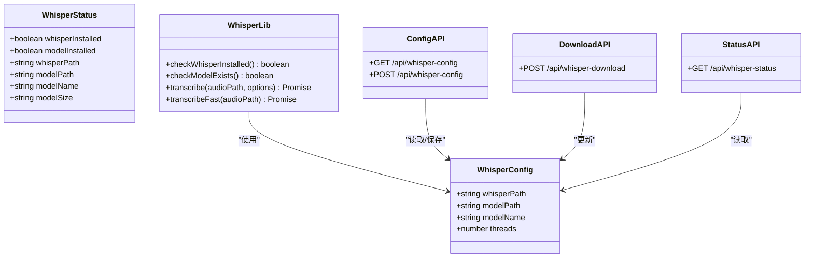
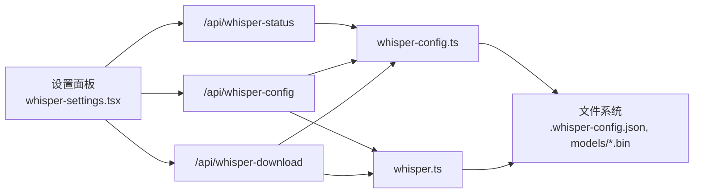

# 本地部署

<cite>
**本文引用的文件**
- [package.json](file://package.json)
- [next.config.mjs](file://next.config.mjs)
- [setup-whisper.sh](file://setup-whisper.sh)
- [vercel.json](file://vercel.json)
- [src/lib/whisper.ts](file://src/lib/whisper.ts)
- [src/lib/whisper-config.ts](file://src/lib/whisper-config.ts)
- [src/app/api/whisper-config/route.ts](file://src/app/api/whisper-config/route.ts)
- [src/app/api/whisper-download/route.ts](file://src/app/api/whisper-download/route.ts)
- [src/app/api/whisper-status/route.ts](file://src/app/api/whisper-status/route.ts)
- [src/components/whisper-settings.tsx](file://src/components/whisper-settings.tsx)
- [src/types/index.ts](file://src/types/index.ts)
- [tailwind.config.ts](file://tailwind.config.ts)
- [README.md](file://README.md)
</cite>

## 目录
1. [简介](#简介)
2. [项目结构](#项目结构)
3. [核心组件](#核心组件)
4. [架构总览](#架构总览)
5. [详细组件分析](#详细组件分析)
6. [依赖关系分析](#依赖关系分析)
7. [性能考虑](#性能考虑)
8. [故障排查指南](#故障排查指南)
9. [结论](#结论)
10. [附录](#附录)

## 简介
本指南面向希望在本地完整搭建 MemoFlow 的开发者，涵盖开发环境准备、依赖安装、Next.js 开发服务器启动、whisper.cpp 本地配置与模型下载、常见问题排查与解决方案，以及完整的本地开发环境搭建流程。

## 项目结构
MemoFlow 是一个基于 Next.js 的前端应用，集成了本地语音识别能力（whisper.cpp），并通过一组 API 管理 whisper.cpp 的安装、模型下载与配置。项目采用 TypeScript，UI 组件基于 Radix UI 与 TailwindCSS。

图表来源
- [src/app/api/whisper-config/route.ts:1-124](file://src/app/api/whisper-config/route.ts#L1-L124)
- [src/app/api/whisper-download/route.ts:1-235](file://src/app/api/whisper-download/route.ts#L1-L235)
- [src/app/api/whisper-status/route.ts:1-60](file://src/app/api/whisper-status/route.ts#L1-L60)
- [src/lib/whisper.ts:1-229](file://src/lib/whisper.ts#L1-L229)
- [src/lib/whisper-config.ts:1-105](file://src/lib/whisper-config.ts#L1-L105)
- [next.config.mjs:1-12](file://next.config.mjs#L1-L12)
- [tailwind.config.ts:1-90](file://tailwind.config.ts#L1-L90)

章节来源
- [README.md:1-27](file://README.md#L1-L27)
- [package.json:1-37](file://package.json#L1-L37)
- [next.config.mjs:1-12](file://next.config.mjs#L1-L12)
- [tailwind.config.ts:1-90](file://tailwind.config.ts#L1-L90)

## 核心组件
- Next.js 应用与路由：提供页面、布局与 API 路由，负责与 whisper.cpp 交互。
- whisper 封装：通过子进程调用 whisper.cpp 可执行文件，处理转写、输出解析与临时文件清理。
- 配置管理：读取/保存 whisper.cpp 路径、模型路径、模型名与线程数，并支持环境变量覆盖。
- UI 设置面板：提供模型下载、状态查看、配置保存的可视化界面。
- 构建与部署配置：Next.js 配置、Vercel 配置、Tailwind 配置。

章节来源
- [src/lib/whisper.ts:1-229](file://src/lib/whisper.ts#L1-L229)
- [src/lib/whisper-config.ts:1-105](file://src/lib/whisper-config.ts#L1-L105)
- [src/components/whisper-settings.tsx:1-468](file://src/components/whisper-settings.tsx#L1-L468)
- [src/app/api/whisper-config/route.ts:1-124](file://src/app/api/whisper-config/route.ts#L1-L124)
- [src/app/api/whisper-download/route.ts:1-235](file://src/app/api/whisper-download/route.ts#L1-L235)
- [src/app/api/whisper-status/route.ts:1-60](file://src/app/api/whisper-status/route.ts#L1-L60)

## 架构总览
下图展示了本地开发时，浏览器 UI 如何通过 API 路由与 whisper.cpp 交互，以及配置与模型文件的存储位置。

图表来源
- [src/components/whisper-settings.tsx:74-154](file://src/components/whisper-settings.tsx#L74-L154)
- [src/app/api/whisper-status/route.ts:11-59](file://src/app/api/whisper-status/route.ts#L11-L59)
- [src/app/api/whisper-download/route.ts:173-234](file://src/app/api/whisper-download/route.ts#L173-L234)
- [src/app/api/whisper-config/route.ts:36-123](file://src/app/api/whisper-config/route.ts#L36-L123)
- [src/lib/whisper-config.ts:54-89](file://src/lib/whisper-config.ts#L54-L89)
- [src/lib/whisper.ts:54-156](file://src/lib/whisper.ts#L54-L156)

## 详细组件分析

### 开发环境准备与系统依赖
- Node.js 版本与包管理器
  - 项目使用 Next.js 14，建议使用 Node.js LTS（如 18.x 或 20.x）以获得最佳兼容性。
  - 包管理器推荐使用 npm（与脚本一致）。若使用 yarn/pnpm，请确保其对 Next.js 的兼容性。
- 系统依赖
  - whisper.cpp 编译需要 make 工具链（Linux/macOS）。Windows 用户可使用 WSL 或 Git Bash。
  - 网络访问：模型下载需访问 HuggingFace 镜像源，确保网络可达。
- 环境变量（可选）
  - WHISPER_PATH：whisper.cpp 可执行文件路径
  - WHISPER_MODEL_PATH：模型文件路径
  - WHISPER_THREADS：转录线程数（默认 4）

章节来源
- [package.json:5-11](file://package.json#L5-L11)
- [src/lib/whisper.ts:9-14](file://src/lib/whisper.ts#L9-L14)
- [src/lib/whisper-config.ts:37-46](file://src/lib/whisper-config.ts#L37-L46)
- [setup-whisper.sh:1-47](file://setup-whisper.sh#L1-L47)

### 依赖安装
- 安装命令
  - 使用 npm 安装依赖：npm install
- 常见问题
  - 权限问题：macOS/Linux 上若出现权限错误，避免使用 sudo，检查用户对项目目录的写权限。
  - 网络问题：国内网络访问 npm registry 或 HuggingFace 镜像可能受限，可配置 npm registry 或代理。
  - Node 版本不匹配：升级/切换 Node 版本至 LTS，清理 node_modules 与 package-lock.json 后重装。
  - 依赖冲突：删除 node_modules 与 lockfile 后重装；必要时使用 npm audit fix 修复安全告警。

章节来源
- [package.json:12-35](file://package.json#L12-L35)
- [vercel.json:4-6](file://vercel.json#L4-L6)

### Next.js 开发服务器启动
- 启动命令
  - npm run dev 启动 Next.js 开发服务器。
- 端口与热重载
  - 默认端口可在环境变量或 IDE 中调整；开发模式下具备热重载能力，修改文件后自动刷新。
- Next.js 配置要点
  - reactStrictMode：启用严格模式，有助于早期发现潜在问题。
  - serverActions 体限制：允许更大的请求体（2MB），满足 whisper.cpp 输出写入需求。
- 调试选项
  - 使用浏览器开发者工具检查网络请求与控制台日志；在 API 路由中打印错误信息便于定位。

章节来源
- [package.json:5-11](file://package.json#L5-L11)
- [next.config.mjs:2-9](file://next.config.mjs#L2-L9)

### whisper.cpp 本地配置与模型下载
- 方案一：使用脚本初始化
  - 运行脚本 bash setup-whisper.sh，它会：
    - 克隆 whisper.cpp 仓库（如不存在）
    - 创建 models 目录
    - 下载中文优化的 small 模型（如不存在）
    - 编译 whisper.cpp（如未编译）
    - 输出可执行文件与模型路径，指导设置环境变量
- 方案二：通过 UI 配置
  - 打开设置面板，点击“下载模型”选择 small/medium，系统通过 /api/whisper-download 后台下载，进度通过 SSE /api/whisper-download-progress 实时反馈。
  - 下载完成后，可通过 /api/whisper-config 保存配置（whisper.cpp 路径、模型路径、线程数等）。
- 配置文件与环境变量
  - 配置文件：.whisper-config.json（保存在项目根目录），记录 whisperPath、modelPath、modelName、threads。
  - 环境变量优先级最高：WHISPER_PATH、WHISPER_MODEL_PATH、WHISPER_THREADS。
- 转写流程
  - 调用 whisper.ts 的 transcribe/transcribeFast，内部验证可执行文件与模型存在性，构建参数并执行，解析输出文件，清理临时文件。

图表来源
- [setup-whisper.sh:1-47](file://setup-whisper.sh#L1-L47)
- [src/components/whisper-settings.tsx:156-187](file://src/components/whisper-settings.tsx#L156-L187)
- [src/app/api/whisper-download/route.ts:173-234](file://src/app/api/whisper-download/route.ts#L173-L234)
- [src/app/api/whisper-config/route.ts:36-123](file://src/app/api/whisper-config/route.ts#L36-L123)
- [src/app/api/whisper-status/route.ts:11-59](file://src/app/api/whisper-status/route.ts#L11-L59)

章节来源
- [setup-whisper.sh:1-47](file://setup-whisper.sh#L1-L47)
- [src/components/whisper-settings.tsx:1-468](file://src/components/whisper-settings.tsx#L1-L468)
- [src/app/api/whisper-download/route.ts:1-235](file://src/app/api/whisper-download/route.ts#L1-L235)
- [src/app/api/whisper-config/route.ts:1-124](file://src/app/api/whisper-config/route.ts#L1-L124)
- [src/app/api/whisper-status/route.ts:1-60](file://src/app/api/whisper-status/route.ts#L1-L60)
- [src/lib/whisper.ts:54-156](file://src/lib/whisper.ts#L54-L156)

### 类与模块关系（代码级）

图表来源
- [src/types/index.ts:7-22](file://src/types/index.ts#L7-L22)
- [src/lib/whisper.ts:16-229](file://src/lib/whisper.ts#L16-L229)
- [src/lib/whisper-config.ts:54-89](file://src/lib/whisper-config.ts#L54-L89)
- [src/app/api/whisper-config/route.ts:10-123](file://src/app/api/whisper-config/route.ts#L10-L123)
- [src/app/api/whisper-download/route.ts:173-234](file://src/app/api/whisper-download/route.ts#L173-L234)
- [src/app/api/whisper-status/route.ts:11-59](file://src/app/api/whisper-status/route.ts#L11-L59)

## 依赖关系分析
- 组件耦合
  - UI 设置面板依赖 API 路由与配置管理模块；API 路由依赖配置管理与文件系统；whisper 封装直接依赖文件系统与子进程。
- 外部依赖
  - whisper.cpp 可执行文件与模型文件位于项目根目录下的 whisper.cpp 与 models 子目录。
- 配置覆盖链
  - 环境变量 > 配置文件 > 默认值。

图表来源
- [src/components/whisper-settings.tsx:74-154](file://src/components/whisper-settings.tsx#L74-L154)
- [src/app/api/whisper-status/route.ts:11-59](file://src/app/api/whisper-status/route.ts#L11-L59)
- [src/app/api/whisper-config/route.ts:36-123](file://src/app/api/whisper-config/route.ts#L36-L123)
- [src/app/api/whisper-download/route.ts:173-234](file://src/app/api/whisper-download/route.ts#L173-L234)
- [src/lib/whisper-config.ts:54-89](file://src/lib/whisper-config.ts#L54-L89)
- [src/lib/whisper.ts:54-156](file://src/lib/whisper.ts#L54-L156)

章节来源
- [src/lib/whisper-config.ts:54-89](file://src/lib/whisper-config.ts#L54-L89)
- [src/lib/whisper.ts:9-14](file://src/lib/whisper.ts#L9-L14)

## 性能考虑
- 线程数设置：WHISPER_THREADS 建议根据 CPU 核心数设置，过高可能导致上下文切换开销增大。
- 模型选择：small 模型体积小、速度更快，medium 模型更准确但体积更大，按需选择。
- 输出格式：JSON 输出包含时间戳，解析与写入额外文件会带来 IO 开销；如不需要时间戳，可选择文本输出以减少 IO。
- 热重载：开发阶段频繁改动仅影响前端，whisper.cpp 侧无需重启，但模型与配置变化需通过 API 重新校验。

## 故障排查指南
- whisper.cpp 未安装
  - 现象：报错提示未安装 whisper.cpp。
  - 处理：运行 bash setup-whisper.sh 完成克隆、编译与模型下载；或在 UI 中触发下载。
  - 参考：[src/lib/whisper.ts:70-74](file://src/lib/whisper.ts#L70-L74)
- 模型文件缺失
  - 现象：报错提示模型文件不存在。
  - 处理：通过 UI 设置面板下载模型，或手动放置模型文件于 models/ggml-small.bin 或 models/ggml-medium.bin。
  - 参考：[src/lib/whisper.ts:77-81](file://src/lib/whisper.ts#L77-L81)
- 下载中断或失败
  - 现象：SSE 进度停滞或返回错误。
  - 处理：检查网络连通性与磁盘空间；删除 models/.download-progress.json 后重试；查看后台下载日志。
  - 参考：[src/app/api/whisper-download/route.ts:147-166](file://src/app/api/whisper-download/route.ts#L147-L166)
- 配置保存失败
  - 现象：POST /api/whisper-config 返回错误。
  - 处理：检查请求体字段完整性与类型（threads 为正整数，modelName 为 tiny/base/small/medium/ large）；确认 .whisper-config.json 可写。
  - 参考：[src/app/api/whisper-config/route.ts:52-96](file://src/app/api/whisper-config/route.ts#L52-L96)
- 端口占用或热重载异常
  - 现象：开发服务器无法启动或页面不刷新。
  - 处理：更换端口、关闭占用进程；清理缓存后重启开发服务器。
  - 参考：[package.json:5-11](file://package.json#L5-L11)
- Tailwind 样式未生效
  - 现象：UI 样式异常。
  - 处理：确认 tailwind.config.ts 的 content 路径包含组件与页面；重新构建或重启开发服务器。
  - 参考：[tailwind.config.ts:6-10](file://tailwind.config.ts#L6-L10)

## 结论
通过本指南，您可以在本地完成 MemoFlow 的完整开发环境搭建，包括依赖安装、Next.js 开发服务器启动、whisper.cpp 的本地配置与模型下载，并掌握常见问题的排查方法。建议在开发过程中结合 UI 设置面板与 API 路由进行验证，确保 whisper.cpp 与模型配置正确无误。

## 附录
- 快速检查清单
  - Node.js 版本符合要求
  - npm install 成功
  - whisper.cpp 可执行文件存在
  - 模型文件存在（small/medium）
  - 环境变量（可选）已设置
  - 开发服务器正常启动
  - UI 设置面板显示“已安装”
- 相关配置文件
  - Next.js：next.config.mjs
  - Tailwind：tailwind.config.ts
  - Vercel：vercel.json