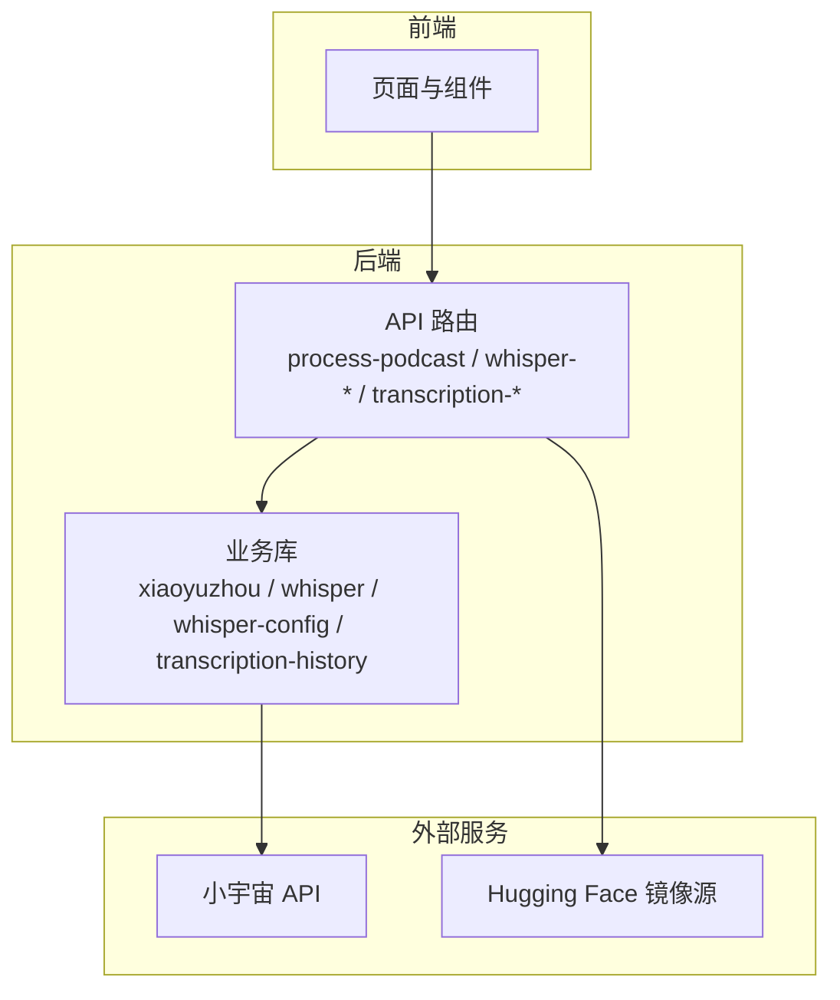
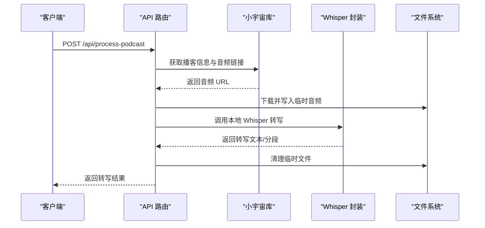
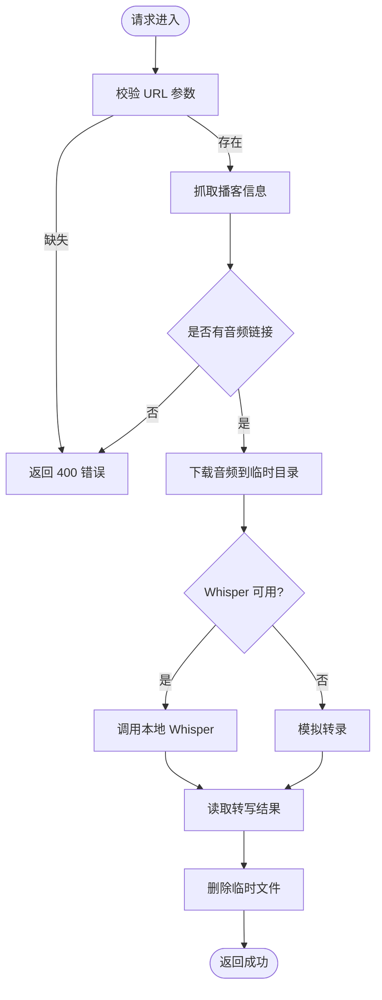
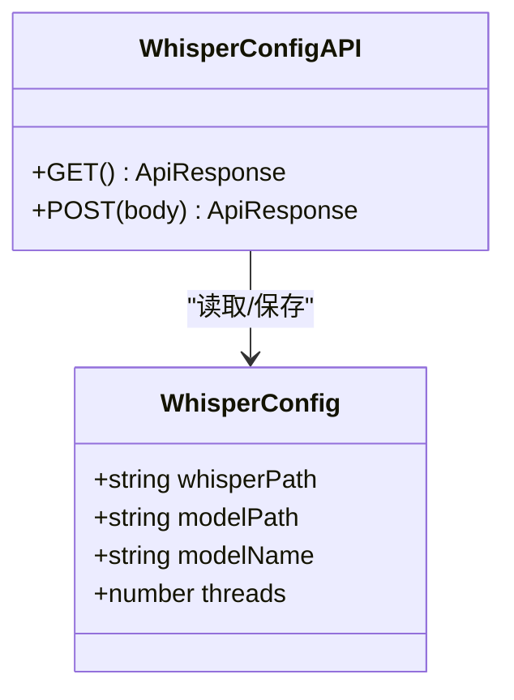
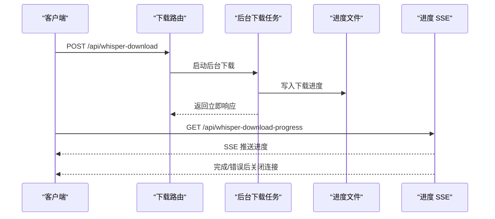
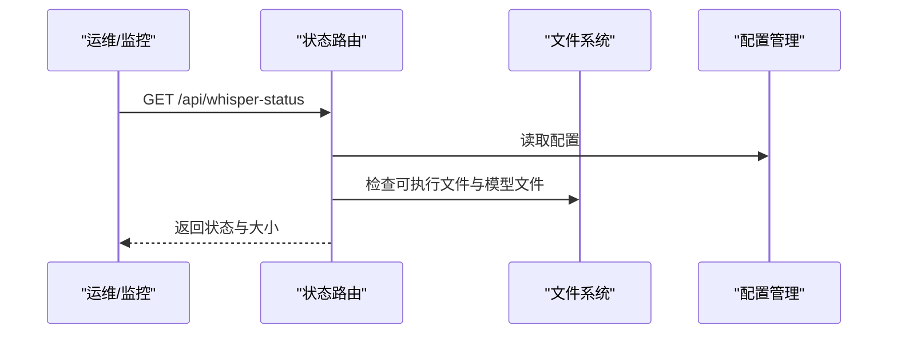
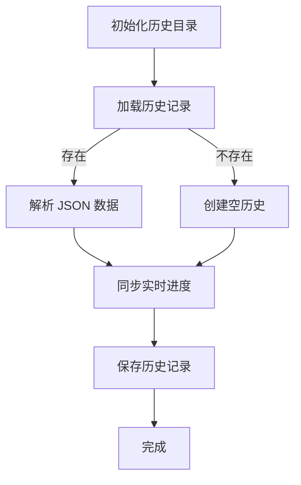
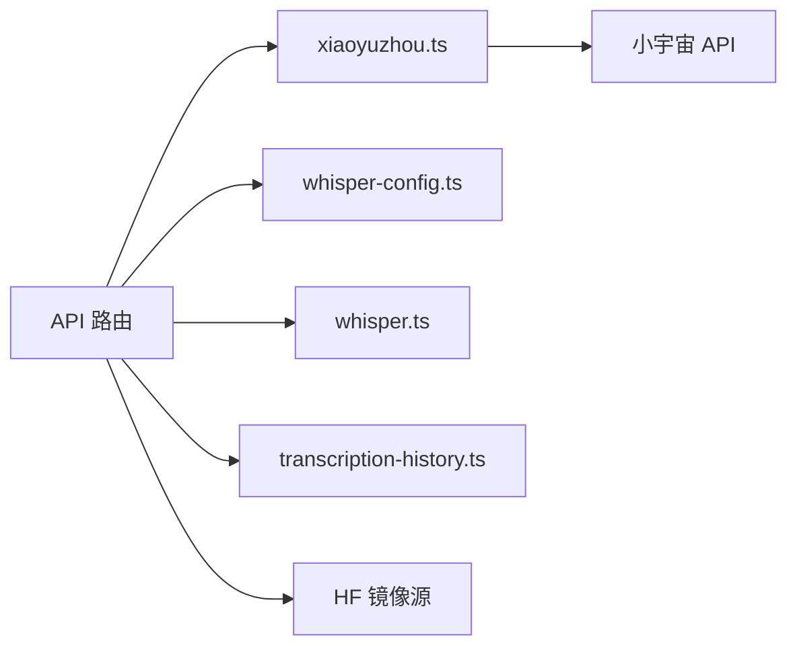

# 监控与日志

<cite>
**本文引用的文件**
- [README.md](file://README.md)
- [package.json](file://package.json)
- [next.config.mjs](file://next.config.mjs)
- [vercel.json](file://vercel.json)
- [src/types/index.ts](file://src/types/index.ts)
- [src/lib/whisper-config.ts](file://src/lib/whisper-config.ts)
- [src/lib/whisper.ts](file://src/lib/whisper.ts)
- [src/lib/xiaoyuzhou.ts](file://src/lib/xiaoyuzhou.ts)
- [src/lib/transcription-history.ts](file://src/lib/transcription-history.ts)
- [src/app/api/process-podcast/route.ts](file://src/app/api/process-podcast/route.ts)
- [src/app/api/transcribe-progress/route.ts](file://src/app/api/transcribe-progress/route.ts)
- [src/app/api/transcription-live/route.ts](file://src/app/api/transcription-live/route.ts)
- [src/app/api/transcription-history/route.ts](file://src/app/api/transcription-history/route.ts)
- [src/app/api/whisper-config/route.ts](file://src/app/api/whisper-config/route.ts)
- [src/app/api/whisper-download/route.ts](file://src/app/api/whisper-download/route.ts)
- [src/app/api/whisper-status/route.ts](file://src/app/api/whisper-status/route.ts)
</cite>

## 目录
1. [简介](#简介)
2. [项目结构](#项目结构)
3. [核心组件](#核心组件)
4. [架构总览](#架构总览)
5. [详细组件分析](#详细组件分析)
6. [依赖关系分析](#依赖关系分析)
7. [性能监控与最佳实践](#性能监控与最佳实践)
8. [日志系统配置与管理](#日志系统配置与管理)
9. [告警机制与通知](#告警机制与通知)
10. [故障排查指南](#故障排查指南)
11. [结论](#结论)

## 简介
本文件面向运维团队，提供 MemoFlow 的监控与日志管理手册。MemoFlow 是一个基于 Next.js 的应用，提供播客内容抓取、转写与分析功能。当前仓库中未内置通用的监控与日志采集框架，但已具备若干可用于健康检查与状态观测的 API 端点，以及基础的日志输出与错误记录。本文将基于现有实现，给出监控与日志的落地建议、性能观测要点、告警阈值与通知方案，以及常见问题的诊断思路。

## 项目结构
- 应用采用 Next.js App Router 结构，API 路由位于 src/app/api 下，业务逻辑集中在 src/lib 与页面组件中。
- 关键模块包括：播客抓取与解析、Whisper 配置与转写封装、模型下载与进度推送、转录历史管理。
- 部署配置通过 vercel.json 指定框架与构建命令，next.config.mjs 提供 Next.js 实验性配置。

图表来源
- [src/app/api/process-podcast/route.ts:1-522](file://src/app/api/process-podcast/route.ts#L1-L522)
- [src/lib/xiaoyuzhou.ts:1-219](file://src/lib/xiaoyuzhou.ts#L1-L219)
- [src/app/api/whisper-download/route.ts:1-235](file://src/app/api/whisper-download/route.ts#L1-L235)

章节来源
- [README.md:1-27](file://README.md#L1-L27)
- [vercel.json:1-10](file://vercel.json#L1-L10)
- [next.config.mjs:1-12](file://next.config.mjs#L1-L12)

## 核心组件
- 播客处理流程：接收播客链接 → 抓取元数据与音频 → 本地转写（可降级）→ 返回转写结果。
- Whisper 配置管理：读取/保存配置、合并环境变量、推断模型名、格式化文件大小。
- 模型下载与进度：触发下载 → 后台流式下载 → 进度持久化 → SSE 推送。
- 转录历史管理：本地文件系统存储转录记录，支持增删改查与实时状态同步。
- 健康检查端点：查询 Whisper 安装状态、模型状态、路径与大小等。

章节来源
- [src/app/api/process-podcast/route.ts:1-522](file://src/app/api/process-podcast/route.ts#L1-L522)
- [src/lib/whisper-config.ts:1-108](file://src/lib/whisper-config.ts#L1-L108)
- [src/lib/whisper.ts:1-142](file://src/lib/whisper.ts#L1-L142)
- [src/lib/transcription-history.ts:1-128](file://src/lib/transcription-history.ts#L1-L128)
- [src/app/api/whisper-download/route.ts:1-235](file://src/app/api/whisper-download/route.ts#L1-L235)
- [src/app/api/whisper-status/route.ts:1-60](file://src/app/api/whisper-status/route.ts#L1-L60)

## 架构总览
下图展示从用户请求到外部服务调用与本地处理的整体流程，并标注关键可观测点。

图表来源
- [src/app/api/process-podcast/route.ts:1-522](file://src/app/api/process-podcast/route.ts#L1-L522)
- [src/lib/xiaoyuzhou.ts:1-219](file://src/lib/xiaoyuzhou.ts#L1-L219)
- [src/lib/whisper.ts:1-142](file://src/lib/whisper.ts#L1-L142)

## 详细组件分析

### 组件 A：播客处理与转写
- 输入校验：要求提供播客链接；若缺失则返回 400。
- 数据获取：通过小宇宙库尝试多种策略获取音频链接。
- 本地转写：优先调用本地 Whisper；若不可用则降级为模拟转录。
- 资源清理：删除临时音频文件；对清理失败进行日志记录。
- 错误处理：捕获异常并返回统一结构，便于前端与监控系统识别。
- 实时进度：通过临时文件与 SSE 推送转录进度，支持断线重连。

图表来源
- [src/app/api/process-podcast/route.ts:1-522](file://src/app/api/process-podcast/route.ts#L1-L522)

章节来源
- [src/app/api/process-podcast/route.ts:1-522](file://src/app/api/process-podcast/route.ts#L1-L522)
- [src/lib/xiaoyuzhou.ts:1-219](file://src/lib/xiaoyuzhou.ts#L1-L219)
- [src/lib/whisper.ts:1-142](file://src/lib/whisper.ts#L1-L142)

### 组件 B：Whisper 配置管理
- 读取配置：默认值 + 文件持久化配置 + 环境变量覆盖。
- 保存配置：写入配置文件，返回合并后的配置。
- 校验规则：必填字段、线程数为正整数、模型名枚举校验。
- 工具函数：格式化文件大小、从模型路径推断模型名。

图表来源
- [src/types/index.ts:7-12](file://src/types/index.ts#L7-L12)
- [src/app/api/whisper-config/route.ts:1-125](file://src/app/api/whisper-config/route.ts#L1-L125)
- [src/lib/whisper-config.ts:1-108](file://src/lib/whisper-config.ts#L1-L108)

章节来源
- [src/app/api/whisper-config/route.ts:1-125](file://src/app/api/whisper-config/route.ts#L1-L125)
- [src/lib/whisper-config.ts:1-108](file://src/lib/whisper-config.ts#L1-L108)
- [src/types/index.ts:7-12](file://src/types/index.ts#L7-L12)

### 组件 C：模型下载与进度推送
- 触发下载：校验模型名，检查是否正在下载或已存在。
- 后台下载：流式读取响应体，定期写入进度文件，完成后更新配置。
- 进度推送：SSE 每秒推送一次，支持客户端断开清理。

图表来源
- [src/app/api/whisper-download/route.ts:1-235](file://src/app/api/whisper-download/route.ts#L1-L235)
- [src/app/api/transcribe-progress/route.ts:1-122](file://src/app/api/transcribe-progress/route.ts#L1-L122)

章节来源
- [src/app/api/whisper-download/route.ts:1-235](file://src/app/api/whisper-download/route.ts#L1-L235)
- [src/app/api/transcribe-progress/route.ts:1-122](file://src/app/api/transcribe-progress/route.ts#L1-L122)

### 组件 D：健康检查端点
- 查询 Whisper 安装状态、模型状态、路径与大小。
- 推断模型名，格式化文件大小。
- 异常时返回统一结构并记录错误日志。

图表来源
- [src/app/api/whisper-status/route.ts:1-60](file://src/app/api/whisper-status/route.ts#L1-L60)
- [src/lib/whisper-config.ts:1-108](file://src/lib/whisper-config.ts#L1-L108)

章节来源
- [src/app/api/whisper-status/route.ts:1-60](file://src/app/api/whisper-status/route.ts#L1-L60)

### 组件 E：转录历史管理
- 本地存储：使用操作系统临时目录存储转录历史文件。
- 实时同步：结合临时进度文件与历史记录，提供实时状态更新。
- 数据持久化：支持增删改查操作，自动处理日期格式转换。

图表来源
- [src/lib/transcription-history.ts:1-128](file://src/lib/transcription-history.ts#L1-L128)

章节来源
- [src/lib/transcription-history.ts:1-128](file://src/lib/transcription-history.ts#L1-L128)

## 依赖关系分析
- API 路由依赖业务库：xiaoyuzhou（抓取）、whisper（转写）、whisper-config（配置）、transcription-history（历史管理）。
- 外部依赖：小宇宙官方 API、第三方解析策略、Hugging Face 镜像源。
- 部署依赖：Next.js 框架、Vercel 平台配置。

图表来源
- [src/app/api/process-podcast/route.ts:1-522](file://src/app/api/process-podcast/route.ts#L1-L522)
- [src/lib/xiaoyuzhou.ts:1-219](file://src/lib/xiaoyuzhou.ts#L1-L219)
- [src/lib/whisper-config.ts:1-108](file://src/lib/whisper-config.ts#L1-L108)
- [src/lib/whisper.ts:1-142](file://src/lib/whisper.ts#L1-L142)
- [src/lib/transcription-history.ts:1-128](file://src/lib/transcription-history.ts#L1-L128)
- [src/app/api/whisper-download/route.ts:1-235](file://src/app/api/whisper-download/route.ts#L1-L235)

章节来源
- [package.json:1-37](file://package.json#L1-L37)
- [vercel.json:1-10](file://vercel.json#L1-L10)

## 性能监控与最佳实践
- 响应时间
  - 在 API 路由入口与关键步骤埋点，记录请求开始时间与结束时间，计算耗时并上报。
  - 关注外部依赖（小宇宙 API、HF 镜像源）的 RTT 与超时策略。
- 内存使用
  - 监控进程内存峰值，关注音频下载与转写阶段的内存占用。
  - 对大文件下载采用流式处理，避免一次性加载至内存。
- 并发处理
  - 控制并发下载与转写任务数量，避免 CPU/IO 抖动。
  - 利用队列或限流策略，保证系统稳定。
- 指标建议
  - 成功率、错误率、P50/P95/P99 响应时间、并发请求数、内存 RSS、CPU 使用率、磁盘空间。
  - Whisper 相关：模型加载耗时、转写耗时、线程数配置影响。

## 日志系统配置与管理
- 日志位置
  - 当前实现通过控制台输出错误与调试信息，例如配置读取失败、下载失败、转写失败等。
  - 转录进度通过临时文件持久化，支持实时 SSE 推送。
- 日志分类
  - 业务错误：输入参数缺失、外部接口失败、文件操作异常。
  - 系统错误：配置解析异常、文件写入/删除失败、子进程执行异常。
  - 进度日志：转录进度、下载进度、状态变更。
- 存储策略
  - 建议将控制台输出重定向至标准日志文件，结合平台日志收集器集中存储。
  - 对关键错误（如 Whisper 执行失败）增加结构化字段（请求 ID、URL、错误码、堆栈摘要）。
- 日志分析
  - 使用日志分析工具（如平台自带日志面板或 ELK）按时间序列查看错误趋势。
  - 常见指标：错误分布、错误 TopN、错误随时间变化曲线。

章节来源
- [src/lib/whisper-config.ts:65-84](file://src/lib/whisper-config.ts#L65-L84)
- [src/app/api/whisper-download/route.ts:147-166](file://src/app/api/whisper-download/route.ts#L147-L166)
- [src/app/api/process-podcast/route.ts:85-96](file://src/app/api/process-podcast/route.ts#L85-L96)
- [src/lib/transcription-history.ts:13-16](file://src/lib/transcription-history.ts#L13-L16)

## 告警机制与通知
- 告警维度
  - 健康检查失败：/api/whisper-status 返回错误或状态异常。
  - 下载失败：进度文件出现 error 状态且持续一定时间。
  - 处理失败：/api/process-podcast 返回 5xx 比例超过阈值。
  - 性能退化：P95 响应时间超过阈值、内存使用持续高位。
  - 进度异常：转录进度长时间无更新或停滞。
- 阈值建议
  - 健康检查：连续 3 次失败触发告警。
  - 下载：进度长时间无更新（>5 分钟）或 error 状态持续。
  - 处理：5xx 比例 > 5%，P95 响应时间 > 30 秒。
  - 性能：内存 RSS > 预设上限、CPU > 90% 持续 5 分钟。
  - 进度：转录进度超过 10 分钟无更新。
- 通知渠道
  - 平台自带告警通道（如邮件、Webhook）。
  - 集成企业 IM（如钉钉、飞书），区分严重与一般级别。

## 故障排查指南
- Whisper 未安装或模型缺失
  - 使用健康检查端点确认状态；若不可用，检查配置路径与模型文件是否存在。
  - 若需重新下载模型，先触发下载，再通过进度端点观察状态。
- 下载卡住或失败
  - 查看进度文件与控制台日志，确认网络连通性与镜像源可用性。
  - 如进度长时间不变，检查后台任务是否仍在运行。
- 转写失败或结果为空
  - 检查 Whisper 可执行文件权限与模型文件完整性。
  - 若本地不可用，确认降级逻辑是否生效。
- 处理播客失败
  - 核对播客链接格式与外部 API 可用性；查看抓取策略返回情况。
- 进度异常
  - 检查临时进度文件是否存在且可读。
  - 确认 SSE 连接是否正常建立与保持。
- 历史记录异常
  - 检查历史目录权限与磁盘空间。
  - 验证 JSON 文件格式与编码。

章节来源
- [src/app/api/whisper-status/route.ts:49-58](file://src/app/api/whisper-status/route.ts#L49-L58)
- [src/app/api/whisper-download/route.ts:178-184](file://src/app/api/whisper-download/route.ts#L178-L184)
- [src/app/api/transcribe-progress/route.ts:96-113](file://src/app/api/transcribe-progress/route.ts#L96-L113)
- [src/app/api/process-podcast/route.ts:107-113](file://src/app/api/process-podcast/route.ts#L107-L113)
- [src/lib/transcription-history.ts:24-50](file://src/lib/transcription-history.ts#L24-L50)

## 结论
- 当前仓库提供了基础的健康检查与状态观测能力，适合作为监控体系的起点。
- 建议补充统一的指标采集与告警机制，完善日志结构化与集中化存储，以支撑生产级运维。
- 通过合理的阈值与通知策略，可快速发现并定位问题，保障服务稳定性与用户体验。