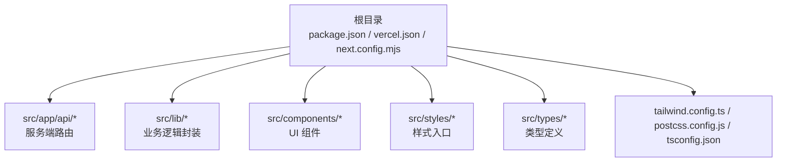
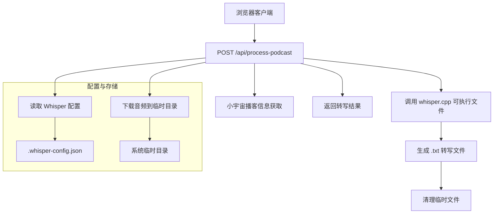
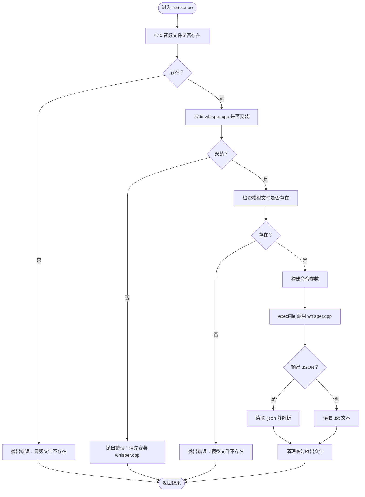
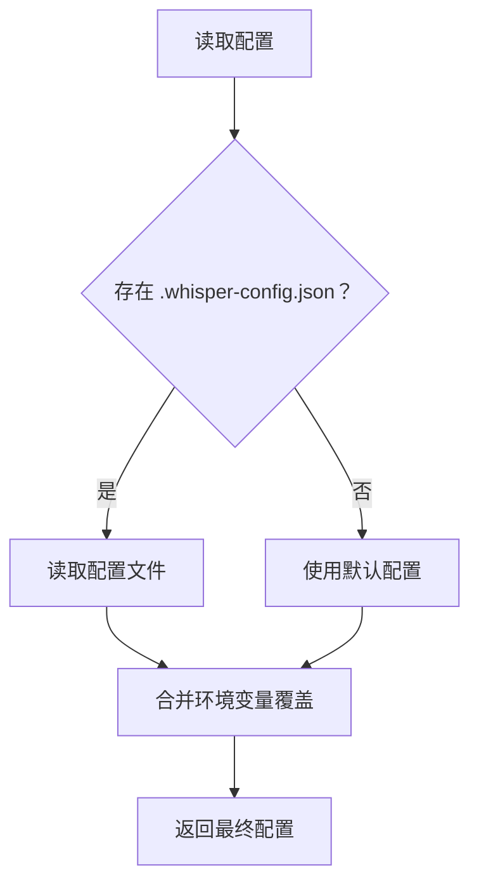
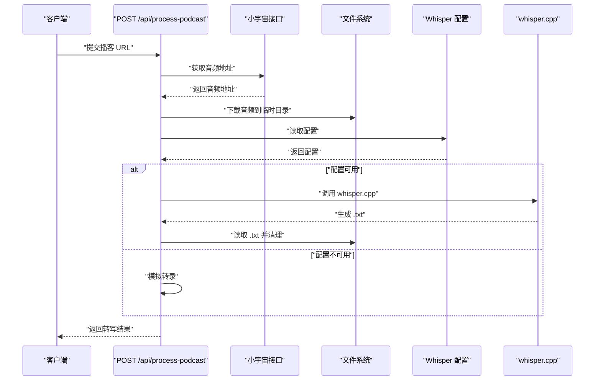
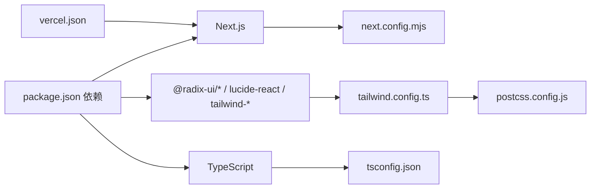

# 部署与运维

<cite>
**本文引用的文件**
- [package.json](file://package.json)
- [vercel.json](file://vercel.json)
- [next.config.mjs](file://next.config.mjs)
- [README.md](file://README.md)
- [setup-whisper.sh](file://setup-whisper.sh)
- [src/lib/whisper.ts](file://src/lib/whisper.ts)
- [src/lib/whisper-config.ts](file://src/lib/whisper-config.ts)
- [src/app/api/process-podcast/route.ts](file://src/app/api/process-podcast/route.ts)
- [src/app/api/whisper-config/route.ts](file://src/app/api/whisper-config/route.ts)
- [src/app/api/whisper-download/route.ts](file://src/app/api/whisper-download/route.ts)
- [src/types/index.ts](file://src/types/index.ts)
- [tailwind.config.ts](file://tailwind.config.ts)
- [postcss.config.js](file://postcss.config.js)
- [tsconfig.json](file://tsconfig.json)
</cite>

## 目录
1. [简介](#简介)
2. [项目结构](#项目结构)
3. [核心组件](#核心组件)
4. [架构总览](#架构总览)
5. [详细组件分析](#详细组件分析)
6. [依赖关系分析](#依赖关系分析)
7. [性能考虑](#性能考虑)
8. [故障排除指南](#故障排除指南)
9. [结论](#结论)
10. [附录](#附录)

## 简介
本文件面向运维与开发团队，提供 MemoFlow 的完整部署与运维指南。内容覆盖本地部署、Vercel 平台部署最佳实践、生产环境性能监控与日志管理、容器化与 Kubernetes 部署策略、自动化流水线、故障排除、备份与安全加固、性能优化建议等。

MemoFlow 是一个基于 Next.js 的应用，提供播客内容分析与转写能力，并通过 whisper.cpp 实现本地语音转写。应用具备 Web 界面与若干服务端 API，支持在 Vercel 等平台进行托管部署。

## 项目结构
- 应用框架：Next.js（App Router）
- 样式：Tailwind CSS + Tailwind CSS Animate
- 类型：TypeScript
- 构建与打包：Next.js 默认配置
- 平台：Vercel（framework: nextjs）

图表来源
- [package.json:1-37](file://package.json#L1-L37)
- [vercel.json:1-10](file://vercel.json#L1-L10)
- [next.config.mjs:1-12](file://next.config.mjs#L1-L12)
- [tailwind.config.ts:1-90](file://tailwind.config.ts#L1-L90)
- [postcss.config.js:1-7](file://postcss.config.js#L1-L7)
- [tsconfig.json:1-27](file://tsconfig.json#L1-L27)

章节来源
- [package.json:1-37](file://package.json#L1-L37)
- [vercel.json:1-10](file://vercel.json#L1-L10)
- [next.config.mjs:1-12](file://next.config.mjs#L1-L12)
- [tailwind.config.ts:1-90](file://tailwind.config.ts#L1-L90)
- [postcss.config.js:1-7](file://postcss.config.js#L1-L7)
- [tsconfig.json:1-27](file://tsconfig.json#L1-L27)

## 核心组件
- 语音转写模块：封装 whisper.cpp 的调用、模型检测、输出解析与临时文件清理
- Whisper 配置管理：读取/保存配置、合并环境变量、模型名推断与文件大小格式化
- 服务端 API：
  - 处理播客转写：拉取播客音频、下载到临时目录、调用 whisper.cpp 转写、清理临时文件
  - Whisper 配置接口：获取/保存配置
  - 模型下载接口：后台下载模型、记录进度、更新配置
- 构建与运行：Next.js 构建配置、Vercel 平台配置

章节来源
- [src/lib/whisper.ts:1-229](file://src/lib/whisper.ts#L1-L229)
- [src/lib/whisper-config.ts:1-105](file://src/lib/whisper-config.ts#L1-L105)
- [src/app/api/process-podcast/route.ts:1-127](file://src/app/api/process-podcast/route.ts#L1-L127)
- [src/app/api/whisper-config/route.ts:1-124](file://src/app/api/whisper-config/route.ts#L1-L124)
- [src/app/api/whisper-download/route.ts:1-235](file://src/app/api/whisper-download/route.ts#L1-L235)

## 架构总览
下图展示从客户端到服务端 API，再到 whisper.cpp 的整体调用链路与数据流。

图表来源
- [src/app/api/process-podcast/route.ts:13-114](file://src/app/api/process-podcast/route.ts#L13-L114)
- [src/lib/whisper-config.ts:54-89](file://src/lib/whisper-config.ts#L54-L89)
- [src/lib/whisper.ts:54-156](file://src/lib/whisper.ts#L54-L156)

## 详细组件分析

### 语音转写模块（whisper.ts）
- 功能要点
  - 检测 whisper.cpp 可执行文件与模型文件是否存在
  - 通过子进程调用 whisper.cpp，支持语言、JSON 输出、词级时间戳等参数
  - 解析 JSON 输出并提取文本与分段信息，清理临时输出文件
  - 提供快速转写（small 模型）能力
- 性能与资源
  - 可通过环境变量控制线程数，影响 CPU 占用与吞吐
  - 输出文件清理避免磁盘累积
- 错误处理
  - 文件不存在、执行失败、JSON 解析失败均抛出明确错误

图表来源
- [src/lib/whisper.ts:54-156](file://src/lib/whisper.ts#L54-L156)

章节来源
- [src/lib/whisper.ts:1-229](file://src/lib/whisper.ts#L1-L229)

### Whisper 配置管理（whisper-config.ts）
- 功能要点
  - 默认配置包含 whisper 可执行路径、模型路径、模型名、线程数
  - 支持从配置文件读取与保存，合并环境变量覆盖
  - 推断模型名、格式化文件大小
- 配置来源优先级
  - 环境变量 > 配置文件 > 默认值
- 典型用途
  - 在服务端 API 中读取配置，决定 whisper.cpp 调用参数

图表来源
- [src/lib/whisper-config.ts:54-89](file://src/lib/whisper-config.ts#L54-L89)

章节来源
- [src/lib/whisper-config.ts:1-105](file://src/lib/whisper-config.ts#L1-L105)
- [src/types/index.ts:7-22](file://src/types/index.ts#L7-L22)

### 服务端 API：处理播客转写（process-podcast/route.ts）
- 功能要点
  - 接收播客 URL，调用小宇宙接口获取音频地址
  - 下载音频到系统临时目录，调用 whisper.cpp 转写
  - 若 whisper 未配置，回退到模拟转录
  - 清理临时文件并返回结果
- 错误处理
  - 参数校验、网络请求失败、执行异常、文件删除失败均有相应错误码与日志

图表来源
- [src/app/api/process-podcast/route.ts:13-114](file://src/app/api/process-podcast/route.ts#L13-L114)
- [src/lib/whisper-config.ts:54-89](file://src/lib/whisper-config.ts#L54-L89)
- [src/lib/whisper.ts:54-156](file://src/lib/whisper.ts#L54-L156)

章节来源
- [src/app/api/process-podcast/route.ts:1-127](file://src/app/api/process-podcast/route.ts#L1-L127)

### 服务端 API：配置管理（whisper-config/route.ts）
- 功能要点
  - GET：返回合并后的配置
  - POST：校验请求体、验证字段与取值范围，保存配置并返回合并后结果
- 数据校验
  - 必填字段、threads 正整数、modelName 合法枚举值

章节来源
- [src/app/api/whisper-config/route.ts:1-124](file://src/app/api/whisper-config/route.ts#L1-L124)

### 服务端 API：模型下载（whisper-download/route.ts）
- 功能要点
  - 支持后台下载 small/medium 模型，记录进度文件，完成后更新配置
  - 防止重复下载，处理下载失败与不完整文件清理
- 进度与状态
  - 使用 models/.download-progress.json 记录状态、已下载字节、总大小、错误信息

章节来源
- [src/app/api/whisper-download/route.ts:1-235](file://src/app/api/whisper-download/route.ts#L1-L235)

## 依赖关系分析
- 构建与运行
  - Next.js 作为核心框架，支持 App Router、Server Actions 等特性
  - TypeScript、Tailwind CSS、PostCSS 配合使用
- 平台配置
  - Vercel 使用 Next.js 框架，指定安装/构建/开发命令与输出目录
- 外部依赖
  - whisper.cpp 可执行文件与模型文件由本地或后台下载提供
  - 小宇宙播客接口用于获取音频地址

图表来源
- [package.json:12-35](file://package.json#L12-L35)
- [next.config.mjs:1-12](file://next.config.mjs#L1-L12)
- [tsconfig.json:1-27](file://tsconfig.json#L1-L27)
- [tailwind.config.ts:1-90](file://tailwind.config.ts#L1-L90)
- [postcss.config.js:1-7](file://postcss.config.js#L1-L7)
- [vercel.json:1-10](file://vercel.json#L1-L10)

章节来源
- [package.json:1-37](file://package.json#L1-L37)
- [next.config.mjs:1-12](file://next.config.mjs#L1-L12)
- [tsconfig.json:1-27](file://tsconfig.json#L1-L27)
- [tailwind.config.ts:1-90](file://tailwind.config.ts#L1-L90)
- [postcss.config.js:1-7](file://postcss.config.js#L1-L7)
- [vercel.json:1-10](file://vercel.json#L1-L10)

## 性能考虑
- 构建与运行
  - Next.js 默认配置已启用严格模式与实验性 Server Actions 限制，有助于减少运行时开销
  - Tailwind CSS 已启用动画插件，注意在生产环境按需裁剪样式
- 语音转写
  - 线程数可通过环境变量调整，建议根据 CPU 核心数与并发量权衡设置
  - 模型选择：small 模型体积小、速度较快，medium 模型更准确但体积更大
- I/O 与临时文件
  - 临时目录与输出文件在转写后会清理，避免磁盘占用增长
- CDN 与静态资源
  - Vercel 默认提供全球 CDN 加速，建议开启压缩与缓存策略
- 日志与监控
  - 建议接入平台日志与指标采集（如 Vercel Logs、APM），对慢查询与错误率进行观测

[本节为通用性能建议，无需特定文件引用]

## 故障排除指南
- 本地部署
  - 环境要求：Node.js 版本与包管理器版本需满足 Next.js 要求
  - 安装依赖：确保安装命令成功执行
  - 启动应用：使用开发命令启动，确认端口未被占用
- Vercel 部署
  - 框架识别：确保 vercel.json 指定 framework 为 nextjs
  - 区域选择：regions 指定就近节点以降低延迟
  - 构建命令：确保 buildCommand 与 installCommand 正确
- Whisper 配置
  - 未找到 whisper.cpp：执行初始化脚本安装并设置环境变量
  - 模型文件缺失：通过模型下载接口下载或手动放置模型文件
  - 线程数异常：检查环境变量是否为正整数
- API 调用
  - 无法下载音频：检查播客 URL 有效性与网络连通性
  - whisper 执行失败：查看错误输出与日志，确认模型路径与权限
- 日志与诊断
  - 查看平台日志与错误堆栈，定位具体失败环节
  - 对高频错误建立告警与重试机制

章节来源
- [setup-whisper.sh:1-47](file://setup-whisper.sh#L1-L47)
- [vercel.json:1-10](file://vercel.json#L1-L10)
- [src/lib/whisper.ts:64-81](file://src/lib/whisper.ts#L64-L81)
- [src/app/api/process-podcast/route.ts:17-32](file://src/app/api/process-podcast/route.ts#L17-L32)

## 结论
本部署与运维文档提供了从本地到云端、从单机到容器化的完整实践路径。结合 Vercel 平台优势与 Next.js 生态，MemoFlow 可实现快速迭代与稳定交付。建议在生产环境中完善监控、日志、备份与安全策略，并持续优化模型与并发参数以获得最佳性能。

[本节为总结性内容，无需特定文件引用]

## 附录

### 本地部署流程
- 环境准备
  - 安装 Node.js 与包管理器
  - 准备 whisper.cpp 与模型文件（可使用初始化脚本）
- 依赖安装
  - 执行安装命令
- 启动配置
  - 设置必要的环境变量（如 whisper.cpp 路径、模型路径、线程数）
  - 使用开发命令启动应用
- 验证
  - 访问页面并调用相关 API 进行功能验证

章节来源
- [setup-whisper.sh:1-47](file://setup-whisper.sh#L1-L47)
- [package.json:5-10](file://package.json#L5-L10)
- [src/lib/whisper-config.ts:37-46](file://src/lib/whisper-config.ts#L37-L46)

### Vercel 平台部署最佳实践
- 配置文件
  - framework 指定为 nextjs
  - install/build/dev 命令与输出目录正确
  - regions 指定就近节点
- 环境变量
  - 在平台面板设置 whisper.cpp 路径、模型路径、线程数等
- 构建优化
  - 启用压缩与缓存，合理配置 ISR/SSR 策略
- CDN 设置
  - 利用平台提供的全球 CDN，确保静态资源与动态请求就近访问

章节来源
- [vercel.json:1-10](file://vercel.json#L1-L10)
- [next.config.mjs:1-12](file://next.config.mjs#L1-L12)

### 生产环境性能监控与日志管理
- 监控指标
  - 请求量、响应时间、错误率、模型下载进度与成功率
- 日志管理
  - 平台日志集中收集与检索，关键错误与慢查询单独告警
- 资源治理
  - 控制并发与线程数，避免 CPU 与内存峰值过高

[本节为通用运维建议，无需特定文件引用]

### 容器化部署（Docker）与 Kubernetes 部署策略
- Docker 镜像
  - 基于 Node.js 运行时镜像，复制依赖与源码，设置工作目录与环境变量，暴露端口并使用启动命令
- Kubernetes
  - 使用 Deployment 管理副本，Service 暴露服务，ConfigMap/Secret 管理配置与密钥
  - 为 whisper.cpp 与模型文件挂载持久卷或只读卷，确保可读性与稳定性
  - 配置 HPA 根据 CPU/自定义指标自动扩缩容

[本节为通用容器化与 K8s 策略，无需特定文件引用]

### 自动化部署流水线
- 触发条件
  - 主分支推送、标签创建、PR 合并
- 步骤建议
  - 代码检出、依赖安装、构建、测试、构建镜像、推送镜像、部署到目标环境
  - 部署后健康检查与灰度发布策略
- 安全
  - 密钥与令牌使用平台安全存储，镜像扫描与漏洞检测

[本节为通用流水线设计，无需特定文件引用]

### 备份策略、安全加固与性能优化建议
- 备份
  - 配置文件、模型文件、进度文件定期备份至对象存储
- 安全
  - 最小权限原则、只读挂载、网络策略隔离、TLS 终止与证书轮换
- 性能
  - 选择合适模型与线程数、启用压缩与缓存、CDN 与边缘计算、数据库连接池与索引优化

[本节为通用安全部署建议，无需特定文件引用]