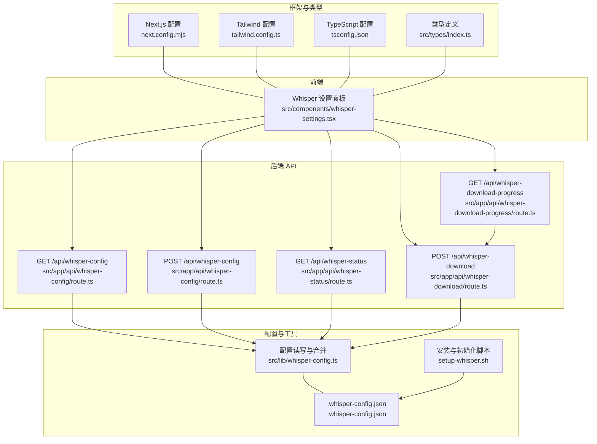
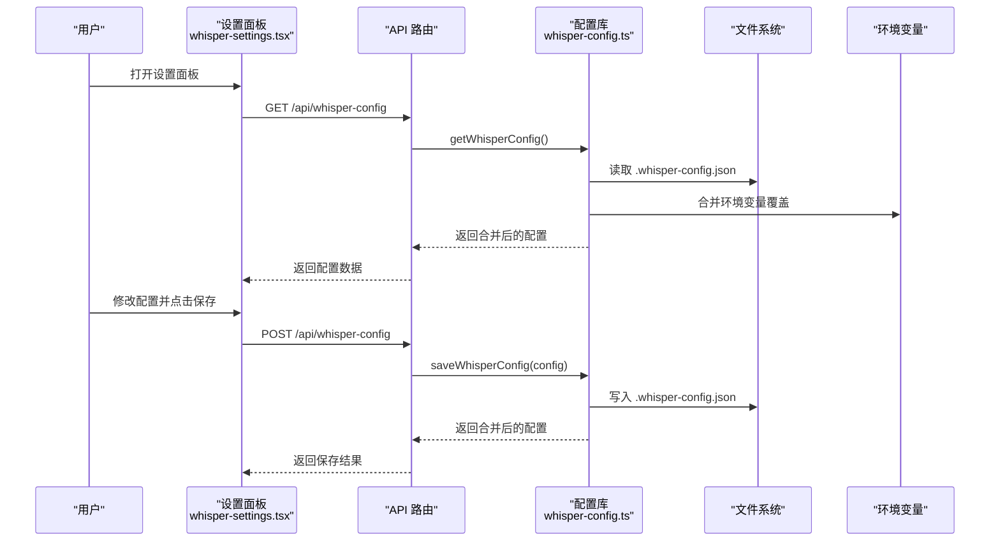
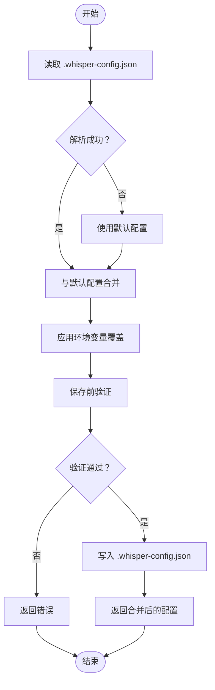
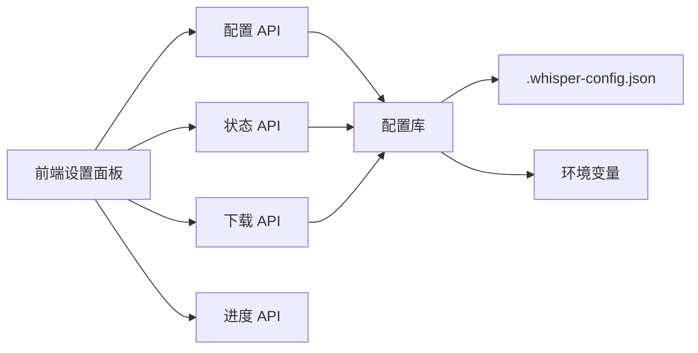

# 配置管理

<cite>
**本文引用的文件**
- [.whisper-config.json](file://.whisper-config.json)
- [src/lib/whisper-config.ts](file://src/lib/whisper-config.ts)
- [src/components/whisper-settings.tsx](file://src/components/whisper-settings.tsx)
- [src/app/api/whisper-config/route.ts](file://src/app/api/whisper-config/route.ts)
- [src/app/api/whisper-download/route.ts](file://src/app/api/whisper-download/route.ts)
- [src/app/api/whisper-download-progress/route.ts](file://src/app/api/whisper-download-progress/route.ts)
- [src/app/api/whisper-status/route.ts](file://src/app/api/whisper-status/route.ts)
- [src/types/index.ts](file://src/types/index.ts)
- [setup-whisper.sh](file://setup-whisper.sh)
- [next.config.mjs](file://next.config.mjs)
- [tailwind.config.ts](file://tailwind.config.ts)
- [tsconfig.json](file://tsconfig.json)
- [package.json](file://package.json)
</cite>

## 目录
1. [简介](#简介)
2. [项目结构](#项目结构)
3. [核心组件](#核心组件)
4. [架构总览](#架构总览)
5. [详细组件分析](#详细组件分析)
6. [依赖分析](#依赖分析)
7. [性能考虑](#性能考虑)
8. [故障排查指南](#故障排查指南)
9. [结论](#结论)
10. [附录](#附录)

## 简介
本文件面向系统管理员与开发者，提供 MemoFlow 配置管理系统的完整指南。重点涵盖 Whisper 配置文件的结构与参数、配置加载/验证/更新流程、不同环境下的配置策略、性能优化建议、配置迁移与版本升级方案，以及与 Next.js、Tailwind CSS、TypeScript 等配置文件的集成关系。

## 项目结构
MemoFlow 的配置体系围绕“本地配置文件 + 运行时环境变量 + API 接口 + 前端设置面板”构建，形成“文件持久化 + 运行时覆盖 + 可视化管理”的闭环。

图表来源
- [src/components/whisper-settings.tsx](file://src/components/whisper-settings.tsx)
- [src/app/api/whisper-config/route.ts](file://src/app/api/whisper-config/route.ts)
- [src/app/api/whisper-status/route.ts](file://src/app/api/whisper-status/route.ts)
- [src/app/api/whisper-download/route.ts](file://src/app/api/whisper-download/route.ts)
- [src/app/api/whisper-download-progress/route.ts](file://src/app/api/whisper-download-progress/route.ts)
- [src/lib/whisper-config.ts](file://src/lib/whisper-config.ts)
- [.whisper-config.json](file://.whisper-config.json)
- [setup-whisper.sh](file://setup-whisper.sh)
- [next.config.mjs](file://next.config.mjs)
- [tailwind.config.ts](file://tailwind.config.ts)
- [tsconfig.json](file://tsconfig.json)
- [src/types/index.ts](file://src/types/index.ts)

章节来源
- [src/components/whisper-settings.tsx](file://src/components/whisper-settings.tsx)
- [src/app/api/whisper-config/route.ts](file://src/app/api/whisper-config/route.ts)
- [src/app/api/whisper-status/route.ts](file://src/app/api/whisper-status/route.ts)
- [src/app/api/whisper-download/route.ts](file://src/app/api/whisper-download/route.ts)
- [src/app/api/whisper-download-progress/route.ts](file://src/app/api/whisper-download-progress/route.ts)
- [src/lib/whisper-config.ts](file://src/lib/whisper-config.ts)
- [.whisper-config.json](file://.whisper-config.json)
- [setup-whisper.sh](file://setup-whisper.sh)
- [next.config.mjs](file://next.config.mjs)
- [tailwind.config.ts](file://tailwind.config.ts)
- [tsconfig.json](file://tsconfig.json)
- [src/types/index.ts](file://src/types/index.ts)

## 核心组件
- Whisper 配置文件与默认值：位于根目录的本地 JSON 文件，定义 whisper.cpp 可执行文件路径、模型文件路径、模型名称与线程数等关键参数。
- 配置读写与合并：通过库函数实现文件读取、默认值合并、环境变量覆盖、保存与模型名推断。
- 前端设置面板：提供可视化界面，支持模型选择、下载、高级设置（路径、线程数），并展示安装状态与下载进度。
- API 层：提供配置读取/保存、状态查询、模型下载触发与进度推送（SSE）。
- 类型定义：统一前后端配置与状态的数据结构，保证一致性与可维护性。
- 初始化脚本：自动化安装 whisper.cpp、准备模型目录与默认模型，便于快速部署。

章节来源
- [.whisper-config.json](file://.whisper-config.json)
- [src/lib/whisper-config.ts](file://src/lib/whisper-config.ts)
- [src/components/whisper-settings.tsx](file://src/components/whisper-settings.tsx)
- [src/app/api/whisper-config/route.ts](file://src/app/api/whisper-config/route.ts)
- [src/app/api/whisper-status/route.ts](file://src/app/api/whisper-status/route.ts)
- [src/app/api/whisper-download/route.ts](file://src/app/api/whisper-download/route.ts)
- [src/app/api/whisper-download-progress/route.ts](file://src/app/api/whisper-download-progress/route.ts)
- [src/types/index.ts](file://src/types/index.ts)
- [setup-whisper.sh](file://setup-whisper.sh)

## 架构总览
下图展示了“前端设置面板 -> API -> 配置库 -> 文件/环境变量”的整体调用链路与数据流向。

图表来源
- [src/components/whisper-settings.tsx](file://src/components/whisper-settings.tsx)
- [src/app/api/whisper-config/route.ts](file://src/app/api/whisper-config/route.ts)
- [src/lib/whisper-config.ts](file://src/lib/whisper-config.ts)

章节来源
- [src/components/whisper-settings.tsx](file://src/components/whisper-settings.tsx)
- [src/app/api/whisper-config/route.ts](file://src/app/api/whisper-config/route.ts)
- [src/lib/whisper-config.ts](file://src/lib/whisper-config.ts)

## 详细组件分析

### Whisper 配置文件结构与参数
- 文件位置：根目录本地 JSON 文件，用于持久化配置。
- 参数说明：
  - whisperPath：whisper.cpp 可执行文件绝对或相对路径。
  - modelPath：模型文件绝对或相对路径。
  - modelName：模型名称标识（如 small、medium 等），用于 UI 与逻辑识别。
  - threads：转录线程数，影响并发与资源占用。
- 默认值：若配置文件缺失或读取失败，使用库中的默认值回退。
- 环境变量覆盖：运行时可通过环境变量对部分关键参数进行覆盖，优先级高于文件配置。

章节来源
- [.whisper-config.json](file://.whisper-config.json)
- [src/lib/whisper-config.ts](file://src/lib/whisper-config.ts)
- [src/types/index.ts](file://src/types/index.ts)

### 配置加载、验证与更新机制
- 加载流程：
  - 读取本地配置文件；解析失败则回退默认值。
  - 将文件配置与默认值进行浅合并。
  - 应用环境变量覆盖，最终返回合并后的配置。
- 验证规则（保存时）：
  - 请求体必须为有效 JSON 对象。
  - 必填字段：whisperPath、modelPath、modelName、threads。
  - threads 必须为正整数。
  - modelName 必须在允许集合内。
- 更新流程：
  - 保存到本地配置文件（不包含环境变量）。
  - 返回合并后的配置（含环境变量覆盖）。

图表来源
- [src/lib/whisper-config.ts](file://src/lib/whisper-config.ts)
- [src/app/api/whisper-config/route.ts](file://src/app/api/whisper-config/route.ts)

章节来源
- [src/lib/whisper-config.ts](file://src/lib/whisper-config.ts)
- [src/app/api/whisper-config/route.ts](file://src/app/api/whisper-config/route.ts)

### 不同环境下的配置管理策略
- 开发环境：
  - 使用本地配置文件与默认值作为基线。
  - 通过环境变量覆盖关键路径与线程数，便于在不同机器上快速适配。
- 测试环境：
  - 保持与开发一致的覆盖策略，但将模型与可执行文件指向测试专用目录，避免污染本地环境。
- 生产环境：
  - 优先通过环境变量进行覆盖，避免直接修改本地配置文件。
  - 结合容器或平台变量注入，确保配置安全与可追溯。
- 共享策略：
  - 将敏感或与平台强相关的配置（如路径）放入环境变量，减少配置漂移风险。

章节来源
- [src/lib/whisper-config.ts](file://src/lib/whisper-config.ts)
- [src/app/api/whisper-config/route.ts](file://src/app/api/whisper-config/route.ts)

### 性能优化与调优参数
- 线程数（threads）：
  - 建议设置为 CPU 核心数的一半，避免过度竞争导致吞吐下降。
  - 过大可能导致上下文切换开销上升，过小则无法充分利用硬件能力。
- 模型选择：
  - 小模型（small）：速度更快，适合日常使用；大模型（medium/large）：精度更高，但体积更大、耗时更长。
- I/O 与缓存：
  - 模型文件尽量放置在本地 SSD，减少磁盘延迟。
  - 下载完成后及时更新配置，避免重复下载与路径不一致问题。

章节来源
- [src/components/whisper-settings.tsx](file://src/components/whisper-settings.tsx)
- [src/app/api/whisper-download/route.ts](file://src/app/api/whisper-download/route.ts)

### 配置迁移与版本升级
- 迁移策略：
  - 新增字段：旧配置文件缺少新字段时，使用默认值补齐；不强制要求一次性补齐，避免破坏现有功能。
  - 字段变更：若未来新增字段或调整校验规则，API 将在保存阶段进行兼容处理与报错提示。
- 版本升级：
  - 升级后优先检查环境变量覆盖是否仍有效。
  - 如需批量迁移，可在升级脚本中读取旧配置并写入新格式，同时保留环境变量覆盖。

章节来源
- [src/lib/whisper-config.ts](file://src/lib/whisper-config.ts)
- [src/app/api/whisper-config/route.ts](file://src/app/api/whisper-config/route.ts)

### 与其他配置文件的集成关系
- Next.js 配置（next.config.mjs）：
  - 控制 React 严格模式与实验特性（如服务器动作体大小限制），与 Whisper 配置无直接耦合，但影响运行时行为与资源限制。
- Tailwind CSS 配置（tailwind.config.ts）：
  - 定义主题、动画与内容扫描范围，与 Whisper 配置无关，但共同决定前端 UI 表现。
- TypeScript 配置（tsconfig.json）：
  - 统一模块解析、路径别名与严格模式，保证类型安全，不影响 Whisper 配置逻辑。
- 包管理（package.json）：
  - 声明依赖与脚本，间接影响运行环境与打包行为，与 Whisper 配置解耦。

章节来源
- [next.config.mjs](file://next.config.mjs)
- [tailwind.config.ts](file://tailwind.config.ts)
- [tsconfig.json](file://tsconfig.json)
- [package.json](file://package.json)

## 依赖分析
- 组件耦合：
  - 前端设置面板依赖 API；API 依赖配置库；配置库依赖文件系统与环境变量。
  - 类型定义被前后端共享，降低耦合与维护成本。
- 外部依赖：
  - 下载模型使用 Hugging Face 镜像源，受网络与镜像可用性影响。
  - 初始化脚本负责克隆仓库、编译与下载默认模型，简化部署流程。

图表来源
- [src/components/whisper-settings.tsx](file://src/components/whisper-settings.tsx)
- [src/app/api/whisper-config/route.ts](file://src/app/api/whisper-config/route.ts)
- [src/app/api/whisper-status/route.ts](file://src/app/api/whisper-status/route.ts)
- [src/app/api/whisper-download/route.ts](file://src/app/api/whisper-download/route.ts)
- [src/app/api/whisper-download-progress/route.ts](file://src/app/api/whisper-download-progress/route.ts)
- [src/lib/whisper-config.ts](file://src/lib/whisper-config.ts)
- [.whisper-config.json](file://.whisper-config.json)

章节来源
- [src/components/whisper-settings.tsx](file://src/components/whisper-settings.tsx)
- [src/app/api/whisper-config/route.ts](file://src/app/api/whisper-config/route.ts)
- [src/app/api/whisper-status/route.ts](file://src/app/api/whisper-status/route.ts)
- [src/app/api/whisper-download/route.ts](file://src/app/api/whisper-download/route.ts)
- [src/app/api/whisper-download-progress/route.ts](file://src/app/api/whisper-download-progress/route.ts)
- [src/lib/whisper-config.ts](file://src/lib/whisper-config.ts)

## 性能考虑
- I/O 与并发：
  - 下载模型采用流式读取与定期进度写入，避免频繁 I/O 与内存峰值。
  - SSE 推送进度，客户端按秒轮询，平衡实时性与服务器压力。
- 资源占用：
  - 线程数直接影响 CPU 与内存占用，建议结合硬件与业务负载动态调整。
- 网络稳定性：
  - 模型下载依赖外部镜像源，建议在网络条件不佳时提前下载或使用代理。

章节来源
- [src/app/api/whisper-download/route.ts](file://src/app/api/whisper-download/route.ts)
- [src/app/api/whisper-download-progress/route.ts](file://src/app/api/whisper-download-progress/route.ts)
- [src/components/whisper-settings.tsx](file://src/components/whisper-settings.tsx)

## 故障排查指南
- 配置读取失败：
  - 检查配置文件是否存在与权限是否正确；查看控制台错误日志。
  - 若文件损坏，回退至默认配置并重新保存。
- 保存失败：
  - 确认请求体为合法 JSON 对象且包含所有必填字段；threads 为正整数；modelName 在允许集合内。
  - 查看 API 返回的错误信息，修正后再试。
- 下载异常：
  - 检查网络连通性与镜像源可用性；确认目标路径可写；查看进度文件状态。
  - 若中途失败，清理不完整文件后重试。
- 状态显示异常：
  - 确认可执行文件与模型文件路径正确；必要时通过设置面板重新选择与保存。

章节来源
- [src/lib/whisper-config.ts](file://src/lib/whisper-config.ts)
- [src/app/api/whisper-config/route.ts](file://src/app/api/whisper-config/route.ts)
- [src/app/api/whisper-download/route.ts](file://src/app/api/whisper-download/route.ts)
- [src/app/api/whisper-download-progress/route.ts](file://src/app/api/whisper-download-progress/route.ts)
- [src/app/api/whisper-status/route.ts](file://src/app/api/whisper-status/route.ts)

## 结论
MemoFlow 的配置管理体系以本地 JSON 文件为基础，结合运行时环境变量覆盖与可视化设置面板，实现了灵活、可维护、可扩展的配置管理。通过严格的加载/验证/更新流程与 SSE 进度推送，系统在易用性与可靠性之间取得良好平衡。配合 Next.js、Tailwind CSS、TypeScript 等配置文件，整体开发体验与部署一致性得到保障。

## 附录

### API 定义与行为摘要
- GET /api/whisper-config
  - 功能：返回合并后的配置（含环境变量覆盖）。
  - 成功：返回配置对象。
  - 失败：返回错误信息与 500 状态码。
- POST /api/whisper-config
  - 功能：保存配置并返回合并后的配置。
  - 请求体：必须为 JSON 对象，包含必填字段与校验规则。
  - 成功：返回保存后的配置。
  - 失败：返回错误信息与 400/500 状态码。
- GET /api/whisper-status
  - 功能：返回 whisper.cpp 与模型的安装状态、模型大小与推断的模型名称。
  - 成功：返回状态对象。
  - 失败：返回错误信息与 500 状态码。
- POST /api/whisper-download
  - 功能：触发模型下载（后台执行），返回下载启动状态或已存在提示。
  - 参数：modelName（small/medium）。
  - 成功：返回成功信息。
  - 失败：返回错误信息与 400/409/500 状态码。
- GET /api/whisper-download-progress
  - 功能：SSE 推送下载进度，客户端按秒接收。
  - 成功：持续推送进度，完成后关闭连接。
  - 失败：返回空或错误状态。

章节来源
- [src/app/api/whisper-config/route.ts](file://src/app/api/whisper-config/route.ts)
- [src/app/api/whisper-status/route.ts](file://src/app/api/whisper-status/route.ts)
- [src/app/api/whisper-download/route.ts](file://src/app/api/whisper-download/route.ts)
- [src/app/api/whisper-download-progress/route.ts](file://src/app/api/whisper-download-progress/route.ts)

### 初始化与部署要点
- 使用初始化脚本自动克隆仓库、编译与下载默认模型，简化首次部署。
- 建议在 CI/CD 中预热模型与可执行文件，缩短冷启动时间。
- 生产环境优先通过环境变量覆盖路径，避免直接修改本地文件。

章节来源
- [setup-whisper.sh](file://setup-whisper.sh)