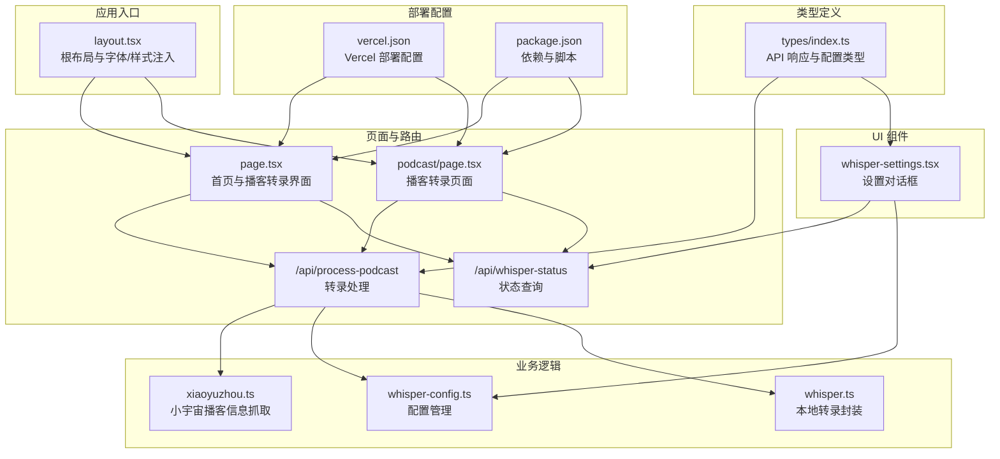
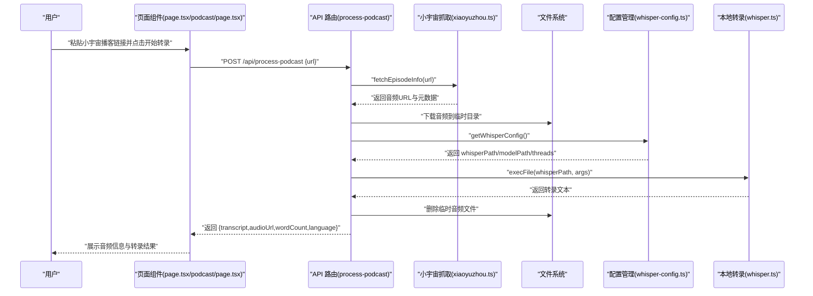
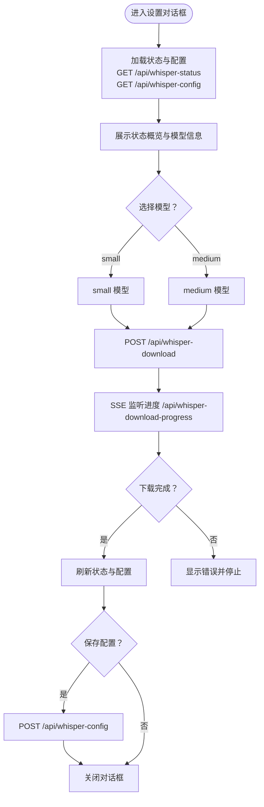
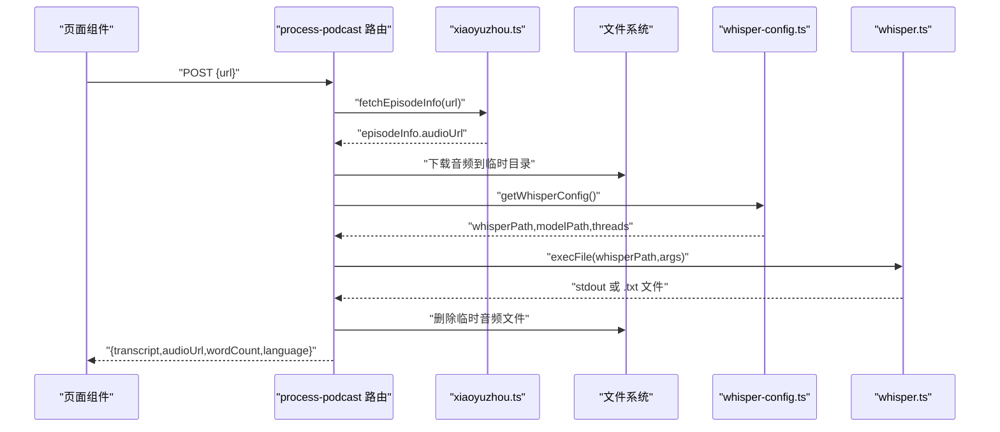
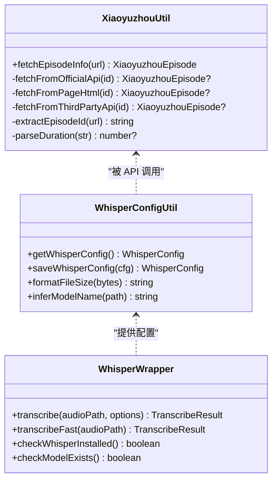
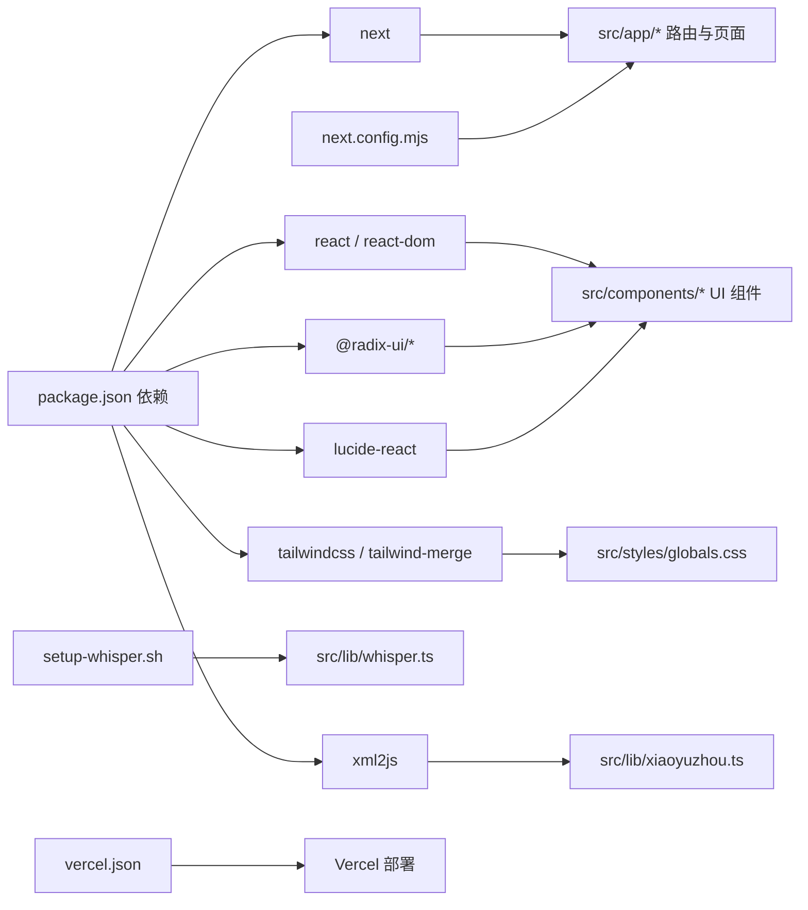

# 项目概述

<cite>
**本文档引用的文件**
- [README.md](file://README.md)
- [package.json](file://package.json)
- [vercel.json](file://vercel.json)
- [src/app/layout.tsx](file://src/app/layout.tsx)
- [src/app/page.tsx](file://src/app/page.tsx)
- [src/app/podcast/page.tsx](file://src/app/podcast/page.tsx)
- [src/app/api/process-podcast/route.ts](file://src/app/api/process-podcast/route.ts)
- [src/app/api/whisper-status/route.ts](file://src/app/api/whisper-status/route.ts)
- [src/lib/whisper.ts](file://src/lib/whisper.ts)
- [src/lib/whisper-config.ts](file://src/lib/whisper-config.ts)
- [src/lib/xiaoyuzhou.ts](file://src/lib/xiaoyuzhou.ts)
- [src/components/whisper-settings.tsx](file://src/components/whisper-settings.tsx)
- [src/types/index.ts](file://src/types/index.ts)
</cite>

## 更新摘要
**所做更改**
- 更新项目名称从 MemoFlow 到 Linksy 的完整重命名
- 更新包名为 linksy，替代原有的 memo-flow
- 更新元数据标题和描述，反映项目的新品牌标识
- 更新所有相关文档引用以保持一致性
- 保持技术架构和功能特性描述不变

## 目录
1. [引言](#引言)
2. [项目结构](#项目结构)
3. [核心组件](#核心组件)
4. [架构总览](#架构总览)
5. [详细组件分析](#详细组件分析)
6. [依赖关系分析](#依赖关系分析)
7. [性能考虑](#性能考虑)
8. [故障排除指南](#故障排除指南)
9. [结论](#结论)
10. [附录](#附录)

## 引言
Linksy 是一款面向内容消费者的 AI 驱动内容分析与创作助手，致力于帮助用户从多平台音视频内容中提取核心观点、生成结构化笔记，并支持进一步的二次创作。项目采用从"内容消费者"向"内容创作者"的理念转变，提供从链接输入到转录、解析、笔记生成的完整工作流。

- 产品定位：粘贴自媒体链接（YouTube/小宇宙/小红书/B 站等）→ AI 提取核心观点 → 生成笔记/二创内容
- 多平台支持：当前核心实现聚焦于小宇宙播客，后续规划扩展至 YouTube、小红书、B 站等
- AI 驱动：基于 whisper.cpp 的本地语音识别能力，结合播客元数据抓取，形成可编辑、可导出的转录文本
- 技术栈：Next.js、React、TypeScript、TailwindCSS，配合本地 C++ 语音识别引擎

**章节来源**
- [README.md:11-26](file://README.md#L11-L26)

## 项目结构
项目采用 Next.js App Router 的组织方式，前端 UI 组件与服务端 API 路由分离，核心逻辑集中在 lib 层封装工具模块，便于复用与测试。

**图表来源**
- [src/app/layout.tsx:10-13](file://src/app/layout.tsx#L10-L13)
- [src/app/page.tsx:12](file://src/app/page.tsx#L12)
- [src/app/podcast/page.tsx:22](file://src/app/podcast/page.tsx#L22)
- [src/app/api/process-podcast/route.ts:1-40](file://src/app/api/process-podcast/route.ts#L1-L40)
- [src/app/api/whisper-status/route.ts:11-66](file://src/app/api/whisper-status/route.ts#L11-L66)
- [src/lib/xiaoyuzhou.ts:1-251](file://src/lib/xiaoyuzhou.ts#L1-L251)
- [src/lib/whisper-config.ts:1-398](file://src/lib/whisper-config.ts#L1-L398)
- [src/lib/whisper.ts:1-261](file://src/lib/whisper.ts#L1-L261)
- [src/components/whisper-settings.tsx:1-800](file://src/components/whisper-settings.tsx#L1-L800)
- [src/types/index.ts:1-46](file://src/types/index.ts#L1-L46)
- [vercel.json:1-10](file://vercel.json#L1-L10)
- [package.json:1-40](file://package.json#L1-L40)

**章节来源**
- [src/app/layout.tsx:10-13](file://src/app/layout.tsx#L10-L13)
- [src/app/page.tsx:12](file://src/app/page.tsx#L12)
- [src/app/podcast/page.tsx:22](file://src/app/podcast/page.tsx#L22)
- [package.json:1-40](file://package.json#L1-L40)

## 核心组件
- 页面与交互
  - 首页与转录界面：负责接收播客链接、触发转录流程、展示音频信息与转录文本
  - 播客转录页面：专门的播客转录功能页面，支持实时进度跟踪和分段显示
  - 设置对话框：提供 Whisper 配置管理、模型下载和高级设置
- 服务端 API
  - 播客转录处理：拉取小宇宙音频、下载到临时目录、调用本地 whisper.cpp 转录、清理临时文件
  - Whisper 状态查询：检测 whisper.cpp 与模型安装状态、模型大小与名称
- 业务工具
  - 小宇宙播客信息抓取：多策略解析（官方 API、页面 HTML、第三方接口），稳定提取音频链接与元数据
  - Whisper 配置管理：读取/保存配置、环境变量覆盖、模型名称推断、文件大小格式化
  - 本地转录封装：封装 child_process 调用、参数构建、结果解析、临时文件清理
- 类型定义
  - API 响应结构、Whisper 配置与状态、转录结果与分段信息的 TypeScript 类型定义

**章节来源**
- [src/app/page.tsx:12](file://src/app/page.tsx#L12)
- [src/app/podcast/page.tsx:22](file://src/app/podcast/page.tsx#L22)
- [src/components/whisper-settings.tsx:1-800](file://src/components/whisper-settings.tsx#L1-L800)
- [src/app/api/process-podcast/route.ts:1-608](file://src/app/api/process-podcast/route.ts#L1-L608)
- [src/app/api/whisper-status/route.ts:11-66](file://src/app/api/whisper-status/route.ts#L11-L66)
- [src/lib/xiaoyuzhou.ts:1-251](file://src/lib/xiaoyuzhou.ts#L1-L251)
- [src/lib/whisper-config.ts:1-398](file://src/lib/whisper-config.ts#L1-L398)
- [src/lib/whisper.ts:1-261](file://src/lib/whisper.ts#L1-L261)
- [src/types/index.ts:1-46](file://src/types/index.ts#L1-L46)

## 架构总览
Linksy 采用前后端分离的 API 设计：前端 Next.js App Router 负责页面渲染与用户交互，服务端 API 路由负责业务处理与外部资源访问。核心流程围绕"小宇宙播客链接"展开：页面发起请求 → API 拉取音频 → 本地转录 → 返回结果。

**图表来源**
- [src/app/page.tsx:12](file://src/app/page.tsx#L12)
- [src/app/podcast/page.tsx:247-327](file://src/app/podcast/page.tsx#L247-L327)
- [src/app/api/process-podcast/route.ts:557-608](file://src/app/api/process-podcast/route.ts#L557-L608)
- [src/lib/xiaoyuzhou.ts:59-82](file://src/lib/xiaoyuzhou.ts#L59-L82)
- [src/lib/whisper-config.ts:324-354](file://src/lib/whisper-config.ts#L324-L354)
- [src/lib/whisper.ts:62-167](file://src/lib/whisper.ts#L62-L167)

## 详细组件分析

### 页面与交互组件
- 首页与转录流程
  - 表单校验与状态管理：URL 输入、加载状态、转录结果、音频信息、Toast 提示
  - 小宇宙链接校验：仅支持特定域名
  - Whisper 状态检查：确保程序与模型均已安装
  - API 调用与结果展示：音频信息卡片、播放器、转录文本（纯文本/格式化）
- 播客转录页面
  - 实时转录进度：支持 SSE 连接监听转录进度，显示阶段状态和实时分段
  - 进度跟踪：转录阶段指示器、进度条、实时文稿区域
  - 结果展示：音频信息卡片、播放器、转录内容（逐字稿/纯文本）
- 设置对话框（Whisper 设置）
  - 状态概览：whisper.cpp 安装状态、模型文件状态、模型大小与名称
  - 模型选择：small/medium 两种模型，显示体积与描述
  - 下载流程：POST 触发下载 → SSE 进度监听 → 成功后刷新状态
  - 高级设置：自定义 whisper.cpp 路径、模型路径、线程数
  - 保存配置：POST 到配置 API，持久化到本地配置文件

**图表来源**
- [src/components/whisper-settings.tsx:234-266](file://src/components/whisper-settings.tsx#L234-L266)
- [src/app/api/whisper-status/route.ts:11-66](file://src/app/api/whisper-status/route.ts#L11-L66)
- [src/lib/whisper-config.ts:324-354](file://src/lib/whisper-config.ts#L324-L354)

**章节来源**
- [src/app/page.tsx:12](file://src/app/page.tsx#L12)
- [src/app/podcast/page.tsx:22](file://src/app/podcast/page.tsx#L22)
- [src/components/whisper-settings.tsx:1-800](file://src/components/whisper-settings.tsx#L1-L800)

### 服务端 API 组件
- 播客转录处理（POST /api/process-podcast）
  - 参数校验：URL 必填
  - 小宇宙信息抓取：多策略解析，稳定提取音频 URL
  - 临时文件管理：创建临时目录、下载音频、转录后删除
  - Whisper 调用：读取配置、构建参数、执行转录、回退模拟转录
  - 结果返回：转录文本、音频 URL、字数、语言
- Whisper 状态查询（GET /api/whisper-status）
  - 检测 whisper.cpp 与模型文件存在性
  - 计算模型文件大小、推断模型名称
  - 返回结构化状态对象

**图表来源**
- [src/app/api/process-podcast/route.ts:557-608](file://src/app/api/process-podcast/route.ts#L557-L608)
- [src/lib/xiaoyuzhou.ts:59-82](file://src/lib/xiaoyuzhou.ts#L59-L82)
- [src/lib/whisper-config.ts:324-354](file://src/lib/whisper-config.ts#L324-L354)
- [src/lib/whisper.ts:62-167](file://src/lib/whisper.ts#L62-L167)

**章节来源**
- [src/app/api/process-podcast/route.ts:1-608](file://src/app/api/process-podcast/route.ts#L1-L608)
- [src/app/api/whisper-status/route.ts:11-66](file://src/app/api/whisper-status/route.ts#L11-L66)

### 业务工具组件
- 小宇宙播客信息抓取
  - 多策略尝试：官方 API、页面 HTML（__NEXT_DATA__、meta 标签）、第三方接口
  - 容错机制：任一策略成功即返回，否则抛出错误
  - 时长解析：支持多种格式（秒、MM:SS、HH:MM:SS）
- Whisper 配置管理
  - 默认配置：whisper.cpp/main 与 models/ggml-small.bin
  - 环境变量覆盖：WHISPER_PATH、WHISPER_MODEL_PATH、WHISPER_THREADS
  - 配置持久化：保存到 .whisper-config.json，返回合并后的配置
  - 辅助函数：文件大小格式化、模型名称推断
- 本地转录封装
  - 参数构建：模型路径、音频路径、语言、线程数、输出格式
  - 结果解析：JSON（含时间戳）与纯文本两种输出
  - 临时文件清理：转录完成后删除输出文件

**图表来源**
- [src/lib/xiaoyuzhou.ts:1-251](file://src/lib/xiaoyuzhou.ts#L1-L251)
- [src/lib/whisper-config.ts:1-398](file://src/lib/whisper-config.ts#L1-L398)
- [src/lib/whisper.ts:1-261](file://src/lib/whisper.ts#L1-L261)

**章节来源**
- [src/lib/xiaoyuzhou.ts:1-251](file://src/lib/xiaoyuzhou.ts#L1-L251)
- [src/lib/whisper-config.ts:1-398](file://src/lib/whisper-config.ts#L1-L398)
- [src/lib/whisper.ts:1-261](file://src/lib/whisper.ts#L1-L261)

### 类型定义系统
- API 响应结构：统一的 success/error 数据结构，支持泛型响应
- Whisper 配置与状态：完整的配置对象定义，包含路径、模型、线程数等
- 转录结果类型：分段信息、进度状态、音频元数据等类型定义
- 进度追踪类型：实时转录进度的数据结构，支持分段和百分比进度

**章节来源**
- [src/types/index.ts:1-46](file://src/types/index.ts#L1-L46)

## 依赖关系分析
- 前端依赖：Next.js、React、TailwindCSS、Radix UI 组件库、Lucide React 图标
- 类型定义：TypeScript 类型声明，统一 API 响应结构与 Whisper 配置/状态
- 构建与部署：Next.js 实验性配置启用 server actions 且限制请求体大小
- 本地环境：shell 脚本用于初始化 whisper.cpp 与模型，便于开发者快速上手

**图表来源**
- [package.json:12-36](file://package.json#L12-L36)
- [src/lib/xiaoyuzhou.ts:1-251](file://src/lib/xiaoyuzhou.ts#L1-L251)
- [src/lib/whisper.ts:1-261](file://src/lib/whisper.ts#L1-L261)
- [vercel.json:1-10](file://vercel.json#L1-L10)

**章节来源**
- [package.json:12-36](file://package.json#L12-L36)
- [vercel.json:1-10](file://vercel.json#L1-L10)

## 性能考虑
- 本地转录性能
  - 线程数配置：通过配置项控制 whisper.cpp 的线程数，建议设置为 CPU 核心数的一半
  - 模型选择：small 模型体积小、速度更快，medium 模型质量更高但体积更大
  - 临时文件管理：转录完成后及时清理，避免磁盘占用
- 网络与 I/O
  - 音频下载：使用临时目录存储，完成后立即删除，减少持久化开销
  - 多策略抓取：优先官方 API，失败后降级到页面解析与第三方接口，提升成功率
- 前端交互
  - 按需加载：设置对话框按需加载状态与配置，避免不必要的请求
  - 进度反馈：SSE 实时进度，提升用户体验
- 构建与运行
  - Next.js 实验性配置限制 server actions 请求体大小，有助于防止异常流量
  - TailwindCSS 按需扫描组件与页面，减少打包体积

## 故障排除指南
- Whisper 状态检查失败
  - 现象：页面提示"请配置 Whisper 模型"或"请下载语音识别模型"
  - 排查：确认 whisper.cpp 已编译、模型文件存在；可通过设置对话框查看状态
  - 处理：运行初始化脚本安装 whisper.cpp 与模型，或手动配置路径
- 转录失败
  - 现象：转录接口返回错误或模拟转录结果
  - 排查：检查网络连通性、音频 URL 可访问性、whisper.cpp 可执行权限
  - 处理：更换模型（small/medium）、调整线程数、确认临时目录可写
- 小宇宙链接无效
  - 现象：提示"请输入小宇宙播客链接"或"未能提取到音频链接"
  - 排查：确认链接格式包含 /episode/ 路径，检查页面 HTML 与第三方接口可用性
  - 处理：使用有效链接、稍后重试或切换到其他平台
- 设置对话框无法加载
  - 现象：加载状态长时间处于"加载中"
  - 排查：检查 API 状态接口与配置接口是否正常返回
  - 处理：刷新页面、检查网络、确认配置文件可读写

**章节来源**
- [src/app/page.tsx:12](file://src/app/page.tsx#L12)
- [src/app/podcast/page.tsx:247-327](file://src/app/podcast/page.tsx#L247-L327)
- [src/lib/xiaoyuzhou.ts:59-82](file://src/lib/xiaoyuzhou.ts#L59-L82)
- [src/components/whisper-settings.tsx:234-266](file://src/components/whisper-settings.tsx#L234-L266)

## 结论
Linksy 以"从内容消费者到内容创作者"的理念为核心，结合本地 whisper.cpp 语音识别能力与多策略的小宇宙播客信息抓取，构建了从链接输入到转录文本输出的完整工作流。项目采用 Next.js/React/TypeScript/TailwindCSS 技术栈，具备良好的可扩展性与可维护性。未来可在此基础上扩展更多平台支持（YouTube/小红书/B 站），并引入更丰富的 AI 内容分析与创作辅助功能，满足不同用户群体的使用场景。

## 附录
- 初始化与开发
  - 运行初始化脚本安装 whisper.cpp 与模型，设置环境变量后启动开发服务器
  - 使用设置对话框配置 whisper.cpp 路径、模型路径与线程数
- 类型定义参考
  - API 响应结构、Whisper 配置与状态、转录结果与分段信息

**章节来源**
- [src/types/index.ts:1-46](file://src/types/index.ts#L1-L46)