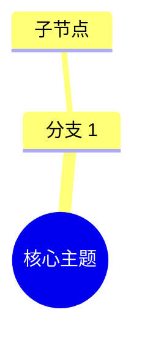

# 导出功能计划：IMA 笔记、Notion、Obsidian

**创建时间**：2026-04-17  
**状态**：规划中  
**优先级**：Phase 1 (IMA 笔记) → Phase 2 (Notion) → Phase 3 (Obsidian)

---

## 一、需求概述

在转录详情页添加统一导出入口，支持将转录内容（逐字稿、思维导图、关键观点）导出到外部笔记平台。

### 1.1 目标平台

| 平台 | 优先级 | 认证方式 | 实现难度 |
|------|--------|----------|----------|
| IMA 笔记 | Phase 1 | API Key | 低 |
| Notion | Phase 2 | OAuth 2.0 | 中 |
| Obsidian | Phase 3 | 无（本地） | 低 |

### 1.2 用户决策

| 决策点 | 选择 |
|--------|------|
| 导出入口 | 统一导出按钮（转录详情页顶栏） |
| 配置管理 | 统一配置面板（设置页） |
| 错误处理 | 重试机制 + 详细错误提示 |

---

## 二、现有数据结构

### 2.1 转录输出文件

存储路径：`~/Library/Application Support/MemoFlow/{任务名称}/`

| 文件 | 格式 | 说明 |
|------|------|------|
| `逐字稿.txt` | `MM:SS\t文本` | 带时间戳的转录文本 |
| `纯文本.txt` | 纯文本 | 无时间戳转录 |
| `思维导图.json` | simple-mind-map JSON | 结构化思维导图 |
| `content-points.json` | JSON | 关键观点提取 |
| `content-drafts.json` | JSON | 平台内容草稿 |

### 2.2 TranscriptionRecord 类型

```typescript
interface TranscriptionRecord {
  id: string;
  taskId: string;
  title: string;
  status: 'completed' | 'transcribing' | 'error' | ...;
  transcript?: string;
  segments: TranscribeSegment[];
  savedPath?: string;
  // ... 其他字段
}
```

---

## 三、技术架构

### 3.1 Provider 模式

```
helper/lib/export/
├── config-store.js           # 配置持久化 + 加密存储
├── export-provider-base.js   # Provider 抽象基类
├── provider-manager.js       # Provider 注册与管理
├── format-transformer.js     # 格式转换器
├── size-limiter.js           # 内容分片（防超限）
├── export-history.js         # 导出历史记录
└── providers/
    ├── ima-provider.js       # IMA 笔记
    ├── notion-provider.js    # Notion
    └── obsidian-provider.js  # Obsidian
```

### 3.2 后端 API 路由

| 路由 | 方法 | 功能 |
|------|------|------|
| `/export/providers` | GET | 获取可用平台列表 |
| `/export/:platform/config` | GET/PUT | 平台配置读写 |
| `/export/:platform/test` | POST | 测试连接 |
| `/export/:platform/execute` | POST | 执行导出 |
| `/export/:platform/oauth/start` | POST | 开始 OAuth（仅 Notion） |
| `/export/:platform/oauth/callback` | POST | OAuth 回调（仅 Notion） |

### 3.3 前端组件

```
src/components/export/
├── export-button.tsx           # 导出按钮（顶栏入口）
├── export-dialog.tsx           # 导出弹窗
├── platform-selector.tsx       # 平台选择
├── platform-config-panel.tsx   # 配置面板
├── export-progress.tsx         # 进度反馈
└── export-history-badge.tsx    # 导出状态徽章

src/
├── lib/export-client.ts        # 导出 API 客户端
├── types/export.ts             # 导出类型定义
└── components/app-settings/
    └── export-integration.tsx  # 设置页 - 导出集成配置
```

---

## 四、各平台详细设计

### 4.1 IMA 笔记（Phase 1）

#### 认证方式
- **类型**：API Key
- **凭证**：`IMA_OPENAPI_CLIENTID` + `IMA_OPENAPI_APIKEY`
- **获取方式**：https://ima.qq.com/agent-interface

#### API 端点
```
POST https://ima.qq.com/openapi/note/v1/import_doc
Headers:
  ima-openapi-clientid: {CLIENTID}
  ima-openapi-apikey: {APIKEY}
  Content-Type: application/json
Body:
  {
    "content_format": 1,
    "content": "Markdown 内容",
    "folder_id": "可选笔记本 ID"
  }
```

#### 导出格式（Markdown）
```markdown
# {播客标题}

## 概述
{摘要或主题}

## 逐字稿
[00:00] 第一段文本...
[00:15] 第二段文本...

## 关键观点

### 金句
> "{quote 文本}" — {timestamp}

### 传播观点
{观点内容}

## 思维导图


---
导出自 MemoFlow | {createdAt}
```

#### 限制与处理
- 单篇笔记大小上限：错误码 `100009`
- 处理策略：超过限制时自动分片，创建多篇笔记

---

### 4.2 Notion（Phase 2）

#### 认证方式
- **类型**：OAuth 2.0
- **流程**：
  1. 用户点击"连接 Notion"
  2. 跳转 Notion 授权页面
  3. 用户选择要授权的页面/数据库
  4. 返回 `access_token`（永不过期）
  5. 后端存储 `access_token`

#### API 端点
```
POST https://api.notion.com/v1/pages
Headers:
  Authorization: Bearer {access_token}
  Notion-Version: 2022-06-28
  Content-Type: application/json
```

#### 导出格式（Notion Block）
```javascript
{
  parent: { database_id: "xxx" },
  properties: {
    Title: { title: [{ text: { content: "{播客标题}" } }] },
    Date: { date: { start: "{createdAt}" } },
    Tags: { multi_select: [{ name: "transcription" }] }
  },
  children: [
    // heading_2: 概述
    // paragraph: 摘要
    // toggle: 逐字稿（可折叠）
    // heading_2: 关键观点
    // code: Mermaid 思维导图
  ]
}
```

#### 限制与处理
- Block 层级限制：需扁平化深层结构
- 请求频率限制：实现指数退避重试

---

### 4.3 Obsidian（Phase 3）

#### 实现方式
- **方案 A**：文件下载（优先实现）
  - 生成 Markdown 文件，浏览器自动下载
  - 用户手动放入 vault
  
- **方案 B**：直接写入（可选）
  - 用户配置 vault 路径
  - Tauri 直接写入本地文件系统

#### 导出格式（带 Frontmatter）
```markdown
---
title: {播客标题}
date: {createdAt}
tags: [transcription, podcast]
source: {audioUrl}
duration: {duration}s
wordCount: {wordCount}
---

# {播客标题}

## 概述
{摘要}

## 逐字稿
[00:00] 文本...

## 关键观点
> [!quote] 金句
> "{quote}"

## 思维导图

```

---

## 五、配置管理

### 5.1 配置文件结构

```json
// ~/Library/Application Support/MemoFlow/export-config.json
{
  "platforms": {
    "ima": {
      "clientId": "加密存储",
      "apiKey": "加密存储",
      "updatedAt": "2026-04-17T10:00:00Z"
    },
    "notion": {
      "accessToken": "加密存储",
      "workspaceName": "工作空间",
      "updatedAt": "2026-04-17T10:00:00Z"
    },
    "obsidian": {
      "vaultPath": "/path/to/vault",
      "autoExport": false
    }
  }
}
```

### 5.2 敏感信息加密

使用 `keytar`（跨平台密钥存储）或 `crypto`（主密码加密）：
```javascript
// helper/lib/export/config-store.js
const keytar = require('keytar');
const SERVICE_NAME = 'MemoFlow';

async function saveCredentials(platform, credentials) {
  await keytar.setPassword(SERVICE_NAME, platform, JSON.stringify(credentials));
}
```

---

## 六、错误处理

### 6.1 错误类型与提示

| 错误类型 | 错误码 | 用户提示 | 处理建议 |
|----------|--------|----------|----------|
| 平台未配置 | `PLATFORM_NOT_CONFIGURED` | "平台未配置，请先完成配置" | 引导至配置页 |
| 认证失败 | `AUTH_FAILED` | "API Key 已过期，请重新配置" | 重新配置 |
| 网络超时 | `NETWORK_TIMEOUT` | "网络超时，请重试" | 重试按钮 |
| 内容超限 | `CONTENT_TOO_LARGE` | "内容过长，已自动分片导出" | 自动分片 |
| 平台 API 错误 | `PLATFORM_ERROR` | "平台服务异常，请稍后重试" | 重试 + 记录日志 |

### 6.2 重试机制

```javascript
// 前端重试逻辑
async function exportWithRetry(platform, context, maxRetries = 2) {
  for (let i = 0; i < maxRetries; i++) {
    try {
      return await executeExport(platform, context);
    } catch (error) {
      if (error.code === 'NETWORK_TIMEOUT' && i < maxRetries - 1) {
        await sleep(1000 * (i + 1)); // 指数退避
        continue;
      }
      throw error;
    }
  }
}
```

---

## 七、导出状态追踪

### 7.1 类型定义

```typescript
// src/types/export.ts
export interface ExportHistory {
  platform: ExportPlatform;
  exportedAt: string;
  exportUrl?: string;
  status: 'success' | 'failed';
  errorMessage?: string;
}

// src/types/transcription-history.ts
export interface TranscriptionRecord {
  // ... 现有字段
  exportHistory?: ExportHistory[];
}
```

### 7.2 记录时机

- 导出成功：记录 `exportedAt` + `exportUrl`
- 导出失败：记录 `errorMessage`（可选）

---

## 八、实现计划

### Phase 1: IMA 笔记导出

**任务列表**：

| 任务 | 文件 | 预估时间 |
|------|------|----------|
| 配置存储 | `helper/lib/export/config-store.js` | 2h |
| IMA Provider | `helper/lib/export/providers/ima-provider.js` | 3h |
| Provider 基类 | `helper/lib/export/export-provider-base.js` | 2h |
| Provider 管理器 | `helper/lib/export/provider-manager.js` | 1h |
| 后端路由 | `helper/lib/http-handler.js` | 2h |
| 类型定义 | `src/types/export.ts` | 1h |
| 导出客户端 | `src/lib/export-client.ts` | 1h |
| 导出弹窗 | `src/components/export/export-dialog.tsx` | 3h |
| 配置面板 | `src/components/export/platform-config-panel.tsx` | 2h |
| 导出按钮 | `src/components/transcription-detail-tabs.tsx` | 1h |

**测试要点**：
- [ ] 正确获取 IMA API 凭证
- [ ] Markdown 格式正确
- [ ] 超限分片逻辑
- [ ] 错误提示准确

---

### Phase 2: Notion 导出

**额外任务**：
- OAuth 回调处理（Tauri 自定义协议）
- Notion Block 格式转换
- 思维导图 Mermaid 转换

---

### Phase 3: Obsidian 导出

**额外任务**：
- 文件下载功能
- （可选）本地文件写入

---

## 九、验证方式

### 9.1 手动测试

1. 配置 IMA API 凭证
2. 选择已完成的转录记录
3. 点击导出 → 选择 IMA
4. 检查 IMA 笔记中是否创建成功
5. 验证格式（标题、结构、Mermaid）

### 9.2 错误场景测试

1. 未配置凭证时导出 → 显示配置引导
2. 错误 API Key → 显示"认证失败"
3. 网络断开 → 显示"网络超时" + 重试按钮
4. 长文本导出 → 验证分片逻辑

---

## 十、风险与缓解

| 风险 | 影响 | 缓解措施 |
|------|------|----------|
| IMA API 限频 | 导出失败 | 实现重试 + 错误提示 |
| Mermaid 不支持复杂导图 | 渲染失败 | Fallback 到 PNG 附件链接 |
| OAuth 回调处理复杂 | 开发延期 | 优先实现 IMA，Notion 延后 |
| 内容超限 | 部分导出 | 自动分片 + 明确提示 |

---

## 附录

### A. IMA API 文档
https://ima.qq.com/agent-interface

### B. Notion API 文档
https://developers.notion.com/docs/create-a-notion-integration

### C. Obsidian Vault 结构
https://help.obsidian.md/Advanced+topics/How+data+is+stored
